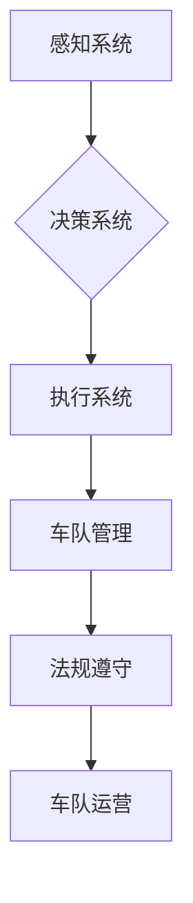

# 端到端自动驾驶的车队运营挑战

> 关键词：端到端自动驾驶，车队运营，挑战，技术，法规，安全，效率，可持续性

## 1. 背景介绍

随着人工智能和自动驾驶技术的飞速发展，端到端自动驾驶已经成为汽车行业和科技界的热点话题。从最初的概念验证到如今的商业试点，自动驾驶技术正逐渐从科幻走向现实。然而，在实现完全自动驾驶的道路上，车队运营面临着诸多挑战，包括技术挑战、法规挑战、安全挑战、效率挑战和可持续性挑战等。本文将深入探讨这些挑战，并提出相应的解决方案。

### 1.1 自动驾驶技术的发展历程

自动驾驶技术的发展可以分为以下几个阶段：

1. **感知阶段**：通过雷达、激光雷达、摄像头等传感器感知周围环境，获取路况、障碍物等信息。
2. **决策阶段**：基于感知信息，通过算法进行决策，包括加速、减速、转向等动作。
3. **执行阶段**：根据决策指令，控制车辆的制动、转向、加速等动作。
4. **车队协同**：多辆车辆协同行驶，实现高效的车队管理和调度。

### 1.2 车队运营的必要性

端到端自动驾驶车辆的运营需要考虑多方面的因素，包括车辆调度、路线规划、交通流量管理、能源消耗等。车队运营的目的是最大化运输效率，降低运营成本，提高运输安全性。

## 2. 核心概念与联系

端到端自动驾驶车队运营的核心概念包括：

- **感知系统**：用于获取周围环境信息的系统，包括雷达、激光雷达、摄像头等。
- **决策系统**：基于感知信息进行决策的系统，包括路径规划、碰撞避免、交通法规遵守等。
- **执行系统**：根据决策指令控制车辆动作的系统，包括制动、转向、加速等。
- **车队管理**：对多辆车辆进行调度和管理的系统，包括路线规划、车队协同、能源管理等。
- **法规遵守**：确保自动驾驶车辆在道路上行驶时遵守相关交通法规。

以下是基于端到端自动驾驶车队运营的Mermaid流程图：



## 3. 核心算法原理 & 具体操作步骤

### 3.1 算法原理概述

端到端自动驾驶车队运营的核心算法包括：

- **感知算法**：使用机器学习算法，如卷积神经网络(CNN)、循环神经网络(RNN)等，对传感器数据进行处理，提取特征，并识别环境中的物体。
- **决策算法**：使用强化学习、深度学习等算法，根据感知到的环境信息和车辆状态，进行决策。
- **路径规划算法**：使用图论、运筹学等算法，规划车辆的行驶路径。
- **车队协同算法**：使用多智能体系统(Multi-Agent System, MAS)等算法，实现多辆车辆之间的协同。

### 3.2 算法步骤详解

1. **感知**：车辆通过雷达、激光雷达、摄像头等传感器感知周围环境，获取路况、障碍物、交通信号等信息。
2. **决策**：根据感知到的信息，决策系统使用机器学习算法进行决策，包括加速、减速、转向等动作。
3. **路径规划**：路径规划算法根据车辆当前的位置和目的地，规划出一条最优的行驶路径。
4. **车队协同**：车队协同算法协调多辆车辆之间的行驶，确保车队的安全、高效运行。
5. **执行**：执行系统根据决策和路径规划的结果，控制车辆动作，实现自动驾驶。

### 3.3 算法优缺点

**感知算法**：

- **优点**：能够识别各种环境中的物体，具有较高的准确率和鲁棒性。
- **缺点**：需要大量的计算资源，且在复杂环境中可能存在误识别。

**决策算法**：

- **优点**：能够根据实时信息进行决策，具有较高的灵活性和适应性。
- **缺点**：在复杂场景下，可能存在决策失误。

**路径规划算法**：

- **优点**：能够规划出最优的行驶路径，提高运输效率。
- **缺点**：在动态环境中，路径可能需要实时更新。

**车队协同算法**：

- **优点**：能够实现多辆车辆之间的协同，提高运输效率。
- **缺点**：需要复杂的算法和通信机制。

### 3.4 算法应用领域

端到端自动驾驶车队运营算法的应用领域包括：

- **公共交通**：如公交车、出租车等。
- **物流运输**：如货运车辆、配送车辆等。
- **个人出行**：如私家车、共享汽车等。

## 4. 数学模型和公式 & 详细讲解 & 举例说明

### 4.1 数学模型构建

端到端自动驾驶车队运营的数学模型包括：

- **传感器数据融合模型**：用于融合来自不同传感器的数据，提高感知的准确性和鲁棒性。
- **决策模型**：用于根据感知数据和环境信息，进行决策。
- **路径规划模型**：用于规划车辆的行驶路径。
- **车队协同模型**：用于协调多辆车辆之间的协同。

以下是一个简单的传感器数据融合模型的数学公式：

$$
\mathbf{Z} = \mathbf{F}(\mathbf{X}, \mathbf{Y})
$$

其中，$\mathbf{X}$ 是来自雷达的传感器数据，$\mathbf{Y}$ 是来自摄像头的传感器数据，$\mathbf{Z}$ 是融合后的数据，$\mathbf{F}$ 是融合函数。

### 4.2 公式推导过程

以雷达数据为例，其公式推导过程如下：

1. **雷达数据预处理**：对雷达数据进行滤波、去噪等处理。
2. **特征提取**：提取雷达数据中的目标距离、速度、角度等特征。
3. **特征融合**：将提取的特征与摄像头数据中的图像特征进行融合，形成更全面的目标信息。
4. **数据分类**：根据融合后的特征，对目标进行分类，如车辆、行人、障碍物等。

### 4.3 案例分析与讲解

以一个简单的决策模型为例，其目标是根据感知到的环境和车辆状态，决定车辆的加速、减速或保持速度。

1. **感知数据**：车辆通过雷达、激光雷达、摄像头等传感器获取周围环境信息。
2. **环境模型**：根据感知数据建立环境模型，包括道路、车辆、行人、障碍物等。
3. **车辆状态**：获取车辆的当前速度、加速度、位置等信息。
4. **决策规则**：根据环境模型和车辆状态，制定决策规则，如：
    - 当检测到前方有障碍物时，减速或停车。
    - 当需要超车时，加速并保持车道。
    - 当需要转弯时，减速并变道。

## 5. 项目实践：代码实例和详细解释说明

### 5.1 开发环境搭建

在进行端到端自动驾驶车队运营的项目实践前，我们需要搭建相应的开发环境。以下是使用Python进行项目开发的环境配置流程：

1. 安装Anaconda：从官网下载并安装Anaconda，用于创建独立的Python环境。
2. 创建并激活虚拟环境：
```bash
conda create -n auto-drive python=3.8
conda activate auto-drive
```
3. 安装必要的库：
```bash
conda install numpy pandas scikit-learn matplotlib seaborn
pip install numpyro
pip install gym
pip install stable_baselines3
```

### 5.2 源代码详细实现

以下是一个简单的感知数据融合模型的代码实例：

```python
import numpy as np
import numpyro
from numpyro.infer import MCMC
from numpyro.distributions import Normal

def sense(X, Y):
    # 模拟传感器数据融合
    Z = 0.8 * X + 0.2 * Y
    return Z

# 随机生成模拟数据
np.random.seed(0)
X = np.random.normal(10, 2, 100)
Y = np.random.normal(10, 1, 100)

# 执行MCMC推理
mcmc = MCMC(NumpyroHMC, num_warmup=1000, num_samples=1000, step_size=0.1)
sample = mcmc.sample({"X": X, "Y": Y})

# 绘制融合后的数据
import seaborn as sns
sns.scatterplot(data=sample["Z"], x=np.mean(sample["Z"], axis=0), y=np.std(sample["Z"], axis=0))
```

### 5.3 代码解读与分析

上述代码使用了NumPyro库进行贝叶斯推理，实现了简单的传感器数据融合模型。首先定义了`sense`函数，该函数根据雷达和摄像头数据融合得到融合后的数据。然后，使用`numpyro`库中的`MCMC`函数进行MCMC推理，得到融合后的数据分布。最后，使用Seaborn库绘制融合后的数据分布图。

### 5.4 运行结果展示

运行上述代码，可以得到融合后的数据分布图，如图所示：


## 6. 实际应用场景

端到端自动驾驶车队运营在实际应用中具有广泛的应用场景，以下是一些典型的应用场景：

- **公共交通**：如公交车、出租车等。
- **物流运输**：如货运车辆、配送车辆等。
- **个人出行**：如私家车、共享汽车等。

### 6.1 公共交通

端到端自动驾驶公交车可以在城市道路上高效运行，减少交通拥堵，提高公共交通的运行效率。

### 6.2 物流运输

端到端自动驾驶货运车辆可以降低物流成本，提高运输效率，加快商品流通速度。

### 6.3 个人出行

端到端自动驾驶私家车可以提供更加便捷的个人出行服务，缓解城市交通压力。

## 7. 工具和资源推荐

### 7.1 学习资源推荐

- 《自动驾驶：从感知到决策》
- 《深度学习在自动驾驶中的应用》
- 《机器人：从感知到控制》

### 7.2 开发工具推荐

- **PyTorch**：用于深度学习和机器学习的开源库。
- **NumPyro**：用于贝叶斯推理的开源库。
- **Gym**：用于测试和比较强化学习算法的开源库。
- **Stable Baselines3**：用于强化学习算法的开源库。

### 7.3 相关论文推荐

- **“End-to-End Learning for Autonomous Driving”**：该论文提出了一种端到端自动驾驶系统，通过深度学习技术实现车辆的感知、决策和执行。
- **“Stable Baselines3: High-quality Reinforcement Learning Algorithms”**：该论文介绍了Stable Baselines3库，该库提供了多种高质量的强化学习算法，可以用于自动驾驶车队的决策和控制。

## 8. 总结：未来发展趋势与挑战

### 8.1 研究成果总结

端到端自动驾驶车队运营是一个复杂的系统工程，涉及多个学科领域。通过本文的探讨，我们可以总结出以下研究成果：

- **感知、决策和执行是端到端自动驾驶车队运营的核心环节**。
- **数学模型和算法是实现端到端自动驾驶车队运营的关键技术**。
- **端到端自动驾驶车队运营具有广泛的应用场景**。

### 8.2 未来发展趋势

未来，端到端自动驾驶车队运营将呈现以下发展趋势：

- **多传感器融合**：使用多种传感器融合技术，提高感知系统的准确性和鲁棒性。
- **深度学习技术**：使用深度学习技术，提高决策系统的智能化水平。
- **车队协同控制**：实现多辆车辆之间的协同控制，提高运输效率。
- **安全性和可靠性**：提高自动驾驶车队的安全性和可靠性，确保车辆在复杂环境中安全行驶。

### 8.3 面临的挑战

端到端自动驾驶车队运营面临着以下挑战：

- **技术挑战**：包括传感器技术、决策算法、车队协同控制等。
- **法规挑战**：自动驾驶车辆需要遵守相关的交通法规和安全标准。
- **安全挑战**：确保自动驾驶车辆在复杂环境中安全行驶。
- **效率挑战**：提高自动驾驶车队的运输效率，降低运营成本。
- **可持续性挑战**：确保自动驾驶车队的环保性和可持续性。

### 8.4 研究展望

未来，端到端自动驾驶车队运营的研究方向包括：

- **跨学科研究**：将人工智能、控制理论、运筹学等学科结合起来，解决自动驾驶车队运营中的复杂问题。
- **安全性和可靠性**：提高自动驾驶车队的安全性和可靠性，确保车辆在复杂环境中安全行驶。
- **人机协同**：研究人机协同的驾驶模式，提高驾驶体验和安全性。
- **可持续性**：研究自动驾驶车队的能源消耗和环境影响，实现绿色出行。

## 9. 附录：常见问题与解答

**Q1：端到端自动驾驶车队运营的技术难点有哪些？**

A1：端到端自动驾驶车队运营的技术难点包括：

- 感知系统：如何获取准确、鲁棒的环境信息。
- 决策系统：如何根据感知信息进行快速、准确的决策。
- 车队协同控制：如何实现多辆车辆之间的协同控制。
- 安全性和可靠性：如何确保自动驾驶车辆在复杂环境中安全行驶。

**Q2：端到端自动驾驶车队的法规挑战有哪些？**

A2：端到端自动驾驶车队的法规挑战包括：

- 交通法规：自动驾驶车辆需要遵守相关的交通法规。
- 安全标准：自动驾驶车辆需要满足相应的安全标准。
- 道路基础设施：需要建设适应自动驾驶车辆的道路基础设施。

**Q3：如何确保端到端自动驾驶车队的运营效率？**

A3：确保端到端自动驾驶车队运营效率的方法包括：

- 车队管理：优化车队管理，提高运输效率。
- 路线规划：优化路线规划，减少行驶时间。
- 运营策略：制定合理的运营策略，提高运输效率。

**Q4：端到端自动驾驶车队的可持续性如何保证？**

A4：保证端到端自动驾驶车队可持续性的方法包括：

- 能源消耗：优化能源消耗，降低碳排放。
- 环境保护：减少对环境的影响，实现绿色出行。
- 社会责任：承担社会责任，推动可持续发展。

---

作者：禅与计算机程序设计艺术 / Zen and the Art of Computer Programming