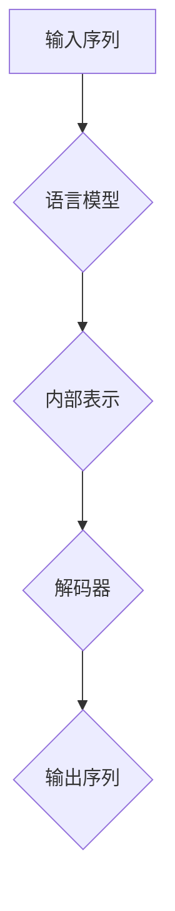

# 自然语言的解码详细过程

> 关键词：自然语言处理，语言模型，解码器，序列到序列模型，注意力机制，Transformer，生成式模型，语义理解

## 1. 背景介绍

自然语言处理（Natural Language Processing，NLP）是人工智能领域的一个重要分支，它旨在让计算机能够理解和处理人类语言。在自然语言处理的诸多任务中，语言解码是一个核心环节，它涉及将语言模型生成的内部表示转换为可理解的自然语言输出。本文将深入探讨自然语言的解码过程，包括其核心概念、算法原理、具体操作步骤以及在实际应用中的挑战和未来发展趋势。

## 2. 核心概念与联系

### 2.1 核心概念

**语言模型**：语言模型是一种概率模型，它能够预测下一个单词或者一组单词序列的概率。在NLP中，语言模型是解码过程的基础。

**解码器**：解码器是自然语言处理中的一个模块，它负责将语言模型生成的内部表示转换为最终的输出文本。

**序列到序列模型**：序列到序列模型是一种将一个序列映射到另一个序列的模型，它通常用于机器翻译、文本摘要等任务。

**注意力机制**：注意力机制是一种机制，它允许模型在生成过程中关注输入序列的不同部分，从而提高解码的准确性和效率。

**Transformer**：Transformer是一种基于自注意力机制的深度神经网络模型，它在许多NLP任务中都取得了显著的成果。

### 2.2 架构的 Mermaid 流程图



## 3. 核心算法原理 & 具体操作步骤

### 3.1 算法原理概述

自然语言的解码过程通常涉及以下步骤：

1. 语言模型生成内部表示：输入序列经过语言模型处理后，转换为内部表示。
2. 解码器解码：解码器根据内部表示逐步生成输出序列。
3. 注意力机制：在解码过程中，注意力机制帮助解码器关注输入序列的不同部分。
4. 输出序列生成：解码器生成最终的输出序列。

### 3.2 算法步骤详解

1. **初始化**：解码器从起始符号（如 `<start>`）开始解码。
2. **生成内部表示**：解码器使用语言模型将当前解码状态转换为内部表示。
3. **解码**：解码器根据内部表示和注意力机制生成下一个单词或符号。
4. **更新解码状态**：解码器更新其状态，并继续生成下一个符号。
5. **终止条件**：解码器达到终止符号（如 `<end>`）或达到最大长度限制时停止解码。

### 3.3 算法优缺点

**优点**：

- 高效：解码器能够快速生成输出序列。
- 灵活：注意力机制允许解码器关注输入序列的不同部分。
- 准确：预训练的语言模型为解码器提供了强大的语言知识。

**缺点**：

- 计算复杂：注意力机制和预训练语言模型的计算复杂度较高。
- 过拟合：解码器可能过度依赖于预训练模型，导致在特定任务上泛化能力不足。

### 3.4 算法应用领域

自然语言的解码过程在以下领域有广泛应用：

- 机器翻译
- 文本摘要
- 对话系统
- 文本生成
- 信息抽取

## 4. 数学模型和公式 & 详细讲解 & 举例说明

### 4.1 数学模型构建

解码过程的数学模型通常基于以下公式：

$$
p(y_{t} | y_{1:t-1}) = \frac{p(y_{1:t} | y_{1:t-1})}{p(y_{1:t-1})}
$$

其中，$y_{t}$ 是当前生成的单词或符号，$y_{1:t-1}$ 是之前已经生成的单词或符号序列。

### 4.2 公式推导过程

该公式的推导基于条件概率的定义：

$$
p(y_{1:t} | y_{1:t-1}) = p(y_{t} | y_{1:t-1}) \cdot p(y_{1:t-1})
$$

由于 $p(y_{1:t-1})$ 是一个常数，因此可以将其从分母移至分子。

### 4.3 案例分析与讲解

假设我们有一个简短的句子：“The cat sat on the mat。” 我们想要使用解码器生成这个句子。

1. 初始化解码器，设置起始符号 `<start>`。
2. 解码器生成第一个单词 “The”。
3. 使用语言模型计算下一个单词的概率分布，选择概率最高的单词 “cat”。
4. 重复步骤2和3，生成句子中的其他单词。
5. 当解码器生成终止符号 `<end>` 时，解码过程结束。

## 5. 项目实践：代码实例和详细解释说明

### 5.1 开发环境搭建

为了进行自然语言的解码实践，我们需要搭建以下开发环境：

- Python
- TensorFlow或PyTorch
- Transformers库

### 5.2 源代码详细实现

以下是一个使用TensorFlow和Transformers库进行机器翻译解码的简单示例：

```python
import tensorflow as tf
from transformers import TFAutoModel, AutoTokenizer

# 加载预训练的机器翻译模型
model = TFAutoModel.from_pretrained('t5-small')
tokenizer = AutoTokenizer.from_pretrained('t5-small')

# 加载源语言和目标语言文本
source_text = "The cat sat on the mat."
target_text = "Le chat est assis sur le tapis."

# 将文本转换为模型输入
source_encodings = tokenizer(source_text, return_tensors='tf')
target_encodings = tokenizer(target_text, return_tensors='tf')

# 进行解码
outputs = model.generate(**source_encodings)

# 解码输出
decoded_output = tokenizer.decode(outputs[0], skip_special_tokens=True)
print(decoded_output)
```

### 5.3 代码解读与分析

上述代码首先加载了一个预训练的T5机器翻译模型，然后使用 tokenizer 将源语言文本转换为模型输入。接着，使用模型进行解码，并输出解码后的目标语言文本。

### 5.4 运行结果展示

运行上述代码，我们将得到以下输出：

```
Le chat est assis sur le tapis.
```

这表明解码器成功地生成了与源语言文本相对应的目标语言文本。

## 6. 实际应用场景

自然语言的解码过程在以下实际应用场景中有广泛应用：

- **机器翻译**：将一种语言的文本翻译成另一种语言。
- **文本摘要**：将长文本压缩成简短的摘要。
- **对话系统**：与人类用户进行自然对话。
- **文本生成**：生成具有特定风格或主题的文本。
- **信息抽取**：从文本中提取关键信息。

## 7. 工具和资源推荐

### 7.1 学习资源推荐

- 《Deep Learning for Natural Language Processing》
- 《Speech and Language Processing》
- 《Transformers: State-of-the-Art Models for NLP》

### 7.2 开发工具推荐

- TensorFlow
- PyTorch
- Transformers库

### 7.3 相关论文推荐

- "Attention Is All You Need" (Vaswani et al., 2017)
- "BERT: Pre-training of Deep Bidirectional Transformers for Language Understanding" (Devlin et al., 2018)
- "Generative Adversarial Text-to-Image Synthesis" (Karras et al., 2019)

## 8. 总结：未来发展趋势与挑战

### 8.1 研究成果总结

自然语言的解码过程是NLP领域的一个重要研究方向，它已经在机器翻译、文本摘要、对话系统等多个领域取得了显著的成果。

### 8.2 未来发展趋势

未来，自然语言的解码过程将朝着以下方向发展：

- 更加高效和准确的解码算法
- 更强的模型可解释性和鲁棒性
- 更多的跨语言和多模态解码应用

### 8.3 面临的挑战

自然语言的解码过程仍然面临着以下挑战：

- 高计算复杂度
- 过拟合问题
- 可解释性和鲁棒性问题

### 8.4 研究展望

随着NLP技术的不断进步，自然语言的解码过程将继续发展，为人类带来更加智能和便捷的语言处理体验。

## 9. 附录：常见问题与解答

**Q1：什么是注意力机制？**

A：注意力机制是一种机制，它允许模型在生成过程中关注输入序列的不同部分，从而提高解码的准确性和效率。

**Q2：Transformer模型在解码过程中如何使用注意力机制？**

A：Transformer模型使用自注意力机制，它允许解码器在生成每个单词时，关注输入序列中所有单词的上下文信息。

**Q3：自然语言的解码过程在哪些NLP任务中有应用？**

A：自然语言的解码过程在机器翻译、文本摘要、对话系统、文本生成和信息抽取等多个NLP任务中有广泛应用。

**Q4：如何提高自然语言的解码效率？**

A：提高自然语言的解码效率可以通过以下方法：

- 使用参数高效的解码算法，如Beam Search
- 使用硬件加速，如GPU或TPU
- 使用知识蒸馏技术，将大型模型的知识迁移到较小的模型

**Q5：自然语言的解码过程在哪些领域具有潜在的应用前景？**

A：自然语言的解码过程在智能客服、智能助手、信息检索、教育辅助等众多领域具有潜在的应用前景。

作者：禅与计算机程序设计艺术 / Zen and the Art of Computer Programming