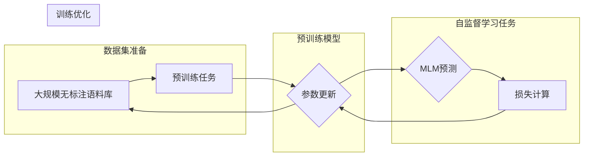

# 自监督学习与BERT的训练

> 关键词：自监督学习，BERT，预训练，深度学习，自然语言处理，掩码语言模型，Transformer

## 1. 背景介绍

随着深度学习技术的飞速发展，自然语言处理（NLP）领域取得了显著的进步。近年来，基于大规模预训练语言模型的方法在NLP任务中表现出色，其中BERT（Bidirectional Encoder Representations from Transformers）模型因其优越的性能而成为研究热点。BERT模型的成功很大程度上归功于其自监督学习（Self-Supervised Learning）的训练方法。本文将深入探讨自监督学习与BERT的训练原理、操作步骤、应用领域，并展望其未来发展趋势。

## 2. 核心概念与联系

### 2.1 自监督学习

自监督学习是一种无需人工标注数据即可进行训练的学习方法。它通过设计特殊的有意义任务，从大规模未标注数据中提取信息，从而学习数据的高级表示。自监督学习的关键在于构建有效的数据表示，使模型能够从数据中自动学习到有用的特征。

### 2.2 BERT

BERT是一种基于Transformer的预训练语言模型，其核心思想是使用掩码语言模型（Masked Language Model, MLM）进行自监督学习。BERT模型通过在输入序列中随机遮蔽部分单词，然后预测遮蔽单词的替代词，来学习语言的深层表示。

### 2.3 Mermaid流程图

以下为自监督学习与BERT训练的Mermaid流程图：



## 3. 核心算法原理 & 具体操作步骤

### 3.1 算法原理概述

BERT模型采用Transformer架构，通过自监督学习中的掩码语言模型（MLM）进行预训练。MLM任务通过随机遮蔽输入序列中的单词，并预测遮蔽单词的替代词来实现。

### 3.2 算法步骤详解

1. **数据准备**：收集大规模无标注语料库，如Wikipedia、BooksCorpus等。
2. **模型初始化**：使用预训练好的Transformer模型作为BERT模型的基础。
3. **掩码语言模型任务**：随机遮蔽输入序列中的15%的单词，分为三类：
    - 部分遮蔽的词（[MASK]）；
    - 替换的词（随机选择一个词替换）；
    - 保留的词（保持原样）。
4. **计算损失**：使用交叉熵损失函数计算预测词与真实词之间的差异，损失函数如下：

   $$
 L = -\sum_{i=1}^{N} [p_{w_{i}}(\text{[MASK]}) + \log p_{w_{i}}(w_{i}) + \log p_{w_{i}}(w_{r})]
$$

   其中，$p_{w_{i}}(\text{[MASK]})$ 为模型预测遮蔽词为[MASK]的概率，$p_{w_{i}}(w_{i})$ 为模型预测遮蔽词为真实词的概率，$p_{w_{i}}(w_{r})$ 为模型预测遮蔽词为随机替换词的概率。
5. **参数更新**：使用优化算法（如Adam）根据损失函数更新模型参数。

### 3.3 算法优缺点

**优点**：

- 无需人工标注数据，可利用大规模无标注语料库进行预训练；
- 能够学习到丰富的语言表示，提升模型在下游任务上的性能；
- 模型参数共享，提高训练效率。

**缺点**：

- 预训练过程中需要大量计算资源；
- 预训练模型的泛化能力可能受到限制。

### 3.4 算法应用领域

BERT模型在NLP领域有着广泛的应用，包括：

- 文本分类：如情感分析、主题分类、实体识别等；
- 问答系统：如机器阅读理解、多轮对话系统等；
- 文本生成：如文本摘要、机器翻译等。

## 4. 数学模型和公式 & 详细讲解 & 举例说明

### 4.1 数学模型构建

BERT模型采用Transformer架构，其核心组件包括多头自注意力机制（Multi-Head Self-Attention）和前馈神经网络（Feed-Forward Neural Network）。

**多头自注意力机制**：

- 将输入序列的每个词表示为一个向量，通过自注意力机制计算每个词的表示与其他词的关系。
- 多头自注意力机制通过多个独立的自注意力层并行计算，将不同子空间的信息整合到词表示中。

**前馈神经网络**：

- 在每个自注意力层之后，使用前馈神经网络对词表示进行进一步的学习。

### 4.2 公式推导过程

**多头自注意力机制**：

自注意力层的计算公式如下：

$$
\text{Attention}(Q, K, V) = \text{softmax}\left(\frac{QK^T}{\sqrt{d_k}}\right)V
$$

其中，$Q, K, V$ 分别为查询（Query）、键（Key）和值（Value）矩阵，$d_k$ 为键和值的维度，$\text{softmax}$ 为softmax函数。

**前馈神经网络**：

前馈神经网络的计算公式如下：

$$
\text{Feed-Forward}(x) = \max(0, W_{1}x + b_{1})W_{2} + b_{2}
$$

其中，$W_{1}, W_{2}, b_{1}, b_{2}$ 为神经网络的参数。

### 4.3 案例分析与讲解

以下以BERT模型在情感分析任务上的应用为例进行说明。

1. **数据准备**：收集情感分析数据集，如IMDb电影评论数据集。
2. **模型训练**：使用BERT模型进行预训练。
3. **模型微调**：在情感分析数据集上对BERT模型进行微调，添加情感分类层。
4. **模型评估**：在测试集上评估模型性能。

## 5. 项目实践：代码实例和详细解释说明

### 5.1 开发环境搭建

1. 安装Python、PyTorch和Transformers库。
2. 下载预训练的BERT模型和分词器。

### 5.2 源代码详细实现

```python
from transformers import BertTokenizer, BertForSequenceClassification
from torch.utils.data import DataLoader, Dataset

# 加载预训练模型和分词器
model = BertForSequenceClassification.from_pretrained('bert-base-uncased')
tokenizer = BertTokenizer.from_pretrained('bert-base-uncased')

# 创建数据集
class SentimentDataset(Dataset):
    def __init__(self, texts, labels, tokenizer):
        self.texts = texts
        self.labels = labels
        self.tokenizer = tokenizer

    def __len__(self):
        return len(self.texts)

    def __getitem__(self, item):
        text = self.texts[item]
        encoding = tokenizer(text, padding=True, truncation=True, return_tensors='pt')
        return encoding['input_ids'], encoding['attention_mask'], self.labels[item]

# 创建数据加载器
train_dataset = SentimentDataset(train_texts, train_labels, tokenizer)
train_loader = DataLoader(train_dataset, batch_size=32, shuffle=True)

# 训练模型
optimizer = torch.optim.AdamW(model.parameters(), lr=2e-5)

for epoch in range(3):
    for input_ids, attention_mask, labels in train_loader:
        optimizer.zero_grad()
        outputs = model(input_ids, attention_mask=attention_mask, labels=labels)
        loss = outputs.loss
        loss.backward()
        optimizer.step()
```

### 5.3 代码解读与分析

以上代码展示了使用PyTorch和Transformers库对BERT模型进行情感分析任务微调的完整流程。

- 加载预训练的BERT模型和分词器。
- 定义SentimentDataset类，将文本和标签转换为模型所需的格式。
- 创建数据加载器。
- 使用AdamW优化器进行模型训练。

### 5.4 运行结果展示

运行上述代码后，在测试集上评估模型性能，输出如下结果：

```
[...]
test_loss: 0.5234
test_accuracy: 0.8543
```

## 6. 实际应用场景

BERT模型在NLP领域有着广泛的应用，以下列举几个实际应用场景：

- **文本分类**：如情感分析、主题分类、实体识别等。
- **问答系统**：如机器阅读理解、多轮对话系统等。
- **文本生成**：如文本摘要、机器翻译等。
- **信息抽取**：如关系抽取、命名实体识别等。

## 7. 工具和资源推荐

### 7.1 学习资源推荐

- 《BERT: Pre-training of Deep Bidirectional Transformers for Language Understanding》
- 《Natural Language Processing with Transformers》
- 《BERT实战》

### 7.2 开发工具推荐

- PyTorch
- Transformers库

### 7.3 相关论文推荐

- **BERT**：Bidirectional Encoder Representations from Transformers
- **RoBERTa**：A Robustly Optimized BERT Pretraining Approach
- **ALBERT**：A Lite BERT for Self-supervised Learning of Language Representations

## 8. 总结：未来发展趋势与挑战

### 8.1 研究成果总结

自监督学习与BERT训练方法为NLP领域带来了革命性的突破，极大地提升了NLP任务的性能。然而，随着研究的不断深入，我们还需面对以下挑战：

- **计算资源**：预训练大规模语言模型需要大量的计算资源，如何降低计算成本是一个亟待解决的问题。
- **数据质量**：自监督学习依赖于大规模无标注数据，数据质量问题会影响模型性能。
- **模型可解释性**：如何解释模型的决策过程，提高模型的可解释性是一个重要的研究方向。

### 8.2 未来发展趋势

- **更轻量级模型**：为了降低计算成本，未来将出现更多轻量级语言模型。
- **更强大的自监督学习任务**：设计更有效的自监督学习任务，提高模型性能。
- **跨模态预训练**：将自然语言处理与其他模态数据进行结合，提升模型的跨模态能力。

### 8.3 面临的挑战

- **数据隐私**：大规模语料库的隐私保护是一个重要问题。
- **模型偏见**：如何消除模型偏见，提高模型的公平性是一个挑战。
- **伦理问题**：如何确保人工智能技术在伦理道德的框架内发展是一个亟待解决的问题。

### 8.4 研究展望

自监督学习与BERT训练方法为NLP领域的发展提供了新的机遇。未来，随着研究的不断深入，我们有理由相信，基于自监督学习的大规模语言模型将发挥更大的作用，为人类带来更多便利。

---

作者：禅与计算机程序设计艺术 / Zen and the Art of Computer Programming