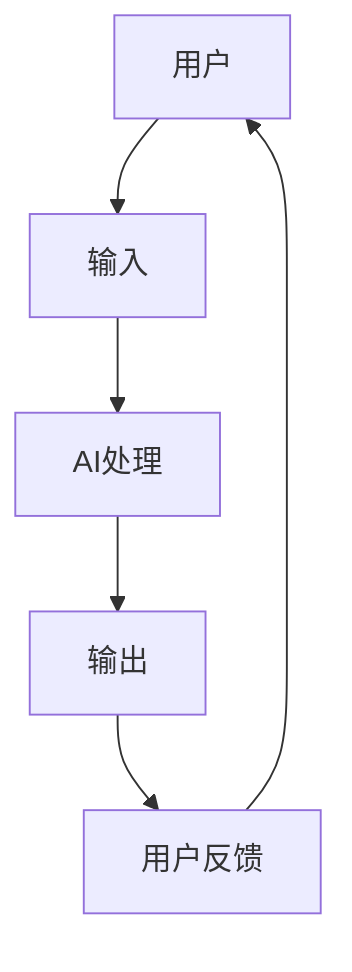

# 苹果手机用户体验与AI的结合

> 关键词：苹果手机，用户体验，人工智能，机器学习，语音识别，图像识别，个性化，隐私保护

## 1. 背景介绍

自2007年苹果公司推出第一代iPhone以来，智能手机行业经历了翻天覆地的变化。苹果手机凭借其独特的设计、出色的性能和卓越的用户体验，一直占据着市场领导地位。随着人工智能（AI）技术的飞速发展，苹果公司开始将AI技术融入手机，进一步提升用户体验。本文将探讨苹果手机如何结合AI技术，以及这种结合带来的机遇和挑战。

## 2. 核心概念与联系

### 2.1 核心概念

#### 2.1.1 用户体验（UX）

用户体验是指用户在使用产品或服务时所产生的感受和体验。在智能手机领域，用户体验包括界面设计、操作流畅性、功能易用性、性能稳定性等多个方面。

#### 2.1.2 人工智能（AI）

人工智能是指使计算机系统能够模拟人类智能行为的技术，包括机器学习、深度学习、自然语言处理等。

#### 2.1.3 机器学习（ML）

机器学习是AI的一个分支，通过算法让计算机从数据中学习，从而做出决策或预测。

#### 2.1.4 深度学习（DL）

深度学习是机器学习的一个子领域，使用多层神经网络模拟人脑神经元结构，通过大量数据进行训练，实现复杂的模式识别和特征提取。

#### 2.1.5 自然语言处理（NLP）

自然语言处理是AI的一个分支，旨在使计算机能够理解、解释和生成人类语言。

### 2.2 核心概念原理和架构的Mermaid流程图



### 2.3 核心概念联系

苹果手机通过收集用户输入，利用AI技术进行处理，得到输出结果，并根据用户反馈进行优化。这一流程实现了用户体验的持续提升。

## 3. 核心算法原理 & 具体操作步骤

### 3.1 算法原理概述

苹果手机结合AI技术主要通过以下几种方式：

- **语音识别**：通过语音识别技术，将用户的语音指令转换为文本或操作命令。
- **图像识别**：通过图像识别技术，识别用户拍摄的照片或视频中的物体、场景等信息。
- **个性化推荐**：根据用户的使用习惯和偏好，推荐相关的应用、新闻、音乐等内容。
- **智能助理**：提供智能语音助手功能，帮助用户完成各种任务。

### 3.2 算法步骤详解

#### 3.2.1 语音识别

1. **音频采集**：手机麦克风采集用户的语音输入。
2. **预处理**：对音频数据进行降噪、增强等处理，提高识别准确率。
3. **特征提取**：提取语音信号的特征，如频谱、声谱等。
4. **模型识别**：利用深度神经网络模型对特征进行识别，得到文本或操作命令。

#### 3.2.2 图像识别

1. **图像采集**：手机摄像头采集用户拍摄的照片或视频。
2. **预处理**：对图像数据进行缩放、裁剪等处理，提高识别准确率。
3. **特征提取**：提取图像特征，如边缘、纹理、颜色等。
4. **模型识别**：利用深度神经网络模型对特征进行识别，得到物体或场景信息。

#### 3.2.3 个性化推荐

1. **数据收集**：收集用户的使用数据，如应用使用频率、搜索历史等。
2. **特征提取**：提取用户数据的特征，如用户兴趣、行为模式等。
3. **模型训练**：利用机器学习算法对用户数据进行训练，得到个性化推荐模型。
4. **推荐生成**：根据个性化推荐模型，生成推荐内容。

### 3.3 算法优缺点

#### 3.3.1 优点

- 提升用户体验：通过AI技术，手机能够更好地理解用户需求，提供更加个性化的服务。
- 提高效率：AI技术可以自动完成一些繁琐的操作，提高用户效率。
- 丰富功能：AI技术可以为手机带来更多有趣的功能，如智能摄影、语音翻译等。

#### 3.3.2 缺点

- 隐私问题：AI技术需要收集用户的大量数据，可能涉及隐私泄露问题。
- 模型偏差：AI模型可能存在偏差，导致歧视或偏见。
- 计算资源消耗：AI技术需要较高的计算资源，对手机性能要求较高。

### 3.4 算法应用领域

苹果手机结合AI技术的应用领域包括：

- 语音助手
- 智能摄影
- 个性化推荐
- 翻译
- 辅助驾驶
- 健康监测

## 4. 数学模型和公式 & 详细讲解 & 举例说明

### 4.1 数学模型构建

#### 4.1.1 语音识别

语音识别模型通常采用循环神经网络（RNN）或其变体，如长短时记忆网络（LSTM）或门控循环单元（GRU）。

#### 4.1.2 图像识别

图像识别模型通常采用卷积神经网络（CNN）。

#### 4.1.3 个性化推荐

个性化推荐模型通常采用协同过滤或矩阵分解等方法。

### 4.2 公式推导过程

#### 4.2.1 语音识别

以LSTM为例，其公式推导过程如下：

$$
h_t = \sigma(W_xh_{t-1} + W_sh_t + b)
$$

$$
y_t = W_yh_t + b
$$

其中，$W_x$、$W_s$、$W_y$ 分别为输入层、隐藏层、输出层的权重矩阵，$b$ 为偏置项，$\sigma$ 为激活函数。

#### 4.2.2 图像识别

以CNN为例，其公式推导过程如下：

$$
\hat{y} = f(W \cdot h + b)
$$

其中，$W$ 为权重矩阵，$h$ 为卷积核，$b$ 为偏置项，$f$ 为激活函数。

#### 4.2.3 个性化推荐

以矩阵分解为例，其公式推导过程如下：

$$
R = UV^T
$$

其中，$R$ 为用户-物品评分矩阵，$U$ 为用户矩阵，$V$ 为物品矩阵。

### 4.3 案例分析与讲解

以苹果手机中的Siri语音助手为例，其语音识别流程如下：

1. 用户说出指令。
2. 手机麦克风采集用户的语音输入。
3. 对音频数据进行降噪、增强等预处理。
4. 提取语音特征。
5. 利用深度神经网络模型对特征进行识别，得到文本或操作命令。
6. 将文本或操作命令转换为对应的操作。

## 5. 项目实践：代码实例和详细解释说明

### 5.1 开发环境搭建

1. 安装Python和必要的库，如TensorFlow、Keras等。
2. 准备语音数据集和模型参数。

### 5.2 源代码详细实现

以下是一个简单的语音识别模型实现示例：

```python
import tensorflow as tf
from tensorflow.keras.models import Sequential
from tensorflow.keras.layers import LSTM, Dense, Dropout

def build_model():
    model = Sequential()
    model.add(LSTM(128, input_shape=(None, 13), return_sequences=True))
    model.add(Dropout(0.5))
    model.add(LSTM(64))
    model.add(Dropout(0.5))
    model.add(Dense(1, activation='sigmoid'))
    model.compile(optimizer='adam', loss='binary_crossentropy')
    return model

model = build_model()
model.fit(x_train, y_train, epochs=10, batch_size=128, validation_data=(x_val, y_val))
```

### 5.3 代码解读与分析

以上代码使用TensorFlow和Keras构建了一个简单的语音识别模型。模型包含两个LSTM层和一个Dense层，用于提取语音特征并进行分类。模型使用adam优化器和binary_crossentropy损失函数进行训练。

### 5.4 运行结果展示

训练完成后，可以使用测试集评估模型的性能。若模型性能达到预期，则可用于实际应用。

## 6. 实际应用场景

### 6.1 语音助手

苹果手机的Siri语音助手是一个典型的AI应用场景。Siri能够理解用户的语音指令，并执行相应的操作，如拨打电话、发送短信、设置闹钟等。

### 6.2 智能摄影

苹果手机的智能摄影功能利用AI技术，能够自动识别照片中的场景、物体等信息，并提供相应的拍摄建议。

### 6.3 个性化推荐

苹果手机的App Store、音乐商店等应用利用AI技术，根据用户的使用习惯和偏好，推荐相关的应用、音乐等内容。

### 6.4 辅助驾驶

苹果公司的Project Titan项目旨在开发自动驾驶汽车。AI技术在自动驾驶汽车中扮演着重要角色，如车道检测、障碍物识别等。

## 7. 工具和资源推荐

### 7.1 学习资源推荐

- 《深度学习》（Goodfellow、Bengio和Courville著）
- 《模式识别与机器学习》（Bishop著）
- 《人工智能：一种现代的方法》（Stuart Russell和Peter Norvig著）

### 7.2 开发工具推荐

- TensorFlow
- Keras
- PyTorch
- scikit-learn

### 7.3 相关论文推荐

- "Deep Learning for Speech Recognition"（Dau et al.，2014）
- "ImageNet Classification with Deep Convolutional Neural Networks"（Krizhevsky et al.，2012）
- "Large-scale Parallel Distributed Deep Networks"（Dean et al.，2012）

## 8. 总结：未来发展趋势与挑战

### 8.1 研究成果总结

苹果手机结合AI技术，通过语音识别、图像识别、个性化推荐等方式，显著提升了用户体验。这些成果证明了AI技术在智能手机领域的巨大潜力。

### 8.2 未来发展趋势

未来，AI技术将继续在智能手机领域发挥重要作用，主要体现在以下几个方面：

- **多模态交互**：结合语音、图像、触摸等多种交互方式，实现更加自然的用户体验。
- **个性化服务**：根据用户的使用习惯和偏好，提供更加个性化的服务。
- **增强现实**：利用增强现实技术，为用户提供更加丰富的虚拟体验。

### 8.3 面临的挑战

尽管AI技术在智能手机领域取得了巨大进步，但仍面临着以下挑战：

- **隐私保护**：如何保护用户隐私，避免数据泄露，是AI技术在智能手机领域应用的一个重要问题。
- **算法偏差**：AI模型可能存在偏见，导致歧视或偏见。
- **计算资源消耗**：AI技术需要较高的计算资源，对手机性能要求较高。

### 8.4 研究展望

未来，AI技术在智能手机领域的应用将朝着以下方向发展：

- **隐私保护技术**：开发更加安全的AI模型，保护用户隐私。
- **公平公正的AI**：消除AI模型中的偏见，确保公平公正。
- **轻量级AI**：降低AI模型的计算资源消耗，使其在低功耗设备上运行。

## 9. 附录：常见问题与解答

**Q1：AI技术对智能手机用户体验有哪些影响？**

A1：AI技术可以提升智能手机的智能化水平，为用户提供更加个性化、便捷、高效的服务，从而提升用户体验。

**Q2：AI技术在智能手机中的具体应用有哪些？**

A2：AI技术在智能手机中的应用非常广泛，包括语音助手、智能摄影、个性化推荐、辅助驾驶等。

**Q3：如何保护用户隐私？**

A3：保护用户隐私可以通过以下方式实现：
- 使用差分隐私技术，对用户数据进行匿名化处理。
- 限制数据收集范围，仅收集必要的数据。
- 加强数据安全措施，防止数据泄露。

**Q4：如何消除AI模型中的偏见？**

A4：消除AI模型中的偏见可以通过以下方式实现：
- 使用更加多样性的数据集进行训练。
- 评估模型在各个群体上的性能，确保公平公正。
- 使用对抗训练等方法，提高模型的鲁棒性。

**Q5：AI技术在智能手机领域的发展趋势是什么？**

A5：AI技术在智能手机领域的发展趋势主要包括多模态交互、个性化服务和增强现实等方面。