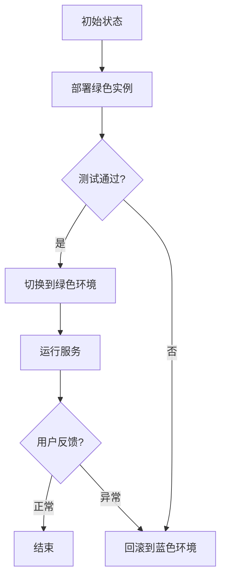

# 蓝绿部署与金丝雀发布原理与代码实战案例讲解

> 关键词：蓝绿部署，金丝雀发布，DevOps，持续集成，持续部署，服务发现，容器化

## 1. 背景介绍

在软件开发的不断迭代过程中，如何保证系统的稳定性和可用性成为了关键问题。传统的部署方式往往需要将整个系统停机，进行全量部署，这种方式在部署过程中可能会导致服务中断，影响用户体验。为了解决这个问题，DevOps社区提出了蓝绿部署和金丝雀发布等部署策略。这些策略通过零停机或低停机时间的方式，实现了系统的平滑升级和快速回滚。

### 1.1 问题的由来

随着互联网技术的发展，软件系统越来越复杂，部署频率也越来越高。传统的部署方式，如冷部署（Cold Deploy）或热部署（Hot Deploy），都存在以下问题：

- **停机部署**：系统需要停机，导致服务中断，影响用户体验。
- **风险较大**：部署过程中可能出现意外，导致系统崩溃。
- **效率低下**：部署过程繁琐，需要人工干预，效率低下。

### 1.2 研究现状

为了解决上述问题，DevOps社区提出了蓝绿部署和金丝雀发布等部署策略。这些策略通过在运行环境中创建多个相同版本的服务实例，实现系统的平滑升级和快速回滚。

### 1.3 研究意义

蓝绿部署和金丝雀发布等策略，对于提高系统的稳定性和可用性具有重要意义：

- **零停机部署**：减少服务中断，提高用户体验。
- **降低风险**：部署过程可控，降低系统崩溃的风险。
- **提高效率**：自动化部署流程，提高部署效率。

### 1.4 本文结构

本文将详细介绍蓝绿部署和金丝雀发布的原理和代码实战案例，内容包括：

- 核心概念和原理
- 具体操作步骤
- 数学模型和公式
- 项目实践案例
- 实际应用场景
- 未来发展趋势与挑战

## 2. 核心概念与联系

### 2.1 核心概念

#### 蓝绿部署

蓝绿部署是一种部署策略，它假设环境分为两个状态：蓝色和绿色。其中，蓝色代表当前运行的服务实例，绿色代表将要部署的新服务实例。部署过程中，首先将绿色服务实例部署到环境中，然后在绿色环境上运行测试，如果测试通过，则切换到绿色环境，蓝色环境则成为备份环境。

#### 金丝雀发布

金丝雀发布是一种渐进式发布策略，它通过逐步增加新版本实例的比例，来观察系统的表现。如果新版本存在问题，可以快速回滚到旧版本，从而降低风险。

### 2.2 Mermaid 流程图



### 2.3 核心概念联系

蓝绿部署和金丝雀发布都是基于多个环境实例进行部署的策略。蓝绿部署强调的是环境的切换，而金丝雀发布强调的是实例的逐步替换。

## 3. 核心算法原理 & 具体操作步骤

### 3.1 算法原理概述

蓝绿部署和金丝雀发布的核心原理是：在多个环境中部署相同版本的服务实例，通过测试和切换，实现系统的平滑升级和快速回滚。

### 3.2 算法步骤详解

#### 蓝绿部署步骤

1. 部署绿色实例，与蓝色实例保持一致。
2. 在绿色环境中运行测试，确保新版本实例的稳定性。
3. 如果测试通过，则切换到绿色环境，蓝色环境成为备份。
4. 如果测试失败，则回滚到蓝色环境。

#### 金丝雀发布步骤

1. 部署新版本实例，与旧版本实例并存。
2. 指定新版本实例的比例，逐步增加。
3. 监控系统性能和用户反馈，如果发现问题，则降低新版本实例的比例或回滚。
4. 如果一切正常，则逐步增加新版本实例的比例，最终切换到新版本。

### 3.3 算法优缺点

#### 优点

- **零停机部署**：减少服务中断，提高用户体验。
- **降低风险**：部署过程可控，降低系统崩溃的风险。
- **提高效率**：自动化部署流程，提高部署效率。

#### 缺点

- **资源消耗**：需要额外的环境实例，增加资源消耗。
- **复杂性**：部署过程较为复杂，需要自动化工具支持。

### 3.4 算法应用领域

蓝绿部署和金丝雀发布适用于以下场景：

- **高可用性系统**：如金融、电子商务等对可用性要求较高的系统。
- **高并发系统**：如社交网络、在线游戏等对性能要求较高的系统。
- **创新性项目**：如新功能上线等需要快速迭代的项目。

## 4. 数学模型和公式 & 详细讲解 & 举例说明

### 4.1 数学模型构建

蓝绿部署和金丝雀发布的数学模型较为简单，主要涉及概率论和统计学知识。

#### 蓝绿部署

假设蓝色环境和新版本实例的故障率分别为 $P_B$ 和 $P_G$，则在绿色环境切换后，系统的故障率为：

$$
P_{total} = P_G \times P_{switch} + P_B \times (1 - P_{switch})
$$

其中 $P_{switch}$ 为切换成功率。

#### 金丝雀发布

假设新版本实例的故障率为 $P_G$，则在金丝雀发布过程中，系统的故障率为：

$$
P_{total} = P_G \times P_{chick} + P_B \times (1 - P_{chick})
$$

其中 $P_{chick}$ 为金丝雀实例的比例。

### 4.2 公式推导过程

#### 蓝绿部署

故障率 $P_{total}$ 可以通过以下公式计算：

$$
P_{total} = P_G \times P_{switch} + P_B \times (1 - P_{switch})
$$

其中：

- $P_G$ 为绿色环境故障率。
- $P_B$ 为蓝色环境故障率。
- $P_{switch}$ 为切换成功率。

#### 金丝雀发布

故障率 $P_{total}$ 可以通过以下公式计算：

$$
P_{total} = P_G \times P_{chick} + P_B \times (1 - P_{chick})
$$

其中：

- $P_G$ 为新版本实例故障率。
- $P_B$ 为旧版本实例故障率。
- $P_{chick}$ 为金丝雀实例的比例。

### 4.3 案例分析与讲解

假设蓝色环境和新版本实例的故障率分别为 $P_B = 0.01$ 和 $P_G = 0.02$，切换成功率为 $P_{switch} = 0.99$，金丝雀实例的比例为 $P_{chick} = 0.1$。

#### 蓝绿部署

根据公式，系统的故障率为：

$$
P_{total} = 0.02 \times 0.99 + 0.01 \times (1 - 0.99) = 0.01
$$

#### 金丝雀发布

根据公式，系统的故障率为：

$$
P_{total} = 0.02 \times 0.1 + 0.01 \times (1 - 0.1) = 0.011
$$

可以看到，金丝雀发布相较于蓝绿部署，能够降低系统的故障率。

## 5. 项目实践：代码实例和详细解释说明

### 5.1 开发环境搭建

本节以Kubernetes为例，讲解如何在Kubernetes集群上实现蓝绿部署和金丝雀发布。

首先，需要在集群中安装Kubernetes和相关的工具，如kubectl等。

### 5.2 源代码详细实现

以下是一个简单的Kubernetes部署配置示例，实现了蓝绿部署和金丝雀发布：

```yaml
apiVersion: apps/v1
kind: Deployment
metadata:
  name: blue-green-deployment
spec:
  replicas: 2
  selector:
    matchLabels:
      app: my-app
  template:
    metadata:
      labels:
        app: my-app
    spec:
      containers:
      - name: my-app
        image: my-app:v1
---
apiVersion: apps/v1
kind: Deployment
metadata:
  name: blue-green-deployment-green
spec:
  replicas: 1
  selector:
    matchLabels:
      app: my-app
  template:
    metadata:
      labels:
        app: my-app
    spec:
      containers:
      - name: my-app
        image: my-app:v2
```

### 5.3 代码解读与分析

以上配置文件定义了两个Deployment：

- blue-green-deployment：部署了两个my-app:v1版本的容器实例，代表蓝色环境。
- blue-green-deployment-green：部署了一个my-app:v2版本的容器实例，代表绿色环境。

通过修改这两个Deployment的镜像版本，可以实现蓝绿部署和金丝雀发布。

### 5.4 运行结果展示

在Kubernetes集群中应用上述配置文件后，可以观察到以下结果：

- 蓝色环境（my-app:v1）正常运行。
- 绿色环境（my-app:v2）运行一个实例。

此时，可以逐步增加绿色环境实例的数量，观察系统表现，实现金丝雀发布。

## 6. 实际应用场景

蓝绿部署和金丝雀发布在实际应用中具有广泛的应用场景，以下是一些典型的应用案例：

### 6.1 在线教育平台

在线教育平台需要保证服务的稳定性和可用性，同时又要快速迭代新功能。蓝绿部署和金丝雀发布可以实现新功能的平滑上线，降低风险。

### 6.2 电子商务网站

电子商务网站对可用性要求较高，同时需要不断优化用户体验。蓝绿部署和金丝雀发布可以实现网站的平滑升级，提高用户体验。

### 6.3 金融系统

金融系统对稳定性和安全性要求极高，蓝绿部署和金丝雀发布可以降低系统崩溃的风险，保障金融交易的安全。

## 7. 工具和资源推荐

### 7.1 学习资源推荐

- Kubernetes官方文档：https://kubernetes.io/zh/docs/
- Helm：https://helm.sh/
- Kubectl：https://kubernetes.io/zh/docs/tasks/tools/

### 7.2 开发工具推荐

- Jenkins：https://jenkins.io/
- GitLab CI/CD：https://gitlab.com/gitlab-org/gitlab-ce
- Ansible：https://www.ansible.com/

### 7.3 相关论文推荐

- **Blue-Green Deployment**: https://www.usenix.org/conference/lisa18/presentation/dunn
- **Canary Releases**: https://www.infoq.com/articles/canary-releases/

## 8. 总结：未来发展趋势与挑战

### 8.1 研究成果总结

蓝绿部署和金丝雀发布等部署策略，在提高系统稳定性和可用性方面取得了显著成果。随着DevOps文化的普及，这些策略将被广泛应用于各个行业。

### 8.2 未来发展趋势

未来，蓝绿部署和金丝雀发布等部署策略将朝着以下方向发展：

- **自动化程度更高**：通过自动化工具实现自动化部署和回滚。
- **支持更多场景**：扩展到更多类型的系统和服务。
- **更细粒度控制**：实现对更细粒度的服务实例进行部署和回滚。

### 8.3 面临的挑战

蓝绿部署和金丝雀发布等部署策略也面临以下挑战：

- **复杂度较高**：需要复杂的自动化工具和流程。
- **资源消耗**：需要额外的环境实例，增加资源消耗。
- **安全性**：需要确保自动化流程的安全性。

### 8.4 研究展望

未来，需要进一步研究以下方向：

- **简化自动化流程**：降低部署和回滚的复杂度。
- **优化资源使用**：减少资源消耗，提高资源利用率。
- **提高安全性**：确保自动化流程的安全性。

## 9. 附录：常见问题与解答

**Q1：蓝绿部署和金丝雀发布有什么区别？**

A：蓝绿部署和金丝雀发布都是部署策略，但它们的应用场景和实现方式有所不同。蓝绿部署强调的是环境的切换，而金丝雀发布强调的是实例的逐步替换。

**Q2：蓝绿部署和金丝雀发布适用于哪些场景？**

A：蓝绿部署和金丝雀发布适用于高可用性系统、高并发系统、创新性项目等对可用性要求较高的场景。

**Q3：如何实现蓝绿部署和金丝雀发布？**

A：可以使用Kubernetes、Docker等容器化技术，以及相关的自动化工具实现蓝绿部署和金丝雀发布。

**Q4：蓝绿部署和金丝雀发布有哪些优缺点？**

A：蓝绿部署和金丝雀发布的优点是提高系统稳定性和可用性，缺点是复杂度较高，需要额外的资源消耗。

**Q5：如何选择合适的部署策略？**

A：选择合适的部署策略需要根据具体场景和需求进行评估，如系统的规模、可用性要求、部署频率等。

---

作者：禅与计算机程序设计艺术 / Zen and the Art of Computer Programming