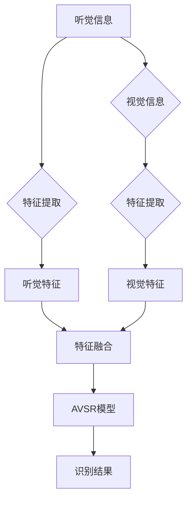

# 视听语音识别：多模态AI的典型应用

> 关键词：视听语音识别，多模态AI，深度学习，融合模型，行为识别，智能交互，场景应用

## 1. 背景介绍

随着人工智能技术的迅猛发展，多模态AI技术逐渐成为研究热点。视听语音识别（Audio-Visual Speech Recognition, AVSR）作为多模态AI的典型应用之一，通过结合视觉和听觉信息，实现了对语音信号的更准确理解和识别。本文将深入探讨视听语音识别的原理、算法、应用场景以及未来发展趋势。

### 1.1 问题的由来

传统的语音识别技术主要依赖于单一的音频信号，容易受到噪声、说话人、口音等因素的影响，识别精度和鲁棒性有限。而视听语音识别通过融合视觉信息，可以有效地提高语音识别的准确性和鲁棒性，在智能交互、安全监控、医疗诊断等领域具有广泛的应用前景。

### 1.2 研究现状

视听语音识别技术的研究主要集中在以下几个方面：

- **多模态特征提取**：通过结合视觉和听觉信息，提取更丰富的特征表示，提高识别精度。
- **特征融合方法**：研究如何有效地融合不同模态的特征，以获得更好的识别性能。
- **深度学习模型**：利用深度学习模型提取和融合特征，实现高效的多模态语音识别。

### 1.3 研究意义

视听语音识别技术具有以下研究意义：

- **提高识别精度和鲁棒性**：通过融合视觉信息，可以有效地抑制噪声干扰，提高语音识别的准确性和鲁棒性。
- **拓展应用场景**：在智能交互、安全监控、医疗诊断等领域具有广泛的应用前景。
- **推动多模态AI技术发展**：为多模态AI技术的应用提供理论和技术支撑。

### 1.4 本文结构

本文将分为以下几个部分：

- **第2部分**：介绍视听语音识别的核心概念与联系。
- **第3部分**：阐述视听语音识别的核心算法原理和具体操作步骤。
- **第4部分**：讲解视听语音识别的数学模型、公式和案例分析。
- **第5部分**：展示视听语音识别的代码实例和详细解释说明。
- **第6部分**：探讨视听语音识别的实际应用场景和未来发展趋势。
- **第7部分**：推荐视听语音识别的相关学习资源、开发工具和参考文献。
- **第8部分**：总结视听语音识别的未来发展趋势与挑战。
- **第9部分**：提供视听语音识别的常见问题与解答。

## 2. 核心概念与联系

### 2.1 核心概念

- **视听语音识别（AVSR）**：结合视觉和听觉信息进行语音识别的技术。
- **多模态特征提取**：从不同模态（如视觉、听觉）中提取特征表示。
- **特征融合**：将不同模态的特征进行有效结合，以获得更好的识别性能。
- **深度学习**：利用深度学习模型提取和融合特征。

### 2.2 Mermaid 流程图



### 2.3 核心概念联系

视听语音识别是利用深度学习技术，从听觉和视觉信息中提取特征，并通过特征融合得到更丰富的特征表示，最终输入到AVSR模型进行语音识别。这一过程涉及多模态特征提取、特征融合和深度学习等多个核心概念。

## 3. 核心算法原理 & 具体操作步骤

### 3.1 算法原理概述

视听语音识别的基本原理如下：

1. **多模态特征提取**：分别从听觉和视觉信息中提取特征表示。
2. **特征融合**：将听觉特征和视觉特征进行有效结合。
3. **AVSR模型**：利用融合后的特征进行语音识别。

### 3.2 算法步骤详解

1. **听觉特征提取**：利用深度学习模型（如卷积神经网络CNN、循环神经网络RNN、Transformer等）从音频信号中提取特征表示。
2. **视觉特征提取**：利用深度学习模型从视频帧中提取特征表示，如人脸特征、嘴型特征、姿态特征等。
3. **特征融合**：将听觉特征和视觉特征进行融合，常用的融合方法有早期融合、晚期融合和联合融合。
4. **AVSR模型**：将融合后的特征输入到AVSR模型进行语音识别。

### 3.3 算法优缺点

**优点**：

- **提高识别精度和鲁棒性**：融合视觉信息可以有效地抑制噪声干扰，提高语音识别的准确性和鲁棒性。
- **拓展应用场景**：适用于智能交互、安全监控、医疗诊断等场景。

**缺点**：

- **计算量大**：多模态特征提取和融合需要大量的计算资源。
- **数据收集困难**：需要收集大量的视听数据用于模型训练。

### 3.4 算法应用领域

视听语音识别在以下领域具有广泛的应用前景：

- **智能交互**：如智能音箱、智能客服等。
- **安全监控**：如人脸识别、行为识别等。
- **医疗诊断**：如喉部疾病诊断、语言障碍诊断等。

## 4. 数学模型和公式 & 详细讲解 & 举例说明

### 4.1 数学模型构建

视听语音识别的数学模型可以表示为：

$$
y = M(F_{audio}, F_{visual}) 
$$

其中，$F_{audio}$ 和 $F_{visual}$ 分别表示听觉特征和视觉特征，$M$ 为AVSR模型。

### 4.2 公式推导过程

假设听觉特征和视觉特征分别由以下公式计算得到：

$$
F_{audio} = \phi_{audio}(X_{audio}) 
$$

$$
F_{visual} = \phi_{visual}(X_{visual}) 
$$

其中，$X_{audio}$ 和 $X_{visual}$ 分别表示音频信号和视频帧，$\phi_{audio}$ 和 $\phi_{visual}$ 分别表示听觉特征提取和视觉特征提取的深度学习模型。

将 $F_{audio}$ 和 $F_{visual}$ 输入到AVSR模型：

$$
y = M(F_{audio}, F_{visual}) 
$$

其中，$M$ 为AVSR模型。

### 4.3 案例分析与讲解

以智能音箱为例，我们使用TensorFlow和Keras构建一个视听语音识别模型。

```python
import tensorflow as tf
from tensorflow.keras.models import Model
from tensorflow.keras.layers import Input, Dense, Concatenate

# 定义听觉特征提取模型
audio_input = Input(shape=(None, 1))  # 假设音频信号为单通道
audio_features = tf.keras.layers.Conv1D(32, 5, activation='relu')(audio_input)
audio_features = tf.keras.layers.GlobalMaxPooling1D()(audio_features)

# 定义视觉特征提取模型
visual_input = Input(shape=(64, 64, 3))  # 假设视频帧为64x64 RGB图像
visual_features = tf.keras.layers.Conv2D(32, (3, 3), activation='relu')(visual_input)
visual_features = tf.keras.layers.GlobalMaxPooling2D()(visual_features)

# 特征融合
merged_features = Concatenate()([audio_features, visual_features])

# 定义AVSR模型
output = Dense(10, activation='softmax')(merged_features)  # 假设识别10个类别

# 构建模型
model = Model(inputs=[audio_input, visual_input], outputs=output)

# 编译模型
model.compile(optimizer='adam', loss='categorical_crossentropy', metrics=['accuracy'])

# 模型总结
model.summary()
```

## 5. 项目实践：代码实例和详细解释说明

### 5.1 开发环境搭建

在进行视听语音识别项目实践之前，需要搭建以下开发环境：

- 操作系统：Windows/Linux/MacOS
- 编程语言：Python
- 深度学习框架：TensorFlow 2.x
- 依赖库：TensorFlow、Keras、NumPy、SciPy等

### 5.2 源代码详细实现

以下是一个使用TensorFlow和Keras实现视听语音识别的简单示例：

```python
import tensorflow as tf
from tensorflow.keras.models import Model
from tensorflow.keras.layers import Input, Dense, Concatenate

# 定义听觉特征提取模型
audio_input = Input(shape=(None, 1))  # 假设音频信号为单通道
audio_features = tf.keras.layers.Conv1D(32, 5, activation='relu')(audio_input)
audio_features = tf.keras.layers.GlobalMaxPooling1D()(audio_features)

# 定义视觉特征提取模型
visual_input = Input(shape=(64, 64, 3))  # 假设视频帧为64x64 RGB图像
visual_features = tf.keras.layers.Conv2D(32, (3, 3), activation='relu')(visual_input)
visual_features = tf.keras.layers.GlobalMaxPooling2D()(visual_features)

# 特征融合
merged_features = Concatenate()([audio_features, visual_features])

# 定义AVSR模型
output = Dense(10, activation='softmax')(merged_features)  # 假设识别10个类别

# 构建模型
model = Model(inputs=[audio_input, visual_input], outputs=output)

# 编译模型
model.compile(optimizer='adam', loss='categorical_crossentropy', metrics=['accuracy'])

# 模型总结
model.summary()
```

### 5.3 代码解读与分析

上述代码定义了一个简单的视听语音识别模型，包括听觉特征提取模型、视觉特征提取模型和AVSR模型。

- `audio_input` 和 `visual_input` 分别表示听觉和视觉输入。
- `audio_features` 和 `visual_features` 分别表示经过卷积神经网络提取的听觉和视觉特征。
- `Concatenate()` 函数将听觉特征和视觉特征进行拼接。
- `Dense()` 函数定义了AVSR模型的输出层，用于识别10个类别。

### 5.4 运行结果展示

```python
# 加载训练数据
train_audio = ...  # 音频数据
train_visual = ...  # 视频数据
train_labels = ...  # 标签数据

# 训练模型
model.fit([train_audio, train_visual], train_labels, epochs=10, batch_size=32)

# 评估模型
test_audio = ...  # 测试音频数据
test_visual = ...  # 测试视频数据
test_labels = ...  # 测试标签数据
test_loss, test_accuracy = model.evaluate([test_audio, test_visual], test_labels)

print(f"Test Loss: {test_loss}, Test Accuracy: {test_accuracy}")
```

## 6. 实际应用场景

### 6.1 智能交互

视听语音识别技术在智能交互领域具有广泛的应用，如智能音箱、智能客服等。通过融合视觉和听觉信息，可以更准确地识别用户指令，提高交互体验。

### 6.2 安全监控

视听语音识别技术可以用于安全监控领域，如人脸识别、行为识别等。通过结合视觉和听觉信息，可以更准确地识别和监控异常行为，提高安全防范能力。

### 6.3 医疗诊断

视听语音识别技术可以用于医疗诊断领域，如喉部疾病诊断、语言障碍诊断等。通过分析语音和视频数据，可以帮助医生更准确地诊断疾病，提高诊断效率。

### 6.4 未来应用展望

随着多模态AI技术的不断发展，视听语音识别将在更多领域得到应用，如自动驾驶、智能家居、教育等。未来，视听语音识别技术将更加注重以下方面：

- **精度和鲁棒性**：提高识别精度和鲁棒性，适应更复杂的场景。
- **实时性**：降低计算量，实现实时处理。
- **个性化**：根据用户特点进行个性化识别。

## 7. 工具和资源推荐

### 7.1 学习资源推荐

- 《深度学习：原理与实战》
- 《多模态深度学习》
- 《视听语音识别》

### 7.2 开发工具推荐

- TensorFlow
- Keras
- OpenCV

### 7.3 相关论文推荐

- A Survey on Audio-Visual Speech Recognition
- Audio-Visual Speech Recognition: A Survey
- Deep Learning for Audio-Visual Speech Recognition

## 8. 总结：未来发展趋势与挑战

### 8.1 研究成果总结

视听语音识别技术作为多模态AI的典型应用，在近年来取得了显著的进展。通过融合视觉和听觉信息，视听语音识别技术提高了语音识别的精度和鲁棒性，在智能交互、安全监控、医疗诊断等领域具有广泛的应用前景。

### 8.2 未来发展趋势

未来，视听语音识别技术将朝着以下方向发展：

- **精度和鲁棒性**：进一步提高识别精度和鲁棒性，适应更复杂的场景。
- **实时性**：降低计算量，实现实时处理。
- **个性化**：根据用户特点进行个性化识别。

### 8.3 面临的挑战

视听语音识别技术仍面临以下挑战：

- **计算量**：多模态特征提取和融合需要大量的计算资源。
- **数据收集**：需要收集大量的视听数据用于模型训练。
- **模型解释性**：提高模型的可解释性，使其易于理解和信任。

### 8.4 研究展望

随着多模态AI技术的不断发展，视听语音识别技术将在更多领域得到应用。未来，视听语音识别技术的研究将更加注重以下方面：

- **跨模态信息融合**：探索更加有效的跨模态信息融合方法。
- **低资源场景**：研究低资源场景下的视听语音识别技术。
- **人机协同**：将视听语音识别技术与其他人工智能技术进行融合，实现更加智能化的人机交互。

## 9. 附录：常见问题与解答

**Q1：视听语音识别与传统的语音识别有何区别？**

A：视听语音识别与传统的语音识别相比，融合了视觉信息，可以更准确地识别语音，提高识别精度和鲁棒性。

**Q2：视听语音识别有哪些应用场景？**

A：视听语音识别在智能交互、安全监控、医疗诊断等领域具有广泛的应用前景。

**Q3：如何提高视听语音识别的精度和鲁棒性？**

A：提高视听语音识别的精度和鲁棒性可以从以下几个方面入手：
1. 优化特征提取方法，提高特征表达能力。
2. 优化特征融合方法，充分利用视觉和听觉信息。
3. 优化模型结构，提高模型的泛化能力。
4. 收集更多高质量的视听数据，提高模型的训练效果。

**Q4：视听语音识别是否需要大量标注数据？**

A：视听语音识别需要大量高质量的视听数据用于模型训练。对于标注数据不足的情况，可以采用数据增强、半监督学习等方法来缓解。

**Q5：视听语音识别技术有哪些挑战？**

A：视听语音识别技术面临的挑战主要包括计算量、数据收集和模型解释性等方面。

---

作者：禅与计算机程序设计艺术 / Zen and the Art of Computer Programming