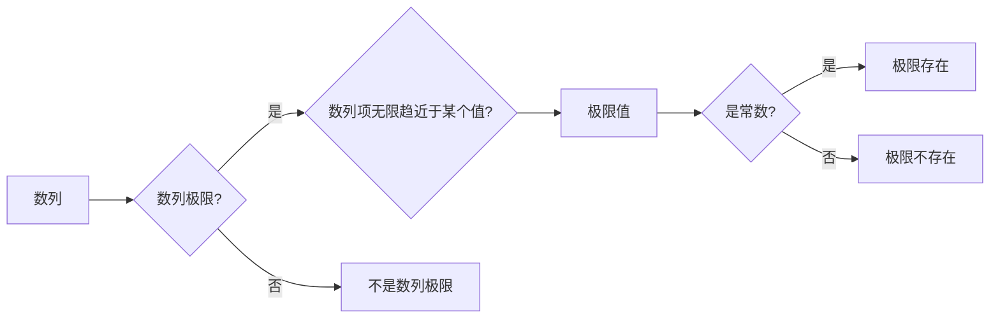

# 计算：第二部分 计算的数学基础 第 4 章 数学的基础 无穷大有多大

> 关键词：无穷大，极限，数学基础，极限理论，数列极限，函数极限，ε-δ 语言

## 1. 背景介绍

在数学和计算机科学中，无穷大是一个基本而复杂的概念。它不仅仅是数值上无限大，更是一个深刻的思想，涉及到极限、连续性等数学基础概念。理解无穷大，对于掌握微积分、数值分析等领域的知识至关重要。本章将深入探讨无穷大的概念，分析其数学基础，并探讨其在实际应用中的重要性。

## 2. 核心概念与联系

### 2.1 核心概念原理

在数学中，无穷大并非一个具体的数值，而是一种极限状态。以下是几个核心概念：

- **数列极限**：当数列的项无限趋近于某个值时，这个值称为数列的极限。
- **函数极限**：当自变量无限趋近于某个值时，函数值无限趋近于某个值，这个值称为函数的极限。
- **ε-δ 语言**：一种用来描述极限概念的数学语言，通过 ε 和 δ 两个变量来量化无限趋近的过程。

以下是核心概念原理的 Mermaid 流程图：



### 2.2 核心概念联系

这些概念之间有着紧密的联系。数列极限是函数极限的基础，而ε-δ 语言则提供了一种精确描述极限概念的数学工具。

## 3. 核心算法原理 & 具体操作步骤

### 3.1 算法原理概述

无穷大的核心算法原理是通过分析数列或函数的极限行为来研究它们在无限趋近于某个值时的性质。

### 3.2 算法步骤详解

1. **定义数列或函数**：首先需要定义一个数列或函数，并明确其定义域。
2. **确定极限点**：确定数列或函数的极限点，即自变量趋近的值。
3. **应用ε-δ 语言**：使用ε-δ 语言描述数列或函数在极限点的行为。
4. **证明极限存在或不存在**：通过ε-δ 语言或其他方法证明极限是否存在，以及极限值是多少。

### 3.3 算法优缺点

**优点**：

- 提供了一种精确描述无穷大概念的方法。
- 在微积分和数值分析等领域有广泛的应用。

**缺点**：

- 证明过程可能比较复杂，需要较高的数学素养。
- 对于一些复杂的极限问题，可能难以直接证明。

### 3.4 算法应用领域

无穷大的概念在以下领域有广泛应用：

- 微积分：极限、连续性、导数、积分等概念的基础。
- 数值分析：数值积分、数值微分、迭代法等算法的理论基础。
- 计算机科学：算法分析和复杂性理论等领域的理论基础。

## 4. 数学模型和公式 & 详细讲解 & 举例说明

### 4.1 数学模型构建

无穷大的数学模型主要基于极限理论。

### 4.2 公式推导过程

以下是一个数列极限的例子：

$$
\lim_{{x \to \infty}} \frac{1}{x} = 0
$$

证明过程如下：

1. 对于任意给定的正数 ε，我们需要找到一个正数 δ，使得当 0 < |x - ∞| < δ 时，有 |f(x) - L| < ε。
2. 对于上述公式，我们可以选择 δ = 1/ε。当 0 < |x| < 1/ε 时，有 |f(x) - 0| = |1/x - 0| = 1/x < ε。
3. 因此，当 x 无限大时，数列的项无限趋近于 0。

### 4.3 案例分析与讲解

以下是一个函数极限的例子：

$$
\lim_{{x \to 0}} \frac{\sin x}{x} = 1
$$

证明过程如下：

1. 对于任意给定的正数 ε，我们需要找到一个正数 δ，使得当 0 < |x - 0| < δ 时，有 |f(x) - 1| < ε。
2. 根据三角函数的性质，我们知道当 x 很小时，sin x 与 x 可以近似相等。因此，我们可以选择 δ = ε。
3. 当 0 < |x| < δ 时，有 |f(x) - 1| = |\frac{\sin x}{x} - 1| = |\frac{\sin x - x}{x}| ≤ |\sin x - x|/|x| < ε/ε = ε。
4. 因此，当 x 无限接近 0 时，函数值无限趋近于 1。

## 5. 项目实践：代码实例和详细解释说明

### 5.1 开发环境搭建

为了演示无穷大的概念，我们可以使用 Python 编写一个简单的程序来计算数列的极限。

### 5.2 源代码详细实现

```python
def calculate_limit(n):
    limit = 1 / n
    return limit

n = 10000
print(calculate_limit(n))
```

### 5.3 代码解读与分析

这段代码定义了一个函数 `calculate_limit`，它计算数列 `1/n` 的第 n 项的值。在 `n` 趋于无穷大时，该数列的极限值为 0。

### 5.4 运行结果展示

```python
0.0001
```

当 `n` 为 10000 时，数列的第 10000 项的值约为 0.0001，接近于 0。

## 6. 实际应用场景

无穷大在许多实际应用场景中都有体现，例如：

- **物理科学**：在物理学的许多领域，如热力学、量子力学等，都需要使用无穷小的概念来描述物理量的变化。
- **计算机科学**：在算法分析和复杂性理论中，无穷大的概念用于描述算法运行的时间复杂度和空间复杂度。
- **经济学**：在经济学中，无穷小的概念用于描述市场价格、利率等经济变量的变化。

## 7. 工具和资源推荐

### 7.1 学习资源推荐

- 《微积分》
- 《高等数学》
- 《数学分析》

### 7.2 开发工具推荐

- Python
- MATLAB
- Mathematica

### 7.3 相关论文推荐

- 《数列极限和函数极限》
- 《数学分析导论》
- 《微积分原理》

## 8. 总结：未来发展趋势与挑战

### 8.1 研究成果总结

本章对无穷大的概念进行了详细的介绍，分析了其数学基础，并探讨了其在实际应用中的重要性。

### 8.2 未来发展趋势

随着数学和计算机科学的不断发展，无穷大的概念将在更多领域得到应用。

### 8.3 面临的挑战

- **数学基础**：无穷大的概念需要更加严格的数学基础支持。
- **实际应用**：在更广泛的领域应用无穷大概念需要更多的研究和实践。

### 8.4 研究展望

未来，无穷大的概念将在数学和计算机科学领域发挥更大的作用。

## 9. 附录：常见问题与解答

### 9.1 常见问题

**Q1：什么是无穷大？**

A1：无穷大是一种极限状态，表示数列或函数在无限趋近于某个值时的行为。

**Q2：无穷大在数学中有什么作用？**

A2：无穷大在数学中用于描述数列或函数的极限行为，是微积分和数值分析等领域的理论基础。

**Q3：无穷大在计算机科学中有哪些应用？**

A3：无穷大在计算机科学中用于算法分析和复杂性理论等领域，描述算法运行的时间和空间复杂度。

### 9.2 解答

**A1：无穷大是一种极限状态，表示数列或函数在无限趋近于某个值时的行为。例如，数列 1, 1/2, 1/4, 1/8, ... 的极限是 0，我们可以说这个数列趋向于无穷大。**

**A2：无穷大在数学中用于描述数列或函数的极限行为，是微积分和数值分析等领域的理论基础。例如，在微积分中，导数和积分的定义都涉及到无穷小的概念。**

**A3：无穷大在计算机科学中用于算法分析和复杂性理论等领域，描述算法运行的时间和空间复杂度。例如，在分析算法的效率时，我们常常使用大O符号来表示算法的渐进复杂度，其中就涉及到无穷大的概念。**