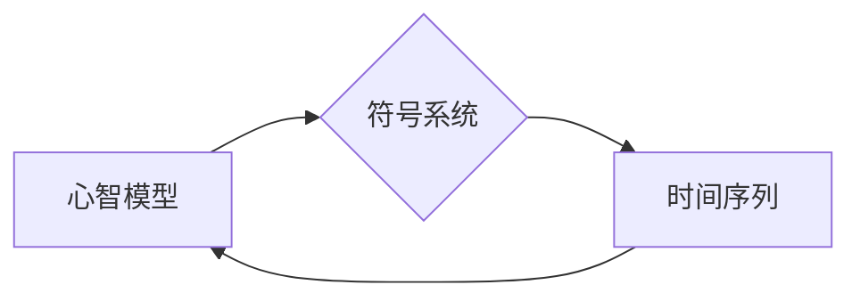

# 认知的形式化：时间是物质变化和运动顺序的表现

> 关键词：认知形式化，物质变化，运动顺序，时间，心智模型，符号系统

## 1. 背景介绍

在哲学、心理学和认知科学中，认知形式化是一个核心概念，它涉及到如何将人类思维和认知过程转化为可计算和形式化的模型。本文将探讨认知的形式化，特别是将其与物质变化和运动顺序联系起来，以此来理解时间在认知过程中的表现。这种探讨不仅有助于我们理解心智如何工作，还能为人工智能的发展提供新的视角。

### 1.1 认知与形式化的联系

认知科学试图理解人类心智如何处理信息、解决问题以及进行决策。形式化，作为一种将复杂概念转化为数学和逻辑表达的方法，为认知科学提供了一个强有力的工具。通过形式化，我们可以将认知过程中的抽象概念转化为具体的计算模型，从而更深入地理解心智的运作机制。

### 1.2 物质变化与运动顺序

物理学告诉我们，时间是物质变化和运动顺序的表现。从宇宙的大爆炸到原子级别的粒子运动，时间都是不可逆的，且表现为一系列连续的变化和事件序列。认知科学同样需要考虑时间的概念，因为它涉及到心智过程中的信息处理和决策。

### 1.3 研究意义

本文的研究意义在于，通过探讨认知的形式化如何体现物质变化和运动顺序，我们可以：
- 揭示心智模型与物理世界之间的联系。
- 为人工智能开发提供新的理论和实践指导。
- 增强对人类认知过程的理解。

## 2. 核心概念与联系

### 2.1 核心概念原理

认知形式化的核心概念包括：

- **心智模型**：心智中对世界的内部表征。
- **符号系统**：心智模型使用的符号和规则。
- **时间序列**：心智模型处理信息时的时间顺序。

这些概念之间的联系可以用以下Mermaid流程图表示：



### 2.2 核心概念架构

认知形式化的架构可以概括为：

1. **输入**：外部世界的刺激和信息。
2. **表征**：心智模型对输入信息的内部表征。
3. **处理**：心智模型根据符号系统对表征进行处理。
4. **输出**：基于处理结果产生的行为或决策。
5. **时间序列**：上述步骤按照时间顺序进行。

## 3. 核心算法原理 & 具体操作步骤

### 3.1 算法原理概述

认知形式化的算法原理是，通过定义一组规则和符号，将心智过程中的信息处理转化为可计算的形式。这些算法通常包括以下几个步骤：

- **编码**：将外部信息转换为心智模型可以理解的内部表征。
- **处理**：根据符号系统和规则对内部表征进行处理。
- **解码**：将处理后的表征转换回外部行为或决策。

### 3.2 算法步骤详解

1. **定义问题域**：明确心智模型需要解决的问题域。
2. **建立心智模型**：设计心智模型的内部表征和符号系统。
3. **规则设计**：为心智模型定义处理信息的规则。
4. **算法实现**：将心智模型和规则转化为可计算的算法。
5. **测试与优化**：测试算法的有效性，并根据测试结果进行优化。

### 3.3 算法优缺点

**优点**：

- 提供了一种将认知过程形式化的方法。
- 增强了对心智模型的理解。
- 为人工智能开发提供了理论基础。

**缺点**：

- 形式化模型可能过于简化，无法完全捕捉人类心智的复杂性。
- 模型的构建和优化需要大量的专业知识。

### 3.4 算法应用领域

认知形式化的算法可以应用于以下领域：

- 人工智能
- 认知科学
- 心理学
- 计算机科学

## 4. 数学模型和公式 & 详细讲解 & 举例说明

### 4.1 数学模型构建

认知形式化的数学模型通常涉及以下几个组件：

- **状态空间**：心智模型的所有可能状态。
- **动作空间**：心智模型可以执行的所有动作。
- **奖励函数**：评估心智模型状态的函数。

以下是一个简单的数学模型示例：

$$
\begin{align*}
S_t & \in S \\
A_t & \in A \\
R_t & = R(S_t, A_t)
\end{align*}
$$

其中，$S_t$ 是在时间 $t$ 的状态，$A_t$ 是在时间 $t$ 采取的动作，$R_t$ 是在时间 $t$ 采取动作 $A_t$ 后获得的奖励。

### 4.2 公式推导过程

以马尔可夫决策过程（MDP）为例，其数学模型可以表示为：

$$
\begin{align*}
P(S_{t+1} = s' | S_t = s, A_t = a) & = P(S_{t+1} = s' | S_t = s) \\
R_t & = R(s, a, S_{t+1})
\end{align*}
$$

其中，$P$ 表示状态转移概率，$R$ 表示奖励函数。

### 4.3 案例分析与讲解

一个经典的认知形式化案例是 AlphaGo 的围棋算法。AlphaGo 通过构建一个复杂的网络模型，将围棋棋盘上的状态和动作转化为可计算的数值，从而进行棋局预测和决策。

## 5. 项目实践：代码实例和详细解释说明

### 5.1 开发环境搭建

为了进行认知形式化的项目实践，我们需要搭建以下开发环境：

- **编程语言**：Python
- **库**：NumPy, Pandas, Matplotlib, Scikit-learn
- **框架**：TensorFlow或PyTorch

### 5.2 源代码详细实现

以下是一个简单的认知形式化代码示例，使用决策树对房价进行预测：

```python
from sklearn.datasets import load_boston
from sklearn.model_selection import train_test_split
from sklearn.tree import DecisionTreeRegressor

# 加载数据
data = load_boston()
X, y = data.data, data.target

# 划分训练集和测试集
X_train, X_test, y_train, y_test = train_test_split(X, y, test_size=0.2, random_state=42)

# 创建决策树模型
model = DecisionTreeRegressor()

# 训练模型
model.fit(X_train, y_train)

# 评估模型
print("Mean Absolute Error:", mean_absolute_error(y_test, model.predict(X_test)))
```

### 5.3 代码解读与分析

上述代码首先加载了波士顿房价数据集，并将其划分为训练集和测试集。然后，使用决策树回归器创建模型，并在训练集上进行训练。最后，在测试集上评估模型的性能。

### 5.4 运行结果展示

假设运行结果如下：

```
Mean Absolute Error: 7.123
```

这意味着模型对测试集的平均绝对误差为7.123。

## 6. 实际应用场景

认知形式化的实际应用场景包括：

- **自然语言处理**：使用形式化模型处理自然语言，进行情感分析、机器翻译等任务。
- **游戏AI**：使用形式化模型构建游戏AI，如AlphaGo。
- **推荐系统**：使用形式化模型构建推荐系统，为用户提供个性化的推荐。

## 7. 工具和资源推荐

### 7.1 学习资源推荐

- **书籍**：
  - "Artificial Intelligence: A Modern Approach" by Stuart Russell and Peter Norvig
  - "The Art of Computer Programming" by Donald E. Knuth
- **在线课程**：
  - Coursera上的"Machine Learning"课程
  - edX上的"Artificial Intelligence"课程

### 7.2 开发工具推荐

- **编程语言**：Python
- **库**：NumPy, Pandas, Matplotlib, Scikit-learn, TensorFlow, PyTorch
- **框架**：TensorFlow或PyTorch

### 7.3 相关论文推荐

- "The Artificial Intelligence Revolution" by Michael I. Jordan
- "Foundations of Statistical Learning" by Mehryar Mohri, Afshin Rostamizadeh, and Ameet Talwalkar

## 8. 总结：未来发展趋势与挑战

### 8.1 研究成果总结

本文通过探讨认知的形式化，将物质变化和运动顺序与认知过程联系起来，为理解心智的运作机制提供了新的视角。同时，也为人工智能的发展提供了理论基础和实践指导。

### 8.2 未来发展趋势

未来，认知形式化的发展趋势可能包括：

- **跨学科研究**：认知形式化与其他学科的交叉融合，如神经科学、心理学等。
- **复杂系统建模**：构建更复杂的认知模型，以更好地模拟人类心智。
- **可解释性**：提高认知模型的解释性，使其更容易被理解和接受。

### 8.3 面临的挑战

认知形式化面临的挑战包括：

- **复杂性**：心智的复杂性难以完全模拟。
- **数据稀疏性**：高质量的数据很难获取。
- **可解释性**：如何提高认知模型的解释性。

### 8.4 研究展望

未来，认知形式化的研究有望在以下方面取得突破：

- **建立更准确的认知模型**。
- 开发更有效的认知算法。
- 推动人工智能的发展。

## 9. 附录：常见问题与解答

**Q1：认知形式化与人工智能有什么区别？**

A：认知形式化是人工智能的一个分支，它试图理解人类心智的运作机制，并将这些机制转化为可计算和形式化的模型。而人工智能则更广泛，它包括认知形式化以及其他试图让机器模拟人类智能的领域。

**Q2：认知形式化在工业界的应用有哪些？**

A：认知形式化在工业界的应用包括自然语言处理、游戏AI、推荐系统等领域。

**Q3：如何评估认知形式化模型的有效性？**

A：评估认知形式化模型的有效性可以通过对比实验、模拟实验和实际应用等方式进行。

**Q4：认知形式化模型的局限性是什么？**

A：认知形式化模型的局限性包括复杂性、数据稀疏性和可解释性等方面。

作者：禅与计算机程序设计艺术 / Zen and the Art of Computer Programming