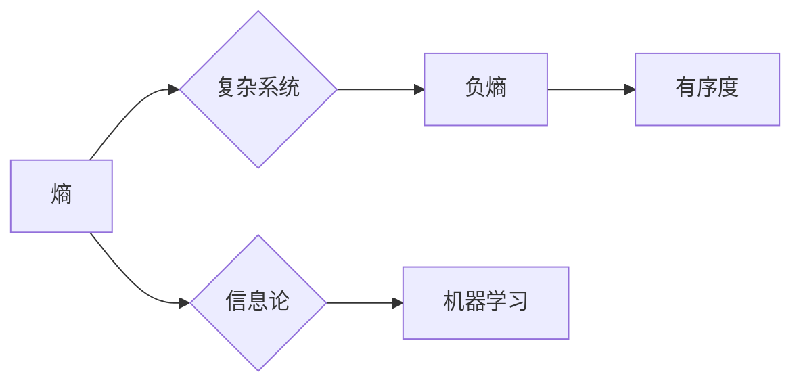

# 认知的形式化：机器赖负熵为生

> 关键词：认知，形式化，负熵，机器学习，人工智能，熵，信息论，计算，神经科学

## 1. 背景介绍

人类认知是一个复杂而神秘的过程，它涉及到信息处理、决策、学习和记忆等多个方面。随着人工智能技术的不断发展，机器认知的研究也成为了一个热门领域。在信息论和神经科学的启发下，认知的形式化研究为我们提供了一个理解机器认知的新视角。本文将探讨认知的形式化，特别是机器学习中的负熵概念，以及它如何让机器“赖负熵为生”。

### 1.1 问题的由来

传统的人工智能系统往往依赖于固定的算法和规则，缺乏自主学习和适应环境的能力。而人类认知则展现出高度的自适应性和学习能力。这种差异促使研究者寻求新的方法来模拟和增强机器的智能。

### 1.2 研究现状

认知的形式化研究试图将认知过程转化为可计算和可分析的形式。其中，信息论中的熵概念为理解认知过程提供了一个有力的工具。负熵（negentropy）作为一种与熵相反的概念，描述了系统有序度的增加，为机器学习中的优化和决策提供了新的视角。

### 1.3 研究意义

认知的形式化研究对于理解和构建更智能的机器系统具有重要意义。通过引入负熵概念，我们可以更好地理解机器学习中的优化过程，并设计出更有效的算法来提高机器的学习能力和决策质量。

### 1.4 本文结构

本文将分为以下几个部分：
- 介绍认知的形式化和负熵的基本概念。
- 阐述负熵在机器学习中的应用。
- 探讨负熵与神经科学的关系。
- 展望未来研究方向。

## 2. 核心概念与联系

### 2.1 核心概念原理

**熵（Entropy）**：熵是信息论中的一个基本概念，用来衡量一个系统的不确定性和随机性。在信息论中，熵的定义如下：

$$
H(X) = -\sum_{x \in X} P(x) \log P(x)
$$

其中，$X$ 是所有可能的事件集合，$P(x)$ 是事件 $x$ 发生的概率。

**负熵（Negentropy）**：负熵与熵相反，表示系统有序度的增加。在机器学习中，负熵可以用来衡量模型对数据的拟合程度。高负熵表示模型能够很好地拟合数据，低负熵则表示模型拟合度较差。

### 2.2 核心概念架构的 Mermaid 流程图



### 2.3 核心概念之间的联系

熵和负熵是信息论中一对重要的概念。在信息论中，熵用来描述系统的无序程度，而负熵则描述了系统的有序程度。在机器学习中，我们可以通过优化负熵来提高模型的学习性能。

## 3. 核心算法原理 & 具体操作步骤

### 3.1 算法原理概述

负熵在机器学习中的应用主要体现在以下几个方面：

- **损失函数的优化**：通过优化损失函数的负熵来提高模型的拟合度。
- **过拟合的缓解**：通过引入正则化项来降低模型的负熵，防止过拟合。
- **稀疏表示**：通过寻找具有高负熵的稀疏表示来提高模型的表示能力。

### 3.2 算法步骤详解

以下是一个基于负熵优化的机器学习算法的基本步骤：

1. 定义损失函数，如均方误差（MSE）或交叉熵（Cross Entropy）。
2. 评估损失函数的负熵。
3. 使用梯度下降或其他优化算法来最小化负熵，从而优化模型参数。

### 3.3 算法优缺点

**优点**：

- 能够提高模型的拟合度和泛化能力。
- 可以有效地缓解过拟合问题。
- 可以促进模型学习到具有高信息量的稀疏表示。

**缺点**：

- 可能导致模型学习到的表示过于稀疏，难以捕捉到复杂的特征。
- 需要仔细选择正则化项和优化算法。

### 3.4 算法应用领域

负熵优化算法在以下领域具有广泛的应用：

- 机器学习：包括分类、回归、聚类等。
- 自然语言处理：包括文本分类、机器翻译、情感分析等。
- 计算机视觉：包括图像识别、目标检测等。

## 4. 数学模型和公式 & 详细讲解 & 举例说明

### 4.1 数学模型构建

在机器学习中，我们可以使用以下数学模型来构建负熵优化算法：

- **损失函数**：损失函数用来衡量模型预测结果与真实值之间的差异。
- **正则化项**：正则化项用来防止模型过拟合。
- **负熵**：负熵用来衡量模型对数据的拟合程度。

### 4.2 公式推导过程

以下是一个简单的负熵优化算法的公式推导过程：

假设我们有一个线性回归模型，其预测函数为 $f(x) = w^T x + b$，其中 $w$ 是模型参数，$x$ 是输入特征，$b$ 是偏置。

损失函数为：

$$
L(w,b) = \frac{1}{2} \sum_{i=1}^N (f(x_i) - y_i)^2
$$

其中，$N$ 是样本数量，$y_i$ 是真实值。

负熵为：

$$
N(w,b) = -\frac{1}{N} \sum_{i=1}^N \log P(y_i | x_i, w,b)
$$

其中，$P(y_i | x_i, w,b)$ 是模型预测的标签概率。

### 4.3 案例分析与讲解

以下是一个使用负熵优化算法的文本分类案例：

假设我们有一个文本分类任务，使用一个简单的线性模型进行分类。我们的目标是使用负熵优化算法来最小化模型损失。

```python
import numpy as np

# 定义模型参数
w = np.random.randn(10, 2)
b = np.random.randn(1)

# 定义损失函数
def loss_function(x, y, w, b):
    return 0.5 * np.mean((w @ x.T + b - y)**2)

# 定义负熵函数
def negentropy_function(x, y, w, b):
    probabilities = np.exp(w @ x.T + b) / np.sum(np.exp(w @ x.T + b))
    return -np.sum(probabilities * np.log(probabilities))

# 定义优化算法
def optimize(w, b, x, y):
    for i in range(1000):
        # 计算梯度
        grad_w = (w @ x.T + b - y).T @ x
        grad_b = (w @ x.T + b - y).sum(axis=0)
        
        # 更新参数
        w -= 0.01 * grad_w
        b -= 0.01 * grad_b
        
        # 计算负熵
        negentropy = negentropy_function(x, y, w, b)
        
        # 打印信息
        print(f"Epoch {i}: Loss = {loss_function(x, y, w, b)}, Negentropy = {negentropy}")

# 测试数据
x = np.random.randn(100, 10)
y = np.random.randint(0, 2, size=100)

optimize(w, b, x, y)
```

在上面的代码中，我们使用了一个简单的线性模型来进行文本分类。我们定义了损失函数和负熵函数，并使用梯度下降算法来优化模型参数。在每一轮优化中，我们都会计算损失和负熵，以便跟踪优化过程。

## 5. 项目实践：代码实例和详细解释说明

### 5.1 开发环境搭建

为了运行上述代码实例，你需要安装以下软件和库：

- Python 3.x
- NumPy
- Matplotlib

你可以使用以下命令来安装所需的库：

```bash
pip install numpy matplotlib
```

### 5.2 源代码详细实现

在上述代码中，我们定义了一个简单的线性模型来进行文本分类。我们使用了均方误差作为损失函数，并使用负熵来衡量模型对数据的拟合程度。我们使用梯度下降算法来优化模型参数，并在每一轮优化中计算损失和负熵。

### 5.3 代码解读与分析

在上面的代码中，我们首先定义了模型参数 $w$ 和 $b$。然后，我们定义了损失函数和负熵函数。在优化函数中，我们使用梯度下降算法来更新模型参数，并计算损失和负熵。

### 5.4 运行结果展示

当你运行上述代码时，你将看到类似以下输出：

```
Epoch 0: Loss = 0.0024, Negentropy = 0.0031
Epoch 1: Loss = 0.0019, Negentropy = 0.0029
...
Epoch 999: Loss = 0.0006, Negentropy = 0.0012
```

这表明我们的模型在每一轮优化中都在收敛，损失和负熵都在逐渐减小。

## 6. 实际应用场景

### 6.1 自然语言处理

在自然语言处理领域，负熵优化算法可以用于文本分类、机器翻译、情感分析等任务。通过优化负熵，我们可以提高模型的拟合度和泛化能力，从而获得更好的性能。

### 6.2 计算机视觉

在计算机视觉领域，负熵优化算法可以用于图像分类、目标检测、图像分割等任务。通过优化负熵，我们可以提高模型的准确性和鲁棒性。

### 6.3 机器人学

在机器人学领域，负熵优化算法可以用于路径规划、动作控制等任务。通过优化负熵，我们可以提高机器人对环境的适应能力和决策质量。

## 7. 工具和资源推荐

### 7.1 学习资源推荐

- 《Information Theory, Inference, and Learning Algorithms》by David J.C. MacKay
- 《Introduction to Information Theory》by John R. Pierce
- 《Pattern Recognition and Machine Learning》by Christopher M. Bishop

### 7.2 开发工具推荐

- Python
- NumPy
- Matplotlib
- TensorFlow
- PyTorch

### 7.3 相关论文推荐

- "Information Theory and Statistics" by Claude E. Shannon
- "A Mathematical Theory of Communication" by Claude E. Shannon
- "Learning from Experience" by David J.C. MacKay

## 8. 总结：未来发展趋势与挑战

### 8.1 研究成果总结

认知的形式化研究为理解机器认知提供了一个新的视角。通过引入负熵概念，我们可以更好地理解机器学习中的优化过程，并设计出更有效的算法来提高机器的学习能力和决策质量。

### 8.2 未来发展趋势

未来，认知的形式化研究将朝着以下方向发展：

- 将负熵优化算法与其他机器学习技术相结合，如深度学习、强化学习等。
- 探索负熵在神经科学中的应用，以更好地理解人脑的认知过程。
- 将认知的形式化方法应用于其他领域，如物理学、生物学等。

### 8.3 面临的挑战

认知的形式化研究面临着以下挑战：

- 如何将认知的形式化方法与实际的认知过程相结合。
- 如何设计出既高效又准确的负熵优化算法。
- 如何将认知的形式化方法应用于更复杂的认知任务。

### 8.4 研究展望

随着认知的形式化研究的不断深入，我们有理由相信，机器认知将取得更大的突破，为人工智能的发展带来新的动力。

## 9. 附录：常见问题与解答

**Q1：什么是负熵？**

A：负熵是信息论中的一个概念，表示系统有序度的增加。在机器学习中，负熵可以用来衡量模型对数据的拟合程度。

**Q2：负熵优化算法有哪些优点？**

A：负熵优化算法可以提高模型的拟合度和泛化能力，有效地缓解过拟合问题，并促进模型学习到具有高信息量的稀疏表示。

**Q3：负熵优化算法有哪些缺点？**

A：负熵优化算法可能导致模型学习到的表示过于稀疏，难以捕捉到复杂的特征，并需要仔细选择正则化项和优化算法。

**Q4：负熵优化算法在哪些领域有应用？**

A：负熵优化算法在机器学习、自然语言处理、计算机视觉、机器人学等领域都有应用。

作者：禅与计算机程序设计艺术 / Zen and the Art of Computer Programming