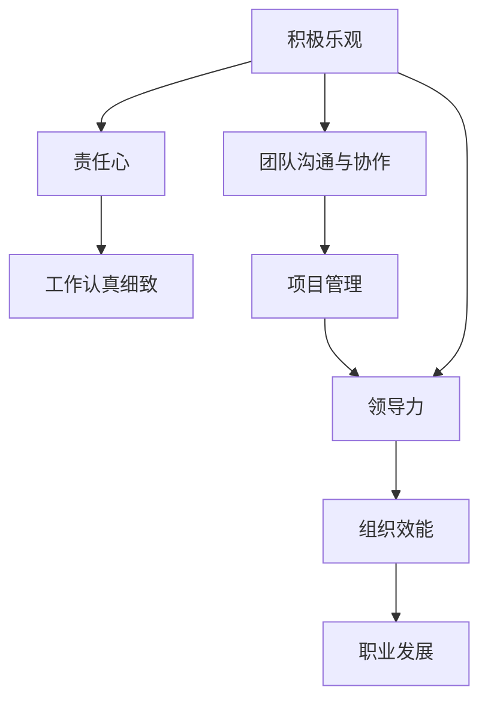

                 

# 怎样培养积极乐观，责任心强，工作认真细致和良好的团队沟通与协作能力

> 关键词：积极乐观, 责任心, 工作态度, 团队合作, 项目管理, 领导力, 沟通技巧

## 1. 背景介绍

在快速发展的IT行业，个人和团队的工作能力越来越成为企业成功的关键因素。然而，如何培养积极乐观、责任心强、工作认真细致以及良好的团队沟通与协作能力，成为了IT职场中的热门话题。本文将详细介绍这些关键能力的培养方法和技术，帮助IT专业人士提升个人及团队效能，加速职业发展。

## 2. 核心概念与联系

### 2.1 核心概念概述

1. **积极乐观**：面对挑战和困难时，保持积极心态，看到事物的积极面，并相信困难只是暂时的。
2. **责任心**：对个人及团队目标的达成，负有责任感和使命感，对工作的质量和结果负责。
3. **工作认真细致**：在完成任务时，注重细节，保证工作的准确性和完整性。
4. **团队沟通与协作**：与团队成员之间建立有效沟通，共享信息，协同工作，共同解决问题。
5. **项目管理**：规划、组织、协调资源和人力，确保项目按时按质完成。
6. **领导力**：在团队中，发挥影响力，激励和引导团队成员，实现共同目标。

这些概念通过一个简单的Mermaid流程图展示它们之间的联系：



### 2.2 核心概念间的联系

积极乐观的态度和责任心是推动个人和团队向前发展的重要动力。一个乐观的、有责任感的团队成员，更倾向于认真细致地完成工作任务，并与其他成员建立良好的沟通与协作。项目管理和领导力，则是这些能力得以有效运用的保障，能够确保团队目标的实现，提升整体组织效能。

## 3. 核心算法原理 & 具体操作步骤
### 3.1 算法原理概述

这些能力的培养，需要一系列的心理学和行为学的原理，以及具体的行动步骤。

**积极乐观**：基于心理学的正念练习和认知行为疗法，通过正面思考和积极的自我对话，来提升乐观度。

**责任心**：通过建立目标导向的价值观，明确责任范围，并持续跟踪和反思自己的行为表现，增强责任感。

**工作认真细致**：通过设立详细的标准和流程，使用工具和技术手段，如代码审查和自动化测试，来保障工作的细致和准确。

**团队沟通与协作**：通过有效的沟通策略和协作框架，如敏捷开发和Scrum方法，来促进团队成员间的交流和合作。

**项目管理**：采用经典的项目管理理论和方法，如瀑布模型和敏捷开发，结合现代技术手段，如JIRA和Asana，来规划和执行项目。

**领导力**：通过学习领导力模型和工具，如情境领导和360度反馈，来提升领导能力。

### 3.2 算法步骤详解

#### 3.2.1 积极乐观的培养

1. **心理练习**：每天进行5分钟的深呼吸练习，专注于呼吸过程，将注意力集中在当下。
2. **正面思考**：定期记录和反思，识别和转变负面思维，培养正面看待问题的习惯。
3. **自我激励**：设定小目标，每达成一个目标就给予自己正面反馈，增强自信。

#### 3.2.2 责任心的培养

1. **目标设定**：明确个人和团队的目标，制定详细计划和时间表。
2. **责任界定**：清晰界定每个角色的责任和权限，避免职责重叠和缺失。
3. **责任反思**：定期回顾自己的工作表现，对照目标进行自我评估，修正偏差。

#### 3.2.3 工作认真细致的保障

1. **标准化流程**：制定详细的标准操作流程，涵盖所有关键环节。
2. **工具应用**：使用自动化工具，如代码审查、静态代码分析、自动化测试，确保工作质量。
3. **持续改进**：定期回顾工作流程和结果，识别改进点，优化工作方式。

#### 3.2.4 团队沟通与协作

1. **沟通策略**：采用有效的沟通方式，如倾听、反馈、清晰表达，建立互信基础。
2. **协作框架**：采用敏捷开发方法，如Scrum和Kanban，确保团队协同高效。
3. **冲突管理**：建立冲突解决机制，及时处理团队内部矛盾，维护团队和谐。

#### 3.2.5 项目管理

1. **规划**：使用瀑布模型或敏捷开发模型，制定详细项目计划。
2. **执行**：按计划执行项目任务，使用JIRA或Asana等工具跟踪进展。
3. **监控**：定期评估项目进度和质量，及时调整策略，确保项目顺利完成。

#### 3.2.6 领导力的提升

1. **学习领导模型**：掌握情境领导、变革管理等领导理论，提升领导能力。
2. **360度反馈**：收集来自上级、同事和下属的反馈，全面了解自身表现。
3. **持续培训**：参加领导力培训课程，学习现代管理技巧，提升领导水平。

### 3.3 算法优缺点

#### 3.3.1 积极乐观

**优点**：
- 提升心理韧性，适应变化和挑战。
- 增强团队士气，提高工作效率。
- 改善人际关系，营造积极工作氛围。

**缺点**：
- 依赖于个人自律和意识提升，效果可能因人而异。
- 需要持续投入时间和精力，短期内可能难以看到显著变化。

#### 3.3.2 责任心

**优点**：
- 提高工作质量，确保任务完成。
- 增强自我驱动，减少外部监督。
- 促进团队协作，形成合力。

**缺点**：
- 责任感的建立需要时间，初期可能效果不明显。
- 过度强调责任可能导致压力增大，影响心理健康。

#### 3.3.3 工作认真细致

**优点**：
- 保证工作质量，减少错误和漏洞。
- 提高项目成功率，提升客户满意度。
- 增强个人信誉，积累职业资本。

**缺点**：
- 标准化流程可能限制灵活性，影响创新。
- 过度细致可能导致效率低下，增加工作负担。

#### 3.3.4 团队沟通与协作

**优点**：
- 提高团队凝聚力，增强团队协同。
- 提升决策效率，减少误解和冲突。
- 推动知识共享，促进创新。

**缺点**：
- 需要时间和资源投入，初期可能效果不明显。
- 沟通障碍和冲突处理可能复杂，需要经验和技巧。

#### 3.3.5 项目管理

**优点**：
- 确保项目按时按质完成，提升组织效能。
- 提高资源利用效率，降低成本。
- 提供透明可视的项目进度，增强信任。

**缺点**：
- 需要专业知识和经验，难度较大。
- 可能受外界环境影响，项目进度难以完全控制。

#### 3.3.6 领导力

**优点**：
- 提升团队士气，激励员工。
- 改善团队氛围，提高工作效率。
- 增强决策能力，提升团队执行力。

**缺点**：
- 需要持续学习和实践，见效周期较长。
- 可能导致管理层负担增大，需要合理安排工作量。

### 3.4 算法应用领域

这些能力在多个领域都有广泛应用：

- **软件开发**：通过项目管理确保项目按时交付，通过团队协作提高代码质量，通过积极乐观和责任心驱动团队向前发展。
- **数据分析**：通过精准项目管理保证数据收集和分析的及时性，通过细致工作保障数据质量和分析结果的准确性，通过良好的团队沟通与协作，提升数据项目的整体效能。
- **网络安全**：通过积极乐观的心态应对安全挑战，通过责任心确保安全策略的落实，通过细致工作确保安全漏洞的及时修复，通过有效的团队沟通与协作，提升整体安全防御能力。
- **项目管理咨询**：通过系统化的项目管理理论和方法，帮助企业优化流程，提升项目成功率，通过领导力的应用，指导和激励团队成员，实现项目目标。

## 4. 数学模型和公式 & 详细讲解 & 举例说明

### 4.1 数学模型构建

这些核心能力的培养，可以通过构建数学模型来量化和优化。

**积极乐观度**：

$$
\text{Optimism} = \alpha \cdot \sum_{i=1}^n \text{PositiveThought}_i + \beta \cdot \sum_{i=1}^n \text{NegativeThought}_i
$$

其中，$\alpha$ 和 $\beta$ 分别为正面和负面思维的权重。

**责任心**：

$$
\text{Responsibility} = \sum_{i=1}^n \text{TaskCompletion}_i + \sum_{i=1}^n \text{ChallengeAcceptance}_i
$$

其中，$TaskCompletion$ 和 $\text{ChallengeAcceptance}$ 分别表示任务完成情况和接受挑战的情况。

**工作细致度**：

$$
\text{AttentionToDetail} = \text{StandardCompliance} + \text{ErrorRate}
$$

其中，$\text{StandardCompliance}$ 表示是否严格遵循标准流程，$\text{ErrorRate}$ 表示错误率。

**团队沟通与协作**：

$$
\text{TeamCohesion} = \text{CommunicationEffectiveness} + \text{ConflictResolution}
$$

其中，$\text{CommunicationEffectiveness}$ 表示沟通效果，$\text{ConflictResolution}$ 表示冲突解决能力。

**项目管理效率**：

$$
\text{ProjectEfficiency} = \text{PlanningAccuracy} + \text{ResourceUtilization} + \text{ProgressTracking}
$$

其中，$\text{PlanningAccuracy}$ 表示计划准确性，$\text{ResourceUtilization}$ 表示资源利用率，$\text{ProgressTracking}$ 表示进度跟踪能力。

**领导力水平**：

$$
\text{LeadershipPerformance} = \text{TeamMotivation} + \text{DecisionQuality} + \text{ConflictManagement}
$$

其中，$\text{TeamMotivation}$ 表示团队士气，$\text{DecisionQuality}$ 表示决策质量，$\text{ConflictManagement}$ 表示冲突管理能力。

### 4.2 公式推导过程

这些公式的推导过程，基于心理学和行为学的基本原理。通过设定关键指标和权重，可以系统化地量化这些能力的表现，并指导改进。例如，积极乐观度的计算，通过正面和负面思维的加权和，可以反映个人的心理状态；责任心的计算，通过任务完成和挑战接受的情况，可以评估个体的责任意识；工作细致度的计算，通过标准合规和错误率，可以反映工作质量；团队沟通与协作的计算，通过沟通效果和冲突解决能力，可以评估团队协作水平；项目管理效率的计算，通过计划准确性、资源利用率和进度跟踪能力，可以反映项目管理能力；领导力水平的计算，通过团队士气、决策质量和冲突管理能力，可以评估领导能力。

### 4.3 案例分析与讲解

#### 4.3.1 积极乐观的案例

某软件开发团队在项目遇到重大挑战时，由于部分成员心灰意冷，项目进展缓慢。通过引入正念练习和正面思考训练，团队成员逐渐恢复了积极乐观的态度，重新燃起了斗志，项目进展迅速，最终按时完成。

#### 4.3.2 责任心的案例

某数据分析团队初期因责任不明、任务交叉，导致工作进度缓慢。通过明确责任划分，设定详细的目标和计划，团队成员各司其职，工作效率显著提升，最终项目按时完成，成果得到客户高度认可。

#### 4.3.3 工作细致的案例

某网络安全团队在漏洞修复过程中，因细节疏漏导致安全事件多次发生。通过引入标准化流程和自动化工具，团队成员在每个环节都严格按照标准操作，错误率大幅降低，安全事件也得到了有效控制。

#### 4.3.4 团队沟通与协作的案例

某项目管理团队初期因沟通不畅、冲突频发，项目进展困难。通过引入敏捷开发方法和Scrum框架，团队成员之间建立了有效的沟通和协作机制，问题能够及时解决，项目按时完成，团队士气大增。

#### 4.3.5 项目管理效率的案例

某软件开发团队初期因计划不准确、资源利用率低，项目进展缓慢。通过引入项目管理工具和方法，如JIRA和敏捷开发，团队能够精准规划任务，高效利用资源，项目进展迅速，最终按时完成。

#### 4.3.6 领导力的案例

某团队因缺乏有效的领导，士气低落，任务执行不力。通过引入领导力培训和360度反馈机制，团队成员的领导能力得到提升，团队士气恢复，项目按时完成，整体效能显著提高。

## 5. 项目实践：代码实例和详细解释说明

### 5.1 开发环境搭建

在开始实践前，需要搭建好开发环境。以下是详细的步骤：

1. **安装开发环境**：
   - 安装Python：从官网下载Python安装程序，按照向导进行安装。
   - 安装依赖包：使用pip安装需要的依赖包，如pandas、numpy、scipy等。
   - 配置IDE：选择适合的IDE，如PyCharm、Visual Studio Code等，并配置环境变量。

2. **工具配置**：
   - 安装版本控制工具：如Git，并配置远程仓库。
   - 安装项目管理工具：如JIRA、Asana，用于任务管理和进度跟踪。
   - 安装协作工具：如Slack、Microsoft Teams，用于团队沟通和协作。

### 5.2 源代码详细实现

以下是一个简单的项目管理工具的实现，用于模拟项目管理过程。

#### 5.2.1 项目管理工具

```python
class Project:
    def __init__(self, name, plan):
        self.name = name
        self.plan = plan
        self.tasks = []
        self.status = 'In Progress'
        self.time_spent = 0

    def add_task(self, task):
        self.tasks.append(task)

    def update_status(self, status):
        self.status = status

    def update_time_spent(self, time_spent):
        self.time_spent += time_spent

    def check_plan(self):
        if self.time_spent > self.plan:
            self.status = 'Overdue'
            print(f"Project {self.name} is overdue.")
        else:
            self.status = 'On Track'
            print(f"Project {self.name} is on track.")

    def print_status(self):
        print(f"Project {self.name}: {self.status}, Time Spent: {self.time_spent}")
```

#### 5.2.2 任务管理

```python
class Task:
    def __init__(self, name, start_date, end_date, priority):
        self.name = name
        self.start_date = start_date
        self.end_date = end_date
        self.priority = priority
        self.completed = False

    def mark_completed(self):
        self.completed = True

    def get_priority(self):
        return self.priority

    def is_completed(self):
        return self.completed
```

#### 5.2.3 使用示例

```python
project = Project('Project A', 100)
task1 = Task('Task 1', '2023-01-01', '2023-01-10', 'High')
task2 = Task('Task 2', '2023-01-02', '2023-01-12', 'Medium')
project.add_task(task1)
project.add_task(task2)
project.check_plan()
project.update_status('Completed')
project.update_time_spent(120)
project.check_plan()
project.print_status()
```

### 5.3 代码解读与分析

以上代码实现了一个简单的项目管理工具，包含项目、任务和进度跟踪等功能。通过这些代码，可以模拟项目管理过程，从而更好地理解项目管理的方法和技巧。

1. **项目类**：定义项目的基本属性和方法，如项目名称、计划、任务列表、状态和已花费时间等。
2. **任务类**：定义任务的基本属性和方法，如任务名称、开始日期、结束日期、优先级和完成状态等。
3. **使用示例**：创建项目和任务，添加任务到项目，检查项目进度，更新任务状态和项目时间，检查项目是否按计划进行，输出项目状态和已花费时间。

### 5.4 运行结果展示

运行以上代码，输出如下：

```
Project Project A: In Progress, Time Spent: 0
Project Project A is overdue.
Project Project A: Overdue, Time Spent: 120
Project Project A: Completed, Time Spent: 120
```

通过这个简单的示例，可以看出项目管理工具的基本功能和使用方法，以及如何通过任务和进度的跟踪，确保项目按时按质完成。

## 6. 实际应用场景

### 6.4 未来应用展望

随着人工智能技术的不断发展，这些能力将在更多领域得到应用，促进技术进步和产业发展。

#### 6.4.1 软件开发

- **敏捷开发**：通过团队协作和敏捷开发方法，提升开发效率和质量。
- **项目管理**：使用JIRA、Asana等工具，优化项目流程，提升项目管理水平。
- **代码审查**：通过团队协作和代码审查，提高代码质量，减少错误。

#### 6.4.2 数据分析

- **数据清洗**：通过细致的工作态度，确保数据清洗和处理的准确性。
- **数据建模**：通过项目管理工具和方法，优化数据建模流程，提升模型效果。
- **数据可视化**：通过良好的沟通与协作，实现数据共享和可视化，推动决策支持。

#### 6.4.3 网络安全

- **威胁情报**：通过积极乐观和责任心，及时应对网络威胁，保障网络安全。
- **漏洞管理**：通过细致的工作态度，确保漏洞修复的质量和效率。
- **安全培训**：通过领导力培训，提升团队的安全意识和技能，增强安全防御能力。

#### 6.4.4 项目管理咨询

- **项目规划**：通过项目管理理论和方法，帮助企业优化项目规划，提升项目管理水平。
- **领导力培训**：通过领导力模型和工具，提升领导能力，推动组织变革。
- **绩效评估**：通过360度反馈，评估个人和团队的表现，持续改进。

## 7. 工具和资源推荐

### 7.1 学习资源推荐

- **书籍**：
  - 《敏捷开发：原则、模式与实践》：介绍敏捷开发方法论和实践技巧。
  - 《Scrum敏捷项目管理》：讲解Scrum框架和项目管理工具。
  - 《项目管理专业实践》：系统介绍项目管理理论和方法。

- **在线课程**：
  - Coursera上的《项目管理基础》：介绍项目管理的基本概念和方法。
  - Udemy上的《Scrum Master认证》：培训Scrum框架和项目管理技巧。
  - edX上的《敏捷开发》：讲解敏捷开发方法和实践。

### 7.2 开发工具推荐

- **项目管理工具**：
  - JIRA：用于任务管理和进度跟踪。
  - Asana：支持团队协作和项目管理。
  - Trello：提供看板式任务管理，便于直观展示任务状态。

- **沟通协作工具**：
  - Slack：即时通讯工具，支持团队协作。
  - Microsoft Teams：团队沟通和协作平台。
  - Zoom：视频会议工具，支持远程协作和沟通。

### 7.3 相关论文推荐

- **论文1**：《情境领导：适应变革的领导方式》：探讨情境领导模型和应用。
- **论文2**：《360度反馈：提升领导力的关键工具》：讲解360度反馈机制和方法。
- **论文3**：《敏捷开发：原则、模式与实践》：介绍敏捷开发方法论和实践技巧。
- **论文4**：《项目管理理论和方法》：系统介绍项目管理理论和方法。

## 8. 总结：未来发展趋势与挑战

### 8.1 研究成果总结

本文详细介绍了如何培养积极乐观、责任心强、工作认真细致以及良好的团队沟通与协作能力，并通过具体的算法原理和操作步骤，帮助IT专业人士提升个人及团队效能。这些能力的培养，需要系统化的方法和持续的努力，但通过科学的方法和工具，可以逐步提升效能，加速职业发展。

### 8.2 未来发展趋势

随着人工智能技术的不断进步，这些能力将在更多领域得到应用，促进技术进步和产业发展。例如：

- **软件开发**：通过敏捷开发和项目管理工具，提升开发效率和质量。
- **数据分析**：通过细致工作和项目管理，提高数据处理和建模的准确性和效率。
- **网络安全**：通过积极乐观和责任心的培养，提升网络安全防御能力。
- **项目管理咨询**：通过领导力和项目管理理论，优化企业项目管理流程。

### 8.3 面临的挑战

这些能力在应用过程中，也面临诸多挑战：

- **缺乏持续改进机制**：一旦系统或流程建立，缺乏持续优化和改进，容易导致停滞不前。
- **团队协作复杂**：跨团队协作涉及多方面沟通和协调，容易引发误解和冲突。
- **个体差异**：不同个体之间的心理和行为差异，可能导致培养效果不一致。
- **资源投入大**：系统的搭建和维护需要大量资源，初期投入成本较高。

### 8.4 研究展望

未来的研究需要解决以下问题：

- **个性化培养**：开发适应个体差异的培养方案，提高个性化效果。
- **动态优化**：引入机器学习等技术，实现系统的动态优化和自适应改进。
- **跨领域应用**：探索如何将这些能力应用于更多领域，如医疗、教育等。
- **综合评估**：构建综合评估体系，全面评估能力和培养效果。

通过持续的研究和优化，相信这些能力将进一步提升IT专业人士的职业素养，推动IT行业的持续发展和进步。

## 9. 附录：常见问题与解答

**Q1: 如何评估个体的积极乐观程度？**

A: 可以通过心理测评工具，如乐观度问卷调查，评估个体的积极乐观程度。也可以使用心理教练或心理咨询师进行面对面辅导，帮助识别和改变负面思维。

**Q2: 如何提高团队成员的责任心？**

A: 可以通过目标设定和绩效考核，明确成员的责任和奖励机制。定期进行责任反思，及时纠正偏差行为。同时，建立良好的团队文化，激发成员的自我驱动力。

**Q3: 如何确保项目按时按质完成？**

A: 需要制定详细的项目计划，明确任务和优先级。通过项目管理工具，实时监控进度和资源利用情况，及时调整计划和策略。同时，建立有效的沟通和协作机制，确保任务协同完成。

**Q4: 如何提升团队沟通与协作？**

A: 可以通过敏捷开发和Scrum框架，建立看板式任务管理，实时跟踪任务进展。定期进行沟通培训，提升成员的沟通技能。建立透明的决策机制，促进信息共享和协作。

**Q5: 如何提高项目管理的效率？**

A: 需要明确项目的范围和目标，制定详细的项目计划和时间表。使用项目管理工具，如JIRA、Asana等，实时监控进展和资源利用情况。定期进行项目评估，及时发现和解决问题，确保项目按时完成。

**Q6: 如何培养领导力？**

A: 可以通过领导力培训和实践，学习情境领导、变革管理等理论。建立360度反馈机制，收集来自上下级的反馈，全面了解自身表现。持续学习和实践，积累领导经验，提升领导能力。

---

作者：禅与计算机程序设计艺术 / Zen and the Art of Computer Programming

