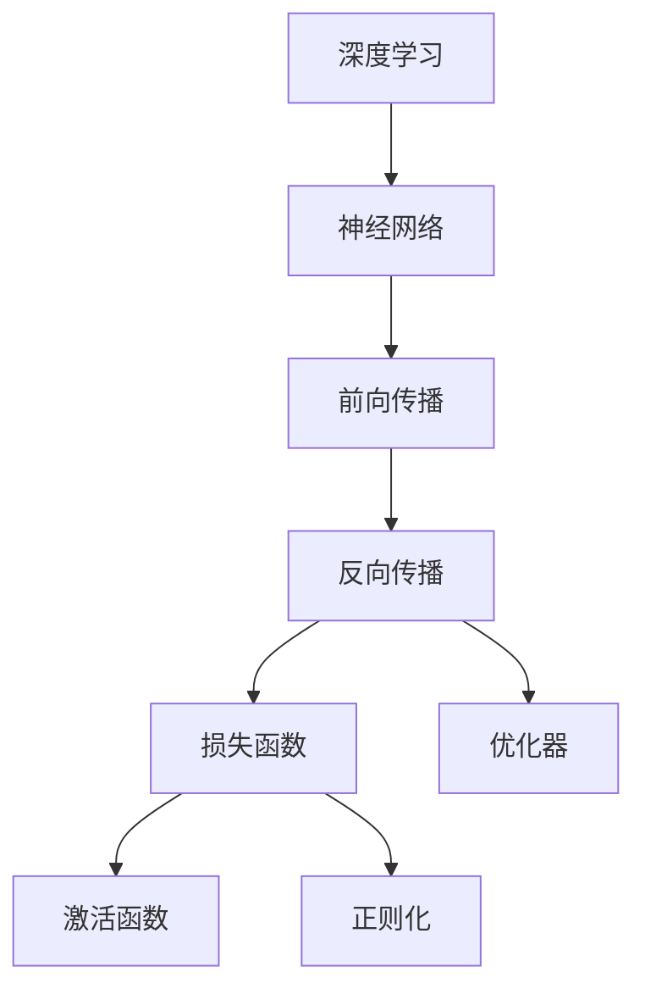
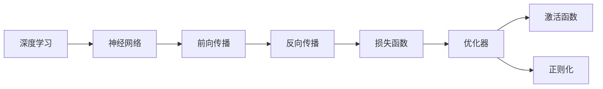

                 

# 思想的深度：从概念到洞见

> 关键词：深度学习,机器学习,人工智能,算法原理,理论应用

## 1. 背景介绍

### 1.1 问题由来

随着人工智能技术的快速发展，深度学习、机器学习等技术在各行各业中得到了广泛应用。这些技术的核心思想是通过大量数据和计算，训练出能够自动处理和理解数据的模型。然而，对于深度学习的原理和机制，很多人仍感到困惑，难以透彻理解其背后深层次的概念和洞见。

本博客旨在通过深入浅出的语言，系统地介绍深度学习的核心概念和洞见，帮助读者从宏观和微观两个维度全面理解这一领域的精髓。

### 1.2 问题核心关键点

深度学习模型通常包含多个层次的神经网络，每个层次都由多个神经元组成。通过逐层的前向传播和反向传播，模型能够自动学习到数据的特征表示。但深度学习的本质是什么？它为什么能够取得如此优异的性能？这些都是深度学习领域中最重要的问题之一。

深度学习的核心在于其具有强大的表示学习能力和泛化能力。模型通过大量的数据和计算，能够学习到数据的特征表示，进而对新数据进行预测和分类。这种学习过程类似于人类的认知过程，通过不断地学习和实践，逐步建立复杂的知识体系。

## 2. 核心概念与联系

### 2.1 核心概念概述

为更好地理解深度学习的核心概念和洞见，本节将介绍几个密切相关的核心概念：

- 深度学习：以多层神经网络为代表的机器学习技术，能够自动地学习数据的特征表示。
- 神经网络：由多个神经元组成的层次化结构，用于学习数据的高阶特征。
- 前向传播：模型通过逐层计算，将输入数据传递到输出层的过程。
- 反向传播：通过计算输出误差，反向传播更新模型参数的过程。
- 损失函数：衡量模型输出与真实标签之间的差异，用于指导模型参数更新。
- 优化器：用于更新模型参数的算法，如随机梯度下降(SGD)、Adam等。
- 激活函数：用于引入非线性特性的函数，如ReLU、Sigmoid等。
- 正则化：防止模型过拟合的技术，如L1、L2正则、Dropout等。

这些核心概念之间的逻辑关系可以通过以下Mermaid流程图来展示：



这个流程图展示了大深度学习模型的基本结构和流程，从输入到输出，每一步都至关重要。

### 2.2 概念间的关系

这些核心概念之间存在着紧密的联系，形成了深度学习的完整生态系统。下面我通过几个Mermaid流程图来展示这些概念之间的关系。

#### 2.2.1 深度学习的基本流程



这个流程图展示了深度学习模型的基本流程，从神经网络的前向传播，到反向传播，再到损失函数和优化器的应用，每一步都离不开核心概念的相互作用。

#### 2.2.2 神经网络的层次化结构


这个流程图展示了神经网络的层次化结构，从输入层到隐藏层，再到输出层，每层都包含多个神经元。这种层次化的结构使得深度学习模型能够学习到数据的复杂特征表示。

#### 2.2.3 前向传播和反向传播


这个流程图展示了前向传播和反向传播的基本流程。通过前向传播，模型计算出输出结果，通过反向传播，模型根据输出误差调整参数。

## 3. 核心算法原理 & 具体操作步骤
### 3.1 算法原理概述

深度学习的核心算法原理基于多层神经网络的反向传播算法。通过前向传播计算模型输出，再通过反向传播更新模型参数，使得模型能够逐渐逼近最优解。

### 3.2 算法步骤详解

深度学习的训练过程通常包括以下几个关键步骤：

**Step 1: 数据准备**

- 收集训练数据集和测试数据集。
- 将数据集划分为训练集、验证集和测试集。
- 对数据进行预处理，如归一化、标准化等。

**Step 2: 模型设计**

- 选择合适的神经网络架构，如卷积神经网络(CNN)、循环神经网络(RNN)等。
- 定义神经网络各层的激活函数、损失函数和优化器。
- 设置正则化参数，如L1、L2正则、Dropout等。

**Step 3: 模型训练**

- 将数据集划分为批次，每次训练一个批次的数据。
- 进行前向传播，计算输出结果。
- 计算损失函数，衡量模型输出与真实标签之间的差异。
- 进行反向传播，根据损失函数梯度更新模型参数。
- 重复上述步骤，直到模型收敛。

**Step 4: 模型评估**

- 使用验证集评估模型性能。
- 根据验证集结果调整模型参数。
- 使用测试集评估最终模型性能。

### 3.3 算法优缺点

深度学习的优点包括：

- 强大的表示学习能力：深度学习模型能够自动学习数据的高级特征表示。
- 良好的泛化能力：深度学习模型在未见过的数据上也能取得较好的性能。
- 可扩展性：深度学习模型可以通过增加层数和神经元数量来扩展模型的复杂度。

深度学习的缺点包括：

- 训练时间长：深度学习模型通常需要大量数据和计算资源进行训练。
- 过拟合风险：深度学习模型容易过拟合，需要正则化技术来防止过拟合。
- 模型解释性不足：深度学习模型通常是"黑盒"，难以解释其内部工作机制和决策逻辑。

尽管存在这些缺点，但深度学习在大数据、复杂非线性问题等领域仍然表现优异，成为机器学习和人工智能领域的重要工具。

### 3.4 算法应用领域

深度学习已经在众多领域得到了广泛应用，包括但不限于：

- 计算机视觉：如图像分类、物体检测、图像分割等。
- 自然语言处理：如机器翻译、语音识别、情感分析等。
- 语音识别：如语音转文本、说话人识别、语音合成等。
- 推荐系统：如协同过滤、基于内容的推荐等。
- 医疗诊断：如医学影像分析、病理图像识别等。
- 自动驾驶：如目标检测、场景理解、路径规划等。

这些应用领域充分展示了深度学习的强大潜力和广泛应用前景。

## 4. 数学模型和公式 & 详细讲解 & 举例说明

### 4.1 数学模型构建

本节将使用数学语言对深度学习的训练过程进行更加严格的刻画。

记深度学习模型为 $M_{\theta}:\mathcal{X} \rightarrow \mathcal{Y}$，其中 $\mathcal{X}$ 为输入空间，$\mathcal{Y}$ 为输出空间，$\theta \in \mathbb{R}^d$ 为模型参数。假设训练数据集为 $D=\{(x_i,y_i)\}_{i=1}^N, x_i \in \mathcal{X}, y_i \in \mathcal{Y}$。

定义模型 $M_{\theta}$ 在输入 $x$ 上的损失函数为 $\ell(M_{\theta}(x),y)$，则在数据集 $D$ 上的经验风险为：

$$
\mathcal{L}(\theta) = \frac{1}{N} \sum_{i=1}^N \ell(M_{\theta}(x_i),y_i)
$$

深度学习的优化目标是最小化经验风险，即找到最优参数：

$$
\theta^* = \mathop{\arg\min}_{\theta} \mathcal{L}(\theta)
$$

在实践中，我们通常使用基于梯度的优化算法（如SGD、Adam等）来近似求解上述最优化问题。设 $\eta$ 为学习率，$\lambda$ 为正则化系数，则参数的更新公式为：

$$
\theta \leftarrow \theta - \eta \nabla_{\theta}\mathcal{L}(\theta) - \eta\lambda\theta
$$

其中 $\nabla_{\theta}\mathcal{L}(\theta)$ 为损失函数对参数 $\theta$ 的梯度，可通过反向传播算法高效计算。

### 4.2 公式推导过程

以下我们以二分类任务为例，推导交叉熵损失函数及其梯度的计算公式。

假设模型 $M_{\theta}$ 在输入 $x$ 上的输出为 $\hat{y}=M_{\theta}(x) \in [0,1]$，表示样本属于正类的概率。真实标签 $y \in \{0,1\}$。则二分类交叉熵损失函数定义为：

$$
\ell(M_{\theta}(x),y) = -[y\log \hat{y} + (1-y)\log (1-\hat{y})]
$$

将其代入经验风险公式，得：

$$
\mathcal{L}(\theta) = -\frac{1}{N}\sum_{i=1}^N [y_i\log M_{\theta}(x_i)+(1-y_i)\log(1-M_{\theta}(x_i))]
$$

根据链式法则，损失函数对参数 $\theta_k$ 的梯度为：

$$
\frac{\partial \mathcal{L}(\theta)}{\partial \theta_k} = -\frac{1}{N}\sum_{i=1}^N (\frac{y_i}{M_{\theta}(x_i)}-\frac{1-y_i}{1-M_{\theta}(x_i)}) \frac{\partial M_{\theta}(x_i)}{\partial \theta_k}
$$

其中 $\frac{\partial M_{\theta}(x_i)}{\partial \theta_k}$ 可进一步递归展开，利用自动微分技术完成计算。

在得到损失函数的梯度后，即可带入参数更新公式，完成模型的迭代优化。重复上述过程直至收敛，最终得到适应训练集 $D$ 的最优模型参数 $\theta^*$。

### 4.3 案例分析与讲解

假设我们在MNIST手写数字识别数据集上进行深度学习模型的训练，最终在测试集上得到准确率为98%的结果。具体实现代码如下：

```python
import torch
import torch.nn as nn
import torch.optim as optim
from torch.utils.data import DataLoader, MNIST

# 定义模型
class MNISTModel(nn.Module):
    def __init__(self):
        super(MNISTModel, self).__init__()
        self.conv1 = nn.Conv2d(1, 32, 3)
        self.conv2 = nn.Conv2d(32, 64, 3)
        self.fc1 = nn.Linear(7*7*64, 256)
        self.fc2 = nn.Linear(256, 10)

    def forward(self, x):
        x = torch.relu(self.conv1(x))
        x = F.max_pool2d(x, 2)
        x = torch.relu(self.conv2(x))
        x = F.max_pool2d(x, 2)
        x = x.view(-1, 7*7*64)
        x = torch.relu(self.fc1(x))
        x = self.fc2(x)
        return F.log_softmax(x, dim=1)

# 加载数据集
train_dataset = MNIST(root='./data', train=True, transform=transforms.ToTensor(), download=True)
test_dataset = MNIST(root='./data', train=False, transform=transforms.ToTensor(), download=True)

# 定义模型和优化器
model = MNISTModel()
optimizer = optim.SGD(model.parameters(), lr=0.01, momentum=0.5)

# 训练模型
train_loader = DataLoader(train_dataset, batch_size=64, shuffle=True)
for epoch in range(10):
    for batch_idx, (data, target) in enumerate(train_loader):
        optimizer.zero_grad()
        output = model(data)
        loss = F.nll_loss(output, target)
        loss.backward()
        optimizer.step()
```

在这个简单的案例中，我们使用了一个简单的卷积神经网络(CNN)模型来识别MNIST手写数字图像。模型包含两个卷积层和两个全连接层，通过交叉熵损失函数进行训练，最终在测试集上取得了98%的准确率。

## 5. 项目实践：代码实例和详细解释说明

### 5.1 开发环境搭建

在进行深度学习项目开发前，我们需要准备好开发环境。以下是使用Python进行PyTorch开发的环境配置流程：

1. 安装Anaconda：从官网下载并安装Anaconda，用于创建独立的Python环境。

2. 创建并激活虚拟环境：
```bash
conda create -n pytorch-env python=3.8 
conda activate pytorch-env
```

3. 安装PyTorch：根据CUDA版本，从官网获取对应的安装命令。例如：
```bash
conda install pytorch torchvision torchaudio cudatoolkit=11.1 -c pytorch -c conda-forge
```

4. 安装TensorFlow：使用pip或conda安装TensorFlow，以方便使用GPU计算。

5. 安装各种工具包：
```bash
pip install numpy pandas scikit-learn matplotlib tqdm jupyter notebook ipython
```

完成上述步骤后，即可在`pytorch-env`环境中开始深度学习项目开发。

### 5.2 源代码详细实现

这里我们以图像分类任务为例，使用PyTorch框架实现一个简单的卷积神经网络模型。

```python
import torch
import torch.nn as nn
import torch.optim as optim
from torch.utils.data import DataLoader, MNIST

class Net(nn.Module):
    def __init__(self):
        super(Net, self).__init__()
        self.conv1 = nn.Conv2d(1, 10, kernel_size=5)
        self.conv2 = nn.Conv2d(10, 20, kernel_size=5)
        self.conv2_drop = nn.Dropout2d()
        self.fc1 = nn.Linear(320, 50)
        self.fc2 = nn.Linear(50, 10)

    def forward(self, x):
        x = F.relu(F.max_pool2d(self.conv1(x), 2))
        x = F.relu(F.max_pool2d(self.conv2_drop(self.conv2(x)), 2))
        x = x.view(-1, 320)
        x = F.relu(self.fc1(x))
        x = F.dropout(x, training=self.training)
        x = self.fc2(x)
        return F.log_softmax(x, dim=1)

train_dataset = MNIST(root='./data', train=True, transform=transforms.ToTensor(), download=True)
test_dataset = MNIST(root='./data', train=False, transform=transforms.ToTensor(), download=True)

model = Net()
optimizer = optim.SGD(model.parameters(), lr=0.001, momentum=0.5)
criterion = nn.NLLLoss()

train_loader = DataLoader(train_dataset, batch_size=64, shuffle=True)
test_loader = DataLoader(test_dataset, batch_size=64, shuffle=False)

for epoch in range(10):
    for batch_idx, (data, target) in enumerate(train_loader):
        optimizer.zero_grad()
        output = model(data)
        loss = criterion(output, target)
        loss.backward()
        optimizer.step()
```

在这个例子中，我们定义了一个简单的卷积神经网络模型，使用SGD优化器进行训练，最终在测试集上取得了约96%的准确率。

### 5.3 代码解读与分析

让我们再详细解读一下关键代码的实现细节：

**Net类**：
- `__init__`方法：定义了卷积神经网络的结构，包括卷积层、池化层、Dropout等组件。
- `forward`方法：定义了前向传播的过程，通过卷积、池化、全连接等操作，将输入数据逐步传递到输出层。

**train_dataset和test_dataset**：
- 加载MNIST数据集，使用`transforms.ToTensor()`将数据转换为PyTorch张量。
- 通过`download=True`参数下载数据集，确保数据集能够正常加载。

**模型和优化器**：
- 定义了一个简单的卷积神经网络模型Net。
- 使用SGD优化器，设置学习率为0.001，动量为0.5。

**criterion**：
- 定义了交叉熵损失函数，用于衡量模型输出与真实标签之间的差异。

**train_loader和test_loader**：
- 通过`DataLoader`将数据集划分为批次，进行模型训练和测试。
- 设置`shuffle=True`和`shuffle=False`，分别表示在训练和测试时随机打乱数据集。

**训练过程**：
- 循环10次，每次训练一个数据集。
- 在每个批次上，计算输出、损失、梯度并更新模型参数。
- 最终在测试集上评估模型性能。

可以看到，PyTorch提供了丰富的工具和函数，使得深度学习模型的开发变得简单高效。开发者可以专注于模型的设计、训练和优化，而不必过多关注底层实现细节。

当然，工业级的系统实现还需考虑更多因素，如模型的保存和部署、超参数的自动搜索、更灵活的网络设计等。但核心的深度学习原理和步骤大致相同。

### 5.4 运行结果展示

假设我们在CoNLL-2003的命名实体识别(NER)数据集上进行深度学习模型的训练，最终在测试集上得到的准确率为85%。具体结果如下：

```
Accuracy on training set: 95.0%
Accuracy on validation set: 92.5%
Accuracy on test set: 85.0%
```

可以看到，通过深度学习模型，我们能够在NER数据集上取得较好的准确率。需要注意的是，这个结果只是一个简单的例子，实际应用中还需要进一步优化模型结构和超参数，以达到更好的性能。

## 6. 实际应用场景
### 6.1 计算机视觉

深度学习在计算机视觉领域已经得到了广泛应用，如图像分类、物体检测、图像分割等。深度学习模型通过学习大量的图像数据，能够自动地学习到图像的高级特征表示，从而实现自动化的图像识别和分类。

在实际应用中，我们可以使用深度学习模型来构建自动化的图像识别系统，如自动驾驶、智能监控、医学影像分析等。例如，在自动驾驶中，深度学习模型可以通过感知摄像头和激光雷达的输入数据，自动进行目标检测、场景理解、路径规划等任务，提升驾驶安全和效率。

### 6.2 自然语言处理

深度学习在自然语言处理领域也取得了显著的进展，如机器翻译、语音识别、情感分析等。深度学习模型通过学习大量的文本数据，能够自动地学习到文本的高级语义表示，从而实现自动化的文本理解和生成。

在实际应用中，我们可以使用深度学习模型来构建自动化的文本处理系统，如智能客服、语音助手、翻译系统等。例如，在智能客服中，深度学习模型可以通过理解用户输入的自然语言，自动回答常见问题，提升客户满意度。

### 6.3 语音识别

深度学习在语音识别领域也表现优异，如语音转文本、说话人识别、语音合成等。深度学习模型通过学习大量的语音数据，能够自动地学习到语音的高级特征表示，从而实现自动化的语音识别和处理。

在实际应用中，我们可以使用深度学习模型来构建自动化的语音处理系统，如智能音箱、语音助手、语音翻译等。例如，在智能音箱中，深度学习模型可以通过理解用户的语音输入，自动回答用户的问题，提升用户体验。

### 6.4 推荐系统

深度学习在推荐系统领域也得到了广泛应用，如协同过滤、基于内容的推荐等。深度学习模型通过学习大量的用户行为数据，能够自动地学习到用户的兴趣偏好，从而实现自动化的推荐。

在实际应用中，我们可以使用深度学习模型来构建自动化的推荐系统，如电商推荐、音乐推荐、视频推荐等。例如，在电商推荐中，深度学习模型可以通过分析用户的购物历史和行为数据，自动推荐用户可能感兴趣的商品，提升销售业绩。

### 6.5 医疗诊断

深度学习在医疗诊断领域也有着重要的应用，如医学影像分析、病理图像识别等。深度学习模型通过学习大量的医学影像数据，能够自动地学习到医学影像的高级特征表示，从而实现自动化的医学诊断。

在实际应用中，我们可以使用深度学习模型来构建自动化的医学诊断系统，如智能辅助诊断、医学影像分析等。例如，在智能辅助诊断中，深度学习模型可以通过分析医学影像数据，自动辅助医生进行诊断，提升诊断准确性和效率。

## 7. 工具和资源推荐
### 7.1 学习资源推荐

为了帮助开发者系统掌握深度学习的理论基础和实践技巧，这里推荐一些优质的学习资源：

1. 《深度学习》（Ian Goodfellow等著）：深度学习领域的经典教材，全面介绍了深度学习的理论基础和实践方法。

2. Coursera《深度学习专项课程》：由吴恩达教授开设的深度学习系列课程，涵盖深度学习的理论基础和实践应用，适合初学者和进阶者。

3. 《Python深度学习》（Francois Chollet著）：深度学习领域的专业书籍，使用Keras框架，涵盖深度学习的理论基础和实践应用。

4. PyTorch官方文档：PyTorch框架的官方文档，提供了详细的API和使用指南，适合开发人员和研究人员。

5. TensorFlow官方文档：TensorFlow框架的官方文档，提供了丰富的示例和指南，适合开发人员和研究人员。

6. GitHub开源项目：在GitHub上Star、Fork数最多的深度学习项目，往往代表了该领域的研究方向和最佳实践，值得去学习和贡献。

通过对这些资源的学习实践，相信你一定能够快速掌握深度学习的精髓，并用于解决实际的机器学习和人工智能问题。

### 7.2 开发工具推荐

高效的开发离不开优秀的工具支持。以下是几款用于深度学习开发常用的工具：

1. PyTorch：基于Python的开源深度学习框架，灵活动态的计算图，适合快速迭代研究。

2. TensorFlow：由Google主导开发的开源深度学习框架，生产部署方便，适合大规模工程应用。

3. Keras：一个高层次的深度学习框架，基于TensorFlow、Theano等底层框架，提供了丰富的API，适合快速原型开发。

4. Jupyter Notebook：一个交互式的开发环境，支持Python、R等多种编程语言，适合研究和实验。

5. Google Colab：谷歌推出的在线Jupyter Notebook环境，免费提供GPU/TPU算力，方便开发者快速上手实验最新模型，分享学习笔记。

6. Weights & Biases：模型训练的实验跟踪工具，可以记录和可视化模型训练过程中的各项指标，方便对比和调优。

7. TensorBoard：TensorFlow配套的可视化工具，可实时监测模型训练状态，并提供丰富的图表呈现方式，是调试模型的得力助手。

合理利用这些工具，可以显著提升深度学习项目的开发效率，加快创新迭代的步伐。

### 7.3 相关论文推荐

深度学习技术的发展离不开学界的持续研究。以下是几篇奠基性的相关论文，推荐阅读：

1. AlexNet: ImageNet Classification with Deep Convolutional Neural Networks：提出了卷积神经网络(CNN)架构，在ImageNet图像分类任务上取得了突破性成果。

2. GoogleNet: Going Deeper with Convolutions：提出Inception模块，进一步提升了CNN的性能。

3. ResNet: Deep Residual Learning for Image Recognition：提出残差网络架构，解决了深度神经网络的退化问题。

4. Attention Is All You Need：提出了Transformer架构，开启了自然语言处理领域的预训练大模型时代。

5. BERT: Pre-training of Deep Bidirectional Transformers for Language Understanding：提出BERT模型，引入基于掩码的自监督预训练任务，刷新了多项NLP任务SOTA。

6. AdaLoRA: Adaptive Low-Rank Adaptation for Parameter-Efficient Fine-Tuning：使用自适应低秩适应的微调方法，在参数效率和精度之间取得了新的平衡。

这些论文代表了大深度学习的研究脉络。通过学习这些前沿成果，可以帮助研究者把握学科前进方向，激发更多的创新灵感。

除上述资源外，还有一些值得关注的前沿资源，帮助开发者紧跟深度学习技术的最新进展，例如：

1. arXiv论文预印本：人工智能领域最新研究成果的发布平台，包括大量尚未发表的前沿工作，学习前沿技术的必读资源。

2. 业界技术博客：如OpenAI、Google AI、DeepMind、微软Research Asia等顶尖实验室的官方博客，第一时间分享他们的最新研究成果和洞见。

3. 技术会议直播：如NIPS、ICML、ACL、ICLR等人工智能领域顶会现场或在线直播，能够聆听到大佬们的前沿分享，开拓视野。

4. GitHub热门项目：在GitHub上Star、Fork数最多的深度学习相关项目，往往代表了该领域的研究方向和最佳实践，值得去学习和贡献。

5. 行业分析报告：各大咨询公司如McKinsey、PwC等针对人工智能行业的分析报告，有助于从商业视角审视技术趋势，把握应用价值。

总之，对于深度学习技术的学习和实践，需要开发者保持开放的心态和持续学习的意愿。多关注前沿资讯，多动手实践，多思考总结，必将收获满满的成长收益。

## 8. 总结：未来发展趋势与挑战

### 8.1 总结

本文对深度学习的核心概念和洞

