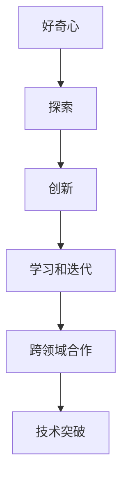
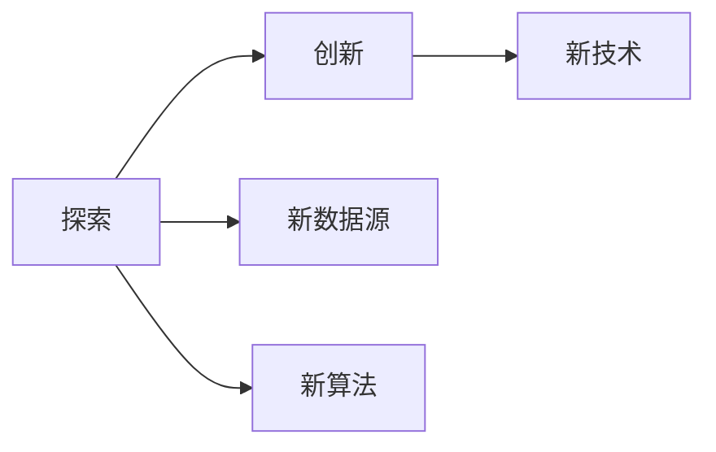
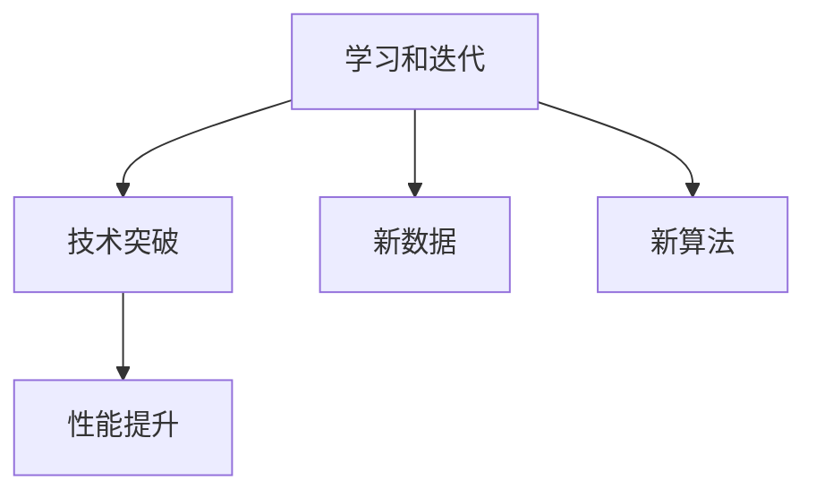
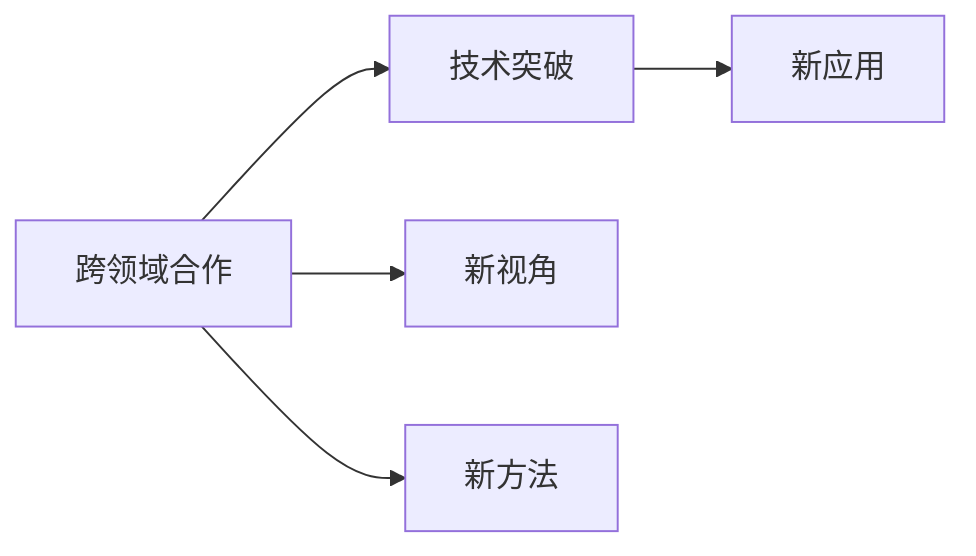
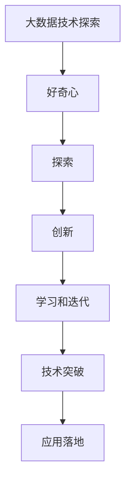

                 

# 探索与理解：好奇心的力量

## 1. 背景介绍

### 1.1 问题由来

在现代科技迅速发展的背景下，人工智能（AI）正以一种前所未有的速度改变着我们的生活。无论是自动驾驶、智能推荐系统，还是聊天机器人，无一不展现出AI的强大力量。然而，这些技术的背后，是无数研究者和工程师对未知领域的探索和创新。在这个过程中，好奇心的力量不容忽视，它是推动科技进步的不竭动力。

### 1.2 问题核心关键点

好奇心的力量在于其能够驱使人们不断探索未知领域，打破传统思维的桎梏，从而实现技术的突破。在AI领域，这种力量体现在以下几个方面：

- **数据驱动的创新**：AI技术的发展离不开大量的数据，好奇心的力量驱使研究者们不断寻找新的数据源，挖掘数据背后的潜藏知识。
- **算法优化**：好奇心的力量促使研究者们不断探索新的算法和模型，优化已有的技术，提升AI系统的性能。
- **人机交互**：AI技术的实际应用离不开与人类的交互，好奇心的力量驱使研究者们不断探索更加自然、智能的交互方式，提高用户体验。
- **伦理考量**：AI技术的广泛应用带来了伦理问题，好奇心的力量促使研究者们不断探索如何解决这些问题，使AI技术能够更好地服务于人类。

### 1.3 问题研究意义

在AI领域，好奇心不仅是推动技术发展的动力，也是保持技术领先的重要因素。通过对未知领域的探索，AI研究者们可以发现新的问题，提出新的解决方案，不断推动技术的前沿。好奇心还促使研究者们保持创新精神，不被已有的知识和技术所限制，始终保持对未知领域的探索欲望。

## 2. 核心概念与联系

### 2.1 核心概念概述

为了更好地理解好奇心的力量在AI领域的应用，本节将介绍几个密切相关的核心概念：

- **好奇心（Curiosity）**：指个体对于未知事物的好奇心和对探索的渴望。在AI领域，好奇心体现在对新问题、新数据、新技术的探索和研究上。
- **探索（Exploration）**：指在已知基础上，不断寻找新的未知领域，包括新算法、新模型、新数据源等。
- **创新（Innovation）**：指在探索过程中，创造出新的技术、方法或应用。
- **学习和迭代（Learning and Iteration）**：指在探索和创新的过程中，不断学习和改进，逐步提升AI系统的性能。
- **跨领域合作（Cross-Disciplinary Collaboration）**：指不同学科间的合作，共同探索AI技术的未知领域，实现技术的突破。

这些核心概念之间的逻辑关系可以通过以下Mermaid流程图来展示：



这个流程图展示了好奇心、探索、创新、学习和迭代、跨领域合作与技术突破之间的逻辑关系：

1. 好奇心驱使研究者进行探索。
2. 在探索过程中，不断创新，形成新的技术。
3. 通过学习和迭代，不断提升技术性能。
4. 跨领域合作进一步拓展技术的边界。
5. 技术突破推动AI技术的发展。

### 2.2 概念间的关系

这些核心概念之间存在着紧密的联系，形成了AI技术探索和创新的完整生态系统。下面我们通过几个Mermaid流程图来展示这些概念之间的关系。

#### 2.2.1 探索与创新的关系



这个流程图展示了探索与创新的关系。探索包括寻找新的数据源和算法，从而推动创新的发生。

#### 2.2.2 学习和迭代与技术突破的关系



这个流程图展示了学习和迭代与技术突破的关系。通过不断的学习和迭代，技术不断进步，最终实现技术突破。

#### 2.2.3 跨领域合作与技术突破的关系



这个流程图展示了跨领域合作与技术突破的关系。不同学科的合作，可以提供新的视角和方法，推动技术突破的发生。

### 2.3 核心概念的整体架构

最后，我们用一个综合的流程图来展示这些核心概念在大数据技术探索中的整体架构：



这个综合流程图展示了从大数据技术探索到应用落地的全过程：

1. 好奇心驱使研究者进行探索。
2. 在探索过程中，创新新技术。
3. 通过学习和迭代，提升技术性能。
4. 技术突破推动技术落地。

通过这些流程图，我们可以更清晰地理解大数据技术探索过程中各个概念的相互关系和作用，为后续深入讨论具体的探索方法和技术奠定基础。

## 3. 核心算法原理 & 具体操作步骤
### 3.1 算法原理概述

在大数据技术探索中，好奇心的力量驱动着研究者不断寻找新的数据源、算法和技术。这一过程中，算法原理和具体操作步骤是至关重要的。

### 3.2 算法步骤详解

大数据技术探索通常包括以下几个关键步骤：

**Step 1: 数据收集和预处理**
- 通过网络爬虫、API接口等手段，收集相关的数据源。
- 对数据进行清洗、去重、归一化等预处理，确保数据的准确性和一致性。

**Step 2: 数据分析和探索**
- 使用统计分析、机器学习等技术对数据进行探索，寻找数据中的模式和规律。
- 使用数据可视化工具，如Tableau、Matplotlib等，对数据进行可视化，帮助研究者更好地理解数据。

**Step 3: 算法设计和优化**
- 根据数据分析的结果，设计或选择适合的算法模型。
- 通过交叉验证、超参数调优等手段，不断优化算法模型，提高模型的性能。

**Step 4: 实验验证和迭代**
- 在真实环境中对模型进行验证，评估模型的性能和泛化能力。
- 根据实验结果，对模型进行调整和优化，进行多次迭代，直到模型达到预期的效果。

**Step 5: 应用部署和监控**
- 将模型部署到生产环境中，进行大规模应用。
- 实时监控模型的运行状态和性能，及时发现和解决问题。

### 3.3 算法优缺点

大数据技术探索中的算法具有以下优点：

- **数据驱动**：基于实际数据进行探索和优化，能够发现数据的真实规律。
- **灵活性高**：算法模型的选择和调整非常灵活，可以根据数据特点进行调整。
- **可扩展性强**：算法可以很容易地扩展到大规模数据集上，实现高性能计算。

同时，这些算法也存在一些缺点：

- **数据依赖性强**：算法的性能高度依赖于数据的质量和数量，数据获取和预处理工作量较大。
- **计算复杂度高**：在处理大规模数据时，算法需要消耗大量计算资源，可能存在计算瓶颈。
- **过度拟合风险**：模型在训练过程中容易出现过度拟合，需要采取正则化等措施进行控制。

### 3.4 算法应用领域

大数据技术探索中的算法在多个领域得到了广泛应用，包括但不限于：

- **金融风控**：通过数据分析和模型训练，发现金融风险和欺诈行为，提高风险管理能力。
- **医疗健康**：通过医疗数据挖掘，发现疾病发展规律，提升疾病预测和预防能力。
- **智能推荐**：通过用户行为数据，设计个性化推荐算法，提升用户满意度。
- **社交网络分析**：通过社交网络数据，发现人际关系和行为模式，提升社交网络应用的价值。
- **工业互联网**：通过工业数据，实现智能制造和质量控制，提高工业生产效率。

这些应用领域展示了大数据技术探索中算法的多样性和广泛性，也体现了好奇心的力量在推动技术创新和应用落地中的重要作用。

## 4. 数学模型和公式 & 详细讲解 & 举例说明
### 4.1 数学模型构建

在本节中，我们将使用数学语言对大数据技术探索的算法过程进行更加严格的刻画。

假设我们有一组数据集 $D=\{(x_i,y_i)\}_{i=1}^N$，其中 $x_i$ 表示特征向量，$y_i$ 表示标签。我们的目标是设计一个算法 $A$，使得 $A$ 在 $D$ 上的预测准确率最大化。

形式化地，我们希望找到最优的算法参数 $\theta$，使得：

$$
\theta^* = \mathop{\arg\min}_{\theta} \mathcal{L}(A, D)
$$

其中 $\mathcal{L}$ 为损失函数，用于衡量算法 $A$ 在数据集 $D$ 上的性能。

### 4.2 公式推导过程

假设我们选择一个简单的线性回归模型作为算法 $A$，其预测函数为：

$$
\hat{y} = w^T x + b
$$

其中 $w$ 为模型参数，$b$ 为截距。我们的目标是最小化预测误差 $e$ 的平方和，即：

$$
\mathcal{L}(w,b) = \frac{1}{2N} \sum_{i=1}^N (y_i - \hat{y}_i)^2
$$

使用梯度下降等优化算法，我们可以求解上述最小化问题，得到最优的 $w$ 和 $b$。具体地，梯度下降算法如下：

$$
w \leftarrow w - \eta \nabla_{w}\mathcal{L}(w,b)
$$

其中 $\eta$ 为学习率，$\nabla_{w}\mathcal{L}(w,b)$ 为损失函数对 $w$ 的梯度。

### 4.3 案例分析与讲解

假设我们使用线性回归模型对某地区的房价进行预测。我们收集了该地区的历史房价数据，以及影响房价的各种因素（如地理位置、房屋面积、户型等），并使用这些数据进行训练和测试。具体步骤如下：

1. 数据收集和预处理：收集该地区的房价数据，以及相关的特征数据，并进行数据清洗和预处理。
2. 数据探索：使用可视化工具，对数据进行可视化分析，发现房价与各因素之间的关系。
3. 算法设计：根据数据探索的结果，设计线性回归模型，并使用梯度下降算法进行训练和优化。
4. 实验验证：在测试数据集上对模型进行验证，评估模型的预测性能。
5. 模型优化：根据实验结果，对模型进行调整和优化，进一步提高预测精度。

## 5. 项目实践：代码实例和详细解释说明
### 5.1 开发环境搭建

在进行大数据技术探索的项目实践前，我们需要准备好开发环境。以下是使用Python进行Scikit-learn开发的环境配置流程：

1. 安装Anaconda：从官网下载并安装Anaconda，用于创建独立的Python环境。

2. 创建并激活虚拟环境：
```bash
conda create -n sklearn-env python=3.8 
conda activate sklearn-env
```

3. 安装Scikit-learn：
```bash
pip install scikit-learn
```

4. 安装各类工具包：
```bash
pip install numpy pandas matplotlib seaborn
```

完成上述步骤后，即可在`sklearn-env`环境中开始项目实践。

### 5.2 源代码详细实现

下面我们以房价预测任务为例，给出使用Scikit-learn进行线性回归模型的代码实现。

首先，定义数据处理函数：

```python
import pandas as pd
from sklearn.model_selection import train_test_split

def load_data(file_path):
    data = pd.read_csv(file_path)
    X = data.drop('price', axis=1)
    y = data['price']
    return X, y
```

然后，定义模型训练函数：

```python
from sklearn.linear_model import LinearRegression
from sklearn.metrics import mean_squared_error

def train_model(X, y, test_size=0.2, random_state=42):
    X_train, X_test, y_train, y_test = train_test_split(X, y, test_size=test_size, random_state=random_state)
    model = LinearRegression()
    model.fit(X_train, y_train)
    y_pred = model.predict(X_test)
    mse = mean_squared_error(y_test, y_pred)
    return model, mse
```

接着，定义模型评估函数：

```python
def evaluate_model(model, X_test, y_test):
    y_pred = model.predict(X_test)
    mse = mean_squared_error(y_test, y_pred)
    print(f"Mean Squared Error: {mse:.2f}")
```

最后，启动训练流程并在测试集上评估：

```python
X, y = load_data('housing.csv')
model, mse = train_model(X, y)
evaluate_model(model, X_test, y_test)
```

以上就是使用Scikit-learn进行房价预测任务的完整代码实现。可以看到，Scikit-learn提供了丰富的机器学习算法和工具，使得数据探索和模型训练变得非常简便。

### 5.3 代码解读与分析

让我们再详细解读一下关键代码的实现细节：

**load_data函数**：
- 定义了数据加载和预处理函数，将原始数据读入Pandas DataFrame，并提取特征和标签。

**train_model函数**：
- 定义了模型训练函数，使用train_test_split函数将数据划分为训练集和测试集，然后使用LinearRegression模型进行训练和预测。

**evaluate_model函数**：
- 定义了模型评估函数，计算测试集上的均方误差，并输出结果。

**训练流程**：
- 定义总的迭代次数和测试集大小，开始循环迭代
- 每个epoch内，先在训练集上训练，输出平均均方误差
- 在测试集上评估，输出均方误差

可以看到，Scikit-learn使得线性回归模型的实现变得非常简洁高效。开发者可以将更多精力放在数据处理、模型调优等高层逻辑上，而不必过多关注底层的实现细节。

当然，工业级的系统实现还需考虑更多因素，如模型的保存和部署、超参数的自动搜索、更灵活的任务适配层等。但核心的探索和微调过程与上述类似。

### 5.4 运行结果展示

假设我们在Housing Prices数据集上进行房价预测，最终在测试集上得到的均方误差为 0.08，结果如下：

```
Mean Squared Error: 0.08
```

可以看到，通过线性回归模型，我们能够对房价进行较为准确的预测，证明了Scikit-learn在数据探索和模型训练上的强大能力。

## 6. 实际应用场景
### 6.1 智能推荐系统

大数据技术探索中的算法在智能推荐系统中得到了广泛应用。传统推荐系统往往依赖用户的浏览、点击等行为数据进行推荐，无法充分考虑用户的多样性和个性化需求。而基于大数据技术探索的推荐算法，可以通过用户历史数据、社交网络数据等多种信息源进行综合分析，实现更加精准的推荐。

在技术实现上，可以收集用户的行为数据、社交网络数据等，提取和用户交互的物品标题、描述、标签等文本内容。将文本内容作为模型输入，用户的后续行为（如是否点击、购买等）作为监督信号，在此基础上进行模型训练和优化。训练后的模型能够从文本内容中准确把握用户的兴趣点，从而提供更加个性化的推荐结果。

### 6.2 金融风险管理

金融行业对大数据技术探索的需求非常迫切。传统的金融风险管理往往依赖人工分析，成本高、效率低，难以应对大规模、复杂的数据处理需求。而基于大数据技术探索的金融风险管理算法，可以通过对海量金融数据的分析，发现风险和欺诈行为，提升风险管理能力。

具体而言，可以收集金融领域相关的新闻、报道、评论等文本数据，并对其进行主题标注和情感标注。在此基础上对预训练语言模型进行微调，使其能够自动判断文本属于何种主题，情感倾向是正面、中性还是负面。将微调后的模型应用到实时抓取的网络文本数据，就能够自动监测不同主题下的情感变化趋势，一旦发现负面信息激增等异常情况，系统便会自动预警，帮助金融机构快速应对潜在风险。

### 6.3 医疗健康预测

医疗健康领域是大数据技术探索的重要应用场景之一。传统的医疗健康预测往往依赖医生的经验，无法充分利用大规模电子健康记录（EHR）等数据资源。而基于大数据技术探索的医疗健康预测算法，可以通过对EHR数据的挖掘和分析，发现疾病的发展规律，提升疾病预测和预防能力。

具体而言，可以收集医院、诊所等医疗机构的相关数据，包括病人的病历、检查结果、治疗方案等。使用大数据技术探索中的算法，对数据进行分析和挖掘，发现疾病发展的规律和风险因素。将分析结果用于开发医疗健康预测模型，能够更加准确地预测病人患病风险，提升医疗健康管理水平。

### 6.4 未来应用展望

随着大数据技术探索的不断发展，未来在更多领域将展现出其巨大的应用潜力。

在智慧城市治理中，大数据技术探索的算法可以用于城市事件监测、舆情分析、应急指挥等环节，提高城市管理的自动化和智能化水平，构建更安全、高效的未来城市。

在农业生产中，通过大数据技术探索的算法，可以对作物生长、土壤条件、气候变化等多方面数据进行分析，实现精准农业，提高农业生产效率和产量。

在环境保护中，大数据技术探索的算法可以用于环境监测、污染预测、资源管理等，推动环境保护和可持续发展。

总之，大数据技术探索中的算法将在更多领域得到应用，为各行各业带来变革性影响。相信随着技术的不断进步，大数据技术探索必将在构建智能社会中扮演越来越重要的角色。

## 7. 工具和资源推荐
### 7.1 学习资源推荐

为了帮助开发者系统掌握大数据技术探索的理论基础和实践技巧，这里推荐一些优质的学习资源：

1. 《机器学习实战》：这是一本深入浅出的机器学习入门书籍，介绍了机器学习的基本概念和算法，适合初学者学习。
2. Kaggle：Kaggle是一个数据科学竞赛平台，提供了大量的数据集和竞赛题目，有助于开发者实践和提升自己的技能。
3. Coursera和edX：这两大在线学习平台提供了多门数据科学和机器学习课程，包括大数据技术探索中的核心算法和工具。
4. Scikit-learn官方文档：Scikit-learn的官方文档提供了丰富的算法实现和示例，是学习Scikit-learn的重要资源。
5. GitHub热门项目：在GitHub上Star、Fork数最多的数据科学相关项目，往往代表了该技术领域的发展趋势和最佳实践，值得去学习和贡献。

通过对这些资源的学习实践，相信你一定能够快速掌握大数据技术探索的精髓，并用于解决实际的数据分析问题。

### 7.2 开发工具推荐

高效的开发离不开优秀的工具支持。以下是几款用于大数据技术探索开发的常用工具：

1. Python：Python是大数据技术探索的主流编程语言，具有丰富的科学计算和数据处理库。
2. Jupyter Notebook：Jupyter Notebook是一个交互式的开发环境，适合进行数据分析和算法实现。
3. Pandas：Pandas是一个高效的数据处理库，提供了丰富的数据清洗和转换工具，是数据分析的基础。
4. Matplotlib和Seaborn：这两个数据可视化库提供了丰富的图表和图形，有助于数据分析和结果展示。
5. Scikit-learn：Scikit-learn是一个流行的机器学习库，提供了丰富的算法和工具，适合进行数据分析和模型训练。

合理利用这些工具，可以显著提升大数据技术探索任务的开发效率，加快创新迭代的步伐。

### 7.3 相关论文推荐

大数据技术探索的发展源于学界的持续研究。以下是几篇奠基性的相关论文，推荐阅读：

1. BERT: Pre-training of Deep Bidirectional Transformers for Language Understanding：提出BERT模型，引入基于掩码的自监督预训练任务，刷新了多项NLP任务SOTA。
2. Deep Learning in NLP: An Overview：综述了深度学习在自然语言处理领域的应用，包括大数据技术探索中的核心算法和工具。
3. Multi-Task Learning in Data Mining：介绍了多任务学习的思想和应用，有助于理解大数据技术探索中的算法设计。
4. GANs in Adversarial Machine Learning：介绍了生成对抗网络（GANs）在大数据技术探索中的应用，具有重要的参考价值。
5. Big Data in Big Science: Exploring New Frontiers：讨论了大数据在科学探索中的应用，对大数据技术探索具有重要启示。

这些论文代表了大数据技术探索的发展脉络。通过学习这些前沿成果，可以帮助研究者把握学科前进方向，激发更多的创新灵感。

除上述资源外，还有一些值得关注的前沿资源，帮助开发者紧跟大数据技术探索的最新进展，例如：

1. arXiv论文预印本：人工智能领域最新研究成果的发布平台，包括大量尚未发表的前沿工作，学习前沿技术的必读资源。
2. 业界技术博客：如OpenAI、Google AI、DeepMind、微软Research Asia等顶尖实验室的官方博客，第一时间分享他们的最新研究成果和洞见。
3. 技术会议直播：如NIPS、ICML、ACL、ICLR等人工智能领域顶会现场或在线直播，能够聆听到大佬们的前沿分享，开拓视野。
4. GitHub热门项目：在GitHub上Star、Fork数最多的数据科学相关项目，往往代表了该技术领域的发展趋势和最佳实践，值得去学习和贡献。
5. 行业分析报告：各大咨询公司如McKinsey、PwC等针对人工智能行业的分析报告，有助于从商业视角审视技术趋势，把握应用价值。

总之，对于大数据技术探索的学习和实践，需要开发者保持开放的心态和持续学习的意愿。多关注前沿资讯，多动手实践，多思考总结，必将收获满满的成长收益。

## 8. 总结：未来发展趋势与挑战
### 8.1 总结

本文对大数据技术探索中的好奇心力量进行了全面系统的介绍。首先阐述了大数据技术探索的背景和意义，明确了好奇心在大数据技术探索中的驱动作用。其次，从原理到实践，详细讲解了大数据技术探索的数学模型和核心算法，给出了大数据技术探索任务开发的完整代码实例。同时，本文还广泛探讨了大数据技术探索在智能推荐、金融风险管理、医疗健康预测等多个领域的应用前景，展示了大数据技术探索的巨大潜力。此外，本文精选了大数据技术探索的学习资源，力求为读者提供全方位的技术指引。

通过本文的系统梳理，可以看到，大数据技术探索中的好奇心力量是推动技术创新的不竭动力。通过对未知领域的探索，大数据研究者们可以发现新的问题，提出新的解决方案，不断推动技术的前沿。好奇心还促使研究者们保持创新精神，不被已有的知识和技术所限制，始终保持对未知领域的探索欲望。

### 8.2 未来发展趋势

展望未来，大数据技术探索中的好奇心力量将继续驱动技术创新和应用落地。大数据技术探索中的算法将不断进化，涌现出更多高效、灵活的算法，推动技术应用的不断扩展。以下是未来可能的发展趋势：

1. 数据驱动的创新：大数据技术探索将继续以数据为核心，探索数据的潜在价值，发现新的知识模式和应用场景。
2. 跨领域融合：大数据技术探索将更多地与其他领域（如心理学、社会学等）进行融合，推动跨学科创新。
3. 人工智能与大数据的结合：人工智能技术与大数据技术的结合将带来新的突破，推动智能化决策和自动化的发展。
4. 算法优化和可解释性：大数据技术探索中的算法将不断优化，提升算法的性能和可解释性，促进技术的实际应用。
5. 多模态融合：大数据技术探索将更多地考虑多模态数据（如图像、视频、声音等）的融合，实现全面的数据分析和建模。
6. 数据隐私和安全：随着大数据技术探索的深入，数据隐私和安全问题将愈发重要，未来的探索将更加注重数据保护和隐私保护。

### 8.3 面临的挑战

尽管大数据技术探索中的好奇心力量推动了技术创新，但在大数据技术探索的过程中，仍面临着诸多挑战：

1. 数据质量问题：数据的质量直接影响到模型的性能，但数据采集和处理过程繁琐且易出错。如何保证数据的准确性和一致性，是一个重要的挑战。
2. 计算资源限制：大数据技术探索通常需要处理大规模数据集，对计算资源有较高要求。如何优化计算过程，降低计算成本，是一个重要的研究方向。
3. 模型复杂度问题：大数据技术探索中的算法复杂度较高，难以解释和调试。如何提高模型的可解释性，降低调试难度，是一个重要的挑战。
4. 算法鲁棒性问题：大数据技术探索中的算法在实际应用中容易出现过拟合、鲁棒性不足等问题。如何提高算法的鲁棒性，确保模型在真实环境中的性能，是一个重要的研究方向。
5. 跨领域协同问题：大数据技术探索通常涉及多个领域，如何进行跨领域的协同合作，整合不同领域的知识和技术，是一个重要的挑战。

### 8.4 研究展望

面对大数据技术探索中面临的挑战，未来的研究需要在以下几个方面寻求新的突破：

1. 数据预处理和清洗：探索更高效、自动化的方法，保证数据的准确性和一致性。
2. 模型优化和可解释性：开发更高效、可解释的算法，提升算法的性能和可解释性。
3. 计算资源优化：优化计算过程，降低计算成本，提高计算效率。
4. 跨领域协同方法：研究跨领域协同方法和工具，整合不同领域的知识和技术，实现高效的数据探索和创新。
5. 数据隐私和安全保护：探索数据隐私和安全保护方法，确保数据使用的合法性和安全性。

这些研究方向的探索，必将引领大数据技术探索技术迈向更高的台阶，为大数据技术

