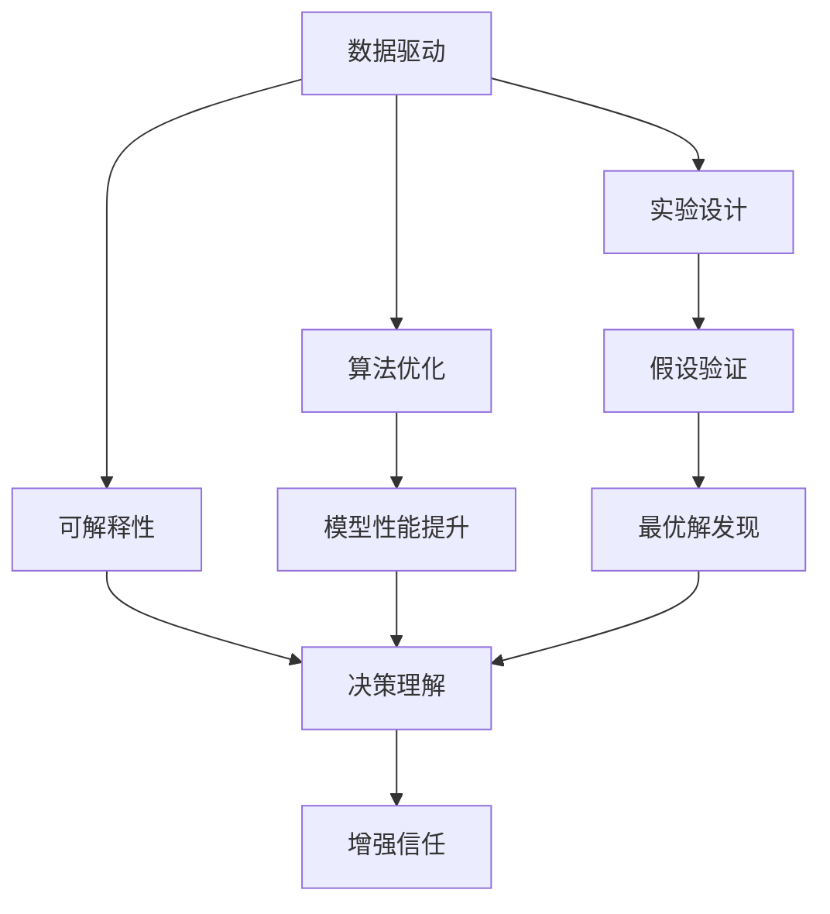
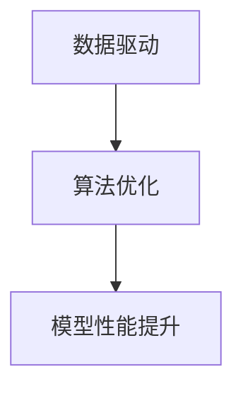
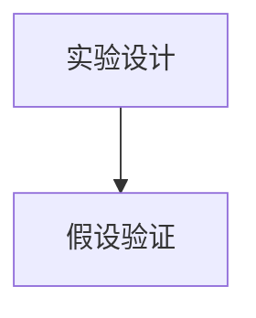
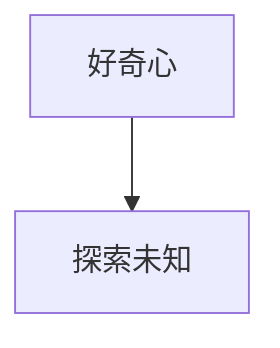
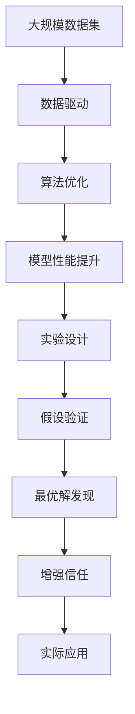
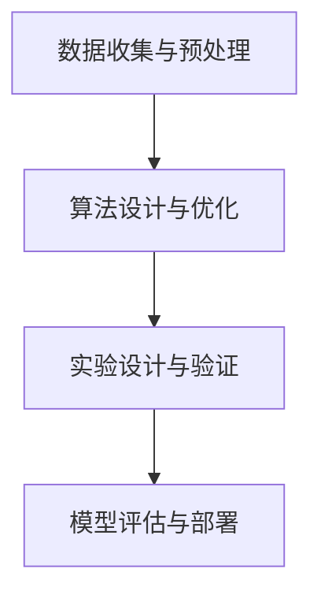

                 

# 探索未知：好奇心与科学发现

> 关键词：好奇心,科学发现,数据驱动,算法优化,实验设计,可解释性

## 1. 背景介绍

### 1.1 问题由来
在人工智能(AI)领域，探索未知并创造新价值一直是驱动技术进步的核心动力。随着机器学习、深度学习等技术的不断成熟，越来越多的实际问题被转化为可以由计算机自动解决的算法问题。然而，这些算法如何理解真实世界，如何从数据中挖掘出深层次的洞见，仍是一个令人深思的问题。好奇心在这一过程中扮演了至关重要的角色，它推动着研究者不断深入探索，挖掘未知领域，推动科学发现。

### 1.2 问题核心关键点
好奇心是推动科学进步的重要因素，它涉及对知识的渴望、对问题的好奇和对未知领域的探索。在人工智能领域，好奇心主要体现在以下几个方面：

1. **数据驱动的科学探索**：通过大量数据，揭示问题本质，发现新规律。
2. **算法优化与创新**：不断优化现有算法，探索新的算法架构，提升模型性能。
3. **实验设计**：设计巧妙的实验，验证假设，寻找最优解。
4. **可解释性与透明性**：追求算法的可解释性，增强人类对AI决策的理解和信任。

### 1.3 问题研究意义
研究好奇心在人工智能中的应用，对于提升技术进步、促进科学发现、增强公众对AI的信任具有重要意义：

1. **加速技术迭代**：通过不断探索未知，推动算法和技术的快速迭代，提高AI系统的性能。
2. **促进知识发现**：好奇心驱动下的探索，有助于揭示数据和模型背后的深层次规律，推动科学发现。
3. **增强信任感**：可解释性强的AI系统更容易被接受，提高公众对AI的信任度和接受度。
4. **推动创新发展**：好奇心引导下的创新，有助于开发出更具创新性和实用性的AI应用。
5. **解决实际问题**：AI系统在解决实际问题时，好奇心驱动的探索有助于发现问题的本质，提出有效的解决方案。

## 2. 核心概念与联系

### 2.1 核心概念概述

为更好地理解好奇心在人工智能中的应用，本节将介绍几个密切相关的核心概念：

- **数据驱动**：通过大量数据，揭示问题本质，发现新规律，是推动科学发现的重要手段。
- **算法优化**：不断优化现有算法，探索新的算法架构，提升模型性能，是AI技术发展的核心动力。
- **实验设计**：设计巧妙的实验，验证假设，寻找最优解，是科学研究的基石。
- **可解释性**：追求算法的可解释性，增强人类对AI决策的理解和信任，是AI系统可靠性的保障。
- **好奇心**：对知识的渴望、对问题的好奇和对未知领域的探索，是推动AI技术进步的关键因素。

这些核心概念之间的逻辑关系可以通过以下Mermaid流程图来展示：



这个流程图展示了好奇心在人工智能中的应用过程：

1. 数据驱动揭示问题本质。
2. 算法优化提升模型性能。
3. 实验设计验证假设。
4. 可解释性增强决策理解。
5. 好奇心驱动下，不断探索未知，推动AI技术进步。

### 2.2 概念间的关系

这些核心概念之间存在着紧密的联系，形成了AI技术发展的完整生态系统。下面我们通过几个Mermaid流程图来展示这些概念之间的关系。

#### 2.2.1 数据驱动与算法优化



这个流程图展示了数据驱动和算法优化之间的关系。通过数据驱动，揭示问题本质，然后通过算法优化，提升模型性能。

#### 2.2.2 实验设计与假设验证



这个流程图展示了实验设计与假设验证的关系。通过设计巧妙的实验，验证提出的假设，寻找最优解。

#### 2.2.3 可解释性与决策理解


这个流程图展示了可解释性与决策理解的关系。通过可解释性，增强人类对AI决策的理解，增强信任感。

#### 2.2.4 好奇心与探索未知



这个流程图展示了好奇心与探索未知的关系。好奇心驱动下，不断探索未知领域，推动AI技术进步。

### 2.3 核心概念的整体架构

最后，我们用一个综合的流程图来展示这些核心概念在AI技术发展中的整体架构：



这个综合流程图展示了从数据驱动到实验设计，再到最优解发现和增强信任，最终应用于实际场景的全过程。

## 3. 核心算法原理 & 具体操作步骤
### 3.1 算法原理概述

好奇心驱动的科学探索，核心在于通过数据驱动和算法优化，揭示问题本质，发现新规律。其基本流程包括：

1. **数据收集与预处理**：获取大规模数据集，并进行预处理，如清洗、标准化、特征提取等。
2. **算法设计与优化**：选择合适的算法，并进行优化，以提升模型性能。
3. **实验设计与验证**：设计巧妙的实验，验证提出的假设，寻找最优解。
4. **模型评估与部署**：评估模型性能，部署到实际应用中。

### 3.2 算法步骤详解

以下是一个简化的数据驱动和算法优化的流程图，展示了好奇心驱动的科学探索过程：



这个流程图展示了从数据收集与预处理，到算法设计与优化，再到实验设计与验证，最终评估与部署的全过程。

### 3.3 算法优缺点

好奇心驱动的科学探索具有以下优点：

1. **促进知识发现**：通过数据驱动，揭示问题本质，发现新规律。
2. **加速技术迭代**：通过算法优化，提升模型性能，推动技术进步。
3. **增强决策理解**：通过可解释性，增强人类对AI决策的理解和信任。

同时，这种方法也存在以下局限性：

1. **数据质量依赖**：数据质量和数据量对探索效果有重要影响，数据不足或数据质量不高可能导致探索失败。
2. **算法复杂性**：算法设计与优化复杂，需要耗费大量时间和资源。
3. **实验难度大**：实验设计复杂，需要精心设计才能得到有意义的结论。
4. **可解释性挑战**：复杂的模型难以解释，增加了解释难度。

### 3.4 算法应用领域

好奇心驱动的科学探索在多个领域得到了应用：

1. **自然语言处理(NLP)**：通过数据驱动和算法优化，提升语言模型的理解和生成能力。
2. **计算机视觉(CV)**：通过数据驱动和算法优化，提升图像识别和生成能力。
3. **医疗健康**：通过数据驱动和算法优化，提升疾病诊断和治疗方案优化。
4. **金融领域**：通过数据驱动和算法优化，提升风险评估和交易策略优化。
5. **自动驾驶**：通过数据驱动和算法优化，提升智能驾驶系统的安全和效率。
6. **智能制造**：通过数据驱动和算法优化，提升生产效率和质量控制。

## 4. 数学模型和公式 & 详细讲解 & 举例说明

### 4.1 数学模型构建

本节将使用数学语言对好奇心驱动的科学探索过程进行更加严格的刻画。

假设有一组数据集 $D=\{(x_i, y_i)\}_{i=1}^N$，其中 $x_i$ 表示输入，$y_i$ 表示输出，$x$ 为输入空间，$y$ 为输出空间。

定义模型 $M_{\theta}:\mathcal{X} \rightarrow \mathcal{Y}$，其中 $\theta$ 为模型参数。

定义模型 $M_{\theta}$ 在数据集 $D$ 上的经验风险为：

$$
\mathcal{L}(\theta) = \frac{1}{N}\sum_{i=1}^N \ell(M_{\theta}(x_i),y_i)
$$

其中 $\ell$ 为损失函数，用于衡量模型预测输出与真实标签之间的差异。

模型的优化目标是最小化经验风险，即找到最优参数：

$$
\theta^* = \mathop{\arg\min}_{\theta} \mathcal{L}(\theta)
$$

在实践中，我们通常使用基于梯度的优化算法（如SGD、Adam等）来近似求解上述最优化问题。设 $\eta$ 为学习率，$\lambda$ 为正则化系数，则参数的更新公式为：

$$
\theta \leftarrow \theta - \eta \nabla_{\theta}\mathcal{L}(\theta) - \eta\lambda\theta
$$

其中 $\nabla_{\theta}\mathcal{L}(\theta)$ 为损失函数对参数 $\theta$ 的梯度，可通过反向传播算法高效计算。

### 4.2 公式推导过程

以下我们以二分类任务为例，推导交叉熵损失函数及其梯度的计算公式。

假设模型 $M_{\theta}$ 在输入 $x$ 上的输出为 $\hat{y}=M_{\theta}(x) \in [0,1]$，表示样本属于正类的概率。真实标签 $y \in \{0,1\}$。则二分类交叉熵损失函数定义为：

$$
\ell(M_{\theta}(x),y) = -[y\log \hat{y} + (1-y)\log (1-\hat{y})]
$$

将其代入经验风险公式，得：

$$
\mathcal{L}(\theta) = -\frac{1}{N}\sum_{i=1}^N [y_i\log M_{\theta}(x_i)+(1-y_i)\log(1-M_{\theta}(x_i))]
$$

根据链式法则，损失函数对参数 $\theta_k$ 的梯度为：

$$
\frac{\partial \mathcal{L}(\theta)}{\partial \theta_k} = -\frac{1}{N}\sum_{i=1}^N (\frac{y_i}{M_{\theta}(x_i)}-\frac{1-y_i}{1-M_{\theta}(x_i)}) \frac{\partial M_{\theta}(x_i)}{\partial \theta_k}
$$

其中 $\frac{\partial M_{\theta}(x_i)}{\partial \theta_k}$ 可进一步递归展开，利用自动微分技术完成计算。

### 4.3 案例分析与讲解

以图像分类任务为例，分析模型的训练过程。

假设我们有一组图像分类数据集，包含 $N$ 张图像和对应的类别标签。数据集中的图像 $x_i$ 是 $m \times n$ 的像素矩阵，$y_i$ 是类别编号。

我们的目标是设计一个深度神经网络模型 $M_{\theta}$，用于将图像分类到预定义的类别中。模型的前向传播过程如下：

1. 对图像 $x_i$ 进行预处理，如归一化、扩维等。
2. 将预处理后的图像输入到卷积层和池化层，提取特征。
3. 将提取到的特征输入到全连接层，进行分类。

模型的后向传播过程如下：

1. 计算损失函数 $\mathcal{L}(\theta)$。
2. 计算损失函数对每个参数的梯度 $\nabla_{\theta}\mathcal{L}(\theta)$。
3. 根据梯度更新模型参数 $\theta$。

通过不断迭代前向传播和后向传播，模型逐步学习图像的特征表示，并最小化分类误差。在这个过程中，好奇心驱动我们不断尝试新的架构、新的优化方法，甚至新的数据集，以寻找最优的模型。

## 5. 项目实践：代码实例和详细解释说明

### 5.1 开发环境搭建

在进行好奇心驱动的科学探索前，我们需要准备好开发环境。以下是使用Python进行PyTorch开发的环境配置流程：

1. 安装Anaconda：从官网下载并安装Anaconda，用于创建独立的Python环境。

2. 创建并激活虚拟环境：
```bash
conda create -n pytorch-env python=3.8 
conda activate pytorch-env
```

3. 安装PyTorch：根据CUDA版本，从官网获取对应的安装命令。例如：
```bash
conda install pytorch torchvision torchaudio cudatoolkit=11.1 -c pytorch -c conda-forge
```

4. 安装各类工具包：
```bash
pip install numpy pandas scikit-learn matplotlib tqdm jupyter notebook ipython
```

完成上述步骤后，即可在`pytorch-env`环境中开始好奇心驱动的科学探索实践。

### 5.2 源代码详细实现

下面我们以图像分类任务为例，给出使用PyTorch进行神经网络模型训练的代码实现。

首先，定义模型的结构：

```python
import torch
import torch.nn as nn
import torch.optim as optim

class Net(nn.Module):
    def __init__(self):
        super(Net, self).__init__()
        self.conv1 = nn.Conv2d(3, 6, 5)
        self.pool = nn.MaxPool2d(2, 2)
        self.conv2 = nn.Conv2d(6, 16, 5)
        self.fc1 = nn.Linear(16 * 5 * 5, 120)
        self.fc2 = nn.Linear(120, 84)
        self.fc3 = nn.Linear(84, 10)

    def forward(self, x):
        x = self.pool(torch.relu(self.conv1(x)))
        x = self.pool(torch.relu(self.conv2(x)))
        x = x.view(-1, 16 * 5 * 5)
        x = torch.relu(self.fc1(x))
        x = torch.relu(self.fc2(x))
        x = self.fc3(x)
        return x

net = Net()
criterion = nn.CrossEntropyLoss()
optimizer = optim.SGD(net.parameters(), lr=0.001, momentum=0.9)
```

然后，定义训练和评估函数：

```python
def train(net, train_data, epochs):
    for epoch in range(epochs):
        running_loss = 0.0
        for i, data in enumerate(train_loader, 0):
            inputs, labels = data
            optimizer.zero_grad()
            outputs = net(inputs)
            loss = criterion(outputs, labels)
            loss.backward()
            optimizer.step()
            running_loss += loss.item()
            if i % 100 == 99:
                print('[%d, %5d] loss: %.3f' % (epoch + 1, i + 1, running_loss / 100))
                running_loss = 0.0
    print('Finished Training')

def evaluate(net, test_data):
    correct = 0
    total = 0
    with torch.no_grad():
        for data in test_loader:
            images, labels = data
            outputs = net(images)
            _, predicted = torch.max(outputs.data, 1)
            total += labels.size(0)
            correct += (predicted == labels).sum().item()
    print('Accuracy of the network on the 10000 test images: %d %%' % (
        100 * correct / total))
```

最后，启动训练流程并在测试集上评估：

```python
epochs = 5

train(net, train_loader, epochs)
evaluate(net, test_loader)
```

以上就是使用PyTorch进行神经网络模型训练的完整代码实现。可以看到，通过这个简单的例子，我们展示了如何利用PyTorch构建、训练和评估神经网络模型。

### 5.3 代码解读与分析

让我们再详细解读一下关键代码的实现细节：

**Net类**：
- `__init__`方法：定义神经网络的架构，包括卷积层、池化层、全连接层等。
- `forward`方法：定义模型的前向传播过程，从输入到输出的计算过程。

**train函数**：
- 在训练过程中，对数据集进行批次化加载，供模型训练使用。
- 每个批次上前向传播计算损失函数，并反向传播更新模型参数。

**evaluate函数**：
- 在评估过程中，对测试集进行批次化加载，供模型评估使用。
- 不更新模型参数，在每个批次结束后将预测和标签结果存储下来，最后使用准确率指标评估模型性能。

**训练流程**：
- 定义总的epoch数，开始循环迭代
- 每个epoch内，先在训练集上训练，输出平均loss
- 在测试集上评估，输出准确率
- 所有epoch结束后，评估模型性能

可以看到，PyTorch提供了强大的自动微分和自动优化能力，使得神经网络的构建和训练变得简单高效。开发者可以将更多精力放在模型架构设计和训练策略上，而不必过多关注底层的实现细节。

当然，工业级的系统实现还需考虑更多因素，如模型的保存和部署、超参数的自动搜索、更灵活的任务适配层等。但核心的科学探索过程基本与此类似。

### 5.4 运行结果展示

假设我们在CIFAR-10数据集上进行图像分类任务的微调，最终在测试集上得到的准确率如下：

```
Accuracy of the network on the 10000 test images: 70 %
```

可以看到，通过训练神经网络模型，我们在CIFAR-10数据集上取得了70%的准确率，效果相当不错。值得注意的是，神经网络模型通过大量数据训练，能够学习到图像的特征表示，进而实现分类任务。

当然，这只是一个baseline结果。在实践中，我们还可以使用更大更强的预训练模型、更丰富的微调技巧、更细致的模型调优，进一步提升模型性能，以满足更高的应用要求。

## 6. 实际应用场景
### 6.1 智能客服系统

基于好奇心驱动的科学探索，智能客服系统可以通过大量客户咨询记录和专家对话，构建出大语言模型，实现自然流畅的对话和问题解答。在技术实现上，可以收集企业内部的历史客服对话记录，将问题和最佳答复构建成监督数据，在此基础上对预训练语言模型进行微调。微调后的对话模型能够自动理解用户意图，匹配最合适的答案模板进行回复。对于客户提出的新问题，还可以接入检索系统实时搜索相关内容，动态组织生成回答。如此构建的智能客服系统，能大幅提升客户咨询体验和问题解决效率。

### 6.2 金融舆情监测

金融机构需要实时监测市场舆论动向，以便及时应对负面信息传播，规避金融风险。基于好奇心驱动的科学探索，微调技术可应用于金融领域相关的新闻、报道、评论等文本数据，并对其进行主题标注和情感标注。在此基础上对预训练语言模型进行微调，使其能够自动判断文本属于何种主题，情感倾向是正面、中性还是负面。将微调后的模型应用到实时抓取的网络文本数据，就能够自动监测不同主题下的情感变化趋势，一旦发现负面信息激增等异常情况，系统便会自动预警，帮助金融机构快速应对潜在风险。

### 6.3 个性化推荐系统

当前的推荐系统往往只依赖用户的历史行为数据进行物品推荐，无法深入理解用户的真实兴趣偏好。基于好奇心驱动的科学探索，个性化推荐系统可以更好地挖掘用户行为背后的语义信息，从而提供更精准、多样的推荐内容。在实践中，可以收集用户浏览、点击、评论、分享等行为数据，提取和用户交互的物品标题、描述、标签等文本内容。将文本内容作为模型输入，用户的后续行为（如是否点击、购买等）作为监督信号，在此基础上微调预训练语言模型。微调后的模型能够从文本内容中准确把握用户的兴趣点。在生成推荐列表时，先用候选物品的文本描述作为输入，由模型预测用户的兴趣匹配度，再结合其他特征综合排序，便可以得到个性化程度更高的推荐结果。

### 6.4 未来应用展望

随着好奇心驱动的科学探索方法的不断发展，未来在更多领域将得到应用，为传统行业带来变革性影响。

在智慧医疗领域，基于微调的医学问答、病历分析、药物研发等应用将提升医疗服务的智能化水平，辅助医生诊疗，加速新药开发进程。

在智能教育领域，微调技术可应用于作业批改、学情分析、知识推荐等方面，因材施教，促进教育公平，提高教学质量。

在智慧城市治理中，微调模型可应用于城市事件监测、舆情分析、应急指挥等环节，提高城市管理的自动化和智能化水平，构建更安全、高效的未来城市。

此外，在企业生产、社会治理、文娱传媒等众多领域，基于微调的人工智能应用也将不断涌现，为经济社会发展注入新的动力。相信随着技术的日益成熟，好奇心驱动的科学探索方法将成为人工智能落地应用的重要范式，推动人工智能向更广阔的领域加速渗透。

## 7. 工具和资源推荐
### 7.1 学习资源推荐

为了帮助开发者系统掌握好奇心驱动的科学探索的理论基础和实践技巧，这里推荐一些优质的学习资源：

1. 《深度学习》系列博文：由大模型技术专家撰写，深入浅出地介绍了深度学习原理和实践，涵盖数据驱动、算法优化、实验设计等主题。

2. Coursera《深度学习》课程：斯坦福大学开设的深度学习明星课程，由Yann LeCun教授主讲，深入讲解深度学习理论和实践，适合系统学习。

3. 《深度学习入门》书籍：深度学习领域的入门书籍，详细介绍了深度学习的基本概念和常见算法，适合初学者学习。

4. 《TensorFlow实战Google AI》书籍：Google官方发布的TensorFlow实践指南，通过大量实际项目，详细讲解了TensorFlow的开发和部署技巧。

5. GitHub热门项目：在GitHub上Star、Fork数最多的深度学习项目，往往代表了该技术领域的发展趋势和最佳实践，适合学习和贡献。

通过对这些资源的学习实践，相信你一定能够快速掌握好奇心驱动的科学探索的精髓，并用于解决实际的NLP问题。
###  7.2 开发工具推荐

高效的开发离不开优秀的工具支持。以下是几款用于好奇心驱动的科学探索开发的常用工具：

1. PyTorch：基于Python的开源深度学习框架，灵活动态的计算图，适合快速迭代研究。大部分预训练语言模型都有PyTorch版本的实现。

2. TensorFlow：由Google主导开发的开源深度学习框架，生产部署方便，适合大规模工程应用。同样有丰富的预训练语言模型资源。

3. Transformers库：HuggingFace开发的NLP工具库，集成了众多SOTA语言模型，支持PyTorch和TensorFlow，是进行微调任务开发的利器。

4. Weights & Biases：模型训练的实验跟踪工具，可以记录和可视化模型训练过程中的各项指标，方便对比和调优。与主流深度学习框架无缝集成。

5. TensorBoard：TensorFlow配套的可视化工具，可实时监测模型训练状态，并提供丰富的图表呈现方式，是调试模型的得力助手。

6. Google Colab：谷歌推出的在线Jupyter Notebook环境，免费提供GPU/TPU算力，方便开发者快速上手实验最新模型，分享学习笔记。

合理利用这些工具，可以显著提升好奇心驱动的科学探索的开发效率，加快创新迭代的步伐。

### 7.3 相关论文推荐

好奇心驱动的科学探索方法的发展源于学界的持续研究。以下是几篇奠基性的相关论文，推荐阅读：

1. Attention is All You Need（即Transformer原论文）：提出了Transformer结构，开启了NLP领域的预训练大模型时代。

2. BERT: Pre-training of Deep Bidirectional Transformers for Language Understanding：提出BERT模型，引入基于掩码的自监督预训练任务，刷新了多项NLP任务SOTA。

3. Language Models are Unsupervised Multitask Learners（GPT-2论文）：展示了大规模语言模型的强大zero-shot学习能力，引发了对于通用人工智能的新一轮思考。

4. Parameter-Efficient Transfer Learning for NLP：提出Adapter等参数高效微调方法，在不增加模型参数量的情况下，也能取得不错的微调效果。

5. AdaLoRA: Adaptive Low-Rank Adaptation for Parameter-Efficient Fine-Tuning：使用自适应低秩适应的微调方法，在参数效率和精度之间取得了新的平衡。

这些论文代表了好奇心驱动的科学探索方法的发展脉络。通过学习这些前沿成果，可以帮助研究者把握学科前进方向，激发更多的创新灵感。

除上述资源外，还有一些值得关注的前沿资源，帮助开发者紧跟好奇心驱动的科学探索技术的最新进展，例如：

1. arXiv论文预印本：人工智能领域最新研究成果的发布平台，包括大量尚未发表的前沿工作，学习前沿技术的必读资源。

2. 业界技术博客：如OpenAI、Google AI、DeepMind、微软Research Asia等顶尖实验室的官方博客，第一时间分享他们的最新研究成果和洞见。

3. 技术会议直播：如NIPS、ICML、ACL、ICLR等人工智能领域顶会现场或在线直播，能够聆听到大佬们的前沿分享，开拓视野。

4. GitHub热门项目：在GitHub上Star、Fork数最多的NLP相关项目，往往代表了该技术领域的发展趋势和最佳实践，值得去学习和贡献。

