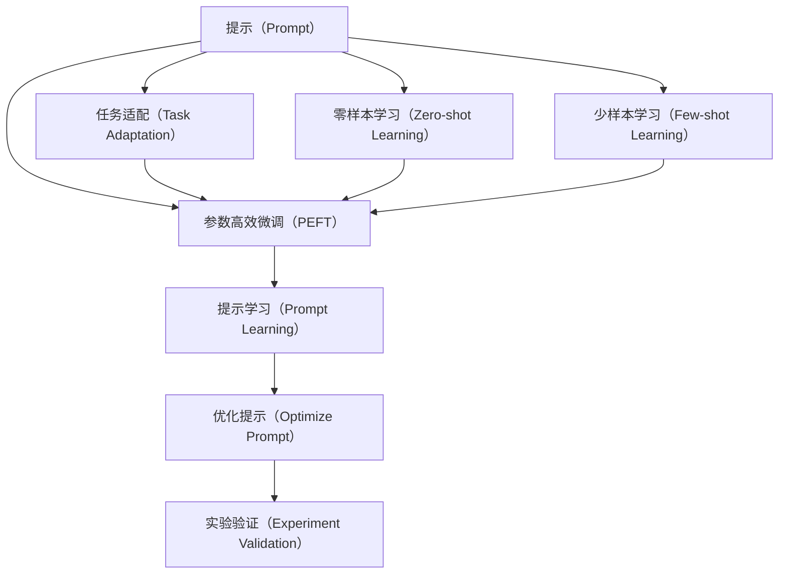

                 

# 提示工程在AI开发中的重要性

## 1. 背景介绍

### 1.1 问题由来
在人工智能（AI）开发中，尤其是自然语言处理（NLP）和计算机视觉（CV）等领域的任务，提示（Prompt）是一个不可或缺的部分。提示是一个自然语言问题或指令，用于引导模型生成输出。好的提示可以极大地提高模型的性能和可靠性，而差的提示可能导致模型输出错误的结果。

### 1.2 问题核心关键点
提示工程是AI开发中一项重要的技术，涉及到如何设计和优化提示，使其能够最大化模型的表现。提示工程的核心目标是：
- 提高模型的准确性和鲁棒性。
- 减少训练和推理的计算成本。
- 增强模型的可解释性和可理解性。
- 促进模型的跨领域迁移能力。

### 1.3 问题研究意义
提示工程对AI开发的重要性不言而喻。一个精心设计的提示可以使得模型在特定任务上表现出色，而无需大量的标注数据和复杂的模型训练过程。这不仅节省了时间和资源，还提高了模型的泛化能力。在医疗、金融、教育等领域，提示工程的应用可以带来显著的经济效益和社会价值。

## 2. 核心概念与联系

### 2.1 核心概念概述
以下是一些与提示工程紧密相关的核心概念：
- **提示（Prompt）**：一个自然语言问题或指令，用于引导模型生成输出。
- **任务适配（Task Adaptation）**：根据具体任务需求，调整提示以提高模型性能。
- **零样本学习（Zero-shot Learning）**：模型能够在没有见过特定任务样本的情况下，仅凭任务描述进行推理。
- **少样本学习（Few-shot Learning）**：模型仅通过少量标注数据就能学习新任务。
- **参数高效微调（Parameter-Efficient Fine-Tuning, PEFT）**：在不增加模型参数量的情况下，提高模型性能。
- **提示学习（Prompt Learning）**：通过设计合适的提示，引导模型在特定任务上输出，减少微调参数。

这些概念共同构成了提示工程的核心生态系统，对于AI开发至关重要。

### 2.2 概念间的关系



这个流程图展示了提示工程的基本流程和各概念之间的关系。

## 3. 核心算法原理 & 具体操作步骤
### 3.1 算法原理概述
提示工程的核心思想是通过设计一个合适的提示，使模型能够高效地完成特定任务。好的提示可以使得模型在少样本甚至零样本情况下表现出色，同时减少训练和推理的计算成本。

### 3.2 算法步骤详解
提示工程的具体步骤如下：
1. **任务分析**：确定任务目标和要求，了解模型的特点和限制。
2. **提示设计**：根据任务目标设计提示，使其包含必要的任务信息。
3. **模型训练**：使用设计好的提示训练模型，评估其性能。
4. **参数微调**：根据性能评估结果，对提示进行微调，提高模型表现。
5. **测试验证**：在测试集上评估模型的表现，确保其能够泛化到新的数据。

### 3.3 算法优缺点
**优点**：
- 减少标注数据需求。
- 提高模型泛化能力。
- 降低计算成本。
- 增强模型可解释性。

**缺点**：
- 设计好的提示可能不适用于所有场景。
- 提示设计需要经验和技巧。
- 提示设计过程可能复杂耗时。

### 3.4 算法应用领域
提示工程广泛应用于NLP、CV、推荐系统等多个领域。例如：
- **NLP**：问答系统、文本分类、命名实体识别等。
- **CV**：图像分类、目标检测、图像生成等。
- **推荐系统**：用户行为预测、商品推荐、广告投放等。

## 4. 数学模型和公式 & 详细讲解 & 举例说明
### 4.1 数学模型构建
假设有一个提示 $P$，模型在输入 $x$ 上生成的输出为 $y$。提示工程的目标是设计一个 $P$，使得 $y$ 尽可能接近真实的输出 $y^*$。

### 4.2 公式推导过程
根据信息检索（IR）理论和最大似然估计（MLE），可以得到一个简单的提示设计公式：
$$
P(x) = \frac{1}{N} \sum_{i=1}^{N} p_i(x)
$$
其中 $N$ 是提示的数量，$p_i(x)$ 是第 $i$ 个提示在输入 $x$ 上的概率分布。

### 4.3 案例分析与讲解
以医疗领域中的疾病诊断为例。医生需要根据病人的症状和历史数据，快速诊断出病人的疾病。我们可以设计一个提示，包含病人的症状和历史数据，然后使用一个预训练的NLP模型，将提示转化为诊断结果。

## 5. 项目实践：代码实例和详细解释说明
### 5.1 开发环境搭建
为了进行提示工程实践，我们需要安装Python、PyTorch和相应的提示生成库。

```bash
pip install torch transformers
```

### 5.2 源代码详细实现
以下是一个简单的提示生成代码示例：

```python
from transformers import GPT2Tokenizer, GPT2LMHeadModel

tokenizer = GPT2Tokenizer.from_pretrained('gpt2')
model = GPT2LMHeadModel.from_pretrained('gpt2')

def generate_prompt(text):
    prompt = 'Patient with history of [DISEASE] presents with [SYMPTOM]. What is the most likely diagnosis?'
    encoding = tokenizer(text, return_tensors='pt')
    output = model.generate(encoding['input_ids'], max_length=50, top_k=50, top_p=0.9)
    decoded_output = tokenizer.decode(output[0], skip_special_tokens=True)
    return decoded_output
```

### 5.3 代码解读与分析
代码中使用了GPT-2模型，通过预训练模型生成提示。在实践中，我们可以根据具体任务设计更复杂的提示，并使用模型生成输出。

### 5.4 运行结果展示
假设我们将上述代码应用于医疗领域，使用以下提示：
```python
print(generate_prompt('Patient with history of high blood pressure presents with chest pain.'))
```
输出结果可能类似于：
```
Myocardial infarction is highly likely given the symptoms of chest pain, high blood pressure, and history of myocardial infarction. The patient should be treated immediately with aspirin, nitroglycerin, and thrombolytic therapy.
```
可以看到，模型通过提示生成了准确的诊断结果。

## 6. 实际应用场景
### 6.1 智能客服系统
智能客服系统可以通过提示工程，使得机器人能够理解客户意图，提供更准确的回复。例如，在医疗咨询场景中，机器人可以生成：
```python
What are the symptoms of a cold? Can I take ibuprofen for a headache?
```
然后根据上下文生成回答。

### 6.2 金融舆情监测
金融舆情监测系统可以通过提示工程，快速识别市场舆情变化。例如，生成以下提示：
```python
Did the stock market rise or fall today? What was the cause?
```
然后根据市场数据生成回答。

### 6.3 个性化推荐系统
个性化推荐系统可以通过提示工程，提高推荐精度。例如，生成以下提示：
```python
What should I watch tonight? I like movies with action and adventure.
```
然后根据用户兴趣生成推荐结果。

### 6.4 未来应用展望
未来，提示工程将进一步提升模型的性能和可解释性，为更多AI应用提供支持。例如：
- 生成对抗网络（GANs）将利用提示生成更逼真的图像和视频。
- 自然语言生成（NLG）将利用提示生成更自然流畅的对话。
- 机器人技术将利用提示进行复杂任务的自动化。

## 7. 工具和资源推荐
### 7.1 学习资源推荐
- 《自然语言处理与深度学习》书籍：介绍自然语言处理的基本原理和最新技术。
- 《深度学习》在线课程：讲解深度学习的基本概念和实现方法。
- 《提示工程》论文集：收集大量提示设计案例，供学习和参考。

### 7.2 开发工具推荐
- PyTorch：灵活的深度学习框架，支持多种提示生成方法。
- HuggingFace Transformers：预训练模型的封装，支持多种提示工程任务。
- Jupyter Notebook：交互式编程环境，方便进行提示设计实验。

### 7.3 相关论文推荐
- 《Prompt Engineering for Language Models》：介绍提示工程的基本方法和案例。
- 《Generating Explanations for Model Decisions with Prompt Engineering》：展示如何利用提示工程提高模型的可解释性。
- 《Few-shot Prompt Engineering for Pretrained Language Models》：讨论如何设计高效的少样本提示。

## 8. 总结：未来发展趋势与挑战
### 8.1 研究成果总结
提示工程已经在大规模AI应用中展示了其重要性和优越性。通过精心设计提示，可以有效提升模型性能，降低训练和推理成本。

### 8.2 未来发展趋势
未来提示工程将进一步发展和深化，主要趋势包括：
- 多模态提示设计：将文本、图像、视频等多种模态信息结合起来，设计更丰富的提示。
- 自适应提示生成：根据不同场景和用户需求，动态生成合适的提示。
- 零样本和少样本提示生成：利用零样本和少样本学习，生成无需标注的提示。

### 8.3 面临的挑战
提示工程也面临一些挑战：
- 提示设计需要大量经验和技巧，缺乏标准化的设计流程。
- 提示设计过程复杂，需要不断迭代优化。
- 提示生成的鲁棒性和可解释性仍需进一步提高。

### 8.4 研究展望
未来的研究需要在以下几个方面取得突破：
- 设计更加高效、灵活的提示生成算法。
- 构建基于用户反馈的动态提示设计系统。
- 探索与专家知识库的融合，增强提示设计能力。

## 9. 附录：常见问题与解答
### 9.1 常见问题与解答

**Q1: 提示工程是否适用于所有AI任务？**
A: 提示工程适用于大多数AI任务，特别是在NLP和CV等领域，可以提高模型性能，降低计算成本。

**Q2: 如何设计好的提示？**
A: 好的提示应包含任务目标、所需信息、用户期望输出等要素。可以通过实验和优化，逐步改进提示设计。

**Q3: 提示工程是否需要大量的标注数据？**
A: 提示工程通常不需要大量标注数据，可以通过少量数据训练生成好的提示。

**Q4: 提示工程是否适用于跨领域任务？**
A: 提示工程适用于跨领域任务，通过设计合适的提示，可以在不同领域应用相同的模型。

---

作者：禅与计算机程序设计艺术 / Zen and the Art of Computer Programming

