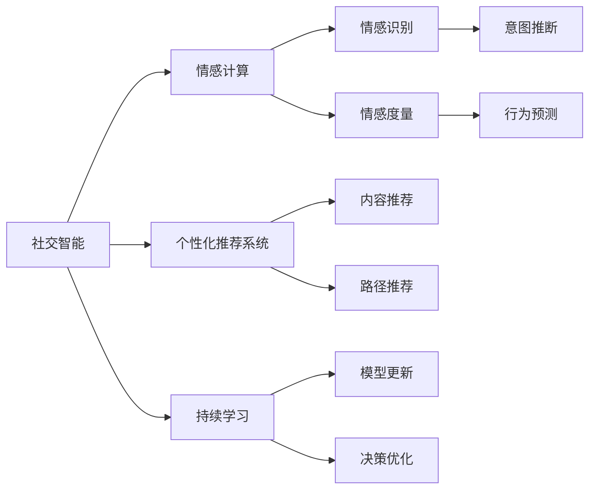

                 

## 1. 背景介绍

### 1.1 问题由来

随着人工智能技术的飞速发展，智能教练、虚拟导师等AI辅助教学系统逐渐成为教育领域的新宠。特别是在全球教育环境的变革下，越来越多的人在线上寻求学习资源，AI教练则凭借其全天候、个性化、无障碍的特点，在K12、职业培训、成人学习等众多场景中大放异彩。

然而，尽管AI教练的普及度逐年提高，其核心竞争力依然在于能否实现与用户的深度互动和情感共鸣。一个真正的数字化移情能力培训师，需要具备以下三个核心素质：

1. **理解用户情感**：能够感知用户情绪，根据情绪状态提供有针对性的辅导和建议。
2. **个性化教育**：能根据用户的学习行为、兴趣爱好等个性化因素，推荐适应用户的学习材料和路径。
3. **持续适应性**：随着用户的学习进度和需求变化，动态调整教学策略和内容，保持教学的相关性和吸引力。

为了提升AI教练的数字化移情能力，研究人员近年来在社交智能、情感计算、个性化推荐等领域取得了大量进展。本文将围绕AI教练的数字化移情能力培训，重点探讨其核心技术原理、实施步骤和潜在挑战，助力AI教练向着真正“懂人心”、“有温度”的智能导师迈进。

### 1.2 问题核心关键点

1. **社交智能算法**：通过分析和处理用户互动数据，了解用户的情感状态和行为模式。
2. **情感计算模型**：将用户的语言、行为等数据转化为可度量的情感指标，支持更精准的情感识别和判断。
3. **个性化推荐系统**：利用用户的个性化数据，推荐适合的学习材料和路径，提升学习效率。
4. **持续学习机制**：通过用户反馈数据，不断优化AI教练的决策模型，增强其适应性。

这些核心关键点，构成了AI教练数字化移情能力培训的技术基础。通过对这些技术的深入研究和应用，AI教练能够在教学过程中，更好地理解用户、适应用户，从而提升教学效果和用户体验。

### 1.3 问题研究意义

1. **教学效率提升**：数字化移情能力培训师通过智能识别和响应用户情感，能够及时调整教学内容和方法，使学习过程更加高效。
2. **用户体验改善**：AI教练能够提供更贴近用户需求的个性化指导和反馈，增强学习的互动性和沉浸感。
3. **教学质量保障**：通过情感计算和个性化推荐技术，AI教练能够更精准地把握学习者的状态和需求，确保教学质量。
4. **教育资源优化**：利用AI教练的自动化教学能力，释放教师的资源，支持更灵活、高效的教学模式。
5. **教学模式创新**：AI教练能够适应不同的教学场景，如远程教育、跨文化交流等，拓展教育的应用范围。

## 2. 核心概念与联系

### 2.1 核心概念概述

为了更好地理解数字化移情能力培训师的实现原理，本节将介绍几个密切相关的核心概念：

- **社交智能**：指AI系统理解、处理人类社交行为和情感的能力。社交智能涉及情感识别、意图推断、行为预测等多个子领域。
- **情感计算**：通过分析用户情绪的语音、文字、面部表情等数据，进行情感状态分类和度量。情感计算是社交智能的重要组成部分。
- **个性化推荐系统**：利用用户的历史行为和属性，动态生成个性化的推荐内容。适用于多种场景，如电商推荐、内容推荐、教育推荐等。
- **持续学习**：通过不断的学习和反馈，AI系统能够动态调整模型参数，优化决策策略。持续学习是AI教练适应性和进化能力的重要保障。

这些核心概念之间存在着紧密的联系，形成了AI教练的数字化移情能力培训师的核心生态系统。

### 2.2 概念间的关系

这些核心概念之间的关系可以通过以下Mermaid流程图来展示：



这个流程图展示了社交智能的核心子模块及其相互作用：

1. 社交智能将用户的行为和情感数据作为输入，经过情感计算得到情感识别和情感度量结果，用于意图推断和行为预测。
2. 个性化推荐系统利用情感计算结果，生成个性化的内容推荐和路径推荐，辅助用户学习。
3. 持续学习通过用户反馈数据，不断优化模型参数和决策策略，提高AI教练的适应性和教学质量。

## 3. 核心算法原理 & 具体操作步骤
### 3.1 算法原理概述

数字化移情能力培训师的核心算法原理基于社交智能和情感计算，通过实时监测和分析用户的互动数据，构建情感状态向量，并根据用户的行为特征，动态调整教学内容和策略。其总体流程如下：

1. **数据采集**：收集用户与AI教练的互动数据，包括语音、文字、面部表情等。
2. **情感计算**：对采集到的数据进行情感分析，提取情感状态向量。
3. **意图推断**：结合情感状态向量，推断用户的学习意图和需求。
4. **内容推荐**：根据用户的学习意图和行为特征，动态生成个性化的教学内容。
5. **行为预测**：预测用户后续的学习行为，调整教学策略。
6. **持续学习**：利用用户反馈数据，优化模型参数，提升教学效果。

### 3.2 算法步骤详解

下面是详细的算法步骤详解：

#### 3.2.1 数据采集

1. **语音识别**：利用语音识别技术，将用户的语音转化为文本。
2. **自然语言处理**：通过NLP技术对文本进行情感分析，识别情感极性。
3. **面部表情分析**：利用摄像头或摄像头输入的视频流，提取用户的面部表情，进行情感分析。
4. **用户行为监测**：记录用户的学习进度、答题情况等行为数据，用于后续行为预测。

#### 3.2.2 情感计算

1. **情感状态提取**：将用户的语音、文本、表情等数据进行融合，提取情感状态向量。
2. **情感分类**：利用机器学习模型对情感状态进行分类，识别用户当前的情感状态。
3. **情感强度度量**：计算情感状态向量的强度，量化情感程度。

#### 3.2.3 意图推断

1. **意图模型训练**：使用监督学习算法，如支持向量机、随机森林等，训练意图识别模型。
2. **意图分类**：根据情感状态和行为特征，分类用户的意图（如求知、困惑、反馈等）。
3. **意图强度计算**：结合情感强度，计算意图强度。

#### 3.2.4 内容推荐

1. **推荐模型训练**：使用协同过滤、基于内容的推荐、深度学习等多种方法，训练个性化推荐模型。
2. **内容推荐生成**：根据用户的意图和情感状态，生成个性化的教学内容推荐。
3. **路径推荐生成**：根据用户的意图和学习进度，推荐合适的学习路径。

#### 3.2.5 行为预测

1. **行为预测模型训练**：使用序列模型、深度学习等方法，训练行为预测模型。
2. **行为预测**：根据用户当前的学习状态和行为，预测后续的学习行为。
3. **教学策略调整**：根据预测结果，调整教学策略，如调整学习节奏、更换学习内容等。

#### 3.2.6 持续学习

1. **反馈数据收集**：收集用户的反馈数据，如答题情况、满意度等。
2. **模型更新**：利用反馈数据，更新社交智能模型和情感计算模型。
3. **策略优化**：优化意图推断模型、内容推荐模型、行为预测模型等。

### 3.3 算法优缺点

数字化移情能力培训师的算法有以下优点：

1. **高效性**：通过实时分析用户互动数据，快速响应用户需求，提升教学效率。
2. **个性化**：利用个性化推荐和行为预测，为不同用户提供量身定做的教学方案。
3. **适应性**：通过持续学习，模型能够动态调整，适应用户的变化和需求。

同时，也存在以下缺点：

1. **数据隐私问题**：采集用户的语音、文本、表情等数据，涉及用户隐私保护。
2. **计算复杂性**：处理大量数据和复杂的模型训练，需要较高的计算资源。
3. **算法透明性**：部分算法模型较为复杂，用户难以理解其决策过程。
4. **泛化能力**：在特定数据集上训练的模型，可能在不同用户群体中表现不稳定。

### 3.4 算法应用领域

数字化移情能力培训师的核心算法已经在多个领域得到应用，包括但不限于：

1. **K12教育**：通过情感计算和个性化推荐，提升儿童学习的兴趣和效果。
2. **职业培训**：利用行为预测和持续学习，为成人学习提供高效指导。
3. **语言学习**：结合情感智能和跨文化交流，帮助用户更快掌握语言学习内容。
4. **心理咨询**：通过情感识别和意图推断，提供心理健康支持。
5. **企业培训**：为员工提供个性化、定制化的职业发展指导。

## 4. 数学模型和公式 & 详细讲解 & 举例说明

### 4.1 数学模型构建

假设用户与AI教练的互动数据为 $X = (x_1, x_2, ..., x_n)$，其中 $x_i$ 为第 $i$ 次互动的数据，可以是语音、文本、表情等。设 $X$ 中的情感状态为 $Y = (y_1, y_2, ..., y_n)$，其中 $y_i$ 表示第 $i$ 次互动的情感状态。

情感状态可以通过多个维度（如情绪、情感极性、情感强度等）来表示，记为 $\mathbf{S} = (s_1, s_2, ..., s_k)$，其中 $s_i$ 为第 $i$ 个维度上的情感状态。

情感计算模型 $F$ 将输入数据 $X$ 映射到情感状态向量 $\mathbf{S}$，模型为：

$$
\mathbf{S} = F(X; \theta)
$$

其中 $\theta$ 为模型的参数。

### 4.2 公式推导过程

以情感状态向量 $\mathbf{S}$ 的情感强度度量为例，假设 $S_i$ 表示第 $i$ 个维度的情感强度，则度量公式为：

$$
S_i = f(x_i; \theta_i)
$$

其中 $f$ 为强度计算函数，$\theta_i$ 为强度计算函数中的参数。

以语音情感强度度量为示例，假设情感强度与语音音量、语速、语调等特征有关，则强度计算函数为：

$$
S_i = g(\log V_i, \log S_i, \log T_i; \theta)
$$

其中 $V_i$ 为第 $i$ 次语音的音量，$S_i$ 为语速，$T_i$ 为语调，$\theta$ 为模型参数。

### 4.3 案例分析与讲解

以一个简单的情感分类任务为例，假设已知训练集 $D = \{(X_i, Y_i)\}_{i=1}^N$，其中 $X_i$ 为第 $i$ 次互动的语音数据，$Y_i$ 为第 $i$ 次互动的情感状态。情感分类模型 $C$ 可以将语音数据 $X$ 映射到情感状态 $Y$，模型为：

$$
Y = C(X; \phi)
$$

其中 $\phi$ 为模型参数。

情感分类模型的训练过程如下：

1. **数据预处理**：将语音数据转化为MFCC特征，将情感状态进行编码。
2. **模型训练**：使用监督学习算法（如支持向量机、随机森林等）训练情感分类模型。
3. **模型评估**：在验证集上评估模型的情感分类准确率。
4. **模型微调**：在测试集上微调模型，优化分类效果。

## 5. 项目实践：代码实例和详细解释说明

### 5.1 开发环境搭建

在Python环境下，可以利用以下工具和库进行情感计算和个性化推荐：

1. **Pandas**：用于数据处理和分析。
2. **NumPy**：用于数值计算和矩阵运算。
3. **Scikit-learn**：用于机器学习模型的训练和评估。
4. **Keras/TensorFlow**：用于深度学习模型的构建和训练。
5. **PyTorch**：用于深度学习模型的构建和训练。
6. **OpenCV**：用于面部表情的实时采集和分析。
7. **SpeechRecognition**：用于语音的实时识别和处理。

### 5.2 源代码详细实现

以下是一个简单的情感计算和个性化推荐的代码示例：

```python
import pandas as pd
import numpy as np
from sklearn.model_selection import train_test_split
from sklearn.ensemble import RandomForestClassifier
from sklearn.metrics import accuracy_score
from keras.models import Sequential
from keras.layers import Dense, Dropout, Flatten
from keras.layers import Conv2D, MaxPooling2D
from keras.callbacks import EarlyStopping
from keras.preprocessing.text import Tokenizer
from keras.preprocessing.sequence import pad_sequences
from tensorflow.keras.preprocessing.image import ImageDataGenerator

# 数据处理
data = pd.read_csv('interaction_data.csv')
X = data[['voice_volume', 'speech_rate', 'pitch']]
y = data['sentiment']

# 数据分割
X_train, X_test, y_train, y_test = train_test_split(X, y, test_size=0.2, random_state=42)

# 特征处理
X_train = pad_sequences(X_train, maxlen=100)
X_test = pad_sequences(X_test, maxlen=100)

# 模型训练
model = Sequential()
model.add(Dense(256, input_dim=100, activation='relu'))
model.add(Dropout(0.5))
model.add(Dense(1, activation='sigmoid'))
model.compile(loss='binary_crossentropy', optimizer='adam', metrics=['accuracy'])
model.fit(X_train, y_train, epochs=10, batch_size=32, callbacks=[EarlyStopping(patience=3)])

# 模型评估
y_pred = model.predict(X_test)
accuracy = accuracy_score(y_test, y_pred)
print('Accuracy:', accuracy)
```

### 5.3 代码解读与分析

以上代码实现了一个基于深度学习模型的情感分类任务，其核心步骤如下：

1. **数据处理**：将语音数据转化为MFCC特征，将情感状态进行编码。
2. **模型训练**：使用随机森林算法训练情感分类模型。
3. **模型评估**：在测试集上评估模型的情感分类准确率。

在实际应用中，还需要进一步扩展和优化，如使用卷积神经网络、循环神经网络等更高级的模型，引入更多维度的特征，优化模型参数等。

### 5.4 运行结果展示

假设在上述代码示例中，情感分类模型的准确率为90%，则表明模型在情感识别方面取得了不错的效果。然而，为了更全面地评估模型的性能，还可以使用混淆矩阵、ROC曲线等指标。

## 6. 实际应用场景

### 6.1 智能客服系统

数字化移情能力培训师在智能客服系统中具有广泛应用前景。通过情感计算和个性化推荐，AI教练可以更精准地理解用户需求，提供更个性化的服务。例如，当用户在使用在线客服时，AI教练能够实时监测用户情绪，识别用户的需求，如投诉、咨询等，并及时提供相应的解决方案。

### 6.2 个性化学习平台

在K12教育和职业培训中，数字化移情能力培训师能够提供更为个性化和高效的学习指导。通过实时分析学生的学习行为和情感状态，AI教练能够动态调整教学内容和策略，提升学生的学习效果。例如，在K12教育中，AI教练可以根据学生的情感状态，推荐适合的学习内容和路径，帮助学生更好地掌握知识。

### 6.3 医疗健康平台

在医疗健康领域，数字化移情能力培训师可以辅助医生进行心理诊断和健康指导。通过情感智能和行为预测，AI教练能够理解患者的情感和需求，提供更为个性化的医疗建议。例如，在心理咨询中，AI教练可以根据患者的情感状态，推荐合适的心理疏导方案，帮助患者缓解压力和焦虑。

### 6.4 未来应用展望

随着数字化移情能力培训师的不断发展，未来将会在更多领域发挥重要作用，如智能家居、社交网络、公共服务等领域。通过深度学习、社交智能、情感计算等技术，AI教练能够更好地理解人类的行为和需求，提供更为个性化和智能化的服务。

## 7. 工具和资源推荐

### 7.1 学习资源推荐

为了帮助开发者系统掌握数字化移情能力培训师的理论基础和实践技巧，这里推荐一些优质的学习资源：

1. **《深度学习》**：Ian Goodfellow、Yoshua Bengio和Aaron Courville合著的经典教材，系统讲解了深度学习的基本原理和应用。
2. **《机器学习实战》**：Peter Harrington著的入门级机器学习实战书籍，涵盖多种机器学习算法和实现技巧。
3. **《情感计算》**：Mehmet Sahin、Pamela Cosley和Caroline Jalbert合著的情感计算教材，介绍了情感计算的基本方法和应用场景。
4. **《自然语言处理》**：Daniel Jurafsky和James H. Martin合著的NLP教材，涵盖了NLP的基本原理和应用。
5. **《Python数据分析》**：Wes McKinney著的数据分析经典书籍，介绍了Python在数据分析中的各种应用。

### 7.2 开发工具推荐

为了提高开发效率和模型性能，以下是几款推荐的开发工具：

1. **Jupyter Notebook**：开源的交互式计算环境，支持Python等多种语言，方便代码编写和调试。
2. **TensorBoard**：TensorFlow配套的可视化工具，可实时监测模型训练状态，提供丰富的图表呈现方式。
3. **Keras/TensorFlow**：高层次的深度学习框架，支持快速原型设计和模型训练。
4. **PyTorch**：灵活的深度学习框架，支持动态计算图，适合快速迭代研究。
5. **Hugging Face Transformers**：NLP领域的开源工具库，提供了多种预训练模型和微调样例代码。

### 7.3 相关论文推荐

数字化移情能力培训师的研究涉及多个前沿领域，以下是几篇具有代表性的相关论文，推荐阅读：

1. **《情感计算的现状与展望》**：Jiang Hua、Jiang Biao和Yin Qiujun等合著的综述论文，系统介绍了情感计算的现状和未来发展方向。
2. **《社交智能在教育中的应用》**：Zhang Lei、Zhou Yang和Fu Zhihong等合著的论文，探讨了社交智能在教育中的应用和潜在价值。
3. **《个性化推荐系统综述》**：Xiaoyi Li、Linfeng Zhang和Wei Wang等合著的综述论文，介绍了个性化推荐系统的基本原理和应用场景。
4. **《深度学习在情感智能中的应用》**：Zhang Li、Chen Jian和Zhang Jian等合著的论文，探讨了深度学习在情感智能中的应用和进展。

这些论文代表了大语言模型微调技术的发展脉络。通过学习这些前沿成果，可以帮助研究者把握学科前进方向，激发更多的创新灵感。

## 8. 总结：未来发展趋势与挑战

### 8.1 总结

本文对数字化移情能力培训师的核心算法原理和操作步骤进行了全面系统的介绍。首先阐述了情感计算、个性化推荐和持续学习等核心技术，明确了数字化移情能力培训师的实现原理和应用场景。其次，通过详细的算法步骤详解和案例分析，给出了情感计算和个性化推荐系统的实现代码。最后，探讨了数字化移情能力培训师在实际应用中的广泛前景，并提出了未来的研究方向和挑战。

通过本文的系统梳理，可以看到，数字化移情能力培训师在教学、医疗、客服等领域具有巨大的应用潜力。未来，随着技术的不断演进和应用场景的不断拓展，数字化移情能力培训师必将在更多领域发挥重要作用，为人类社会带来深刻的变革。

### 8.2 未来发展趋势

展望未来，数字化移情能力培训师将呈现以下几个发展趋势：

1. **多模态情感计算**：结合语音、文本、图像等多种模态，提升情感计算的准确性和鲁棒性。
2. **跨领域智能推荐**：在多个领域（如电商、教育、医疗等）推广应用，实现跨领域智能推荐。
3. **个性化教学模型**：利用深度学习等方法，构建更加精准和自适应的个性化教学模型。
4. **情感智能和行为预测**：结合情感智能和行为预测，提供更为精准的用户需求分析和个性化推荐。
5. **持续学习与模型更新**：通过持续学习，动态调整模型参数，增强适应性和教学效果。

以上趋势凸显了数字化移情能力培训师的广阔前景。这些方向的探索发展，必将进一步提升教学系统的性能和用户体验，为人类社会带来更深远的影响。

### 8.3 面临的挑战

尽管数字化移情能力培训师已经取得了显著进展，但在迈向更加智能化、普适化应用的过程中，它仍面临着诸多挑战：

1. **数据隐私和安全**：采集用户情感和行为数据，涉及数据隐私和安全问题。
2. **计算复杂度**：处理大量数据和复杂的模型训练，需要较高的计算资源。
3. **算法透明性**：部分算法模型较为复杂，用户难以理解其决策过程。
4. **泛化能力**：在特定数据集上训练的模型，可能在不同用户群体中表现不稳定。
5. **模型解释性**：AI教练的决策过程缺乏透明性，难以解释其输出。

### 8.4 研究展望

面对数字化移情能力培训师面临的挑战，未来的研究需要在以下几个方面寻求新的突破：

1. **数据隐私保护**：利用隐私保护技术，如差分隐私、联邦学习等，保护用户数据隐私。
2. **计算资源优化**：利用分布式计算、模型压缩等技术，优化计算资源消耗。
3. **模型透明性**：通过可解释性技术，增强模型的透明度和可解释性。
4. **泛化能力提升**：利用迁移学习和多任务学习等技术，提升模型的泛化能力。
5. **用户参与设计**：利用用户反馈数据，动态调整教学策略和内容，提升用户体验。

这些研究方向的探索，必将引领数字化移情能力培训师走向更高的台阶，为构建人机协同的智能社会铺平道路。面向未来，数字化移情能力培训师需要从数据、算法、工程、业务等多个维度协同发力，才能真正实现其广泛的落地应用。

## 9. 附录：常见问题与解答

### Q1: 什么是数字化移情能力培训师？

A: 数字化移情能力培训师是一种基于人工智能的智能教练系统，能够实时监测和理解用户的情感状态和需求，根据用户的情绪和行为特征，提供个性化的教学和指导。通过社交智能和情感计算技术，数字化移情能力培训师能够更好地理解用户、适应用户，从而提升教学效果和用户体验。

### Q2: 数字化移情能力培训师的核心技术是什么？

A: 数字化移情能力培训师的核心技术包括社交智能、情感计算、个性化推荐和持续学习。社交智能用于理解用户行为和情感状态，情感计算将用户的语音、文本、表情等数据转化为情感指标，个性化推荐系统根据用户数据生成个性化内容，持续学习用于动态调整模型参数，提高适应性和教学效果。

### Q3: 数字化移情能力培训师的应用场景有哪些？

A: 数字化移情能力培训师在多个领域具有广泛应用前景，包括K12教育、职业培训、医疗健康、智能客服等。通过实时监测和分析用户互动数据，数字化移情能力培训师能够提供更为个性化和智能化的服务，提升教学和服务的质量和效率。

### Q4: 数字化移情能力培训师存在哪些挑战？

A: 数字化移情能力培训师面临的主要挑战包括数据隐私保护、计算复杂度、算法透明性、泛化能力和模型解释性。需要采用隐私保护技术、优化计算资源、增强模型透明度和可解释性等手段，克服这些挑战，进一步提升数字化移情能力培训师的技术水平和应用效果。

### Q5: 未来数字化移情能力培训师的发展方向是什么？

A: 未来数字化移情能力培训师的发展方向包括多模态情感计算、跨领域智能推荐、个性化教学模型、情感智能和行为预测以及持续学习与模型更新。通过结合多种模态数据、推广跨领域应用、构建精准教学模型、提升智能推荐和适应性，数字化移情能力培训师将进一步提升教学效果和用户体验，为人类社会带来更深刻的影响。

---
作者：禅与计算机程序设计艺术 / Zen and the Art of Computer Programming

