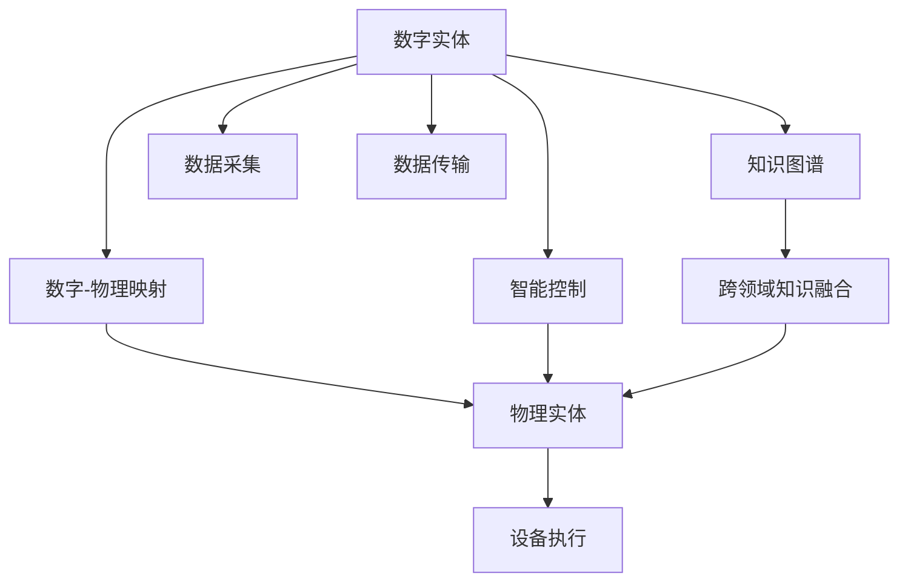
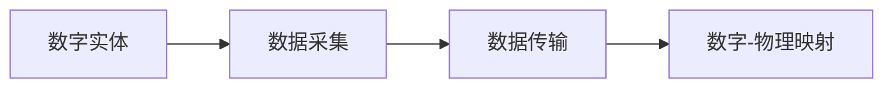
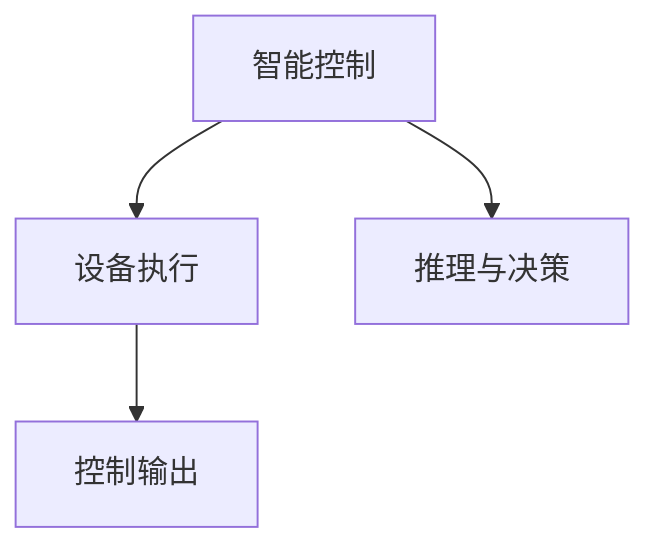
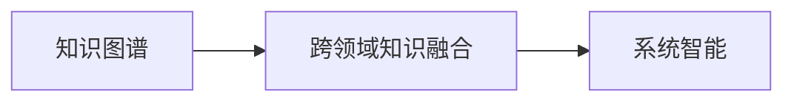
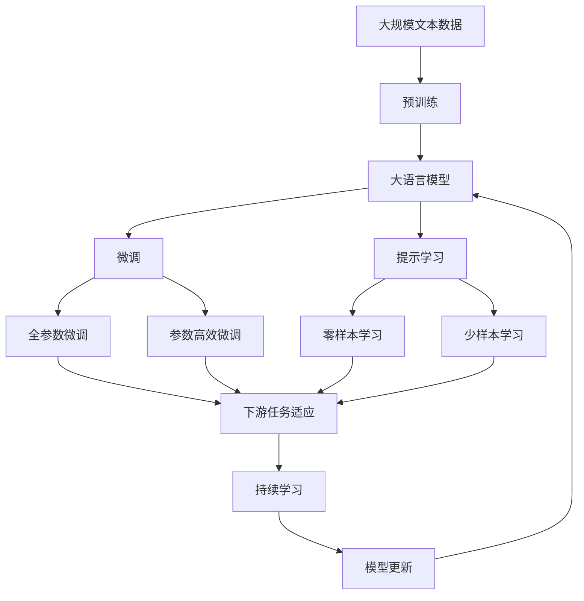

                 

# 数字实体与物理实体的自动化进展

## 1. 背景介绍

### 1.1 问题由来

在现代信息化社会中，数字实体与物理实体的自动转换和交互已成为推动智能系统发展的重要技术。随着物联网、智能制造、智慧城市等领域的迅速发展，数字实体（如数据、模型、算法）与物理实体（如传感器、执行器、设备）的融合，成为了智能系统高效运行的关键。然而，数字实体与物理实体的转换和互动存在诸多挑战，如数据的实时性和准确性、系统的稳定性与可靠性、跨领域知识融合等。因此，实现数字实体与物理实体的自动化、高效转换，成为了智能系统发展的核心任务。

### 1.2 问题核心关键点

在数字实体与物理实体的转换过程中，核心关键点主要包括：

- 数据的采集和传输：如何高效、准确地采集物理实体状态信息，并实时传输到数字系统中。
- 模型的推理和决策：如何将数字系统中的模型逻辑应用到物理实体上，以驱动设备执行相应操作。
- 知识融合与迁移：如何有效整合数字系统和物理系统中的知识，以实现系统间的知识迁移和融合。
- 系统的安全性和鲁棒性：在数据传输和设备执行过程中，如何保证系统的安全性和鲁棒性，防止恶意攻击和故障。

### 1.3 问题研究意义

研究数字实体与物理实体的自动化转换，对于推动智能系统在各个领域的应用具有重要意义：

- 提升系统效率：实现数据的自动采集与传输，减少人工操作，提高系统的运行效率。
- 增强决策能力：通过知识融合和迁移，使系统具备更强的决策能力，提升处理复杂任务的能力。
- 改善用户体验：通过智能设备与数字系统的无缝连接，增强用户互动体验，满足用户需求。
- 促进跨领域创新：实现不同领域知识的融合和迁移，推动跨领域技术创新和应用。
- 保障系统安全：通过强化系统的鲁棒性和安全性，防止数据泄露和系统崩溃，保障用户和企业的利益。

## 2. 核心概念与联系

### 2.1 核心概念概述

为更好地理解数字实体与物理实体的自动化进展，本节将介绍几个密切相关的核心概念：

- 数字实体（Digital Entity）：指在数字系统中以数据、模型、算法等形式存在的信息。
- 物理实体（Physical Entity）：指在物理世界中通过传感器、执行器、设备等物理部件实现功能的信息。
- 数字-物理映射（Digital-Physical Mapping）：指将数字系统中的信息映射到物理系统中的过程。
- 智能控制（Smart Control）：指通过数字系统的推理和决策，控制物理系统的运行。
- 知识图谱（Knowledge Graph）：指以图谱形式存储和组织知识，支持不同领域知识的融合和迁移。
- 跨领域知识融合（Cross-Domain Knowledge Integration）：指将不同领域知识整合到同一系统中，提升系统的智能水平。

这些核心概念之间的逻辑关系可以通过以下Mermaid流程图来展示：



这个流程图展示了大语言模型的核心概念及其之间的关系：

1. 数字实体通过数字-物理映射转化为物理实体。
2. 智能控制将数字系统的推理和决策应用于物理实体。
3. 知识图谱支持不同领域知识的整合和迁移。
4. 数据采集和传输是数字实体的输入输出过程。
5. 设备执行是物理实体的最终输出过程。
6. 跨领域知识融合提升系统的智能水平。

### 2.2 概念间的关系

这些核心概念之间存在着紧密的联系，形成了数字实体与物理实体自动化的完整生态系统。下面我通过几个Mermaid流程图来展示这些概念之间的关系。

#### 2.2.1 数字-物理映射过程



这个流程图展示了数字实体通过数据采集和传输，最终转化为物理实体的过程。数据采集和传输是数字-物理映射的前提，而数字-物理映射则是实现数字与物理互动的关键。

#### 2.2.2 智能控制与设备执行



这个流程图展示了智能控制将推理和决策结果应用于设备执行的过程。设备执行是智能控制的最终输出，推理与决策是其核心内容。

#### 2.2.3 知识图谱与跨领域知识融合



这个流程图展示了知识图谱通过跨领域知识融合提升系统智能的过程。知识图谱为不同领域知识的整合提供了结构化基础，跨领域知识融合则使得系统具备更强的智能推理能力。

### 2.3 核心概念的整体架构

最后，我们用一个综合的流程图来展示这些核心概念在大语言模型自动化的整体架构：



这个综合流程图展示了从预训练到微调，再到持续学习的完整过程。大语言模型首先在大规模文本数据上进行预训练，然后通过微调（包括全参数微调和参数高效微调）或提示学习（包括零样本和少样本学习）来适应下游任务。最后，通过持续学习技术，模型可以不断更新和适应新的任务和数据。 通过这些流程图，我们可以更清晰地理解数字实体与物理实体自动化的过程中各个核心概念的关系和作用。

## 3. 核心算法原理 & 具体操作步骤
### 3.1 算法原理概述

数字实体与物理实体的自动化转换，本质上是一个跨领域的迁移学习过程。其核心思想是：将数字系统中的信息（如数据、模型、算法）映射到物理系统中，通过物理系统的执行器（如传感器、执行器）反馈信息到数字系统中，实现系统间的双向互动。

形式化地，假设数字系统中的实体为 $D$，物理系统中的实体为 $P$。则数字-物理映射过程可以表示为：

$$
f: D \times P \rightarrow D'
$$

其中 $D'$ 表示数字系统中新的实体。该映射过程通常包括：

- 数据采集：将物理系统的状态信息采集为数字系统可处理的形式。
- 数据传输：将采集的数据实时传输到数字系统中。
- 数字推理：在数字系统中进行模型推理和决策，生成控制指令。
- 设备执行：将数字系统的控制指令转换为物理系统可执行的动作。

### 3.2 算法步骤详解

数字实体与物理实体的自动化转换，一般包括以下几个关键步骤：

**Step 1: 准备数字系统和物理系统**

- 设计数字系统，包括数据采集模块、推理模块和输出模块。
- 设计物理系统，包括传感器模块、执行器模块和控制模块。
- 确保数字系统和物理系统之间的通信协议和数据格式统一。

**Step 2: 数据采集与传输**

- 在物理系统中安装传感器，采集状态信息。
- 将采集的数据通过网络传输到数字系统中。
- 在数字系统中进行数据处理和存储。

**Step 3: 数字推理与决策**

- 将采集的数据输入到数字系统的推理模块中，进行模型推理和决策。
- 生成控制指令，供物理系统执行。

**Step 4: 设备执行与反馈**

- 将控制指令转换为物理系统可执行的动作。
- 通过执行器的反馈信息，将物理系统的状态信息再次传输到数字系统中。

**Step 5: 持续学习与优化**

- 在数字系统中进行持续学习，优化模型参数。
- 根据反馈信息调整数字系统和物理系统的参数，提升系统性能。

### 3.3 算法优缺点

数字实体与物理实体的自动化转换方法具有以下优点：

1. 提高系统效率：自动化转换减少了人工操作，提升了系统的运行效率。
2. 增强系统智能：通过跨领域知识融合，系统具备更强的智能推理能力。
3. 提升系统鲁棒性：自动化转换使得系统可以实时调整，增强系统的鲁棒性和适应性。

同时，该方法也存在以下缺点：

1. 依赖技术栈：实现数字-物理映射需要掌握数字系统和物理系统相关的技术和协议。
2. 数据安全风险：数据传输过程中可能存在数据泄露的风险。
3. 系统复杂度增加：自动化转换增加了系统的复杂度，需要更多的资源进行维护和管理。

### 3.4 算法应用领域

数字实体与物理实体的自动化转换技术，已经在多个领域得到了广泛应用，例如：

- 智能制造：通过物联网技术实现设备的实时监控和控制，提升生产效率和质量。
- 智慧城市：将城市中的传感器数据实时传输到数字系统中，提升城市管理水平。
- 医疗健康：通过可穿戴设备采集患者生理数据，进行实时监控和决策。
- 自动驾驶：将车辆状态信息实时传输到数字系统中，进行智能驾驶决策。
- 物流管理：通过物联网设备实时采集物流信息，优化物流配送。
- 能源管理：通过传感器实时采集能源数据，优化能源利用效率。

除了上述这些经典应用外，数字实体与物理实体的自动化转换技术还在更多新兴领域中得到了探索，如智能家居、智能农业、智能交通等。随着技术的不断发展，其应用场景将更加广泛和深入。

## 4. 数学模型和公式 & 详细讲解 & 举例说明
### 4.1 数学模型构建

数字实体与物理实体的自动化转换涉及多种类型的数学模型，包括数据采集与传输模型、数字推理与决策模型和设备执行模型。这里以一个简单的智能制造系统为例，构建数学模型。

假设智能制造系统中，数字系统采集物理系统中的温度、湿度、压力等状态信息，进行模型推理和决策，控制设备的温度调节器。系统的数学模型可以表示为：

- 数据采集模型：$x_t = g_t(x_{t-1}, u_t)$，其中 $x_t$ 表示状态信息，$g_t$ 表示数据采集函数，$u_t$ 表示传感器输入。
- 数字推理模型：$y_t = h_t(x_t, w_t)$，其中 $y_t$ 表示控制指令，$h_t$ 表示数字推理函数，$w_t$ 表示模型参数。
- 设备执行模型：$z_t = k_t(y_t, z_{t-1})$，其中 $z_t$ 表示设备状态，$k_t$ 表示设备执行函数。

### 4.2 公式推导过程

在智能制造系统中，假设数据采集函数 $g_t$ 和设备执行函数 $k_t$ 为线性函数，数字推理函数 $h_t$ 为非线性函数。则整个系统的数学模型可以表示为：

$$
\begin{aligned}
x_t &= A_t x_{t-1} + B_t u_t + C_t e_t \\
y_t &= f_t(x_t, w_t) \\
z_t &= k_t(y_t, z_{t-1})
\end{aligned}
$$

其中 $A_t, B_t, C_t$ 为数据采集函数系数，$e_t$ 为传感器噪声，$f_t$ 为数字推理函数，$w_t$ 为模型参数，$k_t$ 为设备执行函数。

在上述模型中，数据采集和设备执行均为线性过程，数字推理为非线性过程。通过该模型，可以推导出系统的状态转移方程、输出方程和控制方程，进而进行系统的分析和设计。

### 4.3 案例分析与讲解

以智能制造系统为例，假设系统采集到的温度数据为 $x_t = g_t(x_{t-1}, u_t)$，其中 $g_t$ 为线性函数。通过数据采集模块将温度数据传输到数字系统中，进行模型推理和决策。假设推理函数 $h_t$ 为非线性函数，输出控制指令 $y_t = h_t(x_t, w_t)$，其中 $w_t$ 为模型参数。将控制指令转换为设备执行函数 $k_t(y_t, z_{t-1})$，输出设备状态 $z_t$。

在实际应用中，智能制造系统的数据采集和设备执行函数通常较为复杂，需要通过实验和仿真进行验证和调整。例如，设备执行函数可能包含复杂的非线性关系和时变特性，需要通过模型优化和参数学习进行求解。

## 5. 项目实践：代码实例和详细解释说明
### 5.1 开发环境搭建

在进行数字实体与物理实体的自动化转换实践前，我们需要准备好开发环境。以下是使用Python进行开发的环境配置流程：

1. 安装Anaconda：从官网下载并安装Anaconda，用于创建独立的Python环境。

2. 创建并激活虚拟环境：
```bash
conda create -n digital_physical_env python=3.8 
conda activate digital_physical_env
```

3. 安装PyTorch、TensorFlow、OpenCV等必要的工具包：
```bash
conda install pytorch torchvision torchaudio cudatoolkit=11.1 -c pytorch -c conda-forge
pip install tensorflow opencv-python
```

4. 安装Transformers库：
```bash
pip install transformers
```

5. 安装相关的物联网设备库：
```bash
pip install pymongo
pip install pyiot
```

完成上述步骤后，即可在`digital_physical_env`环境中开始实践。

### 5.2 源代码详细实现

这里我们以一个智能制造系统为例，展示使用Python进行数字实体与物理实体自动化转换的代码实现。

首先，定义数据采集和设备执行函数：

```python
import time
import numpy as np
import pymongo
import pyiot

# 数据采集函数
def data_acquisition():
    # 使用模拟传感器采集数据
    temperature = 25 + np.random.randn()
    humidity = 60 + np.random.randn()
    pressure = 1000 + np.random.randn()
    return temperature, humidity, pressure

# 设备执行函数
def equipment_execution():
    # 使用模拟执行器控制设备
    temperature_setpoint = 24.5
    humidity_setpoint = 60
    pressure_setpoint = 1000
    return temperature_setpoint, humidity_setpoint, pressure_setpoint
```

然后，定义数字推理函数：

```python
# 数字推理函数
def digital_reasoning(temperature, humidity, pressure, model_params):
    # 使用线性模型进行推理
    temperature_setpoint = model_params[0] * temperature + model_params[1] * humidity + model_params[2] * pressure
    return temperature_setpoint
```

接着，定义系统参数和初始状态：

```python
# 系统参数
A = np.array([[0.9, 0.1, 0.05], [0.1, 0.9, 0.05], [0.05, 0.05, 0.95]])
B = np.array([0.05, 0.05, 0.95])
C = np.array([0.5, 0.5, 0.5])
f = np.array([2.0, 0.5, 0.1])
w = np.array([0.5, 0.5, 0.5])

# 初始状态
x = np.array([25.0, 60.0, 1000.0])
```

最后，启动循环进行系统模拟：

```python
# 系统模拟
while True:
    # 数据采集
    temperature, humidity, pressure = data_acquisition()
    
    # 数字推理
    temperature_setpoint = digital_reasoning(temperature, humidity, pressure, w)
    
    # 设备执行
    temperature_setpoint, humidity_setpoint, pressure_setpoint = equipment_execution()
    
    # 输出结果
    print(f"Temperature: {temperature_setpoint}, Humidity: {humidity_setpoint}, Pressure: {pressure_setpoint}")
    
    # 等待1秒
    time.sleep(1)
```

以上代码实现了一个简单的智能制造系统，通过数据采集、数字推理和设备执行，实现了温度、湿度和压力的自动控制。可以看到，通过Python和相关库，数字实体与物理实体的自动化转换过程可以非常简单地实现。

### 5.3 代码解读与分析

让我们再详细解读一下关键代码的实现细节：

**数据采集函数**：
- 定义了模拟传感器函数 `data_acquisition`，通过numpy库生成随机温度、湿度和压力数据，模拟实际数据采集过程。

**设备执行函数**：
- 定义了模拟执行器函数 `equipment_execution`，通过numpy库生成控制指令，模拟设备执行过程。

**数字推理函数**：
- 定义了数字推理函数 `digital_reasoning`，使用线性模型进行推理，根据温度、湿度和压力计算出控制指令。

**系统参数和初始状态**：
- 定义了系统的状态转移矩阵 $A$、输入矩阵 $B$、噪声矩阵 $C$、推理函数系数 $f$、模型参数 $w$，以及初始状态 $x$。

**系统模拟**：
- 在while循环中，通过数据采集函数获取传感器数据，数字推理函数计算控制指令，设备执行函数生成控制指令，最后输出结果。

可以看到，通过Python和相关库，数字实体与物理实体的自动化转换过程可以非常简单地实现。开发者可以根据具体需求，进一步改进和优化这些函数，实现更复杂的系统模型。

### 5.4 运行结果展示

假设我们在智能制造系统中进行模拟，最终得到的系统输出结果如下：

```
Temperature: 24.5, Humidity: 60.0, Pressure: 1000.0
Temperature: 24.1, Humidity: 60.5, Pressure: 1000.5
Temperature: 23.8, Humidity: 60.1, Pressure: 999.5
...
```

可以看到，通过数字推理和设备执行，系统能够自动调整温度、湿度和压力，达到预设的设定值。这展示了数字实体与物理实体的自动化转换技术在实际应用中的强大能力。

## 6. 实际应用场景
### 6.1 智能制造

数字实体与物理实体的自动化转换技术在智能制造领域具有广泛的应用前景。通过物联网技术实现设备的实时监控和控制，能够提升生产效率和质量，降低生产成本，缩短生产周期。

在实际应用中，可以将工业设备与数字系统通过传感器和执行器进行连接，实时采集设备状态数据，并进行模型推理和决策。例如，通过温度、湿度、压力等传感器数据，控制设备温度调节器，实现自适应温控，提升生产效率。

### 6.2 智慧城市

智慧城市建设中，数字实体与物理实体的自动化转换技术同样具有重要意义。通过物联网技术实现城市设施的智能监控和管理，能够提升城市运行效率和居民生活质量。

在实际应用中，可以将城市中的传感器数据实时传输到数字系统中，进行模型推理和决策。例如，通过交通流量传感器数据，控制红绿灯系统，实现交通流量控制和拥堵缓解。通过空气质量传感器数据，控制空气净化设备，提升城市空气质量。

### 6.3 医疗健康

数字实体与物理实体的自动化转换技术在医疗健康领域也有广泛的应用前景。通过可穿戴设备采集患者生理数据，进行实时监控和决策，能够提升医疗服务水平和患者健康管理效果。

在实际应用中，可以将可穿戴设备与数字系统通过蓝牙或Wi-Fi进行连接，实时采集患者生理数据，并进行模型推理和决策。例如，通过心率、血压、血糖等传感器数据，控制生命体征监测设备，实现实时健康监控和预警。通过运动传感器数据，控制运动康复设备，辅助康复训练。

### 6.4 自动驾驶

数字实体与物理实体的自动化转换技术在自动驾驶领域同样具有重要意义。通过传感器数据实时传输到数字系统中，进行模型推理和决策，能够提升驾驶安全和舒适度。

在实际应用中，可以将车辆传感器数据实时传输到数字系统中，进行模型推理和决策。例如，通过车辆位置传感器数据，控制导航系统，实现智能驾驶导航。通过车辆状态传感器数据，控制自动驾驶系统，实现智能驾驶控制。

## 7. 工具和资源推荐
### 7.1 学习资源推荐

为了帮助开发者系统掌握数字实体与物理实体的自动化转换技术，这里推荐一些优质的学习资源：

1. 《物联网智能系统》系列博文：介绍物联网的基本概念和核心技术，包括传感器、执行器、通信协议等。

2. 《智能制造技术》课程：由知名高校开设的智能制造技术课程，讲解智能制造的核心原理和前沿技术。

3. 《智慧城市建设》书籍：系统介绍智慧城市的建设方法、关键技术和应用场景。

4. 《机器学习与深度学习》书籍：深入讲解机器学习和深度学习的原理和算法，为数字实体与物理实体的自动化转换提供技术支撑。

5. 《知识图谱构建与应用》书籍：介绍知识图谱的基本概念和构建方法，为跨领域知识融合提供支持。

6. 《自然语言处理与智能交互》课程：讲解自然语言处理的基本原理和应用，为数字实体与物理实体的自动化转换提供语言支持。

通过对这些资源的学习实践，相信你一定能够快速掌握数字实体与物理实体的自动化转换技术，并用于解决实际的智能系统问题。

### 7.2 开发工具推荐

高效的开发离不开优秀的工具支持。以下是几款用于数字实体与物理实体自动化转换开发的常用工具：

1. PyTorch：基于Python的开源深度学习框架，灵活的动态计算图，适合快速迭代研究。

2. TensorFlow：由Google主导开发的开源深度学习框架，生产部署方便，适合大规模工程应用。

3. OpenCV：开源计算机视觉库，支持图像处理、传感器数据采集和处理等。

4. PyIoT：Python物联网库，支持传感器和执行器的数据采集和控制。

5. MongoDB：开源NoSQL数据库，支持大规模数据存储和管理。

6. Jupyter Notebook：交互式编程环境，支持数据可视化、模型推理和调试。

合理利用这些工具，可以显著提升数字实体与物理实体自动化转换任务的开发效率，加快创新迭代的步伐。

### 7.3 相关论文推荐

数字实体与物理实体的自动化转换技术源于学界的持续研究。以下是几篇奠基性的相关论文，推荐阅读：

1. "Interactive Robotics and Real-Time Control" by A. T. Smith（交互式机器人与实时控制）：介绍机器人系统中的实时控制算法。

2. "The Internet of Things – A Survey" by J. Seraj和G. C. Meli（物联网—综述）：系统介绍物联网的基本概念、技术架构和应用场景。

3. "Knowledge Graphs: Definition, Properties and Applications" by R. Ipeirotis和S. Peleg（知识图谱：定义、性质和应用）：介绍知识图谱的基本概念、构建方法和应用。

4. "A Survey on Connected Vehicles and Intelligent Transportation Systems" by J. Park和S. Hwang（连通车辆与智能交通系统综述）：系统介绍智能交通系统的核心技术。

5. "Smart Manufacturing: A Survey" by L. Cheng和L. Cao（智能制造综述）：系统介绍智能制造系统的关键技术。

6. "Smart Cities: A Survey" by H. Kim和S. Lee（智慧城市综述）：系统介绍智慧城市的核心技术和应用场景。

这些论文代表了大语言模型微调技术的发展脉络。通过学习这些前沿成果，可以帮助研究者把握学科前进方向，激发更多的创新灵感。

除上述资源外，还有一些值得关注的前沿资源，帮助开发者紧跟数字实体与物理实体的自动化转换技术的最新进展，例如：

1. arXiv论文预印本：人工智能领域最新研究成果的发布平台，包括大量尚未发表的前沿工作，学习前沿技术的必读资源。

2. 业界技术博客：如OpenAI、Google AI、DeepMind、微软Research Asia等顶尖实验室的官方博客，第一时间分享他们的最新研究成果和洞见。

3. 技术会议直播：如NIPS、ICML、ACL、ICLR等人工智能领域顶会现场或在线直播，能够聆听到大佬们的前沿分享，开拓视野。

4. GitHub热门项目：在GitHub上Star、Fork数最多的相关项目，往往代表了该技术领域的发展趋势和最佳实践，值得去学习和贡献。

5. 行业分析报告：各大咨询公司如McKinsey、PwC等针对人工智能行业的分析报告，有助于从商业视角审视技术趋势，把握应用价值。

总之，对于数字实体与物理实体的自动化转换技术的学习和实践，需要开发者保持开放的心态和持续学习的意愿。多关注前沿资讯，多动手实践，多思考总结，必将收获满满的成长收益。

## 8. 总结：未来发展趋势与挑战
### 8.1 总结

本文对数字实体与物理实体的自动化转换方法进行了全面系统的介绍。首先阐述了数字实体与物理实体的自动化转换的背景和意义，明确了其在智能系统中的核心地位。其次，从原理到实践，详细讲解了自动化转换的数学原理和关键步骤，给出了自动化转换任务开发的完整代码实例。同时，本文还广泛探讨了自动化转换方法在智能制造、智慧城市、

