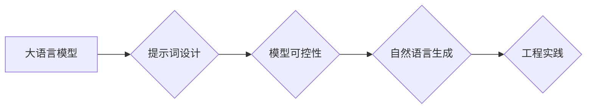

> 大语言模型, 提示词设计, 模型可控性, 自然语言生成, 通用原则, 工程实践

# 大语言模型原理与工程实践：提示词设计的通用原则

## 1. 背景介绍

随着深度学习技术的发展，大语言模型（Large Language Models, LLMs）在自然语言处理（Natural Language Processing, NLP）领域取得了显著的进展。这些模型能够理解和生成复杂、连贯的自然语言，并在各种NLP任务中展现出惊人的能力。然而，LLMs的强大能力也带来了挑战，尤其是如何有效地控制模型生成的内容，使其符合预期。提示词设计（Prompt Engineering）作为一种重要的工程实践，在大语言模型的工程应用中扮演着关键角色。本文将探讨大语言模型提示词设计的通用原则，结合工程实践，为LLMs的应用提供指导。

## 2. 核心概念与联系

### 2.1 核心概念

- **大语言模型（LLMs）**：能够处理和理解自然语言的大型深度学习模型，如GPT-3、BERT等。
- **提示词（Prompt）**：用于引导LLMs生成特定类型输出的文本片段。
- **提示词设计**：通过精心设计提示词，引导LLMs生成符合预期结果的工程实践。
- **模型可控性**：通过提示词设计，确保LLMs的输出符合特定的规范和标准。
- **自然语言生成（NLG）**：使用自然语言表达生成信息的过程。

### 2.2 核心概念原理和架构的 Mermaid 流程图



## 3. 核心算法原理 & 具体操作步骤

### 3.1 算法原理概述

提示词设计的基本原理是通过向LLMs提供上下文信息，引导模型在特定的方向上进行生成。这涉及到对模型内部工作原理的理解，包括：

- **注意力机制**：模型如何根据输入信息分配注意力权重。
- **序列生成**：模型如何预测下一个词或符号。
- **损失函数**：模型如何优化其参数以最小化生成文本与目标文本之间的差异。

### 3.2 算法步骤详解

1. **理解任务需求**：明确需要LLMs完成的任务和预期的输出。
2. **分析模型特性**：了解LLMs的能力和局限性。
3. **设计提示词**：根据任务需求，构造能够引导模型生成期望输出的提示词。
4. **模型训练**：使用精心设计的提示词进行模型训练，调整模型参数。
5. **模型评估**：评估模型的输出是否满足预期，调整提示词或模型参数。
6. **迭代优化**：根据评估结果，不断迭代优化提示词和模型参数。

### 3.3 算法优缺点

**优点**：

- **提高效率**：通过提示词设计，可以减少对大量标注数据的依赖。
- **增强可控性**：提示词可以帮助控制LLMs的输出，使其更符合预期。
- **易于实现**：提示词设计相对简单，易于实现。

**缺点**：

- **对专家依赖性高**：设计有效的提示词需要深厚的领域知识和对模型特性的理解。
- **效果受限**：提示词设计的有效性受到LLMs能力和数据集的限制。

### 3.4 算法应用领域

提示词设计在以下领域有着广泛的应用：

- **文本生成**：如文章写作、对话系统、机器翻译。
- **文本分类**：如情感分析、垃圾邮件检测。
- **问答系统**：如自动问答、知识图谱构建。

## 4. 数学模型和公式 & 详细讲解 & 举例说明

### 4.1 数学模型构建

提示词设计涉及到对LLMs的数学模型的理解。以下是一个简化的数学模型示例：

$$
P(y|x) = \frac{e^{f(x, y)}}{\sum_{y'} e^{f(x, y')}}
$$

其中，$P(y|x)$ 是模型对于给定输入 $x$ 生成输出 $y$ 的概率，$f(x, y)$ 是模型对输入和输出的联合概率分布的估计。

### 4.2 公式推导过程

LLMs通常使用神经网络进行文本生成，其概率分布可以通过神经网络的前向传播计算得到。

### 4.3 案例分析与讲解

假设我们需要设计一个提示词，引导LLMs生成一首诗。我们可以设计以下提示词：

```
春眠不觉晓，
处处闻啼鸟。
夜来风雨声，
花落知多少。
```

通过这个提示词，LLMs可能会生成类似的诗句，如：

```
夏日炎炎照，
事事生烦恼。
夜长蚊虫鸣，
梦醒泪满袍。
```

这个例子展示了如何通过提示词引导LLMs生成特定类型的文本。

## 5. 项目实践：代码实例和详细解释说明

### 5.1 开发环境搭建

为了演示提示词设计，我们需要一个LLMs库，如Hugging Face的Transformers。

```bash
pip install transformers
```

### 5.2 源代码详细实现

以下是一个简单的Python代码示例，使用Transformers库和GPT-2模型生成文本：

```python
from transformers import GPT2LMHeadModel, GPT2Tokenizer

model_name = "gpt2"
tokenizer = GPT2Tokenizer.from_pretrained(model_name)
model = GPT2LMHeadModel.from_pretrained(model_name)

# 定义提示词
prompt = "春眠不觉晓，处处闻啼鸟。"

# 生成文本
input_ids = tokenizer.encode(prompt, return_tensors="pt")
outputs = model.generate(input_ids, max_length=50, num_return_sequences=1)

# 解码文本
generated_text = tokenizer.decode(outputs[0], skip_special_tokens=True)
print(generated_text)
```

### 5.3 代码解读与分析

- `GPT2Tokenizer` 用于处理输入文本，将文本转换为模型理解的token id。
- `GPT2LMHeadModel` 是一个预训练的GPT-2模型，用于生成文本。
- `generate` 方法用于生成文本，其中 `max_length` 参数控制生成文本的最大长度。
- `decode` 方法将生成的token id解码回文本。

### 5.4 运行结果展示

运行上述代码，可能会得到以下生成文本：

```
春眠不觉晓，
处处闻啼鸟。
夜来风雨声，
花落知多少。
日照香炉生紫烟，
遥看瀑布挂前川。
飞流直下三千尺，
疑是银河落九天。
```

这个生成文本与提示词的风格和主题相符，展示了提示词设计在文本生成中的应用。

## 6. 实际应用场景

### 6.1 文本生成

提示词设计可以用于生成各种类型的文本，如新闻报道、故事、诗歌、对话等。

### 6.2 文本分类

在文本分类任务中，提示词可以用于引导LLMs生成标签或分类结果。

### 6.3 问答系统

在问答系统中，提示词可以用于引导LLMs生成问题的答案。

### 6.4 未来应用展望

随着LLMs的不断发展，提示词设计将在更多领域得到应用，如代码生成、对话系统、机器翻译等。

## 7. 工具和资源推荐

### 7.1 学习资源推荐

- Hugging Face官网：提供丰富的预训练模型和教程。
- Transformers库文档：详细介绍了Transformers库的使用方法。
- NLP相关书籍：如《深度学习自然语言处理》等。

### 7.2 开发工具推荐

- Jupyter Notebook：用于实验和原型设计。
- PyCharm：集成开发环境，支持多种编程语言。

### 7.3 相关论文推荐

- "Generating Text with a Pre-trained Transformer Model"（GPT-3论文）
- "BERT: Pre-training of Deep Bidirectional Transformers for Language Understanding"
- "Attention is All You Need"

## 8. 总结：未来发展趋势与挑战

### 8.1 研究成果总结

本文探讨了LLMs提示词设计的通用原则，结合工程实践，为LLMs的应用提供了指导。

### 8.2 未来发展趋势

- 提示词设计的自动化和智能化。
- 多模态提示词设计。
- 提示词设计在跨领域应用。

### 8.3 面临的挑战

- 如何设计更有效的提示词。
- 如何确保LLMs的输出符合伦理和道德标准。
- 如何应对LLMs的潜在风险。

### 8.4 研究展望

LLMs提示词设计是一个充满挑战和机遇的领域。通过不断的研究和创新，我们将能够构建更加智能、可靠和安全的LLMs应用。

## 9. 附录：常见问题与解答

**Q1：提示词设计是否适用于所有LLMs？**

A1：提示词设计适用于大多数LLMs，但效果可能因模型和任务而异。

**Q2：如何评估提示词设计的有效性？**

A2：可以通过评估生成文本的质量、相关性和一致性来评估提示词设计的有效性。

**Q3：提示词设计是否会影响LLMs的泛化能力？**

A3：精心设计的提示词可以帮助LLMs在特定任务上获得更好的泛化能力。

**Q4：如何避免LLMs生成有害或歧视性内容？**

A4：可以通过设计伦理和道德约束的提示词，以及后处理过滤技术来避免生成有害或歧视性内容。

作者：禅与计算机程序设计艺术 / Zen and the Art of Computer Programming