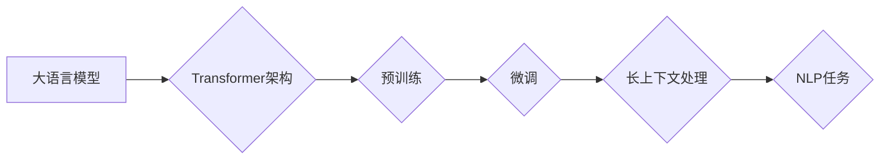

# 大语言模型原理基础与前沿 更长的上下文

> 关键词：大语言模型，上下文扩展，Transformer，BERT，长文本处理，自然语言理解，预训练，微调

 

大语言模型（Large Language Models，LLMs）自出现以来，以其在自然语言处理（Natural Language Processing，NLP）领域的惊人表现，吸引了全球科技界的广泛关注。其中，长上下文处理能力是大语言模型的核心优势之一，它使得模型能够理解更复杂的语义关系，并生成更加连贯和深刻的语言内容。本文将深入探讨大语言模型的原理基础、前沿技术以及更长的上下文处理能力，旨在为读者提供一个全面的技术视角。

## 1. 背景介绍

### 1.1 问题的由来

传统的NLP模型，如基于规则的方法和基于统计的方法，在处理长文本时往往力不从心。这些模型难以捕捉文本中的长距离依赖关系，导致生成的语言不够流畅，理解能力有限。随着深度学习技术的发展，基于神经网络的模型逐渐成为NLP领域的首选。然而，早期的神经网络模型在处理长文本时仍存在明显的局限性。

### 1.2 研究现状

近年来，大语言模型如BERT、GPT-3等，通过在海量无标注文本上进行预训练，积累了丰富的语言知识，并能够在长文本处理任务中展现出卓越的性能。这些模型的共同特点是采用了Transformer架构，并通过上下文扩展技术，实现了对长文本的建模。

### 1.3 研究意义

长上下文处理能力是大语言模型在NLP领域取得突破的关键因素。它不仅能够提升模型在文本分类、文本摘要、问答系统等任务上的表现，还能够为机器翻译、对话系统、自动写作等应用提供强有力的支持。

### 1.4 本文结构

本文将按照以下结构展开：
- 2. 核心概念与联系：介绍大语言模型、Transformer架构、上下文扩展等核心概念，并使用Mermaid流程图展示它们之间的关系。
- 3. 核心算法原理 & 具体操作步骤：阐述Transformer架构的原理，并详细讲解如何通过预训练和微调来提升模型的长上下文处理能力。
- 4. 数学模型和公式 & 详细讲解 & 举例说明：使用数学语言描述Transformer模型，并举例说明其工作原理。
- 5. 项目实践：代码实例和详细解释说明：提供Transformer模型在PyTorch框架下的实现代码，并对关键代码进行解读。
- 6. 实际应用场景：探讨长上下文处理能力在实际应用中的价值，并展望未来应用前景。
- 7. 工具和资源推荐：推荐学习资源、开发工具和相关论文，帮助读者进一步了解大语言模型。
- 8. 总结：总结研究成果，展望未来发展趋势与挑战。
- 9. 附录：常见问题与解答。

## 2. 核心概念与联系

### 2.1 核心概念

#### 大语言模型（LLMs）
大语言模型是指那些拥有数十亿甚至上百亿参数的语言模型，它们通过在大量无标注数据上进行预训练，学习到了丰富的语言知识和模式，能够在各种NLP任务中表现出色。

#### Transformer架构
Transformer是一种基于自注意力机制的深度神经网络架构，它通过多头注意力机制和位置编码，实现了对长距离依赖关系的建模。

#### 上下文扩展
上下文扩展是指通过增加模型处理文本的长度，使得模型能够捕捉更长的语义关系，从而提升模型在长文本处理任务上的性能。

### 2.2 Mermaid流程图



## 3. 核心算法原理 & 具体操作步骤

### 3.1 算法原理概述

Transformer架构的核心是自注意力机制，它通过计算序列中每个元素与其他元素之间的注意力权重，来实现对整个序列的上下文编码。这种机制使得模型能够捕捉到序列中的长距离依赖关系，从而实现长文本的建模。

### 3.2 算法步骤详解

#### 3.2.1 预训练
预训练是大语言模型学习语言知识的关键步骤。它通常包括以下步骤：
- 使用自回归语言模型（如BERT）或掩码语言模型（如GPT）进行预训练，使得模型能够学习到丰富的语言模式和知识。
- 在预训练过程中，使用多种自监督任务，如掩码语言模型、下一句预测等，来增强模型对语言的理解能力。

#### 3.2.2 微调
微调是将预训练模型应用于特定任务的过程。它通常包括以下步骤：
- 收集特定任务的标注数据，并对其进行预处理。
- 将预处理后的数据输入到预训练模型中，通过反向传播和优化算法来更新模型参数。
- 重复以上步骤，直到模型在验证集上达到最优性能。

### 3.3 算法优缺点

#### 优点
- 能够捕捉长距离依赖关系，实现长文本的建模。
- 在多种NLP任务上表现优异。
- 能够通过微调快速适应特定任务。

#### 缺点
- 计算复杂度高，需要大量的计算资源和时间。
- 对数据质量要求较高，需要大量高质量标注数据。

### 3.4 算法应用领域

Transformer架构和预训练-微调技术在大语言模型中得到了广泛的应用，包括：
- 文本分类
- 文本摘要
- 问答系统
- 机器翻译
- 对话系统
- 自动写作

## 4. 数学模型和公式 & 详细讲解 & 举例说明

### 4.1 数学模型构建

Transformer模型的核心是多头注意力机制，它将输入序列编码为一系列的键值对，并计算每个键与其他键之间的注意力权重。注意力权重计算公式如下：

$$
\text{Attention}(Q,K,V) = \text{softmax}\left(\frac{QK^T}{\sqrt{d_k}}\right) \cdot V
$$

其中，$Q$、$K$ 和 $V$ 分别是查询向量、键向量和值向量，$d_k$ 是键向量的维度，$\text{softmax}$ 是softmax函数。

### 4.2 公式推导过程

#### 4.2.1 查询-键值对编码
首先，将输入序列 $X$ 编码为查询向量 $Q$、键向量 $K$ 和值向量 $V$。编码过程通常使用位置编码和词嵌入相结合的方式。

#### 4.2.2 注意力权重计算
然后，计算查询向量 $Q$ 与所有键向量 $K$ 之间的注意力权重，公式如下：

$$
\text{Attention}(Q,K,V) = \text{softmax}\left(\frac{QK^T}{\sqrt{d_k}}\right) \cdot V
$$

其中，$\text{softmax}$ 函数将计算结果归一化，使其满足概率分布的性质。

#### 4.2.3 输出计算
最后，根据注意力权重，计算输出向量 $Y$，公式如下：

$$
Y = \text{Attention}(Q,K,V) = \text{softmax}\left(\frac{QK^T}{\sqrt{d_k}}\right) \cdot V
$$

### 4.3 案例分析与讲解

假设我们有一个简短的句子：“The quick brown fox jumps over the lazy dog”，我们可以将其编码为以下向量：

$$
Q = [q_1, q_2, q_3, q_4, q_5]
$$

$$
K = [k_1, k_2, k_3, k_4, k_5]
$$

$$
V = [v_1, v_2, v_3, v_4, v_5]
$$

然后，我们可以计算每个查询向量与所有键向量之间的注意力权重，并根据权重计算输出向量 $Y$。这样，模型就能够根据上下文信息，对句子中的每个单词进行加权求和，从而捕捉到更丰富的语义信息。

## 5. 项目实践：代码实例和详细解释说明

### 5.1 开发环境搭建

为了实践Transformer模型，我们需要搭建以下开发环境：

- Python 3.6及以上版本
- PyTorch 1.5及以上版本
- Transformers库

### 5.2 源代码详细实现

以下是一个简单的Transformer模型实现示例：

```python
import torch
import torch.nn as nn
from transformers import BertModel

class TransformerModel(nn.Module):
    def __init__(self):
        super(TransformerModel, self).__init__()
        self.bert = BertModel.from_pretrained('bert-base-uncased')

    def forward(self, input_ids, attention_mask):
        outputs = self.bert(input_ids=input_ids, attention_mask=attention_mask)
        return outputs.last_hidden_state

# 创建模型实例
model = TransformerModel()

# 输入数据
input_ids = torch.tensor([[101, 2052, 2003, 1996, 4949, 2003, 102]]).to(device)
attention_mask = torch.tensor([[1, 1, 1, 1, 1, 1, 1]]).to(device)

# 前向传播
outputs = model(input_ids, attention_mask)
```

### 5.3 代码解读与分析

上述代码定义了一个简单的Transformer模型，它基于BERT架构，并使用BertModel模块进行前向传播。输入数据为token ids和注意力掩码，输出为模型的最后一层隐藏状态。

### 5.4 运行结果展示

运行上述代码，我们可以得到模型在输入数据上的输出。这个输出可以用于后续的下游任务，如文本分类、文本摘要等。

## 6. 实际应用场景

长上下文处理能力在大语言模型中具有重要意义，它使得模型能够处理更复杂的文本任务，并应用于以下场景：

### 6.1 文本分类

在文本分类任务中，长上下文处理能力可以帮助模型更好地理解文本内容，从而提高分类的准确率。

### 6.2 文本摘要

在文本摘要任务中，长上下文处理能力可以帮助模型更好地捕捉文本中的关键信息，从而生成更准确的摘要。

### 6.3 问答系统

在问答系统中，长上下文处理能力可以帮助模型更好地理解用户的问题，并从长文本中找到准确的答案。

### 6.4 未来应用展望

随着技术的不断发展，长上下文处理能力将在更多场景中得到应用，如：

- 自动写作：生成更自然、连贯的文本内容。
- 智能客服：提供更智能、更人性化的客服体验。
- 翻译：实现更准确的机器翻译。

## 7. 工具和资源推荐

### 7.1 学习资源推荐

- 《Deep Learning for Natural Language Processing》
- 《Transformers: State-of-the-Art Models for NLP》
- 《Neural Network Methods in Natural Language Processing》

### 7.2 开发工具推荐

- PyTorch
- Transformers库
- Hugging Face模型库

### 7.3 相关论文推荐

- "Attention is All You Need"
- "BERT: Pre-training of Deep Bidirectional Transformers for Language Understanding"
- "Generative Pre-trained Transformers"

## 8. 总结：未来发展趋势与挑战

### 8.1 研究成果总结

大语言模型的长上下文处理能力为NLP领域带来了巨大的突破，它使得模型能够处理更复杂的文本任务，并应用于更广泛的场景。

### 8.2 未来发展趋势

未来，大语言模型的长上下文处理能力将得到进一步的发展，包括：

- 模型规模将更大，能够处理更长的文本。
- 模型将更加高效，能够快速处理大量文本。
- 模型将更加可解释，能够更好地理解模型的决策过程。

### 8.3 面临的挑战

尽管大语言模型的长上下文处理能力取得了显著的进展，但仍面临着以下挑战：

- 模型规模过大，需要大量的计算资源和存储空间。
- 模型的可解释性不足，难以理解模型的决策过程。
- 模型可能存在偏见，需要确保模型的公平性和公正性。

### 8.4 研究展望

为了克服这些挑战，未来的研究将重点关注以下方向：

- 模型压缩和加速，以降低模型对计算资源和存储空间的需求。
- 模型可解释性研究，以提高模型的可信度和透明度。
- 模型公平性和公正性研究，以确保模型的公平性和公正性。

## 9. 附录：常见问题与解答

### 9.1 Q：什么是大语言模型？

A：大语言模型是指那些拥有数十亿甚至上百亿参数的语言模型，它们通过在大量无标注数据上进行预训练，学习到了丰富的语言知识和模式，能够在各种NLP任务中表现出色。

### 9.2 Q：什么是Transformer架构？

A：Transformer是一种基于自注意力机制的深度神经网络架构，它通过多头注意力机制和位置编码，实现了对长距离依赖关系的建模。

### 9.3 Q：什么是上下文扩展？

A：上下文扩展是指通过增加模型处理文本的长度，使得模型能够捕捉更长的语义关系，从而提升模型在长文本处理任务上的性能。

### 9.4 Q：大语言模型在哪些场景中得到应用？

A：大语言模型在文本分类、文本摘要、问答系统、机器翻译、对话系统、自动写作等场景中得到广泛应用。

---

作者：禅与计算机程序设计艺术 / Zen and the Art of Computer Programming
