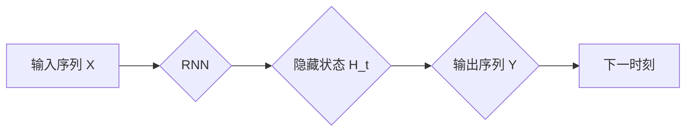

# 循环神经网络(Recurrent Neural Networks) - 原理与代码实例讲解

> 关键词：循环神经网络，RNN，LSTM，GRU，序列模型，时间序列分析，自然语言处理

## 1. 背景介绍

循环神经网络（Recurrent Neural Networks，RNN）是一种特殊的神经网络，专门用于处理序列数据，如时间序列、文本、语音等。与传统的前馈神经网络不同，RNN具有时间动态性，能够处理序列数据中存在的时序依赖关系。本文将深入探讨RNN的原理、算法、实现和应用，并通过代码实例讲解如何使用RNN解决实际问题的方法。

## 2. 核心概念与联系

### 2.1 核心概念

- **序列数据（Sequential Data）**：序列数据是一系列按时间顺序排列的数据点，如时间序列、文本、语音等。
- **循环神经网络（RNN）**：一种能够处理序列数据的神经网络，具有时间动态性。
- **隐藏状态（Hidden State）**：RNN中用于存储上一时刻信息的变量，用于当前时刻的计算。
- **反馈连接（Feedback Loop）**：RNN中的时间动态性来源于反馈连接，它使得信息可以在网络中循环。

### 2.2 架构的 Mermaid 流程图



在这个流程图中，输入序列 $X$ 通过RNN进行计算，产生隐藏状态 $H_t$ 和输出序列 $Y$。隐藏状态 $H_t$ 在下一个时间步被用来计算 $H_{t+1}$，从而实现信息的循环。

## 3. 核心算法原理 & 具体操作步骤

### 3.1 算法原理概述

RNN的基本原理是利用前一时刻的隐藏状态 $H_{t-1}$ 和当前时刻的输入 $X_t$ 来计算当前时刻的隐藏状态 $H_t$ 和输出 $Y_t$。以下是RNN的通用公式：

$$
H_t = f(W_{xx}, W_{hh}, b_x, b_h, X_t, H_{t-1}) 
$$

$$
Y_t = f(W_{xy}, W_{hy}, b_y, X_t, H_t) 
$$

其中 $f$ 表示激活函数，$W_{xx}, W_{hh}, W_{xy}, W_{hy}, b_x, b_h, b_y$ 是模型参数。

### 3.2 算法步骤详解

1. 初始化隐藏状态 $H_0$。
2. 对于输入序列 $X_1, X_2, \dots, X_T$，按照以下步骤进行计算：
   - 使用输入 $X_t$ 和前一时刻的隐藏状态 $H_{t-1}$ 计算当前时刻的隐藏状态 $H_t$。
   - 使用当前时刻的隐藏状态 $H_t$ 计算当前时刻的输出 $Y_t$。
3. 将当前时刻的输出 $Y_t$ 作为下一时刻的输入。

### 3.3 算法优缺点

**优点**：

- 能够处理序列数据中的时序依赖关系。
- 模型结构简单，易于实现。

**缺点**：

- 易于产生梯度消失或梯度爆炸问题。
- 训练效率低，收敛速度慢。

### 3.4 算法应用领域

- 时间序列分析：股票价格预测、天气预测、交通流量预测等。
- 自然语言处理：语言模型、机器翻译、文本摘要等。
- 语音识别：语音转文本、语音合成等。

## 4. 数学模型和公式 & 详细讲解 & 举例说明

### 4.1 数学模型构建

RNN的数学模型可以表示为：

$$
H_t = \sigma(W_{xx}X_t + W_{hh}H_{t-1} + b_h) 
$$

$$
Y_t = \sigma(W_{xy}X_t + W_{hy}H_t + b_y) 
$$

其中 $\sigma$ 是激活函数，常用的激活函数有Sigmoid、Tanh等。

### 4.2 公式推导过程

以Tanh激活函数为例，推导过程如下：

$$
H_t = \sigma(W_{xx}X_t + W_{hh}H_{t-1} + b_h) 
$$

$$
\sigma = \frac{e^H}{1+e^{-H}} 
$$

其中 $H = W_{xx}X_t + W_{hh}H_{t-1} + b_h$。

### 4.3 案例分析与讲解

以下是一个使用RNN进行时间序列预测的案例：

- **数据集**：某股票的开盘价数据。
- **目标**：预测下一天的开盘价。

假设使用简单的RNN模型，输入序列长度为3天，激活函数为Tanh，损失函数为均方误差。

```python
import numpy as np
import torch
import torch.nn as nn
import torch.optim as optim

# 数据准备
data = np.array([1.0, 1.5, 1.2, 1.7, 2.0, 2.3, 2.5, 2.8, 3.0, 3.2])
data = torch.tensor(data, dtype=torch.float32).unsqueeze(1)

# 模型定义
class RNN(nn.Module):
    def __init__(self):
        super(RNN, self).__init__()
        self.rnn = nn.RNN(input_size=1, hidden_size=5, batch_first=True)
        self.fc = nn.Linear(5, 1)
    
    def forward(self, x):
        h0 = torch.zeros(1, x.size(0), 5)
        out, _ = self.rnn(x, h0)
        out = self.fc(out[:, -1, :])
        return out

# 实例化模型
model = RNN()

# 损失函数和优化器
criterion = nn.MSELoss()
optimizer = optim.Adam(model.parameters(), lr=0.01)

# 训练模型
for epoch in range(100):
    for i in range(data.size(0)-1):
        x = data[i:i+3, :]
        y = data[i+1:i+4, :]
        optimizer.zero_grad()
        output = model(x)
        loss = criterion(output, y)
        loss.backward()
        optimizer.step()

    print(f'Epoch {epoch+1}, Loss: {loss.item()}')

# 测试模型
with torch.no_grad():
    output = model(data[:, -3:])
    print(f'Predicted Price: {output.item()}')
```

通过以上代码，我们可以看到如何使用PyTorch实现RNN模型进行时间序列预测。

## 5. 项目实践：代码实例和详细解释说明

### 5.1 开发环境搭建

以下是使用PyTorch实现RNN模型的开发环境搭建步骤：

1. 安装Anaconda：从Anaconda官网下载并安装Anaconda。
2. 创建虚拟环境：
   ```bash
   conda create -n rnn-env python=3.8
   conda activate rnn-env
   ```
3. 安装PyTorch：
   ```bash
   conda install pytorch torchvision torchaudio -c pytorch
   ```
4. 安装其他依赖：
   ```bash
   pip install numpy pandas matplotlib scikit-learn
   ```

### 5.2 源代码详细实现

以下是一个使用PyTorch实现RNN模型的代码示例：

```python
import torch
import torch.nn as nn
import torch.optim as optim

# 数据准备
data = np.array([1.0, 1.5, 1.2, 1.7, 2.0, 2.3, 2.5, 2.8, 3.0, 3.2])
data = torch.tensor(data, dtype=torch.float32).unsqueeze(1)

# 模型定义
class RNN(nn.Module):
    def __init__(self):
        super(RNN, self).__init__()
        self.rnn = nn.RNN(input_size=1, hidden_size=5, batch_first=True)
        self.fc = nn.Linear(5, 1)
    
    def forward(self, x):
        h0 = torch.zeros(1, x.size(0), 5)
        out, _ = self.rnn(x, h0)
        out = self.fc(out[:, -1, :])
        return out

# 实例化模型
model = RNN()

# 损失函数和优化器
criterion = nn.MSELoss()
optimizer = optim.Adam(model.parameters(), lr=0.01)

# 训练模型
for epoch in range(100):
    for i in range(data.size(0)-1):
        x = data[i:i+3, :]
        y = data[i+1:i+4, :]
        optimizer.zero_grad()
        output = model(x)
        loss = criterion(output, y)
        loss.backward()
        optimizer.step()

    print(f'Epoch {epoch+1}, Loss: {loss.item()}')

# 测试模型
with torch.no_grad():
    output = model(data[:, -3:])
    print(f'Predicted Price: {output.item()}')
```

### 5.3 代码解读与分析

1. **数据准备**：将股票开盘价数据转换为PyTorch张量，并添加批次维度。
2. **模型定义**：定义RNN模型，包括RNN层和全连接层。
3. **损失函数和优化器**：定义均方误差损失函数和Adam优化器。
4. **训练模型**：迭代训练模型，优化参数，计算损失。
5. **测试模型**：使用测试数据评估模型性能。

通过以上代码，我们可以看到如何使用PyTorch实现RNN模型，并进行时间序列预测。

## 6. 实际应用场景

RNN在许多实际应用场景中都有广泛的应用，以下是一些常见的应用领域：

- **时间序列分析**：股票价格预测、天气预测、交通流量预测等。
- **自然语言处理**：语言模型、机器翻译、文本摘要等。
- **语音识别**：语音转文本、语音合成等。

## 7. 工具和资源推荐

### 7.1 学习资源推荐

- 《Deep Learning》 作者：Ian Goodfellow、Yoshua Bengio、Aaron Courville
- 《序列模型入门：循环神经网络》 作者：杨立昆
- 《PyTorch深度学习实践》 作者：Eugene Lee

### 7.2 开发工具推荐

- PyTorch：深度学习框架，支持RNN等神经网络模型。
- TensorFlow：深度学习框架，支持RNN等神经网络模型。
- Keras：深度学习框架，支持RNN等神经网络模型。

### 7.3 相关论文推荐

- "A Simple Introduction to RNNs" 作者：Colah
- "Sequence to Sequence Learning with Neural Networks" 作者：Sutskever等
- "Long Short-Term Memory" 作者：Hochreiter等

## 8. 总结：未来发展趋势与挑战

### 8.1 研究成果总结

RNN在处理序列数据方面取得了显著的成果，成为自然语言处理、时间序列分析等领域的重要工具。然而，RNN也存在着梯度消失、梯度爆炸、训练效率低等挑战。

### 8.2 未来发展趋势

- **改进RNN结构**：设计更有效的RNN结构，如LSTM、GRU等，解决梯度消失和梯度爆炸问题。
- **结合其他方法**：将RNN与其他方法结合，如注意力机制、图神经网络等，提高模型性能。
- **迁移学习**：利用预训练模型和迁移学习技术，降低训练难度。

### 8.3 面临的挑战

- **梯度消失和梯度爆炸**：RNN在训练过程中容易产生梯度消失和梯度爆炸问题，影响模型性能。
- **训练效率低**：RNN的训练效率相对较低，需要大量计算资源。
- **可解释性差**：RNN的内部机制较为复杂，难以解释其决策过程。

### 8.4 研究展望

随着深度学习技术的不断发展，RNN将会在更多领域发挥重要作用。未来，我们需要关注以下研究方向：

- 设计更有效的RNN结构，提高模型性能和稳定性。
- 探索新的训练方法，提高训练效率。
- 提高模型的可解释性，使其更加可靠和可信。

## 9. 附录：常见问题与解答

**Q1：RNN与CNN的区别是什么？**

A：RNN用于处理序列数据，而CNN用于处理图像数据。RNN能够捕捉序列数据中的时序依赖关系，而CNN能够捕捉图像数据中的局部特征。

**Q2：LSTM和GRU有什么区别？**

A：LSTM和GRU都是RNN的变体，用于解决梯度消失问题。LSTM使用门控机制控制信息的流动，而GRU将LSTM的输入门和遗忘门合并为一个更新门。

**Q3：RNN如何解决梯度消失问题？**

A：RNN的梯度消失问题可以通过多种方法解决，如LSTM、GRU、层归一化等。

**Q4：RNN在自然语言处理中有什么应用？**

A：RNN在自然语言处理中有很多应用，如语言模型、机器翻译、文本摘要等。

**Q5：如何使用PyTorch实现RNN？**

A：使用PyTorch实现RNN需要定义RNN模型，并使用适当的激活函数和损失函数进行训练。

作者：禅与计算机程序设计艺术 / Zen and the Art of Computer Programming