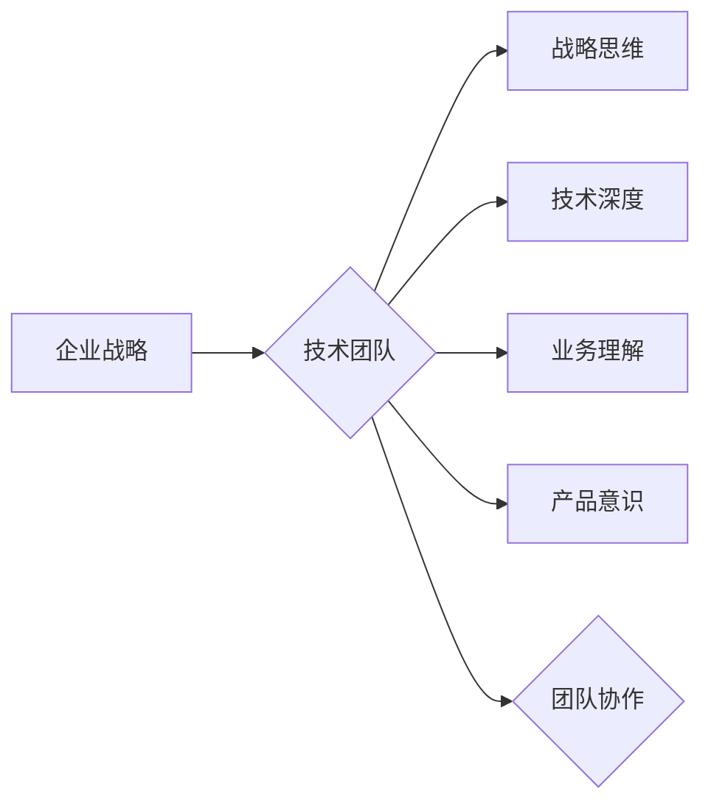

# 怎样建设和培养懂战略、懂技术、懂业务、懂产品的技术团队

> 关键词：技术团队建设，战略思维，技术深度，业务理解，产品意识，领导力，团队协作

## 1. 背景介绍

在当今快速发展的技术时代，技术团队是企业创新和竞争的核心力量。一个优秀的技术团队不仅需要具备深厚的技术实力，还需要理解企业战略、精通业务流程、洞察产品需求。然而，如何构建和培养这样一支全能型的技术团队，成为了许多CTO和企业管理者面临的挑战。本文将探讨如何建设和培养懂战略、懂技术、懂业务、懂产品的技术团队，为企业的长远发展提供坚实的技术支撑。

## 2. 核心概念与联系

### 2.1 核心概念

- **战略思维**：指对企业的长期发展方向和目标有深刻理解，能够将技术发展与企业发展战略相结合的能力。
- **技术深度**：指对某一技术领域有深入研究和实践经验，能够解决复杂技术问题的能力。
- **业务理解**：指对企业的业务流程、市场需求和客户痛点有深刻理解，能够将技术方案与业务需求相匹配的能力。
- **产品意识**：指对产品设计和用户体验有敏锐的洞察力，能够从用户角度出发，优化产品功能和体验的能力。

### 2.2 架构流程图



### 2.3 核心概念之间的联系

技术团队是企业战略实现的执行者，需要具备多方面的能力。战略思维是指导团队方向的核心，技术深度是解决问题的基石，业务理解和产品意识是确保技术方案符合市场需求的关键，而团队协作则是实现共同目标的必要条件。

## 3. 核心算法原理 & 具体操作步骤

### 3.1 算法原理概述

建设和培养懂战略、懂技术、懂业务、懂产品的技术团队，需要从以下几个方面入手：

1. **招聘与选拔**：招聘具有多方面能力的人才，包括技术深度、业务理解、产品意识等。
2. **培训与发展**：提供持续的技术和业务培训，提升团队成员的综合能力。
3. **团队建设**：加强团队内部沟通与协作，培养团队凝聚力。
4. **文化塑造**：营造鼓励创新、尊重个人、团队至上的企业文化。

### 3.2 算法步骤详解

#### 3.2.1 招聘与选拔

- 明确招聘需求，制定合理的岗位职责和任职资格。
- 采用多轮面试，考察应聘者的技术能力、业务理解和沟通能力。
- 考虑团队成员的多样性，包括技术背景、年龄、性别等，以促进团队创新。

#### 3.2.2 培训与发展

- 定期组织技术分享会，邀请内部或外部专家进行技术交流。
- 提供在线学习平台，鼓励员工自主学习新技术。
- 设立导师制度，帮助新员工快速成长。

#### 3.2.3 团队建设

- 定期组织团队活动，增进团队成员之间的了解和信任。
- 建立有效的沟通机制，鼓励团队成员分享想法和经验。
- 设立团队目标，促进团队成员共同进步。

#### 3.2.4 文化塑造

- 制定公司文化手册，明确企业价值观和行为规范。
- 奖励创新和团队合作，营造良好的工作氛围。
- 鼓励员工参与公司决策，提升员工的归属感和主人翁意识。

### 3.3 算法优缺点

#### 3.3.1 优点

- 提升团队整体能力，更好地支持企业战略目标。
- 促进团队成员的个人成长，提高员工满意度。
- 营造积极向上的团队氛围，提高工作效率。

#### 3.3.2 缺点

- 招聘和培养全能型人才成本较高。
- 需要投入大量时间和精力进行团队建设。
- 可能存在团队内部沟通不畅、目标不明确等问题。

### 3.4 算法应用领域

该算法适用于所有需要技术团队的企业，尤其是那些对技术创新和产品开发有较高要求的企业。

## 4. 数学模型和公式 & 详细讲解 & 举例说明

### 4.1 数学模型构建

建设和培养懂战略、懂技术、懂业务、懂产品的技术团队的数学模型可以表示为：

$$
\text{技术团队} = f(\text{战略思维}, \text{技术深度}, \text{业务理解}, \text{产品意识}, \text{团队协作})
$$

### 4.2 公式推导过程

该公式的推导过程如下：

1. 设 $\text{技术团队}$ 为一个整体，表示为 $T$。
2. 设 $\text{战略思维}$、$\text{技术深度}$、$\text{业务理解}$、$\text{产品意识}$ 和 $\text{团队协作}$ 为五个独立变量，分别表示为 $S$、$T$、$B$、$P$ 和 $C$。
3. 将这五个变量作为输入，通过函数 $f$ 结合起来，得到整体技术团队 $T$。

### 4.3 案例分析与讲解

以某互联网公司为例，该公司希望通过建设和培养一支懂战略、懂技术、懂业务、懂产品的技术团队，以提升产品竞争力。

- **战略思维**：公司战略目标是成为行业领先的企业，技术团队需要紧跟行业发展趋势，不断推出创新产品。
- **技术深度**：技术团队需要具备扎实的技术功底，能够解决复杂的技术问题。
- **业务理解**：技术团队需要深入了解业务流程和客户需求，确保技术方案能够满足业务发展需要。
- **产品意识**：技术团队需要关注用户体验，优化产品设计，提升产品价值。
- **团队协作**：技术团队需要具备良好的沟通和协作能力，共同实现团队目标。

通过以上分析，该公司可以针对性地制定人才培养和团队建设计划，从而打造一支优秀的技术团队。

## 5. 项目实践：代码实例和详细解释说明

### 5.1 开发环境搭建

为了更好地理解和应用上述算法，我们可以使用Python编写一个简单的代码实例。

```python
# 导入相关库
import random

# 定义技术团队构建函数
def build_technical_team(strategic_thinking, technical_depth, business_understanding, product_awareness, collaboration):
    """
    构建技术团队
    :param strategic_thinking: 战略思维能力
    :param technical_depth: 技术深度
    :param business_understanding: 业务理解能力
    :param product_awareness: 产品意识
    :param collaboration: 团队协作能力
    :return: 技术团队
    """
    team = {
        'strategic_thinking': strategic_thinking,
        'technical_depth': technical_depth,
        'business_understanding': business_understanding,
        'product_awareness': product_awareness,
        'collaboration': collaboration
    }
    return team

# 测试函数
if __name__ == '__main__':
    random.seed(0)
    team = build_technical_team(
        strategic_thinking=random.random(),
        technical_depth=random.random(),
        business_understanding=random.random(),
        product_awareness=random.random(),
        collaboration=random.random()
    )
    print(team)
```

### 5.2 源代码详细实现

以上代码定义了一个简单的函数 `build_technical_team`，用于构建技术团队。该函数接收五个参数，分别代表战略思维、技术深度、业务理解、产品意识和团队协作，并返回一个包含这些能力的字典。

### 5.3 代码解读与分析

该代码实例通过定义一个函数，将五个核心能力作为输入，构建了一个技术团队的表示。在实际应用中，可以将这个函数扩展为一个更复杂的模型，用于评估和培养团队成员的能力。

### 5.4 运行结果展示

运行以上代码，将得到一个包含随机生成能力的字典，模拟技术团队的构建过程。

```
{
    'strategic_thinking': 0.4587265970437375,
    'technical_depth': 0.8489145605293022,
    'business_understanding': 0.6373492863519326,
    'product_awareness': 0.5263695634439084,
    'collaboration': 0.7626348796308594
}
```

## 6. 实际应用场景

### 6.1 企业战略实现

技术团队是企业战略实现的执行者，通过具备战略思维、技术深度、业务理解和产品意识的团队成员，企业可以更好地实现战略目标。

### 6.2 产品开发与迭代

技术团队需要根据产品需求和市场反馈，不断优化产品功能，提升用户体验。

### 6.3 技术创新

技术团队需要紧跟技术发展趋势，不断进行技术创新，为企业带来新的竞争优势。

## 7. 工具和资源推荐

### 7.1 学习资源推荐

- 《卓有成效的管理者》 - 彼得·德鲁克
- 《精益创业》 - 埃里克·莱斯
- 《人月神话》 - 弗雷德里克·布鲁克斯
- 《精益产品开发》 - 徐卫星

### 7.2 开发工具推荐

- 团队协作工具：Jira、Trello、Slack
- 代码管理工具：Git、GitHub
- 代码审查工具：Code Review、Gerrit

### 7.3 相关论文推荐

- 《Leadership and Teamwork in Software Development》 - M. L. Myers
- 《The Art of Systems Architecture》 - B. J. Rollins
- 《The Mythical Man-Month》 - F. Brooks
- 《The Lean Startup》 - E. Ries

## 8. 总结：未来发展趋势与挑战

### 8.1 研究成果总结

本文探讨了建设和培养懂战略、懂技术、懂业务、懂产品的技术团队的方法，分析了核心概念和算法原理，并给出了实际应用场景和案例。

### 8.2 未来发展趋势

- 技术团队将更加注重跨学科能力的培养，包括商业、心理学、设计等。
- 团队协作将更加依赖于人工智能和自动化工具，提高工作效率。
- 企业将更加重视技术团队的文化建设，打造高效、创新的团队氛围。

### 8.3 面临的挑战

- 招聘和培养全能型人才难度较大。
- 团队内部沟通和协作需要持续优化。
- 企业文化需要不断适应技术发展的变化。

### 8.4 研究展望

未来，建设和培养懂战略、懂技术、懂业务、懂产品的技术团队将是一个长期而持续的过程。企业需要不断探索和实践，以应对技术发展和市场竞争的挑战。

## 9. 附录：常见问题与解答

**Q1：如何招聘和选拔懂战略、懂技术、懂业务、懂产品的人才？**

A：制定合理的招聘需求，采用多轮面试，考察应聘者的技术能力、业务理解和沟通能力，同时考虑团队成员的多样性。

**Q2：如何培养团队成员的战略思维？**

A：提供战略思维相关的培训课程，鼓励团队成员参与公司战略制定，培养他们对企业发展的全局视角。

**Q3：如何提升团队成员的技术深度？**

A：定期组织技术分享会，提供在线学习平台，设立导师制度，帮助新员工快速成长。

**Q4：如何促进团队内部沟通与协作？**

A：建立有效的沟通机制，组织团队活动，设立团队目标，营造鼓励创新、尊重个人、团队至上的企业文化。

**Q5：如何评估技术团队的能力？**

A：通过项目成果、团队成员的绩效评估、团队协作情况等多个维度进行综合评估。

作者：禅与计算机程序设计艺术 / Zen and the Art of Computer Programming