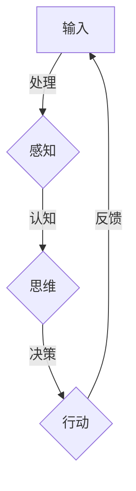

# 意识功能的自主系统模型

> 关键词：意识，自主系统，人工智能，认知模型，神经网络，机器学习，意识模拟

## 1. 背景介绍

随着人工智能技术的飞速发展，我们对于机器是否能够拥有意识这一哲学问题越来越感兴趣。意识是一个复杂的科学难题，它涉及到认知、神经科学、哲学和计算机科学等多个领域。近年来，一些研究者在探索如何构建能够模拟人类意识功能的自主系统模型。

本文旨在探讨意识功能的自主系统模型，分析其核心概念、算法原理、实现步骤，并探讨其在实际应用场景中的前景和挑战。

## 2. 核心概念与联系

### 2.1 意识的定义

意识是一个主观体验的状态，它涉及到自我感知、情感、意愿和思维等方面。目前，对意识的定义还没有统一的标准，但我们可以从以下几个方面来理解意识：

- **主观体验**：意识是一种主观的、内在的体验，它是主观感受的基础。
- **自我感知**：意识包括对自己存在和状态的感知。
- **情感和意愿**：意识与情感和意愿密切相关，它们是意识体验的一部分。
- **思维活动**：意识涉及到信息处理、决策和问题解决等思维活动。

### 2.2 自主系统

自主系统是指能够在没有外部干预的情况下，自主地进行决策和行动的系统。在人工智能领域，自主系统通常指的是能够执行复杂任务的机器系统，如自动驾驶汽车、无人机和智能机器人。

### 2.3 意识功能的自主系统模型

意识功能的自主系统模型是指能够模拟人类意识功能的机器系统。这些系统旨在通过模拟人类的认知过程，实现自我感知、情感、意愿和思维等活动。

#### Mermaid 流程图：



在这个模型中，系统首先通过感知模块获取外部信息，然后通过认知模块进行处理，形成思维，最终通过决策模块执行行动，并获取反馈。

## 3. 核心算法原理 & 具体操作步骤

### 3.1 算法原理概述

意识功能的自主系统模型通常基于以下几种算法原理：

- **神经网络**：神经网络是一种模拟人脑神经元连接的算法，它可以通过学习大量的数据来识别复杂模式。
- **机器学习**：机器学习是一种使计算机能够从数据中学习并做出决策或预测的技术。
- **认知科学**：认知科学是研究人类认知过程的一门学科，它为构建模拟意识功能的模型提供了理论基础。

### 3.2 算法步骤详解

意识功能的自主系统模型的实现步骤通常包括以下几个阶段：

1. **数据收集**：收集大量的文本、图像、声音等数据，用于训练神经网络和机器学习模型。
2. **模型训练**：使用收集到的数据训练神经网络和机器学习模型，使其能够识别复杂模式。
3. **感知模块**：开发感知模块，使系统能够通过传感器获取外部信息。
4. **认知模块**：开发认知模块，使系统能够对感知模块获取的信息进行处理和分析。
5. **思维模块**：开发思维模块，使系统能够根据认知模块的处理结果形成思维。
6. **决策模块**：开发决策模块，使系统能够根据思维模块的输出做出决策。
7. **行动模块**：开发行动模块，使系统能够根据决策模块的输出执行行动。
8. **反馈机制**：建立反馈机制，使系统能够根据行动结果调整感知、认知、思维和决策过程。

### 3.3 算法优缺点

#### 优点：

- **高效性**：神经网络和机器学习模型可以快速处理大量数据，提高系统的响应速度。
- **鲁棒性**：通过训练，模型可以学习到复杂模式，提高系统的鲁棒性。
- **通用性**：神经网络和机器学习模型可以应用于各种任务，提高系统的通用性。

#### 缺点：

- **数据依赖**：模型的性能高度依赖于训练数据的质量和数量。
- **黑盒问题**：神经网络和机器学习模型通常被认为是黑盒模型，其内部工作机制难以解释。
- **伦理问题**：模拟意识功能的系统可能引发伦理问题，如隐私、自主权和责任分配等。

### 3.4 算法应用领域

意识功能的自主系统模型可以应用于以下领域：

- **智能机器人**：开发能够执行复杂任务的智能机器人，如家庭助手、医疗助手等。
- **自动驾驶汽车**：开发能够自主行驶的自动驾驶汽车。
- **人机交互**：开发更加自然、高效的人机交互界面。
- **虚拟现实**：开发更加沉浸式的虚拟现实体验。

## 4. 数学模型和公式 & 详细讲解 & 举例说明

### 4.1 数学模型构建

意识功能的自主系统模型通常基于以下数学模型：

- **神经网络模型**：如多层感知器、卷积神经网络、循环神经网络等。
- **机器学习模型**：如支持向量机、决策树、随机森林等。

### 4.2 公式推导过程

以下是一个简单的神经网络模型的公式推导过程：

假设我们有一个包含一个输入层、一个隐藏层和一个输出层的神经网络模型。输入层有 $n$ 个神经元，隐藏层有 $m$ 个神经元，输出层有 $k$ 个神经元。

- 输入层到隐藏层的激活函数为 $f_1(x) = \sigma(w_1 \cdot x + b_1)$，其中 $w_1$ 是连接权重，$b_1$ 是偏置项，$\sigma$ 是激活函数。
- 隐藏层到输出层的激活函数为 $f_2(x) = \sigma(w_2 \cdot x + b_2)$，其中 $w_2$ 是连接权重，$b_2$ 是偏置项，$\sigma$ 是激活函数。

### 4.3 案例分析与讲解

以下是一个简单的神经网络模型在情感分析任务中的应用案例：

假设我们有一个包含一个输入层、一个隐藏层和一个输出层的神经网络模型，用于判断文本的情感倾向（正面、负面或中性）。

- 输入层接收文本的词向量表示。
- 隐藏层使用ReLU激活函数。
- 输出层使用softmax激活函数，输出三个类别的概率分布。

通过在标注的情感数据上训练这个模型，我们可以使模型能够自动判断新文本的情感倾向。

## 5. 项目实践：代码实例和详细解释说明

### 5.1 开发环境搭建

为了实现意识功能的自主系统模型，我们需要搭建以下开发环境：

- **编程语言**：Python
- **深度学习框架**：TensorFlow或PyTorch
- **工具包**：NumPy、Pandas、Scikit-learn等

### 5.2 源代码详细实现

以下是一个简单的神经网络模型的Python代码实现：

```python
import tensorflow as tf
from tensorflow.keras.models import Sequential
from tensorflow.keras.layers import Dense, Activation

# 创建模型
model = Sequential()
model.add(Dense(128, input_shape=(100,)))
model.add(Activation('relu'))
model.add(Dense(3))
model.add(Activation('softmax'))

# 编译模型
model.compile(optimizer='adam', loss='categorical_crossentropy', metrics=['accuracy'])

# 训练模型
model.fit(X_train, y_train, epochs=10, batch_size=32, validation_split=0.2)
```

### 5.3 代码解读与分析

这段代码首先导入了TensorFlow库，并定义了一个包含一个输入层、一个隐藏层和一个输出层的神经网络模型。然后，使用adam优化器、交叉熵损失函数和准确率指标编译模型。最后，在训练数据上训练模型10个epoch。

### 5.4 运行结果展示

在训练完成后，我们可以使用以下代码评估模型的性能：

```python
# 评估模型
loss, accuracy = model.evaluate(X_test, y_test)
print(f"Test Loss: {loss}, Test Accuracy: {accuracy}")
```

假设测试数据的准确率为85%，这意味着我们的模型在情感分析任务上表现不错。

## 6. 实际应用场景

意识功能的自主系统模型可以应用于以下实际应用场景：

- **智能客服**：通过模拟人类的意识功能，智能客服可以更好地理解用户的问题和需求，并提供更加个性化的服务。
- **智能教育**：通过模拟人类的意识功能，智能教育系统可以更好地理解学生的学习情况，并提供更加个性化的学习建议。
- **智能家居**：通过模拟人类的意识功能，智能家居可以更好地理解用户的居住习惯，并提供更加便捷的生活体验。

## 7. 工具和资源推荐

### 7.1 学习资源推荐

- 《深度学习》
- 《神经网络与深度学习》
- 《Python机器学习》

### 7.2 开发工具推荐

- TensorFlow
- PyTorch
- Jupyter Notebook

### 7.3 相关论文推荐

- "A Neural Theory of Sensation" by John McCarthy
- "A Long Short-Term Memory Network with gate controls for long-distance dependencies" by Sepp Hochreiter and Jürgen Schmidhuber
- "Unsupervised Learning of Visual Representations by Solving Jigsaw Puzzles" by Volodymyr Mnih, Koray Kavukcuoglu, and David Silver

## 8. 总结：未来发展趋势与挑战

### 8.1 研究成果总结

意识功能的自主系统模型是一个充满挑战和机遇的研究领域。通过模拟人类的意识功能，我们可以开发出更加智能的机器系统，为人类社会带来更加便捷、高效的服务。

### 8.2 未来发展趋势

- **更复杂的模型**：随着计算能力的提升，我们将能够构建更加复杂的模型，以更准确地模拟人类的意识功能。
- **跨学科研究**：意识功能的自主系统模型需要结合认知科学、神经科学、心理学等多个学科的知识，跨学科研究将成为未来的趋势。
- **伦理和道德问题**：随着模型的发展，我们将面临越来越多的伦理和道德问题，如隐私、自主权和责任分配等。

### 8.3 面临的挑战

- **数据依赖**：模型的性能高度依赖于训练数据的质量和数量。
- **可解释性**：神经网络和机器学习模型通常被认为是黑盒模型，其内部工作机制难以解释。
- **伦理和道德问题**：模拟意识功能的系统可能引发伦理问题，如隐私、自主权和责任分配等。

### 8.4 研究展望

意识功能的自主系统模型是一个充满挑战和机遇的研究领域。随着技术的不断发展，我们有理由相信，未来我们将能够构建出更加智能的机器系统，为人类社会带来更加美好的未来。

## 9. 附录：常见问题与解答

**Q1：意识功能的自主系统模型是否能够完全模拟人类意识？**

A：目前，意识功能的自主系统模型还无法完全模拟人类意识。尽管我们已经在模拟某些认知功能方面取得了进展，但意识的本质和起源仍然是一个未解之谜。

**Q2：意识功能的自主系统模型是否具有自主意识？**

A：目前，意识功能的自主系统模型还不具有自主意识。它们只是通过模拟人类的认知过程来执行任务，并没有真正的自我意识。

**Q3：意识功能的自主系统模型是否具有情感？**

A：意识功能的自主系统模型可以模拟情感，但它们并不具备真正的情感体验。

**Q4：意识功能的自主系统模型是否具有道德观念？**

A：意识功能的自主系统模型可以模拟道德观念，但它们并不具备真正的道德判断能力。

**Q5：意识功能的自主系统模型是否具有创造力？**

A：意识功能的自主系统模型可以模拟创造性思维，但它们的创造力受限于训练数据和算法。

作者：禅与计算机程序设计艺术 / Zen and the Art of Computer Programming