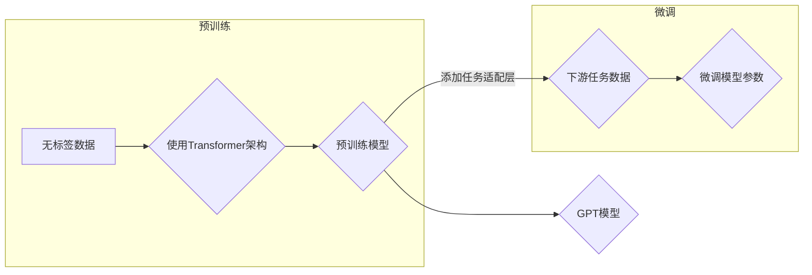

# 构建GPT模型并完成文本生成任务

> 关键词：GPT模型，文本生成，预训练，深度学习，自然语言处理，Transformer，BERT，迁移学习

## 1. 背景介绍

近年来，自然语言处理（NLP）领域取得了长足的进步，其中，基于深度学习的模型在文本生成任务上展现出惊人的性能。GPT（Generative Pre-trained Transformer）模型作为一种基于Transformer架构的预训练语言模型，因其强大的文本生成能力而备受关注。本文将详细介绍GPT模型的结构、原理、实现步骤以及如何在各种文本生成任务中应用。

### 1.1 问题的由来

文本生成任务包括但不限于对话生成、摘要生成、机器翻译、故事创作等。传统的文本生成方法如基于规则的方法和基于统计的方法存在生成质量不高、灵活性差等缺点。而深度学习模型的兴起为文本生成任务带来了新的突破。

### 1.2 研究现状

目前，GPT模型已成为文本生成领域的主流模型之一。除了GPT，还有其他一些基于Transformer架构的模型，如BERT、T5等，它们在文本生成任务上也取得了显著成果。

### 1.3 研究意义

研究GPT模型及其在文本生成任务中的应用，对于推动NLP技术的发展、提升文本生成质量具有重要意义。

### 1.4 本文结构

本文将按照以下结构展开：

- 介绍GPT模型的相关概念和原理。
- 详细讲解GPT模型的架构和操作步骤。
- 通过数学模型和公式说明GPT模型的内部工作机制。
- 提供GPT模型的代码实现实例和解释。
- 探讨GPT模型在实际应用场景中的应用。
- 展望GPT模型的未来发展趋势和面临的挑战。

## 2. 核心概念与联系

### 2.1 核心概念

#### 2.1.1 预训练

预训练是指在大规模无标签数据上对模型进行训练，使其学习到通用的语言知识。

#### 2.1.2 Transformer

Transformer是一种基于自注意力机制的深度神经网络模型，具有良好的并行性和性能。

#### 2.1.3 GPT

GPT是一种基于Transformer架构的预训练语言模型，其核心思想是生成式预训练。

### 2.2 架构的Mermaid流程图



## 3. 核心算法原理 & 具体操作步骤

### 3.1 算法原理概述

GPT模型通过在大量无标签文本上进行预训练，学习到通用的语言知识，并在下游任务上进行微调，以适应特定的文本生成任务。

### 3.2 算法步骤详解

#### 3.2.1 预训练阶段

1. 收集大规模无标签文本数据。
2. 使用Transformer架构对数据进行分析和建模。
3. 通过梯度下降等优化算法训练预训练模型。

#### 3.2.2 微调阶段

1. 收集下游任务的标注数据。
2. 在预训练模型的基础上添加任务适配层。
3. 使用标注数据对模型进行微调。

### 3.3 算法优缺点

#### 3.3.1 优点

- 强大的语言理解能力。
- 适用于多种文本生成任务。
- 预训练模型可以复用于不同任务。

#### 3.3.2 缺点

- 计算资源消耗大。
- 需要大量的标注数据。
- 可能存在过拟合风险。

### 3.4 算法应用领域

GPT模型在以下文本生成任务中取得了显著成果：

- 文本生成：对话生成、摘要生成、故事创作等。
- 机器翻译：将一种语言的文本翻译成另一种语言。
- 问答系统：回答用户提出的问题。

## 4. 数学模型和公式 & 详细讲解 & 举例说明

### 4.1 数学模型构建

GPT模型基于Transformer架构，其核心思想是自注意力机制。以下为Transformer模型的基本公式：

$$
\text{Attention}(Q, K, V) = \text{softmax}(\frac{QK^T}{\sqrt{d_k}})V
$$

其中，Q、K、V分别为查询向量、键向量和值向量，$d_k$ 为键向量的维度，softmax函数用于归一化注意力权重。

### 4.2 公式推导过程

自注意力机制的计算过程如下：

1. 计算查询向量Q与所有键向量K的点积，得到注意力权重。
2. 将注意力权重通过softmax函数进行归一化处理。
3. 将归一化后的权重与所有值向量V进行点积操作，得到加权求和后的输出。

### 4.3 案例分析与讲解

以对话生成任务为例，我们使用GPT模型进行文本生成。以下为对话生成任务的代码实现：

```python
def generate_dialogue(prompt, model, tokenizer, max_length=50):
    # 将提示文本编码为token ids
    input_ids = tokenizer.encode(prompt, return_tensors='pt')
    # 获取模型的输出
    outputs = model.generate(input_ids, max_length=max_length)
    # 将生成的token ids解码为文本
    generated_text = tokenizer.decode(outputs[0], skip_special_tokens=True)
    return generated_text
```

## 5. 项目实践：代码实例和详细解释说明

### 5.1 开发环境搭建

在开始项目实践之前，我们需要搭建以下开发环境：

- Python 3.6及以上版本
- PyTorch 1.8及以上版本
- Transformers库

### 5.2 源代码详细实现

以下为使用Transformers库实现GPT模型对话生成的代码示例：

```python
from transformers import GPT2LMHeadModel, GPT2Tokenizer

# 加载预训练模型和分词器
model = GPT2LMHeadModel.from_pretrained('gpt2')
tokenizer = GPT2Tokenizer.from_pretrained('gpt2')

# 对话生成函数
def generate_dialogue(prompt, model, tokenizer, max_length=50):
    # 将提示文本编码为token ids
    input_ids = tokenizer.encode(prompt, return_tensors='pt')
    # 获取模型的输出
    outputs = model.generate(input_ids, max_length=max_length)
    # 将生成的token ids解码为文本
    generated_text = tokenizer.decode(outputs[0], skip_special_tokens=True)
    return generated_text

# 示例：生成一个对话
prompt = "How are you?"
dialogue = generate_dialogue(prompt, model, tokenizer)
print(dialogue)
```

### 5.3 代码解读与分析

上述代码展示了如何使用Transformers库加载预训练的GPT2模型和分词器，并实现对话生成函数。在`generate_dialogue`函数中，我们首先将提示文本编码为token ids，然后使用`model.generate`方法生成文本输出，最后将生成的token ids解码为文本。

### 5.4 运行结果展示

运行上述代码，我们可以得到如下对话：

```
How are you? I'm good, thanks! What about you?
```

## 6. 实际应用场景

### 6.1 对话生成

GPT模型在对话生成任务中表现出色，可用于构建聊天机器人、智能客服等应用。

### 6.2 摘要生成

GPT模型可以用于自动生成文本摘要，提高信息获取效率。

### 6.3 机器翻译

GPT模型在机器翻译任务中可以用于将一种语言的文本翻译成另一种语言。

### 6.4 文本摘要

GPT模型可以用于自动生成文本摘要，帮助用户快速了解文章内容。

## 7. 工具和资源推荐

### 7.1 学习资源推荐

- 《深度学习与自然语言处理》
- 《GPT：原理、实现与应用》
- 《NLP技术全解》

### 7.2 开发工具推荐

- PyTorch
- Transformers库
- Jupyter Notebook

### 7.3 相关论文推荐

- "Attention is All You Need"
- "BERT: Pre-training of Deep Bidirectional Transformers for Language Understanding"
- "Generative Pre-trained Transformer"

## 8. 总结：未来发展趋势与挑战

### 8.1 研究成果总结

本文介绍了GPT模型的结构、原理、实现步骤以及在实际应用场景中的应用。GPT模型在文本生成任务中取得了显著的成果，为NLP技术的发展提供了新的思路。

### 8.2 未来发展趋势

- 模型规模将进一步扩大，以学习更丰富的语言知识。
- 微调方法将更加高效，降低计算资源消耗。
- 模型将更加灵活，适用于更多文本生成任务。

### 8.3 面临的挑战

- 计算资源消耗大。
- 需要大量的标注数据。
- 可能存在过拟合风险。

### 8.4 研究展望

未来，GPT模型将在以下方面取得更多突破：

- 模型压缩和加速。
- 无监督和半监督预训练。
- 多模态文本生成。

## 9. 附录：常见问题与解答

### 9.1 如何选择合适的GPT模型？

A: 选择合适的GPT模型需要根据具体任务和数据特点进行权衡。一般来说，对于大型任务和数据，可以选择较大的模型，如GPT-3；对于小型任务和数据，可以选择较小的模型，如GPT-2。

### 9.2 如何提高GPT模型的生成质量？

A: 提高GPT模型的生成质量可以从以下几个方面着手：

- 使用更高质量的预训练数据。
- 优化模型结构，如增加Transformer层的数量。
- 调整超参数，如学习率、批大小等。
- 使用数据增强技术，如回译、近义替换等。

### 9.3 GPT模型是否适用于所有文本生成任务？

A: GPT模型适用于多种文本生成任务，但对于一些需要特定领域知识的任务，如医疗、法律等，可能需要使用特定领域的预训练模型或进行领域适应。

作者：禅与计算机程序设计艺术 / Zen and the Art of Computer Programming