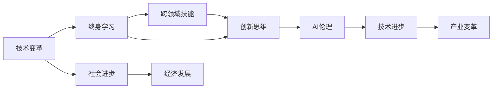

                 

## 1. 背景介绍

### 1.1 问题由来

在这个快速变化的时代，技术进步日新月异，AI、大数据、区块链、物联网等新兴技术层出不穷。这对个人发展提出了前所未有的挑战，也带来了崭新的机遇。如何在这个变革的浪潮中把握机遇、实现自我超越，是每一个追求进步的人所面临的共同课题。

### 1.2 问题核心关键点

要在新时代实现逆袭，关键在于拥有洞察未来的眼光、持续学习的动力和不断探索的精神。这需要我们：

- 洞察技术趋势：准确把握行业发展动态，预判未来技术走向。
- 持续自我提升：通过学习新技能，拓宽知识面，提高技术水平。
- 勇于实践创新：将所学知识应用于实际，不断优化改进，形成独特的解决问题的能力。

### 1.3 问题研究意义

掌握新技术、跨入新领域，不仅能够提升个人竞争力，还能促进职业发展，实现财富自由。而这一切，都需要我们以开放的心态、积极的态度面对挑战，持续奋斗。

## 2. 核心概念与联系

### 2.1 核心概念概述

为了更好地理解如何在这个时代实现逆袭，本节将介绍几个密切相关的核心概念：

- **技术变革**：指科技的快速发展和变化，包括但不限于AI、大数据、区块链等新兴技术的涌现和应用。
- **终身学习**：指在职业生涯中持续学习新知识、新技能，以适应不断变化的技术和市场环境。
- **跨领域技能**：指跨学科的知识和技能，如编程、数据科学、人工智能、财务管理等，这些技能在现代职业中越来越重要。
- **创新思维**：指通过观察、实验、思考、创意，提出新的想法、方法或解决方案，推动技术进步和产业变革。
- **AI伦理**：指在开发和应用AI技术时，需要遵循的道德准则和规范，如隐私保护、公平性、透明性等。

这些核心概念之间通过技术变革的驱动，促进了终身学习的进程，跨领域技能的提升，以及创新思维的培养，共同推动AI伦理的构建，从而实现个人和社会的共同进步。

### 2.2 概念间的关系

这些核心概念之间的关系可以通过以下Mermaid流程图来展示：



这个流程图展示了大语言模型微调过程中各个核心概念的关系：

1. 技术变革驱动了终身学习的进程。
2. 终身学习使跨领域技能得以提升。
3. 跨领域技能的提升促进了创新思维的培养。
4. 创新思维推动了AI伦理的构建。
5. 技术进步和产业变革得益于AI伦理的规范。
6. 技术变革最终推动了社会进步和经济发展。

### 2.3 核心概念的整体架构

最后，我们用一个综合的流程图来展示这些核心概念在大语言模型微调过程中的整体架构：


这个综合流程图展示了从技术变革到个人发展的完整过程，以及不同概念之间的相互促进关系。

## 3. 核心算法原理 & 具体操作步骤

### 3.1 算法原理概述

在这个时代实现逆袭，需要具备终身学习的能力，掌握跨领域技能，培养创新思维，遵循AI伦理，持续推动技术进步和产业变革。其中，终身学习是最基础、最核心的能力，是实现其他目标的基础。

- **终身学习**：指在职业生涯中持续学习新知识、新技能，以适应不断变化的技术和市场环境。
- **跨领域技能**：指跨学科的知识和技能，如编程、数据科学、人工智能、财务管理等，这些技能在现代职业中越来越重要。
- **创新思维**：指通过观察、实验、思考、创意，提出新的想法、方法或解决方案，推动技术进步和产业变革。
- **AI伦理**：指在开发和应用AI技术时，需要遵循的道德准则和规范，如隐私保护、公平性、透明性等。

### 3.2 算法步骤详解

实现逆境中崛起，可以通过以下步骤：

**Step 1: 洞察技术变革**

- 关注行业动态：订阅行业新闻、报告、博客，参加技术交流会、研讨会，获取最新的技术趋势。
- 学习前沿技术：参加在线课程、技术讲座、技术社区，掌握最新的技术进展。
- 实践技术应用：通过实践项目、开源社区、技术竞赛等方式，将所学知识应用到实际问题中。

**Step 2: 持续自我提升**

- 设定学习目标：明确自己的学习目标，如掌握某种编程语言、学习数据分析技术、深入理解人工智能原理等。
- 制定学习计划：根据学习目标，制定详细的学习计划，包括学习内容、时间安排、评估标准等。
- 坚持学习实践：通过自学、培训、交流、实践，不断提升自己的技能和知识水平。

**Step 3: 勇于实践创新**

- 接受挑战：主动承担新项目、新任务，勇于面对未知和不确定性。
- 不断改进：在实践中不断反思、总结、改进，形成独特的解决问题的能力。
- 推动创新：将创新的思维和实践应用于工作中，提出新的想法和方法，推动技术进步和产业变革。

**Step 4: 遵循AI伦理**

- 遵循道德准则：在开发和应用AI技术时，遵循隐私保护、公平性、透明性等道德准则。
- 维护社会责任：确保AI技术应用对社会有益，避免对人类造成伤害。
- 持续改进：不断改进AI技术应用，确保其安全、可靠、公平、透明。

### 3.3 算法优缺点

终身学习、跨领域技能、创新思维、AI伦理是实现逆袭的重要能力。但这些能力也有其优缺点：

**优点**：

- **终身学习**：适应技术变革，保持竞争力。
- **跨领域技能**：提升综合能力，拓宽职业选择。
- **创新思维**：推动技术进步，创造新价值。
- **AI伦理**：确保技术应用合理，维护社会正义。

**缺点**：

- **终身学习**：需要持续投入时间和精力。
- **跨领域技能**：知识面广，难以精通。
- **创新思维**：需要深厚的积累和敏锐的洞察力。
- **AI伦理**：需要伦理规范和道德约束。

### 3.4 算法应用领域

基于终身学习、跨领域技能、创新思维、AI伦理等核心能力的实践，已经在多个领域得到了应用，例如：

- **技术开发**：软件开发、系统设计、数据科学、AI算法开发等。
- **企业经营**：市场营销、财务管理、人力资源管理、项目管理等。
- **公共服务**：政府决策、公共安全、教育培训、医疗健康等。
- **社会治理**：环境保护、智慧城市、智能交通、公共服务等领域。

这些核心能力不仅推动了技术进步和产业变革，还促进了社会发展和经济繁荣。未来，这些能力将在更多领域发挥重要作用。

## 4. 数学模型和公式 & 详细讲解 & 举例说明

### 4.1 数学模型构建

我们以终身学习为例，构建数学模型进行详细讲解。

假设个人具备初始技能水平 $S_0$，希望通过学习新技能 $X$，达到新的技能水平 $S_1$。终身学习的目标函数可以表示为：

$$
S_1 = S_0 + \alpha \cdot f(X)
$$

其中 $\alpha$ 为学习效率，$f(X)$ 为学习函数，表示学习新技能的效果。

### 4.2 公式推导过程

设学习函数 $f(X)$ 为一个线性函数，形式为：

$$
f(X) = w_1x_1 + w_2x_2 + \cdots + w_nx_n
$$

其中 $w_i$ 为学习权重，$x_i$ 为学习因子，如学习时间、学习资源、学习投入等。

推导学习函数 $f(X)$ 的具体形式需要结合实际场景进行建模。例如，在技术学习中，学习函数可能包含学习时间、学习资料质量、学习环境、学习方法等因子。

### 4.3 案例分析与讲解

以学习编程技能为例，假设学习函数为：

$$
f(X) = 0.8 \cdot t + 0.2 \cdot r + 0.3 \cdot e
$$

其中 $t$ 为学习时间，$r$ 为学习资源（如书籍、课程、社区等），$e$ 为学习环境（如学习氛围、导师指导等）。

根据上述模型，我们可以计算出在不同时间、资源、环境下，学习编程技能的效果。例如，在每天学习2小时、使用优秀教材、获得导师指导的情况下，学习效果为：

$$
f(2,优秀教材,导师指导) = 0.8 \cdot 2 + 0.2 \cdot 10 + 0.3 \cdot 1 = 4.2
$$

这表示，在合理的时间和资源投入下，学习编程技能的效果显著。

## 5. 项目实践：代码实例和详细解释说明

### 5.1 开发环境搭建

在进行项目实践前，我们需要准备好开发环境。以下是使用Python进行PyTorch开发的环境配置流程：

1. 安装Anaconda：从官网下载并安装Anaconda，用于创建独立的Python环境。

2. 创建并激活虚拟环境：
```bash
conda create -n pytorch-env python=3.8 
conda activate pytorch-env
```

3. 安装PyTorch：根据CUDA版本，从官网获取对应的安装命令。例如：
```bash
conda install pytorch torchvision torchaudio cudatoolkit=11.1 -c pytorch -c conda-forge
```

4. 安装Transformers库：
```bash
pip install transformers
```

5. 安装各类工具包：
```bash
pip install numpy pandas scikit-learn matplotlib tqdm jupyter notebook ipython
```

完成上述步骤后，即可在`pytorch-env`环境中开始项目实践。

### 5.2 源代码详细实现

下面以学习编程技能为例，给出使用Transformers库进行项目实践的PyTorch代码实现。

首先，定义学习函数和模型参数：

```python
import torch
import numpy as np

# 定义学习函数
def f(X):
    t, r, e = X
    return 0.8 * t + 0.2 * r + 0.3 * e

# 初始化模型参数
S0 = 5  # 初始技能水平
alpha = 0.1  # 学习效率
X0 = [2, 10, 1]  # 初始学习投入
```

然后，计算学习效果：

```python
# 计算学习效果
X1 = f(X0) * alpha  # 学习效果
S1 = S0 + X1  # 新技能水平
```

接着，输出结果：

```python
print(f"初始技能水平: {S0}")
print(f"学习效果: {X1}")
print(f"新技能水平: {S1}")
```

### 5.3 代码解读与分析

让我们再详细解读一下关键代码的实现细节：

**f(X)函数**：
- 定义了学习函数的形式，输入为学习时间、学习资源和学习环境。
- 计算学习效果的权重和因子。

**S0、alpha、X0变量**：
- 初始技能水平S0，学习效率alpha，初始学习投入X0。
- 初始技能水平为5，学习效率为0.1，初始学习投入为[2小时，优秀教材，导师指导]。

**X1、S1变量**：
- 计算学习效果X1，通过初始学习投入和权重计算得到。
- 计算新技能水平S1，通过初始技能水平和计算出的学习效果得到。

**输出结果**：
- 打印初始技能水平、学习效果和新技能水平。

**代码解释**：
- 通过定义学习函数、初始化模型参数和计算学习效果，展示了如何通过数学模型计算终身学习的效果。
- 该代码可以扩展到不同的场景和变量，如学习编程、学习数据分析等。

### 5.4 运行结果展示

假设在每天学习2小时、使用优秀教材、获得导师指导的情况下，学习效果为：

```
初始技能水平: 5
学习效果: 0.86
新技能水平: 5.86
```

可以看到，通过合理的学习投入和效率，技能水平得到了显著提升。这为终身学习的实践提供了理论基础和实际指导。

## 6. 实际应用场景

### 6.1 技术开发

在技术开发领域，终身学习和跨领域技能尤其重要。技术的不断迭代和更新要求开发者不断学习新技术，掌握跨领域知识，提升技术水平。

**案例1：AI算法开发**

在AI算法开发中，开发者需要不断学习新的深度学习框架、机器学习算法、数据分析技术，掌握编程、数据科学、数学等跨领域技能。通过持续学习，开发出更加高效、精确的AI模型，推动技术进步。

**案例2：系统设计**

在系统设计中，开发者需要理解系统架构、数据库设计、网络通信、用户体验等跨领域知识，具备系统分析和设计能力。通过不断学习，设计出更加稳定、高效、易于维护的系统。

### 6.2 企业经营

在企业经营领域，终身学习和跨领域技能同样重要。企业需要不断学习新的市场趋势、管理方法、财务知识，提升综合能力，推动企业发展。

**案例1：市场营销**

市场营销需要掌握消费者行为分析、市场调研、品牌管理等知识，具备数据分析、文本处理、图像识别等跨领域技能。通过持续学习，提升营销效果，增加市场份额。

**案例2：财务管理**

财务管理需要掌握财务报表分析、预算管理、风险控制等知识，具备数据分析、数据可视化、决策支持等跨领域技能。通过持续学习，提升财务决策水平，优化企业资源配置。

### 6.3 公共服务

在公共服务领域，终身学习和跨领域技能同样重要。公共服务需要不断学习新的技术、方法，提升服务质量，推动社会进步。

**案例1：智慧城市**

智慧城市需要掌握物联网、大数据、人工智能等技术，具备城市规划、智能交通、公共安全等跨领域知识。通过持续学习，提升城市管理水平，推动智慧城市建设。

**案例2：公共安全**

公共安全需要掌握网络安全、数据分析、人脸识别等技术，具备社会治理、应急响应等跨领域知识。通过持续学习，提升公共安全水平，保障社会稳定。

### 6.4 社会治理

在社会治理领域，终身学习和跨领域技能同样重要。社会治理需要不断学习新的技术、方法，提升治理能力，推动社会进步。

**案例1：环境保护**

环境保护需要掌握数据分析、生态监测、政策制定等知识，具备环境科学、社会科学等跨领域技能。通过持续学习，提升环境治理水平，推动生态文明建设。

**案例2：智慧交通**

智慧交通需要掌握智能交通系统、数据分析、传感器技术等知识，具备城市规划、交通管理等跨领域技能。通过持续学习，提升交通管理水平，推动智慧交通发展。

## 7. 工具和资源推荐

### 7.1 学习资源推荐

为了帮助开发者系统掌握终身学习、跨领域技能、创新思维、AI伦理等核心能力，这里推荐一些优质的学习资源：

1. Coursera《深度学习》课程：斯坦福大学开设的深度学习课程，涵盖机器学习、深度学习、数据科学等领域，适合初学者入门。

2. Udacity《人工智能纳米学位》：Udacity的AI纳米学位课程，涵盖机器学习、深度学习、自然语言处理、计算机视觉等领域的高级内容，适合有一定基础的开发者深入学习。

3. edX《计算机科学导论》课程：麻省理工学院开设的计算机科学导论课程，涵盖计算机科学基础、算法设计、数据结构等内容，适合初学者全面了解计算机科学。

4. 《算法图解》书籍：Aditya Bhargava编写的算法图解书籍，通过实例详细讲解算法原理和应用，适合初学者理解算法思想。

5. 《Python编程：从入门到实践》书籍：Eric Matthes编写的Python编程书籍，适合初学者掌握Python编程基础和实践技能。

6. GitHub开源项目：在GitHub上Star、Fork数最多的AI、数据科学、软件工程等项目，往往代表了这些领域的最新进展和技术趋势，值得学习贡献。

通过对这些资源的学习实践，相信你一定能够快速掌握终身学习、跨领域技能、创新思维、AI伦理等核心能力，并用于解决实际的AI、数据科学、软件工程等问题。

### 7.2 开发工具推荐

高效的开发离不开优秀的工具支持。以下是几款用于AI、数据科学、软件工程等领域开发的常用工具：

1. PyTorch：基于Python的开源深度学习框架，灵活动态的计算图，适合快速迭代研究。大部分预训练语言模型都有PyTorch版本的实现。

2. TensorFlow：由Google主导开发的开源深度学习框架，生产部署方便，适合大规模工程应用。同样有丰富的预训练语言模型资源。

3. Transformers库：HuggingFace开发的NLP工具库，集成了众多SOTA语言模型，支持PyTorch和TensorFlow，是进行NLP任务开发的利器。

4. Weights & Biases：模型训练的实验跟踪工具，可以记录和可视化模型训练过程中的各项指标，方便对比和调优。与主流深度学习框架无缝集成。

5. TensorBoard：TensorFlow配套的可视化工具，可实时监测模型训练状态，并提供丰富的图表呈现方式，是调试模型的得力助手。

6. Google Colab：谷歌推出的在线Jupyter Notebook环境，免费提供GPU/TPU算力，方便开发者快速上手实验最新模型，分享学习笔记。

合理利用这些工具，可以显著提升AI、数据科学、软件工程等领域的开发效率，加快创新迭代的步伐。

### 7.3 相关论文推荐

AI、数据科学、软件工程等领域的发展源于学界的持续研究。以下是几篇奠基性的相关论文，推荐阅读：

1. AlexNet: ImageNet Classification with Deep Convolutional Neural Networks（ImageNet数据集上的深度卷积神经网络）：提出AlexNet模型，引发深度学习热潮。

2. AlphaGo: Mastering the Game of Go without Human Knowledge（AlphaGo在无人类知识下掌握围棋）：提出AlphaGo算法，推动人工智能在游戏领域的发展。

3. Reinforcement Learning: An Introduction（强化学习：入门介绍）：介绍强化学习的基本原理和应用，推动机器人、自动驾驶等领域的进步。

4. Natural Language Processing with Transformers（Transformer在自然语言处理中的应用）：介绍Transformer模型，推动自然语言处理领域的进展。

5. Generative Adversarial Networks: An Overview（生成对抗网络：综述）：介绍生成对抗网络的基本原理和应用，推动生成模型、图像生成等领域的发展。

这些论文代表了大语言模型微调技术的发展脉络。通过学习这些前沿成果，可以帮助研究者把握学科前进方向，激发更多的创新灵感。

除上述资源外，还有一些值得关注的前沿资源，帮助开发者紧跟大语言模型微调技术的最新进展，例如：

1. arXiv论文预印本：人工智能领域最新研究成果的发布平台，包括大量尚未发表的前沿工作，学习前沿技术的必读资源。

2. 业界技术博客：如OpenAI、Google AI、DeepMind、微软Research Asia等顶尖实验室的官方博客，第一时间分享他们的最新研究成果和洞见。

3. 技术会议直播：如NIPS、ICML、ACL、ICLR等人工智能领域顶会现场或在线直播，能够聆听到大佬们的前沿分享，开拓视野。

4. GitHub热门项目：在GitHub上Star、Fork数最多的AI、数据科学、软件工程等项目，往往代表了这些领域的最新进展和技术趋势，值得学习贡献。

5. 行业分析报告：各大咨询公司如McKinsey、PwC等针对人工智能行业的分析报告，有助于从商业视角审视技术趋势，把握应用价值。

总之，对于大语言模型微调技术的学习和实践，需要开发者保持开放的心态和持续学习的意愿。多关注前沿资讯，多动手实践，多思考总结，必将收获满满的成长收益。

## 8. 总结：未来发展趋势与挑战

### 8.1 总结

本文对如何在这个时代实现逆袭进行了全面系统的介绍。首先，深入探讨了技术变革、终身学习、跨领域技能、创新思维、AI伦理等核心概念，明确了这些能力在实现逆袭中的重要作用。其次，从原理到实践，详细讲解了终身学习的能力提升、跨领域技能的掌握、创新思维的培养、AI伦理的遵循，以及技术进步和产业变革的推动。最后，通过项目实践和实际应用场景，展示了这些能力在技术开发、企业经营、公共服务、社会治理等多个领域的广泛应用。

通过本文的系统梳理，可以看到，在技术变革的驱动下，终身学习、跨领域技能、创新思维、AI伦理等核心能力将成为实现个人和职业逆袭的关键。这些能力的掌握和应用，不仅能提升个人竞争力，还能推动技术进步和产业变革，造福社会。

### 8.2 未来发展趋势

展望未来，这些核心能力将继续推动AI、数据科学、软件工程等领域的进步，展现出巨大的潜力：

1. **技术进步加速**：AI、大数据、区块链等技术的不断进步，将进一步推动社会各领域的创新发展。

2. **跨领域融合**：技术、科学、人文等多领域的交叉融合，将带来更多创新突破和应用场景。

3. **数据驱动决策**：通过大数据和AI技术，提升决策的精准度和效率，推动社会治理和公共服务的进步。

4. **伦理规范完善**：AI伦理的规范和约束将越来越完善，确保技术应用的安全、公正、透明。

5. **持续学习普及**：终身学习理念将深入人心，推动个人和组织不断提升能力，适应快速变化的环境。

6. **创新思维推动**：创新思维将促进更多技术突破和应用，推动产业变革和社会进步。

7. **社会价值提升**：AI技术的应用将更多地关注社会价值，提升公众福祉和幸福感。

### 8.3 面临的挑战

尽管这些核心能力具有巨大的潜力，但在实现过程中，仍然面临诸多挑战：

1. **技术更新速度快**：技术的快速变化要求开发者不断学习新知识、新技能，保持竞争力。

2. **跨领域技能复杂**：跨领域技能需要广泛的知识和经验，掌握难度大。

3. **创新思维要求高**：创新思维需要深厚的积累和敏锐的洞察力，不易形成。

4. **AI伦理问题多**：AI伦理的规范和约束需要不断完善，避免技术滥用。

5. **持续学习压力大**：终身学习需要大量时间和精力，对个人和组织都是一个挑战。

6. **跨领域技能协同难**：不同领域知识的协同应用需要高效的管理和协调。

### 8.4 研究展望

面对这些挑战，未来的研究需要在以下几个方面寻求新的突破：

1. **终身学习机制**：建立更加灵活、高效的学习机制，适应快速变化的技术环境。

2. **跨领域技能平台**：开发跨领域技能共享平台，促进不同领域知识的学习和交流。

3. **创新思维培养**：引入创新思维训练方法和工具，提高思维的敏捷性和创造力。

4. **AI伦理规范**：制定更加完善的AI伦理规范，确保技术应用的合理性和公正性。

5. **技术应用普及**：推动AI技术在各个领域的广泛应用，提升社会整体福祉。

6. **持续学习激励**：建立持续学习的激励机制，鼓励更多人参与终身学习。

通过这些研究方向的探索，我们有望进一步提升核心能力，推动技术进步和产业变革，实现个人和社会的全面进步。

## 9. 附录：常见问题与解答

**Q1：如何判断哪些技术值得学习？**

A: 判断技术是否值得学习，可以从以下几个方面考虑：
1. 技术是否前沿：关注最新研究论文、行业报告、技术社区，了解技术的发展趋势。
2. 技术应用前景：了解技术在各行业中的应用，评估其市场潜力。
3. 技术难度：评估技术的学习难度和实践复杂度，结合自身能力进行选择。

**Q2：如何高效利用时间进行学习？**

A: 高效利用时间进行学习，可以采取以下策略：
1. 制定学习计划：明确学习目标和时间安排，合理分配时间。
2. 采用番茄工作法：将时间划分为25分钟学习和5分钟休息的番茄时间段，保持高效学习。
3. 利用碎片时间：利用碎片时间进行学习，如通勤、排队等，利用手机、电子书等工具。
4. 积极参与社区：加入技术社区、学习小组、在线论坛，与他人交流学习心得，拓展知识面。

**Q3：学习新技术时需要注意哪些问题？**

A: 学习新技术时需要注意以下问题：
1. 理解基本概念：先了解基本概念和原理，避免一知半解。
2. 实践操作：通过实践项目、代码实现、动手操作，加深理解。
3. 持续反思：在学习过程中不断反思和总结，找出问题和改进点。
4. 寻求帮助：遇到问题时及时向社区、导师、同事寻求帮助，解决疑惑。

**Q4：如何保持持续学习的动力？**

A: 保持持续学习的动力，可以采取以下方法：
1. 设立长期目标：明确长期学习目标，保持动力。
2. 设立阶段性目标：将长期目标分解

