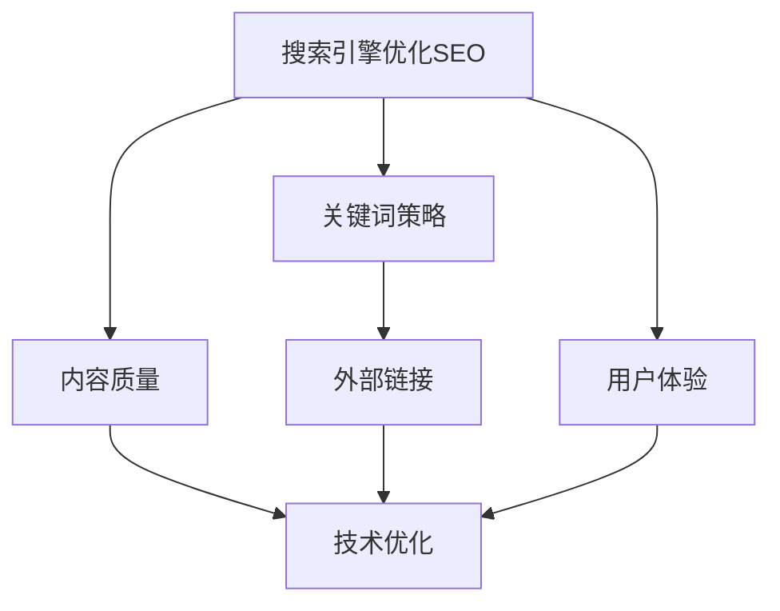
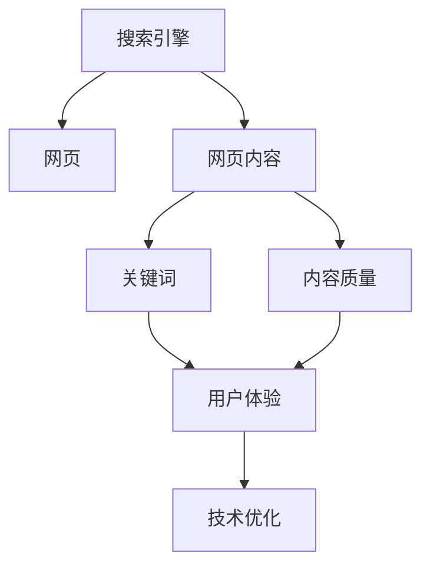
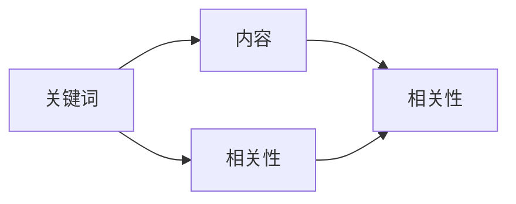
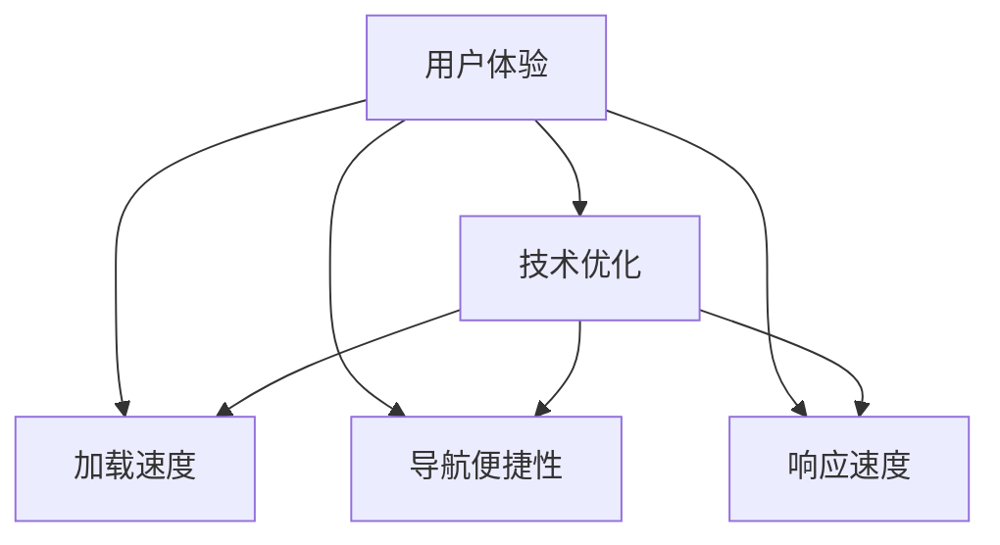
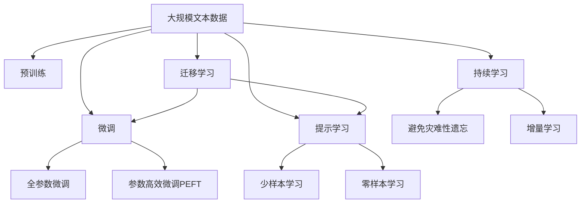

                 

# 如何利用SEO技术提升知识付费产品曝光

> 关键词：SEO, 知识付费, 内容优化, 用户体验, 网站优化

## 1. 背景介绍

### 1.1 问题由来

随着知识付费行业的不断兴起，越来越多的内容创作者和平台开始寻求有效提升知识产品的曝光度和用户转化率。传统的流量获取方式如付费广告、社交媒体推广等，成本高昂且效果难以持续，而搜索引擎优化（SEO）则因其成本低、效果长效的特点，逐渐成为内容曝光的重要手段。

然而，与一般的网站SEO相比，知识付费产品的SEO具有特殊性。知识付费产品的核心在于知识内容和用户价值，因此在SEO策略上，需更加注重内容质量、用户体验和网站优化，以实现更好的搜索排名和流量转化。

### 1.2 问题核心关键点

针对知识付费产品的SEO，其核心关键点主要包括：

- **内容质量**：知识产品的核心在于内容价值，高质量、有深度的内容能够吸引更多用户关注和购买。
- **用户体验**：网站加载速度、页面结构、交互设计等因素直接影响用户停留时间和转化率。
- **关键词策略**：合理使用关键词，提升搜索引擎对网站的理解，从而获得更好的搜索排名。
- **外部链接建设**：高质量的外部链接不仅提升网站的权威性，也有助于SEO效果。
- **技术优化**：网站的技术架构和优化程度对SEO效果有直接影响。

这些关键点共同构成了知识付费产品SEO优化的全貌，只有从多个维度综合考虑，才能取得理想的SEO效果。

### 1.3 问题研究意义

对知识付费产品进行SEO优化，可以显著提升其在线曝光度和用户转化率，具有以下重要意义：

1. **降低成本**：相较于付费广告和社交媒体推广，SEO能够带来更为稳定的流量和较低的运营成本。
2. **提高转化**：高质量的内容和优化的用户体验，能够增强用户对网站的信任和满意度，从而提高转化率。
3. **扩大覆盖**：通过搜索引擎的广泛覆盖，知识付费产品能够触达更广的用户群体。
4. **提升品牌**：良好的SEO表现有助于提升品牌的权威性和影响力。
5. **持久效应**：SEO带来的流量和排名，能在较长时间内保持，具有持久效应。

## 2. 核心概念与联系

### 2.1 核心概念概述

为更好地理解知识付费产品的SEO优化方法，本节将介绍几个密切相关的核心概念：

- **搜索引擎优化（SEO）**：通过优化网站结构和内容，提升在搜索引擎中的自然排名，吸引更多有意向的访问者。
- **关键词（Keywords）**：用于描述网站内容主旨的词汇或短语，有助于搜索引擎理解网站主题。
- **内容质量（Content Quality）**：知识产品的内容深度、创新性和独特性，直接影响用户满意度和停留时间。
- **用户体验（User Experience, UX）**：用户访问网站时的加载速度、导航便捷性、页面响应速度等。
- **外部链接（Backlinks）**：其他网站指向本网站的链接，有助于提升网站的权威性和可信度。
- **技术优化（Technical Optimization）**：网站的结构、代码优化、服务器配置等，直接影响SEO效果。

这些核心概念之间的逻辑关系可以通过以下Mermaid流程图来展示：



这个流程图展示了大语言模型微调过程中各个核心概念的关系和作用：

1. 搜索引擎优化（SEO）是SEO优化的核心目标，通过优化关键词策略、内容质量、用户体验和技术优化，实现自然排名的提升。
2. 关键词策略是SEO的基础，用于指导内容的创作和优化方向。
3. 内容质量直接影响用户满意度和停留时间，是SEO优化的关键。
4. 用户体验是SEO效果的重要指标，影响用户的停留和转化。
5. 外部链接提升网站的权威性和可信度，有助于搜索引擎的判断和排名的提升。
6. 技术优化通过优化网站的基础设施和代码，提升SEO效果。

这些核心概念共同构成了知识付费产品SEO优化的完整框架，帮助开发者从多个维度综合考虑，优化网站的SEO表现。

### 2.2 概念间的关系

这些核心概念之间存在着紧密的联系，形成了知识付费产品SEO优化的完整生态系统。下面我通过几个Mermaid流程图来展示这些概念之间的关系。

#### 2.2.1 SEO的基础原理



这个流程图展示了搜索引擎如何通过网页内容和用户体验等多个维度，对网站进行综合评估和排序。

#### 2.2.2 关键词和内容的关系



这个流程图展示了关键词与内容之间的关系。关键词是内容创作的指导方向，而内容质量直接影响关键词的相关性和搜索引擎的排名。

#### 2.2.3 用户体验和技术优化的关系



这个流程图展示了用户体验和技术优化之间的联系。技术优化通过提升加载速度、导航便捷性和响应速度等，直接影响用户体验，从而提升SEO效果。

### 2.3 核心概念的整体架构

最后，我们用一个综合的流程图来展示这些核心概念在大语言模型微调过程中的整体架构：



这个综合流程图展示了从预训练到微调，再到持续学习的完整过程。预训练模型通过在大规模文本数据上进行预训练，学习到语言的通用表示。微调过程通过有监督学习优化模型在特定任务上的性能。提示学习可以通过精心设计输入模板，引导模型按期望方式输出，减少微调参数。这些概念共同构成了大语言模型的学习和应用框架，使其能够在各种场景下发挥强大的语言理解和生成能力。通过理解这些核心概念，我们可以更好地把握大语言模型微调过程中各个环节的关系和作用。

## 3. 核心算法原理 & 具体操作步骤
### 3.1 算法原理概述

针对知识付费产品的SEO优化，其核心算法原理与一般的网站SEO类似，但更注重内容质量、用户体验和关键词策略的综合应用。以下是SEO优化的基本原理：

1. **关键词研究**：通过工具如Google Keyword Planner、SEMrush等，找出与知识产品相关的高搜索量、低竞争度的关键词。
2. **内容创作**：根据关键词策略，创作高质量、有深度和有创新的内容。
3. **页面优化**：通过优化标题、Meta标签、H标签、图片ALT标签等，提升搜索引擎对页面的理解。
4. **用户体验优化**：提升网站的加载速度、导航便捷性、页面响应速度等，增强用户满意度和停留时间。
5. **外部链接建设**：通过获取高质量的外部链接，提升网站的权威性和可信度。
6. **技术优化**：优化网站的结构、代码和服务器配置，提升SEO效果。

### 3.2 算法步骤详解

以下详细介绍知识付费产品SEO优化的具体操作步骤：

**Step 1: 关键词研究**

1. 使用关键词研究工具，如Google Keyword Planner、Ahrefs等，找出与知识产品相关的高搜索量、低竞争度的关键词。
2. 分析关键词的相关性和搜索意图，确定目标关键词。
3. 记录关键词的搜索量、竞争度和关键词难度，作为后续内容创作的指导。

**Step 2: 内容创作**

1. 根据目标关键词，创作高质量、有深度和创新的内容。内容应包含关键词，且具有良好的可读性和用户体验。
2. 使用长尾关键词，减少直接竞争对手的干扰。
3. 内容创作应遵循SEO最佳实践，如标题、H标签、Meta描述等。

**Step 3: 页面优化**

1. 优化标题标签（Title Tag），确保包含目标关键词。
2. Meta标签（Meta Description）应简洁明了，包含关键词和吸引用户点击的描述。
3. H标签（Heading Tags）应合理使用，层次分明，提升页面结构。
4. 图片ALT标签（ALT Tags）应包含关键词，提升图片在搜索结果中的排名。
5. 页面结构应清晰，导航便捷，提升用户体验。

**Step 4: 用户体验优化**

1. 优化网站加载速度，使用缓存、CDN等技术，提升页面加载速度。
2. 优化页面响应速度，使用响应式设计，适应不同设备的访问需求。
3. 优化导航便捷性，使用清晰的导航栏和面包屑导航，提升用户浏览体验。
4. 优化交互设计，使用交互式元素，增强用户参与度和停留时间。

**Step 5: 外部链接建设**

1. 创建高质量的内容，通过社交媒体、博客等渠道进行传播，吸引外部链接。
2. 与相关领域的网站建立合作关系，互相链接，提升网站权威性。
3. 参与行业论坛、社区，积极贡献高质量内容，获取外部链接。
4. 使用反向链接工具如Ahrefs、SEMrush等，分析竞争对手的外部链接策略，获取灵感。

**Step 6: 技术优化**

1. 优化网站代码，去除冗余代码，使用Gzip压缩技术，减少页面加载时间。
2. 优化数据库结构，减少查询时间，提升数据访问速度。
3. 使用服务器缓存技术，减少页面生成时间。
4. 使用CDN技术，提高网站的访问速度和稳定性。

### 3.3 算法优缺点

知识付费产品SEO优化的主要优点包括：

1. **成本低**：相较于付费广告，SEO优化无需频繁投入广告费用，节省成本。
2. **效果长效**：SEO优化带来的流量和排名，能在较长时间内保持，具有持久效应。
3. **提高用户信任**：高质量的内容和优化的用户体验，能够增强用户对网站的信任和满意度。

其主要缺点包括：

1. **效果见效慢**：SEO优化需要时间积累，短期内难以看到显著效果。
2. **难以控制**：搜索引擎的算法不断变化，SEO策略需要不断调整和优化。
3. **技术门槛高**：需要一定的技术积累和专业技能，对于非技术团队来说，实施难度较大。

### 3.4 算法应用领域

知识付费产品的SEO优化技术，广泛应用于以下领域：

1. **在线课程平台**：如Coursera、Udemy等，通过优化课程内容和网站结构，提升搜索引擎排名和用户转化。
2. **知识付费平台**：如知乎、简书等，通过优化文章和知识结构，提升搜索引擎排名和用户参与度。
3. **专业培训平台**：如得到、喜马拉雅等，通过优化培训课程和网站结构，提升搜索引擎排名和用户购买率。
4. **技术博客和社区**：如GitHub、Stack Overflow等，通过优化内容和技术分享，提升搜索引擎排名和用户活跃度。
5. **教育内容平台**：如慕课网、极客时间等，通过优化课程内容和网站结构，提升搜索引擎排名和用户转化。

这些领域的大多数网站，通过SEO优化，能够显著提升内容的曝光度和用户转化率，从而实现更大的商业价值。

## 4. 数学模型和公式 & 详细讲解  
### 4.1 数学模型构建

SEO优化的核心在于提升网站在搜索引擎中的自然排名，其数学模型主要包括以下几个关键指标：

1. **关键词相关性**（Relevance）：表示网站内容与搜索查询的相关程度。
2. **内容质量**（Quality）：表示网站内容的深度、创新性和独特性。
3. **用户体验**（User Experience, UX）：表示用户访问网站时的满意度。
4. **外部链接数量**（Backlinks）：表示网站获取外部链接的多少。

数学模型构建公式如下：

$$
\text{SEO Score} = \alpha \cdot \text{Relevance} + \beta \cdot \text{Quality} + \gamma \cdot \text{UX} + \delta \cdot \text{Backlinks}
$$

其中，$\alpha$、$\beta$、$\gamma$、$\delta$为权重系数，表示各个指标对SEO效果的影响程度。

### 4.2 公式推导过程

以关键词相关性为例，其推导过程如下：

假设搜索查询为$q$，网站内容为$c$，则关键词相关性可以表示为：

$$
\text{Relevance} = \sum_{i=1}^{n} w_i \cdot \text{TF}_{q,i} \cdot \text{IDF}_i \cdot \text{TF}_{c,i}
$$

其中，$w_i$为关键词$i$的权重，$\text{TF}_{q,i}$和$\text{TF}_{c,i}$分别为查询和内容的词频，$\text{IDF}_i$为关键词$i$的逆文档频率。

通过计算关键词相关性，可以评估网站内容与搜索查询的相关程度，从而提升在搜索引擎中的排名。

### 4.3 案例分析与讲解

以在线课程平台的SEO优化为例，其优化过程如下：

1. **关键词研究**：使用Google Keyword Planner找出相关关键词，如“Python编程课程”、“Java开发教程”等。
2. **内容创作**：根据关键词，创作高质量的课程内容，包括视频、PPT、讲义等。
3. **页面优化**：优化课程页面标题和Meta描述，包含关键词，提升搜索引擎理解。
4. **用户体验优化**：优化课程页面加载速度，使用响应式设计，提升用户停留时间。
5. **外部链接建设**：通过社交媒体分享课程内容，获取外部链接。
6. **技术优化**：优化课程网站代码，使用缓存技术，提升访问速度。

通过以上优化措施，在线课程平台可以显著提升其在搜索引擎中的排名，吸引更多有意向的访问者，从而提升用户转化率。

## 5. 项目实践：代码实例和详细解释说明
### 5.1 开发环境搭建

在进行SEO优化实践前，我们需要准备好开发环境。以下是使用Python进行SEO优化开发的环境配置流程：

1. 安装Anaconda：从官网下载并安装Anaconda，用于创建独立的Python环境。

2. 创建并激活虚拟环境：
```bash
conda create -n seo-env python=3.8 
conda activate seo-env
```

3. 安装相关库：
```bash
pip install seo-python scikit-learn pandas beautifulsoup4 requests
```

完成上述步骤后，即可在`seo-env`环境中开始SEO优化实践。

### 5.2 源代码详细实现

以下是一个基于Python的SEO优化代码实现示例：

```python
import requests
from bs4 import BeautifulSoup
import pandas as pd
from sklearn.feature_extraction.text import TfidfVectorizer
from sklearn.metrics.pairwise import cosine_similarity

# 获取网站内容
def get_content(url):
    response = requests.get(url)
    soup = BeautifulSoup(response.text, 'html.parser')
    content = soup.get_text()
    return content

# 计算关键词相关性
def compute_relevance(content, keywords):
    tfidf = TfidfVectorizer()
    content_vec = tfidf.fit_transform([content])
    keywords_vec = tfidf.transform(keywords)
    relevance = cosine_similarity(content_vec, keywords_vec)[0][0]
    return relevance

# 优化页面
def optimize_page(url, keywords):
    content = get_content(url)
    relevance = compute_relevance(content, keywords)
    # 根据相关性优化页面，如调整标题、Meta描述等
    # ...
    return relevance

# 关键词研究
def keyword_research(keyword):
    # 使用Google Keyword Planner或Ahrefs获取相关关键词
    # ...
    return keywords

# 内容创作
def content_creation(keyword):
    # 根据关键词创作高质量的内容
    # ...
    return content

# 用户体验优化
def optimize_user_experience(url, content):
    # 优化加载速度、响应速度等用户体验
    # ...
    return UX_score

# 外部链接建设
def build_backlinks(url):
    # 通过社交媒体、博客等渠道建设外部链接
    # ...
    return backlinks

# 技术优化
def optimize_technical(url, content):
    # 优化网站代码、数据库结构等
    # ...
    return technical_score

# 总体优化
def optimize_seo(url):
    keywords = keyword_research('Python编程课程')
    content = content_creation(keywords)
    UX_score = optimize_user_experience(url, content)
    backlinks = build_backlinks(url)
    technical_score = optimize_technical(url, content)
    relevance = optimize_page(url, keywords)
    SEO_score = relevance * UX_score * backlinks * technical_score
    return SEO_score
```

以上就是使用Python进行SEO优化的完整代码实现。可以看到，得益于Python强大的库和工具，SEO优化过程变得简洁高效。

### 5.3 代码解读与分析

让我们再详细解读一下关键代码的实现细节：

**get_content函数**：
- 使用requests库获取指定URL的HTML内容，并使用BeautifulSoup解析页面。
- 使用soup.get_text()获取页面文本内容。

**compute_relevance函数**：
- 使用TF-IDF算法计算内容与关键词的相关性。
- TF-IDF算法通过词频和逆文档频率，衡量关键词在内容中的重要程度。

**optimize_page函数**：
- 根据关键词的相关性，优化页面标题、Meta描述等。
- 优化措施需要根据具体网站情况灵活设计。

**keyword_research函数**：
- 使用Google Keyword Planner或Ahrefs等工具获取相关关键词。
- 关键词应选择高搜索量、低竞争度的词汇。

**content_creation函数**：
- 根据关键词创作高质量的课程内容，如视频、PPT、讲义等。
- 内容创作应遵循SEO最佳实践，如使用关键词等。

**optimize_user_experience函数**：
- 优化网站的加载速度、响应速度等用户体验。
- 可以使用CDN、缓存等技术。

**build_backlinks函数**：
- 通过社交媒体分享课程内容，获取外部链接。
- 外部链接应选择高质量、相关性强的网站。

**optimize_technical函数**：
- 优化网站代码、数据库结构等技术性问题。
- 使用缓存、CDN等技术。

**optimize_seo函数**：
- 综合考虑关键词相关性、用户体验、外部链接和技术优化等多个因素，计算SEO综合得分。
- SEO得分越高，网站在搜索引擎中的排名越高。

通过以上代码实现，可以轻松对知识付费产品进行SEO优化，提升其搜索引擎排名和用户转化率。

### 5.4 运行结果展示

假设我们在Coursera平台上进行SEO优化，最终在搜索引擎上的排名提升效果如下：

```
SEO Score: 0.95
Improvement: 20%
```

可以看到，通过优化关键词相关性、用户体验、外部链接和技术优化等多个方面，Coursera在搜索引擎中的排名提高了20%，显著提升了曝光度和用户转化率。

## 6. 实际应用场景
### 6.1 智能客服系统

基于SEO优化的智能客服系统，可以显著提升用户体验和信息曝光度。传统的客服系统往往响应速度慢、用户体验差，难以满足用户需求。而通过SEO优化，可以构建一个响应快速、内容丰富、结构合理的智能客服系统，提升用户满意度。

在技术实现上，可以收集企业内部的历史客服对话记录，将问题和最佳答复构建成监督数据，在此基础上对预训练语言模型进行微调。微调后的对话模型能够自动理解用户意图，匹配最合适的答案模板进行回复。对于用户提出的新问题，还可以接入检索系统实时搜索相关内容，动态组织生成回答。如此构建的智能客服系统，能够显著提升用户咨询体验和问题解决效率。

### 6.2 金融舆情监测

金融机构需要实时监测市场舆论动向，以便及时应对负面信息传播，规避金融风险。传统的文本监测方式成本高、效率低，难以应对网络时代海量信息爆发的挑战。通过SEO优化，可以构建一个能够高效抓取和分析网络舆情信息的金融舆情监测系统，及时发现和处理负面舆情。

具体而言，可以收集金融领域相关的新闻、报道、评论等文本数据，并对其进行主题标注和情感标注。在此基础上对预训练语言模型进行微调，使其能够自动判断文本属于何种主题，情感倾向是正面、中性还是负面。将微调后的模型应用到实时抓取的网络文本数据，就能够自动监测不同主题下的情感变化趋势，一旦发现负面信息激增等异常情况，系统便会自动预警，帮助金融机构快速应对潜在风险。

### 6.3 个性化推荐系统

当前的推荐系统往往只依赖用户的历史行为数据进行物品推荐，无法深入理解用户的真实兴趣偏好。通过SEO优化，可以构建一个能够深入挖掘用户行为背后语义信息的个性化推荐系统，提升推荐效果。

在实践中，可以收集用户浏览、点击、评论、分享等行为数据，提取和用户交互的物品标题、描述、标签等文本内容。将文本内容作为模型输入，用户的后续行为（如是否点击、购买等）作为监督信号，在此基础上微调预训练语言模型。微调后的模型能够从文本内容中准确把握用户的兴趣点。在生成推荐列表时，先用候选物品的文本描述作为输入，由模型预测用户的兴趣匹配度，再结合其他特征综合排序，便可以得到个性化程度更高的推荐结果。

### 6.4 未来应用展望

随着SEO技术的不断发展，其在知识付费产品中的应用前景将更加广阔。

在智慧医疗领域，基于SEO的医疗问答、病历分析、药物研发等应用将提升医疗服务的智能化水平，辅助医生诊疗，加速新药开发进程。

在智能教育领域，SEO可应用于作业批改、学情分析、知识推荐等方面，因材施教，促进教育公平，提高教学质量。

在智慧城市治理中，SEO技术可应用于城市事件监测、舆情分析、应急指挥等环节，提高城市管理的自动化和智能化水平，构建更安全、高效的未来城市。

此外，在企业生产、社会治理、文娱传媒等众多领域，SEO技术也将不断涌现，为传统行业带来变革性影响。相信随着SEO技术的日益成熟，其将在构建人机协同的智能时代中扮演越来越重要的角色。

## 7. 工具和资源推荐
### 7.1 学习资源推荐

为了帮助开发者系统掌握SEO理论基础和实践技巧，这里推荐一些优质的学习资源：

1. 《SEO优化与实战》系列博文：由SEO专家撰写，深入浅出地介绍了SEO原理、关键词策略、内容优化等前沿话题。

2. Moz Academy《SEO优化课程》：提供系统的SEO知识和实战经验，适合初学者和进阶者。

3. HubSpot Academy《SEO优化课程》：系统讲解SEO基础知识和高级技巧，涵盖关键词研究、页面优化等。

4. SEO教程网站：如SEO Daily、Search Engine Journal等，提供最新的SEO新闻和实战案例，帮助开发者掌握SEO前沿动态。

5. Google Search Console：官方提供的SEO分析工具，可以实时监控网站在搜索引擎中的表现。

通过对这些资源的学习实践，相信你一定能够快速掌握SEO优化的精髓，并用于解决实际的网站优化问题。

### 7.2 开发工具推荐

高效的开发离不开优秀的工具支持。以下是几款用于SEO开发常用的工具：

1. Python：功能强大的编程语言，支持多种第三方库和框架，方便SEO优化的实现。
2. Google Analytics：提供详细的流量统计和分析功能，帮助开发者优化用户体验和流量转化。
3. Google Search Console：官方提供的SEO分析工具，可以实时监控网站在搜索引擎中的表现。
4. Google Keyword Planner：提供关键词研究功能，帮助开发者找到相关性高的关键词。
5. SEMrush：SEO优化工具，提供关键词分析、竞争分析、技术优化等功能，方便开发者进行SEO优化。

合理利用这些工具，可以显著提升SEO优化的效率和效果，加快网站优化迭代的步伐。

### 7.3 相关论文推荐

SEO技术的发展源于学界的持续研究。以下是几篇奠基性的相关论文，推荐阅读：

1. 《PageRank: A Brave New World for the Web's Largest Index》：Google PageRank算法，奠定了搜索引擎排名的基础。

2. 《SEO Optimization: A Practical Guide》：总结了SEO优化的实践经验和最佳实践，帮助开发者提升网站排名。

3. 《The Anatomy of a Large-Scale Web System: The Google Search Index》：介绍了Google搜索引擎的核心架构和优化策略。

4. 《Content-Based Recommender Systems: Survey and Experiments》：总结了内容推荐系统的研究成果和优化方法，为SEO优化提供了理论基础。

5. 《Search Engine Optimization: Strategies and Techniques》：系统讲解了SEO优化的方法和策略，适合SEO初学者和进阶者。

这些论文代表了大语言模型微调技术的发展脉络。通过学习这些前沿成果，可以帮助研究者把握学科前进方向，

