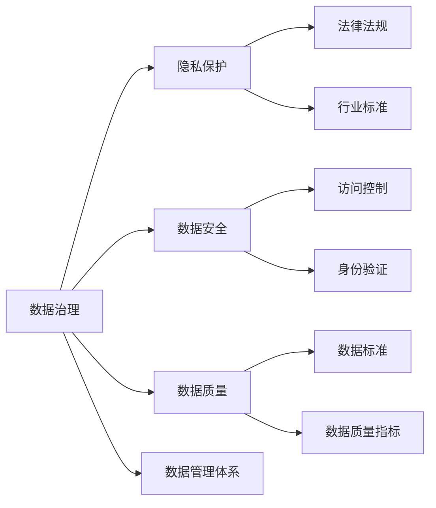

                 

# 平台经济的数据治理：如何建立健全的管理体系？

> 关键词：平台经济,数据治理,数据管理体系,合规性,隐私保护,数据安全,数据质量

## 1. 背景介绍

### 1.1 问题由来
随着互联网和数字技术的迅猛发展，平台经济（如电子商务、社交网络、共享经济等）已成为推动全球经济增长的重要引擎。然而，平台经济同时也面临着数据管理的严峻挑战。数据是平台生态系统的核心资产，如何在保护用户隐私和数据安全的同时，实现数据的合规使用和高质量管理，成为了行业关注的焦点。

平台经济的数据治理，不仅关系到数据的质量和利用效率，更直接关系到用户的信任和企业的长期发展。高质量的数据管理，能够有效提升平台的运营效率和盈利能力，为平台生态带来巨大的商业价值。

### 1.2 问题核心关键点
平台经济的数据治理问题核心关键点在于：
- 如何构建科学合理的数据治理管理体系，确保数据的合规性和可靠性。
- 如何平衡数据利用与隐私保护，满足用户隐私权和数据安全的要求。
- 如何提高数据质量和数据治理的效率，提升数据管理的自动化水平。
- 如何整合多方数据资源，实现数据的价值最大化。

### 1.3 问题研究意义
构建平台经济的数据治理管理体系，具有重要意义：
- 增强平台生态系统的信任度，提升用户黏性和忠诚度。
- 提升平台运营效率，优化决策支持和业务运营。
- 降低数据安全风险，保障用户隐私和数据安全。
- 促进数据资源共享，推动数据市场和生态建设。

## 2. 核心概念与联系

### 2.1 核心概念概述

为了深入理解平台经济的数据治理问题，我们首先介绍几个关键概念及其相互联系。

- **数据治理**：指对数据的全生命周期进行规划、监督、控制和保障的一系列活动，以确保数据的完整性、一致性、安全性和可用性。数据治理不仅关注数据的存储、管理和保护，还包括数据质量管理、数据治理策略制定、数据治理流程优化等。

- **隐私保护**：指在数据收集、存储、处理和使用过程中，确保用户个人隐私信息不被非法获取、泄露或滥用的过程。隐私保护涉及数据最小化原则、匿名化、加密等技术手段，以及相关的法律法规和行业标准。

- **数据安全**：指防止数据被未经授权的访问、修改、删除或破坏，确保数据的完整性和可用性。数据安全包括数据传输安全、数据存储安全、访问控制和身份验证等。

- **数据质量**：指数据准确性、完整性、一致性和时效性的综合表现。高质量的数据能够提供可靠的分析支持，促进业务决策和运营优化。

- **数据管理体系**：指一个组织为实现数据治理目标而建立的管理架构和流程，包括数据管理策略、数据标准、数据治理工具和数据治理团队等。

这些概念之间的联系如下：



### 2.2 概念间的关系

通过上述 Mermaid 图，我们可以清楚地看到这些核心概念之间的关系：

- 数据治理是整个数据管理体系的根基，它包含了隐私保护、数据安全、数据质量等各个方面。
- 隐私保护和数据安全是数据治理的两个重要组成部分，保障了数据管理的合法性和安全性。
- 数据质量则是数据治理的直接目标，高质量的数据有助于实现业务目标。
- 数据管理体系则提供了实现数据治理的工具和团队，确保数据治理的顺利实施。

## 3. 核心算法原理 & 具体操作步骤

### 3.1 算法原理概述
平台经济的数据治理，本质上是一个多维度的综合治理过程。其核心算法原理可以概括为：

1. **数据收集与清洗**：从多个数据源收集数据，并对数据进行清洗和标准化处理，确保数据的质量和一致性。

2. **数据存储与保护**：采用先进的存储技术和安全措施，保障数据在存储过程中的完整性和安全性。

3. **数据合规与隐私保护**：确保数据治理过程符合相关法律法规和行业标准，保护用户的隐私权。

4. **数据利用与优化**：通过数据分析和挖掘，提升数据的利用效率，优化业务运营和决策支持。

5. **数据监测与改进**：对数据治理过程进行持续监测和评估，及时发现问题并改进。

### 3.2 算法步骤详解
以下是平台经济数据治理的核心算法步骤：

1. **需求分析与策略制定**：
   - 分析平台业务需求，确定数据治理目标和关键指标。
   - 制定数据治理策略，包括数据分类、数据访问权限、数据存储位置等。

2. **数据收集与清洗**：
   - 从内部系统、外部合作伙伴、第三方数据源等收集数据。
   - 对数据进行去重、去噪、标准化处理，确保数据的准确性和一致性。

3. **数据存储与保护**：
   - 采用分布式存储技术，如Hadoop、Spark等，提高数据的存储效率。
   - 使用数据加密、访问控制、审计日志等措施，保障数据的安全性和合规性。

4. **数据合规与隐私保护**：
   - 确保数据收集、存储和使用过程符合GDPR、CCPA等法律法规要求。
   - 采用数据匿名化、加密等技术手段，保护用户隐私。

5. **数据利用与优化**：
   - 利用数据挖掘、机器学习等技术，提升数据的利用效率。
   - 通过数据可视化、数据分析报告等方式，优化业务决策和运营。

6. **数据监测与改进**：
   - 建立数据治理监控系统，实时监测数据治理过程。
   - 定期评估数据治理效果，及时发现和解决问题，不断改进数据治理流程。

### 3.3 算法优缺点
平台经济数据治理的算法优点包括：
- 提升数据质量，保障数据的完整性、一致性和可靠性。
- 增强数据安全，降低数据泄露和滥用的风险。
- 优化数据利用，提升业务决策和运营效率。

缺点包括：
- 实施成本高，需要大量资金和人力资源投入。
- 数据治理流程复杂，需要科学合理的管理策略和操作规范。
- 数据治理效果受数据源多样性和数据质量影响较大。

### 3.4 算法应用领域
平台经济的数据治理算法广泛应用于以下几个领域：

- **电子商务**：确保交易数据的准确性、安全性和隐私保护，提升用户购物体验和平台运营效率。

- **社交网络**：保护用户隐私，防止数据滥用，提升用户信任度和平台生态健康。

- **共享经济**：优化数据资源分配，提升共享经济平台的运营效率和服务质量。

- **金融服务**：保障金融数据的安全性和合规性，防范金融风险。

## 4. 数学模型和公式 & 详细讲解 & 举例说明

### 4.1 数学模型构建

平台经济的数据治理模型可以概括为以下几个关键部分：

1. **数据质量模型**：
   - 描述数据的完整性、准确性、一致性、时效性等属性。
   - 采用数据质量评估指标，如数据完整度、准确率、一致性等。

2. **数据安全模型**：
   - 描述数据在传输、存储、使用过程中的安全性保障。
   - 包括数据加密、访问控制、审计日志等技术手段。

3. **隐私保护模型**：
   - 描述用户隐私数据的保护策略和措施。
   - 包括数据匿名化、加密、隐私保护算法等。

4. **数据合规模型**：
   - 描述数据治理过程中需要遵守的法律法规和行业标准。
   - 包括数据分类、访问权限、数据存储位置等。

5. **数据利用模型**：
   - 描述数据在业务决策和运营中的利用方式。
   - 包括数据分析、数据可视化、机器学习等技术手段。

### 4.2 公式推导过程

以数据质量模型为例，我们可以用数学公式表示数据质量评估指标：

$$
\text{数据质量} = \frac{\text{数据完整度} \times \text{数据准确率} \times \text{数据一致性}}{\text{数据时效性} \times \text{数据安全性} \times \text{数据合规性}}
$$

其中，数据完整度表示数据记录的完整性，数据准确率表示数据的准确性，数据一致性表示数据的一致性，数据时效性表示数据的更新频率，数据安全性表示数据的安全保障，数据合规性表示数据治理过程中的合规性。

### 4.3 案例分析与讲解

以某电商平台的数据治理为例，分析数据治理模型的应用：

1. **数据收集与清洗**：
   - 从用户注册、交易、客服互动等渠道收集数据。
   - 对数据进行去重、去噪、标准化处理，确保数据的一致性和准确性。

2. **数据存储与保护**：
   - 采用分布式存储技术，如Hadoop，提高数据的存储效率。
   - 使用数据加密、访问控制、审计日志等措施，保障数据的安全性和合规性。

3. **数据合规与隐私保护**：
   - 确保数据收集、存储和使用过程符合GDPR、CCPA等法律法规要求。
   - 采用数据匿名化、加密等技术手段，保护用户隐私。

4. **数据利用与优化**：
   - 利用数据挖掘、机器学习等技术，提升数据的利用效率。
   - 通过数据可视化、数据分析报告等方式，优化业务决策和运营。

5. **数据监测与改进**：
   - 建立数据治理监控系统，实时监测数据治理过程。
   - 定期评估数据治理效果，及时发现和解决问题，不断改进数据治理流程。

## 5. 项目实践：代码实例和详细解释说明

### 5.1 开发环境搭建

平台经济的数据治理项目开发环境搭建主要包括以下步骤：

1. **安装Python和相关库**：
   - 安装Python 3.x版本。
   - 安装Pandas、NumPy、Scikit-learn等数据处理库。
   - 安装TensorFlow、PyTorch等深度学习库。

2. **配置数据源**：
   - 配置数据库连接信息。
   - 配置数据采集API接口。

3. **搭建数据治理平台**：
   - 搭建数据收集、清洗、存储、保护、利用、监测等模块。

4. **部署监控系统**：
   - 部署数据治理监控系统，实时监测数据治理过程。

### 5.2 源代码详细实现

以下是一个简化的平台经济数据治理项目的Python代码实现：

```python
import pandas as pd
import numpy as np
from sklearn.preprocessing import StandardScaler
from tensorflow.keras.models import Sequential
from tensorflow.keras.layers import Dense
from tensorflow.keras.callbacks import EarlyStopping

# 数据收集与清洗
def collect_and_clean_data():
    # 从API接口或数据库中获取数据
    data = pd.read_csv('data.csv')
    # 对数据进行去重、去噪、标准化处理
    data = data.drop_duplicates()
    data = data.dropna()
    data = StandardScaler().fit_transform(data)
    return data

# 数据存储与保护
def store_and_protect_data(data):
    # 使用分布式存储技术，如Hadoop
    # 使用数据加密、访问控制、审计日志等措施
    pass

# 数据合规与隐私保护
def ensure_compliance_and_privacy(data):
    # 确保数据收集、存储和使用过程符合GDPR、CCPA等法律法规要求
    # 采用数据匿名化、加密等技术手段
    pass

# 数据利用与优化
def optimize_data_utilization(data):
    # 利用数据挖掘、机器学习等技术，提升数据的利用效率
    # 通过数据可视化、数据分析报告等方式，优化业务决策和运营
    model = Sequential()
    model.add(Dense(64, input_dim=data.shape[1], activation='relu'))
    model.add(Dense(1, activation='sigmoid'))
    model.compile(loss='binary_crossentropy', optimizer='adam', metrics=['accuracy'])
    model.fit(data, labels, epochs=10, batch_size=32, callbacks=[EarlyStopping(patience=5)])
    return model

# 数据监测与改进
def monitor_and_improve_data_governance(data, model):
    # 建立数据治理监控系统，实时监测数据治理过程
    # 定期评估数据治理效果，及时发现和解决问题，不断改进数据治理流程
    pass
```

### 5.3 代码解读与分析

以上代码简要展示了平台经济数据治理的关键步骤和算法实现。各模块功能如下：

- `collect_and_clean_data`函数：负责数据收集与清洗，包括去重、去噪、标准化处理等。
- `store_and_protect_data`函数：负责数据存储与保护，包括使用分布式存储技术和安全措施。
- `ensure_compliance_and_privacy`函数：负责数据合规与隐私保护，包括遵守法律法规和技术手段保护隐私。
- `optimize_data_utilization`函数：负责数据利用与优化，包括利用机器学习模型提升数据利用效率。
- `monitor_and_improve_data_governance`函数：负责数据监测与改进，包括建立数据治理监控系统，定期评估和改进数据治理流程。

## 6. 实际应用场景

### 6.1 电子商务

电子商务平台的数据治理主要关注以下方面：

1. **交易数据治理**：
   - 确保交易数据的完整性、准确性和一致性。
   - 采用数据清洗、数据标准化处理，提升交易数据的可靠性。

2. **用户行为数据治理**：
   - 保护用户隐私，防止数据滥用。
   - 采用数据匿名化、加密等技术手段，确保用户数据的安全性。

3. **库存数据治理**：
   - 优化库存管理，提升供应链效率。
   - 通过数据分析和预测，优化库存水平，减少缺货和库存积压。

4. **客服数据治理**：
   - 提升客户服务质量，优化客服运营效率。
   - 通过数据分析和机器学习，预测用户需求，提升客服响应速度和满意度。

### 6.2 金融服务

金融服务行业的数据治理主要关注以下方面：

1. **客户数据治理**：
   - 确保客户数据的完整性、准确性和一致性。
   - 采用数据清洗、数据标准化处理，提升客户数据的可靠性。

2. **交易数据治理**：
   - 保护用户隐私，防止数据滥用。
   - 采用数据匿名化、加密等技术手段，确保交易数据的安全性。

3. **风险数据治理**：
   - 评估和监控金融风险，保障金融稳定。
   - 通过数据分析和机器学习，预测金融风险，提升风险管理能力。

4. **合规数据治理**：
   - 确保数据治理过程符合相关法律法规和行业标准。
   - 采用数据分类、访问权限、数据存储位置等措施，保障数据治理的合规性。

### 6.3 社交网络

社交网络平台的数据治理主要关注以下方面：

1. **用户数据治理**：
   - 保护用户隐私，防止数据滥用。
   - 采用数据匿名化、加密等技术手段，确保用户数据的安全性。

2. **内容数据治理**：
   - 确保内容数据的准确性、一致性和可靠性。
   - 采用数据清洗、数据标准化处理，提升内容数据的可靠性。

3. **广告数据治理**：
   - 优化广告投放，提升广告效果。
   - 通过数据分析和机器学习，预测用户行为，优化广告投放策略。

4. **用户互动数据治理**：
   - 提升用户体验，优化用户互动效果。
   - 通过数据分析和机器学习，预测用户行为，提升用户互动质量。

### 6.4 未来应用展望

未来平台经济的数据治理将呈现以下几个发展趋势：

1. **数据治理自动化**：
   - 引入自动化的数据治理工具和流程，提高数据治理的效率和准确性。

2. **数据治理智能化**：
   - 引入机器学习、人工智能等技术，提升数据治理的智能化水平。

3. **数据治理协同化**：
   - 建立多方协同的数据治理机制，实现数据资源的共享和协同利用。

4. **数据治理标准化**：
   - 制定统一的数据治理标准和规范，推动数据治理的标准化和规范化。

5. **数据治理伦理化**：
   - 引入数据治理的伦理和合规要求，保障数据治理的合法性和公正性。

## 7. 工具和资源推荐

### 7.1 学习资源推荐

为了帮助开发者系统掌握平台经济的数据治理技术，这里推荐一些优质的学习资源：

1. **《平台经济数据治理实践》系列博文**：由大模型技术专家撰写，深入浅出地介绍了平台经济数据治理的理论基础和实践技巧。

2. **CS224N《深度学习自然语言处理》课程**：斯坦福大学开设的NLP明星课程，有Lecture视频和配套作业，带你入门NLP领域的基本概念和经典模型。

3. **《平台经济数据治理理论与实践》书籍**：全面介绍了平台经济数据治理的理论、技术和实践，是数据治理学习的重要参考资料。

4. **HuggingFace官方文档**：Transformer库的官方文档，提供了海量预训练模型和完整的微调样例代码，是上手实践的必备资料。

5. **Kaggle平台**：全球最大的数据科学竞赛平台，提供大量真实数据集和开源项目，是数据治理学习的绝佳场所。

通过对这些资源的学习实践，相信你一定能够快速掌握平台经济数据治理的精髓，并用于解决实际的NLP问题。

### 7.2 开发工具推荐

高效的开发离不开优秀的工具支持。以下是几款用于平台经济数据治理开发的常用工具：

1. **Python**：基于Python的开源深度学习框架，灵活动态的计算图，适合快速迭代研究。大部分预训练语言模型都有PyTorch版本的实现。

2. **TensorFlow**：由Google主导开发的开源深度学习框架，生产部署方便，适合大规模工程应用。同样有丰富的预训练语言模型资源。

3. **Transformer库**：HuggingFace开发的NLP工具库，集成了众多SOTA语言模型，支持PyTorch和TensorFlow，是进行数据治理任务开发的利器。

4. **Weights & Biases**：模型训练的实验跟踪工具，可以记录和可视化模型训练过程中的各项指标，方便对比和调优。与主流深度学习框架无缝集成。

5. **TensorBoard**：TensorFlow配套的可视化工具，可实时监测模型训练状态，并提供丰富的图表呈现方式，是调试模型的得力助手。

6. **Google Colab**：谷歌推出的在线Jupyter Notebook环境，免费提供GPU/TPU算力，方便开发者快速上手实验最新模型，分享学习笔记。

合理利用这些工具，可以显著提升平台经济数据治理任务的开发效率，加快创新迭代的步伐。

### 7.3 相关论文推荐

平台经济数据治理的研究源于学界的持续研究。以下是几篇奠基性的相关论文，推荐阅读：

1. **《平台经济中的数据治理与隐私保护》**：讨论了平台经济中数据治理的挑战和解决方案，提出了隐私保护的新方法和技术手段。

2. **《数据治理：从理论到实践》**：全面介绍了数据治理的理论基础、技术和实践，是数据治理研究的重要参考文献。

3. **《平台经济中的智能数据治理》**：介绍了智能数据治理的概念、方法和应用场景，展示了数据治理的未来发展方向。

4. **《基于深度学习的平台经济数据治理》**：讨论了深度学习在数据治理中的应用，提出了基于深度学习的数据治理新方法。

5. **《数据治理的伦理和合规》**：探讨了数据治理的伦理和合规问题，提出了数据治理的伦理框架和合规标准。

这些论文代表了大数据治理技术的发展脉络。通过学习这些前沿成果，可以帮助研究者把握学科前进方向，激发更多的创新灵感。

除上述资源外，还有一些值得关注的前沿资源，帮助开发者紧跟数据治理技术的最新进展，例如：

1. **arXiv论文预印本**：人工智能领域最新研究成果的发布平台，包括大量尚未发表的前沿工作，学习前沿技术的必读资源。

2. **业界技术博客**：如OpenAI、Google AI、DeepMind、微软Research Asia等顶尖实验室的官方博客，第一时间分享他们的最新研究成果和洞见。

3. **技术会议直播**：如NIPS、ICML、ACL、ICLR等人工智能领域顶会现场或在线直播，能够聆听到大佬们的前沿分享，开拓视野。

4. **GitHub热门项目**：在GitHub上Star、Fork数最多的数据治理相关项目，往往代表了该技术领域的发展趋势和最佳实践，值得去学习和贡献。

5. **行业分析报告**：各大咨询公司如McKinsey、PwC等针对数据治理行业的分析报告，有助于从商业视角审视技术趋势，把握应用价值。

总之，对于平台经济数据治理技术的学习和实践，需要开发者保持开放的心态和持续学习的意愿。多关注前沿资讯，多动手实践，多思考总结，必将收获满满的成长收益。

## 8. 总结：未来发展趋势与挑战

### 8.1 总结

本文对平台经济的数据治理方法进行了全面系统的介绍。首先阐述了平台经济数据治理的背景和意义，明确了数据治理在保障数据合规性、提高数据质量、优化数据利用等方面的重要性。其次，从原理到实践，详细讲解了数据治理的数学模型和关键步骤，给出了数据治理任务开发的完整代码实例。同时，本文还广泛探讨了数据治理方法在电子商务、金融服务、社交网络等多个行业领域的应用前景，展示了数据治理范式的巨大潜力。

通过本文的系统梳理，可以看到，平台经济的数据治理方法正在成为数据管理的重要范式，极大地提升了数据治理的效率和效果，为平台生态系统的健康发展提供了有力保障。未来，伴随数据治理技术的不断演进，数据治理必将在大数据时代扮演越来越重要的角色。

### 8.2 未来发展趋势

展望未来，平台经济数据治理技术将呈现以下几个发展趋势：

1. **数据治理自动化**：
   - 引入自动化的数据治理工具和流程，提高数据治理的效率和准确性。

2. **数据治理智能化**：
   - 引入机器学习、人工智能等技术，提升数据治理的智能化水平。

3. **数据治理协同化**：
   - 建立多方协同的数据治理机制，实现数据资源的共享和协同利用。

4. **数据治理标准化**：
   - 制定统一的数据治理标准和规范，推动数据治理的标准化和规范化。

5. **数据治理伦理化**：
   - 引入数据治理的伦理和合规要求，保障数据治理的合法性和公正性。

这些趋势凸显了数据治理技术的广阔前景。这些方向的探索发展，必将进一步提升数据治理的效果和效率，为平台生态系统的健康发展提供有力保障。

### 8.3 面临的挑战

尽管平台经济数据治理技术已经取得了显著进展，但在迈向更加智能化、普适化应用的过程中，它仍面临着诸多挑战：

1. **数据治理成本高**：
   - 数据治理涉及大量的技术开发和人力资源投入，实施成本较高。

2. **数据治理复杂性高**：
   - 数据治理流程复杂，需要科学合理的管理策略和操作规范。

3. **数据治理效果受数据源多样性和数据质量影响较大**：
   - 数据源多样性和数据质量对数据治理效果有较大影响。

4. **数据治理技术与业务需求匹配度不足**：
   - 数据治理技术需与业务需求有效结合，才能发挥最大效用。

5. **数据治理技术与外部系统集成难度大**：
   - 数据治理技术需与外部系统（如金融系统、物流系统等）进行有效集成，才能实现数据治理的全面覆盖。

6. **数据治理过程中的隐私保护和合规问题**：
   - 数据治理过程中需平衡数据利用与隐私保护，确保数据治理的合法性和合规性。

7. **数据治理技术的灵活性和可扩展性**：
   - 数据治理技术需具备灵活性和可扩展性，才能适应快速变化的业务需求。

### 8.4 研究展望

面对数据治理面临的挑战，未来的研究需要在以下几个方面寻求新的突破：

1. **探索无监督和半监督数据治理方法**：
   - 摆脱对大规模标注数据的依赖，利用自监督学习、主动学习等无监督和半监督范式，最大限度利用非结构化数据，实现更加灵活高效的数据治理。

2. **研究参数高效和计算高效的数据治理范式**：
   - 开发更加参数高效和计算高效的数据治理方法，在固定大部分预训练参数的情况下，只更新极少量的任务相关参数。同时优化数据治理模型的计算图，减少前向传播和反向传播的资源消耗，实现更加轻量级、实时性的部署。

3. **引入因果分析和博弈论工具**：
   - 将因果分析方法引入数据治理模型，识别出数据治理决策的关键特征，增强输出解释的因果性和逻辑性。借助博弈论工具刻画人机交互过程，主动探索并规避数据治理的脆弱点，提高系统稳定性。

4. **纳入伦理道德约束**：
   - 在数据治理目标中引入伦理导向的评估指标，过滤和惩罚有偏见、有害的输出倾向。同时加强人工干预和审核，建立数据治理行为的监管机制，确保输出符合人类价值观和伦理道德。

这些研究方向的探索，必将引领数据治理技术迈向更高的台阶，为构建安全、可靠、可解释、可控的智能系统铺平道路。面向未来，数据治理技术还需要与其他人工智能技术进行更深入的融合，如知识表示、因果推理、强化学习等，多路径协同发力，

