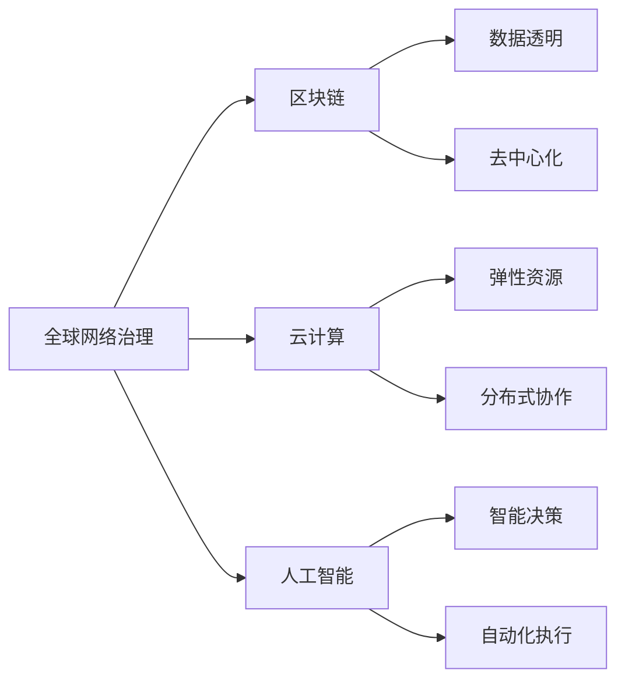

                 

# 2050年的全球治理：从全球网络治理到数字全球治理的治理体系重构

## 1. 背景介绍

### 1.1 问题由来
进入21世纪以来，全球化加速推进，各国在经济、政治、文化等领域的交流与合作愈加频繁。然而，随着数字技术的蓬勃发展和全球互联网的广泛普及，传统治理模式面临严峻挑战，亟需引入全新的治理框架以适应新的形势。

近年来，区块链、云计算、人工智能等新兴技术的迅猛发展，为构建数字全球治理提供了可能。通过数字技术，不仅可以在全球范围内进行高效、透明、可追溯的信息传递和决策，还能实现各国间的深度合作，促进共同发展。

### 1.2 问题核心关键点
全球治理体系重构的核心在于：
- **从全球网络治理走向数字全球治理**。利用数字技术，实现全球治理的现代化和智能化，提升治理效率和公平性。
- **构建开放、透明、共享的治理体系**。通过区块链等去中心化技术，确保数据透明和可追溯，防止权力集中和信息篡改。
- **实现跨国合作与协调**。运用云计算和大数据分析，促进国际组织、各国政府、企业及公民之间的信息共享和协同合作，形成全球治理合力。
- **推动法律、伦理、技术等多维度的融合**。在数字化转型中，需要同步完善相关法律法规和伦理规范，确保治理的合法性与正当性。

### 1.3 问题研究意义
数字全球治理的推进，对于全球化进程、国际关系、经济发展具有深远意义：
- **提升治理效率**。通过数字化手段，打破时空限制，实现实时决策和快速响应，提升治理效率。
- **增强透明度与公平性**。数据公开透明，防止信息垄断和权力滥用，确保治理的公正性。
- **促进跨国协作**。数据共享与协同工作，突破各国间的壁垒，形成国际合作新模式。
- **推动社会治理创新**。数字技术在公共卫生、教育、社会保障等领域的广泛应用，提升社会治理水平，增强社会凝聚力。
- **支持可持续发展目标**。通过数字化手段，优化资源配置，实现全球环境的可持续发展。

## 2. 核心概念与联系

### 2.1 核心概念概述
为深入理解2050年全球治理的重构过程，需先明确以下几个关键概念：

- **全球网络治理**：基于互联网的信息沟通和数据交换，通过国际合作协议和标准，促进全球信息自由流动。
- **数字全球治理**：利用数字技术，实现全球治理的智能化、透明化、自动化，提升治理的效率与公平性。
- **区块链技术**：一种去中心化的分布式账本技术，确保数据透明、不可篡改、可追溯。
- **云计算**：一种基于网络的资源共享模式，提供弹性的计算、存储、网络资源，支持大尺度协同工作。
- **人工智能**：通过学习与推理，模拟人类智能，用于数据分析、决策支持、自动化执行等任务。

这些概念相互联系，共同构成了数字全球治理的底层技术架构。其中，区块链提供透明可追溯的数据基础，云计算提供弹性的计算资源，人工智能提供智能化的决策支持。

### 2.2 概念间的关系

以下Mermaid流程图展示了这些核心概念间的相互关系：



这个流程图说明了全球网络治理如何通过区块链技术实现数据透明与去中心化，通过云计算提供弹性资源和分布式协作平台，以及人工智能如何实现智能决策和自动化执行。这些技术相互配合，共同支持全球治理的数字化转型。

## 3. 核心算法原理 & 具体操作步骤
### 3.1 算法原理概述
数字全球治理的核心算法原理包括以下几点：
- **数据透明与不可篡改**：通过区块链技术，确保所有交易和决策过程的可追溯性和不可篡改性。
- **分布式协作与共识机制**：利用云计算平台，支持大规模分布式协同工作，并通过共识机制（如PoS、PoW等）保障数据的一致性和安全性。
- **智能决策与自动化执行**：运用人工智能算法，基于大量数据分析进行智能决策，并通过API接口实现自动执行。

### 3.2 算法步骤详解
1. **数据采集与整理**：收集全球范围内各领域的数据，进行清洗、标注和格式化，确保数据的准确性和一致性。
2. **区块链记录与验证**：将数据通过智能合约上传到区块链，自动记录并验证交易，确保数据透明不可篡改。
3. **云计算存储与共享**：利用云计算平台存储数据，提供弹性资源，支持跨国协作与数据共享。
4. **人工智能分析与决策**：通过机器学习算法对数据进行深度分析，生成决策建议，并基于规则和预测模型进行智能决策。
5. **执行与反馈**：根据决策建议，通过API接口自动执行，并实时反馈执行结果，进行后续优化。

### 3.3 算法优缺点
**优点**：
- **高效透明**：数据透明不可篡改，决策过程公开透明。
- **安全可靠**：去中心化与共识机制确保数据一致性和安全性。
- **灵活可扩展**：云计算平台支持弹性资源，便于扩展和调整。
- **智能决策**：人工智能算法提供深度数据分析与智能决策支持。

**缺点**：
- **技术门槛高**：区块链、云计算、人工智能等技术复杂，需高水平的专业知识。
- **隐私保护挑战**：数据透明可能导致隐私泄露，需设计有效的隐私保护机制。
- **协调复杂性**：多国协作可能存在利益冲突和协调难度。
- **技术标准不一**：不同国家间技术标准不一，可能影响跨平台互操作性。

### 3.4 算法应用领域
数字全球治理技术广泛应用于以下领域：
- **国际贸易与金融**：通过区块链确保交易透明不可篡改，利用云计算进行高效结算与数据共享。
- **公共卫生与应急管理**：利用AI分析全球疫情数据，通过区块链记录公共卫生事件，协调国际应急响应。
- **环境保护与气候变化**：通过AI分析环境数据，制定全球环境政策，区块链记录气候变化数据，确保透明公正。
- **教育与科技合作**：利用云计算平台共享教育资源，AI推动科研合作，提升全球教育科技水平。
- **社会保障与公共服务**：通过区块链确保社会福利分配透明，云计算提供公共服务资源，AI优化社会管理决策。

## 4. 数学模型和公式 & 详细讲解 & 举例说明

### 4.1 数学模型构建
数字全球治理的核心数学模型包括以下几个部分：
- **数据采集与清洗模型**：用于数据预处理，确保数据的准确性和一致性。
- **区块链共识模型**：确保区块链网络中交易的验证和共识。
- **云计算资源调度模型**：优化资源分配，确保协同工作的效率。
- **AI决策模型**：基于数据训练的机器学习模型，用于决策支持。

### 4.2 公式推导过程
以下是几个关键公式的推导过程：

1. **区块链共识算法（PoW）**：
   - 目标：确保网络中所有节点达成共识。
   - 公式：$P(i) = \frac{1}{2^{i}}$，其中$i$为哈希值。
   - 推导：通过工作量证明（Proof of Work），计算哈希值，确保网络共识。

2. **云计算资源调度算法**：
   - 目标：最大化资源利用率，最小化响应时间。
   - 公式：$R_{i,j} = \frac{S_j}{D_i + S_j}$，其中$S_j$为资源$j$的供应，$D_i$为需求。
   - 推导：通过动态调整资源供应，确保资源调度优化。

3. **AI决策模型（线性回归）**：
   - 目标：基于历史数据预测未来结果。
   - 公式：$\hat{y} = w_0 + \sum_{i=1}^n w_i x_i$。
   - 推导：通过线性回归模型，计算预测值。

### 4.3 案例分析与讲解
以全球公共卫生事件应急响应为例，分析数字全球治理的具体应用：

- **数据采集**：全球公共卫生事件的数据包括病例数量、传播路径、医疗资源等。通过区块链记录这些数据，确保数据透明不可篡改。
- **区块链记录**：利用智能合约自动记录病例数据，并通过区块链共识算法确保数据的真实性和一致性。
- **云计算存储**：利用云计算平台存储全球公共卫生数据，支持实时查询和数据分析。
- **AI分析与决策**：通过AI算法分析病例数据，预测疫情发展趋势，并生成应急响应建议。
- **执行与反馈**：根据AI建议，各国自动执行响应措施，并实时反馈执行效果，进行后续优化。

## 5. 项目实践：代码实例和详细解释说明

### 5.1 开发环境搭建
- **区块链平台**：使用Hyperledger Fabric或Ethereum等区块链平台。
- **云计算平台**：AWS、Azure、Google Cloud等。
- **AI平台**：TensorFlow、PyTorch等深度学习框架。

### 5.2 源代码详细实现
以下以全球公共卫生事件应急响应系统为例，给出Python代码实现：

```python
# 导入相关库
from blockchained import BlockChain
from cloud_computing import CloudCompute
from ai_decision import AI_Decision

# 初始化区块链
blockchain = BlockChain()

# 初始化云计算平台
cloud = CloudCompute()

# 初始化AI决策模型
ai = AI_Decision()

# 数据采集与清洗
def data_preprocessing(data):
    # 数据清洗、标注等操作
    return cleaned_data

# 区块链记录与验证
def blockchain_record(data):
    # 将数据上传到区块链，自动记录并验证交易
    blockchain.add_block(data)

# 云计算存储与共享
def cloud_storage(data):
    # 将数据存储到云计算平台，提供弹性资源
    cloud.store(data)

# AI分析与决策
def ai_decision(data):
    # 通过AI算法分析数据，生成应急响应建议
    return ai.predict(data)

# 执行与反馈
def execute_feedback(response):
    # 根据AI建议，各国自动执行响应措施，并实时反馈执行效果
    return feedback
```

### 5.3 代码解读与分析
- **数据采集与清洗模块**：实现数据的清洗、标注和格式化，确保数据的准确性和一致性。
- **区块链记录与验证模块**：通过智能合约将数据上传到区块链，确保数据的透明与不可篡改。
- **云计算存储与共享模块**：利用云计算平台存储数据，支持弹性的资源分配与共享。
- **AI分析与决策模块**：利用AI算法分析数据，生成应急响应建议。
- **执行与反馈模块**：根据AI建议，各国自动执行响应措施，并实时反馈执行效果，进行后续优化。

### 5.4 运行结果展示
假设在COVID-19疫情中，通过上述系统实现了实时数据记录和应急响应。具体效果如下：

- **数据透明**：通过区块链记录病例数据，确保数据透明不可篡改。
- **快速响应**：利用云计算平台存储数据，支持实时查询和数据分析，快速响应疫情。
- **智能决策**：通过AI算法分析病例数据，预测疫情发展趋势，生成应急响应建议。
- **协同工作**：各国基于AI建议自动执行响应措施，并通过区块链记录执行效果，实现跨国协作。

## 6. 实际应用场景
### 6.1 国际贸易与金融

在全球贸易与金融领域，数字全球治理可以极大提升效率和透明度。例如，通过区块链技术，实现跨境支付和结算的透明记录，防止欺诈和洗钱行为，提升金融安全。

- **案例**：
  - **跨境支付**：利用区块链技术，实现实时跨境支付，确保交易透明不可篡改，提升支付效率和安全性。
  - **国际贸易**：通过智能合约自动记录和验证交易，确保数据透明与不可篡改，提升国际贸易的信任度。

### 6.2 公共卫生与应急管理

在公共卫生与应急管理领域，数字全球治理可以提升全球卫生治理水平，保障公共安全。例如，利用区块链记录公共卫生事件，通过云计算平台共享数据，利用AI进行数据分析和预测，确保国际应急响应高效、透明。

- **案例**：
  - **疫情监测**：利用区块链记录全球疫情数据，确保数据透明不可篡改。
  - **国际响应**：通过云计算平台共享疫情数据，利用AI预测疫情趋势，生成应急响应建议。
  - **实时反馈**：各国基于AI建议自动执行响应措施，并通过区块链记录执行效果，确保国际协作高效。

### 6.3 环境保护与气候变化

在环境保护与气候变化领域，数字全球治理可以推动全球环境政策的制定与执行。例如，通过AI分析全球环境数据，制定全球环境政策，确保数据透明与公平。

- **案例**：
  - **环境监测**：利用区块链记录全球环境数据，确保数据透明不可篡改。
  - **政策制定**：通过AI分析环境数据，制定全球环境政策，确保决策科学合理。
  - **跨界执行**：各国基于AI建议自动执行环保措施，并通过区块链记录执行效果，确保执行透明公正。

### 6.4 教育与科技合作

在教育与科技合作领域，数字全球治理可以推动全球教育科技的共享与发展。例如，利用云计算平台共享教育资源，AI推动科研合作，提升全球教育科技水平。

- **案例**：
  - **教育资源共享**：利用云计算平台共享全球教育资源，提升教育公平性和资源利用率。
  - **科研合作**：利用AI算法分析科研数据，推动全球科研合作，提升科研效率。
  - **知识共享**：各国通过区块链记录科研成果，确保数据透明与可追溯，促进知识共享。

### 6.5 社会保障与公共服务

在社会保障与公共服务领域，数字全球治理可以提升公共服务效率与公平性。例如，通过区块链确保社会福利分配透明，利用云计算提供公共服务资源，AI优化社会管理决策。

- **案例**：
  - **社会福利分配**：利用区块链确保社会福利分配透明，防止权力滥用，提升社会公平性。
  - **公共服务**：通过云计算平台提供公共服务资源，提升服务效率与覆盖面。
  - **社会管理**：利用AI算法优化社会管理决策，提升社会治理水平。

## 7. 工具和资源推荐

### 7.1 学习资源推荐
- **在线课程**：Coursera、edX等平台提供的区块链、云计算、AI课程。
- **专业书籍**：《区块链技术与应用》、《云计算实战》、《人工智能导论》等。
- **社区论坛**：Blockchain Stack Exchange、GitHub等开源社区。

### 7.2 开发工具推荐
- **区块链平台**：Hyperledger Fabric、Ethereum等。
- **云计算平台**：AWS、Azure、Google Cloud等。
- **AI平台**：TensorFlow、PyTorch等深度学习框架。

### 7.3 相关论文推荐
- **区块链技术**：
  - 论文1：On the Security and Privacy of Blockchain-based Systems
  - 论文2：Blockchain for Secure and Transparent Transactions
- **云计算技术**：
  - 论文1：Cloud Computing: Concepts, Technology, and Architecture
  - 论文2：Big Data on Cloud Platforms
- **人工智能技术**：
  - 论文1：Deep Learning for Decision Making
  - 论文2：Reinforcement Learning for Robotics

## 8. 总结：未来发展趋势与挑战

### 8.1 研究成果总结
数字全球治理技术经过多年的发展，已在多个领域得到广泛应用，展示了其巨大的潜力和价值。未来，数字全球治理将继续深化，推动全球治理的智能化、透明化、公正化。

### 8.2 未来发展趋势
- **技术融合**：区块链、云计算、AI等技术将进一步融合，提升治理效率与公平性。
- **多维协同**：全球治理将更加注重多方协同，实现法律、伦理、技术等多维度的融合。
- **用户参与**：将更加注重用户参与和反馈，提升治理透明度与公平性。
- **可持续性**：数字全球治理将更加注重可持续发展，推动全球环境与社会进步。

### 8.3 面临的挑战
- **技术门槛高**：数字全球治理技术复杂，需高水平的专业知识，存在技术门槛。
- **隐私保护**：数据透明可能导致隐私泄露，需设计有效的隐私保护机制。
- **协调难度大**：多国协作可能存在利益冲突和协调难度。
- **法律与伦理**：需完善相关法律法规和伦理规范，确保治理的合法性与正当性。

### 8.4 研究展望
未来，数字全球治理技术的研究将进一步深入，包括以下几个方向：
- **去中心化治理**：探索去中心化治理模型，降低中心化治理的风险与成本。
- **跨域互操作性**：推动不同国家间的数据互操作性，提升全球治理的协调性。
- **智能化决策**：利用更先进的AI算法，提升决策的科学性与智能化水平。
- **隐私保护技术**：研究有效的隐私保护技术，确保数据透明与隐私保护。
- **伦理与安全**：研究伦理与安全技术，确保治理的合法性与正当性。

## 9. 附录：常见问题与解答

**Q1：数字全球治理与全球网络治理有何不同？**

A: 数字全球治理利用数字技术，实现治理的智能化、透明化、公正化，提升治理效率与公平性。而全球网络治理则侧重于互联网的信息沟通与数据交换，通过国际合作协议和标准，促进全球信息自由流动。

**Q2：如何确保数字全球治理中的数据隐私？**

A: 数字全球治理中，数据透明与隐私保护是一对矛盾。需设计有效的隐私保护机制，如数据匿名化、加密技术、差分隐私等，确保数据在透明的同时，保护个人隐私。

**Q3：数字全球治理中的区块链技术有哪些优势？**

A: 区块链技术具有以下优势：
- **透明不可篡改**：确保数据透明不可篡改，提升治理透明度。
- **去中心化**：减少中心化治理的风险与成本，提升治理效率。
- **分布式协作**：支持大规模分布式协作，提升治理协同性。

**Q4：如何推动数字全球治理技术的国际标准化？**

A: 数字全球治理技术的国际标准化需多方协同，包括各国政府、国际组织、企业及科研机构。需建立开放的国际标准制定机制，推动技术标准的统一与互操作性。

**Q5：数字全球治理的前景如何？**

A: 数字全球治理的前景广阔，将深刻影响全球治理的进程与未来。未来，数字全球治理将推动全球治理的智能化、透明化、公正化，提升全球治理效率与公平性。

作者：禅与计算机程序设计艺术 / Zen and the Art of Computer Programming

