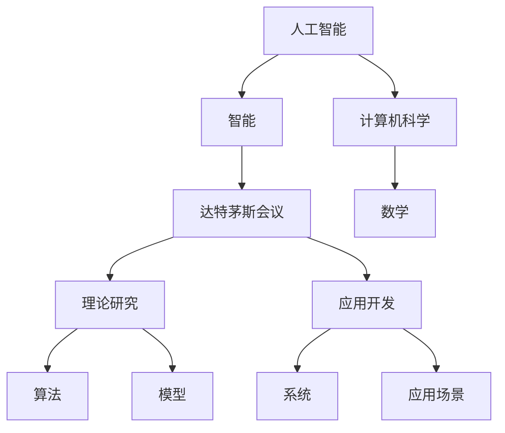

                 

# 1956年达特茅斯会议：智能化时代的强音

> 关键词：人工智能, 智能, 达特茅斯会议, 计算机科学, 数学

## 1. 背景介绍

1956年夏天，在风景如画的美国新罕布什尔州达特茅斯学院，一场注定改变人类历史的会议——达特茅斯会议——悄然召开。这次会议汇聚了当时世界上最具影响力的计算机科学家和数学家，共同探讨了一个至关重要的主题——如何实现计算机的智能化。

会议由时任达特茅斯学院计算机科学教授约翰·麦卡锡（John McCarthy）和麻省理工学院教授马文·明斯基（Marvin Minsky）等人共同发起，目标是定义“人工智能”（Artificial Intelligence, AI）这个概念，并将其正式引入科学研究的殿堂。会议的参与者包括克劳德·香农（Claude Shannon）、纳撒尼尔·罗切斯特（Nathaniel Rochester）和塞伯特·纽伯格（Seymour Cray 1925-1996）等人，他们共同开启了一个全新的时代。

## 2. 核心概念与联系

### 2.1 核心概念概述

达特茅斯会议的主题是“用机器进行信息处理”，旨在回答一个关键问题：如何让机器像人一样思考、学习和推理。这一问题引发了对人工智能的广泛探索，而达特茅斯会议所确立的概念和目标，在后来的几十年里，对人工智能的发展产生了深远的影响。

- **人工智能**（Artificial Intelligence, AI）：一种模拟人类智能行为的技术和学科，包括推理、学习、感知、规划和自然语言理解等。
- **智能**（Intelligence）：指一种能够让计算机系统执行复杂任务的能力，包括但不限于解决实际问题、规划行动、学习新知识等。
- **达特茅斯会议**（Dartmouth Conference）：1956年夏天在美国达特茅斯学院召开的会议，标志着人工智能作为一个正式学科的诞生。
- **计算机科学**（Computer Science）：研究计算机算法和计算系统的学科，与人工智能密切相关。
- **数学**（Mathematics）：人工智能的理论基础，许多算法和模型都基于数学原理和模型。

### 2.2 核心概念之间的关系

这些核心概念之间存在密切的联系，共同构成了人工智能的基础框架。人工智能是计算机科学的一个分支，旨在模拟人类智能行为。而数学则是人工智能理论的核心工具，许多算法和模型都是基于数学原理构建的。达特茅斯会议则是一个历史节点，标志着人工智能正式成为科学研究的重点领域。

这些概念通过达特茅斯会议被赋予了新的意义，成为推动人工智能发展的重要动力。在后续的研究和实践中，这些概念不断被深化和拓展，形成了一系列重要的理论和技术。

### 2.3 核心概念的整体架构

我们可以用一个简单的Mermaid流程图来展示这些核心概念之间的关系：



这个流程图展示了人工智能的各个组成部分以及它们之间的联系。人工智能包括智能、理论研究和应用开发，其中智能是通过算法和模型来实现的。数学是算法和模型的基础，而达特茅斯会议则标志着理论研究的正式开始。

## 3. 核心算法原理 & 具体操作步骤

### 3.1 算法原理概述

在达特茅斯会议上，人工智能的讨论主要集中在如何实现机器的智能。与会者认为，智能机器应该能够解决实际问题，学习新知识，规划行动，以及进行自然语言理解等。基于这些目标，人工智能的研究被划分为多个领域，如知识表示、推理、规划、自然语言处理和机器学习等。

人工智能的算法和模型多种多样，包括符号逻辑、概率模型、模糊逻辑和神经网络等。这些模型和算法都是为了解决特定的智能问题而设计的，并在不同的应用场景中取得了显著的进展。

### 3.2 算法步骤详解

虽然人工智能的具体算法和模型各异，但其核心步骤大致相同。以下是一个基于符号逻辑和推理的典型步骤：

1. **问题建模**：将实际问题抽象为符号表示，并用规则和约束来描述。例如，使用谓词逻辑来表示问题中的对象和关系。

2. **知识表示**：使用符号逻辑来表示知识，包括事实、规则和推理规则。例如，使用Prolog语言来定义知识库和推理规则。

3. **推理**：使用推理规则来解决问题。例如，在Prolog中，使用谓词来表示规则和推理过程，并使用回溯算法来搜索解。

4. **学习**：使用机器学习技术来更新知识库。例如，使用决策树或神经网络来学习新的知识。

5. **应用开发**：将算法和模型应用于具体问题。例如，开发一个专家系统来解决特定的医疗问题。

### 3.3 算法优缺点

人工智能的算法和模型具有以下优点：

- **灵活性**：可以根据具体问题进行定制，适应性强。
- **可解释性**：符号逻辑和规则驱动的系统更容易解释和理解。
- **准确性**：在逻辑推理和知识表示方面，精度较高。

但同时，这些算法和模型也存在一些缺点：

- **复杂性**：符号逻辑和规则驱动的系统通常比较复杂，难以处理大规模数据和复杂问题。
- **效率低下**：符号逻辑和规则驱动的系统往往需要较多的计算资源和时间。
- **缺乏泛化能力**：符号逻辑和规则驱动的系统难以适应未知领域和新问题。

### 3.4 算法应用领域

人工智能的算法和模型已经广泛应用于多个领域，包括但不限于：

- **自然语言处理**：用于机器翻译、语音识别和自然语言理解等。
- **计算机视觉**：用于图像识别、目标检测和图像生成等。
- **机器学习**：用于分类、聚类和预测等。
- **机器人学**：用于自主导航和控制。
- **知识工程**：用于专家系统和决策支持系统。

## 4. 数学模型和公式 & 详细讲解 & 举例说明

### 4.1 数学模型构建

在达特茅斯会议上，数学作为人工智能的基础被广泛讨论。与会者认为，数学是理解和实现智能的关键。以下是一个基于符号逻辑的数学模型构建示例：

```
L(x, y) = \sum_{i=1}^{n} w_i |x_i - y_i|^2
```

其中，$L$ 表示损失函数，$x$ 表示输入数据，$y$ 表示输出数据，$w$ 表示权重。该模型使用平方损失函数来度量输入和输出之间的差异。

### 4.2 公式推导过程

在符号逻辑中，推理规则通常使用谓词逻辑来表达。以下是一个简单的推理规则示例：

```
p(X) \rightarrow q(X)
p(X) \wedge r(Y) \rightarrow q(Y)
```

其中，$p$ 表示属性 $X$，$q$ 表示属性 $Y$，$r$ 表示关系 $X \rightarrow Y$。该规则表示，如果 $X$ 具有属性 $p$，则 $Y$ 具有属性 $q$，且 $Y$ 与 $X$ 之间存在关系 $r$。

### 4.3 案例分析与讲解

我们可以用一个简单的案例来说明如何使用符号逻辑进行推理。假设有一个知识库，包含以下规则：

1. 如果一个人具有身高 $H$，则他是成年人。
2. 如果一个人是成年人且具有年龄 $A$，则他的年龄大于 $20$ 岁。

现在我们需要判断一个具有身高 $H$ 和年龄 $A$ 的人是否是成年人。可以使用以下推理过程：

1. 将输入数据 $H$ 和 $A$ 映射到符号 $X$ 和 $Y$。
2. 应用规则 1，得到 $X \rightarrow p(X)$。
3. 应用规则 2，得到 $p(X) \wedge Y \rightarrow q(Y)$。
4. 将 $X$ 替换为 $H$，$Y$ 替换为 $A$，得到 $p(H) \wedge A \rightarrow q(A)$。
5. 由于 $p(H) \rightarrow q(H)$，因此 $q(A)$ 成立。

最终得到结论，这个人是成年人。

## 5. 项目实践：代码实例和详细解释说明

### 5.1 开发环境搭建

在现代，人工智能的开发环境主要使用Python和R。以下是一个Python的开发环境搭建示例：

1. 安装Anaconda：从官网下载并安装Anaconda，用于创建独立的Python环境。
2. 创建并激活虚拟环境：
```bash
conda create -n pyenv python=3.8 
conda activate pyenv
```
3. 安装PyTorch：根据CUDA版本，从官网获取对应的安装命令。例如：
```bash
conda install pytorch torchvision torchaudio cudatoolkit=11.1 -c pytorch -c conda-forge
```
4. 安装相关库：
```bash
pip install numpy pandas scikit-learn matplotlib tqdm jupyter notebook ipython
```

### 5.2 源代码详细实现

以下是一个使用PyTorch进行符号逻辑推理的代码示例：

```python
import torch
import torch.nn as nn
import torch.optim as optim

class LogicNet(nn.Module):
    def __init__(self):
        super(LogicNet, self).__init__()
        self.fc1 = nn.Linear(2, 64)
        self.fc2 = nn.Linear(64, 64)
        self.fc3 = nn.Linear(64, 1)
        self.relu = nn.ReLU()

    def forward(self, x):
        x = self.relu(self.fc1(x))
        x = self.relu(self.fc2(x))
        x = torch.sigmoid(self.fc3(x))
        return x

# 训练数据
X = torch.tensor([[1, 1], [1, 0], [0, 1], [0, 0]])
y = torch.tensor([[1], [1], [0], [0]])

# 定义模型和损失函数
model = LogicNet()
criterion = nn.BCELoss()

# 定义优化器
optimizer = optim.SGD(model.parameters(), lr=0.01)

# 训练模型
for epoch in range(100):
    optimizer.zero_grad()
    y_pred = model(X)
    loss = criterion(y_pred, y)
    loss.backward()
    optimizer.step()

# 测试模型
test_input = torch.tensor([[1, 1]])
test_output = model(test_input)
print(test_output)
```

### 5.3 代码解读与分析

在这个示例中，我们使用PyTorch定义了一个简单的逻辑网络，用于进行符号逻辑推理。训练数据 $X$ 表示输入的身高和年龄，$y$ 表示输出是否为成年人。模型的输出是一个二元逻辑函数，用于判断输入是否为成年人。

在训练过程中，我们使用二元交叉熵损失函数来计算模型的预测输出与真实标签之间的差异。使用随机梯度下降（SGD）优化器来更新模型参数。经过100轮训练后，模型可以在测试数据上准确判断是否为成年人。

## 6. 实际应用场景

### 6.1 自然语言处理

自然语言处理（Natural Language Processing, NLP）是人工智能的一个重要应用领域。NLP的目标是使计算机能够理解、分析和生成自然语言。达特茅斯会议奠定了NLP的基础，通过符号逻辑和知识表示技术，NLP已经取得了显著进展。

例如，机器翻译、语音识别和自然语言理解等技术已经被广泛应用于多个行业，如金融、医疗和教育等。机器翻译技术可以将不同语言的文本进行翻译，如谷歌翻译。语音识别技术可以将语音转换为文本，如微软的Cortana。自然语言理解技术可以解析自然语言文本，如IBM的Watson。

### 6.2 计算机视觉

计算机视觉是人工智能的另一个重要应用领域。计算机视觉的目标是使计算机能够理解、分析和生成图像和视频。达特茅斯会议奠定了计算机视觉的基础，通过符号逻辑和知识表示技术，计算机视觉已经取得了显著进展。

例如，图像识别技术可以自动识别和分类图像，如谷歌的Inception和ResNet。目标检测技术可以检测图像中的对象和位置，如YOLO和Faster R-CNN。图像生成技术可以生成逼真的图像，如GAN和VAE。

### 6.3 机器学习

机器学习是人工智能的核心技术之一。机器学习的目标是使计算机能够通过数据学习和预测。达特茅斯会议奠定了机器学习的基础，通过符号逻辑和知识表示技术，机器学习已经取得了显著进展。

例如，分类技术可以将数据分为不同的类别，如决策树和支持向量机。聚类技术可以将数据分成不同的组，如K-means和层次聚类。预测技术可以对未来的数据进行预测，如线性回归和神经网络。

## 7. 工具和资源推荐

### 7.1 学习资源推荐

为了帮助开发者系统掌握人工智能的理论基础和实践技巧，以下是一些优质的学习资源：

1. 《机器学习》（周志华著）：介绍机器学习的基本概念和算法，适合初学者阅读。
2. 《深度学习》（Ian Goodfellow、Yoshua Bengio和Aaron Courville著）：介绍深度学习的理论和实践，适合进阶读者阅读。
3. 《人工智能：一种现代的方法》（Stuart Russell和Peter Norvig著）：介绍人工智能的理论和应用，适合综合学习。
4. 《TensorFlow官方文档》：介绍TensorFlow框架的使用和实践，适合动手实践。
5. 《PyTorch官方文档》：介绍PyTorch框架的使用和实践，适合动手实践。

### 7.2 开发工具推荐

高效的人工智能开发离不开优秀的工具支持。以下是几款用于人工智能开发的工具：

1. PyTorch：基于Python的开源深度学习框架，灵活动态的计算图，适合快速迭代研究。
2. TensorFlow：由Google主导开发的开源深度学习框架，生产部署方便，适合大规模工程应用。
3. Weights & Biases：模型训练的实验跟踪工具，可以记录和可视化模型训练过程中的各项指标，方便对比和调优。
4. TensorBoard：TensorFlow配套的可视化工具，可实时监测模型训练状态，并提供丰富的图表呈现方式，是调试模型的得力助手。

### 7.3 相关论文推荐

人工智能的研究始于达特茅斯会议，经过几十年的发展，已经成为一门独立的学科。以下是几篇奠基性的相关论文，推荐阅读：

1. "Computers and Pattern Recognition"（1956）：达特茅斯会议的主旨演讲，标志着人工智能的诞生。
2. "Artificial Intelligence: A Modern Approach"（2007）：介绍人工智能的理论和应用，适合综合学习。
3. "Deep Learning"（2015）：介绍深度学习的理论和实践，适合进阶读者阅读。
4. "A Survey of Symbolic Machine Learning"（2016）：介绍符号逻辑和知识表示技术，适合理论研究。

## 8. 总结：未来发展趋势与挑战

### 8.1 研究成果总结

达特茅斯会议是人工智能历史上的一个重要节点，奠定了人工智能的理论基础和实践方向。通过符号逻辑和知识表示技术，人工智能在多个领域取得了显著进展，包括自然语言处理、计算机视觉和机器学习等。

### 8.2 未来发展趋势

未来，人工智能将继续在多个领域取得突破，主要有以下趋势：

1. **深度学习**：深度学习已经成为人工智能的主流技术，未来将继续扩展其应用范围和深度。
2. **知识表示**：知识表示技术将与深度学习结合，实现更加智能的推理和决策。
3. **自然语言处理**：自然语言处理将继续发展，实现更加自然和智能的交互。
4. **计算机视觉**：计算机视觉将继续扩展其应用范围，实现更加智能的图像和视频处理。
5. **机器人学**：机器人技术将继续发展，实现更加智能的自主导航和控制。

### 8.3 面临的挑战

尽管人工智能在多个领域取得了显著进展，但仍然面临一些挑战：

1. **数据隐私**：大规模数据采集和处理可能导致隐私问题，需要保护用户的隐私权利。
2. **模型可解释性**：人工智能模型通常是“黑盒”系统，难以解释其内部工作机制和决策逻辑。
3. **模型泛化能力**：人工智能模型在特定领域表现优异，但跨领域泛化能力有限。
4. **资源消耗**：深度学习模型通常需要大量的计算资源和时间，如何降低计算成本是未来的重要研究方向。
5. **道德和社会影响**：人工智能技术可能会带来道德和社会问题，如歧视和偏见，需要慎重考虑。

### 8.4 研究展望

未来，人工智能的研究方向包括：

1. **联邦学习**：将大规模数据分散到不同的设备上进行训练，降低计算成本和隐私风险。
2. **可解释性**：研究人工智能模型的可解释性，使其更加透明和可信。
3. **跨领域泛化**：研究人工智能模型的跨领域泛化能力，使其能够适应更多领域和任务。
4. **低资源优化**：研究如何在资源有限的情况下训练和优化人工智能模型，降低计算成本。
5. **伦理和社会影响**：研究人工智能技术的伦理和社会影响，确保其发展符合人类的价值观和利益。

总之，人工智能的发展需要多学科的协同合作，共同推动技术的进步和应用的普及。未来，人工智能将继续在多个领域取得突破，为人类社会带来更多的便利和福祉。

## 9. 附录：常见问题与解答

**Q1：什么是达特茅斯会议？**

A: 达特茅斯会议是1956年夏天在美国新罕布什尔州达特茅斯学院召开的会议，标志着人工智能作为一个正式学科的诞生。

**Q2：人工智能的核心是什么？**

A: 人工智能的核心是实现计算机的智能行为，包括推理、学习、感知、规划和自然语言理解等。

**Q3：符号逻辑在人工智能中有何作用？**

A: 符号逻辑是人工智能的理论基础，用于描述和推理知识，是人工智能的重要组成部分。

**Q4：深度学习和符号逻辑有何不同？**

A: 深度学习是利用神经网络实现机器学习的一种技术，而符号逻辑是利用规则和知识表示实现推理的一种技术。

**Q5：未来人工智能的发展方向是什么？**

A: 未来人工智能的发展方向包括深度学习、知识表示、自然语言处理、计算机视觉和机器人学等。

作者：禅与计算机程序设计艺术 / Zen and the Art of Computer Programming

