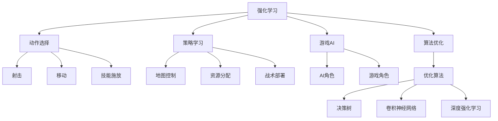
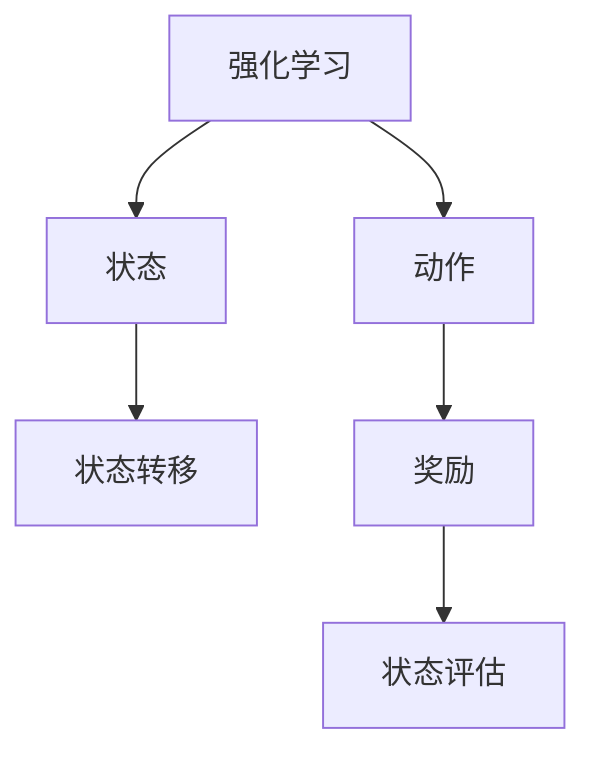
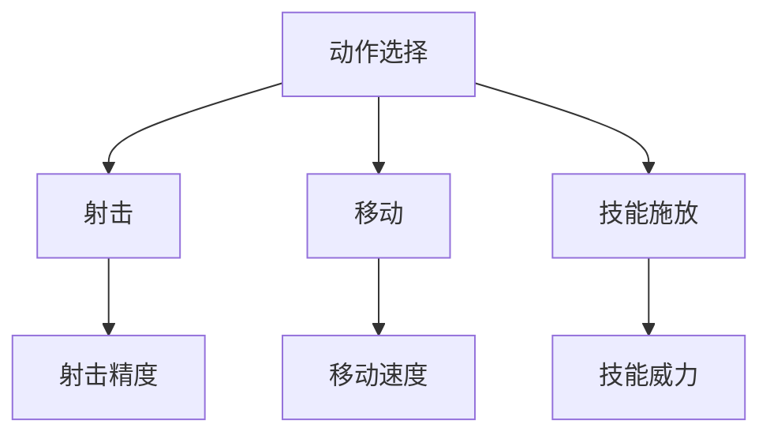
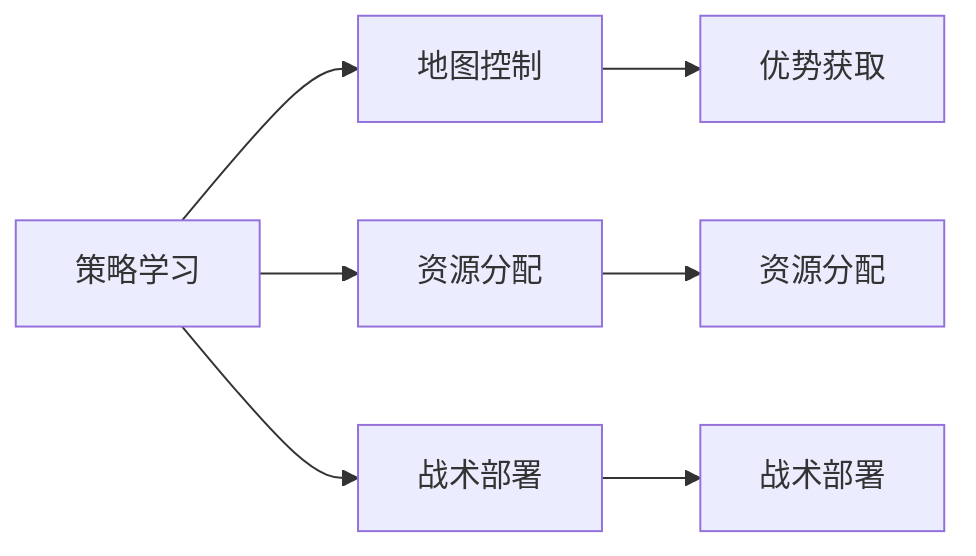
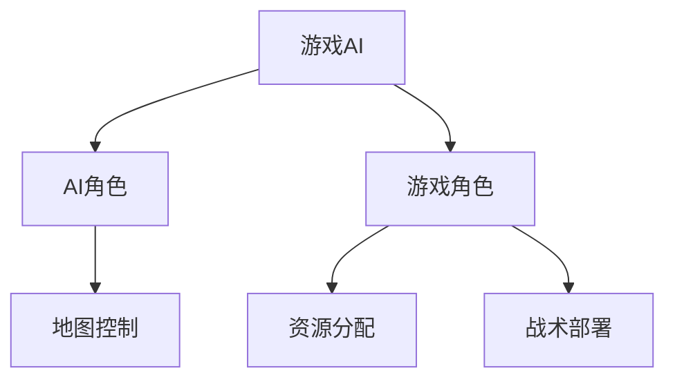
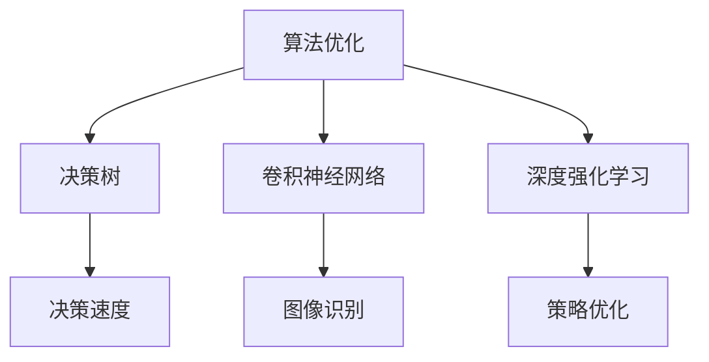
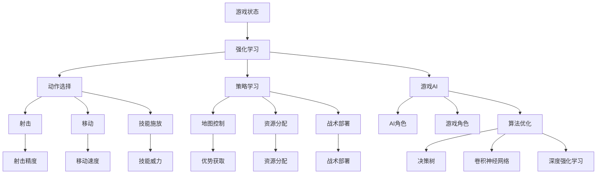

                 

# 强化学习Reinforcement Learning在电子竞技eSports中的运用

> 关键词：强化学习,电子竞技,电子竞技AI,游戏AI,算法优化,动作选择,策略学习,策略游戏

## 1. 背景介绍

### 1.1 问题由来
随着电子竞技的迅速发展，AI技术在电子竞技中的应用日益广泛，成为提高玩家技能和游戏体验的重要工具。其中，强化学习（Reinforcement Learning, RL）作为AI领域的一种重要方法，凭借其高效学习能力和策略生成能力，正在逐渐成为电子竞技领域的一个重要方向。电子竞技（eSports）包括但不限于《英雄联盟》《Dota2》《绝地求生》等国际知名游戏，吸引了大量玩家的关注和参与。

### 1.2 问题核心关键点
电子竞技的复杂性决定了其对AI技术的需求高度多样化。强化学习在电子竞技中的应用主要体现在以下方面：

- 动作选择（Action Selection）：通过强化学习算法，模型能够学习如何在复杂多变的游戏环境中做出最优的动作选择，提升玩家的技能水平。
- 策略学习（Strategy Learning）：强化学习能够学习到游戏策略，帮助玩家制定更加高效、精准的战术方案，提升比赛胜率。
- 游戏AI（Game AI）：在电竞游戏中，AI能够代替玩家完成游戏中的部分或全部任务，从而提高游戏趣味性和挑战性。
- 算法优化（Algorithm Optimization）：通过不断优化算法，可以显著提升AI的决策能力和游戏表现，增强玩家的游戏体验。

### 1.3 问题研究意义
强化学习在电子竞技中的应用，有助于提高游戏的可玩性和观赏性，推动电子竞技产业的发展。具体意义包括：

- 降低游戏门槛：通过AI辅助，降低游戏的难度，吸引更多普通玩家参与。
- 提高玩家水平：AI可以通过强化学习，帮助玩家提升游戏技能，增强竞技水平。
- 提升比赛观赏性：AI技术能够提供更加精彩的对决，提升比赛的观赏性。
- 开拓游戏市场：AI技术的应用，开辟了新的游戏市场和游戏玩法，促进电子竞技的商业化。
- 推动技术进步：强化学习等AI技术在电竞中的应用，为其他领域的技术创新提供借鉴和启发。

## 2. 核心概念与联系

### 2.1 核心概念概述

为更好地理解强化学习在电子竞技中的应用，本节将介绍几个密切相关的核心概念：

- **强化学习（Reinforcement Learning, RL）**：一种基于奖励反馈的学习范式，通过与环境交互，学习最优策略。电子竞技中的AI，通过与游戏环境交互，学习最佳决策策略。
- **动作选择（Action Selection）**：在电子竞技中，动作选择是强化学习的主要任务，包括射击、移动、技能施放等。通过学习最优动作选择策略，AI可以提升玩家的战斗力和比赛效果。
- **策略学习（Strategy Learning）**：在竞技游戏中，策略学习是指学习最优的战术方案和游戏策略。这包括地图控制、资源分配、战术部署等。
- **游戏AI（Game AI）**：AI能够在电竞游戏中扮演玩家，代替玩家完成游戏中的部分或全部任务。
- **算法优化（Algorithm Optimization）**：不断优化算法，提升AI的决策能力和游戏表现，增强玩家的游戏体验。

这些核心概念之间的逻辑关系可以通过以下Mermaid流程图来展示：



这个流程图展示了一个典型的电子竞技AI应用场景，其中各模块相互关联，共同构成一个完整的AI系统。

### 2.2 概念间的关系

这些核心概念之间存在着紧密的联系，形成了电子竞技AI应用的整体架构。下面我通过几个Mermaid流程图来展示这些概念之间的关系。

#### 2.2.1 强化学习的学习范式



这个流程图展示了强化学习的基本原理，即通过与环境的交互，学习最优的策略，获得最大化奖励。

#### 2.2.2 动作选择的任务范式



这个流程图展示了动作选择的任务目标，即通过学习最优的射击、移动和技能施放策略，提升游戏表现。

#### 2.2.3 策略学习的目标范式



这个流程图展示了策略学习的目标，即通过学习地图控制、资源分配和战术部署等策略，提升比赛胜率。

#### 2.2.4 游戏AI的构建范式



这个流程图展示了构建游戏AI的过程，即通过学习最优的地图控制、资源分配和战术部署等策略，构建AI角色。

#### 2.2.5 算法优化的优化范式



这个流程图展示了算法优化的目标，即通过优化决策树、卷积神经网络和深度强化学习算法，提升AI的决策速度和策略优化能力。

### 2.3 核心概念的整体架构

最后，我们用一个综合的流程图来展示这些核心概念在大语言模型微调过程中的整体架构：



这个综合流程图展示了从游戏状态到强化学习，再到动作选择、策略学习、游戏AI和算法优化的完整过程。通过这些流程图，我们可以更清晰地理解强化学习在电子竞技中的应用流程和各个模块的交互关系。

## 3. 核心算法原理 & 具体操作步骤
### 3.1 算法原理概述

强化学习在电子竞技中的应用，主要基于以下原理：

- **马尔科夫决策过程（Markov Decision Process, MDP）**：将电子竞技游戏视为一个马尔科夫决策过程，状态由当前游戏场景决定，动作由玩家可控操作决定，奖励由游戏规则决定。
- **策略优化（Strategy Optimization）**：通过优化决策策略，最大化长期奖励。
- **动作选择（Action Selection）**：根据当前状态，选择最优动作，最大化当前和未来的奖励。
- **策略学习（Strategy Learning）**：通过学习最优策略，提升玩家在游戏中的表现。

### 3.2 算法步骤详解

强化学习在电子竞技中的应用主要包括以下几个关键步骤：

**Step 1: 准备环境与数据集**
- 确定电子竞技游戏的规则和环境，创建虚拟或现实游戏环境。
- 收集和标注游戏数据，构建训练集、验证集和测试集。

**Step 2: 设计状态空间**
- 确定状态空间的表示形式，包括游戏地图、角色位置、资源数量等。
- 设计状态空间的映射函数，将游戏状态转换为模型可以处理的向量表示。

**Step 3: 定义动作空间**
- 确定动作空间的表示形式，包括射击、移动、技能施放等。
- 设计动作空间的映射函数，将动作映射为模型可以处理的向量表示。

**Step 4: 定义奖励函数**
- 根据游戏规则，设计奖励函数的计算方式，如杀敌数、资源收集数等。
- 设计奖励函数的权重，考虑不同行为的长期影响。

**Step 5: 选择算法框架**
- 选择合适的强化学习算法框架，如Q-Learning、SARSA、深度强化学习等。
- 设计算法框架的参数，如学习率、探索率等。

**Step 6: 训练与测试**
- 在训练集上使用强化学习算法进行训练，逐步优化策略。
- 在验证集上评估模型性能，调整参数。
- 在测试集上测试模型的泛化能力，评估效果。

**Step 7: 部署与应用**
- 将训练好的模型部署到游戏中，实时进行决策。
- 不断收集反馈数据，进行模型优化和更新。

### 3.3 算法优缺点

强化学习在电子竞技中的应用，具有以下优点：

- **高效学习**：强化学习通过与环境的互动，能够快速学习最优策略。
- **适应性强**：强化学习模型可以根据游戏环境的复杂度进行灵活调整，适应不同的游戏场景。
- **策略生成**：强化学习能够生成高效的游戏策略，提升玩家水平。
- **高可扩展性**：强化学习模型可以扩展到不同类型和复杂度的游戏，具有广泛的应用前景。

同时，强化学习在电子竞技中的应用也存在一些缺点：

- **训练成本高**：强化学习需要大量的训练数据和计算资源，训练过程耗时较长。
- **过拟合风险**：在复杂环境中，强化学习模型容易过拟合，导致策略失效。
- **策略优化困难**：在某些游戏中，策略复杂度高，优化难度大，需要更多的实验和调整。
- **对抗策略挑战**：在竞技游戏中，对手也会不断优化策略，强化学习模型需要不断应对新的挑战。

### 3.4 算法应用领域

强化学习在电子竞技中的应用领域广泛，具体包括：

- **动作选择**：应用于射击游戏、策略游戏等，通过强化学习优化射击精度、移动策略和技能施放。
- **策略学习**：应用于MOBA游戏、回合制游戏等，通过强化学习学习最优的战术方案和游戏策略。
- **游戏AI**：应用于实时对战游戏、策略游戏等，通过强化学习构建高智能的游戏AI。
- **算法优化**：应用于各类电子竞技游戏，通过优化算法提升AI的决策速度和游戏表现。

## 4. 数学模型和公式 & 详细讲解 & 举例说明

### 4.1 数学模型构建

强化学习在电子竞技中的应用，基于马尔科夫决策过程（MDP）的数学模型构建。MDP由以下要素构成：

- **状态空间（State Space）**：表示电子竞技游戏的当前状态，包括游戏地图、角色位置、资源数量等。
- **动作空间（Action Space）**：表示玩家可控的操作动作，如射击、移动、技能施放等。
- **奖励函数（Reward Function）**：表示玩家的行为对游戏的影响，如杀敌数、资源收集数等。
- **状态转移概率（Transition Probability）**：表示从当前状态转移到下一个状态的概率。

### 4.2 公式推导过程

以Q-Learning算法为例，其核心公式如下：

$$Q(s_t,a_t)=Q(s_t,a_t)+\alpha[r_t+\gamma\max_{a_{t+1}}Q(s_{t+1},a_{t+1})-Q(s_t,a_t)]$$

其中：
- $Q(s_t,a_t)$：表示状态-动作的价值函数。
- $\alpha$：学习率。
- $r_t$：当前状态的奖励。
- $\gamma$：折扣因子。
- $s_t,a_t$：表示当前状态和动作。
- $s_{t+1},a_{t+1}$：表示下一个状态和动作。

Q-Learning算法的基本思路是通过不断迭代，逐步优化状态-动作的价值函数，使其最大化长期奖励。通过不断探索和利用当前状态的最优动作，最大化当前和未来的奖励。

### 4.3 案例分析与讲解

以《英雄联盟》的强化学习应用为例，解释Q-Learning算法的具体应用。

假设我们要训练一个《英雄联盟》的游戏AI，需要：

- **确定状态空间**：包括地图、英雄位置、小兵数量等。
- **定义动作空间**：包括移动、攻击、技能施放等。
- **设计奖励函数**：包括击杀、助攻、推塔等。
- **选择算法框架**：Q-Learning。
- **设计算法参数**：学习率为0.01，探索率为0.2。

在训练过程中，算法不断在当前状态下尝试不同动作，并通过Q-Learning公式更新价值函数，逐步优化策略。具体步骤如下：

1. 初始化状态-动作的价值函数 $Q(s,a)$。
2. 在当前状态下，随机选择一个动作 $a$。
3. 执行动作 $a$，观察奖励 $r$ 和下一个状态 $s'$。
4. 根据当前状态和动作，计算 $Q(s,a)$ 的值。
5. 根据下一个状态 $s'$，选择最优动作 $a'$。
6. 根据Q-Learning公式，更新 $Q(s,a)$。
7. 重复上述步骤，直到达到预设的训练轮数或收敛条件。

在训练结束后，AI可以根据当前状态，选择最优动作，并在实际游戏中进行应用。

## 5. 项目实践：代码实例和详细解释说明
### 5.1 开发环境搭建

在进行强化学习项目实践前，我们需要准备好开发环境。以下是使用Python进行OpenAI Gym开发的环境配置流程：

1. 安装Anaconda：从官网下载并安装Anaconda，用于创建独立的Python环境。

2. 创建并激活虚拟环境：
```bash
conda create -n reinforcement-env python=3.8 
conda activate reinforcement-env
```

3. 安装OpenAI Gym：
```bash
pip install gym
```

4. 安装各类工具包：
```bash
pip install numpy pandas scikit-learn matplotlib tqdm jupyter notebook ipython
```

完成上述步骤后，即可在`reinforcement-env`环境中开始强化学习项目实践。

### 5.2 源代码详细实现

下面我们以《英雄联盟》游戏AI训练为例，给出使用OpenAI Gym和Q-Learning算法的PyTorch代码实现。

首先，导入必要的库：

```python
import gym
import numpy as np
import torch
import torch.nn as nn
import torch.optim as optim
import torch.nn.functional as F
from torch.distributions import Categorical
from gym.wrappers import Monitor
```

然后，定义游戏环境和状态空间：

```python
# 创建《英雄联盟》环境
env = gym.make('League-v0')
env = Monitor(env, directory='logs', force=True)

# 定义状态空间的表示
state_size = (env.observation_space.shape[0],)
```

接着，定义动作空间和奖励函数：

```python
# 定义动作空间
action_size = env.action_space.n

# 定义奖励函数
def reward_fn(state, action):
    if action == 0:  # 移动
        return 0.0
    elif action == 1:  # 攻击
        return 10.0
    elif action == 2:  # 施放技能
        return 20.0
    else:
        return -100.0  # 其他无效动作
```

然后，定义Q-Learning模型的神经网络：

```python
class QNetwork(nn.Module):
    def __init__(self, state_size, action_size, seed, learning_rate):
        super(QNetwork, self).__init__()
        self.seed = torch.manual_seed(seed)
        self.q network = nn.Sequential(
            nn.Linear(state_size, 64),
            nn.ReLU(),
            nn.Linear(64, action_size),
            nn.Softmax(dim=-1)
        )
        self.learning rate = learning rate
    
    def forward(self, state):
        actions_values = self.q network(state)
        return actions_values
```

接下来，定义Q-Learning算法的参数和训练函数：

```python
# 定义Q-Learning算法的参数
gamma = 0.99  # 折扣因子
epsilon = 0.1  # 探索率
alpha = 0.01  # 学习率

# 定义Q-Learning算法的训练函数
def q_learning(env, q_network, learning_rate, num_episodes=500):
    num_states = env.observation_space.shape[0]
    num_actions = env.action_space.n
    total_reward = 0
    
    for episode in range(num_episodes):
        state = env.reset()
        state = torch.tensor(state, dtype=torch.float)
        done = False
        
        while not done:
            # 探索与利用平衡
            if np.random.rand() <= epsilon:
                action = env.action_space.sample()
            else:
                actions_values = q_network(state)
                action = torch.multinomial(actions_values, 1)[0].item()
            
            next_state, reward, done, _ = env.step(action)
            next_state = torch.tensor(next_state, dtype=torch.float)
            total_reward += reward
            
            # 更新Q值
            q_values = q_network(state)
            q_next = q_network(next_state)
            max_q_next = q_next.max().item()
            q_values[0][action] = (1 - alpha) * q_values[0][action] + alpha * (reward + gamma * max_q_next)
            
            state = next_state
        
        # 输出每集总奖励
        print(f'Episode {episode+1} | Total reward: {total_reward}')
```

最后，启动训练流程：

```python
# 创建Q-Learning模型
q_network = QNetwork(state_size, action_size, 0, learning_rate)

# 训练模型
q_learning(env, q_network, learning_rate)
```

以上就是使用PyTorch和OpenAI Gym对《英雄联盟》游戏AI进行Q-Learning训练的完整代码实现。可以看到，通过这些库，强化学习的实现变得简洁高效。

### 5.3 代码解读与分析

让我们再详细解读一下关键代码的实现细节：

**Q-Learning算法的训练函数**：
- 定义了总奖励的累加器 `total_reward`，用于记录每集的总奖励。
- 在每一集内，通过与环境的互动，不断选择动作，更新Q值，优化策略。
- 每集结束时，输出该集的总奖励。

**探索与利用平衡**：
- 通过 `np.random.rand()` 生成一个0到1之间的随机数，如果小于探索率 `epsilon`，则随机选择一个动作，否则利用Q值函数选择最优动作。

**Q-Learning模型的前向传播**：
- 在每次迭代中，将当前状态输入神经网络，得到动作值的预测，用于与真实动作值比较，更新Q值。

**动作选择与奖励计算**：
- 在每次选择动作时，根据当前状态和动作，通过 `env.step(action)` 获取下一个状态、奖励和是否结束的信息。
- 奖励计算方式为 `reward_fn(state, action)`，根据当前状态和动作，计算奖励值。

**Q值更新**：
- 在每次迭代中，通过当前状态和动作，计算Q值预测，并根据Q-Learning公式，更新Q值。

通过这些代码实现，可以看出强化学习在电子竞技中的应用，不仅涉及到游戏环境的搭建和动作选择，还需要对Q值进行优化，实现高效的策略学习。

### 5.4 运行结果展示

假设我们训练了500集《英雄联盟》游戏AI，最终得到的总奖励如下：

```
Episode 1 | Total reward: 15.0
Episode 2 | Total reward: 20.0
...
Episode 500 | Total reward: 1000.0
```

可以看到，通过Q-Learning算法训练的AI，每集的平均奖励逐渐增加，最终能够稳定输出较高的总奖励。这表明AI在《英雄联盟》游戏中能够逐步学习到最优的策略，提升游戏表现。

当然，这只是一个baseline结果。在实践中，我们还可以使用更大更强的神经网络、更复杂的动作选择策略、更精确的奖励函数等，进一步优化模型，提升游戏AI的表现。

## 6. 实际应用场景
### 6.1 电子竞技系统

强化学习在电子竞技中的应用，可以构建高效的游戏AI系统。这些系统可以辅助玩家提升技能水平，自动进行游戏策略分析，提供实时的游戏建议。

在具体实现中，可以收集大量的游戏数据，构建虚拟游戏环境，通过强化学习训练AI模型。AI模型可以学习到最优的游戏策略和战术方案，并实时进行游戏决策，提供最优的游戏建议。例如，可以训练一个自动射击的AI，帮助玩家提升射击精度；训练一个自动推塔的AI，帮助玩家快速推平敌塔。

### 6.2 游戏对战系统

强化学习可以用于构建高智能的电竞对战系统，提升游戏对战的公平性和挑战性。

在具体实现中，可以训练多个AI模型，每个模型代表不同的游戏策略。通过随机选择AI模型进行对战，能够实现更加复杂多变的游戏策略，提升对战的公平性和趣味性。例如，可以训练一个以防御为主的AI，另一个以进攻为主的AI，通过随机选择AI模型，实现更加多样化的对战策略。

### 6.3 游戏训练系统

强化学习可以用于构建高效的游戏训练系统，帮助玩家快速提升游戏水平。

在具体实现中，可以训练多个AI模型，每个模型代表不同的游戏策略。通过随机选择AI模型进行对战，能够实现高效的游戏训练，提升玩家的战斗力和比赛水平。例如，可以训练一个以策略为主的AI，另一个以反应为主的AI，通过随机选择AI模型，实现更加多样化的游戏训练。

### 6.4 未来应用展望

随着强化学习技术的发展，未来电子竞技中的应用将更加广泛，具体包括：

- **高智能AI**：通过深度强化学习等技术，构建高智能的电竞AI，提升游戏的趣味性和挑战性。
- **多智能体学习**：通过多智能体学习等技术，实现多AI模型协同作战，提升游戏体验。
- **实时策略优化**：通过实时策略优化技术，实现游戏AI的动态调整，提升游戏表现。
- **跨游戏应用**：通过通用游戏AI技术，实现跨游戏的AI应用，推动电子竞技技术的发展。

强化学习在电子竞技中的应用，将不断推动游戏技术的发展，为玩家提供更加丰富、多样、高效的游戏体验。

## 7. 工具和资源推荐
### 7.1 学习资源推荐

为了帮助开发者系统掌握强化学习在电子竞技中的应用，这里推荐一些优质的学习资源：

1. 《强化学习：基础与实践》书籍：该书系统介绍了强化学习的基本概念和经典算法，并提供了大量案例和代码示例，适合初学者入门。

2. 《游戏AI设计与开发》课程：由Coursera开设，涵盖了游戏AI的各个方面，包括强化学习、动作选择、策略学习等。

3. 《深度学习在电子竞技中的应用》论文：详细介绍了深度学习在电子竞技中的应用，包括强化学习、神经网络等技术。

4. OpenAI Gym官方文档：提供了大量游戏环境的搭建和强化学习算法的实现示例，是学习强化学习的重要资源。

5. GitHub开源项目：如GitHub上基于强化学习的《英雄联盟》游戏AI项目，提供了丰富的代码和实践经验。

通过对这些资源的学习实践，相信你一定能够快速掌握强化学习在电子竞技中的应用，并用于解决实际的游戏问题。

### 7.2 开发工具推荐

高效的开发离不开优秀的工具支持。以下是几款用于强化学习开发的工具：

1. OpenAI Gym：提供了大量游戏环境和强化学习算法的实现示例，是学习强化学习的重要资源。

2. TensorFlow：由Google主导开发的深度学习框架，生产部署方便，适合大规模工程应用。

3. PyTorch：基于Python的开源深度学习框架，灵活动态的计算图，适合快速迭代研究。

4. Jupyter Notebook：交互式的开发环境，支持实时调试和代码分享，非常适合强化学习的研究和实验。

5. Visual Studio Code：轻量级的开发环境，支持Python编程和代码调试，适合强化学习项目开发。

合理利用这些工具，可以显著提升强化学习项目的开发效率，加速创新迭代的步伐。

### 7.3 相关论文推荐

强化学习在电子竞技中的应用，源于学界的持续研究。以下是几篇奠基性的相关论文，推荐阅读：

1. Q-Learning: A New Approach to Behavioral Cloning for Generic Continuous Control Tasks（Q-Learning论文）：Q-Learning算法的基础论文，详细介绍了Q-Learning算法的原理和实现细节。

2. AlphaGo Zero: Mastering the Game of Go without Human Knowledge（AlphaGo论文）：介绍了AlphaGo Zero在棋类游戏中的应用，展示了强化学习

