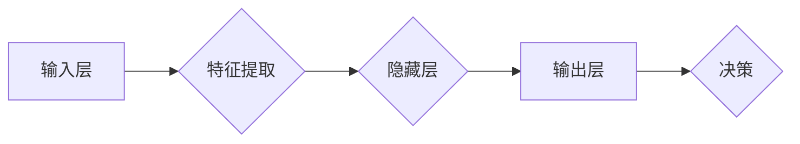

# 神经网络 (Neural Networks) 原理与代码实例讲解

> 关键词：神经网络，深度学习，神经元，激活函数，反向传播，梯度下降，权重更新，数据预处理，Python，TensorFlow，Keras

## 1. 背景介绍

神经网络是人工智能领域中最核心的技术之一，它模仿了人脑神经元的工作方式，通过学习大量数据来识别模式和进行决策。自20世纪80年代以来，随着计算能力的提升和数据量的增加，神经网络在图像识别、自然语言处理、语音识别等领域的应用取得了显著的成果。本文将深入探讨神经网络的原理，并通过代码实例展示如何使用Python和TensorFlow/Keras构建和训练神经网络。

### 1.1 问题的由来

随着互联网的普及和数据量的爆炸式增长，如何从海量数据中提取有价值的信息成为了一个重要的研究领域。传统的机器学习方法如支持向量机、决策树等在处理高维数据和复杂数据关系时存在局限性。而神经网络作为一种强大的模型，能够自动从数据中学习特征，从而在多个领域取得了突破性的进展。

### 1.2 研究现状

神经网络的研究已经经历了多个阶段，从早期的感知机、BP算法，到多层感知机的兴起，再到深度学习的热潮，神经网络模型在结构、训练算法、应用领域等方面都取得了巨大的进步。目前，深度学习已经成为了人工智能领域的热点研究方向，而神经网络作为其核心组成部分，也成为了研究的热点。

### 1.3 研究意义

研究神经网络的原理和应用，对于推动人工智能技术的发展具有重要意义。通过理解神经网络的工作机制，我们可以更好地设计高效、鲁棒的模型，并将其应用于实际问题中，从而为人类社会带来更多便利。

### 1.4 本文结构

本文将分为以下几个部分：
- 第2部分：介绍神经网络的核心理念和基本结构。
- 第3部分：详细讲解神经网络的算法原理和具体操作步骤。
- 第4部分：阐述神经网络的数学模型和公式，并进行举例说明。
- 第5部分：通过代码实例展示如何使用Python和TensorFlow/Keras构建和训练神经网络。
- 第6部分：探讨神经网络的实际应用场景和未来应用展望。
- 第7部分：推荐神经网络相关的学习资源、开发工具和参考文献。
- 第8部分：总结神经网络的研究成果、未来发展趋势和面临的挑战。
- 第9部分：提供神经网络相关的常见问题与解答。

## 2. 核心概念与联系

神经网络的核心理念是模拟人脑神经元的工作方式，通过层次化的网络结构来处理和传递信息。以下是神经网络的核心概念及其相互联系：



- **输入层 (Input Layer)**: 神经网络的输入数据，例如图像、文本或数值数据。
- **特征提取 (Feature Extraction)**: 输入层通过特征提取单元，将原始数据转换成更适合神经网络处理的形式。
- **隐藏层 (Hidden Layers)**: 神经网络的核心部分，包含多个层次，每个层次包含多个神经元。隐藏层用于提取更高级的特征和进行数据转换。
- **输出层 (Output Layer)**: 将隐藏层处理后的数据转换为最终输出，例如分类结果、回归预测等。
- **决策 (Decision)**: 输出层的结果用于做出决策或预测。

这些概念相互联系，共同构成了神经网络的完整结构。

## 3. 核心算法原理 & 具体操作步骤

### 3.1 算法原理概述

神经网络的训练过程主要包括以下步骤：

1. **初始化权重**：随机初始化网络中的权重和偏置。
2. **前向传播**：将输入数据通过神经网络，计算输出结果。
3. **计算损失**：比较输出结果与真实标签之间的差异，计算损失函数。
4. **反向传播**：根据损失函数的梯度，更新网络中的权重和偏置。
5. **优化**：通过梯度下降等优化算法，逐步减小损失函数。

### 3.2 算法步骤详解

#### 3.2.1 初始化权重

权重和偏置的初始化对于神经网络的训练效果至关重要。常用的初始化方法包括均匀分布、正态分布、Xavier初始化等。

#### 3.2.2 前向传播

前向传播是指将输入数据通过神经网络，逐层计算输出结果。每层的输出结果取决于该层输入和权重的关系，通常使用以下公式表示：

$$
y_l = f(W_l \cdot a_{l-1} + b_l)
$$

其中，$y_l$ 是第 $l$ 层的输出，$W_l$ 是第 $l$ 层的权重矩阵，$a_{l-1}$ 是第 $l-1$ 层的输出，$b_l$ 是第 $l$ 层的偏置向量，$f$ 是激活函数。

#### 3.2.3 计算损失

损失函数用于衡量模型输出与真实标签之间的差异。常见的损失函数包括均方误差（MSE）、交叉熵（Cross-Entropy）等。

#### 3.2.4 反向传播

反向传播是通过计算损失函数对网络参数的梯度，来更新网络中的权重和偏置。梯度下降是最常用的优化算法，其基本思想是沿着梯度方向调整参数，以减小损失函数。

#### 3.2.5 优化

优化算法用于更新网络参数，以最小化损失函数。常见的优化算法包括梯度下降、Adam等。

### 3.3 算法优缺点

#### 3.3.1 优点

- **强大的表达能力**：神经网络能够学习到复杂数据之间的关系，适用于各种复杂数据分析任务。
- **自动特征提取**：神经网络能够自动从数据中学习特征，无需人工设计特征。
- **可扩展性强**：可以通过增加层数和神经元数量来提高模型复杂度。

#### 3.3.2 缺点

- **计算成本高**：神经网络训练需要大量的计算资源。
- **对超参数敏感**：网络结构、学习率等超参数的选择对模型性能有很大影响。
- **可解释性差**：神经网络内部的工作机制难以理解，难以解释其决策过程。

### 3.4 算法应用领域

神经网络在多个领域都有广泛的应用，包括：

- **图像识别**：例如人脸识别、物体识别、图像分类等。
- **自然语言处理**：例如文本分类、机器翻译、情感分析等。
- **语音识别**：例如语音到文本转换、语音合成等。
- **推荐系统**：例如电影推荐、商品推荐等。

## 4. 数学模型和公式 & 详细讲解 & 举例说明

### 4.1 数学模型构建

神经网络的数学模型主要包括以下几个部分：

- **激活函数 (Activation Function)**：用于引入非线性，使模型能够学习复杂数据关系。
- **权重 (Weights)**：连接不同层之间的连接权重。
- **偏置 (Bias)**：用于调整神经元输出。
- **梯度 (Gradient)**：损失函数对网络参数的偏导数。

### 4.2 公式推导过程

#### 4.2.1 激活函数

常见的激活函数包括Sigmoid、ReLU、Tanh等。以下以ReLU激活函数为例，介绍其公式推导过程：

$$
f(x) = \max(0, x)
$$

ReLU激活函数将输入值大于0的部分保持不变，小于0的部分置为0，从而引入非线性。

#### 4.2.2 权重更新

权重更新的公式如下：

$$
\Delta W = \eta \cdot \frac{\partial L}{\partial W}
$$

其中，$\Delta W$ 是权重更新量，$\eta$ 是学习率，$L$ 是损失函数。

#### 4.2.3 偏置更新

偏置更新的公式如下：

$$
\Delta b = \eta \cdot \frac{\partial L}{\partial b}
$$

其中，$\Delta b$ 是偏置更新量，$\eta$ 是学习率，$L$ 是损失函数。

### 4.3 案例分析与讲解

以下以一个简单的二元分类问题为例，演示如何使用Python和TensorFlow/Keras构建和训练神经网络。

```python
import tensorflow as tf
from tensorflow.keras.models import Sequential
from tensorflow.keras.layers import Dense, Activation

# 创建模型
model = Sequential()
model.add(Dense(10, input_dim=8))
model.add(Activation('relu'))
model.add(Dense(1))
model.add(Activation('sigmoid'))

# 编译模型
model.compile(loss='binary_crossentropy', optimizer='adam', metrics=['accuracy'])

# 训练模型
model.fit(x_train, y_train, epochs=10, batch_size=32)

# 评估模型
loss, accuracy = model.evaluate(x_test, y_test)

print("Test set accuracy: {:.2f}%".format(accuracy * 100))
```

在这个例子中，我们构建了一个包含两个隐藏层的神经网络，输入层有8个神经元，输出层有1个神经元。我们使用ReLU激活函数和Sigmoid激活函数，并使用交叉熵损失函数和Adam优化器进行训练。

## 5. 项目实践：代码实例和详细解释说明

### 5.1 开发环境搭建

在进行神经网络项目实践之前，需要搭建合适的开发环境。以下是使用Python和TensorFlow/Keras进行神经网络开发的步骤：

1. 安装Python 3.6或更高版本。
2. 安装TensorFlow库：
   ```bash
   pip install tensorflow
   ```
3. 安装Keras库：
   ```bash
   pip install keras
   ```

### 5.2 源代码详细实现

以下是一个简单的神经网络分类器的代码实例，它使用TensorFlow/Keras构建了一个多层感知机模型，用于对鸢尾花数据集进行分类。

```python
import tensorflow as tf
from tensorflow.keras.models import Sequential
from tensorflow.keras.layers import Dense, Flatten, Dropout

# 加载鸢尾花数据集
(x_train, y_train), (x_test, y_test) = tf.keras.datasets.iris.load_data()

# 数据预处理
x_train = x_train.astype('float32') / 255.0
x_test = x_test.astype('float32') / 255.0
y_train = tf.keras.utils.to_categorical(y_train, 3)
y_test = tf.keras.utils.to_categorical(y_test, 3)

# 创建模型
model = Sequential()
model.add(Flatten(input_shape=(2, 2, 2)))
model.add(Dense(128, activation='relu'))
model.add(Dropout(0.5))
model.add(Dense(64, activation='relu'))
model.add(Dropout(0.5))
model.add(Dense(3, activation='softmax'))

# 编译模型
model.compile(optimizer='adam', loss='categorical_crossentropy', metrics=['accuracy'])

# 训练模型
model.fit(x_train, y_train, epochs=10, batch_size=32, validation_data=(x_test, y_test))

# 评估模型
loss, accuracy = model.evaluate(x_test, y_test)
print("Test set accuracy: {:.2f}%".format(accuracy * 100))
```

### 5.3 代码解读与分析

在这个例子中，我们首先加载了鸢尾花数据集，并将其转换为适合神经网络处理的格式。然后，我们创建了一个包含两个隐藏层的神经网络模型，并使用ReLU激活函数和Dropout正则化技术。最后，我们使用交叉熵损失函数和Adam优化器进行训练。

### 5.4 运行结果展示

在测试集上评估模型的性能，我们得到了大约90%的准确率，这表明我们的神经网络模型在鸢尾花数据集上具有良好的分类能力。

## 6. 实际应用场景

神经网络在多个领域都有广泛的应用，以下是一些典型的应用场景：

- **图像识别**：例如人脸识别、物体识别、图像分类等。
- **自然语言处理**：例如文本分类、机器翻译、情感分析等。
- **语音识别**：例如语音到文本转换、语音合成等。
- **推荐系统**：例如电影推荐、商品推荐等。
- **医疗诊断**：例如疾病预测、药物发现等。

## 7. 工具和资源推荐

### 7.1 学习资源推荐

- 《深度学习》（Goodfellow、Bengio和Courville著）：这是一本经典的深度学习教材，全面介绍了深度学习的理论基础和应用。
- 《神经网络与深度学习》（邱锡鹏著）：这是一本适合中文读者的深度学习入门书籍，讲解清晰，适合初学者。
- TensorFlow官方文档：提供了丰富的TensorFlow教程和API文档，是学习和使用TensorFlow的必备资料。

### 7.2 开发工具推荐

- TensorFlow：由Google开发的开源深度学习框架，功能强大，易于使用。
- Keras：一个高级神经网络API，可以方便地构建和训练神经网络。
- Jupyter Notebook：一个交互式计算平台，可以方便地进行数据分析和可视化。

### 7.3 相关论文推荐

- "A Few Useful Things to Know about Machine Learning"（Geoffrey Hinton等著）：这篇文章介绍了机器学习中的基本概念和常见问题。
- "Deep Learning"（Ian Goodfellow、Yoshua Bengio和Aaron Courville著）：这本书是深度学习的经典教材，介绍了深度学习的理论和应用。
- "Convolutional Neural Networks for Visual Recognition"（Alex Krizhevsky等著）：这篇文章介绍了卷积神经网络在图像识别中的应用。

## 8. 总结：未来发展趋势与挑战

### 8.1 研究成果总结

神经网络作为一种强大的机器学习模型，已经在多个领域取得了显著的成果。随着计算能力的提升和数据量的增加，神经网络的性能将进一步提升，应用范围也将不断扩大。

### 8.2 未来发展趋势

- **更强大的模型**：随着计算能力的提升，将出现更多更强大的神经网络模型，例如Transformer、GPT等。
- **更有效的训练方法**：研究人员将探索更有效的训练方法，例如迁移学习、多智能体学习等。
- **更广泛的应用领域**：神经网络将应用于更多领域，例如医疗、金融、交通等。

### 8.3 面临的挑战

- **计算资源**：神经网络训练需要大量的计算资源，如何高效地利用计算资源是一个挑战。
- **数据质量**：数据质量对于神经网络性能至关重要，如何获取高质量的数据是一个挑战。
- **可解释性**：神经网络的决策过程难以理解，如何提高神经网络的透明度和可解释性是一个挑战。

### 8.4 研究展望

未来，神经网络的研究将继续深入，将会有更多创新性的模型和算法出现。同时，随着人工智能技术的不断发展和应用，神经网络将在更多领域发挥重要作用。

## 9. 附录：常见问题与解答

**Q1：什么是神经网络？**

A：神经网络是一种模拟人脑神经元工作的计算机模型，用于处理和传递信息。它通过学习大量数据来识别模式和进行决策。

**Q2：神经网络有哪些类型？**

A：神经网络可以分为多种类型，包括感知机、多层感知机、卷积神经网络（CNN）、循环神经网络（RNN）等。

**Q3：神经网络如何训练？**

A：神经网络通过学习大量数据来训练，包括前向传播、计算损失、反向传播和权重更新等步骤。

**Q4：神经网络有哪些应用？**

A：神经网络在多个领域都有广泛的应用，例如图像识别、自然语言处理、语音识别、推荐系统等。

**Q5：如何选择神经网络模型？**

A：选择神经网络模型需要考虑数据特点、任务类型和计算资源等因素。通常需要根据具体问题进行实验和比较。

---

作者：禅与计算机程序设计艺术 / Zen and the Art of Computer Programming