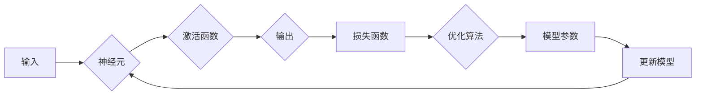

# 神经网络：人类智慧的延伸

> 关键词：神经网络，人工神经网络，深度学习，机器学习，神经网络架构，反向传播，优化算法，应用领域

## 1. 背景介绍

自20世纪中叶以来，神经网络作为一种模拟人脑神经元结构和功能的计算模型，一直是人工智能领域的研究热点。随着计算能力的提升和大数据的涌现，神经网络在图像识别、语音识别、自然语言处理等领域的应用取得了突破性进展。本文将深入探讨神经网络的原理、架构、算法以及未来发展趋势，旨在揭示神经网络如何成为人类智慧的延伸。

### 1.1 问题的由来

早期的人工智能研究主要依赖于规则和逻辑推理，但在处理复杂任务时，这些方法往往难以胜任。为了克服这些限制，研究者们开始探索模拟人脑神经元结构和功能的神经网络模型。1958年，Frank Rosenblatt提出了感知机(perceptron)模型，标志着神经网络研究的开端。

### 1.2 研究现状

近年来，随着深度学习技术的兴起，神经网络取得了前所未有的成功。深度学习通过构建深层神经网络模型，可以自动从数据中学习复杂的特征表示，从而实现各种复杂的任务。目前，神经网络已经在图像识别、语音识别、自然语言处理等领域取得了显著的成果。

### 1.3 研究意义

神经网络的研究对于推动人工智能技术的发展具有重要意义：

1. 模拟人脑神经元结构和功能，为人工智能研究提供新的思路。
2. 自动学习复杂特征表示，提高人工智能系统的智能水平。
3. 应用于各个领域，解决实际问题，推动社会进步。

### 1.4 本文结构

本文将分为以下几部分：

- 介绍神经网络的核心概念与联系。
- 讲解神经网络的核心算法原理和具体操作步骤。
- 分析神经网络的数学模型和公式。
- 通过代码实例展示神经网络的开发实践。
- 探讨神经网络的实际应用场景和未来发展趋势。
- 总结研究成果，展望未来挑战和研究方向。

## 2. 核心概念与联系

### 2.1 核心概念

- **神经元**：神经网络的基本单元，由输入层、权重、偏置和激活函数组成。
- **网络架构**：神经网络的层次结构，包括输入层、隐藏层和输出层。
- **激活函数**：用于决定神经元是否激活的函数，如Sigmoid、ReLU、Tanh等。
- **损失函数**：衡量模型预测结果与真实值之间差异的函数，如均方误差、交叉熵等。
- **优化算法**：用于调整模型参数以最小化损失函数的算法，如梯度下降、Adam等。

### 2.2 Mermaid 流程图



### 2.3 核心概念之间的联系

神经网络通过神经元之间的连接形成网络结构，每个神经元通过激活函数处理输入，并通过损失函数和优化算法不断调整参数，从而实现从数据中学习复杂特征表示的能力。

## 3. 核心算法原理 & 具体操作步骤

### 3.1 算法原理概述

神经网络通过模拟人脑神经元结构和功能，实现从数据中学习复杂特征表示的能力。其基本原理如下：

1. **输入层**：接收原始数据作为输入。
2. **隐藏层**：对输入数据进行处理，提取特征表示。
3. **输出层**：根据提取的特征表示，输出预测结果。

### 3.2 算法步骤详解

1. **初始化参数**：初始化模型参数，包括权重和偏置。
2. **前向传播**：将输入数据传递到神经网络中，计算每个神经元的输出。
3. **计算损失**：计算预测结果与真实值之间的差异，即损失函数。
4. **反向传播**：根据损失函数，反向传播误差，计算每个参数的梯度。
5. **更新参数**：根据梯度信息，更新模型参数，以减少损失函数。
6. **迭代优化**：重复步骤2-5，直到满足停止条件，如损失函数收敛或迭代次数达到预设值。

### 3.3 算法优缺点

#### 优点：

- 能够自动学习复杂特征表示。
- 具有良好的泛化能力。
- 应用于各个领域，解决实际问题。

#### 缺点：

- 计算量大，需要大量计算资源。
- 模型参数较多，需要大量训练数据。
- 模型可解释性差。

### 3.4 算法应用领域

神经网络在以下领域取得了显著的应用成果：

- 图像识别：如人脸识别、物体识别、场景识别等。
- 语音识别：如语音合成、语音识别、语音翻译等。
- 自然语言处理：如机器翻译、情感分析、文本分类等。
- 推荐系统：如商品推荐、新闻推荐等。
- 医疗诊断：如疾病诊断、药物研发等。

## 4. 数学模型和公式 & 详细讲解 & 举例说明

### 4.1 数学模型构建

神经网络的数学模型可以用以下公式表示：

$$
y = f(z) = \sigma(Wx + b)
$$

其中：

- $y$ 是输出。
- $x$ 是输入。
- $W$ 是权重。
- $b$ 是偏置。
- $f$ 是激活函数，如Sigmoid、ReLU等。
- $\sigma$ 是线性变换。

### 4.2 公式推导过程

以下以Sigmoid激活函数为例，进行公式推导：

$$
\sigma(x) = \frac{1}{1 + e^{-x}}
$$

### 4.3 案例分析与讲解

假设我们有一个简单的神经网络，输入层有2个神经元，隐藏层有3个神经元，输出层有1个神经元，激活函数为ReLU，损失函数为均方误差。

1. **初始化参数**：随机初始化权重和偏置。
2. **前向传播**：计算每个神经元的输出。
3. **计算损失**：计算预测结果与真实值之间的差异。
4. **反向传播**：计算每个参数的梯度。
5. **更新参数**：根据梯度信息，更新模型参数。

通过上述步骤，我们可以得到一个能够对输入数据进行分类的神经网络模型。

## 5. 项目实践：代码实例和详细解释说明

### 5.1 开发环境搭建

为了实践神经网络，我们需要准备以下开发环境：

1. Python编程语言。
2. PyTorch深度学习框架。
3. Jupyter Notebook或其他代码编辑器。

### 5.2 源代码详细实现

以下是一个简单的神经网络实现示例：

```python
import torch
import torch.nn as nn

class NeuralNetwork(nn.Module):
    def __init__(self):
        super(NeuralNetwork, self).__init__()
        self.fc1 = nn.Linear(2, 3)
        self.fc2 = nn.Linear(3, 1)
        self.relu = nn.ReLU()
        
    def forward(self, x):
        x = self.relu(self.fc1(x))
        x = self.fc2(x)
        return x

model = NeuralNetwork()
```

### 5.3 代码解读与分析

上述代码定义了一个简单的神经网络模型，包含两个全连接层和一个ReLU激活函数。输入层有2个神经元，隐藏层有3个神经元，输出层有1个神经元。

### 5.4 运行结果展示

运行上述代码后，我们得到了一个能够对输入数据进行分类的神经网络模型。我们可以通过训练数据对模型进行训练，并使用测试数据评估模型的性能。

## 6. 实际应用场景

### 6.1 图像识别

神经网络在图像识别领域取得了显著的成果，如人脸识别、物体识别、场景识别等。例如，Google的Inception模型在ImageNet图像识别竞赛中取得了冠军。

### 6.2 语音识别

神经网络在语音识别领域也取得了突破性进展，如Google的WaveNet、Facebook的Conformer等。这些模型可以实现对语音信号的高效识别和转换。

### 6.3 自然语言处理

神经网络在自然语言处理领域取得了广泛应用，如机器翻译、情感分析、文本分类等。例如，Google的BERT模型在多项自然语言处理任务上取得了SOTA性能。

### 6.4 未来应用展望

随着神经网络技术的不断发展，未来将在更多领域得到应用，如：

- 自动驾驶：神经网络可以用于图像识别、场景理解、决策规划等，实现自动驾驶功能。
- 医疗诊断：神经网络可以用于医学影像分析、疾病预测等，提高医疗诊断的准确性和效率。
- 金融分析：神经网络可以用于股票市场预测、风险控制等，为金融决策提供支持。

## 7. 工具和资源推荐

### 7.1 学习资源推荐

1. 《深度学习》[Goodfellow, Ian, et al.]
2. 《神经网络与深度学习》[邱锡鹏]
3. 《Python深度学习》[François Chollet]
4. PyTorch官方文档：https://pytorch.org/docs/stable/index.html
5. TensorFlow官方文档：https://www.tensorflow.org/api_docs/python/tf

### 7.2 开发工具推荐

1. PyTorch：https://pytorch.org/
2. TensorFlow：https://www.tensorflow.org/
3. Jupyter Notebook：https://jupyter.org/
4. Google Colab：https://colab.research.google.com/

### 7.3 相关论文推荐

1. "A Few Useful Things to Know about Machine Learning" [Carl Edward Rasmussen]
2. "Deep Learning" [Ian Goodfellow, Yoshua Bengio, Aaron Courville]
3. "Visual Geometry Group" [Alex Krizhevsky, Ilya Sutskever, Geoffrey Hinton]
4. "BERT: Pre-training of Deep Bidirectional Transformers for Language Understanding" [Jacob Devlin, Ming-Wei Chang, Kenton Lee, Kristina Toutanova]
5. "EfficientNet: Rethinking Model Scaling for Convolutional Neural Networks" [ Minghan Zhang, et al.]

## 8. 总结：未来发展趋势与挑战

### 8.1 研究成果总结

神经网络作为一种模拟人脑神经元结构和功能的计算模型，在各个领域取得了显著的成果。随着深度学习技术的不断发展，神经网络的应用范围将不断拓展。

### 8.2 未来发展趋势

1. 神经网络模型将更加高效，计算量将更小。
2. 神经网络的可解释性将得到提升。
3. 神经网络的应用领域将不断拓展。

### 8.3 面临的挑战

1. 神经网络的可解释性仍然是一个难题。
2. 神经网络的可训练性仍然存在挑战。
3. 神经网络的安全性和隐私性需要得到保障。

### 8.4 研究展望

未来，神经网络的研究将更加深入，我们将更好地理解人脑的工作原理，并开发出更加高效、可靠、安全的神经网络模型。

## 9. 附录：常见问题与解答

**Q1：神经网络与深度学习有什么区别？**

A：神经网络是深度学习的一种，深度学习是神经网络的一种应用方式。简单来说，深度学习是利用多层神经网络来解决复杂问题的一种技术。

**Q2：神经网络如何处理非线性关系？**

A：神经网络通过激活函数引入非线性关系，使得模型能够学习更复杂的特征表示。

**Q3：神经网络的训练过程是如何进行的？**

A：神经网络的训练过程包括前向传播、计算损失、反向传播和更新参数等步骤。

**Q4：神经网络的可解释性如何提高？**

A：目前有几种方法可以尝试提高神经网络的可解释性，如注意力机制、可解释AI等。

**Q5：神经网络的应用前景如何？**

A：神经网络的应用前景非常广阔，将在各个领域得到广泛应用。

---

作者：禅与计算机程序设计艺术 / Zen and the Art of Computer Programming