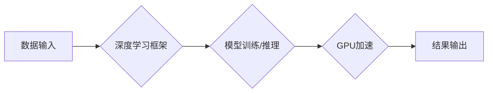

# 算力：NVIDIA推动AI大规模运算

> 关键词：算力，NVIDIA，GPU，深度学习，人工智能，深度学习框架，CUDA，并行计算

## 1. 背景介绍

随着人工智能技术的飞速发展，深度学习已经成为人工智能领域的主流技术。深度学习模型对计算资源的需求日益增长，尤其是算力的需求。在这种背景下，NVIDIA成为了推动AI大规模运算的领军企业。本文将深入探讨NVIDIA在AI算力方面的贡献，包括其核心概念、算法原理、具体操作步骤、实际应用场景以及未来发展趋势。

### 1.1 AI算力需求的增长

近年来，随着深度学习模型的复杂度不断提高，AI算力需求呈现出爆发式增长。特别是在图像识别、自然语言处理、推荐系统等领域的应用中，需要处理的数据量越来越大，计算任务越来越复杂，对算力的需求也随之增加。

### 1.2 NVIDIA在AI算力领域的地位

NVIDIA作为图形处理单元（GPU）领域的领军企业，凭借其高性能的GPU产品和CUDA并行计算平台，为AI大规模运算提供了强大的算力支持。NVIDIA的GPU在深度学习、高性能计算等领域具有广泛的应用，成为了推动AI发展的关键技术。

## 2. 核心概念与联系

在介绍NVIDIA在AI算力方面的贡献之前，我们先来了解一些核心概念。

### 2.1 GPU与并行计算

图形处理单元（GPU）是专门用于图形渲染的硬件加速器，但随着深度学习技术的发展，GPU在并行计算领域也得到了广泛应用。GPU具有大量的并行处理核心，可以同时处理多个计算任务，从而大幅提升计算效率。

### 2.2 CUDA并行计算平台

CUDA（Compute Unified Device Architecture）是NVIDIA推出的并行计算平台，允许开发者在GPU上运行通用计算任务。CUDA为开发者提供了丰富的编程接口和工具，使得GPU在深度学习、科学计算等领域得到广泛应用。

### 2.3 深度学习框架

深度学习框架是用于构建和训练深度学习模型的软件库，如TensorFlow、PyTorch等。深度学习框架通常提供高效的GPU加速库，使得深度学习模型的训练和推理过程更加高效。

以下是NVIDIA在AI算力方面的核心概念原理和架构的Mermaid流程图：



在这个流程图中，数据输入经过深度学习框架处理后，在GPU上进行加速计算，最终输出计算结果。

## 3. 核心算法原理 & 具体操作步骤

### 3.1 算法原理概述

NVIDIA在AI算力方面的核心算法原理主要包括以下几个方面：

- **GPU并行计算**：利用GPU的并行处理能力，将深度学习模型中的计算任务分配到多个GPU核心上同时执行，大幅提升计算效率。
- **CUDA并行计算平台**：提供丰富的编程接口和工具，使得开发者在GPU上实现高效的并行计算。
- **深度学习框架加速库**：深度学习框架提供的GPU加速库，如TensorFlow的CUDA插件、PyTorch的CUDA后端等，为深度学习模型的训练和推理提供加速支持。

### 3.2 算法步骤详解

以下是使用NVIDIA GPU进行深度学习模型训练和推理的基本步骤：

1. **选择深度学习框架**：根据实际需求选择合适的深度学习框架，如TensorFlow、PyTorch等。
2. **准备训练数据**：将训练数据集加载到内存中，并进行预处理，如数据增强、归一化等。
3. **定义深度学习模型**：使用深度学习框架定义模型结构，包括输入层、隐藏层和输出层等。
4. **模型编译**：编译模型，指定优化器、损失函数等参数。
5. **模型训练**：将数据输入模型，利用GPU加速计算，训练模型参数。
6. **模型评估**：使用验证数据集评估模型性能，调整超参数，优化模型结构。
7. **模型推理**：使用训练好的模型对新的数据进行推理预测。

### 3.3 算法优缺点

NVIDIA在AI算力方面的算法具有以下优点：

- **高性能**：GPU具有大量并行处理核心，可以同时处理多个计算任务，大幅提升计算效率。
- **易用性**：深度学习框架提供了丰富的编程接口和工具，使得开发者在GPU上实现高效的并行计算。
- **生态丰富**：NVIDIA的CUDA平台和深度学习框架生态丰富，支持多种编程语言和工具。

然而，NVIDIA在AI算力方面的算法也存在一些缺点：

- **成本高**：高性能GPU的价格较高，对于预算有限的组织来说，可能需要较大的投资。
- **功耗大**：高性能GPU的功耗较大，对数据中心或服务器机房的环境要求较高。
- **依赖特定硬件**：NVIDIA的CUDA平台和深度学习框架依赖于NVIDIA的GPU，对于其他品牌的GPU支持有限。

### 3.4 算法应用领域

NVIDIA在AI算力方面的算法在以下领域得到了广泛应用：

- **图像识别**：如人脸识别、物体检测、图像分割等。
- **自然语言处理**：如文本分类、机器翻译、语音识别等。
- **推荐系统**：如商品推荐、新闻推荐等。
- **医疗影像分析**：如肿瘤检测、病理诊断等。

## 4. 数学模型和公式 & 详细讲解 & 举例说明

### 4.1 数学模型构建

在深度学习领域，常见的数学模型包括卷积神经网络（CNN）、循环神经网络（RNN）、递归神经网络（RNN）、Transformer等。

以下是一个简单的卷积神经网络（CNN）的数学模型：

$$
f(x) = W_1 \cdot f(W_0 \cdot x) + b_1 + \sigma(W_2 \cdot f(W_1 \cdot W_0 \cdot x) + b_2)
$$

其中，$x$ 是输入数据，$W_0, W_1, W_2$ 是权重矩阵，$b_1, b_2$ 是偏置项，$\sigma$ 是激活函数。

### 4.2 公式推导过程

以下是对上述卷积神经网络（CNN）公式进行推导的简要说明：

1. 首先，将输入数据 $x$ 通过卷积层 $W_0$ 进行卷积运算，得到中间特征图。
2. 然后，将中间特征图通过激活函数 $\sigma$ 进行非线性变换。
3. 最后，将变换后的特征图通过全连接层 $W_1, W_2$ 进行计算，得到最终的输出 $f(x)$。

### 4.3 案例分析与讲解

以下是一个使用PyTorch实现卷积神经网络（CNN）的简单例子：

```python
import torch
import torch.nn as nn

# 定义卷积神经网络
class CNN(nn.Module):
    def __init__(self):
        super(CNN, self).__init__()
        self.conv1 = nn.Conv2d(1, 10, kernel_size=5)
        self.conv2 = nn.Conv2d(10, 20, kernel_size=5)
        self.fc1 = nn.Linear(320, 50)
        self.fc2 = nn.Linear(50, 10)

    def forward(self, x):
        x = nn.functional.relu(self.conv1(x))
        x = nn.functional.max_pool2d(x, 2, 2)
        x = nn.functional.relu(self.conv2(x))
        x = nn.functional.max_pool2d(x, 2, 2)
        x = torch.flatten(x, 1)
        x = nn.functional.relu(self.fc1(x))
        x = self.fc2(x)
        return x

# 创建模型实例
model = CNN()

# 定义输入数据
x = torch.randn(1, 1, 28, 28)

# 前向传播
output = model(x)

print(output)
```

在这个例子中，我们定义了一个简单的卷积神经网络，包含两个卷积层和两个全连接层。我们使用随机数据作为输入，通过模型进行前向传播，并打印输出结果。

## 5. 项目实践：代码实例和详细解释说明

### 5.1 开发环境搭建

要使用NVIDIA GPU进行深度学习开发，需要以下环境：

- 操作系统：Linux或macOS
- CUDA版本：与NVIDIA GPU兼容的版本
- 深度学习框架：如PyTorch、TensorFlow等

以下是使用PyTorch在Linux系统中搭建开发环境的步骤：

1. 安装CUDA Toolkit：从NVIDIA官网下载CUDA Toolkit，并按照官方文档进行安装。
2. 安装PyTorch：在PyTorch官网选择与CUDA版本兼容的PyTorch版本，并使用pip进行安装。

### 5.2 源代码详细实现

以下是一个使用PyTorch在NVIDIA GPU上进行图像分类的简单例子：

```python
import torch
import torch.nn as nn
import torch.optim as optim
from torchvision import datasets, transforms
from torch.utils.data import DataLoader

# 定义卷积神经网络
class CNN(nn.Module):
    def __init__(self):
        super(CNN, self).__init__()
        self.conv1 = nn.Conv2d(1, 10, kernel_size=5)
        self.conv2 = nn.Conv2d(10, 20, kernel_size=5)
        self.fc1 = nn.Linear(320, 50)
        self.fc2 = nn.Linear(50, 10)

    def forward(self, x):
        x = nn.functional.relu(self.conv1(x))
        x = nn.functional.max_pool2d(x, 2, 2)
        x = nn.functional.relu(self.conv2(x))
        x = nn.functional.max_pool2d(x, 2, 2)
        x = torch.flatten(x, 1)
        x = nn.functional.relu(self.fc1(x))
        x = self.fc2(x)
        return x

# 创建模型实例
model = CNN().cuda()

# 定义损失函数和优化器
criterion = nn.CrossEntropyLoss()
optimizer = optim.SGD(model.parameters(), lr=0.01)

# 加载数据
transform = transforms.Compose([transforms.ToTensor()])
train_dataset = datasets.MNIST(root='./data', train=True, download=True, transform=transform)
train_loader = DataLoader(train_dataset, batch_size=64, shuffle=True)

# 训练模型
for epoch in range(2):  # 训练2个epoch
    for batch_idx, (data, target) in enumerate(train_loader):
        data, target = data.cuda(), target.cuda()
        optimizer.zero_grad()
        output = model(data)
        loss = criterion(output, target)
        loss.backward()
        optimizer.step()
        if batch_idx % 100 == 0:
            print('Train Epoch: {} [{}/{} ({:.0f}%)]\tLoss: {:.6f}'.format(
                epoch, batch_idx * len(data), len(train_loader.dataset),
                100. * batch_idx / len(train_loader), loss.item()))

# 保存模型
torch.save(model.state_dict(), 'mnist_cnn.pth')
```

在这个例子中，我们定义了一个简单的卷积神经网络，使用MNIST数据集进行训练，并在训练完成后保存模型。

### 5.3 代码解读与分析

在这个例子中，我们首先定义了一个简单的卷积神经网络，包含两个卷积层和两个全连接层。然后，我们创建模型实例，并将模型移动到GPU上。接下来，我们定义了损失函数和优化器，并加载数据集。

在训练循环中，我们遍历数据集，对每个批次的数据进行前向传播和反向传播，并更新模型参数。最后，我们将训练好的模型保存到文件中。

### 5.4 运行结果展示

运行上述代码后，你将在控制台看到训练过程中的loss信息。训练完成后，你可以使用以下代码加载训练好的模型，并对新的数据进行推理预测：

```python
# 加载模型
model = CNN().cuda()
model.load_state_dict(torch.load('mnist_cnn.pth'))

# 定义测试数据
test_data = torch.randn(1, 1, 28, 28).cuda()

# 前向传播
output = model(test_data)

# 打印输出结果
print(output)
```

在这个例子中，我们使用随机数据作为输入，通过模型进行前向传播，并打印输出结果。

## 6. 实际应用场景

NVIDIA的AI算力在以下实际应用场景中得到了广泛应用：

### 6.1 图像识别

在图像识别领域，NVIDIA的GPU加速了卷积神经网络（CNN）的训练和推理，使得人脸识别、物体检测、图像分割等任务得到了广泛应用。

### 6.2 自然语言处理

在自然语言处理领域，NVIDIA的GPU加速了循环神经网络（RNN）和Transformer等模型的训练和推理，使得机器翻译、语音识别、文本分类等任务得到了广泛应用。

### 6.3 推荐系统

在推荐系统领域，NVIDIA的GPU加速了深度学习模型的训练和推理，使得商品推荐、新闻推荐等任务得到了广泛应用。

### 6.4 医疗影像分析

在医疗影像分析领域，NVIDIA的GPU加速了卷积神经网络（CNN）的训练和推理，使得肿瘤检测、病理诊断等任务得到了广泛应用。

## 7. 工具和资源推荐

### 7.1 学习资源推荐

以下是一些学习NVIDIA AI算力的推荐资源：

- NVIDIA官方文档：https://docs.nvidia.com/
- PyTorch官方文档：https://pytorch.org/docs/stable/index.html
- TensorFlow官方文档：https://www.tensorflow.org/api_docs/python/tf

### 7.2 开发工具推荐

以下是一些NVIDIA AI算力开发工具：

- CUDA Toolkit：https://developer.nvidia.com/cuda-toolkit
- cuDNN：https://developer.nvidia.com/cudnn
- PyTorch：https://pytorch.org/
- TensorFlow：https://www.tensorflow.org/

### 7.3 相关论文推荐

以下是一些与NVIDIA AI算力相关的论文：

- "ImageNet Classification with Deep Convolutional Neural Networks" - Krizhevsky et al., 2012
- "Sequence to Sequence Learning with Neural Networks" - Sutskever et al., 2014
- "Attention Is All You Need" - Vaswani et al., 2017
- "BERT: Pre-training of Deep Bidirectional Transformers for Language Understanding" - Devlin et al., 2018

## 8. 总结：未来发展趋势与挑战

### 8.1 研究成果总结

NVIDIA在AI算力方面的研究成果主要体现在以下几个方面：

- 推动了GPU在并行计算领域的应用，为AI大规模运算提供了强大的算力支持。
- 构建了CUDA并行计算平台，为开发者在GPU上实现高效的并行计算提供了丰富的工具和接口。
- 支持了多种深度学习框架的GPU加速库，使得深度学习模型的训练和推理更加高效。

### 8.2 未来发展趋势

NVIDIA在AI算力方面的未来发展趋势主要包括以下几个方面：

- 推出更强大的GPU产品，提供更高的计算性能。
- 推动AI算力的云化，使得更多的开发者能够访问高性能GPU资源。
- 开发更高效的并行计算技术，进一步提高计算效率。
- 推动AI算力的绿色化，降低能耗。

### 8.3 面临的挑战

NVIDIA在AI算力方面面临的挑战主要包括以下几个方面：

- GPU算力需求的持续增长，需要不断推出更强大的GPU产品。
- 随着AI应用场景的多样化，需要开发更通用的AI算力解决方案。
- AI算力的安全问题，需要确保AI算力不被滥用。

### 8.4 研究展望

展望未来，NVIDIA在AI算力方面将继续发挥其领导作用，推动AI技术的进一步发展。以下是一些研究展望：

- 探索新的并行计算架构，进一步提升AI算力。
- 开发更高效的AI训练和推理算法，降低计算成本。
- 推动AI算力的绿色化，降低能耗。
- 确保AI算力的安全性和可靠性。

## 9. 附录：常见问题与解答

**Q1：什么是GPU？**

A：GPU（Graphics Processing Unit）是一种专门用于图形渲染的硬件加速器。随着深度学习技术的发展，GPU在并行计算领域也得到了广泛应用。

**Q2：什么是CUDA？**

A：CUDA（Compute Unified Device Architecture）是NVIDIA推出的并行计算平台，允许开发者在GPU上运行通用计算任务。

**Q3：什么是深度学习框架？**

A：深度学习框架是用于构建和训练深度学习模型的软件库，如TensorFlow、PyTorch等。

**Q4：如何使用GPU进行深度学习？**

A：要使用GPU进行深度学习，需要以下步骤：
1. 选择深度学习框架，如PyTorch、TensorFlow等。
2. 确保系统支持CUDA。
3. 使用深度学习框架的GPU加速库，如PyTorch的CUDA后端、TensorFlow的CUDA插件等。
4. 在代码中指定使用GPU进行计算。

**Q5：GPU算力如何影响深度学习模型？**

A：GPU算力可以显著提升深度学习模型的训练和推理速度，使得复杂的模型能够在较短的时间内完成训练和推理。

作者：禅与计算机程序设计艺术 / Zen and the Art of Computer Programming