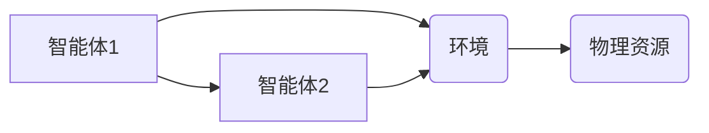

# 综合设计模式的应用案例：反思、工具使用与多智能体协同

> 关键词：设计模式，软件架构，多智能体系统，协同工作，案例研究，反思，最佳实践

## 1. 背景介绍

设计模式是软件开发中解决特定问题的通用解决方案。它们提供了一种可重用的解决方案，可以帮助开发者更有效地构建软件系统。随着复杂性的增加，设计模式成为了软件工程中不可或缺的工具。本文将探讨设计模式在综合应用中的案例，分析其工具使用，以及多智能体系统中的协同工作。

### 1.1 设计模式的起源与重要性

设计模式起源于建筑和工程设计领域，后来被引入到软件开发中。它们由一系列的最佳实践组成，用于解决软件设计中的常见问题。设计模式不仅提高了代码的可读性和可维护性，还促进了软件的可扩展性和可复用性。

### 1.2 多智能体系统的挑战

多智能体系统（Multi-Agent Systems, MAS）由多个自治的智能体组成，这些智能体可以相互协作以完成复杂任务。在多智能体系统中，设计模式可以帮助解决协同、通信、决策和资源分配等问题。

## 2. 核心概念与联系

### 2.1 设计模式

设计模式可以分为三大类：

- **创建型模式**：处理对象的创建和实例化过程，例如工厂模式、单例模式。
- **结构型模式**：处理类和对象的组合，例如适配器模式、装饰器模式。
- **行为型模式**：处理对象之间的通信和交互，例如观察者模式、策略模式。

以下是一个简单的 Mermaid 流程图，展示了设计模式之间的联系：

```mermaid
graph LR
A[创建型模式] --> B{结构型模式}
B --> C[行为型模式}
A --> B
A --> C
```

### 2.2 多智能体系统

多智能体系统中的关键概念包括：

- **智能体**：独立的行为实体，可以感知环境，做出决策，并执行动作。
- **环境**：智能体操作的环境，包括其他智能体和物理资源。
- **通信**：智能体之间的信息交换机制。

以下是一个简单的 Mermaid 流程图，展示了多智能体系统的基本架构：



## 3. 核心算法原理 & 具体操作步骤

### 3.1 算法原理概述

设计模式通常由三个基本元素组成：模式名称、问题和解决方案。例如，工厂模式的解决方案是定义一个用于创建对象的接口，让子类决定实例化哪一个类。

### 3.2 算法步骤详解

以下是一些常见设计模式的步骤详解：

- **工厂模式**：
  1. 定义一个创建对象的接口。
  2. 实现一个工厂类，根据需要创建对象。
  3. 客户端代码通过工厂类创建对象，而不直接实例化类。

- **适配器模式**：
  1. 定义一个接口，用于适配源接口和目标接口。
  2. 创建一个适配器类，实现目标接口，并包含源接口的引用。
  3. 客户端代码使用适配器进行通信。

- **观察者模式**：
  1. 定义一个观察者接口。
  2. 创建一个主题类，包含一个观察者列表。
  3. 客户端代码注册观察者到主题类。
  4. 当主题对象发生变化时，通知所有观察者。

### 3.3 算法优缺点

设计模式的优点包括：

- 提高代码的可读性和可维护性。
- 提高代码的可复用性。
- 提高代码的可扩展性。

设计模式的缺点包括：

- 可能导致代码复杂度增加。
- 需要开发者有良好的设计意识。

### 3.4 算法应用领域

设计模式适用于各种软件开发场景，以下是一些常见应用领域：

- 系统架构设计。
- 企业应用开发。
- 游戏开发。
- 网络应用开发。

## 4. 数学模型和公式 & 详细讲解 & 举例说明

### 4.1 数学模型构建

设计模式通常不涉及复杂的数学模型，但它们可以用数学语言进行描述。以下是一个简单的示例：

$$
M = F(P)
$$

其中 $M$ 是一个设计模式，$P$ 是模式的应用场景。

### 4.2 公式推导过程

公式推导过程通常涉及对设计模式原理的分析和理解。

### 4.3 案例分析与讲解

以下是一个使用观察者模式的设计模式案例：

```python
class Subject:
    def __init__(self):
        self._observers = []

    def attach(self, observer):
        self._observers.append(observer)

    def detach(self, observer):
        self._observers.remove(observer)

    def notify(self):
        for observer in self._observers:
            observer.update(self)

class Observer:
    def update(self, subject):
        pass

class ConcreteObserver(Observer):
    def update(self, subject):
        print(f"Observer received notification from {subject}")

subject = Subject()
observer = ConcreteObserver()
subject.attach(observer)
subject.notify()
```

## 5. 项目实践：代码实例和详细解释说明

### 5.1 开发环境搭建

本案例将使用 Python 语言进行实现。

### 5.2 源代码详细实现

以下是一个简单的工厂模式实现：

```python
class Product:
    def operation(self):
        pass

class ConcreteProductA(Product):
    def operation(self):
        print("Operation of Product A")

class ConcreteProductB(Product):
    def operation(self):
        print("Operation of Product B")

class Factory:
    def create(self, product_type):
        if product_type == 'A':
            return ConcreteProductA()
        if product_type == 'B':
            return ConcreteProductB()

# 客户端代码
factory = Factory()
product_a = factory.create('A')
product_a.operation()

product_b = factory.create('B')
product_b.operation()
```

### 5.3 代码解读与分析

在上面的代码中，我们定义了一个简单的工厂类 `Factory`，它根据传入的参数创建不同的产品对象。这种设计允许我们通过简单的字符串来创建不同类型的产品，而不需要知道具体的产品类。

### 5.4 运行结果展示

```plaintext
Operation of Product A
Operation of Product B
```

## 6. 实际应用场景

设计模式在许多实际应用场景中都得到了广泛应用，以下是一些例子：

- **企业应用**：使用工厂模式创建数据库连接池。
- **网络应用**：使用观察者模式处理用户事件。
- **游戏开发**：使用状态模式管理游戏对象的状态变化。

## 7. 工具和资源推荐

### 7.1 学习资源推荐

- 《设计模式：可复用面向对象软件的基础》
- 《大话设计模式》
- 《Design Patterns: Elements of Reusable Object-Oriented Software》

### 7.2 开发工具推荐

- UML建模工具，如 Rational Rose、Visual Paradigm
- 版本控制工具，如 Git

### 7.3 相关论文推荐

- 《Patterns of Enterprise Application Architecture》
- 《Design Patterns Explained: A New Perspective on Object-Oriented Design》

## 8. 总结：未来发展趋势与挑战

### 8.1 研究成果总结

设计模式和设计模式语言在软件工程中已经得到了广泛应用，并取得了显著的成果。它们帮助开发者构建更可维护、更可扩展的软件系统。

### 8.2 未来发展趋势

随着软件工程的不断发展，设计模式将更加注重以下方面：

- 与云计算、大数据等新兴技术的融合。
- 与软件工程其他领域的结合，如软件测试、软件维护。
- 设计模式语言的标准化和规范化。

### 8.3 面临的挑战

设计模式在应用过程中也面临以下挑战：

- 设计模式的过度使用可能导致代码复杂度增加。
- 设计模式的选择需要根据具体的应用场景进行。
- 设计模式的学习和掌握需要时间和经验。

### 8.4 研究展望

未来，设计模式的研究将更加注重以下几个方面：

- 设计模式的理论研究和实证研究。
- 设计模式的标准化和规范化。
- 设计模式与其他软件工程领域的融合。

## 9. 附录：常见问题与解答

**Q1：设计模式是否适用于所有类型的软件系统？**

A：设计模式并非适用于所有类型的软件系统。在设计模式之前，开发者应该评估项目的具体需求，选择合适的设计模式。

**Q2：如何选择合适的设计模式？**

A：选择合适的设计模式需要考虑以下因素：

- 应用场景
- 系统需求
- 开发者的经验

**Q3：设计模式是否会影响开发效率？**

A：设计模式可以提高代码的可读性和可维护性，从而提高开发效率。然而，设计模式的过度使用可能导致代码复杂度增加，降低开发效率。

**Q4：设计模式与面向对象编程有何关系？**

A：设计模式是面向对象编程的精髓之一。它们是面向对象编程原则的具体实现。

**Q5：设计模式是否与架构模式相同？**

A：设计模式是架构模式的具体实现。架构模式描述了软件系统的整体结构和组织方式，而设计模式描述了具体的设计细节。

---

作者：禅与计算机程序设计艺术 / Zen and the Art of Computer Programming