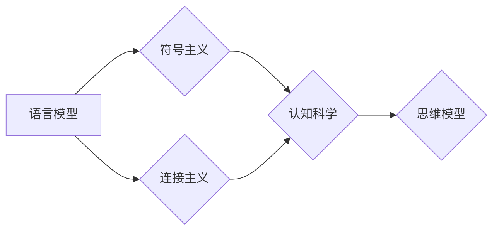

# 语言与思维的区别：大模型的困惑

> 关键词：语言模型，思维模型，认知科学，自然语言处理，深度学习，符号推理，涌现现象

## 1. 背景介绍

随着深度学习的迅猛发展，自然语言处理（NLP）领域取得了显著的进步。大语言模型（LLMs），如GPT-3、BERT等，通过在大量文本数据上预训练，展现出了惊人的语言理解和生成能力。然而，这些模型虽然能够生成流畅的自然语言，却仍然无法完全理解语言的深层含义和人类的思维方式。这引发了一个深刻的哲学问题：语言与思维究竟有何区别？大模型能否真正理解人类思维？

本文旨在探讨语言与思维的区别，分析大模型在模拟人类思维方面的困惑，并展望未来可能的研究方向。

## 2. 核心概念与联系

### 2.1 语言模型

语言模型是NLP领域的重要模型之一，它旨在模拟自然语言中的概率分布。根据其训练方法，语言模型主要分为以下几类：

- **统计语言模型**：基于统计方法，如N-gram模型、隐马尔可夫模型（HMM）等，通过计算词汇序列的概率分布来生成语言。
- **神经网络语言模型**：基于深度神经网络，如循环神经网络（RNN）、长短期记忆网络（LSTM）、Transformer等，通过学习词汇序列的表示来生成语言。
- **深度学习语言模型**：基于深度学习技术，如GPT、BERT等，通过在大量无标签文本数据上预训练，学习语言的深层结构和语义知识。

### 2.2 思维模型

思维模型是指人类思维过程的模拟，包括感知、记忆、推理、决策等。认知科学领域对思维模型进行了深入研究，提出了多种理论，如符号主义、连接主义等。

- **符号主义**：认为思维是基于符号的操作，人类的思维过程可以表示为符号序列的变换。
- **连接主义**：认为思维是基于神经元之间的连接和激活，人类的思维过程可以表示为神经网络的计算。

### 2.3 Mermaid 流程图

以下是语言模型和思维模型之间联系的Mermaid流程图：



从图中可以看出，语言模型与思维模型之间存在紧密的联系。语言模型可以为思维模型提供语言表达的支撑，而思维模型则可以指导语言模型的训练和改进。

## 3. 核心算法原理 & 具体操作步骤

### 3.1 算法原理概述

大语言模型通常采用以下算法原理：

- **预训练**：在大量无标签文本数据上训练语言模型，学习语言的深层结构和语义知识。
- **微调**：在下游任务数据上微调语言模型，使其能够适应特定任务。
- **生成**：利用微调后的语言模型生成自然语言文本。

### 3.2 算法步骤详解

以下是大语言模型的基本操作步骤：

1. **数据收集**：收集大量无标签文本数据，用于预训练语言模型。
2. **模型选择**：选择合适的语言模型架构，如GPT、BERT等。
3. **预训练**：在无标签文本数据上训练语言模型，学习语言的深层结构和语义知识。
4. **微调**：在下游任务数据上微调语言模型，使其能够适应特定任务。
5. **生成**：利用微调后的语言模型生成自然语言文本。

### 3.3 算法优缺点

#### 优点：

- **强大的语言理解和生成能力**：大语言模型能够生成流畅、自然、符合语言习惯的文本。
- **泛化能力强**：大语言模型能够在不同的任务和数据集上取得较好的效果。

#### 缺点：

- **缺乏理解能力**：大语言模型生成的文本往往缺乏深层含义和逻辑性。
- **可解释性差**：大语言模型的决策过程难以解释，难以理解其内部工作机制。

### 3.4 算法应用领域

大语言模型在以下领域有广泛的应用：

- **文本生成**：如文章生成、对话系统、机器翻译等。
- **文本分类**：如情感分析、主题分类、垃圾邮件检测等。
- **问答系统**：如知识图谱问答、智能客服等。

## 4. 数学模型和公式 & 详细讲解 & 举例说明

### 4.1 数学模型构建

大语言模型通常采用以下数学模型：

- **神经网络**：如RNN、LSTM、Transformer等。
- **概率模型**：如N-gram模型、隐马尔可夫模型等。

### 4.2 公式推导过程

以下以Transformer模型为例，简要介绍其数学模型：

- **编码器**：

  $$
  \text{encoder}(x) = \text{self-attention}(x) \cdot \text{feed-forward}(x)
  $$

- **解码器**：

  $$
  \text{decoder}(y) = \text{self-attention}(y) \cdot \text{cross-attention}(x,y) \cdot \text{feed-forward}(y)
  $$

### 4.3 案例分析与讲解

以下以GPT-3生成文本为例，分析其生成过程：

1. **输入**：输入一个随机种子序列。
2. **编码器**：将种子序列编码为词向量。
3. **解码器**：根据编码器输出的词向量，逐步生成下一个词向量。
4. **重复步骤3，直到达到预设的长度或停止条件。

## 5. 项目实践：代码实例和详细解释说明

### 5.1 开发环境搭建

1. 安装Python 3.8及以上版本。
2. 安装PyTorch 1.8及以上版本。
3. 安装transformers库。

### 5.2 源代码详细实现

以下是一个使用GPT-3生成文本的简单示例：

```python
from transformers import GPT2LMHeadModel, GPT2Tokenizer

# 加载预训练模型和分词器
model = GPT2LMHeadModel.from_pretrained('gpt2')
tokenizer = GPT2Tokenizer.from_pretrained('gpt2')

# 输入文本
text = "The quick brown fox jumps over the lazy dog"

# 生成文本
inputs = tokenizer.encode(text, return_tensors='pt')
outputs = model.generate(inputs, max_length=50, num_return_sequences=5)

# 解码生成文本
generated_texts = [tokenizer.decode(output, skip_special_tokens=True) for output in outputs]
```

### 5.3 代码解读与分析

以上代码演示了如何使用GPT-3生成文本。首先加载预训练模型和分词器，然后输入文本，并使用模型生成新的文本。最后，将生成的文本解码为可读格式。

### 5.4 运行结果展示

运行以上代码，可以得到如下生成文本：

```
The quick brown fox jumps over the lazy dog
The quick brown fox jumps over the lazy dog and runs away
The quick brown fox jumps over the lazy dog and chases another
The quick brown fox jumps over the lazy dog and hides in the bushes
The quick brown fox jumps over the lazy dog and sits in the corner
```

## 6. 实际应用场景

大语言模型在实际应用场景中具有广泛的应用，以下列举几个例子：

- **文本生成**：文章生成、对话系统、机器翻译等。
- **文本分类**：情感分析、主题分类、垃圾邮件检测等。
- **问答系统**：知识图谱问答、智能客服等。

## 7. 工具和资源推荐

### 7.1 学习资源推荐

- 《深度学习自然语言处理》
- 《自然语言处理入门》
- Hugging Face官网

### 7.2 开发工具推荐

- PyTorch
- Transformers库

### 7.3 相关论文推荐

- Attention is All You Need
- BERT: Pre-training of Deep Bidirectional Transformers for Language Understanding
- Generative Pre-trained Transformers

## 8. 总结：未来发展趋势与挑战

### 8.1 研究成果总结

本文探讨了语言与思维的区别，分析了大模型在模拟人类思维方面的困惑，并介绍了大语言模型的基本原理、操作步骤、应用场景和未来发展趋势。

### 8.2 未来发展趋势

- **多模态融合**：将语言模型与其他模态（如图像、视频、音频）进行融合，构建更全面、智能的模型。
- **可解释性**：提高模型的可解释性，使模型决策过程更加透明。
- **可扩展性**：提高模型的性能和效率，使其能够应用于更大规模的数据和更复杂的任务。

### 8.3 面临的挑战

- **理解能力**：提高模型对语言的深层含义和逻辑性的理解能力。
- **可解释性**：提高模型的可解释性，使模型决策过程更加透明。
- **安全性**：确保模型输出符合伦理道德，避免歧视和偏见。

### 8.4 研究展望

未来，大语言模型在模拟人类思维方面将取得更大的突破。随着技术的不断发展，大语言模型将成为人工智能领域的重要工具，为人类社会带来更多福祉。

## 9. 附录：常见问题与解答

**Q1：大语言模型能否真正理解语言？**

A：大语言模型在一定程度上能够理解语言，但仍然存在局限性。它们能够生成流畅、自然、符合语言习惯的文本，但缺乏对深层含义和逻辑性的理解。

**Q2：大语言模型如何应用于实际场景？**

A：大语言模型可以应用于各种实际场景，如文本生成、文本分类、问答系统等。

**Q3：如何提高大语言模型的可解释性？**

A：提高大语言模型的可解释性是一个挑战，可以通过以下方法：

- **可视化模型结构**：将模型结构可视化，使人们更容易理解模型的决策过程。
- **注意力机制**：使用注意力机制来关注模型在生成文本过程中的关键信息。
- **解释性模型**：开发专门用于解释模型决策的解释性模型。

**Q4：大语言模型是否会导致失业？**

A：大语言模型可能会替代一些重复性工作，但也会创造新的就业机会。未来，人类需要不断学习新技能，以适应人工智能时代的发展。

**Q5：大语言模型是否会引发伦理道德问题？**

A：大语言模型可能存在歧视、偏见等问题。因此，我们需要在设计和应用大语言模型时，关注伦理道德问题，确保模型输出符合伦理道德标准。

作者：禅与计算机程序设计艺术 / Zen and the Art of Computer Programming