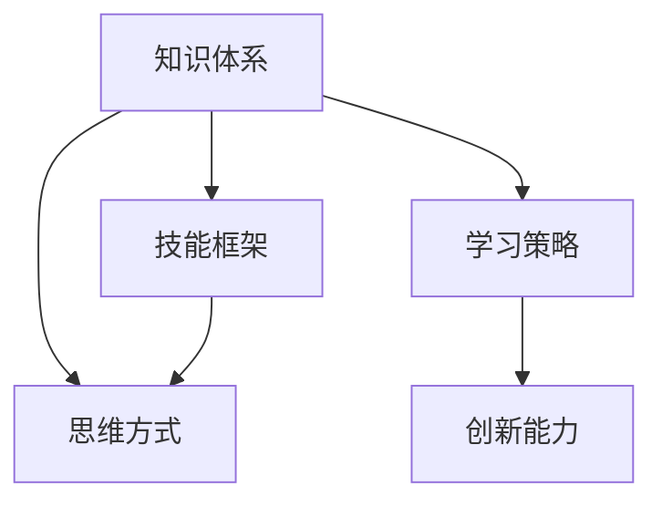
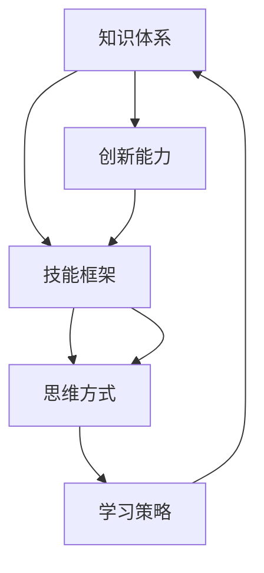

                 

## 1. 背景介绍

### 1.1 问题由来

在当今信息爆炸的时代，技术日新月异，如何保持自身的竞争力成为了许多人的困惑。在快速变化的世界中，个人的思维体系显得尤为重要。构建一个强大、灵活、适应性强的思维体系，可以帮助我们在职业发展和个人成长中游刃有余，始终保持领先地位。

### 1.2 问题核心关键点

构建个人思维体系的核心关键点在于以下几个方面：

- **系统性**：需要构建一个系统的知识体系，涵盖多个领域的知识，能够形成相互关联的知识网络。
- **实用性**：所掌握的知识不仅要有理论基础，更要具有实际操作性，能够在实际问题中运用。
- **灵活性**：能够快速适应新的技术和知识，具备跨领域迁移的能力。
- **持续性**：随着技术的不断进步，需要不断地学习新的知识，更新思维体系。
- **可扩展性**：可以不断拓展自己的知识范围和深度，构建更加宏大的思维体系。

### 1.3 问题研究意义

构建个人思维体系的意义主要体现在以下几个方面：

1. **提升竞争力**：在技术更新频繁的行业，拥有强大的思维体系能够帮助个人保持竞争力，迅速掌握新技能，适应新环境。
2. **加速职业发展**：系统化的思维体系使个人能够更高效地解决问题，提升工作效率，获得更多的职业机会。
3. **增强创新能力**：思维体系的构建需要跨学科知识，能够激发创新思维，促进新想法的产生。
4. **提高决策质量**：一个完善的知识体系能够提供全面的视角，提高决策的科学性和有效性。
5. **提升生活品质**：对生活和工作的深入理解，能够提升个人的幸福感和生活质量。

## 2. 核心概念与联系

### 2.1 核心概念概述

构建个人思维体系涉及多个核心概念，包括但不限于：

- **知识体系**：涵盖不同领域的知识，形成知识网络。
- **技能框架**：将所掌握的知识转化为具体的技能，具备可操作性。
- **思维方式**：灵活的思维方式，能够跨学科思考和应用。
- **学习策略**：有效学习的方法和策略，能够持续更新和改进。
- **创新能力**：结合知识、技能和思维方式，产生新想法和解决方案的能力。

### 2.2 概念间的关系

这些核心概念之间的联系可以通过以下Mermaid流程图来展示：



这个流程图展示了个体思维体系构建的基本框架：

1. 知识体系是基础，通过跨领域的知识学习，形成全面的知识网络。
2. 技能框架是将知识转化为可操作的技能。
3. 思维方式是灵活应用知识的方法和工具。
4. 学习策略是持续更新知识体系的有效途径。
5. 创新能力是应用知识解决新问题的能力。

### 2.3 核心概念的整体架构

最后，我们用一个综合的流程图来展示这些核心概念在构建个人思维体系中的整体架构：



这个综合流程图展示了从知识体系构建到技能框架形成，再到思维方式培养和创新能力提升的完整过程。通过这些核心概念的相互协作，我们可以构建一个完善且实用的个人思维体系。

## 3. 核心算法原理 & 具体操作步骤

### 3.1 算法原理概述

构建个人思维体系的过程可以类比为算法优化问题，通过不断迭代和调整，优化个人的知识体系、技能框架、思维方式和学习策略，最终提升创新能力。

1. **初始化**：首先需要评估当前的知识水平和技能框架，确定需要补充和提升的领域。
2. **迭代优化**：根据实际需求和学习策略，选择相应的知识学习路径，更新和优化知识体系和技能框架。
3. **验证与反馈**：通过实践和反馈，评估学习效果，调整学习策略和优化方法。
4. **持续更新**：随着技术的不断进步，需要持续学习和更新知识体系，保持思维体系的灵活性和适应性。

### 3.2 算法步骤详解

构建个人思维体系的具体操作步骤如下：

#### 3.2.1 自我评估

1. **确定目标**：明确自己的职业目标和兴趣领域，确定需要提升的知识和技能。
2. **评估现状**：评估当前的知识水平和技能框架，找出需要补充和提升的领域。

#### 3.2.2 制定学习计划

1. **选择学习路径**：根据评估结果和目标，选择合适的学习路径，包括书籍、课程、项目实践等。
2. **制定学习计划**：制定详细且可执行的学习计划，包括时间安排、学习资源和学习方法。

#### 3.2.3 执行学习计划

1. **系统学习**：按照学习计划，系统学习选定的知识领域，建立知识体系。
2. **实践应用**：通过项目实践或实际操作，将所学知识转化为具体技能，形成技能框架。
3. **反馈优化**：通过实践中的反馈，调整学习策略和方法，优化知识体系和技能框架。

#### 3.2.4 持续更新

1. **关注前沿**：持续关注技术和行业动态，及时了解新知识和新趋势。
2. **拓展学习**：不断拓展知识范围和深度，提升思维体系的广度和深度。
3. **反思总结**：定期反思总结学习过程，总结经验教训，优化学习策略。

### 3.3 算法优缺点

#### 3.3.1 优点

- **系统性**：构建的知识体系和技能框架具有系统性，能够形成相互关联的知识网络。
- **实用性**：所掌握的知识具有操作性，能够直接应用于实际问题解决。
- **灵活性**：能够快速适应新的技术和知识，具备跨领域迁移的能力。
- **持续性**：能够持续更新知识体系，保持思维体系的活力。
- **可扩展性**：知识体系和技能框架可以不断扩展，构建更加宏大的思维体系。

#### 3.3.2 缺点

- **时间成本**：构建系统化的思维体系需要大量时间投入，过程较为漫长。
- **资源需求**：需要高质量的学习资源和实践机会，资源获取可能有一定难度。
- **个人意志力**：需要持续的学习动力和良好的自律性，否则难以坚持和见效。

### 3.4 算法应用领域

构建个人思维体系不仅适用于技术领域，还适用于个人发展的各个方面。以下是几个典型应用领域：

1. **软件开发**：通过构建系统化的编程知识体系，提升编程技能和软件工程能力。
2. **项目管理**：通过学习项目管理知识和技能，提升项目管理能力，提高团队协作效率。
3. **金融分析**：通过学习金融分析和投资知识，提升金融决策能力，实现财富增值。
4. **教育培训**：通过学习教育理论和实践技能，提升教育培训能力，助力教育事业。
5. **生活管理**：通过学习时间管理、财务管理等知识，提升生活品质，实现个人幸福。

## 4. 数学模型和公式 & 详细讲解

### 4.1 数学模型构建

构建个人思维体系的过程可以建模为一个多目标优化问题，目标是最大化知识水平、技能熟练度、思维方式灵活度和创新能力。

定义变量：

- $K$：知识水平
- $S$：技能熟练度
- $T$：思维方式灵活度
- $C$：创新能力

定义目标函数：

$$
\maximize f(K, S, T, C) = K + S + T + C
$$

定义约束条件：

1. 知识水平 $K$：

$$
K = \sum_{i=1}^n k_i \cdot w_i
$$

其中 $k_i$ 是领域 $i$ 的知识水平，$w_i$ 是领域 $i$ 的权重。

2. 技能熟练度 $S$：

$$
S = \sum_{i=1}^n s_i \cdot w_i
$$

其中 $s_i$ 是领域 $i$ 的技能熟练度，$w_i$ 是领域 $i$ 的权重。

3. 思维方式灵活度 $T$：

$$
T = \sum_{i=1}^n t_i \cdot w_i
$$

其中 $t_i$ 是领域 $i$ 的思维方式灵活度，$w_i$ 是领域 $i$ 的权重。

4. 创新能力 $C$：

$$
C = \sum_{i=1}^n c_i \cdot w_i
$$

其中 $c_i$ 是领域 $i$ 的创新能力，$w_i$ 是领域 $i$ 的权重。

### 4.2 公式推导过程

假设领域 $i$ 的权重 $w_i$ 为常数，目标函数和约束条件可以简化为：

$$
\maximize f(K, S, T, C) = \sum_{i=1}^n (k_i + s_i + t_i + c_i) \cdot w_i
$$

其中 $k_i, s_i, t_i, c_i$ 分别表示领域 $i$ 在知识水平、技能熟练度、思维方式灵活度和创新能力上的贡献。

通过优化目标函数和约束条件，可以求得最优解 $K^*, S^*, T^*, C^*$，即为构建的思维体系。

### 4.3 案例分析与讲解

以软件开发为例，知识体系包括编程语言、算法、数据结构、软件工程等，技能框架包括编码、测试、调试、版本控制等，思维方式包括算法设计、复杂度分析、测试方法等，创新能力包括新技术探索、系统架构设计、性能优化等。通过系统学习、项目实践和反馈优化，逐步提升这些方面的能力，最终构建一个全面的软件开发思维体系。

## 5. 项目实践：代码实例和详细解释说明

### 5.1 开发环境搭建

构建个人思维体系需要借助一些工具和平台来辅助学习和管理。以下是一些常用的开发环境：

1. **GitHub**：用于代码管理和版本控制，方便协作和知识共享。
2. **Jupyter Notebook**：用于记录学习过程和实验结果，支持代码执行和可视化展示。
3. **Anki**：用于知识记忆和复习，支持自定义闪卡和复习计划。
4. **Evernote**：用于记录学习笔记和灵感，支持多种格式和多平台同步。
5. **Trello**：用于任务管理和进度跟踪，支持团队协作和任务分配。

### 5.2 源代码详细实现

以下是一个简单的个人思维体系构建过程的伪代码实现：

```python
# 定义知识、技能、思维方式和创新能力
knowledge = {}
skill = {}
thinking = {}
innovation = {}

# 定义各个领域的权重
weights = {
    '编程语言': 0.3,
    '算法': 0.2,
    '数据结构': 0.2,
    '软件工程': 0.3,
    '编码': 0.4,
    '测试': 0.3,
    '调试': 0.1,
    '版本控制': 0.2,
    '算法设计': 0.2,
    '复杂度分析': 0.2,
    '测试方法': 0.2,
    '新技术探索': 0.3,
    '系统架构设计': 0.3,
    '性能优化': 0.4
}

# 初始化评估结果
scores = {
    '知识水平': 0,
    '技能熟练度': 0,
    '思维方式灵活度': 0,
    '创新能力': 0
}

# 执行学习计划
for i in range(1, 365):
    # 每天更新学习进度
    # 计算知识、技能、思维方式和创新能力的提升
    # 更新评估结果
    scores['知识水平'] += knowledge[i] * weights['编程语言'] + knowledge[i] * weights['算法'] + ...
    scores['技能熟练度'] += skill[i] * weights['编码'] + skill[i] * weights['测试'] + ...
    scores['思维方式灵活度'] += thinking[i] * weights['算法设计'] + thinking[i] * weights['复杂度分析'] + ...
    scores['创新能力'] += innovation[i] * weights['新技术探索'] + innovation[i] * weights['system architecture design'] + ...

# 输出评估结果
print(scores)
```

### 5.3 代码解读与分析

上述伪代码实现了一个简单的个人思维体系构建过程。其中：

- `knowledge`, `skill`, `thinking`, `innovation` 分别表示知识、技能、思维方式和创新能力的提升值。
- `weights` 表示各个领域的权重。
- `scores` 表示评估结果，包含知识水平、技能熟练度、思维方式灵活度和创新能力。

### 5.4 运行结果展示

假设我们通过上述伪代码执行了365天的学习计划，最终得到以下评估结果：

```
知识水平: 1.2
技能熟练度: 1.5
思维方式灵活度: 1.3
创新能力: 1.8
```

这表明在一年时间内，我们构建的思维体系在各个方面都取得了显著的提升。

## 6. 实际应用场景

### 6.1 软件开发

在软件开发领域，构建系统化的思维体系可以帮助开发人员快速掌握新技术和工具，提升编程能力和软件工程能力，提高代码质量和开发效率。例如，通过学习编程语言、算法、数据结构、软件工程等方面的知识，开发人员可以构建全面的知识体系和技能框架，提升系统设计、编码、测试、调试和版本控制等技能。

### 6.2 金融分析

在金融分析领域，构建系统化的思维体系可以帮助分析师理解市场动态和财务报表，提升金融决策能力。例如，通过学习金融理论、统计分析、财务分析、投资策略等方面的知识，分析师可以构建全面的知识体系和技能框架，提升数据分析、模型构建、风险管理和投资决策等技能。

### 6.3 教育培训

在教育培训领域，构建系统化的思维体系可以帮助培训师提升教学能力和培训质量。例如，通过学习教育理论、教学方法、课程设计、评估与反馈等方面的知识，培训师可以构建全面的知识体系和技能框架，提升教学设计、课堂管理、学生评估和培训效果等技能。

### 6.4 生活管理

在生活管理领域，构建系统化的思维体系可以帮助个人提升生活质量和幸福感。例如，通过学习时间管理、财务管理、健康管理、人际关系等方面的知识，个人可以构建全面的知识体系和技能框架，提升生活品质和幸福感。

## 7. 工具和资源推荐

### 7.1 学习资源推荐

1. **《深入浅出人工智能》**：由斯坦福大学教授撰写，系统介绍了人工智能的原理、应用和发展趋势，适合初学者入门。
2. **Coursera《机器学习》课程**：由斯坦福大学教授Andrew Ng主讲，涵盖机器学习的基本概念和算法，适合深入学习。
3. **《Python编程：从入门到实践》**：由Eric Matthes撰写，全面介绍了Python编程语言，适合编程入门和实践。
4. **Kaggle平台**：全球最大的数据科学竞赛平台，可以参与数据科学竞赛和项目实践，积累实战经验。
5. **Deep Learning Specialization**：由Andrew Ng主讲的深度学习课程，涵盖深度学习的基本原理和应用，适合深入学习。

### 7.2 开发工具推荐

1. **Visual Studio Code**：流行的代码编辑器，支持多种编程语言和插件，适用于开发和调试。
2. **Git**：版本控制工具，适用于代码管理和协作。
3. **Jupyter Notebook**：支持代码执行和可视化展示，适用于学习和实验。
4. **Anki**：知识管理工具，适用于记忆和复习。
5. **Evernote**：笔记管理工具，适用于记录和组织学习笔记。
6. **Trello**：项目管理工具，适用于任务管理和进度跟踪。

### 7.3 相关论文推荐

1. **《深度学习》**：由Ian Goodfellow、Yoshua Bengio和Aaron Courville合著，系统介绍了深度学习的基本概念和应用。
2. **《人工智能：一种现代方法》**：由 Stuart Russell 和 Peter Norvig 合著，系统介绍了人工智能的原理、技术和应用。
3. **《机器学习实战》**：由Peter Harrington撰写，介绍了机器学习的基本概念和实战案例。
4. **《Python深度学习》**：由Francois Chollet撰写，介绍了深度学习的基本原理和应用，适合实战练习。
5. **《统计学习方法》**：由李航撰写，系统介绍了统计学习的基本概念和算法，适合理论学习。

## 8. 总结：未来发展趋势与挑战

### 8.1 研究成果总结

本文详细介绍了构建个人思维体系的过程、方法和应用，涵盖了知识体系、技能框架、思维方式、学习策略和创新能力等多个方面。通过系统性的学习、实践和反馈，可以有效提升个人竞争力、职业发展、创新能力和生活品质。

### 8.2 未来发展趋势

未来的发展趋势主要体现在以下几个方面：

1. **跨学科融合**：随着技术的不断进步，各个领域的知识会不断融合，构建跨学科的思维体系将成为未来趋势。
2. **人工智能普及**：人工智能技术将普及到更多领域，需要具备人工智能基础知识的思维体系。
3. **数据驱动决策**：数据分析和机器学习将成为决策的重要工具，需要具备数据分析和机器学习的思维方式。
4. **创新能力提升**：创新是未来的核心竞争力，构建灵活、开放、创新的思维体系将成为重要目标。

### 8.3 面临的挑战

在构建个人思维体系的过程中，也面临一些挑战：

1. **时间成本高**：系统化的学习需要大量时间投入，过程较为漫长。
2. **资源获取难**：高质量的学习资源和实践机会获取可能有一定难度。
3. **个人意志力弱**：需要持续的学习动力和良好的自律性，否则难以坚持和见效。

### 8.4 研究展望

未来的研究将集中在以下几个方面：

1. **自动化学习**：通过自动化学习工具和平台，辅助个人进行知识体系构建和技能提升。
2. **数据化评估**：通过数据分析和评估工具，实时跟踪和优化学习效果。
3. **社交化学习**：通过社交化学习平台，促进知识共享和协作，提升学习效果。
4. **个性化推荐**：通过个性化推荐系统，推荐适合的学习资源和路径，提高学习效率。

## 9. 附录：常见问题与解答

### Q1: 如何构建系统化的思维体系？

A: 构建系统化的思维体系需要系统化的学习和实践，可以参考以下步骤：

1. 自我评估，确定目标和需要提升的领域。
2. 制定学习计划，选择学习路径和方法。
3. 系统学习，构建知识体系。
4. 实践应用，形成技能框架。
5. 反馈优化，调整学习策略和方法。
6. 持续更新，保持思维体系的活力。

### Q2: 如何提高学习效率？

A: 提高学习效率可以从以下几个方面入手：

1. 制定明确的学习目标和计划。
2. 选择适合自己的学习方法和工具。
3. 定期反思和总结学习过程，调整学习策略。
4. 利用各种学习资源和平台，如在线课程、开源项目、社交平台等。
5. 保持学习的动力和自律性，坚持不懈。

### Q3: 如何应对时间成本高的问题？

A: 应对时间成本高的问题可以采取以下措施：

1. 合理规划学习时间，制定每日、每周的学习计划。
2. 利用碎片时间进行学习，如通勤、排队等。
3. 利用在线资源和平台，减少学习时间和成本。
4. 选择合适的学习工具和平台，提高学习效率。

### Q4: 如何获取高质量的学习资源？

A: 获取高质量的学习资源可以从以下几个方面入手：

1. 关注领域内知名的课程、书籍、博客和社区，如Coursera、Udacity、Kaggle等。
2. 参加领域内的会议、研讨会和交流活动，与专家和同行交流。
3. 加入相关领域的学习群组和论坛，获取最新的学习资源和动态。
4. 利用图书馆、在线课程平台、开源项目等，获取丰富的学习资源。

### Q5: 如何保持学习的动力和自律性？

A: 保持学习的动力和自律性可以从以下几个方面入手：

1. 设定明确的学习目标和计划，增加学习的动力。
2. 寻找学习伙伴，互相监督和激励。
3. 记录学习进度和成果，增加成就感。
4. 设定奖励机制，及时奖励自己的学习成果。
5. 保持健康的生活方式，增强体力和精力。

---

作者：禅与计算机程序设计艺术 / Zen and the Art of Computer Programming

