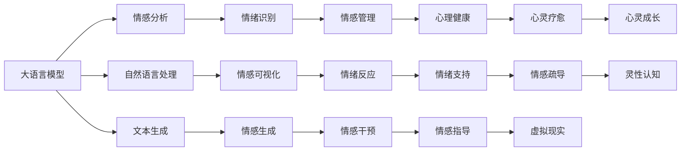
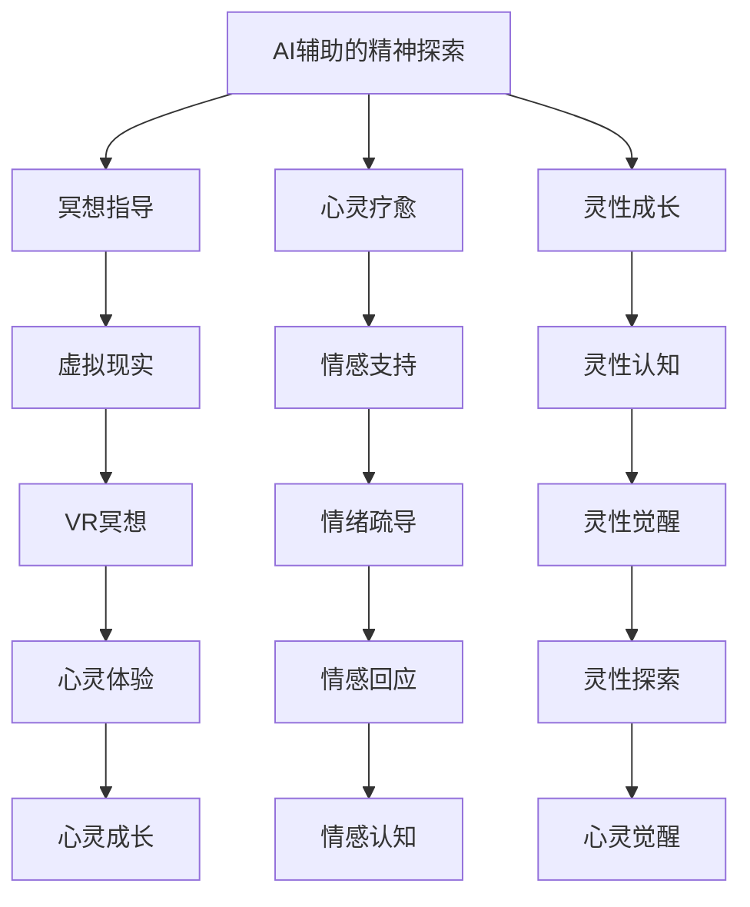

                 

# 数字化灵性：AI辅助的精神探索

> 关键词：人工智能,精神探索,数字文化,机器学习,深度学习,自然语言处理,情感计算

## 1. 背景介绍

### 1.1 问题由来
数字化时代的到来，将人类社会推向了一个新的发展阶段。人工智能(AI)技术正在以惊人的速度改变我们的生活方式和思维模式。从自动驾驶到智能推荐，从智慧医疗到虚拟助手，AI的应用几乎无所不在。然而，在数字化浪潮席卷全球的同时，一个更加深远的问题逐渐浮现出来：在数字化社会中，人的精神世界如何寻找其位置？如何在数字化的狂潮中保持人类的灵性？

### 1.2 问题核心关键点
本文聚焦于人工智能在精神探索中的应用，特别是如何利用AI技术辅助人类在数字化时代中保持精神健康和灵性成长。主要问题包括：
1. 人工智能在精神探索中的作用是什么？
2. 如何构建支持精神探索的数字化模型？
3. 如何在使用AI技术时保持人类的道德和伦理标准？
4. AI辅助精神探索的实际应用案例有哪些？
5. 未来AI在精神探索领域的发展趋势是什么？

### 1.3 问题研究意义
研究AI在精神探索中的应用，对于促进数字化时代人类的精神健康、提升生活质量、构建和谐社会具有重要意义：

1. 提升精神健康：AI技术可以通过分析用户的行为和情绪，提供个性化的心理健康服务，帮助人们更好地管理压力、焦虑等负面情绪。
2. 促进灵性成长：通过AI生成的虚拟现实(VR)体验和模拟练习，人们可以在虚拟环境中探索和体验不同的精神成长路径，提升自我认知和灵性觉醒。
3. 构建数字化文化：AI辅助的精神探索可以帮助人们更好地理解和接纳数字化的生活方式，促进数字文化的繁荣发展。
4. 提高生活质量：AI可以通过自动化和智能化的手段，帮助人们处理繁杂的工作和生活事务，腾出更多时间和精力专注于精神探索和灵性成长。
5. 构建和谐社会：AI技术可以在精神健康领域广泛应用，提升社会整体的幸福感，构建更加和谐、健康的社会环境。

## 2. 核心概念与联系

### 2.1 核心概念概述

为更好地理解AI在精神探索中的应用，本节将介绍几个密切相关的核心概念：

- **人工智能**：使用算法和计算技术模拟和扩展人类智能，包括但不限于深度学习、自然语言处理、机器视觉、情感计算等领域。
- **精神探索**：指在人类存在的层面上，探索生命意义、内心世界和存在感的过程。包括但不限于冥想、禅修、灵性成长、情绪管理等。
- **数字化**：指将传统的物理世界数据化、符号化、信息化的过程。包括但不限于数字化转型、数字文化、数字生活方式等。
- **情感计算**：指利用AI技术，分析和理解人类情感的动态变化，以及其对行为和认知的影响。
- **自然语言处理**：指使用AI技术理解和生成人类语言的过程，包括但不限于文本分析、语音识别、机器翻译等。
- **深度学习**：指利用神经网络模型，通过多层次的抽象和特征提取，实现复杂任务的学习和决策。

这些核心概念之间的逻辑关系可以通过以下Mermaid流程图来展示：

```mermaid
graph TB
    A[人工智能] --> B[深度学习]
    A --> C[自然语言处理]
    A --> D[情感计算]
    A --> E[精神探索]
    A --> F[数字化]
    B --> G[卷积神经网络]
    B --> H[递归神经网络]
    C --> I[文本分类]
    C --> J[情感分析]
    D --> K[情绪识别]
    D --> L[情感预测]
    E --> M[冥想指导]
    E --> N[心灵疗愈]
    E --> O[灵性成长]
    F --> P[数字文化]
    F --> Q[数字化转型]
    G --> R[图像识别]
    H --> S[语音合成]
    I --> T[文本生成]
    J --> U[情感可视化]
    K --> V[情绪反应]
    L --> W[情感管理]
    M --> X[虚拟现实]
    N --> Y[情感疏导]
    O --> Z[灵性觉醒]
    P --> [数字生活方式]
    Q --> [智能家居]
    R --> [图像分析]
    S --> [语音理解]
    T --> [自动翻译]
    U --> [情绪量化]
    V --> [情绪干预]
    W --> [心理健康]
    X --> [VR冥想]
    Y --> [情感支持]
    Z --> [灵性认知]
```

这个流程图展示了大语言模型微调过程中各个核心概念的关系和作用：

1. 人工智能通过深度学习、自然语言处理和情感计算等技术，模拟和扩展人类智能。
2. 情感计算和自然语言处理是大语言模型微调中的重要组成部分。
3. 数字化和数字文化是大语言模型微调应用的基础。
4. 精神探索通过冥想指导、心灵疗愈、灵性成长等过程，与AI技术紧密结合。

这些核心概念共同构成了数字化灵性探索的完整生态系统，使得AI技术能够在多个层面上，为人类提供精神探索的辅助和支持。

### 2.2 概念间的关系

这些核心概念之间存在着紧密的联系，形成了数字化灵性探索的完整生态系统。下面我通过几个Mermaid流程图来展示这些概念之间的关系。

#### 2.2.1 大语言模型在精神探索中的应用



这个流程图展示了大语言模型在情感分析、情感可视化、情感管理等方面的应用。

#### 2.2.2 AI辅助的精神探索模型



这个流程图展示了AI辅助的精神探索模型的构建过程。

#### 2.2.3 数字文化与AI精神探索

```mermaid
graph LR
    A[数字文化] --> B[数字化转型]
    A --> C[数字生活方式]
    A --> D[智能家居]
    B --> E[数字化环境]
    C --> F[智能生活]
    D --> G[智能家居]
    E --> H[数字环境]
    F --> I[智能家居]
    G --> J[智能设备]
    H --> K[数字信息]
    I --> L[智能家居]
    J --> M[智能环境]
    K --> N[数字信息]
    L --> O[智能家居]
    M --> P[智能环境]
    N --> Q[数字信息]
    O --> R[智能家居]
    P --> S[智能环境]
    Q --> T[数字信息]
    R --> U[智能家居]
    S --> V[智能环境]
    T --> W[数字信息]
    U --> X[智能家居]
    V --> Y[智能环境]
    W --> Z[数字信息]
    X --> [智能生活]
    Y --> [智能家居]
    Z --> [智能生活]
```

这个流程图展示了数字文化与AI精神探索的结合，从数字化转型到智能家居，再到数字生活方式的构建。

### 2.3 核心概念的整体架构

最后，我们用一个综合的流程图来展示这些核心概念在大语言模型微调过程中的整体架构：

```mermaid
graph TB
    A[大规模文本数据] --> B[预训练]
    B --> C[大语言模型]
    C --> D[微调]
    C --> E[情感计算]
    D --> F[情感分析]
    D --> G[文本生成]
    F --> H[情绪识别]
    G --> I[情感生成]
    H --> J[情感管理]
    I --> K[情感反应]
    J --> L[心理健康]
    K --> M[情感支持]
    L --> N[心灵疗愈]
    M --> O[情感疏导]
    N --> P[心灵成长]
    O --> Q[灵性认知]
    P --> R[VR冥想]
    Q --> S[心灵觉醒]
    R --> T[灵性探索]
    S --> U[心灵成长]
    T --> V[灵性认知]
    U --> W[心灵觉醒]
    V --> X[灵性探索]
    W --> Y[心灵成长]
    X --> Z[灵性认知]
    Y --> [数字化转型]
    Z --> [智能家居]
    AA[情感计算] --> BB[情感分析]
    BB --> CC[情绪识别]
    CC --> DD[情感管理]
    DD --> EE[情绪反应]
    EE --> FF[情感支持]
    FF --> GG[情感疏导]
    GG --> HH[心灵疗愈]
    HH --> II[心理健康]
    II --> JJ[心灵成长]
    JJ --> KK[灵性认知]
    KK --> LL[VR冥想]
    LL --> MM[心灵觉醒]
    MM --> NN[灵性探索]
    NN --> OO[心灵成长]
    OO --> PP[灵性认知]
    PP --> QQ[灵性觉醒]
    QQ --> RR[灵性探索]
    RR --> SS[心灵成长]
    SS --> TT[灵性认知]
    TT --> UU[心灵觉醒]
    UU --> VV[灵性探索]
    VV --> WW[心灵成长]
    WW --> XX[灵性认知]
    XX --> YY[VR冥想]
    YY --> ZZ[灵性觉醒]
    ZZ --> [数字化文化]
```

这个综合流程图展示了从预训练到微调，再到数字化文化构建的完整过程。大语言模型首先在大规模文本数据上进行预训练，然后通过微调（包括情感分析、文本生成等）进行任务适配，同时应用情感计算技术，最后与数字文化相结合，构建支持精神探索的数字化环境。 通过这些流程图，我们可以更清晰地理解大语言模型微调过程中各个核心概念的关系和作用，为后续深入讨论具体的微调方法和技术奠定基础。

## 3. 核心算法原理 & 具体操作步骤
### 3.1 算法原理概述

基于情感计算的大语言模型微调，本质上是一个有监督的情感分析与生成的过程。其核心思想是：将预训练的大语言模型视作一个强大的"情感分析器"和"情感生成器"，通过在情感标注数据上进行有监督地训练，使得模型能够输出情感相关的分析结果或生成情感丰富的文本。

形式化地，假设预训练模型为 $M_{\theta}$，其中 $\theta$ 为预训练得到的模型参数。给定情感标注数据集 $D=\{(x_i,y_i)\}_{i=1}^N$，每个样本 $(x_i)$ 为文本输入，标签 $y_i$ 为情感类别，如愤怒、悲伤、喜悦等。微调的目标是找到新的模型参数 $\hat{\theta}$，使得：

$$
\hat{\theta}=\mathop{\arg\min}_{\theta} \mathcal{L}(M_{\theta},D)
$$

其中 $\mathcal{L}$ 为针对情感分类或生成任务设计的损失函数，用于衡量模型预测输出与真实标签之间的差异。常见的损失函数包括交叉熵损失、均方误差损失等。

通过梯度下降等优化算法，微调过程不断更新模型参数 $\theta$，最小化损失函数 $\mathcal{L}$，使得模型输出逼近真实标签。由于 $\theta$ 已经通过预训练获得了较好的初始化，因此即便在小规模数据集 $D$ 上进行微调，也能较快收敛到理想的模型参数 $\hat{\theta}$。

### 3.2 算法步骤详解

基于情感计算的大语言模型微调一般包括以下几个关键步骤：

**Step 1: 准备预训练模型和数据集**
- 选择合适的预训练语言模型 $M_{\theta}$ 作为初始化参数，如 GPT、BERT 等。
- 准备情感标注数据集 $D$，划分为训练集、验证集和测试集。一般要求标注数据与预训练数据的分布不要差异过大。

**Step 2: 添加任务适配层**
- 根据任务类型，在预训练模型顶层设计合适的输出层和损失函数。
- 对于情感分类任务，通常在顶层添加线性分类器和交叉熵损失函数。
- 对于情感生成任务，通常使用语言模型的解码器输出概率分布，并以负对数似然为损失函数。

**Step 3: 设置微调超参数**
- 选择合适的优化算法及其参数，如 AdamW、SGD 等，设置学习率、批大小、迭代轮数等。
- 设置正则化技术及强度，包括权重衰减、Dropout、Early Stopping 等。
- 确定冻结预训练参数的策略，如仅微调顶层，或全部参数都参与微调。

**Step 4: 执行梯度训练**
- 将训练集数据分批次输入模型，前向传播计算损失函数。
- 反向传播计算参数梯度，根据设定的优化算法和学习率更新模型参数。
- 周期性在验证集上评估模型性能，根据性能指标决定是否触发 Early Stopping。
- 重复上述步骤直到满足预设的迭代轮数或 Early Stopping 条件。

**Step 5: 测试和部署**
- 在测试集上评估微调后模型 $M_{\hat{\theta}}$ 的性能，对比微调前后的效果提升。
- 使用微调后的模型对新文本进行情感分析或生成，集成到实际的应用系统中。
- 持续收集新的数据，定期重新微调模型，以适应数据分布的变化。

以上是基于情感计算的大语言模型微调的一般流程。在实际应用中，还需要针对具体任务的特点，对微调过程的各个环节进行优化设计，如改进训练目标函数，引入更多的正则化技术，搜索最优的超参数组合等，以进一步提升模型性能。

### 3.3 算法优缺点

基于情感计算的大语言模型微调方法具有以下优点：
1. 实时性强。微调过程在数据集较小的情况下，也能较快完成，能够快速响应用户情感需求。
2. 泛化能力强。通过情感计算的引入，模型能够适应各种情感表达方式，具备较强的泛化能力。
3. 情感细腻。情感计算能够捕捉人类情感的细微变化，使得情感分析或生成的结果更加真实和细腻。
4. 个性化支持。通过情感计算，可以生成个性化的情感响应，满足用户的情感表达需求。

同时，该方法也存在一定的局限性：
1. 数据依赖。微调效果很大程度上取决于标注数据的质量和数量，获取高质量标注数据的成本较高。
2. 训练复杂。情感计算涉及多模态数据的融合，训练过程较为复杂，需要丰富的标注和处理技术支持。
3. 伦理风险。情感计算可能涉及隐私和伦理问题，如情感数据的泄露和滥用。
4. 可解释性不足。情感计算的输出缺乏可解释性，难以解释模型内部决策过程。

尽管存在这些局限性，但就目前而言，基于情感计算的大语言模型微调方法仍是大规模情感处理和生成的重要手段。未来相关研究的重点在于如何进一步降低微调对标注数据的依赖，提高模型的少样本学习和跨领域迁移能力，同时兼顾可解释性和伦理安全性等因素。

### 3.4 算法应用领域

基于情感计算的大语言模型微调方法在多个领域都具有广泛的应用前景，例如：

- **心理健康**：通过情感分析，识别用户的心理状态，提供心理健康服务。
- **情感辅导**：生成情感丰富的文本，用于情感辅导和支持。
- **社交媒体管理**：分析社交媒体上的情感趋势，优化用户互动体验。
- **广告营销**：生成情感丰富的广告文案，提升广告效果。
- **智能客服**：分析用户情感，提供个性化的客户服务。
- **教育培训**：生成情感丰富的教育材料，提升学习体验。

除了上述这些应用领域外，情感计算在医疗、娱乐、智能家居等更多场景中也有着广阔的应用前景，为人们的日常生活提供了更多的情感支持和精神探索的可能性。

## 4. 数学模型和公式 & 详细讲解 & 举例说明

### 4.1 数学模型构建

本节将使用数学语言对基于情感计算的大语言模型微调过程进行更加严格的刻画。

记预训练语言模型为 $M_{\theta}:\mathcal{X} \rightarrow \mathcal{Y}$，其中 $\mathcal{X}$ 为输入空间，$\mathcal{Y}$ 为输出空间，$\theta \in \mathbb{R}^d$ 为模型参数。假设微调任务的训练集为 $D=\{(x_i,y_i)\}_{i=1}^N, x_i \in \mathcal{X}, y_i \in \mathcal{Y}$。

定义模型 $M_{\theta}$ 在输入 $x$ 上的输出为 $\hat{y}=M_{\theta}(x) \in [0,1]$，表示样本属于情感类别的概率。真实标签 $y \in \{1,0\}$。则情感分类任务中的交叉熵损失函数定义为：

$$
\ell(M_{\theta}(x),y) = -[y\log \hat{y} + (1-y)\log(1-\hat{y})]
$$

将其代入经验风险公式，得：

$$
\mathcal{L}(\theta) = -\frac{1}{N}\sum_{i=1}^N [y_i\log M_{\theta}(x_i)+(1-y_i)\log(1-M_{\theta}(x_i))]
$$

在实践中，我们通常使用基于梯度的优化算法（如AdamW、SGD等）来近似求解上述最优化问题。设 $\eta$ 为学习率，$\lambda$ 为正则化系数，则参数的更新公式为：

$$
\theta \leftarrow \theta - \eta \nabla_{\theta}\mathcal{L}(\theta) - \eta\lambda\theta
$$

其中 $\nabla_{\theta}\mathcal{L}(\theta)$ 为损失函数对参数 $\theta$ 的梯度，可通过反向传播算法高效计算。

### 4.2 公式推导过程

以下我们以二分类任务为例，推导交叉熵损失函数及其梯度的计算公式。

假设模型 $M_{\theta}$ 在输入 $x$ 上的输出为 $\hat{y}=M_{\theta}(x) \in [0,1]$，表示样本属于正类的概率。真实标签 $y \in \{0,1\}$。则二分类交叉熵损失函数定义为：

$$
\ell(M_{\theta}(x),y) = -[y\log \hat{y} + (1-y)\log(1-\hat{y})]
$$

将其代入经验风险公式，得：

$$
\mathcal{L}(\theta) = -\frac{1}{N}\sum_{i=1}^N [y_i\log M_{\theta}(x_i)+(1-y_i)\log(1-M_{\theta}(x_i))]
$$

根据链式法则，损失函数对参数 $\theta_k$ 的梯度为：

$$
\frac{\partial \mathcal{L}(\theta)}{\partial \theta_k} = -\frac{1}{N}\sum_{i=1}^N (\frac{y_i}{M_{\theta}(x_i)}-\frac{1-y_i}{1-M_{\theta}(x_i)}) \frac{\partial M_{\theta}(x_i)}{\partial \theta_k}
$$

其中 $\frac{\partial M_{\theta}(x_i)}{\partial \theta_k}$ 可进一步递归展开，利用自动微分技术完成计算。

在得到损失函数的梯度后，即可带入参数更新公式，完成模型的迭代优化。重复上述过程直至收敛，最终得到适应情感分类任务的最优模型参数 $\theta^*$。

### 4.3 案例分析与讲解

以情感分类任务为例，我们来看一下具体的应用场景。假设我们有一个情感标注数据集，其中包含大量用户评论，每个评论都标注了其情感倾向（愤怒、悲伤、喜悦等）。我们可以使用基于情感计算的微调方法，将预训练的BERT模型作为初始化参数，通过标注数据对其进行微调。

首先，我们需要将数据集划分为训练集、验证集和测试集。然后，设计情感分类任务的输出层和损失函数。输出层通常是一个线性层，连接一个Softmax层，用于将模型输出转化为情感类别的概率分布。损失函数一般采用交叉熵损失，衡量模型输出与真实标签的差异。

接着，我们需要选择合适的超参数。一般来说，学习率需要设置在较低的值，避免过拟合。优化器可以选择AdamW，因为它能够自适应地调整学习率。同时，为了防止过拟合，我们需要引入正则化技术，如L2正则、Dropout等。

最后，我们执行梯度训练。将训练集数据分批次输入模型，前向传播计算损失函数，反向传播计算参数梯度，根据设定的优化算法和学习率更新模型参数。周期性在验证集上评估模型性能，根据性能指标决定是否触发Early Stopping。重复上述步骤直到满足预设的迭代轮数或Early Stopping条件。

在测试集上评估微调后模型 $M_{\hat{\theta}}$ 的性能，对比微调前后的效果提升。使用微调后的模型对新评论进行情感分析，集成到实际的应用系统中，如社交媒体情感分析、情感辅导等。

## 5. 项目实践：代码实例和详细解释说明

### 5.1 开发环境搭建

在进行情感计算的微调实践前，我们需要准备好开发环境。以下是使用Python进行PyTorch开发的环境配置流程：

1. 安装Anaconda：从官网下载并安装Anaconda，用于创建独立的Python环境。

2. 创建并激活虚拟环境：
```bash
conda create -n pytorch-env python=3.8 
conda activate pytorch-env
```

3. 安装PyTorch：根据CUDA版本，从官网获取对应的安装命令。例如：
```bash
conda install pytorch torchvision torchaudio cudatoolkit=11.1 -c pytorch -c conda-forge
```

4. 安装Transformers库：
```bash
pip install transformers
```

5. 安装各类工具包：
```bash
pip install numpy pandas scikit-learn matplotlib tqdm jupyter notebook ipython
```

完成上述步骤后，即可在`pytorch-env`环境中开始情感计算的微调实践。

### 5.2 源代码详细实现

下面我们以情感分类任务为例，给出使用Transformers库对BERT模型进行情感分类微调的PyTorch代码实现。

首先，定义情感分类任务的数据处理函数：

```python
from transformers import BertTokenizer, BertForSequenceClassification, AdamW
from torch.utils.data import Dataset, DataLoader
import torch

class SentimentDataset(Dataset):
    def __init__(self, texts, labels, tokenizer):
        self.texts = texts
        self.labels = labels
        self.tokenizer = tokenizer
        
    def __len__(self):
        return len(self.texts)
    
    def __getitem__(self, item):
        text = self.texts[item]
        label = self.labels[item]
        
        encoding = self.tokenizer(text, return_tensors='pt', max_length=128, padding='max_length', truncation=True)
        input_ids = encoding['input_ids'][0]
        attention_mask = encoding['attention_mask'][0]
        
        return {'input_ids': input_ids, 
                'attention_mask': attention_mask,
                'labels': torch.tensor(label, dtype=torch.long)}
```

然后，定义模型和优化器：

```python
tokenizer = BertTokenizer.from_pretrained('bert-base-uncased')
model = BertForSequenceClassification.from_pretrained('bert-base-uncased', num_labels=3)

optimizer = AdamW(model.parameters(), lr=2e-5)
```

接着，定义训练和评估函数：

```python
device = torch.device('cuda') if torch.cuda.is_available() else torch.device('cpu')
model.to(device)

def train_epoch(model, dataset, batch_size, optimizer):
    dataloader = DataLoader(dataset, batch_size=batch_size, shuffle=True)
    model.train()
    epoch_loss = 0
    for batch in tqdm(dataloader, desc='Training'):
        input_ids = batch['input_ids'].to(device)
        attention_mask = batch['attention_mask'].to(device)
        labels = batch['labels'].to(device)
        model.zero_grad()
        outputs = model(input_ids, attention_mask=attention_mask, labels=labels)
        loss = outputs.loss
        epoch_loss += loss.item()
        loss.backward()
        optimizer.step()
    return epoch_loss / len(dataloader)

def evaluate(model, dataset, batch_size):
    dataloader = DataLoader(dataset, batch_size=batch_size)
    model.eval()
    preds, labels = [], []
    with torch.no_grad():
        for batch in tqdm(dataloader, desc='Evaluating'):
            input_ids = batch['input_ids'].to(device)
            attention_mask = batch['attention_mask'].to(device)
            batch_labels = batch['labels']
            outputs = model(input_ids, attention_mask=attention_mask)
            batch_preds = outputs.logits.argmax(dim=2

