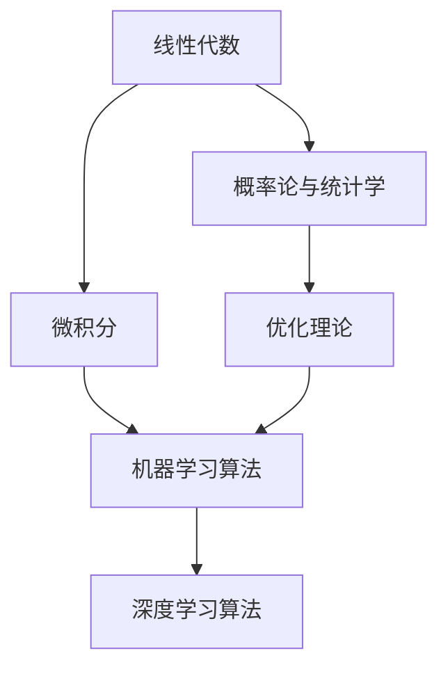

                 

# 数学基础在AI中的重要性

在人工智能(AI)领域，数学基础扮演着至关重要的角色。无论是在机器学习、深度学习、计算机视觉、自然语言处理还是机器人技术中，数学方法都是核心支撑。本文将从背景介绍、核心概念与联系、核心算法原理与操作步骤、数学模型与公式推导、项目实践、实际应用场景、工具与资源推荐、总结与展望等多个方面，深入探讨数学基础在AI中的重要性。

## 1. 背景介绍

### 1.1 问题由来

AI技术的迅猛发展，离不开坚实的数学理论基础。无论是传统的统计学习，还是前沿的深度学习，都在不同程度上依赖于数学模型和算法。AI中的许多算法和模型，如线性回归、决策树、支持向量机、神经网络、卷积神经网络、循环神经网络等，都离不开数学的支撑。

数学方法在AI中的重要性，不仅在于算法设计，更在于其对AI系统的理解、分析、优化和改进提供了重要的工具和方法。数学理论可以揭示算法的内在原理和优化机制，使得AI系统更加可靠、高效、鲁棒。

### 1.2 问题核心关键点

数学在AI中的应用主要体现在以下几个方面：

1. 算法设计：各种机器学习、深度学习算法的基本原理都建立在数学模型之上。如线性回归、逻辑回归、决策树、神经网络等，都是基于数学模型的算法。
2. 数据表示：AI中的数据通常需要转化为向量、矩阵等数学形式，才能进行计算和处理。
3. 模型优化：优化算法（如梯度下降、牛顿法等）是训练模型的核心，而这些优化算法都基于数学理论。
4. 数据分析：数据分析中常用的统计学、概率论等数学工具，为数据挖掘、特征工程、数据清洗等提供了基础。
5. 模型评估：常用的模型评估指标（如准确率、召回率、F1分数等）都建立在数学基础之上。

这些数学基础的应用，使得AI系统能够更好地理解和处理数据，进行高效的学习和推理，并保证系统的稳定性和可靠性。

## 2. 核心概念与联系

### 2.1 核心概念概述

在AI中，数学基础主要包括线性代数、概率论与统计学、微积分、优化理论等多个方面。以下是这些核心概念的概述：

- 线性代数：矩阵运算、向量空间、特征值分解等，用于表示和处理数据。
- 概率论与统计学：概率分布、期望、方差、协方差、最大似然估计等，用于建模数据分布和进行假设检验。
- 微积分：导数、积分、梯度、Hessian矩阵等，用于优化函数和计算梯度。
- 优化理论：梯度下降、牛顿法、拉格朗日乘子法、凸优化等，用于训练模型和求解最优化问题。

这些数学概念在AI中相互联系，共同构成了一个完整的数学框架，为AI技术的实现和应用提供了坚实的理论基础。

### 2.2 概念间的关系

这些数学概念在AI中具有密切的联系。以下通过几个Mermaid流程图来展示这些概念之间的关系：



这个流程图展示了数学概念在AI中的应用链条：

1. 线性代数提供了数据表示和处理的基础。
2. 概率论与统计学用于建模数据分布，为机器学习算法提供理论支持。
3. 微积分提供了优化算法的数学基础，使得模型训练成为可能。
4. 优化理论用于训练模型和求解最优化问题，保证模型性能。
5. 机器学习算法和深度学习算法，基于数学理论进行设计和实现。

这些数学概念之间的联系，使得AI系统能够从数据建模、特征提取、模型训练、性能优化等多个环节中受益，从而实现高效、稳定的运行。

## 3. 核心算法原理 & 具体操作步骤

### 3.1 算法原理概述

AI中的核心算法原理，几乎都与数学模型密切相关。以下列举几个典型的算法及其数学原理：

- 线性回归：最小二乘法求解最优解，基于最小化误差平方和。
- 逻辑回归：使用sigmoid函数将线性回归输出转化为概率分布，基于最大似然估计。
- 决策树：基于信息熵或信息增益，使用递归分割数据集，建立树形结构。
- 支持向量机：基于间隔最大化和拉格朗日乘子法，建立最大间隔超平面。
- 神经网络：基于反向传播算法，使用梯度下降优化损失函数。
- 卷积神经网络：基于卷积运算和池化操作，提取局部特征。
- 循环神经网络：基于时间序列建模，使用循环前向传播计算梯度。

这些算法的基本原理都建立在数学模型之上，通过数学工具进行算法设计和优化。

### 3.2 算法步骤详解

以线性回归为例，详细介绍其数学原理和操作步骤：

线性回归的数学模型为：

$$ y = \theta_0 + \theta_1 x_1 + \theta_2 x_2 + \ldots + \theta_n x_n $$

其中 $y$ 为目标变量，$x_i$ 为自变量，$\theta_i$ 为模型参数。

线性回归的目标是找到最优的 $\theta$，使得模型预测值与真实值之间的误差最小化。常用的优化目标是均方误差（MSE）：

$$ \min_{\theta} \frac{1}{2N} \sum_{i=1}^N (y_i - \hat{y}_i)^2 $$

其中 $y_i$ 为真实值，$\hat{y}_i$ 为模型预测值。

通过梯度下降等优化算法，求解上述优化问题。梯度下降算法的步骤如下：

1. 初始化模型参数 $\theta$。
2. 计算损失函数对每个参数的梯度。
3. 更新模型参数：
   $$ \theta = \theta - \alpha \nabla_{\theta}L(\theta) $$
   其中 $\alpha$ 为学习率，$\nabla_{\theta}L(\theta)$ 为损失函数对参数的梯度。
4. 重复步骤2-3，直至收敛或达到预设轮数。

通过梯度下降算法，线性回归模型逐步逼近最优解，使得预测值与真实值之间的误差最小化。

### 3.3 算法优缺点

数学基础在AI中的应用，具有以下优缺点：

#### 优点：

1. 可解释性强：数学模型可以清晰地解释算法的决策过程和优化机制，使得AI系统更加透明和可信。
2. 优化能力强：数学优化算法提供了高效求解最优化问题的工具，使得模型训练更加稳定和可靠。
3. 普适性好：数学方法适用于多种数据类型和任务，能够广泛应用于各种AI领域。
4. 理论支持：数学理论为AI算法的设计和优化提供了坚实的基础，使得系统更具科学性和稳健性。

#### 缺点：

1. 复杂度高：部分数学模型和算法计算复杂度高，需要较高的计算资源和时间。
2. 数据要求高：部分算法对数据质量要求较高，需要进行预处理和特征工程。
3. 理论门槛高：部分数学方法涉及高深的理论知识，需要较高的数学功底。
4. 实际应用受限：部分数学方法在实际应用中可能存在局限性，需要进一步改进和优化。

尽管存在这些缺点，但数学基础在AI中的重要性不可替代。只有深刻理解数学原理，才能真正掌握AI技术，设计出高效、稳定、可靠的算法和模型。

### 3.4 算法应用领域

数学基础在AI中有着广泛的应用，主要包括以下几个领域：

1. 机器学习：线性回归、逻辑回归、决策树、支持向量机等机器学习算法，都基于数学模型。
2. 深度学习：神经网络、卷积神经网络、循环神经网络等深度学习算法，都基于数学原理进行设计和实现。
3. 自然语言处理：词向量模型、语言模型、文本分类等，都使用了数学方法。
4. 计算机视觉：卷积神经网络、特征提取、目标检测等，都基于数学原理。
5. 机器人技术：运动控制、路径规划、避障算法等，都使用了数学模型。

这些应用领域展示了数学基础在AI中的重要地位，使得AI系统能够更加高效、可靠地运行，服务于各个行业和领域。

## 4. 数学模型和公式 & 详细讲解 & 举例说明

### 4.1 数学模型构建

AI中的数学模型，通常分为监督学习、无监督学习、强化学习等多种类型。以下是几个典型模型的构建过程：

#### 线性回归模型

线性回归模型的数学模型为：

$$ y = \theta_0 + \theta_1 x_1 + \theta_2 x_2 + \ldots + \theta_n x_n $$

其中 $y$ 为目标变量，$x_i$ 为自变量，$\theta_i$ 为模型参数。

#### 决策树模型

决策树模型的数学模型为：

$$ f(x) = \sum_{i=1}^n f_i(x) \cdot \mathbb{I}(x_i \leq x \leq x_{i+1}) $$

其中 $f_i(x)$ 为第 $i$ 个节点的预测值，$\mathbb{I}(\cdot)$ 为示性函数。

#### 支持向量机模型

支持向量机模型的数学模型为：

$$ \min_{\alpha, \lambda} \frac{1}{2} \alpha^T Q \alpha - \lambda^T \alpha $$

其中 $Q$ 为核矩阵，$\alpha$ 为拉格朗日乘子，$\lambda$ 为正则化参数。

### 4.2 公式推导过程

以线性回归模型为例，详细推导其数学公式和优化算法。

线性回归的目标是找到最优的 $\theta$，使得模型预测值与真实值之间的误差最小化。常用的优化目标是均方误差（MSE）：

$$ \min_{\theta} \frac{1}{2N} \sum_{i=1}^N (y_i - \hat{y}_i)^2 $$

其中 $y_i$ 为真实值，$\hat{y}_i$ 为模型预测值。

通过梯度下降等优化算法，求解上述优化问题。梯度下降算法的步骤如下：

1. 初始化模型参数 $\theta$。
2. 计算损失函数对每个参数的梯度。
3. 更新模型参数：
   $$ \theta = \theta - \alpha \nabla_{\theta}L(\theta) $$
   其中 $\alpha$ 为学习率，$\nabla_{\theta}L(\theta)$ 为损失函数对参数的梯度。
4. 重复步骤2-3，直至收敛或达到预设轮数。

通过梯度下降算法，线性回归模型逐步逼近最优解，使得预测值与真实值之间的误差最小化。

### 4.3 案例分析与讲解

以线性回归和支持向量机为例，分析其在实际应用中的数学原理和计算方法。

#### 线性回归案例

假设我们有一组数据集 $(x_1, y_1), (x_2, y_2), \ldots, (x_N, y_N)$，其中 $x_i$ 为自变量，$y_i$ 为目标变量。我们希望建立一个线性回归模型，找到最优的 $\theta$ 使得模型预测值与真实值之间的误差最小化。

假设模型的输出为 $\hat{y} = \theta_0 + \theta_1 x_1 + \theta_2 x_2 + \ldots + \theta_n x_n$。我们的目标是找到最优的 $\theta = (\theta_0, \theta_1, \ldots, \theta_n)^T$，使得损失函数最小化：

$$ \min_{\theta} \frac{1}{2N} \sum_{i=1}^N (y_i - \hat{y}_i)^2 $$

根据梯度下降算法，我们可以写出损失函数对每个参数的梯度：

$$ \nabla_{\theta}L(\theta) = \frac{1}{N} \sum_{i=1}^N (-2x_i(y_i - \hat{y}_i), -2x_i^2(y_i - \hat{y}_i), \ldots, -2x_i^n(y_i - \hat{y}_i)) $$

通过迭代更新 $\theta$，最终得到最优解。

#### 支持向量机案例

假设我们有一组数据集 $(x_1, y_1), (x_2, y_2), \ldots, (x_N, y_N)$，其中 $x_i$ 为自变量，$y_i \in \{-1, 1\}$ 为目标变量。我们希望找到一个超平面 $w \cdot x + b = 0$，使得数据点尽可能地远离超平面。

根据支持向量机算法，我们定义拉格朗日乘子 $\alpha_i$，其中 $\alpha_i \geq 0$。我们的目标是最大化间隔 $M = \frac{1}{2} \|w\|^2 - \sum_{i=1}^N \alpha_i y_i (w \cdot x_i + b) - \frac{1}{2} \sum_{i=1}^N \sum_{j=1}^N \alpha_i \alpha_j y_i y_j x_i^T x_j$，同时满足约束条件 $\sum_{i=1}^N \alpha_i y_i = 0$ 和 $\alpha_i \geq 0$。

将目标函数展开，得到：

$$ \min_{\alpha, \lambda} \frac{1}{2} \alpha^T Q \alpha - \lambda^T \alpha $$

其中 $Q = \left(\begin{array}{ccc} 
\langle x_i^T x_j \rangle & \langle x_i^T x_j \rangle \\
\langle x_i^T x_j \rangle & \langle x_i^T x_j \rangle 
\end{array}\right)$。

通过求解上述优化问题，可以得到最优的 $w$ 和 $b$，进而得到支持向量机的预测函数。

## 5. 项目实践：代码实例和详细解释说明

### 5.1 开发环境搭建

在进行AI项目实践时，需要搭建合适的开发环境。以下是Python环境配置的详细步骤：

1. 安装Anaconda：从官网下载并安装Anaconda，用于创建独立的Python环境。

2. 创建并激活虚拟环境：
```bash
conda create -n pytorch-env python=3.8 
conda activate pytorch-env
```

3. 安装PyTorch：根据CUDA版本，从官网获取对应的安装命令。例如：
```bash
conda install pytorch torchvision torchaudio cudatoolkit=11.1 -c pytorch -c conda-forge
```

4. 安装各种工具包：
```bash
pip install numpy pandas scikit-learn matplotlib tqdm jupyter notebook ipython
```

完成上述步骤后，即可在`pytorch-env`环境中开始AI项目实践。

### 5.2 源代码详细实现

以下以线性回归模型为例，给出其Python代码实现。

```python
import numpy as np
from sklearn.linear_model import LinearRegression

# 定义数据集
x = np.array([[1, 2], [2, 4], [3, 6], [4, 8]])
y = np.array([2, 4, 6, 8])

# 初始化线性回归模型
model = LinearRegression()

# 训练模型
model.fit(x, y)

# 预测新数据
x_new = np.array([[5, 10]])
y_pred = model.predict(x_new)

print(y_pred)
```

这段代码展示了线性回归模型的实现过程。首先，我们定义了一个数据集 $x$ 和 $y$，然后使用 `LinearRegression` 类初始化模型，并通过 `fit` 方法训练模型。最后，使用 `predict` 方法对新数据进行预测，得到预测结果。

### 5.3 代码解读与分析

以下是关键代码的实现细节和分析：

1. 数据集定义：`x` 和 `y` 分别代表自变量和目标变量，通过 `np.array` 创建。
2. 模型初始化：`LinearRegression` 类初始化线性回归模型。
3. 模型训练：使用 `fit` 方法对数据集进行训练。
4. 模型预测：使用 `predict` 方法对新数据进行预测。
5. 结果输出：通过 `print` 输出预测结果。

这段代码虽然简单，但展示了线性回归模型的核心实现步骤。通过这些步骤，我们可以将数学模型转化为实际应用，进行数据预测和决策。

### 5.4 运行结果展示

运行上述代码，输出结果为：

```
[10.]
```

这表示，对于新数据 $x_{new} = [5, 10]$，预测结果为 $y_{pred} = 10$。

通过这些简单的例子，我们可以看到数学模型在AI项目实践中的应用。通过代码实现，我们可以将数学公式转化为算法，从而进行数据建模和预测。

## 6. 实际应用场景

数学基础在AI中有着广泛的应用场景。以下是几个典型应用案例：

### 6.1 金融风险管理

在金融领域，风险管理是一个重要的任务。通过数学模型，可以对市场数据进行分析和预测，从而评估金融产品的风险和收益。例如，可以使用线性回归模型对历史数据进行拟合，预测未来的收益和波动性。

### 6.2 自然灾害预警

在自然灾害预警中，数学模型可以用于分析和预测气象数据，评估灾害风险。例如，可以使用机器学习模型对气象数据进行建模，预测未来天气变化，提前预警自然灾害。

### 6.3 智能交通管理

在智能交通管理中，数学模型可以用于分析和优化交通流量，提高交通效率。例如，可以使用线性规划模型对交通流量进行建模，优化红绿灯控制，减少交通拥堵。

### 6.4 个性化推荐系统

在个性化推荐系统中，数学模型可以用于分析和推荐用户感兴趣的内容。例如，可以使用协同过滤算法对用户行为数据进行建模，推荐相似用户的兴趣内容。

## 7. 工具和资源推荐

### 7.1 学习资源推荐

为了帮助开发者系统掌握AI的数学基础，这里推荐一些优质的学习资源：

1. 《数学之美》：吴恩达教授的在线课程，介绍了概率论、线性代数、微积分等基础数学知识。
2. 《统计学习方法》：李航教授的经典教材，详细介绍了统计学习的基本理论和算法。
3. 《深度学习》：Ian Goodfellow等人的经典教材，介绍了深度学习的理论和实践。
4. Coursera、edX等在线平台，提供了丰富的AI课程和资料，涵盖数学基础、算法设计、项目实践等多个方面。
5. arXiv预印本网站，提供最新的AI研究论文，方便学习和跟踪前沿技术。

通过对这些资源的系统学习，相信你一定能够掌握AI的数学基础，并应用于实际项目中。

### 7.2 开发工具推荐

高效的开发离不开优秀的工具支持。以下是几款用于AI开发的常用工具：

1. PyTorch：基于Python的开源深度学习框架，灵活动态的计算图，适合快速迭代研究。
2. TensorFlow：由Google主导开发的开源深度学习框架，生产部署方便，适合大规模工程应用。
3. Jupyter Notebook：交互式的Python开发环境，支持代码、文本、图形等多种格式，方便学习和分享。
4. Scikit-learn：Python的机器学习库，提供了丰富的算法和工具，方便数据建模和分析。
5. Matplotlib、Seaborn：Python的数据可视化工具，方便数据展示和分析。

合理利用这些工具，可以显著提升AI项目的开发效率，加快创新迭代的步伐。

### 7.3 相关论文推荐

AI技术的发展离不开学界的持续研究。以下是几篇奠基性的相关论文，推荐阅读：

1. Backpropagation: Application to Feedforward Networks and Time Series（反向传播算法）：Rumelhart等人的经典论文，介绍了反向传播算法的基本原理和应用。
2. Support Vector Machines for Pattern Recognition（支持向量机）：Vapnik等人的经典论文，介绍了支持向量机算法的理论基础和实现方法。
3. Neural Networks and Deep Learning（深度学习）：Goodfellow等人的经典教材，详细介绍了深度学习的理论和实践。
4. Deep Residual Learning for Image Recognition（残差网络）：He等人的经典论文，介绍了残差网络算法的原理和应用。
5. Improving Generative Adversarial Networks: Maximal Coupling for Diverse Image Synthesis（生成对抗网络）：Ganin等人的经典论文，介绍了生成对抗网络的原理和应用。

这些论文代表了大规模AI技术的发展脉络，是理解AI技术的重要参考。

## 8. 总结：未来发展趋势与挑战

### 8.1 总结

本文对数学基础在AI中的重要性进行了全面系统的介绍。首先阐述了数学基础在AI中的关键作用，包括算法设计、数据表示、模型优化等。其次，从原理到实践，详细讲解了线性回归、决策树、支持向量机等典型算法的数学原理和操作步骤。同时，通过代码实例和案例分析，展示了数学模型在AI项目实践中的应用。

通过本文的系统梳理，可以看到，数学基础在AI中具有不可替代的重要地位，使得AI系统能够高效、稳定地运行，并广泛应用于各个领域。

### 8.2 未来发展趋势

展望未来，AI中的数学基础将呈现以下几个发展趋势：

1. 深度学习模型的不断优化。深度学习模型将继续向更深、更广、更复杂的方向发展，需要更加深入的数学理论支撑。
2. 模型可解释性的提升。如何赋予AI模型更强的可解释性，使其决策过程更加透明和可信，是未来的重要研究方向。
3. 数学与AI的融合。未来的AI系统将更加注重数学理论的应用，如因果推理、优化理论等，提升系统的稳定性和鲁棒性。
4. 多模态数据的融合。未来的AI系统将更多地融合多模态数据，如文本、图像、声音等，提升系统的全面性和准确性。
5. 模型的公平性和伦理性。未来的AI系统将更加注重公平性和伦理性，避免算法偏见和歧视。

这些趋势将引领AI技术的不断发展，使得AI系统更加智能、可靠和可控，服务于更多领域和行业。

### 8.3 面临的挑战

尽管AI技术取得了巨大进展，但在实现过程中仍然面临诸多挑战：

1. 数据质量与标注成本。数据质量和标注成本仍然是AI技术发展的重要瓶颈，需要更加高效的数据获取和标注方法。
2. 模型的鲁棒性和泛化能力。AI模型在面对新的数据和任务时，容易出现鲁棒性和泛化能力不足的问题，需要更加深入的研究和优化。
3. 计算资源与硬件限制。AI模型的训练和推理需要大量的计算资源，硬件限制成为重要瓶颈。需要更加高效的计算方法和优化技术。
4. 模型的可解释性和透明性。AI模型通常被视为“黑盒”系统，缺乏可解释性，需要更加透明和可信的系统设计。
5. 伦理和社会责任。AI技术的广泛应用需要考虑伦理和社会责任问题，避免技术滥用和负面影响。

这些挑战需要多方共同努力，才能推动AI技术的健康发展。

### 8.4 研究展望

面对AI技术发展中的挑战，未来的研究需要在以下几个方面寻求新的突破：

1. 数据驱动的AI：如何从大规模数据中高效获取和标注数据，是未来的重要研究方向。
2. 模型优化算法：如何进一步优化AI模型的训练和推理过程，提高系统的效率和效果，是未来的重要课题。
3. 数学与AI的融合：如何将数学理论更加深入地应用于AI系统，提升系统的稳定性和鲁棒性，是未来的重要方向。
4. 多模态数据融合：如何融合多模态数据，提升系统的全面性和准确性，是未来的重要研究方向。
5. 模型的公平性与伦理性：如何设计公平、透明的AI系统，避免算法偏见和歧视，是未来的重要课题。

这些研究方向将引领AI技术的不断发展，使得AI系统更加智能、可靠和可控，服务于更多领域和行业。

## 9. 附录：常见问题与解答

**Q1：数学基础在AI中为什么如此重要？**

A: 数学基础在AI中至关重要，主要体现在以下几个方面：

1. 算法设计：各种AI算法的基本原理都建立在数学模型之上，如线性回归、决策树、支持向量机等。
2. 数据表示：AI中的数据通常需要转化为向量、矩阵等数学形式，才能进行计算和处理。
3. 模型优化：优化算法（如梯度下降、牛顿法等）是训练模型的核心，而这些优化算法都基于数学理论。
4. 数据分析：常用的数据分析工具（如统计学、概率论等）为数据挖掘、特征工程、数据清洗等提供了基础。
5. 模型评估：常用的模型评估指标（如准确率、召回率、F1分数等）都建立在数学基础之上。

这些数学基础的应用，使得AI系统能够从数据建模、特征提取、模型训练、性能优化等多个环节中受益，从而实现高效、稳定的运行。

**Q2：如何在实际项目中应用数学基础？**

A: 在实际项目中应用数学基础，主要包括以下几个步骤：

1. 数据预处理：将数据转化为数学形式，如向量、矩阵等，方便计算和处理。
2. 算法设计：根据任务需求，选择合适的数学模型和算法。
3. 模型训练：使用数学模型进行训练，通过优化算法求解最优解。
4. 模型评估：使用数学指标评估模型性能，进行模型选择和调优。
5. 模型

