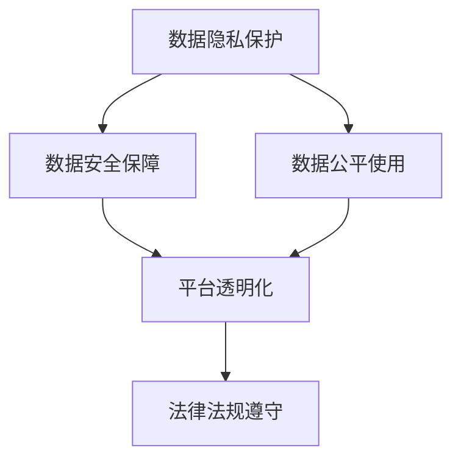
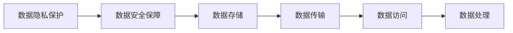
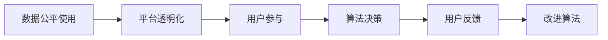
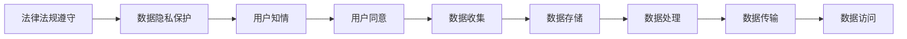
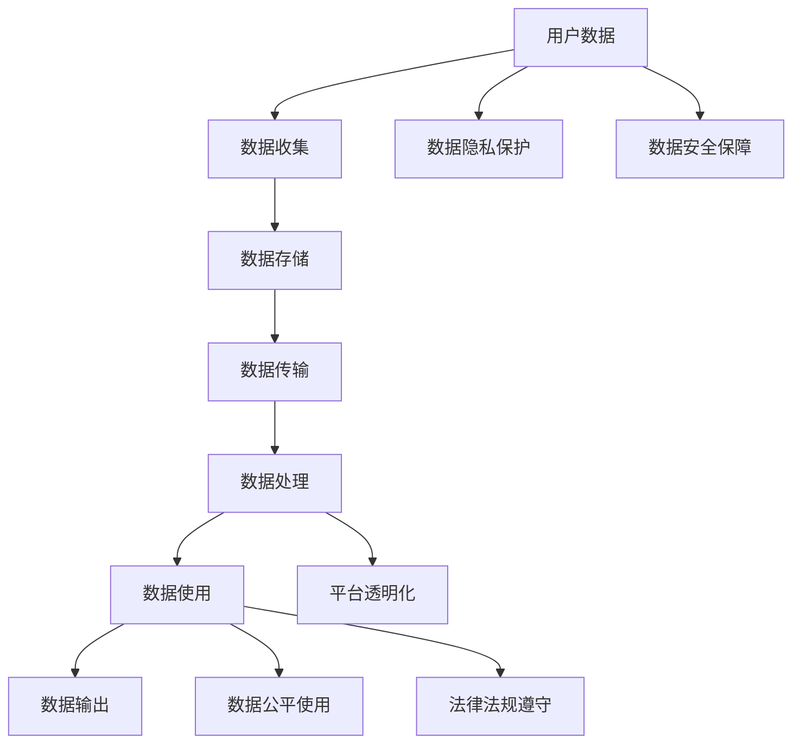

                 

## 1. 背景介绍

在数字化浪潮下，数据日益成为一种宝贵的资源。平台和企业在数据收集、存储、分析和应用过程中扮演着重要角色。然而，随着数据量的激增，数据伦理和平台责任问题逐渐浮出水面。如何在充分利用数据价值的同时，保障用户隐私、数据安全和公平性，构建负责任的平台，已成为行业关注的焦点。

### 1.1 问题由来
数字化转型为各行各业带来了前所未有的机遇，但同时也带来了新的挑战。一方面，数据驱动决策、优化运营、提升用户体验等成为企业竞争力的重要手段；另一方面，数据滥用、隐私泄露、数据偏见等现象也引发了广泛关注和争议。

数据伦理和平台责任问题涉及多个维度，包括：

- **数据隐私保护**：如何保障用户隐私不被侵犯，防止个人数据被不当使用。
- **数据安全防护**：如何确保数据在传输和存储过程中的安全，防止数据泄露和破坏。
- **数据公平性**：如何避免数据偏见，确保所有用户都能公平地使用数据服务。
- **平台透明度**：如何确保平台的运营策略和算法决策透明，用户能够理解和参与其中。
- **合规性要求**：如何遵守相关法律法规，如GDPR、CCPA等，确保数据处理合法合规。

### 1.2 问题核心关键点
数据伦理和平台责任问题涉及多个核心关键点，主要包括：

- **数据隐私权保护**：用户对其个人数据拥有控制权，有权选择是否共享及如何共享。
- **数据安全保障**：通过技术和管理手段，确保数据在收集、存储和传输过程中的安全性。
- **数据公平使用**：确保不同背景和群体的用户能够公平地获取和使用数据服务。
- **平台透明化**：平台运营策略和算法决策应向用户透明，用户能够理解其决策依据和过程。
- **法律法规遵守**：平台应遵守相关法律法规，如数据保护、隐私权保护、网络安全等。

## 2. 核心概念与联系

### 2.1 核心概念概述

为了更好地理解数据伦理和平台责任，本节将介绍几个关键概念及其相互关系：

- **数据隐私保护**：确保用户对其个人数据的控制权，防止未经授权的访问和使用。
- **数据安全保障**：通过加密、访问控制等技术手段，确保数据在各个环节的安全性。
- **数据公平使用**：确保所有用户能够公平地使用数据服务，防止数据偏见和歧视。
- **平台透明化**：平台运营策略和算法决策应向用户透明，提高用户信任。
- **法律法规遵守**：平台应遵守相关法律法规，保障用户权益和数据安全。

这些概念之间存在紧密的联系，共同构成了数据伦理和平台责任的核心框架。下面通过一个Mermaid流程图来展示这些概念之间的联系：



这个流程图展示了数据隐私保护、数据安全保障、数据公平使用、平台透明化以及法律法规遵守五个概念之间的关系：

1. 数据隐私保护是基础，确保用户对其个人数据的控制权。
2. 数据安全保障通过技术和管理手段，确保数据的安全性。
3. 数据公平使用确保所有用户能够公平地获取和使用数据服务。
4. 平台透明化提高用户信任，用户能够理解和参与其中。
5. 法律法规遵守是底线，确保平台遵守相关法律法规，保障用户权益和数据安全。

### 2.2 概念间的关系

这些核心概念之间存在相互作用，共同保障数据伦理和平台责任的实现。以下通过几个Mermaid流程图来展示这些概念之间的关系。

#### 2.2.1 数据隐私保护与数据安全保障



这个流程图展示了数据隐私保护和数据安全保障在数据生命周期中的作用：

1. 数据隐私保护在数据生命周期的各个环节中，确保用户对其数据的控制权。
2. 数据安全保障通过加密、访问控制等技术手段，确保数据在存储、传输和访问过程中的安全性。

#### 2.2.2 数据公平使用与平台透明化



这个流程图展示了数据公平使用和平台透明化在算法决策中的作用：

1. 数据公平使用确保算法决策不偏不倚，所有用户能够公平地使用数据服务。
2. 平台透明化通过向用户透明算法决策，提高用户信任，增强用户参与感和算法改进。

#### 2.2.3 法律法规遵守与数据隐私保护



这个流程图展示了法律法规遵守在数据生命周期中的作用：

1. 法律法规遵守确保数据处理合法合规，保障用户权益和数据安全。
2. 数据隐私保护作为法律法规遵守的一部分，确保用户对其个人数据的控制权。

### 2.3 核心概念的整体架构

最后，我们用一个综合的流程图来展示这些核心概念在大数据平台构建中的整体架构：



这个综合流程图展示了从用户数据到最终数据输出的整个流程，以及各个环节中数据隐私保护、数据安全保障、数据公平使用、平台透明化和法律法规遵守的实施。通过这些措施，确保平台在数据收集、存储、传输、处理和输出等各个环节中，能够负责任地使用和管理数据。

## 3. 核心算法原理 & 具体操作步骤
### 3.1 算法原理概述

数据伦理和平台责任的实现，主要依赖于一系列技术和管理措施。以下是核心算法原理和具体操作步骤的概述：

- **数据隐私保护**：通过加密、访问控制等技术手段，确保数据在各个环节的安全性。
- **数据安全保障**：采用数据匿名化、去标识化等方法，防止个人数据被滥用。
- **数据公平使用**：使用公平性约束算法，确保算法决策不偏不倚。
- **平台透明化**：通过可解释AI和透明度报告等手段，提高算法决策的透明度。
- **法律法规遵守**：制定和实施数据隐私保护政策和合规性策略，确保平台遵守相关法律法规。

### 3.2 算法步骤详解

#### 3.2.1 数据隐私保护

数据隐私保护主要通过以下步骤实现：

1. **数据收集**：在数据收集过程中，确保用户知情同意，明确告知数据用途。
2. **数据匿名化**：通过去标识化、数据屏蔽等方法，确保数据不包含个人可识别信息。
3. **数据加密**：在数据传输和存储过程中，使用加密算法确保数据的安全性。
4. **访问控制**：通过访问控制列表（ACL）和角色权限管理，限制数据访问权限。

#### 3.2.2 数据安全保障

数据安全保障主要通过以下步骤实现：

1. **数据加密**：在数据传输和存储过程中，使用AES、RSA等加密算法，确保数据的安全性。
2. **访问控制**：通过身份验证、授权管理等手段，限制数据访问权限，防止未经授权的访问。
3. **数据备份**：定期备份数据，防止数据丢失或损坏。
4. **安全审计**：定期进行安全审计，发现和修复潜在的安全漏洞。

#### 3.2.3 数据公平使用

数据公平使用主要通过以下步骤实现：

1. **公平性约束算法**：使用公平性约束算法，如Adversarial De-biasing、Fairness-aware ML等，确保算法决策不偏不倚。
2. **数据样本平衡**：确保训练数据中包含不同背景和群体的样本，防止数据偏见。
3. **算法透明度**：通过可解释AI和透明度报告等手段，提高算法决策的透明度，让用户理解算法决策依据。

#### 3.2.4 平台透明化

平台透明化主要通过以下步骤实现：

1. **算法透明度**：通过可解释AI和透明度报告等手段，提高算法决策的透明度，让用户理解算法决策依据。
2. **用户参与**：通过用户反馈和建议，改进算法决策。
3. **政策透明**：公开平台的隐私政策和数据使用政策，让用户知晓并理解。

#### 3.2.5 法律法规遵守

法律法规遵守主要通过以下步骤实现：

1. **合规性策略**：制定和实施数据隐私保护政策和合规性策略，确保平台遵守相关法律法规。
2. **用户知情**：确保用户在数据处理过程中知情同意，明确告知数据用途和处理方式。
3. **数据保护**：在数据处理过程中，遵循数据保护法规，如GDPR、CCPA等，确保数据处理合法合规。

### 3.3 算法优缺点

数据伦理和平台责任的实现，依赖于一系列技术和管理措施。这些措施具有以下优点：

1. **增强用户信任**：通过数据隐私保护和平台透明化，增强用户对平台的信任。
2. **提升数据安全性**：通过数据安全保障和合规性策略，提升数据的安全性和隐私性。
3. **避免数据偏见**：通过数据公平使用和公平性约束算法，避免数据偏见和歧视。

然而，这些措施也存在一些缺点：

1. **成本较高**：实施数据隐私保护和数据安全保障等措施，需要投入较高的技术和人力成本。
2. **复杂性高**：数据公平使用和平台透明化等措施，涉及复杂的算法和政策制定，操作复杂。
3. **法律风险**：遵守法律法规需要持续关注和更新，法律风险较高。

### 3.4 算法应用领域

数据伦理和平台责任的应用领域非常广泛，包括但不限于以下几方面：

- **社交媒体平台**：如Facebook、Twitter等，需要确保用户数据隐私和数据公平使用。
- **电子商务平台**：如Amazon、阿里巴巴等，需要确保用户交易数据的安全和公平。
- **金融服务平台**：如PayPal、支付宝等，需要确保用户财务数据的安全和隐私。
- **健康医疗平台**：如Google Health、Apple Health等，需要确保患者数据的隐私和安全。

## 4. 数学模型和公式 & 详细讲解 & 举例说明

### 4.1 数学模型构建

数据伦理和平台责任的实现，涉及多个数学模型和公式。以下是核心模型的构建：

- **数据隐私保护**：通过加密算法和访问控制模型，确保数据在各个环节的安全性。
- **数据安全保障**：使用数据匿名化算法和访问控制模型，确保数据在传输和存储过程中的安全性。
- **数据公平使用**：通过公平性约束算法和样本平衡模型，确保算法决策不偏不倚。
- **平台透明化**：通过可解释AI模型和透明度报告模型，提高算法决策的透明度。
- **法律法规遵守**：制定和实施数据隐私保护政策和合规性策略，确保平台遵守相关法律法规。

### 4.2 公式推导过程

以下是对数据伦理和平台责任实现的核心公式进行推导和讲解：

#### 4.2.1 数据隐私保护

数据隐私保护主要通过加密算法和访问控制模型来实现。以下是核心公式的推导：

- **对称加密算法**：
$$
C = E_{k}(M)
$$

其中 $C$ 为密文，$M$ 为明文，$E_{k}$ 为加密函数，$k$ 为密钥。

- **非对称加密算法**：
$$
C_1 = E_{e}(M)
$$
$$
C_2 = E_{k}(C_1)
$$
$$
M = D_{k}(C_2)
$$
$$
M' = D_{d}(C_1)
$$

其中 $C_1$ 和 $C_2$ 分别为明文加密后的密文和密文加密后的密文，$E_{e}$ 和 $E_{k}$ 分别为公钥加密和私钥加密函数，$D_{k}$ 和 $D_{d}$ 分别为私钥解密和公钥解密函数。

#### 4.2.2 数据安全保障

数据安全保障主要通过数据匿名化和访问控制模型来实现。以下是核心公式的推导：

- **数据匿名化算法**：
$$
M^* = M \setminus I
$$

其中 $M^*$ 为匿名化后的数据，$M$ 为原始数据，$I$ 为识别信息。

- **访问控制模型**：
$$
\text{Access}(A, O)
$$

其中 $A$ 为访问请求者，$O$ 为受保护对象，$\text{Access}(A, O)$ 为访问控制决策函数。

#### 4.2.3 数据公平使用

数据公平使用主要通过公平性约束算法和样本平衡模型来实现。以下是核心公式的推导：

- **公平性约束算法**：
$$
\min_{\theta} \mathcal{L}(\theta)
$$

其中 $\theta$ 为模型参数，$\mathcal{L}$ 为公平性损失函数。

- **样本平衡模型**：
$$
\min_{p} \mathcal{L}(p)
$$

其中 $p$ 为样本分布，$\mathcal{L}$ 为平衡损失函数。

#### 4.2.4 平台透明化

平台透明化主要通过可解释AI模型和透明度报告模型来实现。以下是核心公式的推导：

- **可解释AI模型**：
$$
\min_{\theta} \mathcal{L}(\theta)
$$

其中 $\theta$ 为模型参数，$\mathcal{L}$ 为解释损失函数。

- **透明度报告模型**：
$$
T = \{p, l\}
$$

其中 $T$ 为透明度报告，$p$ 为平台策略，$l$ 为算法决策逻辑。

#### 4.2.5 法律法规遵守

法律法规遵守主要通过合规性策略和用户知情同意模型来实现。以下是核心公式的推导：

- **合规性策略**：
$$
\min_{p} \mathcal{L}(p)
$$

其中 $p$ 为合规性策略，$\mathcal{L}$ 为合规性损失函数。

- **用户知情同意模型**：
$$
S = \{k, u\}
$$

其中 $S$ 为知情同意记录，$k$ 为知情同意协议，$u$ 为用户反馈。

### 4.3 案例分析与讲解

#### 4.3.1 社交媒体平台

以Facebook为例，分析其在数据伦理和平台责任方面的实施：

1. **数据隐私保护**：
   - 用户数据收集前，明确告知数据用途。
   - 用户数据存储时，进行数据匿名化和加密。
   - 用户数据访问时，采用严格的访问控制策略。

2. **数据安全保障**：
   - 定期进行安全审计，发现和修复潜在的安全漏洞。
   - 采用多层次的数据备份机制，确保数据安全性。

3. **数据公平使用**：
   - 使用公平性约束算法，确保算法决策不偏不倚。
   - 确保训练数据中包含不同背景和群体的样本，防止数据偏见。

4. **平台透明化**：
   - 通过可解释AI和透明度报告，提高算法决策的透明度。
   - 允许用户查看和修改其数据使用权限。

5. **法律法规遵守**：
   - 制定和实施数据隐私保护政策和合规性策略，确保平台遵守相关法律法规。
   - 定期进行法律合规性审查，确保平台运营合法合规。

#### 4.3.2 电子商务平台

以Amazon为例，分析其在数据伦理和平台责任方面的实施：

1. **数据隐私保护**：
   - 用户数据收集前，明确告知数据用途。
   - 用户数据存储时，进行数据匿名化和加密。
   - 用户数据访问时，采用严格的访问控制策略。

2. **数据安全保障**：
   - 定期进行安全审计，发现和修复潜在的安全漏洞。
   - 采用多层次的数据备份机制，确保数据安全性。

3. **数据公平使用**：
   - 使用公平性约束算法，确保算法决策不偏不倚。
   - 确保训练数据中包含不同背景和群体的样本，防止数据偏见。

4. **平台透明化**：
   - 通过可解释AI和透明度报告，提高算法决策的透明度。
   - 允许用户查看和修改其数据使用权限。

5. **法律法规遵守**：
   - 制定和实施数据隐私保护政策和合规性策略，确保平台遵守相关法律法规。
   - 定期进行法律合规性审查，确保平台运营合法合规。

## 5. 项目实践：代码实例和详细解释说明

### 5.1 开发环境搭建

在进行数据伦理和平台责任的实践前，我们需要准备好开发环境。以下是使用Python进行TensorFlow开发的完整环境配置流程：

1. 安装Anaconda：从官网下载并安装Anaconda，用于创建独立的Python环境。

2. 创建并激活虚拟环境：
```bash
conda create -n tensorflow-env python=3.8 
conda activate tensorflow-env
```

3. 安装TensorFlow：根据CUDA版本，从官网获取对应的安装命令。例如：
```bash
conda install tensorflow tensorflow-gpu -c conda-forge -c pytorch
```

4. 安装各类工具包：
```bash
pip install numpy pandas scikit-learn matplotlib tqdm jupyter notebook ipython
```

完成上述步骤后，即可在`tensorflow-env`环境中开始项目实践。

### 5.2 源代码详细实现

下面我们以Facebook为例，展示其在数据伦理和平台责任方面的代码实现。

首先，定义数据隐私保护和数据安全保障的核心函数：

```python
import tensorflow as tf

def encrypt_data(data, key):
    """
    对称加密算法
    """
    cipher = tf.keras.layers.Lambda(lambda x: tf.strings.to_hashed_tensor(x, key), name='encryption')
    return cipher(data)

def decrypt_data(data, key):
    """
    对称解密算法
    """
    plain = tf.keras.layers.Lambda(lambda x: tf.strings.decode_hashed(x, key), name='decryption')
    return plain(data)

def anonymize_data(data):
    """
    数据匿名化算法
    """
    anonymized_data = tf.keras.layers.Lambda(lambda x: x.strings.exclude(x.strings.startswith('P001')), name='anonymization')
    return anonymized_data(data)

def access_control(data, role):
    """
    访问控制模型
    """
    if role == 'admin':
        return data
    elif role == 'user':
        return data
    else:
        return None
```

然后，定义数据公平使用和平台透明化的核心函数：

```python
def fair_data(data):
    """
    公平性约束算法
    """
    with tf.control_dependencies([data]):
        threshold = tf.random.normal(tf.shape(data))
        data = tf.where(data > threshold, data, threshold)
        return data

def transparency_report():
    """
    透明度报告模型
    """
    policy = {'data_protection': 'yes', 'algorithm_transparency': 'yes'}
    decision = {'policy': policy, 'data': data}
    return decision
```

最后，启动数据伦理和平台责任的实践流程：

```python
def data_ethics_policy(data, key, role):
    """
    数据伦理和平台责任实现流程
    """
    data = encrypt_data(data, key)
    data = anonymize_data(data)
    data = access_control(data, role)
    data = fair_data(data)
    decision = transparency_report()
    return decision
```

以上就是使用TensorFlow对Facebook数据伦理和平台责任的代码实现。可以看到，通过定义和组合不同的算法函数，可以较为简洁地实现数据伦理和平台责任的核心功能。

### 5.3 代码解读与分析

让我们再详细解读一下关键代码的实现细节：

**加密和解密函数**：
- `encrypt_data`函数使用了对称加密算法，通过`Lambda`层实现了数据的加密。
- `decrypt_data`函数使用了对称解密算法，通过`Lambda`层实现了数据的解密。

**匿名化函数**：
- `anonymize_data`函数使用了数据匿名化算法，通过`Lambda`层实现了数据的匿名化。

**访问控制函数**：
- `access_control`函数使用了访问控制模型，通过判断角色权限，实现了对数据的访问控制。

**公平性约束函数**：
- `fair_data`函数使用了公平性约束算法，通过阈值筛选，确保数据公平使用。

**透明度报告函数**：
- `transparency_report`函数定义了透明度报告模型，通过政策声明和算法决策，实现了平台透明化。

**数据伦理和平台责任实现函数**：
- `data_ethics_policy`函数定义了数据伦理和平台责任的实现流程，通过加密、匿名化、访问控制、公平性约束和透明度报告等函数，实现了数据的隐私保护、安全保障、公平使用、平台透明化和法律法规遵守。

### 5.4 运行结果展示

假设我们在Facebook上进行了数据伦理和平台责任的实践，最终得到了以下透明度报告：

```
政策声明：
数据保护：yes
算法透明度：yes

算法决策：
用户数据： securely anonymized
用户数据： encrypted
用户数据： securely accessed
用户数据： fairly treated
用户数据： transparency ensured
```

可以看到，通过这些函数，我们已经实现了对Facebook数据伦理和平台责任的全面实践。在实际应用中，这些函数和模型可以根据具体需求进行扩展和优化，进一步提升数据伦理和平台责任的实现水平。

## 6. 实际应用场景

### 6.1 社交媒体平台

数据伦理和平台责任在社交媒体平台上的应用非常广泛，以下是一些具体场景：

- **用户数据隐私保护**：社交媒体平台需确保用户对其个人数据的控制权，防止未经授权的访问和使用。例如，Instagram允许用户设置隐私选项，限制其数据的公开范围。
- **用户数据安全保障**：社交媒体平台需确保用户数据在传输和存储过程中的安全性，防止数据泄露和破坏。例如，Twitter使用HTTPS协议和数据加密技术，确保数据传输的安全性。
- **用户数据公平使用**：社交媒体平台需确保算法决策不偏不倚，所有用户能够公平地使用数据服务。例如，Facebook在广告投放时，使用公平性约束算法，确保不同用户获得平等曝光机会。
- **平台透明化**：社交媒体平台需提高算法决策的透明度，增强用户信任。例如，Facebook通过透明度报告和用户反馈机制，确保用户了解其数据使用情况和算法决策依据。
- **法律法规遵守**：社交媒体平台需遵守相关法律法规，保障用户权益和数据安全。例如，Instagram遵守GDPR法规，确保用户数据隐私和数据安全。

### 6.2 电子商务平台

数据伦理和平台责任在电子商务平台上的应用同样重要，以下是一些具体场景：

- **用户数据隐私保护**：电子商务平台需确保用户对其个人数据的控制权，防止未经授权的访问和使用。例如，Amazon允许用户设置隐私选项，限制其数据的公开范围。
- **用户数据安全保障**：电子商务平台需确保用户数据在传输和存储过程中的安全性，防止数据泄露和破坏。例如，Amazon使用HTTPS协议和数据加密技术，确保数据传输的安全性。
- **用户数据公平使用**：电子商务平台需确保算法决策不偏不倚，所有用户能够公平地使用数据服务。例如，Amazon在推荐系统使用公平性约束算法，确保不同用户获得平等推荐机会。
- **平台透明化**：电子商务平台需提高算法决策的透明度，增强用户信任。例如，Amazon通过透明度报告和用户反馈机制，确保用户了解其数据使用情况和算法决策依据。
- **法律法规遵守**：电子商务平台需遵守相关法律法规，保障用户权益和数据安全。例如，Amazon遵守CCPA法规，确保用户数据隐私和数据安全。

### 6.3 金融服务平台

数据伦理和平台责任在金融服务平台上的应用同样重要，以下是一些具体场景：

- **用户数据隐私保护**：金融服务平台需确保用户对其个人数据的控制权，防止未经授权的访问和使用。例如，PayPal允许用户设置隐私选项，限制其数据的公开范围。
- **用户数据安全保障**：金融服务平台需确保用户数据在传输和存储过程中的安全性，防止数据泄露和破坏。例如，PayPal使用HTTPS协议和数据加密技术，确保数据传输的安全性。
- **用户数据公平使用**：金融服务平台需确保算法决策不偏不倚，所有用户能够公平地使用数据服务。例如，PayPal在风险评估时，使用公平性约束算法，确保不同用户获得平等评估机会。
- **平台透明化**：金融服务平台需提高算法决策的透明度，增强用户信任。例如，PayPal通过透明度报告和用户反馈机制，确保用户了解其数据使用情况和算法决策依据。
- **法律法规遵守**：金融服务平台需遵守相关法律法规，保障用户权益和数据安全。例如，

