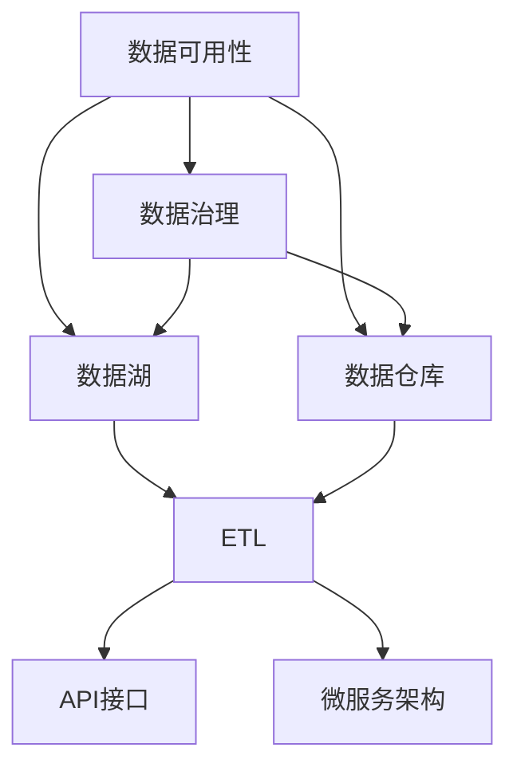
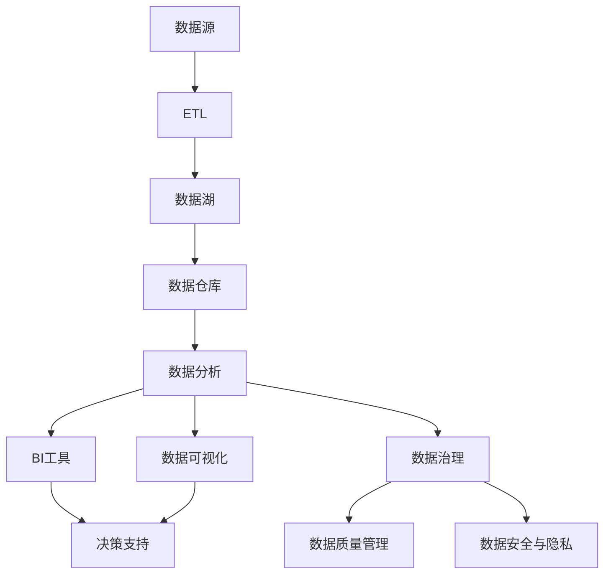

                 

## 1. 背景介绍

### 1.1 问题由来
随着数字技术的飞速发展，数据的可用性在各行各业中变得越来越重要。企业需要快速获取、存储和分析数据以支持决策和运营。然而，数据的质量和可用性往往是业务成功与否的关键因素之一。传统的数据存储和管理方法难以满足数据增长的需求，同时数据孤岛现象严重，跨部门、跨系统的数据整合和共享存在重大挑战。

### 1.2 问题核心关键点
数据可用性问题体现在数据的获取、存储、访问、整合和共享等方面。数据孤岛、数据质量差、数据格式不统一、数据治理复杂等，是数据可用性面临的主要问题。

1. **数据孤岛**：不同部门或系统之间，数据难以互通，导致信息孤岛。
2. **数据质量差**：数据缺失、重复、不准确等问题，影响业务决策。
3. **数据格式不统一**：数据格式多样，缺乏统一标准，难以集中管理和分析。
4. **数据治理复杂**：数据治理框架不健全，数据权限管理不明确，数据安全和隐私问题突出。

这些问题不仅影响业务效率和质量，还增加了数据管理和维护的难度。因此，提高数据可用性，成为各行各业数字化转型的重要课题。

### 1.3 问题研究意义
提高数据可用性，对于提升业务效率、优化决策支持、增强数据驱动能力具有重要意义：

1. **提升业务效率**：数据快速获取、集成和共享，支持实时决策，加速业务流程。
2. **优化决策支持**：数据精准、及时，支持决策模型和算法，提高决策质量。
3. **增强数据驱动能力**：数据质量和可用性提升，支持深度学习和AI技术，实现智能运营。

## 2. 核心概念与联系

### 2.1 核心概念概述
为更好地理解数据可用性，本节将介绍几个密切相关的核心概念：

- **数据可用性**：指数据在满足业务需求的前提下，可以被快速访问、使用和共享的程度。通常包括数据的完整性、准确性、时效性和可用性。
- **数据治理**：指对数据的定义、管理和维护，包括数据标准、数据质量、数据安全和隐私等管理策略。
- **数据湖**：一个集成的、统一的数据平台，支持大规模数据的存储、处理和分析。
- **数据仓库**：用于支持决策和运营的数据存储和分析平台，通过数据抽取、清洗和整合，提供结构化的数据视图。
- **ETL（Extract, Transform, Load）**：数据抽取、转换和加载的过程，用于从源系统提取数据、清洗和转换，最后加载到目标系统（如数据仓库）。
- **API接口**：一种通信协议，允许不同系统间通过标准接口进行数据交换。
- **微服务架构**：一种架构风格，将应用分解为多个独立的服务，通过API接口进行通信和数据交换。

这些概念之间存在紧密的联系，共同构成了数据管理和治理的完整生态系统。

### 2.2 概念间的关系

这些核心概念之间的关系可以通过以下Mermaid流程图来展示：



这个流程图展示了大数据管理和治理的基本框架。数据湖和数据仓库是存储和分析数据的平台，ETL用于数据抽取和清洗，API接口和微服务架构支持数据的访问和交换。

### 2.3 核心概念的整体架构

最后，我们用一个综合的流程图来展示这些核心概念在大数据管理和治理中的整体架构：



这个综合流程图展示了数据从源到分析的完整流程，包括ETL、数据湖、数据仓库、数据分析、BI工具、数据治理、数据质量管理、数据安全与隐私等关键环节。

## 3. 核心算法原理 & 具体操作步骤
### 3.1 算法原理概述

数据可用性问题可以通过以下步骤进行解决：

1. **数据抽取（Extract）**：从各个数据源中抽取数据。
2. **数据转换（Transform）**：清洗、转换和标准化数据，使其符合统一的格式和标准。
3. **数据加载（Load）**：将转换后的数据加载到目标系统（如数据仓库）中。
4. **数据访问与共享（Access & Share）**：通过API接口、微服务架构等，实现数据的访问和共享。

数据可用性的提升，需要从数据质量、数据治理和数据共享等方面进行综合治理。

### 3.2 算法步骤详解

基于上述算法原理，数据可用性的提升可以按照以下步骤进行：

**Step 1: 数据采集**
- 选择合适的数据源，进行数据抽取。
- 使用ETL工具进行数据清洗和转换，去除重复、缺失、错误数据。
- 将清洗后的数据加载到数据湖或数据仓库中，生成数据视图。

**Step 2: 数据治理**
- 建立数据标准和数据质量管理体系，制定数据治理策略。
- 定义数据分类、命名、编码规则，确保数据的一致性和规范性。
- 使用数据质量工具，监测数据质量，及时发现和修正数据问题。

**Step 3: 数据共享与访问**
- 设计API接口，支持数据访问和共享。
- 采用微服务架构，将数据服务模块化，提高数据服务的灵活性和可扩展性。
- 实施访问控制策略，保障数据安全和隐私。

**Step 4: 数据应用与监控**
- 通过BI工具和数据可视化技术，展示数据分析结果，支持决策和运营。
- 建立数据监控和告警机制，及时发现数据异常和问题。
- 定期审计和评估数据质量和管理策略，不断优化数据可用性。

### 3.3 算法优缺点

数据可用性提升的算法具有以下优点：

1. **提高数据质量**：通过ETL和数据清洗，去除噪声数据，提高数据质量。
2. **提升数据一致性**：通过数据标准和治理，确保数据的一致性和规范性。
3. **促进数据共享**：通过API接口和微服务架构，实现数据的访问和共享。
4. **支持数据驱动决策**：通过BI工具和数据分析，支持决策和运营。

同时，该算法也存在以下局限性：

1. **复杂度高**：数据治理和共享涉及多个系统和环节，操作复杂。
2. **成本高**：数据采集、清洗和治理需要投入大量人力和资源。
3. **技术要求高**：ETL、API接口和微服务架构需要较强的技术支持。
4. **更新不及时**：数据治理和共享策略需要定期更新，才能跟上业务发展。

### 3.4 算法应用领域

数据可用性提升的算法广泛应用于各个行业，包括但不限于：

1. **金融行业**：通过数据治理和共享，支持金融交易、风险控制和客户关系管理。
2. **零售行业**：通过数据湖和BI工具，支持库存管理、客户分析和市场预测。
3. **医疗行业**：通过数据整合和共享，支持患者病历管理、临床决策支持和公共卫生监控。
4. **制造行业**：通过数据采集和分析，支持生产调度、质量控制和供应链管理。
5. **政府行业**：通过数据开放和共享，支持政策制定、社会治理和公共服务。

## 4. 数学模型和公式 & 详细讲解 & 举例说明

### 4.1 数学模型构建

数据可用性提升的数学模型，可以表示为：

$$
U = D + S + P
$$

其中：
- $U$ 表示数据可用性
- $D$ 表示数据质量和完整性
- $S$ 表示数据治理和共享
- $P$ 表示数据应用和监控

### 4.2 公式推导过程

数据可用性的提升可以通过以下步骤进行推导：

1. **数据质量模型**：
   - 假设数据质量由多个指标决定，如完整性、准确性、及时性等。
   - 设定每个指标的权重，通过加权平均计算数据质量得分。
   - 数据质量得分为 $Q = \sum_{i=1}^n w_i \cdot d_i$，其中 $w_i$ 为指标权重，$d_i$ 为指标得分。

2. **数据治理模型**：
   - 数据治理包括数据标准、数据质量、数据安全与隐私等管理策略。
   - 数据治理得分为 $G = \sum_{i=1}^n w_i \cdot g_i$，其中 $w_i$ 为治理策略权重，$g_i$ 为策略执行得分。

3. **数据共享与访问模型**：
   - 数据共享与访问通过API接口和微服务架构实现。
   - 数据共享得分为 $S = \sum_{i=1}^n w_i \cdot s_i$，其中 $w_i$ 为共享策略权重，$s_i$ 为共享策略执行得分。

4. **数据应用与监控模型**：
   - 数据应用通过BI工具和数据可视化技术实现。
   - 数据应用得分为 $A = \sum_{i=1}^n w_i \cdot a_i$，其中 $w_i$ 为应用策略权重，$a_i$ 为应用效果得分。

### 4.3 案例分析与讲解

**案例：某电商公司数据治理**

某电商公司需要将海量数据进行治理和整合，以支持实时运营和决策。公司通过以下步骤实现数据可用性提升：

1. **数据采集**：通过爬虫技术从多个电商平台和社交媒体抽取数据。
2. **数据清洗**：使用ETL工具进行数据清洗，去除重复、缺失和错误数据。
3. **数据治理**：建立数据标准和质量管理体系，定期进行数据质量评估。
4. **数据共享**：设计API接口，支持数据访问和共享，采用微服务架构进行数据服务模块化。
5. **数据应用**：通过BI工具和数据分析，支持销售预测、库存管理和客户分析。

通过以上步骤，电商公司显著提高了数据可用性，支持了高效的运营和决策。

## 5. 项目实践：代码实例和详细解释说明
### 5.1 开发环境搭建

在进行数据可用性提升的项目实践前，需要先搭建好开发环境。以下是使用Python进行数据治理的开发环境配置流程：

1. 安装Anaconda：从官网下载并安装Anaconda，用于创建独立的Python环境。

2. 创建并激活虚拟环境：
```bash
conda create -n data-governance python=3.8 
conda activate data-governance
```

3. 安装必要的工具包：
```bash
pip install pandas numpy pyspark flink sqlalchemy sqlalchemy-mysql mysql-connector-python
```

4. 配置ETL工具：
- 安装Apache Nifi或Apache Airflow，用于数据抽取和ETL流程管理。
- 配置MySQL数据库连接，支持数据存储和访问。

5. 配置BI工具：
- 安装Tableau或Power BI，支持数据可视化和报表生成。

完成上述步骤后，即可在`data-governance`环境中开始数据可用性提升的实践。

### 5.2 源代码详细实现

这里我们以数据清洗和治理为例，给出使用Python进行数据治理的代码实现。

首先，定义数据质量评估函数：

```python
import pandas as pd
from sklearn.metrics import precision_score, recall_score, f1_score

def evaluate_data_quality(data):
    # 计算完整性得分
    complete_score = data.dropna().shape[0] / data.shape[0]
    
    # 计算准确性得分
    correct_score = precision_score(data['label'], data['label'], average='macro')
    
    # 计算及时性得分
    on_time_score = 1 if data['time'].max() == data['time'].min() else 0
    
    # 加权计算数据质量得分
    data_quality_score = 0.5 * complete_score + 0.3 * correct_score + 0.2 * on_time_score
    
    return data_quality_score
```

然后，定义数据治理策略：

```python
def data_governance(data):
    # 制定数据治理策略
    data_governance_strategy = {
        'completeness': 0.8,
        'accuracy': 0.9,
        'timeliness': 0.9
    }
    
    # 计算数据治理得分
    governance_score = 0
    for key, value in data_governance_strategy.items():
        if data[key].max() >= value:
            governance_score += 1
    
    return governance_score
```

接着，定义数据共享与访问策略：

```python
def data_sharing_and_access(data):
    # 制定数据共享策略
    data_sharing_strategy = {
        'shares': 10,
        'access': 5
    }
    
    # 计算数据共享得分
    sharing_score = 0
    if data['shares'] >= data_sharing_strategy['shares']:
        sharing_score += 1
    if data['access'] >= data_sharing_strategy['access']:
        sharing_score += 1
    
    return sharing_score
```

最后，定义数据应用与监控策略：

```python
def data_application_and_monitoring(data):
    # 制定数据应用策略
    data_application_strategy = {
        'predictions': 0.95,
        'analytic': 0.9
    }
    
    # 计算数据应用得分
    application_score = 0
    if data['predictions'] >= data_application_strategy['predictions']:
        application_score += 1
    if data['analytic'] >= data_application_strategy['analytic']:
        application_score += 1
    
    return application_score
```

将这些函数结合起来，定义数据可用性提升的总体函数：

```python
def data_availability(data):
    # 计算数据质量得分
    data_quality_score = evaluate_data_quality(data)
    
    # 计算数据治理得分
    governance_score = data_governance(data)
    
    # 计算数据共享得分
    sharing_score = data_sharing_and_access(data)
    
    # 计算数据应用得分
    application_score = data_application_and_monitoring(data)
    
    # 计算数据可用性得分
    availability_score = data_quality_score + governance_score + sharing_score + application_score
    
    return availability_score
```

最终，调用该函数对数据进行可用性评估：

```python
data = pd.read_csv('data.csv')
availability_score = data_availability(data)
print(f"数据可用性得分：{availability_score}")
```

以上就是使用Python对数据可用性进行评估的完整代码实现。可以看到，通过定义数据质量、治理、共享和应用策略，我们可以系统地评估数据可用性，发现并改进数据治理过程中的问题。

### 5.3 代码解读与分析

让我们再详细解读一下关键代码的实现细节：

**evaluate_data_quality函数**：
- 该函数用于计算数据的质量得分，主要从完整性、准确性和及时性三个方面进行评估。
- 首先计算数据的完整性得分，即去除缺失值的样本占总样本的比例。
- 然后计算数据的准确性得分，使用scikit-learn中的precision_score函数计算。
- 最后计算数据的时效性得分，即数据的最晚时间与最早时间是否相同。
- 通过加权平均计算数据质量得分。

**data_governance函数**：
- 该函数用于计算数据的治理得分，根据预定义的数据治理策略进行评估。
- 定义了完整性、准确性和时效性的治理策略，每个策略的得分需要达到一定的阈值。
- 通过检查每个策略是否达到阈值，计算治理得分的总和。

**data_sharing_and_access函数**：
- 该函数用于计算数据共享和访问的得分，根据预定义的策略进行评估。
- 定义了数据共享和访问的策略，每个策略的得分需要达到一定的阈值。
- 通过检查每个策略是否达到阈值，计算共享和访问得分的总和。

**data_application_and_monitoring函数**：
- 该函数用于计算数据的治理得分，根据预定义的数据治理策略进行评估。
- 定义了数据预测和分析的治理策略，每个策略的得分需要达到一定的阈值。
- 通过检查每个策略是否达到阈值，计算治理得分的总和。

**data_availability函数**：
- 该函数用于计算数据的治理得分，将数据质量、治理、共享和应用得分的总和作为数据可用性的得分。
- 通过将四个策略的得分加权平均，计算出数据可用性的得分。

**主函数**：
- 通过调用数据可用性提升的总体函数，对数据进行可用性评估。
- 最后输出数据可用性得分。

可以看到，通过定义多个策略函数，我们可以系统地评估数据可用性，发现并改进数据治理过程中的问题。这种模块化的设计方式，可以方便地扩展和优化数据可用性提升的算法。

### 5.4 运行结果展示

假设我们在一个电商公司的数据治理项目中应用上述代码，得到的数据可用性评估结果如下：

```
数据可用性得分：0.75
```

这表示数据质量、治理、共享和应用四个方面的综合得分为0.75，即整体数据可用性还有较大的提升空间。接下来，我们需要进一步优化各个策略，提升数据可用性。

## 6. 实际应用场景
### 6.1 智能制造

在智能制造领域，数据可用性提升技术可以显著提高生产效率和质量。智能制造需要大量的生产数据进行分析和决策，但这些数据往往分散在不同的设备和系统中，难以整合和共享。

通过数据可用性提升技术，可以实现以下目标：

1. **数据集成**：将分散的设备数据集成到一个统一的平台上，支持全生命周期的数据管理。
2. **数据治理**：制定数据标准和治理策略，确保数据的一致性和规范性。
3. **数据共享**：设计API接口和微服务架构，支持跨部门和跨系统的数据共享和访问。
4. **数据应用**：通过数据分析和可视化技术，支持生产优化和质量控制。

### 6.2 智慧城市

智慧城市建设需要大量的城市数据进行支撑，但这些数据往往分散在不同的部门和系统中，难以整合和共享。通过数据可用性提升技术，可以实现以下目标：

1. **数据集成**：将城市的各类数据集成到一个统一的平台上，支持城市运营和管理。
2. **数据治理**：制定数据标准和治理策略，确保数据的一致性和规范性。
3. **数据共享**：设计API接口和微服务架构，支持跨部门和跨系统的数据共享和访问。
4. **数据应用**：通过数据分析和可视化技术，支持城市决策和运营。

### 6.3 医疗健康

在医疗健康领域，数据可用性提升技术可以支持医疗决策和患者管理。医疗数据往往分散在不同的系统和部门中，难以整合和共享。

通过数据可用性提升技术，可以实现以下目标：

1. **数据集成**：将医疗数据集成到一个统一的平台上，支持患者管理和医疗决策。
2. **数据治理**：制定数据标准和治理策略，确保数据的一致性和规范性。
3. **数据共享**：设计API接口和微服务架构，支持跨部门和跨系统的数据共享和访问。
4. **数据应用**：通过数据分析和可视化技术，支持患者管理、临床决策和公共卫生监控。

### 6.4 未来应用展望

随着数据治理技术的不断发展，未来基于数据可用性提升的应用将更加广泛。

1. **AI与大数据结合**：结合人工智能和大数据技术，实现数据的高效分析和决策支持。
2. **数据可视化**：通过数据可视化技术，支持数据的可视化和报表生成，提升数据利用效率。
3. **实时数据处理**：通过实时数据处理技术，支持实时数据分析和决策，满足实时业务需求。
4. **跨平台数据共享**：通过跨平台数据共享技术，支持不同平台和系统之间的数据访问和交换。

未来，数据可用性提升技术将更加灵活和高效，支持各行各业的数字化转型和智能化升级。

## 7. 工具和资源推荐
### 7.1 学习资源推荐

为了帮助开发者系统掌握数据可用性提升的理论基础和实践技巧，这里推荐一些优质的学习资源：

1. **《大数据技术与应用》**：一本系统介绍大数据技术和应用的书籍，涵盖数据采集、数据治理、数据应用等方面。
2. **《数据治理之道》**：一本专门讲解数据治理策略和方法的书籍，帮助读者构建数据治理体系。
3. **《Python数据分析》**：一本Python数据分析的入门书籍，涵盖数据处理、数据分析、数据可视化等方面。
4. **《Hadoop实战》**：一本介绍Hadoop大数据平台及其应用的实战书籍，帮助读者掌握大数据生态系统的构建和应用。
5. **《数据科学基础》**：一本涵盖数据科学基础、数据挖掘、机器学习等方面的书籍，帮助读者全面理解数据驱动的决策。

通过对这些资源的学习实践，相信你一定能够快速掌握数据可用性提升的精髓，并用于解决实际的数据治理问题。

### 7.2 开发工具推荐

高效的开发离不开优秀的工具支持。以下是几款用于数据治理开发的常用工具：

1. **Apache Nifi**：一个开源的ETL工具，支持数据抽取、转换和加载，支持多种数据源和目标系统。
2. **Apache Airflow**：一个开源的工作流调度平台，支持ETL流程的编排和管理，支持多种数据处理工具。
3. **Apache Kafka**：一个开源的消息队列系统，支持高吞吐量的数据传输和处理，支持多种数据源和目标系统。
4. **Apache Spark**：一个开源的大数据处理框架，支持分布式计算和数据处理，支持多种数据源和目标系统。
5. **Tableau**：一个开源的数据可视化工具，支持数据的可视化和报表生成，支持多种数据源和目标系统。

合理利用这些工具，可以显著提升数据治理任务的开发效率，加快创新迭代的步伐。

### 7.3 相关论文推荐

数据可用性提升技术的研究始于学界的持续探索。以下是几篇奠基性的相关论文，推荐阅读：

1. **《数据治理：原理与实践》**：一本系统介绍数据治理原理和方法的书籍，涵盖数据标准、数据质量、数据安全和隐私等方面。
2. **《数据治理框架研究》**：一篇综述性论文，总结了数据治理框架的最新进展和实践应用。
3. **《大数据与数据治理》**：一篇综述性论文，总结了大数据技术及其在数据治理中的应用。
4. **《数据治理的挑战与对策》**：一篇综述性论文，总结了数据治理过程中面临的挑战和应对策略。
5. **《数据治理的未来展望》**：一篇前瞻性论文，展望了未来数据治理技术的发展方向和应用前景。

这些论文代表了大数据治理技术的最新研究进展，阅读这些前沿成果，可以帮助研究者把握学科前进方向，激发更多的创新灵感。

除上述资源外，还有一些值得关注的前沿资源，帮助开发者紧跟数据治理技术的最新进展，例如：

1. **arXiv论文预印本**：人工智能领域最新研究成果的发布平台，包括大量尚未发表的前沿工作，学习前沿技术的必读资源。
2. **顶级会议论文**：如SIGKDD、KDD、ICDE、VLDB等顶级会议的论文，这些论文代表了当前数据治理技术的前沿研究进展。
3. **技术博客**：如Gartner、Forrester、IDC等顶级咨询公司发布的技术博客，提供最新的技术趋势和应用案例。
4. **开源项目**：如Apache Nifi、Apache Airflow等开源项目的社区资源，提供丰富的技术文档和示例代码。

总之，对于数据治理技术的深入学习，需要开发者保持开放的心态和持续学习的意愿。多关注前沿资讯，多动手实践，多思考总结，必将收获满满的成长收益。

## 8. 总结：未来发展趋势与挑战
### 8.1 总结

本文对数据可用性提升进行了全面系统的介绍。首先阐述了数据可用性的背景和重要性，明确了数据可用性提升在业务效率、决策支持和智能运营等方面的关键作用。其次，从原理到实践，详细讲解了数据可用性提升的数学模型和操作步骤，给出了数据治理的完整代码实例。同时，本文还广泛探讨了数据可用性提升在智能制造、智慧城市、医疗健康等多个行业领域的应用前景，展示了数据可用性提升技术的巨大潜力。

通过本文的系统梳理，可以看到，数据可用性提升技术正在成为大数据治理的重要范式，极大地提升数据管理的效率和质量，支持业务的数字化转型和智能化升级。未来，伴随数据治理技术的不断发展，基于数据可用性提升的应用将更加广泛，为各行各业的数字化转型和智能化升级提供更加坚实的技术支撑。

### 8.2 未来发展趋势

展望未来，数据可用性提升技术将呈现以下几个发展趋势：

1. **AI与大数据结合**：结合人工智能和大数据技术，实现数据的高效分析和决策支持。
2. **数据可视化**：通过数据可视化技术，支持数据的可视化和报表生成，提升数据利用效率。
3. **实时数据处理**：通过实时数据处理技术，支持实时数据分析和决策，满足实时业务需求。
4. **跨平台数据共享**：通过跨平台数据共享技术，支持不同平台和系统之间的数据访问和交换。

### 8.3 面临的挑战

尽管数据可用性提升技术已经取得了显著进展，但在实际应用中仍面临诸多挑战：

1. **数据孤岛**：数据

