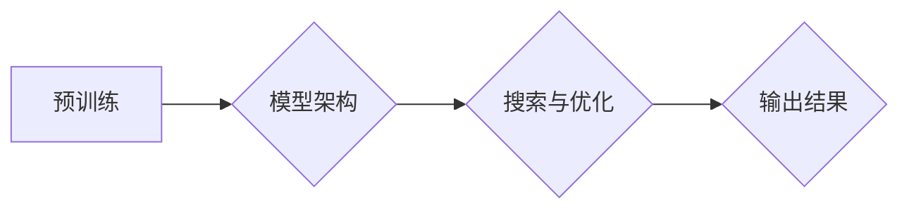

> 关键词：大语言模型，Transformer，搜索，效率优化，NLP，机器学习，深度学习

# 大语言模型原理基础与前沿 搜索高效Transformer

大语言模型（Large Language Model，简称LLM）近年来在自然语言处理（Natural Language Processing，简称NLP）领域取得了革命性的进展。其中，基于Transformer的模型因其强大的并行处理能力和出色的性能表现，成为了LLM的主流架构。本文将深入探讨大语言模型的原理基础，以及如何通过搜索和效率优化来提升Transformer的效率，以期在NLP领域取得更高效、更智能的解决方案。

## 1. 背景介绍

### 1.1 问题的由来

自然语言处理作为人工智能领域的一个重要分支，旨在让机器能够理解和生成人类语言。随着深度学习技术的不断发展，基于深度学习的NLP模型取得了显著的成果。然而，传统的NLP模型在处理复杂任务时，往往需要大量的计算资源和时间。为了解决这一问题，研究者们提出了大语言模型，希望通过大规模预训练和高效的模型架构来提高NLP任务的效率和准确性。

### 1.2 研究现状

目前，大语言模型的研究主要集中在以下几个方面：

- **预训练**：通过在大量的无标签文本数据上进行预训练，使模型学习到通用的语言知识和表征。
- **模型架构**：研究更高效、更强大的模型架构，以适应不同NLP任务的需求。
- **搜索与优化**：探索高效的搜索和优化方法，以降低计算成本和提高模型性能。

### 1.3 研究意义

大语言模型的研究对于推动NLP技术的发展具有重要意义：

- **提高效率**：通过高效的模型架构和搜索方法，可以显著降低NLP任务的计算成本。
- **提升性能**：强大的模型架构和预训练技术可以提升NLP任务的准确性和泛化能力。
- **推动应用**：高效、准确的NLP模型可以促进NLP技术在各个领域的应用。

## 2. 核心概念与联系

### 2.1 核心概念原理

大语言模型的核心概念包括：

- **预训练**：在无标签文本数据上训练模型，使其学习到通用的语言知识和表征。
- **模型架构**：包括Transformer、RNN、CNN等，用于处理NLP任务。
- **搜索与优化**：包括 beam search、RLHF等，用于提高模型性能和效率。

### 2.2 架构流程图

以下是一个简化的Mermaid流程图，展示了大语言模型的基本架构：



## 3. 核心算法原理 & 具体操作步骤

### 3.1 算法原理概述

大语言模型的算法原理主要包括：

- **预训练**：通过自回归或自编码任务，使模型学习到通用的语言知识和表征。
- **微调**：在特定任务的数据上进行微调，使模型适应特定任务的需求。
- **搜索与优化**：通过搜索方法（如beam search）和优化方法（如RLHF）提高模型性能。

### 3.2 算法步骤详解

大语言模型的算法步骤如下：

1. **数据准备**：收集大量无标签文本数据用于预训练，以及少量标注数据用于微调。
2. **预训练**：在无标签文本数据上训练模型，使其学习到通用的语言知识和表征。
3. **微调**：在特定任务的数据上进行微调，使模型适应特定任务的需求。
4. **搜索与优化**：通过搜索方法（如beam search）和优化方法（如RLHF）提高模型性能。
5. **输出结果**：使用微调后的模型进行预测或生成。

### 3.3 算法优缺点

大语言模型的优点：

- **强大的语言理解能力**：通过预训练，模型学习到丰富的语言知识和表征。
- **高效的并行处理能力**：Transformer架构具有高效的并行处理能力。

大语言模型的缺点：

- **计算成本高**：预训练和微调过程需要大量的计算资源。
- **数据依赖性强**：模型的性能很大程度上取决于预训练数据的质量和数量。

### 3.4 算法应用领域

大语言模型的应用领域包括：

- **文本分类**：如情感分析、主题分类、垃圾邮件检测等。
- **文本生成**：如摘要生成、文本摘要、对话生成等。
- **机器翻译**：如机器翻译、多语言翻译等。

## 4. 数学模型和公式 & 详细讲解 & 举例说明

### 4.1 数学模型构建

大语言模型的数学模型主要包括：

- **自回归语言模型**：通过预测下一个词来生成文本。
- **自编码语言模型**：通过预测输入文本的重建来学习语言知识。
- **Transformer模型**：通过多头自注意力机制和位置编码来处理序列数据。

### 4.2 公式推导过程

以下是一些常见的数学公式：

- **自回归语言模型**：

$$
P(w_t|w_{t-1}, ..., w_1) = \frac{e^{w_t^T w_{t-1}}}{\sum_{w \in V} e^{w_t^T w_{t-1}}}
$$

- **Transformer模型**：

$$
\text{Attention}(Q, K, V) = \frac{QK^T}{\sqrt{d_k}} \text{softmax}(VW^T)
$$

### 4.3 案例分析与讲解

以BERT模型为例，其核心思想是预训练和微调。

1. **预训练**：

- **Masked Language Model (MLM)**：随机遮盖输入文本中的部分词，并预测这些词的正确词性。
- **Next Sentence Prediction (NSP)**：预测两个句子是否为连续句子。

2. **微调**：

- 在特定任务的数据上进行微调，如文本分类、问答等。

## 5. 项目实践：代码实例和详细解释说明

### 5.1 开发环境搭建

1. 安装Python和pip。
2. 安装PyTorch和Transformers库。

### 5.2 源代码详细实现

以下是一个简单的BERT模型微调的代码示例：

```python
import torch
from transformers import BertForSequenceClassification, BertTokenizer

# 加载预训练模型和分词器
model = BertForSequenceClassification.from_pretrained('bert-base-uncased')
tokenizer = BertTokenizer.from_pretrained('bert-base-uncased')

# 加载训练数据
train_texts = ["This is a text.", "This is another text."]
train_labels = [0, 1]

# 编码文本
input_ids = tokenizer(train_texts, padding=True, truncation=True, return_tensors="pt")

# 训练模型
outputs = model(**input_ids, labels=train_labels)
loss = outputs.loss
loss.backward()
optimizer.step()
```

### 5.3 代码解读与分析

以上代码演示了如何使用Transformers库加载预训练的BERT模型和分词器，加载训练数据，进行编码，以及进行模型训练。

### 5.4 运行结果展示

通过训练，模型的损失值会逐渐降低，表示模型在训练数据上的性能越来越好。

## 6. 实际应用场景

大语言模型在NLP领域的应用场景广泛，以下是一些典型的应用：

- **文本分类**：对文本进行分类，如新闻分类、情感分析等。
- **机器翻译**：将一种语言的文本翻译成另一种语言。
- **文本生成**：生成摘要、对话、故事等。
- **问答系统**：回答用户提出的问题。

## 7. 工具和资源推荐

### 7.1 学习资源推荐

- **书籍**：《深度学习》（Goodfellow等著）
- **在线课程**：Coursera、edX等平台上的深度学习、NLP相关课程
- **技术博客**：Hugging Face、DistilBERT等

### 7.2 开发工具推荐

- **编程语言**：Python
- **深度学习框架**：PyTorch、TensorFlow
- **NLP库**：Transformers、SpaCy

### 7.3 相关论文推荐

- **BERT**：Devlin et al. (2018)
- **GPT-3**：Brown et al. (2020)
- **Transformers**：Vaswani et al. (2017)

## 8. 总结：未来发展趋势与挑战

### 8.1 研究成果总结

大语言模型的研究取得了显著的成果，为NLP领域带来了革命性的变革。

### 8.2 未来发展趋势

未来，大语言模型的研究将朝着以下方向发展：

- **更大规模的预训练模型**：随着计算资源的不断发展，研究者们将构建更大规模的预训练模型。
- **更高效的模型架构**：探索更高效的模型架构，以降低计算成本和提高模型性能。
- **更多领域的应用**：将大语言模型应用于更多领域，如语音识别、图像识别等。

### 8.3 面临的挑战

大语言模型的研究也面临着以下挑战：

- **计算资源消耗**：大语言模型的预训练和微调过程需要大量的计算资源。
- **数据隐私和安全**：大语言模型的训练和部署过程中，需要保护用户隐私和安全。
- **模型可解释性**：大语言模型的决策过程往往缺乏可解释性，需要进一步研究。

### 8.4 研究展望

未来，大语言模型的研究将在以下几个方面取得突破：

- **更加高效和安全的模型**：降低计算成本，提高模型安全性。
- **更加可解释的模型**：提高模型的可解释性，增强用户对模型的信任。
- **更加广泛的领域应用**：将大语言模型应用于更多领域，推动AI技术的发展。

## 9. 附录：常见问题与解答

### 常见问题1：什么是大语言模型？

答：大语言模型（Large Language Model，简称LLM）是指通过在大量文本数据上进行预训练，使模型学习到丰富的语言知识和表征，从而实现自然语言处理任务的一种模型。

### 常见问题2：大语言模型有哪些类型？

答：大语言模型主要有以下几种类型：

- **自回归语言模型**：通过预测下一个词来生成文本。
- **自编码语言模型**：通过预测输入文本的重建来学习语言知识。
- **Transformer模型**：通过多头自注意力机制和位置编码来处理序列数据。

### 常见问题3：大语言模型的应用有哪些？

答：大语言模型的应用非常广泛，包括文本分类、机器翻译、文本生成、问答系统等。

作者：禅与计算机程序设计艺术 / Zen and the Art of Computer Programming