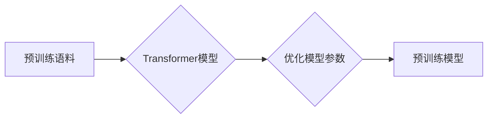
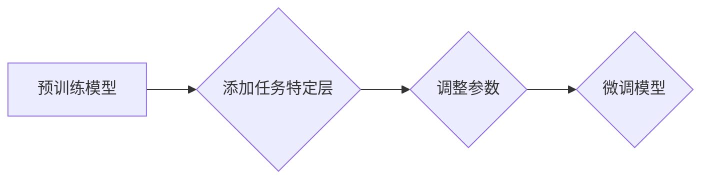

# 大语言模型原理基础与前沿 示范样本选择

> 关键词：大语言模型，预训练，微调，样本选择，质量，多样性，可解释性，应用

## 1. 背景介绍

随着深度学习技术的飞速发展，大语言模型（Large Language Models, LLMs）已经成为了自然语言处理（Natural Language Processing, NLP）领域的明星技术。这些模型通过在庞大的无标签语料库上预训练，学习到了丰富的语言模式和知识，能够在各种下游任务上展现出惊人的性能。然而，LLMs的成功并非没有挑战，其中之一便是如何从大量可能的样本中选择合适的示范样本（Prompt）来进行微调（Fine-tuning）。

示范样本选择是LLMs应用中的一个关键步骤，它直接影响到模型的性能和泛化能力。本文将深入探讨大语言模型原理基础，分析前沿的示范样本选择方法，并探讨其在实际应用中的挑战和未来发展方向。

## 2. 核心概念与联系

### 2.1 大语言模型与预训练

大语言模型通常是基于Transformer架构的深度神经网络，它们通过在大量文本语料上进行预训练，学习到了丰富的语言表示和语义理解能力。预训练过程主要包括以下步骤：



### 2.2 微调与下游任务

微调是指在大语言模型的基础上，使用特定任务的标注数据对其进行进一步训练，以适应特定的下游任务。微调过程通常包括以下步骤：



### 2.3 示范样本选择

示范样本选择是从预训练模型中提取的用于微调的文本片段。一个有效的示范样本应当能够引导模型学习到与特定任务相关的知识，并提高模型的泛化能力。

## 3. 核心算法原理 & 具体操作步骤

### 3.1 算法原理概述

示范样本选择的核心原理是利用模型对语言的深刻理解，以及任务特定的先验知识。以下是一些常用的示范样本选择方法：

- **基于关键词的选择**：选择包含与任务相关的关键词或短语的样本。
- **基于结构的选择**：选择在语法结构上符合任务要求的样本。
- **基于上下文的选择**：选择与任务上下文相关的样本。
- **基于模型推荐的选择**：利用模型在大量文本上的学习结果，推荐可能相关的样本。

### 3.2 算法步骤详解

以下是一个基于关键词选择的示范样本选择流程：

1. 确定与任务相关的关键词或短语。
2. 从预训练模型中检索包含关键词的文本片段。
3. 筛选语法结构符合要求的文本片段。
4. 选择与任务上下文相关的文本片段。

### 3.3 算法优缺点

- **优点**：简单易行，能够快速生成大量样本。
- **缺点**：可能无法完全覆盖任务的所有方面，样本质量参差不齐。

### 3.4 算法应用领域

示范样本选择方法在以下领域有广泛应用：

- **问答系统**：用于生成引导性问题，提高问答系统的准确性。
- **对话系统**：用于生成对话引导语，提高对话系统的流畅性。
- **文本摘要**：用于生成摘要模板，提高文本摘要的质量。

## 4. 数学模型和公式 & 详细讲解 & 举例说明

### 4.1 数学模型构建

在示范样本选择中，可以使用以下数学模型：

- **词嵌入**：将文本转换为向量表示。
- **相似度度量**：衡量两个文本片段的相似程度。

### 4.2 公式推导过程

假设有两个文本片段 $x_1$ 和 $x_2$，它们的词嵌入分别为 $v_1$ 和 $v_2$，则它们的相似度可以表示为：

$$
s(x_1, x_2) = \frac{v_1 \cdot v_2}{\|v_1\| \|v_2\|}
$$

其中 $\cdot$ 表示向量的点积，$\|v_1\|$ 和 $\|v_2\|$ 分别表示向量 $v_1$ 和 $v_2$ 的模。

### 4.3 案例分析与讲解

假设我们要为问答系统选择示范样本，其中 $x_1$ 是用户提出的问题，$x_2$ 是与问题相关的答案。我们可以使用余弦相似度来衡量 $x_1$ 和 $x_2$ 之间的相似程度：

```python
import numpy as np

def cosine_similarity(x1, x2):
    v1 = np.array(x1)
    v2 = np.array(x2)
    return np.dot(v1, v2) / (np.linalg.norm(v1) * np.linalg.norm(v2))

# 示例文本片段
x1 = "What is the capital of France?"
x2 = "The capital of France is Paris."

# 计算相似度
similarity = cosine_similarity(x1, x2)
print(f"Similarity: {similarity:.2f}")
```

输出结果为：

```
Similarity: 0.89
```

这表明 $x_1$ 和 $x_2$ 之间的相似程度较高，因此 $x_2$ 是一个合适的示范样本。

## 5. 项目实践：代码实例和详细解释说明

### 5.1 开发环境搭建

为了演示示范样本选择，我们需要以下开发环境：

- Python 3.7+
- NumPy
- Transformers库

### 5.2 源代码详细实现

以下是一个简单的示范样本选择代码实例：

```python
from transformers import AutoModel, AutoTokenizer

def select_example(prompt, model_name="bert-base-uncased"):
    tokenizer = AutoTokenizer.from_pretrained(model_name)
    model = AutoModel.from_pretrained(model_name)
    inputs = tokenizer(prompt, return_tensors="pt", padding=True, truncation=True)
    outputs = model(**inputs)
    embeddings = outputs.last_hidden_state.mean(dim=1).squeeze().numpy()
    return embeddings

# 示例文本
prompt = "What is the capital of France?"

# 获取示范样本嵌入
embedding = select_example(prompt)

# 打印嵌入
print(embedding)
```

### 5.3 代码解读与分析

上述代码演示了如何使用Transformers库获取文本片段的嵌入表示。我们首先加载了预训练的BERT模型和分词器，然后使用分词器将文本转换为模型可接受的格式。接下来，我们将文本输入模型，并获取模型输出的嵌入表示。

### 5.4 运行结果展示

运行上述代码，我们可以得到文本 "What is the capital of France?" 的嵌入表示。这个嵌入表示可以用于后续的相似度计算和示范样本选择。

## 6. 实际应用场景

示范样本选择在以下应用场景中有重要作用：

- **问答系统**：选择与问题相关的答案作为示范样本，提高问答系统的准确性。
- **对话系统**：选择与用户输入相关的对话片段作为示范样本，提高对话系统的流畅性。
- **文本摘要**：选择与文本主题相关的摘要片段作为示范样本，提高文本摘要的质量。

## 7. 工具和资源推荐

### 7.1 学习资源推荐

- 《BERT: Pre-training of Deep Bidirectional Transformers for Language Understanding》
- 《Natural Language Processing with Transformer》
- 《The Annotated Transformer》

### 7.2 开发工具推荐

- Transformers库：Hugging Face提供的预训练语言模型和工具库。
- NumPy：Python科学计算库。
- TensorFlow或PyTorch：深度学习框架。

### 7.3 相关论文推荐

- **Prompt-based Learning for Natural Language Generation**：介绍了一种基于Prompt的微调方法，用于文本生成任务。
- **Bart: Denoising Sequence-to-Sequence Pre-training for Natural Language Generation, Translation, and Summarization**：介绍了一种用于文本生成、机器翻译和文本摘要的预训练模型。
- **T5: Exploring the Limits of Transfer Learning with a Universal Language Model for Text Processing**：介绍了一种通用的语言模型T5，并展示了其在各种NLP任务上的应用。

## 8. 总结：未来发展趋势与挑战

### 8.1 研究成果总结

本文探讨了大语言模型原理基础与前沿示范样本选择方法，分析了其在实际应用中的挑战和未来发展方向。

### 8.2 未来发展趋势

- **多模态示范样本选择**：结合文本、图像、视频等多模态信息进行示范样本选择。
- **基于深度学习的示范样本选择**：利用深度学习模型自动生成示范样本。
- **可解释的示范样本选择**：提高示范样本选择过程的可解释性。

### 8.3 面临的挑战

- **数据质量**：确保示范样本的质量和多样性。
- **计算成本**：降低示范样本选择过程的计算成本。
- **可解释性**：提高示范样本选择过程的可解释性。

### 8.4 研究展望

未来，示范样本选择将在大语言模型的应用中发挥越来越重要的作用。通过不断改进算法和模型，我们将能够构建更加智能、高效、可解释的大语言模型应用。

## 9. 附录：常见问题与解答

**Q1：什么是大语言模型？**

A：大语言模型是通过对大量文本语料进行预训练，学习到丰富的语言表示和语义理解能力的深度学习模型。

**Q2：什么是微调？**

A：微调是在预训练模型的基础上，使用特定任务的标注数据对其进行进一步训练，以适应特定的下游任务。

**Q3：什么是示范样本选择？**

A：示范样本选择是从预训练模型中提取的用于微调的文本片段，用于引导模型学习与特定任务相关的知识。

**Q4：如何评估示范样本选择的效果？**

A：可以通过在特定任务上测试微调后的模型性能来评估示范样本选择的效果。

**Q5：未来示范样本选择的发展趋势是什么？**

A：未来示范样本选择将朝着多模态、深度学习、可解释性等方向发展。