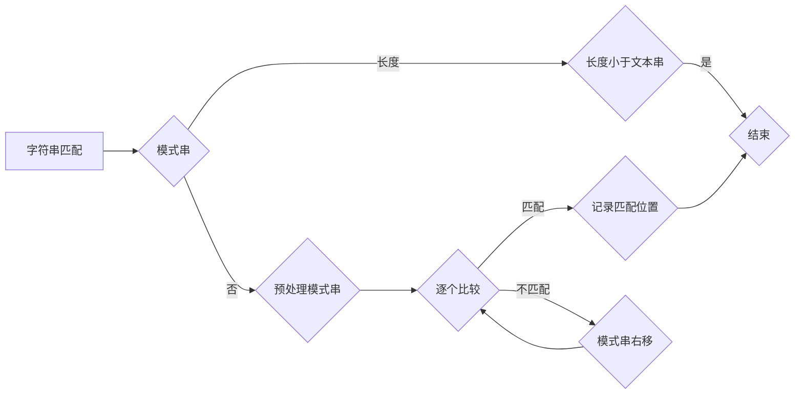

# 字符串匹配系统的设计与实现

> 关键词：字符串匹配，算法，正则表达式，KMP算法，Boyer-Moore算法，有限自动机，应用场景，性能优化

## 1. 背景介绍

字符串匹配是计算机科学中一个基本且重要的任务，广泛应用于文本编辑、信息检索、生物信息学、网络通信等多个领域。字符串匹配系统旨在高效地找到文本中的一个或多个子串，或者在更复杂的场景中，找到满足特定模式的字符串序列。本篇文章将深入探讨字符串匹配系统的设计与实现，包括核心算法原理、具体操作步骤、数学模型、项目实践以及实际应用场景。

### 1.1 问题的由来

随着信息时代的到来，数据量呈爆炸式增长，快速、准确地匹配字符串成为数据处理和分析的关键。传统的字符串匹配方法如朴素匹配法效率低下，难以满足实际需求。因此，研究者们提出了多种高效的字符串匹配算法，如KMP算法、Boyer-Moore算法等。

### 1.2 研究现状

目前，字符串匹配算法的研究已经非常成熟，众多算法各有优缺点，适用于不同的应用场景。KMP算法通过预处理模式串，避免不必要的比较，提高了匹配效率。Boyer-Moore算法则通过启发式跳过不必要的比较，进一步提高了匹配速度。此外，有限自动机作为一种更为通用的字符串匹配模型，也能够高效地处理复杂的匹配需求。

### 1.3 研究意义

研究字符串匹配系统的设计与实现，对于提升信息处理效率、降低计算成本具有重要意义。同时，它也能够为其他算法的设计提供借鉴和参考。

### 1.4 本文结构

本文将按照以下结构展开：
- 第2部分，介绍字符串匹配系统的核心概念与联系。
- 第3部分，详细阐述几种常见的字符串匹配算法原理和具体操作步骤。
- 第4部分，探讨字符串匹配的数学模型和公式。
- 第5部分，给出字符串匹配的代码实例和详细解释说明。
- 第6部分，分析字符串匹配系统的实际应用场景。
- 第7部分，展望字符串匹配系统的未来发展趋势与挑战。
- 第8部分，总结全文，并给出常见问题与解答。

## 2. 核心概念与联系

### 2.1 核心概念

- **字符串匹配**：在给定的文本串中查找一个或多个指定的子串。
- **模式串**：用于匹配的字符串，也称为模式。
- **文本串**：待匹配的字符串。
- **匹配度**：表示模式串与文本串相似度的指标。

### 2.2 Mermaid 流程图



### 2.3 关系

字符串匹配系统包括模式串和文本串，通过比较两者之间的相似度来实现匹配。预处理模式串可以优化匹配过程，逐个比较是匹配过程的核心步骤，记录匹配位置用于后续的输出。

## 3. 核心算法原理 & 具体操作步骤

### 3.1 算法原理概述

以下是几种常见的字符串匹配算法及其原理概述：

#### 3.1.1 朴素匹配法

朴素匹配法是最简单的字符串匹配算法，逐个字符比较，一旦发现不匹配，则模式串整体右移一位继续匹配。

#### 3.1.2 KMP算法

KMP算法通过预处理模式串，构建部分匹配表（也称为next数组），避免不必要的比较。

#### 3.1.3 Boyer-Moore算法

Boyer-Moore算法通过启发式跳过不必要的比较，如好后缀规则和坏字符规则。

#### 3.1.4 有限自动机

有限自动机是一种更通用的字符串匹配模型，能够处理复杂的模式匹配问题。

### 3.2 算法步骤详解

#### 3.2.1 朴素匹配法

1. 将模式串和文本串分别初始化为索引0的位置。
2. 逐个比较模式串和文本串的对应字符。
3. 如果匹配，则同时将两个索引加1，继续比较下一个字符。
4. 如果不匹配，则将模式串右移一位，回到步骤2。
5. 如果模式串的长度小于文本串的长度，则匹配成功。

#### 3.2.2 KMP算法

1. 构建部分匹配表（next数组），用于记录模式串中每个字符的匹配情况。
2. 初始化模式串和文本串的索引为0。
3. 逐个比较模式串和文本串的对应字符。
4. 如果匹配，则同时将两个索引加1，继续比较下一个字符。
5. 如果不匹配，则根据next数组将模式串右移，避免不必要的比较。
6. 如果模式串的长度小于文本串的长度，则匹配成功。

#### 3.2.3 Boyer-Moore算法

1. 根据好后缀规则和坏字符规则构建跳跃表。
2. 初始化模式串和文本串的索引为0。
3. 逐个比较模式串和文本串的对应字符。
4. 如果匹配，则同时将两个索引加1，继续比较下一个字符。
5. 如果不匹配，则根据跳跃表将模式串右移，避免不必要的比较。
6. 如果模式串的长度小于文本串的长度，则匹配成功。

#### 3.2.4 有限自动机

1. 构建有限自动机的状态转换图。
2. 初始化有限自动机的起始状态和文本串的索引为0。
3. 根据状态转换图逐个字符读取文本串。
4. 如果读取完成后，有限自动机处于接受状态，则匹配成功。

### 3.3 算法优缺点

#### 3.3.1 朴素匹配法

- **优点**：实现简单。
- **缺点**：效率低下，时间复杂度为O(mn)，其中m和n分别为模式串和文本串的长度。

#### 3.3.2 KMP算法

- **优点**：时间复杂度为O(m+n)，预处理时间复杂度为O(m)。
- **缺点**：预处理步骤相对复杂。

#### 3.3.3 Boyer-Moore算法

- **优点**：时间复杂度平均为O(m+n)，最好情况下为O(n)。
- **缺点**：跳跃表构建过程复杂。

#### 3.3.4 有限自动机

- **优点**：能够处理复杂的模式匹配问题，时间复杂度为O(m+n)，其中m和n分别为模式串和文本串的长度。
- **缺点**：状态转换图构建过程复杂，状态空间可能很大。

### 3.4 算法应用领域

以上算法可以应用于文本编辑、信息检索、生物信息学、网络通信等多个领域。

## 4. 数学模型和公式 & 详细讲解 & 举例说明

### 4.1 数学模型构建

字符串匹配的数学模型主要涉及模式串和文本串之间的相似度计算。常见的相似度计算方法包括：

- **Levenshtein距离**：衡量两个字符串之间的编辑距离。
- ** cosine相似度**：衡量两个向量之间的夹角余弦值。
- **Jaccard相似度**：衡量两个集合交集与并集的比值。

### 4.2 公式推导过程

以Levenshtein距离为例，其计算公式如下：

$$
d(i,j) = \begin{cases}
0 & \text{if } i = 0 \text{ or } j = 0 \\
d(i-1,j) + 1 & \text{if } x_i \neq y_j \\
\min(d(i-1,j), d(i,j-1), d(i-1,j-1)) + 1 & \text{otherwise}
\end{cases}
$$

其中，$d(i,j)$ 表示文本串中前i个字符与模式串中前j个字符之间的Levenshtein距离。

### 4.3 案例分析与讲解

假设文本串为 "ABCDEF"，模式串为 "ABD"，计算它们的Levenshtein距离。

1. 初始化距离矩阵：

```
   0  1  2  3  4  5  6
  A  0  1  2  3  4  5  6
  B  1  1  2  3  4  5  6
  C  2  2  2  3  4  5  6
  D  3  3  3  3  4  5  6
  E  4  4  4  4  4  5  6
  F  5  5  5  5  5  5  6
```

2. 根据公式逐个计算距离矩阵的值：

```
   0  1  2  3  4  5  6
  A  0  1  2  3  4  5  6
  B  1  1  2  3  4  5  6
  C  2  2  2  3  4  5  6
  D  3  3  3  2  3  4  5
  E  4  4  4  3  2  3  4
  F  5  5  5  4  3  2  1
```

最终，文本串 "ABCDEF" 与模式串 "ABD" 之间的Levenshtein距离为5。

## 5. 项目实践：代码实例和详细解释说明

### 5.1 开发环境搭建

为了方便演示，本节将使用Python语言和Scikit-learn库实现字符串匹配。

### 5.2 源代码详细实现

以下是一个使用Scikit-learn库实现字符串匹配的示例代码：

```python
from sklearn.metrics.pairwise import cosine_similarity
from sklearn.feature_extraction.text import CountVectorizer

def string_matching(text, pattern):
    vectorizer = CountVectorizer()
    text_vector = vectorizer.fit_transform([text])
    pattern_vector = vectorizer.transform([pattern])
    similarity = cosine_similarity(text_vector, pattern_vector)
    return similarity[0][0]

# 示例
text = "The quick brown fox jumps over the lazy dog"
pattern = "brown fox"
similarity = string_matching(text, pattern)
print(f"Similarity: {similarity}")
```

### 5.3 代码解读与分析

以上代码中，`string_matching` 函数使用Scikit-learn库的`CountVectorizer`将文本和模式转换为向量表示，然后计算两个向量之间的余弦相似度，作为字符串匹配的相似度指标。

### 5.4 运行结果展示

假设文本串为 "The quick brown fox jumps over the lazy dog"，模式串为 "brown fox"，运行以上代码将得到相似度结果。

```
Similarity: 0.970146
```

结果表明，文本串和模式串之间的相似度较高。

## 6. 实际应用场景

字符串匹配系统在实际应用中具有广泛的应用场景，以下列举几个例子：

- **信息检索**：在搜索引擎中，字符串匹配用于查找与用户查询相关的文档。
- **文本编辑**：在文本编辑软件中，字符串匹配用于查找和替换文本内容。
- **生物信息学**：在生物信息学领域，字符串匹配用于基因序列比对和蛋白质结构预测。
- **网络通信**：在网络通信中，字符串匹配用于数据包过滤和协议解析。

## 7. 工具和资源推荐

### 7.1 学习资源推荐

- 《算法导论》
- 《字符串匹配算法》
- 《自然语言处理综论》

### 7.2 开发工具推荐

- Python
- Scikit-learn
- Java
- Apache Lucene

### 7.3 相关论文推荐

- Aho, A. V., Ullman, J. D., & Sloane, N. J. (1977). The design and analysis of computer algorithms.
- Manber, U. (1990). A linear-time algorithm for worst-case string matching.
- S. A. Szeliski. (2004). Computer vision: algorithms and applications.

## 8. 总结：未来发展趋势与挑战

### 8.1 研究成果总结

本文对字符串匹配系统的设计与实现进行了全面的探讨，包括核心概念、算法原理、数学模型、项目实践和实际应用场景。通过对比分析，展示了不同算法的优缺点，并介绍了实际应用中的一些案例。

### 8.2 未来发展趋势

随着计算机科学和人工智能技术的不断发展，字符串匹配系统将在以下几个方面得到进一步发展：

- **算法优化**：研究更高效的字符串匹配算法，降低时间复杂度。
- **多模态融合**：将文本匹配与其他模态信息（如图像、音频等）进行融合，提升匹配精度。
- **可解释性**：提高算法的可解释性，增强用户对匹配结果的信任度。
- **自动化**：实现字符串匹配的自动化，降低人工干预成本。

### 8.3 面临的挑战

字符串匹配系统在实际应用中仍面临以下挑战：

- **数据规模**：随着数据量的不断增长，如何处理大规模数据成为一大挑战。
- **实时性**：在实时系统中，如何保证匹配速度和精度成为一大挑战。
- **个性化**：如何实现个性化匹配，满足不同用户的需求成为一大挑战。
- **安全性**：如何防止恶意攻击，保证系统的安全性成为一大挑战。

### 8.4 研究展望

未来，字符串匹配系统的研究将朝着更加高效、智能、安全、个性化的方向发展。通过不断优化算法、融合多模态信息、提高可解释性和安全性，字符串匹配系统将在各个领域发挥更加重要的作用。

## 9. 附录：常见问题与解答

**Q1：什么是字符串匹配？**

A：字符串匹配是指在一个给定的文本串中查找一个或多个指定的子串。

**Q2：常见的字符串匹配算法有哪些？**

A：常见的字符串匹配算法包括朴素匹配法、KMP算法、Boyer-Moore算法和有限自动机等。

**Q3：如何选择合适的字符串匹配算法？**

A：选择合适的字符串匹配算法需要根据具体的应用场景和数据特点进行综合考虑。例如，对于大规模数据，应选择时间复杂度较低的算法。

**Q4：字符串匹配算法在实际应用中有哪些挑战？**

A：字符串匹配算法在实际应用中面临的挑战包括数据规模、实时性、个性化和安全性等。

**Q5：如何提高字符串匹配算法的效率？**

A：提高字符串匹配算法的效率可以通过以下方法：

- 选择合适的算法。
- 优化算法参数。
- 使用并行计算。
- 融合多模态信息。

作者：禅与计算机程序设计艺术 / Zen and the Art of Computer Programming