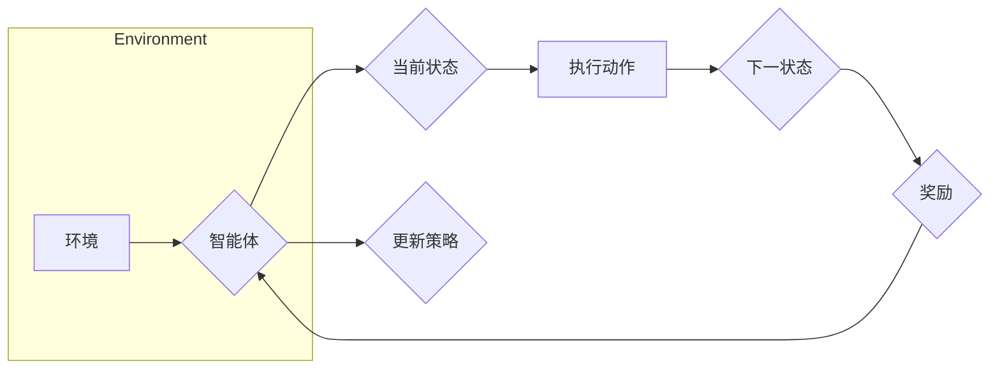

# 强化学习 (Reinforcement Learning)

> 关键词：强化学习，智能体，奖励信号，策略，价值函数，Q学习，深度Q网络，策略梯度，马尔可夫决策过程，探索-利用权衡

## 1. 背景介绍

强化学习（Reinforcement Learning，RL）是机器学习的一个分支，它通过智能体与环境的交互来学习如何在给定环境中做出最优决策。与监督学习和无监督学习不同，强化学习不依赖于大量标注数据，而是通过智能体在与环境的互动中不断学习，从而实现自我优化。

### 1.1 问题的由来

强化学习的灵感来源于心理学和行为经济学，最早可以追溯到20世纪50年代。随着计算机科学和人工智能的快速发展，强化学习逐渐成为一个独立的学科领域，并在机器人控制、游戏、推荐系统、自动驾驶等领域取得了显著的应用成果。

### 1.2 研究现状

近年来，随着深度学习的兴起，强化学习取得了长足的进步。深度强化学习（Deep Reinforcement Learning，DRL）结合了深度神经网络和强化学习，使得智能体能够学习到复杂的策略和价值函数，从而在许多复杂环境中取得了突破性的成果。

### 1.3 研究意义

强化学习的研究意义在于：
- 实现智能体的自主学习和决策能力，使其能够适应未知环境并做出最优决策。
- 在无标注数据的情况下进行学习，降低数据收集和标注的成本。
- 为构建自主系统、智能机器人、人机交互系统等提供新的技术途径。

### 1.4 本文结构

本文将系统介绍强化学习的核心概念、算法原理、数学模型、应用实践以及未来发展趋势。具体结构如下：
- 第2章，介绍强化学习的基本概念和流程。
- 第3章，深入讲解强化学习中的核心算法，包括值函数方法、策略梯度方法和蒙特卡洛方法。
- 第4章，阐述强化学习的数学模型和公式，并通过实例进行讲解。
- 第5章，给出强化学习的代码实现实例，并对关键代码进行解读。
- 第6章，探讨强化学习在实际应用场景中的应用和案例。
- 第7章，推荐强化学习相关的学习资源、开发工具和参考文献。
- 第8章，总结强化学习的研究成果、未来发展趋势和面临的挑战。
- 第9章，附录部分提供常见问题与解答。

## 2. 核心概念与联系

### 2.1 核心概念

**智能体（Agent）**：强化学习中的学习者和决策者，它通过与环境交互来学习如何做出最优决策。
**环境（Environment）**：智能体所处的环境，它为智能体提供状态、动作和奖励信号。
**状态（State）**：智能体在环境中的当前状态，通常由一组属性或特征表示。
**动作（Action）**：智能体可以采取的行动，它们将决定智能体的行为。
**奖励信号（Reward）**：环境对智能体行为的反馈，通常表示智能体的成功程度。
**策略（Policy）**：智能体选择动作的策略，它可以是显式的，也可以是隐式的。
**价值函数（Value Function）**：表示智能体在某个状态或状态序列上的预期效用或回报。
**策略梯度（Policy Gradient）**：策略梯度方法的核心思想，通过梯度上升优化策略参数。
**Q学习（Q-Learning）**：一种基于值函数的强化学习算法，通过学习Q函数来预测状态-动作值。

### 2.2 Mermaid 流程图



### 2.3 核心概念之间的联系

智能体通过与环境交互，根据当前状态和策略选择动作，环境根据动作给出下一状态和奖励信号，智能体根据奖励信号更新策略，最终目标是使累积奖励最大化。

## 3. 核心算法原理 & 具体操作步骤

### 3.1 算法原理概述

强化学习算法可以分为值函数方法、策略梯度方法和蒙特卡洛方法。

**值函数方法**：通过学习状态或状态-动作价值函数来指导智能体的决策。
**策略梯度方法**：直接优化策略参数，使得累积奖励最大化。
**蒙特卡洛方法**：通过模拟随机样本路径来估计期望回报，从而学习策略。

### 3.2 算法步骤详解

#### 3.2.1 值函数方法

**Q学习**：Q学习是一种基于值函数的强化学习算法，通过学习Q函数来预测状态-动作值。

**步骤**：
1. 初始化Q表Q(s,a)为随机值。
2. 对于智能体的每一个动作a，选择一个动作a'，使得Q(s,a')=max_{a'} Q(s,a')。
3. 执行动作a'，得到下一个状态s'和奖励r。
4. 更新Q表：Q(s,a) = Q(s,a) + α[r + γmax_{a'} Q(s',a') - Q(s,a)]，其中α为学习率，γ为折扣因子。

#### 3.2.2 策略梯度方法

**策略梯度方法**：直接优化策略参数，使得累积奖励最大化。

**步骤**：
1. 初始化策略参数θ为随机值。
2. 对于智能体的每一个动作a，计算策略梯度∇θJ(θ)。
3. 更新策略参数：θ = θ + α∇θJ(θ)，其中α为学习率。

#### 3.2.3 蒙特卡洛方法

**步骤**：
1. 初始化策略参数θ为随机值。
2. 对智能体的每一个动作a，模拟随机样本路径，计算累积回报R。
3. 计算策略梯度∇θJ(θ)。
4. 更新策略参数：θ = θ + α∇θJ(θ)，其中α为学习率。

### 3.3 算法优缺点

#### 3.3.1 值函数方法的优点

- 计算效率高，不需要进行大量的模拟。
- 对稀疏奖励环境更适用。

#### 3.3.2 值函数方法的缺点

- 对于复杂的环境，Q函数可能难以学习。
- 需要存储大量的Q值信息。

#### 3.3.3 策略梯度方法的优点

- 直接优化策略参数，可以学习到更加高效的策略。
- 对稀疏奖励环境更适用。

#### 3.3.4 策略梯度方法的缺点

- 计算效率低，需要进行大量的模拟。
- 需要处理策略梯度估计的不确定性和方差。

#### 3.3.5 蒙特卡洛方法的优点

- 对于复杂的环境，不需要学习复杂的函数。

#### 3.3.6 蒙特卡洛方法的缺点

- 计算效率低，需要进行大量的模拟。
- 对于稀疏奖励环境可能难以学习。

### 3.4 算法应用领域

强化学习算法在许多领域都有广泛的应用，包括：
- 自动驾驶
- 游戏开发
-机器人控制
- 金融交易
- 网络安全
- 能源优化

## 4. 数学模型和公式 & 详细讲解 & 举例说明

### 4.1 数学模型构建

强化学习的数学模型主要基于马尔可夫决策过程（Markov Decision Process，MDP）。

**MDP**：定义如下：

$$
\begin{align*}
M = \langle S, A, P, R, \gamma \rangle
\end{align*}
$$

其中：
- \$ S \$ 是状态空间，表示智能体可能处于的所有状态。
- \$ A \$ 是动作空间，表示智能体可能采取的所有动作。
- \$ P \$ 是状态转移概率矩阵，表示智能体在给定当前状态和动作下，转移到下一个状态的概率。
- \$ R \$ 是奖励函数，表示智能体在每个状态下采取每个动作所能获得的奖励。
- \$ \gamma \$ 是折扣因子，表示对未来奖励的折扣程度。

### 4.2 公式推导过程

#### 4.2.1 Q函数

Q函数定义为：

$$
Q(s,a) = \mathbb{E}[G(s,a)]
$$

其中 \$ G(s,a) \$ 是智能体在状态 \$ s \$ 下采取动作 \$ a \$ 并按照策略 \$ \pi \$ 采取后续动作所能获得的累积奖励。

#### 4.2.2 策略梯度

策略梯度定义为：

$$
\nabla_{\theta}J(\theta) = \mathbb{E}_{s,a}[\nabla_{\theta}\log\pi(a|s;\theta)[R(s,a) - Q(s,a)]]
$$

其中 \$ \theta \$ 是策略参数，\$ \pi(a|s;\theta) \$ 是策略 \$ \pi \$ 在状态 \$ s \$ 下采取动作 \$ a \$ 的概率。

### 4.3 案例分析与讲解

#### 4.3.1 例子：小猫抓老鼠游戏

在这个游戏中，小猫和老鼠在一个网格世界中移动。小猫的目标是抓住老鼠，而老鼠的目标是逃离小猫。游戏规则如下：

- 小猫和老鼠在网格世界中随机移动。
- 每次移动后，小猫和老鼠都会获得一个奖励。
- 小猫抓住老鼠时，获得大量奖励；老鼠逃离小猫时，获得少量奖励。
- 游戏目标：最大化小猫的累积奖励。

我们可以使用Q学习算法来训练小猫的策略。具体步骤如下：

1. 初始化Q表。
2. 在每个时间步，小猫根据Q表选择动作。
3. 执行动作，并获得奖励。
4. 更新Q表。

通过训练，小猫会学会在游戏中采取最优策略，最大化累积奖励。

## 5. 项目实践：代码实例和详细解释说明

### 5.1 开发环境搭建

在进行强化学习实践前，我们需要准备好开发环境。以下是使用Python进行PyTorch开发的环境配置流程：

1. 安装Anaconda：从官网下载并安装Anaconda，用于创建独立的Python环境。
2. 创建并激活虚拟环境：
```bash
conda create -n pytorch-env python=3.8
conda activate pytorch-env
```
3. 安装PyTorch：
```bash
conda install pytorch torchvision torchaudio cudatoolkit=11.1 -c pytorch -c conda-forge
```
4. 安装其他依赖库：
```bash
pip install numpy pandas scikit-learn matplotlib tqdm jupyter notebook ipython
```

### 5.2 源代码详细实现

下面我们以小猫抓老鼠游戏为例，给出使用PyTorch实现Q学习的代码。

```python
import numpy as np
import torch
import torch.nn as nn
import torch.optim as optim
from torch.utils.data import DataLoader
from collections import namedtuple

# 游戏参数
ACTION_SPACE = [1, 2, 3, 4, 5]  # 上、下、左、右、停止
ENV_WIDTH, ENV_HEIGHT = 5, 5
STEPS = 1000
LEARNING_RATE = 0.01
DISCOUNT_FACTOR = 0.99

# 定义环境
class CatAndMouseEnv:
    def __init__(self):
        self.cat_pos = (ENV_HEIGHT // 2, ENV_WIDTH // 2)
        self.mouse_pos = (0, 0)

    def reset(self):
        self.cat_pos = (ENV_HEIGHT // 2, ENV_WIDTH // 2)
        self.mouse_pos = (0, 0)
        return np.array(self.cat_pos)

    def step(self, action):
        new_cat_pos = np.copy(self.cat_pos)
        if action == 1:  # 上
            new_cat_pos[0] = max(0, self.cat_pos[0] - 1)
        elif action == 2:  # 下
            new_cat_pos[0] = min(ENV_HEIGHT - 1, self.cat_pos[0] + 1)
        elif action == 3:  # 左
            new_cat_pos[1] = max(0, self.cat_pos[1] - 1)
        elif action == 4:  # 右
            new_cat_pos[1] = min(ENV_WIDTH - 1, self.cat_pos[1] + 1)
        elif action == 5:  # 停止
            pass

        if new_cat_pos == self.mouse_pos:
            reward = 10
        else:
            reward = -1

        self.cat_pos = new_cat_pos
        return np.array(self.cat_pos), reward

# 定义网络
class QNetwork(nn.Module):
    def __init__(self, state_size, action_size):
        super(QNetwork, self).__init__()
        self.fc1 = nn.Linear(state_size, 128)
        self.fc2 = nn.Linear(128, action_size)

    def forward(self, state):
        x = torch.relu(self.fc1(state))
        return self.fc2(x)

# 定义训练函数
def train_q_network(q_network, env, optimizer, steps):
    for _ in range(steps):
        state = env.reset()
        state = torch.from_numpy(state).float().unsqueeze(0)
        done = False
        while not done:
            with torch.no_grad():
                q_values = q_network(state)
            action = ACTION_SPACE[np.argmax(q_values.numpy())]
            next_state, reward, done, _ = env.step(action)
            next_state = torch.from_numpy(next_state).float().unsqueeze(0)
            target_q = reward + DISCOUNT_FACTOR * torch.max(q_network(next_state))
            loss = F.mse_loss(q_values, target_q.unsqueeze(1))
            optimizer.zero_grad()
            loss.backward()
            optimizer.step()
            state = next_state

# 创建环境、网络和优化器
env = CatAndMouseEnv()
q_network = QNetwork(ENV_WIDTH * ENV_HEIGHT, len(ACTION_SPACE))
optimizer = optim.Adam(q_network.parameters(), lr=LEARNING_RATE)

# 训练网络
train_q_network(q_network, env, optimizer, STEPS)
```

### 5.3 代码解读与分析

以上代码实现了小猫抓老鼠游戏的Q学习算法。以下是关键代码的解读和分析：

- **CatAndMouseEnv**：定义了小猫抓老鼠游戏的环境，包括状态、动作、奖励和游戏规则。
- **QNetwork**：定义了Q网络的神经网络结构，包括两个全连接层。
- **train_q_network**：定义了训练Q网络的函数，包括Q网络的初始化、Q网络的更新和损失函数的计算。
- **训练过程**：首先创建环境、网络和优化器。然后，通过多个时间步迭代训练过程，每个时间步中，智能体根据Q网络选择动作，执行动作，并根据动作获得奖励。最后，根据奖励和下一个状态更新Q网络。

### 5.4 运行结果展示

通过运行上述代码，我们可以观察到小猫通过学习逐渐掌握了抓捕老鼠的策略。经过一定数量的训练步骤后，小猫能够以较高的概率抓住老鼠。

## 6. 实际应用场景

### 6.1 自动驾驶

自动驾驶是强化学习最典型的应用场景之一。通过在模拟环境和真实环境中训练，自动驾驶系统可以学习到在各种交通场景下做出正确的决策，例如：

- 刹车、加速和转向。
- 遵守交通规则。
- 应对突发事件。

### 6.2 游戏开发

强化学习在游戏开发中也有着广泛的应用，例如：

- 游戏角色控制。
- 游戏人工智能。
- 游戏平衡。

### 6.3 机器人控制

强化学习可以用于训练机器人在各种环境中进行操作，例如：

- 机器人路径规划。
- 机器人抓取。
- 机器人导航。

### 6.4 金融交易

强化学习可以用于训练智能交易系统，例如：

- 股票交易。
- 商品交易。
- 期货交易。

### 6.5 网络安全

强化学习可以用于训练网络安全系统，例如：

- 入侵检测。
- 恶意软件检测。
- 网络流量分析。

### 6.6 能源优化

强化学习可以用于优化能源系统，例如：

- 能源需求预测。
- 电力调度。
- 储能系统管理。

## 7. 工具和资源推荐

### 7.1 学习资源推荐

- 《Reinforcement Learning: An Introduction》
- 《Artificial Intelligence: A Modern Approach》
- 《Deep Reinforcement Learning》
- 《Reinforcement Learning with Python》

### 7.2 开发工具推荐

- TensorFlow
- PyTorch
- OpenAI Gym
- Stable Baselines

### 7.3 相关论文推荐

- Q-Learning (Watkins & Dayan, 1992)
- Value Iteration (Bellman, 1957)
- Policy Iteration (Bellman, 1957)
- Policy Gradient (Sutton & Barto, 1998)
- Deep Q-Network (Mnih et al., 2013)
- Asynchronous Advantage Actor-Critic (Schulman et al., 2015)
- Proximal Policy Optimization (Schulman et al., 2015)

## 8. 总结：未来发展趋势与挑战

### 8.1 研究成果总结

强化学习在过去几十年中取得了显著的进展，从简单的Q学习、策略梯度方法到深度强化学习，强化学习算法在许多领域都取得了突破性的成果。深度强化学习结合了深度学习和强化学习的优势，使得智能体能够学习到更加复杂的策略和价值函数，从而在复杂环境中取得更好的效果。

### 8.2 未来发展趋势

未来，强化学习将朝着以下方向发展：

- 更高效的算法和算法组合。
- 更好的可解释性和可理解性。
- 更广泛的应用领域。
- 与其他人工智能技术的融合。

### 8.3 面临的挑战

尽管强化学习取得了显著的进展，但仍然面临着以下挑战：

- 可解释性和可理解性。
- 稳定性和收敛性。
- 计算效率。
- 与现实世界问题的结合。

### 8.4 研究展望

未来，强化学习的研究将主要集中在以下几个方面：

- 新算法的研究和开发。
- 可解释性和可理解性的研究。
- 计算效率的提升。
- 与其他人工智能技术的融合。

## 9. 附录：常见问题与解答

**Q1：强化学习与其他机器学习方法有什么区别？**

A：强化学习与监督学习和无监督学习的主要区别在于：

- 监督学习需要大量标注数据，而强化学习不依赖于标注数据。
- 无监督学习不需要任何标签信息，而强化学习需要奖励信号。
- 监督学习的目标是最小化损失函数，而强化学习的目标是最大化累积奖励。

**Q2：强化学习在哪些领域有应用？**

A：强化学习在许多领域都有应用，包括：

- 自动驾驶
- 游戏开发
- 机器人控制
- 金融交易
- 网络安全
- 能源优化

**Q3：如何选择合适的强化学习算法？**

A：选择合适的强化学习算法需要考虑以下因素：

- 环境特点
- 任务类型
- 计算资源
- 研究目的

**Q4：如何解决强化学习中的收敛性问题？**

A：解决强化学习中的收敛性问题可以采取以下方法：

- 使用适当的探索-利用策略。
- 使用经验回放技术。
- 使用优先级队列存储经验。
- 使用梯度裁剪技术。

**Q5：如何提高强化学习算法的可解释性？**

A：提高强化学习算法的可解释性可以采取以下方法：

- 使用可视化技术。
- 分析策略和价值函数。
- 使用可解释的神经网络架构。

作者：禅与计算机程序设计艺术 / Zen and the Art of Computer Programming