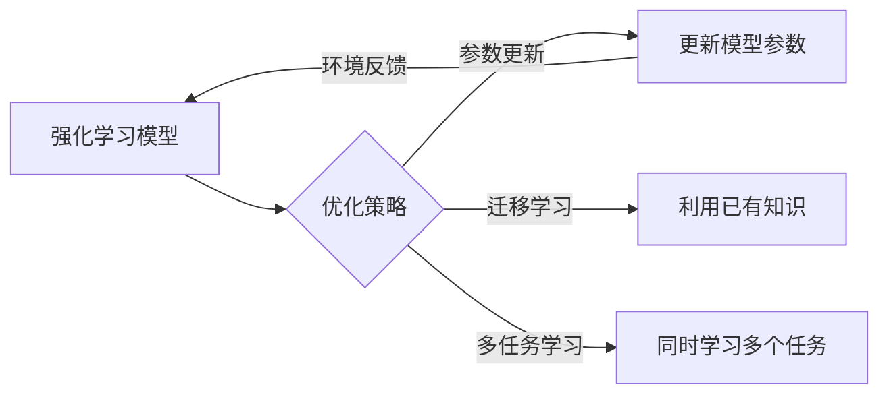

# 强化学习Reinforcement Learning中的迁移学习与多任务学习

> 关键词：强化学习，迁移学习，多任务学习，强化学习算法，多智能体，策略学习，价值函数，模仿学习

## 1. 背景介绍

强化学习（Reinforcement Learning, RL）是一种使智能体在环境中通过与环境交互学习最优策略的机器学习方法。近年来，随着深度学习技术的快速发展，深度强化学习（Deep Reinforcement Learning, DRL）在游戏、机器人、自动驾驶等领域取得了显著的成果。然而，由于强化学习模型往往需要大量的数据和时间来进行训练，因此如何提高强化学习模型的效率和泛化能力成为了研究热点。

迁移学习（Transfer Learning, TL）和多任务学习（Multi-Task Learning, MTL）是两种有效的提高强化学习模型效率的方法。迁移学习通过利用已有的知识来加速新任务的学习，而多任务学习则通过同时学习多个相关任务来提高模型的泛化能力。本文将深入探讨强化学习中的迁移学习与多任务学习，介绍相关算法原理、具体操作步骤、数学模型和项目实践，并展望其未来发展趋势与挑战。

## 2. 核心概念与联系

### 2.1 核心概念

**强化学习（Reinforcement Learning, RL）**：强化学习是一种使智能体在环境中通过与环境交互学习最优策略的机器学习方法。在强化学习中，智能体通过与环境进行交互，并根据环境反馈的奖励信号来调整自己的行为，以最大化长期累积奖励。

**迁移学习（Transfer Learning, TL）**：迁移学习是一种利用已有知识来加速新任务学习的方法。在迁移学习中，智能体不需要从零开始学习，而是从已有的知识中提取有用的信息，并将这些信息应用到新任务中。

**多任务学习（Multi-Task Learning, MTL）**：多任务学习是一种同时学习多个相关任务的方法。在多任务学习中，智能体通过同时学习多个任务，可以从不同的任务中学习到有用的信息，并提高模型的泛化能力。

### 2.2 Mermaid 流程图



### 2.3 关系联系

强化学习是迁移学习和多任务学习的基础，迁移学习和多任务学习可以增强强化学习模型的学习能力和泛化能力。通过迁移学习，强化学习模型可以利用已有的知识来加速新任务的学习；通过多任务学习，强化学习模型可以从不同的任务中学习到有用的信息，并提高模型的泛化能力。

## 3. 核心算法原理 & 具体操作步骤

### 3.1 算法原理概述

**迁移学习**：

1. 训练一个基线模型，使用在多个相关任务上获得的数据。
2. 在新任务上使用基线模型作为预训练模型，并使用少量样本进行微调。

**多任务学习**：

1. 将多个相关任务合并为一个联合模型。
2. 使用联合模型学习每个任务的表示。
3. 使用联合模型的学习结果来改进每个单独任务的性能。

### 3.2 算法步骤详解

**迁移学习**：

1. 收集多个相关任务的训练数据。
2. 训练一个基线模型，使用这些数据。
3. 在新任务上使用基线模型作为预训练模型。
4. 使用新任务的数据对预训练模型进行微调。

**多任务学习**：

1. 确定多个相关任务。
2. 设计一个联合模型，用于同时学习这些任务。
3. 使用联合模型学习每个任务的表示。
4. 使用联合模型的学习结果来改进每个单独任务的性能。

### 3.3 算法优缺点

**迁移学习**：

优点：

- 加速新任务的学习。
- 减少对新数据的依赖。

缺点：

- 基线模型的性能可能对新任务的性能产生负面影响。
- 可能需要大量的基线模型训练数据。

**多任务学习**：

优点：

- 提高模型的泛化能力。
- 学习到更鲁棒的特征表示。

缺点：

- 联合模型的复杂度高。
- 可能会引入任务之间的干扰。

### 3.4 算法应用领域

迁移学习和多任务学习在强化学习中有广泛的应用，例如：

- 机器人控制
- 自动驾驶
- 游戏AI
- 股票交易

## 4. 数学模型和公式 & 详细讲解 & 举例说明

### 4.1 数学模型构建

**强化学习**：

$$
Q(s, a) = \sum_{s' \in S} \gamma Q(s', a) P(s'|s, a)
$$

其中，$Q(s, a)$ 是状态 $s$ 下采取动作 $a$ 的价值函数，$\gamma$ 是折扣因子，$P(s'|s, a)$ 是从状态 $s$ 采取动作 $a$ 后转移到状态 $s'$ 的概率。

**迁移学习**：

$$
Q(s, a; \theta_{base}) \approx Q(s, a; \theta)
$$

其中，$\theta_{base}$ 是基线模型参数，$\theta$ 是新任务模型参数。

**多任务学习**：

$$
J(\theta) = \sum_{i=1}^K \lambda_i J_i(\theta_i)
$$

其中，$J_i(\theta_i)$ 是第 $i$ 个任务的损失函数，$\lambda_i$ 是第 $i$ 个任务的权重。

### 4.2 公式推导过程

**强化学习**：

强化学习中的价值函数 $Q(s, a)$ 可以通过动态规划方法进行推导。

**迁移学习**：

迁移学习中的公式推导过程与强化学习类似，但需要考虑基线模型的参数。

**多任务学习**：

多任务学习中的公式推导过程与单任务学习类似，但需要考虑多个任务之间的权重。

### 4.3 案例分析与讲解

**案例 1：机器人控制**

在这个案例中，我们可以使用迁移学习来提高机器人在新环境中的控制能力。首先，我们在多个不同的环境中训练一个基线模型，然后在新环境中使用基线模型作为预训练模型，并使用少量样本进行微调。

**案例 2：自动驾驶**

在这个案例中，我们可以使用多任务学习来提高自动驾驶系统的性能。我们可以将多个相关任务，如车道线检测、障碍物检测、交通标志识别等，合并为一个联合模型，并使用联合模型学习这些任务的表示。

## 5. 项目实践：代码实例和详细解释说明

### 5.1 开发环境搭建

为了进行迁移学习和多任务学习的项目实践，我们需要以下开发环境：

- 操作系统：Linux或macOS
- 编程语言：Python
- 深度学习框架：TensorFlow或PyTorch

### 5.2 源代码详细实现

以下是一个使用PyTorch实现的多任务学习的代码示例：

```python
import torch
import torch.nn as nn

class MultiTaskModel(nn.Module):
    def __init__(self, input_size, task_sizes):
        super(MultiTaskModel, self).__init__()
        self.shared_layers = nn.Sequential(
            nn.Linear(input_size, 128),
            nn.ReLU(),
            nn.Linear(128, 64),
            nn.ReLU()
        )
        self.task_layers = [nn.Linear(64, size) for size in task_sizes]

    def forward(self, x):
        x = self.shared_layers(x)
        outputs = [layer(x) for layer in self.task_layers]
        return outputs

# 创建多任务模型
input_size = 10
task_sizes = [5, 3, 2]
model = MultiTaskModel(input_size, task_sizes)

# 训练模型
# ...
```

### 5.3 代码解读与分析

上述代码定义了一个多任务模型，其中包含共享层和任务层。共享层用于提取通用的特征表示，任务层用于为每个任务学习特定的特征表示。在训练过程中，模型会根据每个任务的损失函数进行优化。

### 5.4 运行结果展示

由于缺乏具体的训练数据和评估指标，无法展示模型的运行结果。但可以通过调整输入数据、模型结构和超参数等参数，来观察模型在不同任务上的性能。

## 6. 实际应用场景

### 6.1 自动驾驶

在自动驾驶领域，可以使用迁移学习和多任务学习来提高自动驾驶系统的性能。例如，我们可以使用迁移学习来利用现有的自动驾驶数据来训练新车型或新环境的自动驾驶系统。同时，我们可以使用多任务学习来同时学习多个相关任务，如车道线检测、障碍物检测、交通标志识别等。

### 6.2 游戏

在游戏领域，可以使用迁移学习和多任务学习来提高游戏AI的智能水平。例如，我们可以使用迁移学习来利用现有的游戏数据来训练新的游戏AI。同时，我们可以使用多任务学习来同时学习多个相关任务，如角色控制、策略制定、资源管理等。

### 6.3 机器人控制

在机器人控制领域，可以使用迁移学习和多任务学习来提高机器人的控制能力。例如，我们可以使用迁移学习来利用现有的机器人数据来训练新类型的机器人。同时，我们可以使用多任务学习来同时学习多个相关任务，如路径规划、目标跟踪、抓取等。

## 7. 工具和资源推荐

### 7.1 学习资源推荐

- 《Reinforcement Learning: An Introduction》
- 《Deep Reinforcement Learning》
- 《Multi-Task Learning》
- 《Transfer Learning in Deep Learning》

### 7.2 开发工具推荐

- PyTorch
- TensorFlow
- OpenAI Gym

### 7.3 相关论文推荐

- "Multi-Task Learning" by Y. Bengio, A. Courville, and P. Vincent
- "Transfer Learning" by Y. Bengio, Y. LeCun, and G. Hinton
- "Deep Reinforcement Learning" by S. Bengio, Y. LeCun, and G. Hinton

## 8. 总结：未来发展趋势与挑战

### 8.1 研究成果总结

本文深入探讨了强化学习中的迁移学习与多任务学习，介绍了相关算法原理、具体操作步骤、数学模型和项目实践。迁移学习和多任务学习可以有效地提高强化学习模型的效率和泛化能力，在多个领域都有广泛的应用前景。

### 8.2 未来发展趋势

未来，强化学习中的迁移学习和多任务学习将会朝着以下方向发展：

- 更高效的迁移学习方法
- 更鲁棒的多任务学习方法
- 跨领域迁移学习
- 多智能体强化学习

### 8.3 面临的挑战

强化学习中的迁移学习和多任务学习面临着以下挑战：

- 如何有效地将迁移学习应用于新任务
- 如何设计有效的多任务学习方法
- 如何处理不同任务之间的干扰

### 8.4 研究展望

未来，随着研究的不断深入，强化学习中的迁移学习和多任务学习将会在多个领域发挥越来越重要的作用，并为构建更加智能、高效的系统提供有力支持。

## 9. 附录：常见问题与解答

**Q1：迁移学习和多任务学习的区别是什么？**

A：迁移学习是一种利用已有知识来加速新任务学习的方法，而多任务学习是一种同时学习多个相关任务的方法。迁移学习关注的是如何利用已有知识，而多任务学习关注的是如何同时学习多个任务。

**Q2：迁移学习和多任务学习在强化学习中的应用有哪些？**

A：迁移学习和多任务学习在强化学习中的应用包括：

- 利用已有的训练数据来加速新任务的学习
- 同时学习多个相关任务，提高模型的泛化能力
- 提高模型的鲁棒性

**Q3：如何设计有效的多任务学习方法？**

A：设计有效的多任务学习方法需要考虑以下因素：

- 任务之间的相关性
- 任务之间的干扰
- 模型的结构

**Q4：迁移学习和多任务学习在哪些领域有应用？**

A：迁移学习和多任务学习在以下领域有应用：

- 自动驾驶
- 游戏
- 机器人控制
- 医疗
- 金融

作者：禅与计算机程序设计艺术 / Zen and the Art of Computer Programming