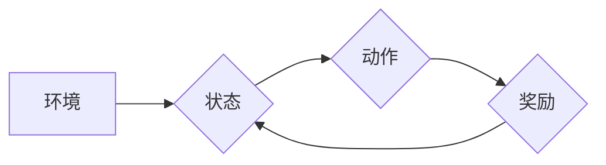

# 强化学习：在媒体行业中的应用

> 关键词：强化学习，媒体行业，推荐系统，内容个性化，广告投放，新闻推荐，虚拟现实，人机交互

## 1. 背景介绍

随着互联网的迅速发展，媒体行业面临着前所未有的机遇和挑战。海量信息爆炸式增长，用户需求日益多样化，如何高效地推荐内容、优化用户体验、提升广告投放效果成为媒体行业亟待解决的问题。强化学习（Reinforcement Learning，RL）作为一种先进的人工智能技术，因其能够处理动态环境和决策过程的特性，在媒体行业的多个领域展现出巨大的应用潜力。

### 1.1 问题的由来

媒体行业的主要问题可以概括为以下几点：

- **内容推荐**：如何根据用户兴趣和阅读历史，推荐用户感兴趣的内容，提高用户粘性和留存率？
- **广告投放**：如何精准地投放广告，提高广告投放效果和ROI？
- **虚拟现实**：如何利用虚拟现实（Virtual Reality，VR）技术提供沉浸式体验，吸引用户并增加收入？
- **人机交互**：如何设计更加自然、流畅的人机交互界面，提升用户体验？

### 1.2 研究现状

近年来，强化学习在媒体行业中的应用研究取得了显著进展。以下是一些代表性的研究方向：

- **内容推荐**：利用强化学习优化推荐算法，实现个性化内容推荐，提高用户满意度。
- **广告投放**：通过强化学习模型实现精准广告投放，提高广告效果和ROI。
- **虚拟现实**：利用强化学习优化VR内容生成和用户交互过程，提升用户体验。
- **人机交互**：设计基于强化学习的交互模型，实现更加智能的人机交互。

### 1.3 研究意义

强化学习在媒体行业中的应用具有重要意义：

- **提升用户体验**：通过个性化推荐和优化广告投放，提升用户满意度和忠诚度。
- **提高经济效益**：精准的广告投放和内容推荐，提高广告效果和收入。
- **创新业务模式**：利用VR和强化学习技术，开拓新的业务模式和盈利渠道。
- **推动技术发展**：推动强化学习在媒体行业的应用，促进人工智能技术的发展。

## 2. 核心概念与联系

### 2.1 核心概念

强化学习（Reinforcement Learning，RL）是一种通过与环境交互来学习决策策略的人工智能技术。它由四个主要元素组成：

- **环境（Environment）**：指模型操作的外部世界，模型可以通过与环境进行交互来获取状态、执行动作并得到奖励。
- **状态（State）**：指环境在某一时刻的状态信息，模型根据当前状态选择动作。
- **动作（Action）**：指模型在某一状态下可以执行的操作。
- **奖励（Reward）**：指环境对模型执行动作后的反馈，用于评估动作的好坏。

### 2.2 Mermaid 流程图



### 2.3 核心概念联系

强化学习模型通过不断与环境交互，学习最优的动作策略，以最大化累积奖励。在媒体行业中，强化学习模型可以应用于以下场景：

- **内容推荐**：环境为用户和内容集合，状态为用户特征和内容特征，动作为推荐内容，奖励为用户对内容的点击率、阅读时长等。
- **广告投放**：环境为广告主和用户集合，状态为广告特征和用户特征，动作为展示广告，奖励为用户对广告的点击率、转化率等。
- **虚拟现实**：环境为VR内容和用户行为，状态为用户位置、动作等，动作为生成VR内容，奖励为用户满意度、停留时间等。
- **人机交互**：环境为用户和交互界面，状态为用户输入和界面状态，动作为界面反馈，奖励为用户满意度、操作效率等。

## 3. 核心算法原理 & 具体操作步骤

### 3.1 算法原理概述

强化学习算法的核心是价值函数（Value Function）和策略函数（Policy Function）。

- **价值函数**：表示在给定状态下采取特定动作的期望累积奖励。
- **策略函数**：表示在给定状态下选择动作的概率分布。

强化学习算法通过迭代更新价值函数和策略函数，学习最优的决策策略。

### 3.2 算法步骤详解

强化学习算法的典型步骤如下：

1. 初始化：初始化价值函数和策略函数。
2. 选择动作：在给定状态下，根据策略函数选择动作。
3. 执行动作：执行选择的动作，并获取奖励和新的状态。
4. 更新价值函数和策略函数：根据奖励和新的状态更新价值函数和策略函数。
5. 重复步骤2-4，直到达到终止条件。

### 3.3 算法优缺点

强化学习算法的优点：

- 能够处理动态环境和决策过程。
- 能够学习到复杂和抽象的决策策略。
- 能够根据环境变化动态调整策略。

强化学习算法的缺点：

- 学习过程可能需要较长时间。
- 需要大量的样本数据。
- 实现起来比较复杂。

### 3.4 算法应用领域

强化学习算法在以下领域具有广泛的应用：

- **机器人控制**：自动驾驶、无人机控制、机器人路径规划等。
- **游戏**：棋类游戏、视频游戏等。
- **自然语言处理**：文本生成、机器翻译等。
- **金融**：股票交易、风险管理等。
- **媒体行业**：内容推荐、广告投放、虚拟现实等。

## 4. 数学模型和公式 & 详细讲解 & 举例说明

### 4.1 数学模型构建

强化学习的数学模型通常由以下部分组成：

- **状态空间（State Space）**：所有可能的状态集合。
- **动作空间（Action Space）**：所有可能动作集合。
- **奖励函数（Reward Function）**：定义了状态和动作之间的奖励关系。
- **价值函数（Value Function）**：表示在给定状态下采取特定动作的期望累积奖励。
- **策略函数（Policy Function）**：表示在给定状态下选择动作的概率分布。

### 4.2 公式推导过程

以下是一个简单的强化学习模型——Q-Learning的公式推导过程。

**Q-Learning**是一种基于值函数的强化学习算法，其目标是学习一个最优的动作值函数 $Q(s,a)$，表示在状态 $s$ 下采取动作 $a$ 的期望累积奖励。

**公式**：

$$
Q(s,a) = \sum_{s'} \gamma \max_{a'} Q(s',a')
$$

其中，$\gamma$ 是折扣因子，表示未来奖励的现值。

### 4.3 案例分析与讲解

以下以内容推荐为例，说明强化学习在媒体行业中的应用。

**场景**：推荐系统需要根据用户特征和内容特征，推荐用户感兴趣的内容。

**状态**：用户特征（如年龄、性别、兴趣等）和内容特征（如类别、标签、标题等）。

**动作**：推荐特定内容。

**奖励**：用户对内容的点击率、阅读时长等。

**策略函数**：根据用户特征和内容特征，计算每个内容的推荐概率。

**Q-Learning**算法将用于学习最优的推荐策略。

**步骤**：

1. 初始化 $Q(s,a)$ 和策略函数。
2. 根据策略函数推荐内容。
3. 根据用户反馈计算奖励。
4. 更新 $Q(s,a)$ 和策略函数。
5. 重复步骤2-4，直到收敛。

通过学习，推荐系统可以逐渐学习到最优的推荐策略，为用户推荐其感兴趣的内容。

## 5. 项目实践：代码实例和详细解释说明

### 5.1 开发环境搭建

以下是使用Python进行强化学习项目实践的环境搭建步骤：

1. 安装Python 3.x版本。
2. 安装PyTorch框架。
3. 安装NumPy库。

### 5.2 源代码详细实现

以下是一个简单的Q-Learning算法实现示例：

```python
import numpy as np
import random

# 初始化Q表
Q = np.zeros((state_size, action_size))

# Q-Learning参数
alpha = 0.1  # 学习率
gamma = 0.6  # 折扣因子
epsilon = 0.1  # 探索概率

# 状态空间大小
state_size = 100

# 动作空间大小
action_size = 4

# 环境模拟
def environment(state):
    # 模拟状态转移和奖励
    ...

# Q-Learning算法
def q_learning(state, action):
    # 执行动作，获取奖励和新的状态
    new_state, reward = environment(state, action)
    
    # 更新Q值
    Q[state, action] = Q[state, action] + alpha * (reward + gamma * np.max(Q[new_state, :]) - Q[state, action])
    
    return new_state, reward

# 主循环
for episode in range(1000):
    # 初始化状态
    state = random.randint(0, state_size - 1)
    
    # 探索或利用
    if random.uniform(0, 1) < epsilon:
        action = random.randint(0, action_size - 1)
    else:
        action = np.argmax(Q[state, :])
    
    # 执行动作，更新Q值
    new_state, reward = q_learning(state, action)
    
    state = new_state
```

### 5.3 代码解读与分析

以上代码演示了Q-Learning算法的基本实现。首先初始化一个Q表，用于存储每个状态-动作对的价值。然后，在主循环中，随机选择一个初始状态，根据探索或利用策略选择一个动作，执行动作并获取奖励和新的状态，最后更新Q值。

### 5.4 运行结果展示

由于代码示例较为简单，未实现具体的环境模拟和奖励计算，因此无法直接运行展示结果。在实际应用中，需要根据具体任务实现环境模拟和奖励计算，并对Q-Learning算法进行优化和改进。

## 6. 实际应用场景

### 6.1 内容推荐

强化学习在内容推荐中的应用非常广泛，以下是一些常见的应用场景：

- **个性化推荐**：根据用户兴趣和阅读历史，推荐用户感兴趣的内容。
- **推荐排序**：根据内容特征和用户特征，对推荐内容进行排序。
- **内容挖掘**：从海量内容中挖掘出用户可能感兴趣的内容。

### 6.2 广告投放

强化学习在广告投放中的应用主要包括：

- **广告投放策略**：根据用户特征和广告特征，选择合适的广告投放策略。
- **广告排序**：根据用户点击率、转化率等指标，对广告进行排序。
- **广告创意优化**：根据用户反馈，优化广告创意。

### 6.3 虚拟现实

强化学习在虚拟现实中的应用主要包括：

- **虚拟现实内容生成**：根据用户喜好和场景需求，生成个性化的虚拟现实内容。
- **虚拟现实交互优化**：根据用户反馈，优化虚拟现实交互过程。

### 6.4 人机交互

强化学习在媒体行业的人机交互中，可以用于：

- **用户界面设计**：根据用户使用习惯，设计更加直观、易用的用户界面。
- **智能客服**：根据用户提问，智能地回答用户问题。
- **游戏设计**：根据用户行为，设计更加吸引人的游戏。

## 7. 工具和资源推荐

### 7.1 学习资源推荐

- 《Reinforcement Learning: An Introduction》（Sutton and Barto）
- 《Reinforcement Learning: Principles and Practice》（Sutton, Barto, and McCloskey）
- 《Deep Reinforcement Learning》（Sutton, Silver, and Bengio）

### 7.2 开发工具推荐

- PyTorch：开源的深度学习框架，适用于强化学习开发。
- TensorFlow：开源的深度学习框架，适用于强化学习开发。
- OpenAI Gym：开源的强化学习环境库。

### 7.3 相关论文推荐

- Q-Learning: http://incompleteideas.net/sutton-book/chapter9.pdf
- Deep Reinforcement Learning：http://arxiv.org/abs/1509.02971
- Policy Gradient Methods：http://arxiv.org/abs/1702.02281

## 8. 总结：未来发展趋势与挑战

### 8.1 研究成果总结

本文介绍了强化学习在媒体行业中的应用，包括核心概念、算法原理、应用场景等。强化学习在内容推荐、广告投放、虚拟现实和人机交互等领域具有广泛的应用前景。

### 8.2 未来发展趋势

未来，强化学习在媒体行业中的应用将呈现以下趋势：

- **多智能体强化学习**：多智能体强化学习可以将多个强化学习模型协同工作，实现更加复杂和智能的媒体系统。
- **强化学习与知识表示融合**：将强化学习与知识表示技术融合，可以使得强化学习模型更好地理解和处理现实世界。
- **强化学习与深度学习融合**：将强化学习与深度学习融合，可以使得强化学习模型学习到更加复杂的特征和决策策略。

### 8.3 面临的挑战

强化学习在媒体行业中的应用也面临着以下挑战：

- **数据质量**：强化学习需要大量的样本数据，数据质量直接影响模型性能。
- **计算复杂度**：强化学习模型通常需要大量的计算资源，计算复杂度较高。
- **可解释性**：强化学习模型的决策过程通常难以解释，可解释性较差。

### 8.4 研究展望

未来，强化学习在媒体行业中的应用需要关注以下研究方向：

- **数据采集和标注**：探索更加高效的数据采集和标注方法，为强化学习提供高质量的数据。
- **模型压缩和加速**：探索模型压缩和加速技术，降低强化学习模型的计算复杂度。
- **可解释性研究**：研究强化学习模型的可解释性，提升模型的可信度。

## 9. 附录：常见问题与解答

**Q1：强化学习在媒体行业中的应用有哪些优势？**

A：强化学习在媒体行业中的应用具有以下优势：

- **个性化推荐**：根据用户兴趣和阅读历史，推荐用户感兴趣的内容。
- **精准广告投放**：根据用户特征和广告特征，精准地投放广告，提高广告效果和ROI。
- **提升用户体验**：利用强化学习优化虚拟现实和交互界面，提升用户体验。

**Q2：强化学习在媒体行业中的应用有哪些挑战？**

A：强化学习在媒体行业中的应用也面临着以下挑战：

- **数据质量**：强化学习需要大量的样本数据，数据质量直接影响模型性能。
- **计算复杂度**：强化学习模型通常需要大量的计算资源，计算复杂度较高。
- **可解释性**：强化学习模型的决策过程通常难以解释，可解释性较差。

**Q3：如何解决强化学习在媒体行业中的应用问题？**

A：解决强化学习在媒体行业中的应用问题需要从以下几个方面入手：

- **数据质量**：提高数据采集和标注的质量，为强化学习提供高质量的数据。
- **计算优化**：采用模型压缩和加速技术，降低强化学习模型的计算复杂度。
- **可解释性研究**：研究强化学习模型的可解释性，提升模型的可信度。

**Q4：强化学习在媒体行业中的应用前景如何？**

A：强化学习在媒体行业中的应用前景非常广阔，有望在以下领域取得突破：

- **内容推荐**：提升个性化推荐效果，提高用户满意度和留存率。
- **广告投放**：提高广告效果和ROI，为媒体行业带来更多收益。
- **虚拟现实**：提供更加沉浸式和个性化的VR体验。
- **人机交互**：提升用户体验，构建更加智能的媒体系统。

作者：禅与计算机程序设计艺术 / Zen and the Art of Computer Programming