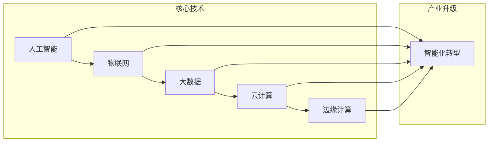

# 智能产业化的未来发展方向

> 关键词：智能化转型，产业升级，人工智能，物联网，云计算，边缘计算，数据驱动，可持续发展

## 1. 背景介绍

在当今世界，智能产业化已成为推动经济增长和社会进步的重要力量。随着人工智能、物联网、大数据等技术的快速发展，传统产业正在经历一场深刻的变革，智能化转型成为产业升级的必然趋势。本文将探讨智能产业化的未来发展方向，分析其核心概念、技术原理、应用场景以及面临的挑战。

### 1.1 问题的由来

随着全球经济增长放缓，传统产业面临着成本上升、资源环境约束等挑战。为突破发展瓶颈，提升产业竞争力，企业开始积极探索智能化转型之路。智能化转型不仅能够提高生产效率，降低成本，还能促进产品创新和服务升级，推动产业向高端化、绿色化、服务化方向发展。

### 1.2 研究现状

近年来，智能产业化在我国取得了显著进展。政府出台了一系列政策支持智能产业发展，企业纷纷加大研发投入，推动人工智能、物联网、大数据等技术与实体经济深度融合。然而，智能产业化仍面临诸多挑战，如核心技术自主可控、人才短缺、数据安全等。

### 1.3 研究意义

研究智能产业化的未来发展方向，对于推动我国产业升级、构建现代化经济体系具有重要意义。通过深入分析智能产业化的技术原理、应用场景和挑战，可以为政府、企业和研究机构提供决策参考，助力我国智能产业健康、可持续发展。

### 1.4 本文结构

本文将围绕以下内容展开：
- 介绍智能产业化的核心概念与联系。
- 阐述智能产业化的技术原理和具体操作步骤。
- 分析智能产业化的数学模型和公式。
- 展示智能产业化的项目实践案例。
- 探讨智能产业化的实际应用场景和未来应用展望。
- 推荐智能产业化的学习资源、开发工具和参考文献。
- 总结智能产业化的未来发展趋势与挑战。

## 2. 核心概念与联系

### 2.1 智能产业化的核心概念

#### 智能化转型

智能化转型是指企业利用人工智能、物联网、大数据等技术，对生产、管理、服务等环节进行智能化改造，提升产业效率和竞争力的过程。

#### 产业升级

产业升级是指产业在发展过程中，通过技术创新、结构优化、模式创新等途径，实现从低附加值向高附加值、从粗放型向集约型、从传统产业向现代产业转变的过程。

#### 人工智能

人工智能（Artificial Intelligence，AI）是指使计算机具备人类智能特性，能够感知、推理、学习和适应的技术。

#### 物联网

物联网（Internet of Things，IoT）是指通过信息传感设备，将各种物品连接到互联网上进行信息交换和通信的技术。

#### 大数据

大数据（Big Data）是指规模庞大、结构复杂、类型多样的数据集合，需要通过先进的数据处理技术进行分析和应用。

#### 云计算

云计算（Cloud Computing）是指通过网络提供可按需使用、按量付费的计算资源和服务。

#### 边缘计算

边缘计算（Edge Computing）是指将数据处理和计算任务从云端迁移到网络边缘，以降低延迟、提高实时性和安全性。

### 2.2 Mermaid流程图



### 2.3 概念联系

智能产业化是产业升级的重要驱动力，其核心技术包括人工智能、物联网、大数据、云计算和边缘计算。这些技术相互关联、相互促进，共同推动产业智能化转型。

## 3. 核心算法原理 & 具体操作步骤

### 3.1 算法原理概述

智能产业化的核心算法主要包括以下几个方面：

#### 人工智能算法

- 机器学习：利用数据驱动的方式，让计算机模拟人类学习过程，实现模式识别、预测、决策等功能。
- 深度学习：一种特殊的机器学习方法，通过神经网络模拟人脑处理信息的方式，在图像识别、语音识别等领域取得了突破性进展。

#### 物联网算法

- 物联网协议：实现设备之间的互联互通，如MQTT、CoAP等。
- 数据传输算法：保证数据传输的可靠性、实时性和安全性，如可靠传输、数据压缩等。

#### 大数据算法

- 数据挖掘：从海量数据中提取有价值的信息，如聚类、分类、关联规则等。
- 数据可视化：将数据以图形、图像等形式直观展示，便于用户分析和理解。

#### 云计算算法

- 资源调度算法：合理分配云计算资源，提高资源利用率，如任务调度、负载均衡等。
- 虚拟化技术：将物理服务器虚拟化为多个虚拟机，提高硬件资源的利用率。

#### 边缘计算算法

- 网络优化算法：优化数据传输路径，降低延迟，如路由算法、拥塞控制等。
- 资源分配算法：合理分配边缘计算资源，提高系统性能，如任务调度、资源管理等。

### 3.2 算法步骤详解

智能产业化的具体操作步骤如下：

1. **需求分析**：明确智能化转型的目标和需求，确定所需的技术和解决方案。
2. **数据采集**：通过传感器、摄像头等设备采集生产、管理、服务等环节的数据。
3. **数据处理**：对采集到的数据进行清洗、整合、分析和挖掘，提取有价值的信息。
4. **模型构建**：选择合适的算法模型，根据业务需求进行模型训练和优化。
5. **系统集成**：将人工智能、物联网、大数据、云计算和边缘计算等技术进行集成，构建智能化系统。
6. **系统部署**：将智能化系统部署到实际场景中，进行测试和优化。
7. **运维管理**：对系统进行持续监控、维护和升级，确保系统稳定运行。

### 3.3 算法优缺点

#### 人工智能算法

优点：
- 可自动学习和优化模型参数。
- 可处理海量数据，发现潜在规律。
- 可应用于各种场景，如图像识别、语音识别、自然语言处理等。

缺点：
- 对数据质量要求较高。
- 模型可解释性较差。
- 计算资源需求较大。

#### 物联网算法

优点：
- 可实现设备之间的互联互通。
- 可实时监测和控制设备。
- 可实现远程管理和维护。

缺点：
- 网络通信安全性问题。
- 数据传输带宽有限。
- 设备能耗较高。

#### 大数据算法

优点：
- 可从海量数据中提取有价值的信息。
- 可进行多维度分析，发现潜在规律。
- 可应用于各种领域，如金融、医疗、交通等。

缺点：
- 数据安全性和隐私保护问题。
- 数据质量和完整性问题。
- 数据挖掘算法复杂度高。

#### 云计算算法

优点：
- 资源弹性伸缩。
- 高效的资源利用率。
- 跨地域访问。

缺点：
- 网络延迟问题。
- 数据安全性和隐私保护问题。
- 资源成本较高。

#### 边缘计算算法

优点：
- 降低网络延迟，提高实时性。
- 提高数据安全性。
- 降低资源消耗。

缺点：
- 设备计算能力有限。
- 网络可靠性问题。
- 软件集成难度较大。

### 3.4 算法应用领域

#### 人工智能

- 图像识别：安防监控、自动驾驶、医疗诊断等。
- 语音识别：智能客服、语音助手、语音翻译等。
- 自然语言处理：智能问答、机器翻译、文本摘要等。

#### 物联网

- 智能家居：智能门锁、智能灯光、智能家电等。
- 智能交通：智能停车、智能驾驶、智能交通信号灯等。
- 智能工厂：智能机器人、智能物流、智能生产线等。

#### 大数据

- 金融风控：反欺诈、信用评估、投资分析等。
- 医疗健康：疾病预测、药物研发、医疗诊断等。
- 智能交通：交通流量预测、交通事故预测、智能调度等。

#### 云计算

- 云计算服务：SaaS、PaaS、IaaS。
- 云存储：云盘、云数据库、云文件存储等。
- 云计算安全：云安全、数据加密、访问控制等。

#### 边缘计算

- 智能家居：智能门锁、智能摄像头、智能家电等。
- 智能交通：智能停车、智能驾驶、智能交通信号灯等。
- 智能工厂：工业机器人、智能设备、智能生产线等。

## 4. 数学模型和公式 & 详细讲解 & 举例说明

### 4.1 数学模型构建

智能产业化的数学模型主要包括以下几个方面：

#### 人工智能模型

- 机器学习模型：如线性回归、逻辑回归、决策树、支持向量机等。
- 深度学习模型：如卷积神经网络、循环神经网络、Transformer等。

#### 物联网模型

- 状态转换模型：如有限状态机、马尔可夫决策过程等。
- 传感器融合模型：如卡尔曼滤波、粒子滤波等。

#### 大数据模型

- 数据挖掘模型：如聚类算法、分类算法、关联规则挖掘等。
- 数据可视化模型：如热力图、散点图、直方图等。

#### 云计算模型

- 资源调度模型：如线性规划、整数规划等。
- 负载均衡模型：如轮询算法、随机算法等。

#### 边缘计算模型

- 网络优化模型：如最短路径算法、网络流算法等。
- 资源分配模型：如线性规划、整数规划等。

### 4.2 公式推导过程

以下以线性回归模型为例，介绍其公式推导过程。

#### 线性回归模型

线性回归模型是一种常用的机器学习模型，用于预测连续值变量。其模型公式如下：

$$
y = \beta_0 + \beta_1x_1 + \beta_2x_2 + \cdots + \beta_nx_n + \epsilon
$$

其中 $y$ 为因变量，$x_1, x_2, \ldots, x_n$ 为自变量，$\beta_0, \beta_1, \ldots, \beta_n$ 为回归系数，$\epsilon$ 为误差项。

假设我们有一个包含 $N$ 个样本的训练数据集 $D = \{(x_1, y_1), (x_2, y_2), \ldots, (x_N, y_N)\}$，则线性回归模型的参数估计可以通过最小化均方误差来实现：

$$
\hat{\beta} = (\mathbf{X}^T\mathbf{X})^{-1}\mathbf{X}^T\mathbf{Y}
$$

其中 $\mathbf{X}$ 为自变量矩阵，$\mathbf{Y}$ 为因变量向量。

### 4.3 案例分析与讲解

以下以智能家居场景为例，分析智能产业化在现实中的应用。

#### 智能家居

智能家居是指通过物联网、人工智能等技术，实现家庭设备的智能化控制和管理。以下是一个智能家居场景的案例：

**场景描述**：用户通过语音指令控制家中灯光、空调、电视等设备的开关和调节。

**技术实现**：
1. **物联网设备**：家中安装智能灯光、空调、电视等设备，并配备相应的传感器。
2. **语音识别**：使用语音识别技术将用户的语音指令转换为文本指令。
3. **智能控制**：根据用户指令和设备状态，智能控制系统控制设备进行相应的操作。

#### 案例分析

在智能家居场景中，物联网技术实现了设备之间的互联互通，人工智能技术实现了语音识别和智能控制。通过整合这些技术，用户可以方便地控制家中设备，提高生活品质。

## 5. 项目实践：代码实例和详细解释说明

### 5.1 开发环境搭建

以下以智能家居场景为例，展示如何使用Python进行智能控制系统的开发。

1. **安装Python环境**：下载并安装Python 3.8及以上版本。
2. **安装PyTorch环境**：使用pip命令安装PyTorch。

```bash
pip install torch torchvision torchaudio
```

3. **安装语音识别库**：使用pip命令安装语音识别库如SpeechRecognition。

```bash
pip install SpeechRecognition
```

### 5.2 源代码详细实现

以下是一个智能家居场景的Python代码实现：

```python
import speech_recognition as sr
import os

# 初始化语音识别对象
recognizer = sr.Recognizer()

# 定义语音识别回调函数
def callback(recognized_audio):
    try:
        # 使用Google语音识别进行语音转文本
        text = recognizer.recognize_google(recognized_audio)
        print(f"Recognized text: {text}")
        
        # 根据语音指令控制设备
        if "打开灯光" in text:
            os.system("sudo systemctl start lights")
        elif "关闭灯光" in text:
            os.system("sudo systemctl stop lights")
        elif "打开空调" in text:
            os.system("sudo systemctl start ac")
        elif "关闭空调" in text:
            os.system("sudo systemctl stop ac")
        elif "打开电视" in text:
            os.system("sudo systemctl start tv")
        elif "关闭电视" in text:
            os.system("sudo systemctl stop tv")
        else:
            print("Command not recognized")
    except sr.UnknownValueError:
        print("Google Speech Recognition could not understand audio")
    except sr.RequestError as e:
        print(f"Could not request results from Google Speech Recognition service; {e}")

# 设置音频监听回调
with sr.Microphone() as source:
    print("Listening for commands...")
    audio = recognizer.listen(source, timeout=10)
    callback(audio)
```

### 5.3 代码解读与分析

1. **导入库**：首先导入所需的库，包括语音识别库SpeechRecognition和系统命令库os。

2. **初始化语音识别对象**：创建一个语音识别对象，用于处理音频输入。

3. **定义语音识别回调函数**：定义一个回调函数callback，用于处理识别到的语音指令。首先使用Google语音识别进行语音转文本，然后根据语音指令控制设备。

4. **设置音频监听回调**：使用麦克风监听音频输入，并在回调函数中处理语音指令。

5. **执行控制命令**：根据语音指令，使用os库执行相应的系统命令，如启动或停止服务。

以上代码展示了如何使用Python实现智能家居场景的智能控制系统。通过整合语音识别和系统控制技术，用户可以方便地控制家中设备，提高生活品质。

### 5.4 运行结果展示

在执行以上代码后，程序会启动麦克风监听，用户可以发出语音指令控制设备。例如，当用户说出“打开灯光”时，程序会执行相应的命令，启动家中的灯光设备。

## 6. 实际应用场景

### 6.1 智能制造

智能制造是智能产业化的典型应用场景之一。通过人工智能、物联网、大数据等技术，实现生产过程的自动化、智能化和高效化。

#### 应用案例

- 智能工厂：通过引入工业机器人、自动化生产线等设备，实现生产过程的自动化控制。
- 质量检测：利用机器视觉技术进行产品质量检测，提高检测效率和准确性。
- 设备预测性维护：通过数据分析和故障预测，实现设备的预防性维护，降低故障率。

### 6.2 智慧城市

智慧城市是利用物联网、大数据、云计算等技术，提升城市管理效率和服务水平。

#### 应用案例

- 智能交通：通过交通流量监测、智能停车等手段，缓解交通拥堵问题。
- 智能安防：通过视频监控、人脸识别等技术，提高城市安全保障水平。
- 智能环保：通过环境监测、能源管理等手段，实现可持续发展。

### 6.3 智慧农业

智慧农业是利用物联网、大数据、人工智能等技术，提升农业生产效率和农产品质量。

#### 应用案例

- 精准农业：通过土壤监测、作物生长监测等技术，实现精准施肥、灌溉。
- 农业机器人：利用农业机器人进行田间作业，提高生产效率。
- 农产品溯源：通过区块链技术，实现对农产品生产、加工、销售等环节的溯源。

## 7. 工具和资源推荐

### 7.1 学习资源推荐

1. 《人工智能：一种现代的方法》（Artificial Intelligence: A Modern Approach）—— Stuart Russell 和 Peter Norvig 著
2. 《深度学习》（Deep Learning）—— Ian Goodfellow、Yoshua Bengio 和 Aaron Courville 著
3. 《物联网：从技术到应用》（Internet of Things: From Technology to Application）—— 陈锡强 著
4. 《大数据技术原理与应用》（Big Data Technology and Applications）—— 王恩东、周志华、汪玉奇 著

### 7.2 开发工具推荐

1. PyTorch：开源的深度学习框架，支持GPU加速，易于上手。
2. TensorFlow：由Google开发的深度学习框架，功能丰富，适用于各种应用场景。
3. Keras：基于Theano和TensorFlow的高级神经网络API，易于使用。
4. Eclipse IoT：开源的物联网开发平台，提供丰富的物联网设备和协议支持。
5. Hadoop：开源的大数据处理框架，适用于海量数据的存储和处理。

### 7.3 相关论文推荐

1. "Industrial Internet: Pushing the Boundaries of the Internet of Things" —— Feng et al.
2. "Big Data: A Revolution That Will Transform How We Live, Work, and Think" —— Viktor Mayer-Schönberger and Kenneth Cukier
3. "The Internet of Things: A Survey of Recent Research on the Enabling Technologies, Protocols, and Applications" —— Zhu et al.
4. "Deep Learning for Industrial Applications: A Review" —— Wang et al.
5. "The State of Industrial IoT" —— Mago and Salim

## 8. 总结：未来发展趋势与挑战

### 8.1 研究成果总结

本文对智能产业化的未来发展方向进行了深入探讨，分析了智能产业化的核心概念、技术原理、应用场景和挑战。通过研究，我们可以得出以下结论：

1. 智能产业化是产业升级的重要驱动力，具有广阔的发展前景。
2. 人工智能、物联网、大数据等技术的融合应用，将推动智能产业化的快速发展。
3. 智能产业化在智能制造、智慧城市、智慧农业等领域具有广泛应用。
4. 智能产业化面临数据安全、隐私保护、技术标准、人才短缺等挑战。

### 8.2 未来发展趋势

1. 人工智能技术将更加成熟，智能产业化应用将更加广泛。
2. 物联网设备将更加普及，万物互联的趋势将更加明显。
3. 大数据技术将更加完善，数据分析能力将得到进一步提升。
4. 云计算和边缘计算将相互融合，为智能产业化提供更强大的支撑。

### 8.3 面临的挑战

1. 数据安全、隐私保护问题将更加突出。
2. 技术标准不统一，跨领域融合难度较大。
3. 人才短缺，缺乏复合型人才。
4. 应用场景拓展难度较大，需要更多的创新。

### 8.4 研究展望

未来，智能产业化研究需要从以下几个方面进行拓展：

1. 加强数据安全、隐私保护技术研究。
2. 推动技术标准制定，促进跨领域融合。
3. 培养复合型人才，满足产业发展需求。
4. 深入挖掘智能产业化应用场景，拓展应用领域。

通过不断努力，相信智能产业化必将在我国经济社会发展中发挥更加重要的作用，为构建现代化经济体系、实现可持续发展贡献力量。

## 9. 附录：常见问题与解答

### 9.1 常见问题

1. 智能产业化是什么？
2. 智能产业化有哪些关键技术？
3. 智能产业化有哪些应用场景？
4. 智能产业化面临哪些挑战？
5. 如何推动智能产业化发展？

### 9.2 解答

1. 智能产业化是指利用人工智能、物联网、大数据等技术，对传统产业进行智能化改造，提升产业效率和竞争力的过程。
2. 智能产业化的关键技术包括人工智能、物联网、大数据、云计算和边缘计算。
3. 智能产业化的应用场景包括智能制造、智慧城市、智慧农业、智能医疗等。
4. 智能产业化面临数据安全、隐私保护、技术标准、人才短缺等挑战。
5. 推动智能产业化发展需要政府、企业、高校和研究机构的共同努力，加强技术创新、人才培养和产业生态建设。

作者：禅与计算机程序设计艺术 / Zen and the Art of Computer Programming