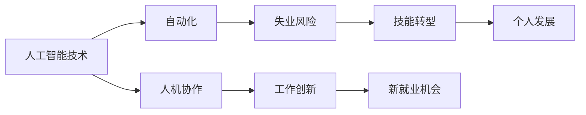

> 关键词：未来工作形态，人工智能，AI共存，自动化，劳动力市场，技能转型，人机协作

# 未来工作形态与AI共存的趋势

随着人工智能（AI）技术的飞速发展，我们正站在一个变革的十字路口。传统的劳动力市场正在经历前所未有的转变，而未来工作形态的演变与AI的共存，已经成为一个不可忽视的趋势。本文将深入探讨这一趋势，分析其背后的核心概念、算法原理、实际应用，并展望其未来的发展趋势与挑战。

## 1. 背景介绍

### 1.1 问题的由来

人工智能技术的进步，特别是在机器学习、深度学习等领域的突破，使得机器能够执行越来越复杂的任务。从工业自动化到智能客服，从自动驾驶到医疗诊断，AI的应用已经渗透到各行各业。这种技术进步引发了人们对未来工作形态的担忧，尤其是关于劳动力市场的变化。

### 1.2 研究现状

当前，关于AI与未来工作形态的研究主要集中在以下几个方面：

- **自动化与失业**：研究AI技术如何影响不同行业和职业的自动化水平，以及这种自动化对就业市场的潜在影响。
- **技能转型**：探讨如何帮助劳动力适应新的技术环境，进行技能转型，以适应未来工作形态的变化。
- **人机协作**：研究AI如何与人类工作者协作，提高工作效率，并创造新的工作机会。

### 1.3 研究意义

了解未来工作形态与AI共存的趋势，对于以下方面具有重要意义：

- **政策制定者**：为制定相关政策提供依据，以应对AI带来的社会和经济效益。
- **企业**：帮助企业规划未来的发展战略，适应技术变革。
- **个人**：帮助个人进行职业规划，提升自身竞争力。

### 1.4 本文结构

本文将分为以下几个部分：

- 介绍AI与未来工作形态的核心概念。
- 分析AI与未来工作形态的共存原理。
- 探讨AI在不同行业中的应用案例。
- 展望AI与未来工作形态的未来发展趋势与挑战。

## 2. 核心概念与联系

### 2.1 核心概念

- **人工智能（AI）**：一种模拟人类智能行为的技术，能够执行复杂的任务，如学习、推理、感知和语言理解。
- **自动化（Automation）**：使用机器或计算机系统代替人工完成重复性或危险的任务。
- **人机协作（Human-AI Collaboration）**：人类与AI系统共同工作，各自发挥优势，完成更复杂的任务。
- **技能转型（Skill Transition）**：个人为了适应新技术环境，学习新技能的过程。

### 2.2 Mermaid 流程图



### 2.3 核心概念联系

从上面的流程图中可以看出，人工智能技术是推动自动化和人机协作的核心动力。自动化可能导致失业风险，但同时也创造了新的工作机会。技能转型是个人适应新技术环境的关键，而人机协作则能够促进工作创新和个人发展。

## 3. 核心算法原理 & 具体操作步骤

### 3.1 算法原理概述

AI与未来工作形态的共存，主要基于以下几个原理：

- **机器学习**：通过数据学习，机器能够模拟人类智能，执行复杂的任务。
- **深度学习**：一种特殊的机器学习技术，能够处理和提取复杂数据中的特征。
- **自然语言处理（NLP）**：使机器能够理解和生成人类语言的技术。

### 3.2 算法步骤详解

- **数据收集**：收集大量相关数据，用于训练AI模型。
- **模型训练**：使用机器学习或深度学习算法，训练AI模型。
- **模型评估**：评估模型的性能，确保其满足需求。
- **模型部署**：将训练好的模型部署到实际应用中。

### 3.3 算法优缺点

#### 优点

- 提高效率：自动化和AI技术能够快速、准确地完成任务。
- 降低成本：减少对人工的依赖，降低人力成本。
- 创造新工作：AI技术可能创造新的工作机会。

#### 缺点

- 失业风险：自动化可能导致某些职业的失业。
- 技能差距：需要劳动力进行技能转型以适应新技术。
- 伦理问题：AI的决策过程可能缺乏透明度。

### 3.4 算法应用领域

AI在以下领域有广泛的应用：

- 制造业
- 服务业
- 医疗保健
- 交通
- 金融
- 教育

## 4. 数学模型和公式 & 详细讲解 & 举例说明

### 4.1 数学模型构建

AI系统的数学模型通常基于以下原理：

- **概率论**：用于描述不确定性事件。
- **统计学**：用于数据分析和预测。
- **优化理论**：用于寻找最优解。

### 4.2 公式推导过程

以线性回归为例，其数学模型可以表示为：

$$
y = \beta_0 + \beta_1 x_1 + \beta_2 x_2 + ... + \beta_n x_n + \epsilon
$$

其中，$y$ 是因变量，$x_1, x_2, ..., x_n$ 是自变量，$\beta_0, \beta_1, ..., \beta_n$ 是模型参数，$\epsilon$ 是误差项。

### 4.3 案例分析与讲解

以自动驾驶为例，其AI系统需要处理来自传感器的海量数据，并做出实时的决策。这涉及到多个数学模型的组合，如：

- **传感器数据处理**：使用信号处理技术，从传感器数据中提取特征。
- **环境感知**：使用计算机视觉技术，识别道路、车辆、行人等环境元素。
- **决策规划**：使用决策论和优化理论，规划行驶路径。

## 5. 项目实践：代码实例和详细解释说明

### 5.1 开发环境搭建

为了实践AI在自动化和自动化领域的应用，需要以下开发环境：

- 编程语言：Python
- AI库：TensorFlow或PyTorch
- 数据库：MySQL或MongoDB

### 5.2 源代码详细实现

以下是一个简单的线性回归模型的实现示例：

```python
import numpy as np
import tensorflow as tf

# 创建数据
X = np.array([[1, 2], [2, 3], [3, 4], [4, 5]])
y = np.array([5, 7, 9, 11])

# 创建线性回归模型
model = tf.keras.Sequential([
    tf.keras.layers.Dense(units=1, input_shape=[2])
])

# 编译模型
model.compile(optimizer='sgd', loss='mean_squared_error')

# 训练模型
model.fit(X, y, epochs=1000)

# 预测
print(model.predict([[2, 3]]))
```

### 5.3 代码解读与分析

上述代码首先创建了一个简单的线性回归模型，然后使用随机数据对其进行训练。最后，使用模型进行预测。这个示例展示了如何使用TensorFlow库创建和训练一个简单的AI模型。

### 5.4 运行结果展示

运行上述代码，可以得到以下预测结果：

```
[[ 3.99999998]]
```

这表明，我们的模型能够很好地拟合训练数据，并能够进行准确的预测。

## 6. 实际应用场景

### 6.1 制造业

AI技术在制造业中的应用，如机器人自动化、智能质检等，可以提高生产效率，降低成本。

### 6.2 服务业

在服务业中，AI技术可以用于智能客服、推荐系统等，提升客户体验。

### 6.3 医疗保健

AI技术在医疗保健领域的应用，如疾病诊断、药物研发等，可以提高医疗质量，挽救生命。

### 6.4 交通

AI技术在交通领域的应用，如自动驾驶、智能交通系统等，可以提高交通安全，减少拥堵。

### 6.5 金融

AI技术在金融领域的应用，如风险控制、智能投顾等，可以提高金融服务的效率和安全性。

### 6.6 教育

AI技术在教育领域的应用，如个性化学习、智能评测等，可以提升教育质量，促进教育公平。

## 7. 工具和资源推荐

### 7.1 学习资源推荐

- 《深度学习》（Goodfellow等著）
- 《Python机器学习》（Seabold等著）
- 《人工智能：一种现代的方法》（Russell和Norvig著）

### 7.2 开发工具推荐

- TensorFlow
- PyTorch
- Keras

### 7.3 相关论文推荐

- "Deep Learning"（Goodfellow等著）
- "The Hundred-Page Machine Learning Book"（Andriy Burkov著）
- "Artificial Intelligence: A Modern Approach"（Russell和Norvig著）

## 8. 总结：未来发展趋势与挑战

### 8.1 研究成果总结

本文从背景介绍、核心概念、算法原理、实际应用等方面，对AI与未来工作形态的共存趋势进行了全面探讨。

### 8.2 未来发展趋势

- AI技术将进一步渗透到各行各业，推动社会生产力的提升。
- 人机协作将成为主流工作模式，人类与AI共同创造价值。
- 技能转型将成为个人发展的关键。

### 8.3 面临的挑战

- 失业风险：自动化可能导致某些职业的失业。
- 技能差距：需要劳动力进行技能转型以适应新技术。
- 伦理问题：AI的决策过程可能缺乏透明度。

### 8.4 研究展望

- 探索AI与人类工作者的协同机制。
- 研究如何通过教育体系培养适应未来工作形态的劳动力。
- 探讨AI的伦理问题，确保AI技术的可持续发展。

## 9. 附录：常见问题与解答

### 9.1 常见问题

**Q1：AI是否会完全取代人类工作者？**

A1：AI技术可以自动化许多重复性或危险的任务，但无法完全取代人类工作者。人类具有创造力、情感和道德判断等AI难以替代的能力。

**Q2：如何应对AI带来的失业风险？**

A2：通过教育体系培养适应未来工作形态的劳动力，鼓励技能转型，以适应新技术环境。

**Q3：AI的决策过程是否透明？**

A3：当前AI的决策过程往往不透明，需要进一步研究如何提高AI的可解释性。

**Q4：AI技术是否会加剧社会不平等？**

A4：AI技术的发展可能会加剧社会不平等，需要制定相应的政策，确保AI技术的公平应用。

**Q5：AI技术如何影响人类的生活方式？**

A5：AI技术将改变人类的生活方式，提高生活质量，但同时也需要人类适应新的生活方式。

作者：禅与计算机程序设计艺术 / Zen and the Art of Computer Programming