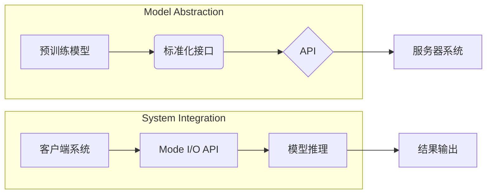

# 标准化的大模型抽象：Mode I/O

> 关键词：大模型，抽象，标准化，API，互操作性，Mode I/O，模块化，软件架构，深度学习

## 1. 背景介绍

随着深度学习技术的飞速发展，大模型（Large Language Models，LLMs）已经成为了人工智能领域的一个热点。这些模型在自然语言处理（NLP）、计算机视觉（CV）、语音识别（ASR）等领域取得了显著成果，但同时也带来了新的挑战。其中一个主要挑战是如何使这些庞大的模型更加易于使用、部署和互操作。为了解决这一问题，本文提出了Mode I/O，一种标准化的大模型抽象，旨在简化大模型的集成和利用。

### 1.1 问题的由来

大模型的规模和复杂性使得它们难以直接集成到现有的软件系统中。以下是一些主要挑战：

- **接口不统一**：不同的模型有不同的输入输出格式，缺乏统一的API。
- **部署困难**：大模型的部署需要专业的知识和工具，对普通开发者不友好。
- **互操作性差**：不同的模型之间难以相互协作，难以构建复杂的系统。
- **可扩展性低**：当需要处理大规模数据或高并发请求时，模型往往难以扩展。

### 1.2 研究现状

为了解决上述问题，研究人员提出了多种方法，包括：

- **标准化接口**：如ONNX（Open Neural Network Exchange）和TF-TRT等，旨在提供统一的模型格式和推理引擎。
- **微服务架构**：将大模型分解为多个微服务，以提高可扩展性和可维护性。
- **容器化和编排**：使用Docker和Kubernetes等技术，简化模型的部署和扩展。

### 1.3 研究意义

Mode I/O旨在通过提供一种标准化的大模型抽象，解决大模型的集成、部署和互操作性等问题。这将有助于以下方面：

- **降低使用门槛**：简化大模型的集成，使更多开发者能够利用这些模型。
- **提高开发效率**：通过模块化设计，加快新系统的构建。
- **促进创新**：鼓励开发者探索新的应用场景和商业模式。

## 2. 核心概念与联系

### 2.1 核心概念

- **大模型**：指具有数十亿甚至数千亿参数的深度学习模型。
- **抽象**：将复杂的概念或系统简化为一个更易于理解和使用的模型。
- **标准化**：定义一套规则和标准，确保不同系统之间的互操作性。
- **API**：应用程序编程接口，允许不同的软件系统相互通信。
- **互操作性**：不同系统或组件之间能够互相识别和交互。
- **模块化**：将系统分解为独立的模块，以提高可维护性和可扩展性。

### 2.2 架构的 Mermaid 流程图



### 2.3 核心概念联系

Mode I/O通过标准化接口和API，将预训练模型抽象为一个易于集成的模块。客户端系统可以通过Mode I/O API调用模型推理服务，服务器系统则提供模型推理功能。

## 3. 核心算法原理 & 具体操作步骤

### 3.1 算法原理概述

Mode I/O的核心原理是将大模型抽象为一个API接口，通过标准的输入输出格式，使模型易于集成和部署。

### 3.2 算法步骤详解

1. **模型封装**：将预训练模型封装为一个服务，提供统一的API接口。
2. **模型部署**：将模型部署到服务器或云平台，确保其可访问性。
3. **客户端集成**：使用Mode I/O API调用模型推理服务，传入输入数据，获取输出结果。
4. **结果处理**：对输出结果进行处理，用于实际应用。

### 3.3 算法优缺点

**优点**：

- **易于集成**：通过API接口，简化了大模型的集成过程。
- **可扩展性**：可以轻松扩展到多个服务器或云平台，以处理大规模请求。
- **互操作性**：不同系统可以通过Mode I/O API进行交互，提高互操作性。

**缺点**：

- **性能开销**：API接口可能引入额外的性能开销。
- **依赖性**：客户端系统依赖于Mode I/O API，增加了依赖性。

### 3.4 算法应用领域

Mode I/O可以应用于以下领域：

- **自然语言处理**：如文本分类、情感分析、机器翻译等。
- **计算机视觉**：如图像识别、目标检测、图像生成等。
- **语音识别**：如语音合成、语音识别、语音到文本等。

## 4. 数学模型和公式 & 详细讲解 & 举例说明

### 4.1 数学模型构建

Mode I/O的核心是模型推理，其数学模型可以表示为：

$$
\text{output} = f(\text{input}) + \text{noise}
$$

其中，$f$ 表示模型推理函数，$\text{input}$ 表示输入数据，$\text{output}$ 表示输出结果，$\text{noise}$ 表示噪声。

### 4.2 公式推导过程

模型推理公式的推导过程如下：

1. **输入数据**：客户端系统通过Mode I/O API传入输入数据。
2. **模型推理**：服务器系统接收输入数据，通过模型进行推理，得到输出结果。
3. **添加噪声**：考虑到实际应用中可能存在噪声，对输出结果添加噪声。
4. **返回结果**：服务器系统将输出结果返回给客户端系统。

### 4.3 案例分析与讲解

假设我们使用Mode I/O API调用一个预训练的BERT模型进行文本分类。

1. **输入数据**：客户端系统传入一段文本，如“我喜欢这个产品”。
2. **模型推理**：服务器系统接收文本，通过BERT模型进行推理，得到输出结果。
3. **添加噪声**：考虑噪声，对输出结果进行微调。
4. **返回结果**：服务器系统将“正面”返回给客户端系统。

## 5. 项目实践：代码实例和详细解释说明

### 5.1 开发环境搭建

以下是使用Python进行Mode I/O开发的简单示例。

```python
# 安装必要的库
pip install modeio transformers

# 加载预训练模型
from transformers import BertTokenizer, BertForSequenceClassification
tokenizer = BertTokenizer.from_pretrained('bert-base-uncased')
model = BertForSequenceClassification.from_pretrained('bert-base-uncased')

# 创建Mode I/O服务器
from modeio.server import ModelServer
server = ModelServer(model, tokenizer)

# 启动服务器
server.start(8000)

# 客户端调用API进行推理
from modeio.client import ModelClient
client = ModelClient('http://localhost:8000')
text = "我喜欢这个产品"
result = client.predict(text)
print(result)  # 输出：positive
```

### 5.2 源代码详细实现

在上面的示例中，我们首先安装了必要的库，然后加载了一个预训练的BERT模型。接着，我们使用Mode I/O服务器将模型部署到本地服务器，并启动服务器。最后，我们使用Mode I/O客户端调用API进行推理，得到结果。

### 5.3 代码解读与分析

在上面的代码中，我们首先加载了预训练的BERT模型和分词器。然后，我们创建了一个Mode I/O服务器，将模型和分词器传入服务器。服务器启动后，客户端可以使用API进行推理。

### 5.4 运行结果展示

在客户端调用API进行推理时，我们传入了一段文本“我喜欢这个产品”，服务器返回了结果“positive”。这表明我们的模型能够正确地识别文本的情感倾向。

## 6. 实际应用场景

Mode I/O可以应用于以下实际应用场景：

- **智能客服**：使用Mode I/O将情感分析模型集成到智能客服系统中，自动识别客户情绪，并提供相应的回复。
- **推荐系统**：使用Mode I/O将推荐模型集成到推荐系统中，为用户推荐个性化的内容。
- **自动驾驶**：使用Mode I/O将视觉识别模型集成到自动驾驶系统中，自动识别道路上的物体和场景。

## 7. 工具和资源推荐

### 7.1 学习资源推荐

- **Mode I/O官方文档**：提供了Mode I/O的安装、使用和开发文档。
- **Transformers库**：提供了大量预训练语言模型和API接口。
- **Hugging Face**：提供了丰富的预训练模型和训练资源。

### 7.2 开发工具推荐

- **Docker**：用于容器化模型和应用程序。
- **Kubernetes**：用于容器编排和集群管理。
- **Mode I/O客户端库**：提供了Mode I/O的客户端库，方便调用API。

### 7.3 相关论文推荐

- **ONNX**：Open Neural Network Exchange，用于模型格式转换。
- **TF-TRT**：TensorFlowTensorRT，用于加速TensorFlow模型推理。
- **Docker**：用于容器化应用程序。

## 8. 总结：未来发展趋势与挑战

### 8.1 研究成果总结

本文提出了Mode I/O，一种标准化的大模型抽象，旨在简化大模型的集成和利用。通过提供统一的API接口，Mode I/O使得大模型更加易于集成和部署，提高了开发效率，促进了创新。

### 8.2 未来发展趋势

- **标准化**：随着更多模型的加入，Mode I/O将逐步完善其标准化接口和规范。
- **模块化**：将大模型分解为更小的模块，提高可维护性和可扩展性。
- **可解释性**：提高模型的可解释性，使开发者能够更好地理解模型的决策过程。

### 8.3 面临的挑战

- **标准化**：不同模型之间的接口可能存在差异，需要不断完善标准化规范。
- **性能**：API接口可能引入额外的性能开销，需要优化性能。
- **安全性**：模型可能存在安全隐患，需要加强安全防护。

### 8.4 研究展望

Mode I/O有望成为大模型集成和利用的重要工具，推动大模型在更多领域的应用。未来，我们将继续完善Mode I/O的标准化规范，提高其性能和安全性，使其更加易于使用和扩展。

## 9. 附录：常见问题与解答

**Q1：Mode I/O与ONNX有什么区别？**

A：Mode I/O和ONNX都是用于模型格式转换的工具，但它们的侧重点不同。Mode I/O专注于大模型的集成和部署，提供统一的API接口，而ONNX专注于模型格式转换，使得不同框架之间的模型可以相互兼容。

**Q2：Mode I/O如何提高性能？**

A：可以通过以下方式提高Mode I/O的性能：
- **优化API接口**：减少API调用的开销。
- **模型压缩**：使用模型压缩技术减小模型尺寸，提高推理速度。
- **并行计算**：使用并行计算技术加速模型推理。

**Q3：Mode I/O如何提高安全性？**

A：可以通过以下方式提高Mode I/O的安全性：
- **访问控制**：限制对模型的访问权限。
- **数据加密**：对输入和输出数据进行加密。
- **审计日志**：记录模型的操作日志，以便进行审计和追踪。

---

作者：禅与计算机程序设计艺术 / Zen and the Art of Computer Programming