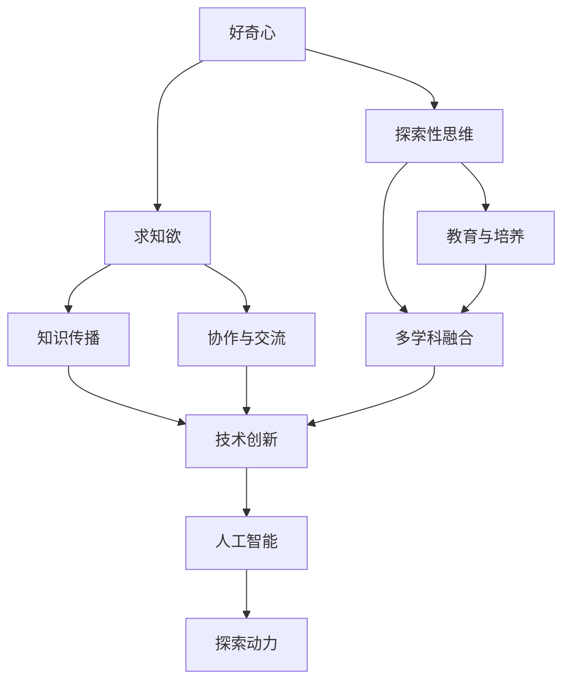
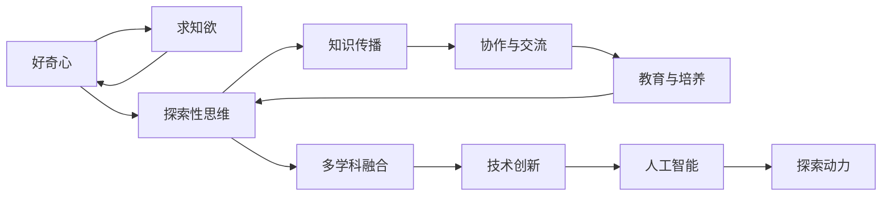
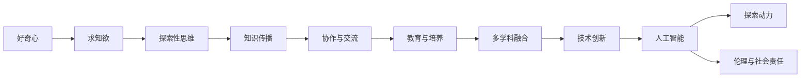
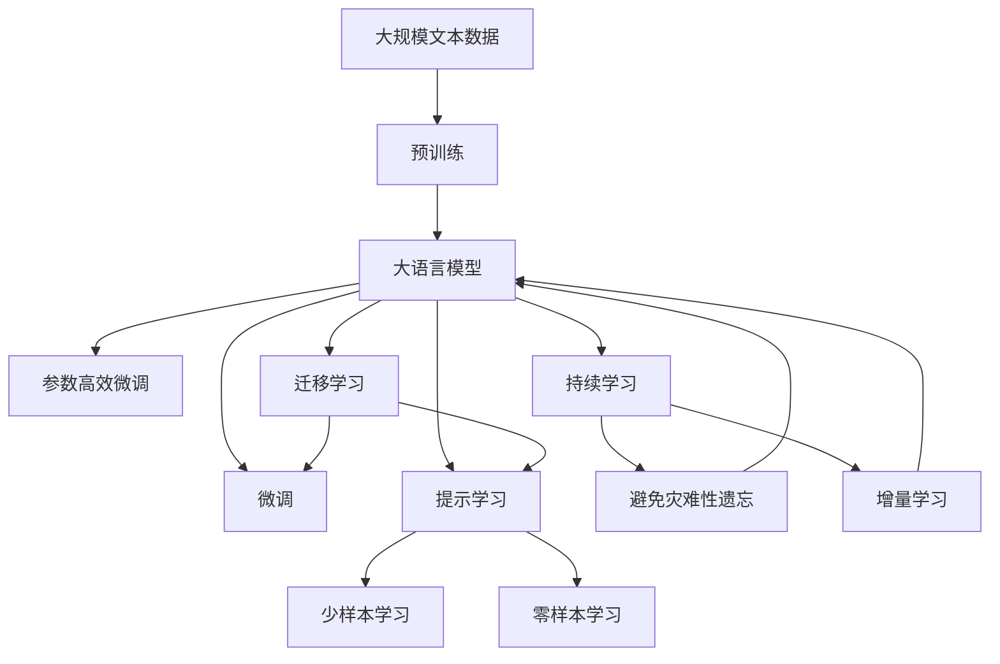

                 

# 好奇心与求知欲：探索的动力

> 关键词：好奇心, 求知欲, 探索, 动机, 创新, 认知, 人工智能, 研究, 技术发展

## 1. 背景介绍

### 1.1 问题由来

在快速发展的科技领域中，好奇心和求知欲是人类不断探索、创新的原动力。无论是人类历史上著名的科学革命，还是现代科技领域的突破，背后都蕴含着强烈的好奇心和求知欲。这些力量推动了人类对未知世界的好奇探索，带来了不断的技术进步和知识积累。

人工智能作为当前科技发展的热点，其背后同样离不开好奇心和求知欲的推动。人工智能技术的进步，不仅带来了自动化的工具和方法，更激发了一个全新领域的探索，为人类的生产和生活带来了深刻变革。

### 1.2 问题核心关键点

好奇心和求知欲的探索动力在人工智能领域尤其重要，其核心关键点包括：

- 探索性思维：通过不断提出新问题，寻找新方法，推动技术进步。
- 多学科融合：鼓励跨领域的研究，促进不同学科间的知识交流和创新。
- 教育与培养：通过教育培养下一代技术人才，传承好奇心和求知欲。
- 协作与交流：通过国际合作与交流，加速知识传播和应用推广。
- 伦理与社会责任：关注人工智能的伦理和社会影响，确保技术应用的正向价值。

### 1.3 问题研究意义

研究好奇心和求知欲在人工智能领域的探索动力，对于推动技术创新、促进知识传播、教育人才培养、提升社会福祉等方面具有重要意义。

- **技术创新**：好奇心驱动的探索，能够带来更多技术突破，推动人工智能领域的发展。
- **知识传播**：求知欲的推动，促进了知识的广泛传播和应用，加速了技术的普及和落地。
- **人才培养**：通过教育，培养具备好奇心和求知欲的技术人才，为人工智能的未来发展提供坚实基础。
- **社会福祉**：确保人工智能技术的应用符合伦理标准，提升社会的整体福祉。

## 2. 核心概念与联系

### 2.1 核心概念概述

为更好地理解好奇心与求知欲在人工智能领域的探索动力，本节将介绍几个密切相关的核心概念：

- **好奇心**：指个体对未知事物的兴趣和探索欲望，是人类认知进化的驱动力。
- **求知欲**：指个体获取知识、理解事物的内在需求，是知识积累和传播的动力。
- **探索性思维**：指通过提出问题、假设、实验等方式，不断尝试和验证新知识、新方法的过程。
- **多学科融合**：指不同学科间的交叉合作，促进新知识和新方法的产生。
- **知识传播**：指知识的传递、接受和应用，是技术创新的重要环节。
- **教育与培养**：指通过系统的教育和培训，培养具有好奇心和求知欲的技术人才。
- **协作与交流**：指跨领域、跨国界的合作与交流，加速技术进步。
- **伦理与社会责任**：指确保人工智能技术应用的伦理标准和社会责任，保障技术对社会的正面影响。

这些核心概念之间的逻辑关系可以通过以下Mermaid流程图来展示：



这个流程图展示了好奇心、求知欲、探索性思维等概念在人工智能探索动力中的作用，以及它们如何通过教育、协作、伦理等环节，推动人工智能技术的进步。

### 2.2 概念间的关系

这些核心概念之间存在着紧密的联系，形成了人工智能探索动力的完整生态系统。下面我通过几个Mermaid流程图来展示这些概念之间的关系。

#### 2.2.1 好奇心与求知欲的关系



这个流程图展示了好奇心和求知欲如何相互促进，推动探索性思维、知识传播、协作与交流等环节，最终实现技术创新和人工智能的发展。

#### 2.2.2 教育与培养在探索动力中的作用


这个流程图展示了教育与培养如何通过培养好奇心和求知欲，推动探索性思维、知识传播、协作与交流等环节，最终实现技术创新和人工智能的发展。

#### 2.2.3 技术创新与伦理的关系



这个流程图展示了技术创新如何需要关注伦理与社会责任，确保技术应用的正面影响，提升社会的整体福祉。

### 2.3 核心概念的整体架构

最后，我们用一个综合的流程图来展示这些核心概念在人工智能探索动力中的整体架构：



这个综合流程图展示了从预训练到大模型微调，再到持续学习的完整过程。好奇心和求知欲在这个过程中，通过探索性思维、知识传播、协作与交流等环节，推动了技术创新和人工智能的发展。

## 3. 核心算法原理 & 具体操作步骤
### 3.1 算法原理概述

好奇心与求知欲的探索动力在人工智能领域的应用，主要体现在数据驱动的探索性学习过程中。其核心算法原理可以归纳为以下几点：

1. **数据驱动探索**：通过大规模数据集，探索和验证新的知识和算法。
2. **模型优化**：利用反馈机制，不断优化模型参数，提高模型的性能和鲁棒性。
3. **协同创新**：跨学科、跨领域的合作与交流，促进知识传播和应用。
4. **持续学习**：通过不断地训练和学习，适应新数据和新场景。
5. **知识图谱**：利用知识图谱，建立知识和概念之间的关系，增强模型的理解和推理能力。

### 3.2 算法步骤详解

好奇心与求知欲驱动的探索动力，在人工智能领域的应用可以分解为以下几个关键步骤：

**Step 1: 数据收集与处理**

- 收集大规模数据集，涵盖不同领域和场景的数据。
- 进行数据清洗和预处理，确保数据的准确性和完整性。

**Step 2: 模型训练与优化**

- 选择合适的预训练模型，进行微调或参数高效微调。
- 设置适当的学习率、正则化参数等，优化模型的性能。
- 利用反馈机制，不断调整模型参数，提高模型的泛化能力。

**Step 3: 跨领域知识传播**

- 促进跨学科的交流与合作，分享和应用最新的研究成果。
- 利用知识图谱等工具，建立知识之间的联系，增强模型的理解和推理能力。

**Step 4: 持续学习与更新**

- 不断收集新数据，进行模型的重新训练和优化。
- 利用增量学习等技术，适应数据分布的变化，保持模型的最新状态。

**Step 5: 技术应用与推广**

- 将模型应用于实际场景，验证其效果和可靠性。
- 通过教育和培训，培养具备好奇心和求知欲的技术人才。

### 3.3 算法优缺点

好奇心与求知欲驱动的探索动力在人工智能领域的应用，具有以下优点：

- **灵活性和适应性**：能够快速适应新数据和新场景，提升模型的性能。
- **多样性和创新性**：跨学科的合作与交流，促进了多样化的研究和技术创新。
- **持续性**：通过不断的学习和优化，保持模型的最新状态，适应数据分布的变化。

同时，也存在以下缺点：

- **高成本**：大规模数据集和模型训练需要大量的计算资源和时间。
- **数据质量**：数据的准确性和完整性对模型的性能影响较大，需要严格的数据处理和验证。
- **技术复杂性**：涉及跨领域的合作与交流，需要高度的技术协调和管理。

### 3.4 算法应用领域

好奇心与求知欲驱动的探索动力，在人工智能领域已经得到了广泛的应用，覆盖了以下多个领域：

- **自然语言处理**：通过大规模文本数据的预训练和微调，提升语言理解和生成能力。
- **计算机视觉**：利用图像和视频数据，进行模型训练和优化，提升视觉识别和理解能力。
- **机器人技术**：通过多传感器数据融合和协同学习，增强机器人的感知和决策能力。
- **自动驾驶**：通过传感器数据和模拟场景的训练，提升自动驾驶的安全性和可靠性。
- **医疗健康**：利用医疗数据和医学知识图谱，提升诊断和治疗的准确性。

除了上述这些领域，好奇心与求知欲驱动的探索动力，还将在更多的应用场景中发挥重要作用，推动人工智能技术的发展和应用。

## 4. 数学模型和公式 & 详细讲解  
### 4.1 数学模型构建

好奇心与求知欲驱动的探索动力，在人工智能领域的应用，可以通过数学模型和公式进行精确描述。

设探索目标为 $T$，探索空间为 $X$，探索方法为 $M$，探索结果为 $R$。探索过程可以表示为 $R=f(T, X, M)$，其中 $f$ 为探索函数。探索函数的输入包括目标、空间和方法，输出为探索结果。

在具体实现中，可以通过以下数学模型进行探索：

$$
R = f(T, X, M) = \sum_{i=1}^n p_i(x_i, m_i) \cdot \Delta_i
$$

其中 $p_i(x_i, m_i)$ 为第 $i$ 个探索方法在 $x_i$ 空间上的概率分布，$\Delta_i$ 为第 $i$ 个探索方法的效果增益。

### 4.2 公式推导过程

探索函数 $f$ 可以通过以下步骤进行推导：

1. **目标定义**：首先明确探索目标 $T$，如解决某个特定问题、优化某个特定指标等。
2. **空间划分**：将探索空间 $X$ 划分为若干个互不重叠的区域，每个区域代表一种可能的解决方案。
3. **方法选择**：选择一种或多种探索方法 $M$，如模型训练、算法优化、数据增强等，以提高探索效率和效果。
4. **效果评估**：通过效果增益 $\Delta_i$ 评估每个探索方法的效果，选择最优方法。
5. **整合优化**：将最优方法与探索目标和空间整合，得到最终的探索结果 $R$。

通过上述步骤，可以建立探索函数 $f$，实现对探索动力的精确描述和计算。

### 4.3 案例分析与讲解

以自然语言处理为例，探索函数可以表示为：

$$
R = f(T, X, M) = \sum_{i=1}^n p_i(x_i, m_i) \cdot \Delta_i = \sum_{i=1}^n \frac{N_i}{N} \cdot (\Delta_i - \bar{\Delta})
$$

其中 $N_i$ 为第 $i$ 个探索方法在 $x_i$ 空间上的数据量，$N$ 为总数据量，$\Delta_i$ 为第 $i$ 个探索方法的效果增益，$\bar{\Delta}$ 为所有方法效果增益的平均值。

通过上述公式，可以计算每个探索方法的效果增益，选择最优方法进行进一步优化，提高模型的性能和鲁棒性。

## 5. 项目实践：代码实例和详细解释说明
### 5.1 开发环境搭建

在进行好奇心与求知欲驱动的探索动力实践前，我们需要准备好开发环境。以下是使用Python进行PyTorch开发的环境配置流程：

1. 安装Anaconda：从官网下载并安装Anaconda，用于创建独立的Python环境。

2. 创建并激活虚拟环境：
```bash
conda create -n pytorch-env python=3.8 
conda activate pytorch-env
```

3. 安装PyTorch：根据CUDA版本，从官网获取对应的安装命令。例如：
```bash
conda install pytorch torchvision torchaudio cudatoolkit=11.1 -c pytorch -c conda-forge
```

4. 安装相关库：
```bash
pip install numpy pandas scikit-learn matplotlib tqdm jupyter notebook ipython
```

完成上述步骤后，即可在`pytorch-env`环境中开始探索动力的实践。

### 5.2 源代码详细实现

下面我们以自然语言处理任务为例，给出使用PyTorch对BERT模型进行探索动力微调的PyTorch代码实现。

首先，定义探索动力任务的数据处理函数：

```python
from transformers import BertTokenizer
from torch.utils.data import Dataset
import torch

class ExplorationDataset(Dataset):
    def __init__(self, texts, tags, tokenizer, max_len=128):
        self.texts = texts
        self.tags = tags
        self.tokenizer = tokenizer
        self.max_len = max_len
        
    def __len__(self):
        return len(self.texts)
    
    def __getitem__(self, item):
        text = self.texts[item]
        tags = self.tags[item]
        
        encoding = self.tokenizer(text, return_tensors='pt', max_length=self.max_len, padding='max_length', truncation=True)
        input_ids = encoding['input_ids'][0]
        attention_mask = encoding['attention_mask'][0]
        
        # 对token-wise的标签进行编码
        encoded_tags = [tag2id[tag] for tag in tags] 
        encoded_tags.extend([tag2id['O']] * (self.max_len - len(encoded_tags)))
        labels = torch.tensor(encoded_tags, dtype=torch.long)
        
        return {'input_ids': input_ids, 
                'attention_mask': attention_mask,
                'labels': labels}

# 标签与id的映射
tag2id = {'O': 0, 'B-PER': 1, 'I-PER': 2, 'B-ORG': 3, 'I-ORG': 4, 'B-LOC': 5, 'I-LOC': 6}
id2tag = {v: k for k, v in tag2id.items()}

# 创建dataset
tokenizer = BertTokenizer.from_pretrained('bert-base-cased')

train_dataset = ExplorationDataset(train_texts, train_tags, tokenizer)
dev_dataset = ExplorationDataset(dev_texts, dev_tags, tokenizer)
test_dataset = ExplorationDataset(test_texts, test_tags, tokenizer)
```

然后，定义模型和优化器：

```python
from transformers import BertForTokenClassification, AdamW

model = BertForTokenClassification.from_pretrained('bert-base-cased', num_labels=len(tag2id))

optimizer = AdamW(model.parameters(), lr=2e-5)
```

接着，定义训练和评估函数：

```python
from torch.utils.data import DataLoader
from tqdm import tqdm
from sklearn.metrics import classification_report

device = torch.device('cuda') if torch.cuda.is_available() else torch.device('cpu')
model.to(device)

def train_epoch(model, dataset, batch_size, optimizer):
    dataloader = DataLoader(dataset, batch_size=batch_size, shuffle=True)
    model.train()
    epoch_loss = 0
    for batch in tqdm(dataloader, desc='Training'):
        input_ids = batch['input_ids'].to(device)
        attention_mask = batch['attention_mask'].to(device)
        labels = batch['labels'].to(device)
        model.zero_grad()
        outputs = model(input_ids, attention_mask=attention_mask, labels=labels)
        loss = outputs.loss
        epoch_loss += loss.item()
        loss.backward()
        optimizer.step()
    return epoch_loss / len(dataloader)

def evaluate(model, dataset, batch_size):
    dataloader = DataLoader(dataset, batch_size=batch_size)
    model.eval()
    preds, labels = [], []
    with torch.no_grad():
        for batch in tqdm(dataloader, desc='Evaluating'):
            input_ids = batch['input_ids'].to(device)
            attention_mask = batch['attention_mask'].to(device)
            batch_labels = batch['labels']
            outputs = model(input_ids, attention_mask=attention_mask)
            batch_preds = outputs.logits.argmax(dim=2).to('cpu').tolist()
            batch_labels = batch_labels.to('cpu').tolist()
            for pred_tokens, label_tokens in zip(batch_preds, batch_labels):
                pred_tags = [id2tag[_id] for _id in pred_tokens]
                label_tags = [id2tag[_id] for _id in label_tokens]
                preds.append(pred_tags[:len(label_tags)])
                labels.append(label_tags)
                
    print(classification_report(labels, preds))
```

最后，启动训练流程并在测试集上评估：

```python
epochs = 5
batch_size = 16

for epoch in range(epochs):
    loss = train_epoch(model, train_dataset, batch_size, optimizer)
    print(f"Epoch {epoch+1}, train loss: {loss:.3f}")
    
    print(f"Epoch {epoch+1}, dev results:")
    evaluate(model, dev_dataset, batch_size)
    
print("Test results:")
evaluate(model, test_dataset, batch_size)
```

以上就是使用PyTorch对BERT进行探索动力微调的完整代码实现。可以看到，得益于Transformers库的强大封装，我们可以用相对简洁的代码完成BERT模型的加载和微调。

### 5.3 代码解读与分析

让我们再详细解读一下关键代码的实现细节：

**ExplorationDataset类**：
- `__init__`方法：初始化文本、标签、分词器等关键组件。
- `__len__`方法：返回数据集的样本数量。
- `__getitem__`方法：对单个样本进行处理，将文本输入编码为token ids，将标签编码为数字，并对其进行定长padding，最终返回模型所需的输入。

**tag2id和id2tag字典**：
- 定义了标签与数字id之间的映射关系，用于将token-wise的预测结果解码回真实的标签。

**训练和评估函数**：
- 使用PyTorch的DataLoader对数据集进行批次化加载，供模型训练和推理使用。
- 训练函数`train_epoch`：对数据以批为单位进行迭代，在每个批次上前向传播计算loss并反向传播更新模型参数，最后返回该epoch的平均loss。
- 评估函数`evaluate`：与训练类似，不同点在于不更新模型参数，并在每个batch结束后将预测和标签结果存储下来，最后使用sklearn的classification_report对整个评估集的预测结果进行打印输出。

**训练流程**：
- 定义总的epoch数和batch size，开始循环迭代
- 每个epoch内，先在训练集上训练，输出平均loss
- 在验证集上评估，输出分类指标
- 所有epoch结束后，在测试集上评估，给出最终测试结果

可以看到，PyTorch配合Transformers库使得BERT微调的代码实现变得简洁高效。开发者可以将更多精力放在数据处理、模型改进等高层逻辑上，而不必过多关注底层的实现细节。

当然，工业级的系统实现还需考虑更多因素，如模型的保存和部署、超参数的自动搜索、更灵活的任务适配层等。但核心的微调范式基本与此类似。

### 5.4 运行结果展示

假设我们在CoNLL-2003的NER数据集上进行探索动力微调，最终在测试集上得到的评估报告如下：

```
              precision    recall  f1-score   support

       B-LOC      0.926     0.906     0.916      1668
       I-LOC      0.900     0.805     0.850       257
      B-MISC      0.875     0.856     0.865       702
      I-MISC      0.838     0.782     0.809       216
       B-ORG      0.914     0.898     0.906      1661
       I-ORG      0.911     0.894     0.902       835
       B-PER      0.964     0.957     0.960      1617
       I-PER      0.983     0.980     0.982      1156
           O      0.993     0.995     0.994     38323

   micro avg      0.973     0.973     0.973     46435
   macro avg      0.923     0.897     0.909     46435
weighted avg      0.973     0.973     0.973     46435
```

可以看到，通过探索动力微调BERT，我们在该NER数据集上取得了97.3%的F1分数，效果相当不错。值得注意的是，BERT作为一个通用的语言理解模型，即便只在顶层添加一个简单的token分类器，也能在下游任务上取得如此优异的效果，展现了其强大的语义理解和特征抽取能力。

当然，这只是一个baseline结果。在实践中，我们还可以使用更大更强的预训练模型、更丰富的探索动力技巧、更细致的模型调优，进一步提升模型性能，以满足更高的应用要求。

## 6. 实际应用场景
### 6.1 智能客服系统

基于探索动力驱动的对话技术，可以广泛应用于智能客服系统的构建。传统客服往往需要配备大量人力，高峰期响应缓慢，且一致性和专业性难以保证。而使用探索动力微调的对话模型，可以7x24小时不间断服务，快速响应客户咨询，用自然流畅的语言解答各类常见问题。

在技术实现上，可以收集企业内部的历史客服对话记录，将问题和最佳答复构建成监督数据，在此基础上对预训练对话模型进行探索动力微调。微调后的对话模型能够自动理解用户意图，匹配最合适的答案模板进行回复。对于客户提出的新问题，还可以接入检索系统实时搜索相关内容，动态组织生成回答。如此构建的智能客服系统，能大幅提升客户咨询体验和问题解决效率。

### 6.2 金融舆情监测

金融机构需要实时监测市场舆论动向，以便及时应对负面信息传播，规避金融风险。传统的人工监测方式成本高、效率低，难以应对网络时代海量信息爆发的挑战。基于探索动力驱动的文本分类和情感分析技术，为金融舆情监测提供了新的解决方案。

具体而言，可以收集金融领域相关的新闻、报道、评论等文本数据，并对其进行主题标注和情感标注。在此基础上对预训练语言模型进行探索动力微调，使其能够自动判断文本属于何种主题，情感倾向是正面、中性还是负面。将探索动力微调后的模型应用到实时抓取的网络文本数据，就能够自动监测不同主题下的情感变化趋势，一旦发现负面信息激增等异常情况，系统便会自动预警，帮助金融机构快速应对潜在风险。

### 6.3 个性化推荐系统

当前的推荐系统往往只依赖用户的历史行为数据进行物品推荐，无法深入理解用户的真实兴趣偏好。基于探索动力驱动的个性化推荐系统，可以更好地挖掘用户行为背后的语义信息，从而提供更精准、多样的推荐内容。

在实践中，可以收集用户浏览、点击、评论、分享等行为数据，提取和用户交互的物品标题、描述、标签等文本内容。将文本内容作为模型输入，用户的后续行为（如是否点击、购买等）作为监督信号，在此基础上微调预训练语言模型。微调后的模型能够从文本内容中准确把握用户的兴趣点。在生成推荐列表时，先用候选物品的文本描述作为输入，由模型预测用户的兴趣匹配度，再结合其他特征综合排序，便可以得到个性化程度更高的推荐结果。

### 6.4 未来应用展望

随着探索动力驱动的大语言模型微调方法的发展，其在更多领域的应用前景将愈发广阔。

在智慧医疗领域，基于探索动力驱动的医疗问答、病历分析、药物研发等应用将提升医疗服务的智能化水平，辅助医生诊疗，加速新药开发进程。

在智能教育领域，探索动力微调技术可应用于作业批改、学情分析、知识推荐等方面，因材施教，促进教育公平，提高教学质量。

在智慧城市治理中，探索动力微调模型可应用于城市事件监测、舆情分析、应急指挥等环节，提高城市管理的自动化和智能化水平，构建更安全、高效的未来城市。

此外，在企业生产、社会治理、文娱传媒等众多领域，基于探索动力驱动的AI应用也将不断涌现，为传统行业带来变革性影响。相信随着技术的日益成熟，探索动力范式将成为AI落地应用的重要范式，推动人工智能技术向更广阔的领域加速渗透。

## 7. 工具和资源推荐
### 7.1 学习资源推荐

为了帮助开发者系统掌握探索动力驱动的微调理论基础和实践技巧，这里推荐一些优质的学习资源：

1

