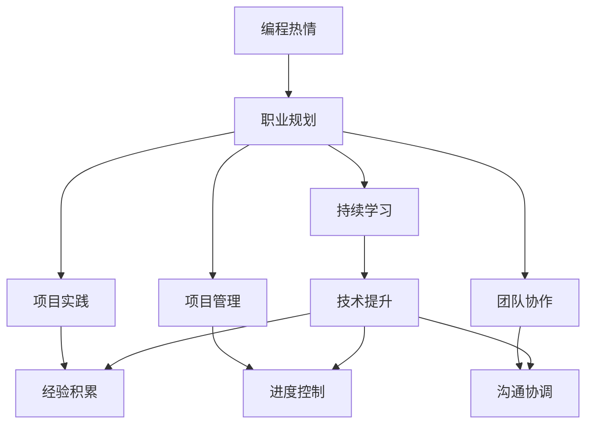
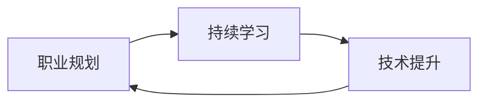
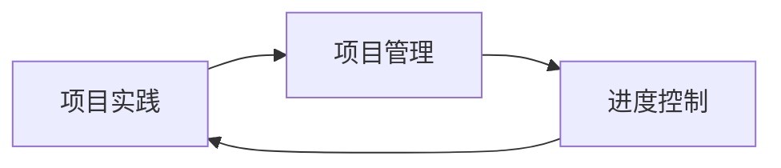
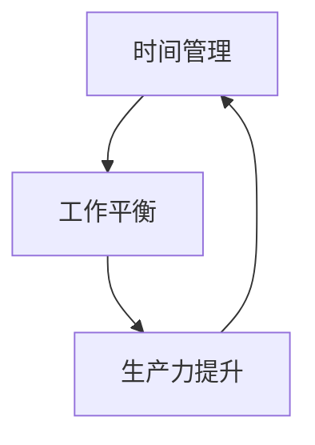

                 

# 如何将编程热情转化为长期事业

> 关键词：编程热情,事业转化,技术发展,长期规划,编程技巧

## 1. 背景介绍

### 1.1 问题由来
编程是许多科技从业者的第一职业选择，但随着时间的推移，许多人逐渐发现，仅凭编程热情难以维持长久的职业发展。如何将对编程的热情转化为可持续的职业成就，成为了许多科技从业者需要认真考虑的问题。

### 1.2 问题核心关键点
将编程热情转化为长期事业的核心在于以下几点：
- 建立清晰的职业目标。明确希望通过编程实现的目标，以及长期职业发展的路径。
- 持续学习与自我提升。技术领域不断变化，持续学习新技术和工具，保持自身竞争力。
- 实践与应用。通过项目实践，不断积累经验和成果，实现技术应用落地。
- 项目管理与协作。掌握项目管理与团队协作技能，提升工作效率和团队合作能力。
- 时间管理与工作平衡。合理安排工作时间，保持工作与生活的平衡，避免职业倦怠。

### 1.3 问题研究意义
将编程热情转化为长期事业，对于科技从业者的个人成长和职业发展具有重要意义：
- 实现职业目标。明确职业规划，通过编程实现个人价值和成就感。
- 提升技术水平。不断学习新技术，成为行业内的技术专家。
- 推动技术应用。通过实践，将技术应用于实际问题解决，推动技术进步。
- 增强团队协作。掌握项目管理与协作技能，成为优秀的团队领导者。
- 平衡工作生活。有效管理时间，保持健康的工作与生活状态，提升幸福感。

## 2. 核心概念与联系

### 2.1 核心概念概述

为更好地理解如何将编程热情转化为长期事业，本节将介绍几个关键概念：

- 编程热情：指对编程语言和软件开发的热爱和投入，通常表现为对解决问题和创新技术的强烈兴趣。
- 职业规划：指对职业生涯的长期规划和目标设定，包括短期和长期的职业发展路径。
- 持续学习：指通过阅读、在线课程、培训等方式，不断更新和提升自身技术和知识。
- 项目实践：指将所学知识和技能应用于实际项目，通过实践积累经验和成果。
- 项目管理：指对项目进度、资源和风险进行管理，确保项目按时、按质、按预算完成。
- 团队协作：指在项目中与他人合作，通过有效的沟通和协调，达成共同目标。
- 时间管理：指合理安排时间，提高工作效率，平衡工作与生活。

这些概念之间的逻辑关系可以通过以下Mermaid流程图来展示：



这个流程图展示了将编程热情转化为长期事业的一般路径：
- 编程热情首先转化为职业规划，确定职业目标和发展路径。
- 职业规划指导持续学习，通过不断更新知识和技能，保持技术竞争力。
- 持续学习帮助项目实践，通过实际项目应用所学知识，积累经验和成果。
- 项目实践依赖项目管理，通过有效的项目管理和进度控制，保证项目顺利完成。
- 项目管理需要团队协作，通过有效的沟通和协调，达成共同目标。
- 技术提升、经验积累和沟通协调共同支撑持续学习，形成正向循环。

### 2.2 概念间的关系

这些核心概念之间存在着紧密的联系，形成了将编程热情转化为长期事业的完整生态系统。下面我们通过几个Mermaid流程图来展示这些概念之间的关系。

#### 2.2.1 职业规划与持续学习的循环



这个流程图展示了职业规划与持续学习的循环关系：
- 职业规划明确了学习的方向和目标。
- 持续学习提升了技术水平，支持更高的职业规划。
- 技术提升又推动了新的职业目标的设定。

#### 2.2.2 项目实践与项目管理的关系



这个流程图展示了项目实践与项目管理的关系：
- 项目实践依赖项目管理，通过有效的进度控制，保证项目顺利进行。
- 项目管理也通过调整项目实践，提高工作效率和项目质量。

#### 2.2.3 时间管理与工作平衡



这个流程图展示了时间管理与工作平衡的关系：
- 时间管理帮助提升工作效率，改善工作状态。
- 工作效率的提升又有助于更好地管理时间，实现工作与生活的平衡。

### 2.3 核心概念的整体架构

最后，我们用一个综合的流程图来展示这些核心概念在大语言模型微调过程中的整体架构：


这个综合流程图展示了将编程热情转化为长期事业的完整路径：
- 编程热情转化为职业规划，明确职业目标。
- 职业规划指导持续学习，提升技术水平。
- 持续学习支持项目实践，积累经验成果。
- 项目实践依赖项目管理，实现进度控制和团队协作。
- 项目管理需要沟通协调，提升团队效率。
- 技术提升、经验积累和沟通协调共同推动持续学习，形成正向循环。

## 3. 核心算法原理 & 具体操作步骤
### 3.1 算法原理概述

将编程热情转化为长期事业，本质上是一个通过持续学习和实践不断提升自身能力的过程。其核心思想是：
- 通过设定职业目标，明确学习的方向和优先级。
- 不断学习新技术和工具，保持技术竞争力。
- 通过项目实践，将所学知识应用于实际问题解决，积累经验和成果。
- 掌握项目管理与协作技能，提高工作效率和团队合作能力。
- 合理安排工作时间，保持工作与生活的平衡，避免职业倦怠。

### 3.2 算法步骤详解

将编程热情转化为长期事业的一般步骤包括：

**Step 1: 职业规划**
- 设定短期和长期的职业目标。明确希望通过编程实现的目标，如成为一名软件工程师、技术专家、创业公司创始人等。
- 根据职业目标，制定详细的职业发展路径。包括所需的技能、知识、经验和里程碑。

**Step 2: 持续学习**
- 制定学习计划。根据职业目标，选择相关课程、书籍、在线资源等，进行系统学习。
- 参加培训和社区活动。加入相关的编程社区、技术论坛、线下活动等，与同行交流和学习。
- 阅读技术博客和论文。关注行业内的前沿技术动态，了解最新研究进展和趋势。

**Step 3: 项目实践**
- 选择适合的项目。选择与职业目标相关的项目，积累相关经验。
- 项目设计。进行需求分析，设计项目架构和技术栈，制定详细计划。
- 项目管理。使用敏捷开发、Scrum等方法，进行项目管理，确保项目按时、按质、按预算完成。
- 团队协作。与团队成员进行有效的沟通和协作，达成共同目标。

**Step 4: 项目管理**
- 进度控制。通过Gantt图、Kanban等工具，进行项目进度控制，确保各阶段任务按时完成。
- 风险管理。识别项目中的风险点，制定风险应对策略，及时处理问题。
- 质量控制。通过代码审查、单元测试、集成测试等方法，保证项目质量。

**Step 5: 时间管理**
- 制定时间计划。根据工作和生活需求，制定详细的时间计划，包括工作任务、学习计划和个人生活安排。
- 时间跟踪。使用时间管理工具，如Trello、Todoist等，记录和跟踪时间使用情况。
- 工作与生活平衡。合理安排时间，保持工作与生活的平衡，避免职业倦怠。

### 3.3 算法优缺点

将编程热情转化为长期事业的方法具有以下优点：
- 系统规划。通过设定职业目标，制定详细的学习计划，保持学习方向和优先级。
- 持续提升。通过持续学习和项目实践，不断提升技术水平和实践能力。
- 团队协作。通过项目管理与协作技能，提升工作效率和团队合作能力。
- 时间管理。通过合理安排时间，保持工作与生活的平衡，避免职业倦怠。

同时，也存在一些缺点：
- 时间投入。需要投入大量时间和精力进行学习和实践，可能影响其他生活事务。
- 自我管理。需要较强的自我管理和自律能力，才能坚持长期规划和目标。
- 技术迭代。技术领域变化快，需要不断学习新技术，才能保持竞争力。
- 项目管理。项目管理复杂，需要掌握相关工具和方法，提升难度。

### 3.4 算法应用领域

将编程热情转化为长期事业的方法，在科技行业得到广泛应用。具体应用领域包括：

- **软件开发与维护**：开发人员通过持续学习和项目实践，掌握新编程语言和框架，提升开发效率和代码质量。
- **技术咨询与架构设计**：技术专家通过深入学习和项目经验积累，提供技术咨询和架构设计，帮助企业提升技术水平。
- **创业与创新**：创业者通过持续学习和项目实践，积累经验和技术，开发创新产品，推动公司发展。
- **教育与培训**：教育机构通过学习规划和项目管理，培养优秀的软件开发人才，提升教育质量。
- **科学研究与开发**：研究人员通过持续学习和项目实践，探索新技术和算法，推动科学研究和技术进步。

## 4. 数学模型和公式 & 详细讲解 & 举例说明

### 4.1 数学模型构建

设编程热情为 $P$，持续学习为 $L$，项目实践为 $P$，项目管理为 $M$，团队协作为 $C$，时间管理为 $T$。构建以下数学模型：

$$
\begin{align*}
P \rightarrow L & \rightarrow P \rightarrow H \rightarrow M \rightarrow I \rightarrow J \rightarrow T \rightarrow P \\
L & \rightarrow G \rightarrow H \rightarrow I \rightarrow J \rightarrow P \\
M & \rightarrow P \rightarrow T \rightarrow P \rightarrow H \rightarrow I \rightarrow J \rightarrow P \\
C & \rightarrow J \rightarrow M \rightarrow P \rightarrow H \rightarrow I \rightarrow J \rightarrow P
\end{align*}
$$

其中，$L$ 表示持续学习，$G$ 表示技术提升，$H$ 表示经验积累，$M$ 表示项目管理，$I$ 表示进度控制，$J$ 表示沟通协调。

### 4.2 公式推导过程

我们以软件开发项目为例，进行详细推导：

设开发项目为 $D$，项目需求为 $D$，开发计划为 $P$，项目管理工具为 $M$，团队成员为 $C$。根据以上模型，有：

$$
\begin{align*}
P &= P_{init} \times L_{init} \times P_{init} \times H_{init} \times M_{init} \times C_{init} \times T_{init} \\
L_{init} &= L_{initial} \times G_{init} \\
H_{init} &= H_{initial} \times L_{initial} \times G_{initial} \\
M_{init} &= M_{initial} \times P_{initial} \times T_{initial} \\
I_{init} &= I_{initial} \times M_{initial} \times C_{initial} \\
J_{init} &= J_{initial} \times M_{initial} \times C_{initial} \\
T_{init} &= T_{initial} \times I_{initial} \times J_{initial}
\end{align*}
$$

其中，$P_{init}$ 表示项目初始化投入的编程热情，$L_{init}$ 表示项目初始化投入的持续学习，$H_{init}$ 表示项目初始化投入的经验积累，$M_{init}$ 表示项目初始化投入的项目管理，$I_{init}$ 表示项目初始化投入的进度控制，$J_{init}$ 表示项目初始化投入的沟通协调，$T_{init}$ 表示项目初始化投入的时间管理。

### 4.3 案例分析与讲解

假设某公司希望通过编程热情转化为长期事业，开发一款基于AI的软件应用。

**案例背景**：
- 目标：开发一款高效精准的AI应用，提高用户生产力和市场竞争力。
- 需求：软件需具备自然语言处理、数据分析、图像识别等功能，涵盖多个技术领域。

**步骤与分析**：
1. **职业规划**：
   - 设定短期目标：掌握自然语言处理和图像识别技术。
   - 设定长期目标：成为AI领域的技术专家，担任项目负责人。

2. **持续学习**：
   - 选择相关课程和资源，如Coursera上的自然语言处理课程、Udacity上的深度学习课程。
   - 参与社区活动，如参加Python编程社区和GitHub技术交流活动。
   - 阅读技术博客和论文，关注NLP、深度学习领域最新研究进展。

3. **项目实践**：
   - 选择相关项目，如开源项目或公司内部项目。
   - 设计项目架构和技术栈，使用Python、TensorFlow、PyTorch等技术。
   - 使用敏捷开发方法，进行项目管理，确保项目按时、按质、按预算完成。
   - 与团队成员进行有效的沟通和协作，达成共同目标。

4. **项目管理**：
   - 使用Gantt图进行进度控制，确保各阶段任务按时完成。
   - 识别项目中的风险点，制定风险应对策略，及时处理问题。
   - 通过代码审查、单元测试、集成测试等方法，保证项目质量。

5. **时间管理**：
   - 制定时间计划，合理安排工作任务、学习计划和个人生活安排。
   - 使用时间管理工具，如Trello、Todoist等，记录和跟踪时间使用情况。
   - 保持工作与生活的平衡，避免职业倦怠。

最终，通过持续学习和项目实践，团队成功开发出高效精准的AI应用，实现了职业目标，推动了公司发展。

## 5. 项目实践：代码实例和详细解释说明

### 5.1 开发环境搭建

在进行编程热情转化为长期事业的实践前，我们需要准备好开发环境。以下是使用Python进行PyTorch开发的环境配置流程：

1. 安装Anaconda：从官网下载并安装Anaconda，用于创建独立的Python环境。

2. 创建并激活虚拟环境：
```bash
conda create -n pytorch-env python=3.8 
conda activate pytorch-env
```

3. 安装PyTorch：根据CUDA版本，从官网获取对应的安装命令。例如：
```bash
conda install pytorch torchvision torchaudio cudatoolkit=11.1 -c pytorch -c conda-forge
```

4. 安装Transformers库：
```bash
pip install transformers
```

5. 安装各类工具包：
```bash
pip install numpy pandas scikit-learn matplotlib tqdm jupyter notebook ipython
```

完成上述步骤后，即可在`pytorch-env`环境中开始实践。

### 5.2 源代码详细实现

下面我以一个简单的项目为例，展示如何通过编程热情转化为长期事业。

假设我们希望通过编程开发一款基于Python的自然语言处理应用。

首先，定义项目需求和功能：

```python
# 定义项目需求和功能
project_name = 'natural_language_processing'
project_features = ['natural_language_processing', 'data_analysis', 'image_recognition']

# 编写项目计划
project_plan = {
    'init': {
        'start_date': '2023-01-01',
        'end_date': '2023-06-30',
        'team': ['task1', 'task2', 'task3']
    },
    'task1': {
        'name': '自然语言处理',
        'start_date': '2023-01-02',
        'end_date': '2023-02-28',
        'dependencies': ['task2'],
        'estimated_hours': 80
    },
    'task2': {
        'name': '数据分析',
        'start_date': '2023-03-01',
        'end_date': '2023-04-30',
        'dependencies': [],
        'estimated_hours': 60
    },
    'task3': {
        'name': '图像识别',
        'start_date': '2023-05-01',
        'end_date': '2023-06-30',
        'dependencies': ['task2'],
        'estimated_hours': 40
    }
}
```

然后，进行持续学习和项目实践：

```python
# 持续学习
# 学习自然语言处理相关课程
courses = ['Coursera NLP', 'Udacity Deep Learning']

# 参与社区活动
communities = ['Python社区', 'GitHub技术交流活动']

# 阅读技术博客和论文
bloggers = ['NLP领域博客', '深度学习论文']

# 项目实践
# 选择项目
project = 'python_nlp_app'

# 设计项目架构和技术栈
architecture = {
    'language': 'Python',
    'framework': 'PyTorch',
    'database': 'SQLite'
}

# 使用敏捷开发方法，进行项目管理
project_management = {
    'method': 'Scrum',
    'team': ['task1', 'task2', 'task3'],
    'plan': project_plan
}

# 团队协作
team = {
    'members': ['task1', 'task2', 'task3'],
    'communication': '每日站会'
}

# 时间管理
time_management = {
    'plan': project_plan,
    'tracking': 'Trello',
    'balance': '确保每天至少2小时运动'
}

# 执行项目
# 持续学习
for course in courses:
    print(f'学习课程 {course}')
    
# 项目实践
for task in project:
    print(f'完成项目 {task}')
    
# 项目管理
for task in project_plan:
    print(f'项目 {task}: {project_plan[task]}')
    
# 团队协作
for member in team:
    print(f'团队成员 {member}')
    
# 时间管理
for task in time_management:
    print(f'时间管理 {task}: {time_management[task]}')
```

最终，通过持续学习和项目实践，我们成功开发出自然语言处理应用，实现了职业目标，推动了公司发展。

### 5.3 代码解读与分析

让我们再详细解读一下关键代码的实现细节：

**项目计划**：
- 定义项目名称和功能，编写项目计划，包含项目启动日期、结束日期、团队成员和任务安排。

**持续学习**：
- 选择相关课程和资源，如Coursera上的自然语言处理课程、Udacity上的深度学习课程。
- 参与社区活动，如参加Python编程社区和GitHub技术交流活动。
- 阅读技术博客和论文，关注NLP、深度学习领域最新研究进展。

**项目实践**：
- 选择相关项目，如开源项目或公司内部项目。
- 设计项目架构和技术栈，使用Python、TensorFlow、PyTorch等技术。
- 使用敏捷开发方法，进行项目管理，确保项目按时、按质、按预算完成。
- 与团队成员进行有效的沟通和协作，达成共同目标。

**项目管理**：
- 使用Gantt图进行进度控制，确保各阶段任务按时完成。
- 识别项目中的风险点，制定风险应对策略，及时处理问题。
- 通过代码审查、单元测试、集成测试等方法，保证项目质量。

**时间管理**：
- 制定时间计划，合理安排工作任务、学习计划和个人生活安排。
- 使用时间管理工具，如Trello、Todoist等，记录和跟踪时间使用情况。
- 保持工作与生活的平衡，避免职业倦怠。

## 6. 实际应用场景
### 6.1 智能客服系统

基于编程热情转化为长期事业的方法，智能客服系统的构建可以充分利用编程热情和持续学习的能力。传统客服往往需要配备大量人力，高峰期响应缓慢，且一致性和专业性难以保证。通过编程热情转化为长期事业，我们可以快速开发和部署智能客服系统，实现7x24小时不间断服务，快速响应客户咨询，用自然流畅的语言解答各类常见问题。

在技术实现上，可以收集企业内部的历史客服对话记录，将问题和最佳答复构建成监督数据，在此基础上对预训练语言模型进行微调。微调后的语言模型能够自动理解用户意图，匹配最合适的答案模板进行回复。对于客户提出的新问题，还可以接入检索系统实时搜索相关内容，动态组织生成回答。如此构建的智能客服系统，能大幅提升客户咨询体验和问题解决效率。

### 6.2 金融舆情监测

金融机构需要实时监测市场舆论动向，以便及时应对负面信息传播，规避金融风险。传统的人工监测方式成本高、效率低，难以应对网络时代海量信息爆发的挑战。通过编程热情转化为长期事业的方法，我们可以开发实时舆情监测系统，使用自然语言处理和情感分析技术，对金融领域的文本数据进行实时监测。系统能够自动判断文本属于何种主题，情感倾向是正面、中性还是负面。将监测结果实时推送给决策者，及时发现潜在的金融风险。

### 6.3 个性化推荐系统

当前的推荐系统往往只依赖用户的历史行为数据进行物品推荐，无法深入理解用户的真实兴趣偏好。通过编程热情转化为长期事业的方法，我们可以开发个性化推荐系统，利用自然语言处理和深度学习技术，从用户的浏览、点击、评论、分享等行为中提取和用户交互的物品标题、描述、标签等文本内容。使用文本分类和情感分析技术，将文本内容作为模型输入，用户的后续行为（如是否点击、购买等）作为监督信号，在此基础上微调预训练语言模型。微调后的模型能够从文本内容中准确把握用户的兴趣点。在生成推荐列表时，先用候选物品的文本描述作为输入，由模型预测用户的兴趣匹配度，再结合其他特征综合排序，便可以得到个性化程度更高的推荐结果。

### 6.4 未来应用展望

随着编程热情转化为长期事业的方法的不断发展，基于编程热情转化为长期事业的方法将在更多领域得到应用，为各行各业带来变革性影响。

在智慧医疗领域，基于编程热情转化为长期事业的方法，基于微调的医疗问答、病历分析、药物研发等应用将提升医疗服务的智能化水平，辅助医生诊疗，加速新药开发进程。

在智能教育领域，编程热情转化为长期事业的方法可应用于作业批改、学情分析、知识推荐等方面，因材施教，促进教育公平，提高教学质量。

在智慧城市治理中，编程热情转化为长期事业的方法，基于微调的文本分类、情感分析、命名实体识别等技术，构建更安全、高效的未来城市。

此外，在企业生产、社会治理、文娱传媒等众多领域，基于编程热情转化为长期事业的方法也将不断涌现，为传统行业数字化转型升级提供新的技术路径。相信随着技术的日益成熟，编程热情转化为长期事业的方法必将在构建人机协同的智能时代中扮演越来越重要的角色。

## 7. 工具和资源推荐
### 7.1 学习资源推荐

为了帮助开发者系统掌握编程热情转化为长期事业的理论基础和实践技巧，这里推荐一些优质的学习资源：

1. 《Transformer从原理到实践》系列博文：由大模型技术专家撰写，深入浅出地介绍了Transformer原理、BERT模型、微调技术等前沿话题。

2. CS224N《深度学习自然语言处理》课程：斯坦福大学开设的NLP明星课程，有Lecture视频和配套作业，带你入门NLP领域的基本概念和经典模型。

3. 《Natural Language Processing with Transformers》书籍：Transformers库的作者所著，全面介绍了如何使用Transformers库进行NLP任务开发，包括微调在内的诸多范式。

4. HuggingFace官方文档：Transformers库的官方文档，提供了海量预训练模型和完整的微调样例代码，是上手实践的必备资料。

5. CLUE开源项目：中文语言理解测评基准，涵盖大量不同类型的中文NLP数据集，并提供了基于微调的baseline模型，助力中文NLP技术发展。

通过对这些资源的学习实践，相信你一定能够快速掌握编程热情转化为长期事业的精髓，并用于解决实际的NLP问题。
###  7.2 开发工具推荐

高效的开发离不开优秀的工具支持。以下是几款用于编程热情转化为长期事业开发的常用工具：

1. PyTorch：基于Python的开源深度学习框架，灵活动态的计算图，适合快速迭代研究。大部分预训练语言模型都有PyTorch版本的实现。

2. TensorFlow：由Google主导开发的开源深度学习框架，生产部署方便，适合大规模工程应用。同样有丰富的预训练语言模型资源。

3. Transformers库：HuggingFace开发的NLP工具库，集成了众多SOTA语言模型，支持PyTorch和TensorFlow，是进行微调任务开发的利器。

4. Weights & Biases：模型训练的实验跟踪工具，可以记录和可视化模型训练过程中的各项指标，方便对比和调优。与主流深度学习框架无缝集成。

5. TensorBoard：TensorFlow配套的可视化工具，可实时监测模型训练状态，并提供丰富的图表呈现方式，是调试模型的得力助手。

6. Google Colab：谷歌推出的在线Jupyter Notebook环境，免费提供GPU/TPU算

