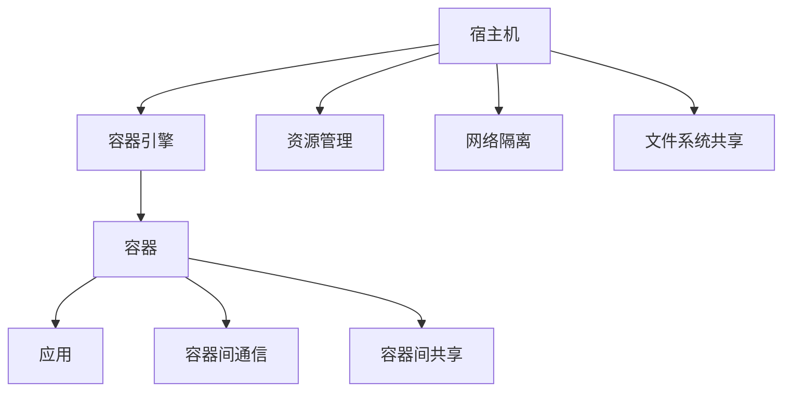
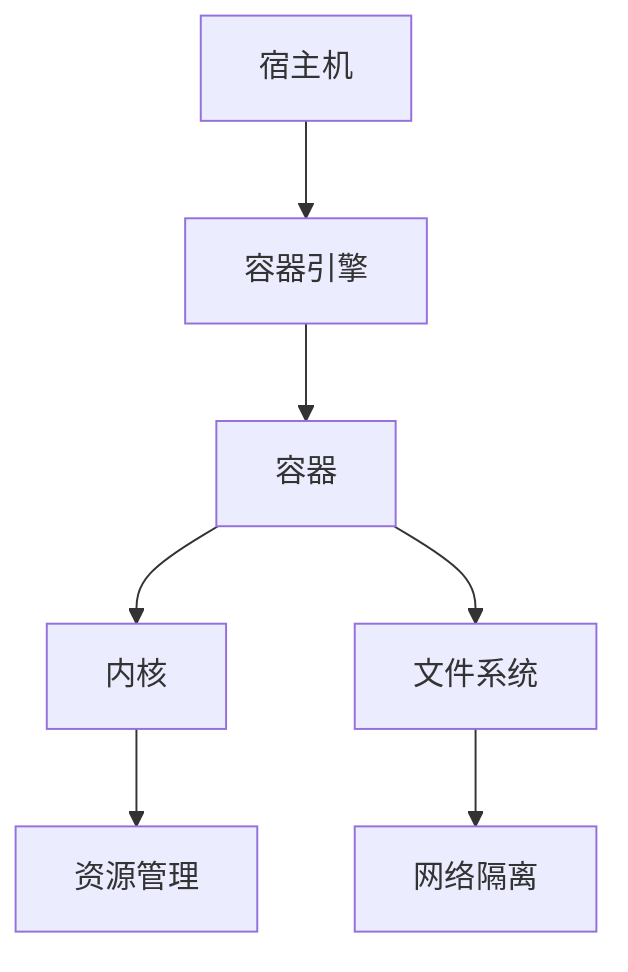
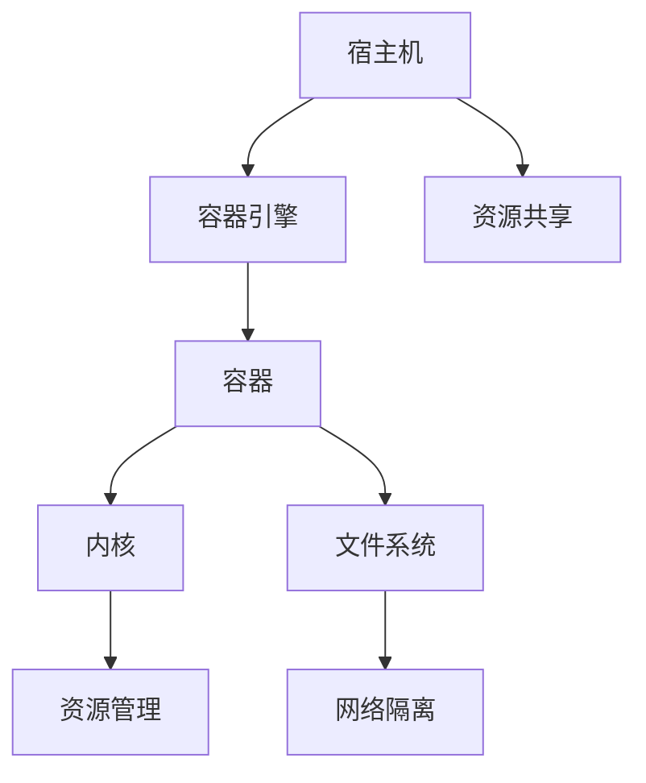

                 

# 容器 原理与代码实例讲解

## 1. 背景介绍

### 1.1 问题由来

随着云计算和微服务的普及，如何在多租户环境下安全隔离和资源复用，成为云服务提供商和用户都关注的焦点。传统的虚拟机（VM）由于资源隔离和配置复杂，已难以适应快速变化的业务需求。容器技术作为一种轻量级的资源封装机制，近年来得到了广泛应用，成为构建现代化云平台和微服务架构的重要工具。

容器技术最早由Google提出，其核心思想是将应用及其依赖打包到轻量级的运行环境中，每个容器之间相互隔离，共享底层宿主机资源。Docker是最流行的容器技术实现之一，通过其简易的操作方式、强大的性能和广泛的社区支持，迅速成为容器化的首选方案。

### 1.2 问题核心关键点

容器技术在解决多租户资源隔离、快速部署、应用弹性和持续集成等问题上展现了强大的优势，但也面临着资源复用、性能优化、服务发现和监控等挑战。以下是对容器技术核心关键点的详细介绍：

1. **资源隔离**：通过容器将应用及其依赖隔离在独立的空间中，避免相互干扰。
2. **资源复用**：容器可以共享宿主机的内核和文件系统，实现高效资源复用。
3. **快速部署**：容器镜像可以快速分发和部署，实现无缝自动化部署。
4. **应用弹性**：容器可以在宿主机之间动态迁移，实现负载均衡和弹性伸缩。
5. **持续集成**：容器支持快速迭代开发和持续集成，便于版本管理和协作开发。

这些关键点决定了容器技术的广泛应用前景，但也提出了更高的技术挑战。本节将从容器原理入手，深入探讨其核心机制和关键技术。

## 2. 核心概念与联系

### 2.1 核心概念概述

为了更好地理解容器的原理，首先介绍几个核心概念：

1. **容器**：一个轻量级的虚拟环境，用于隔离应用及其依赖。容器以镜像的形式存在，包含应用运行所需的所有文件和依赖。
2. **镜像**：容器的静态表示，类似于操作系统的映像文件。镜像包含应用及其依赖的全部文件和配置信息。
3. **宿主机**：运行容器的物理或虚拟主机，共享宿主机的内核和文件系统。
4. **守护进程**：在宿主机上运行的进程，负责创建和管理容器。
5. **容器引擎**：负责管理容器生命周期的核心软件，如Docker Engine。

这些概念构成了容器技术的核心基础，下面将详细探讨它们之间的联系和作用。

### 2.2 概念间的关系

容器技术的核心思想是通过虚拟化技术，在宿主机上创建多个独立且隔离的运行环境。通过以下Mermaid流程图，可以更清晰地理解容器技术的核心架构：



该流程图展示了容器技术的核心架构和关键组件：

1. **宿主机**：提供计算和存储资源，运行容器引擎和应用。
2. **容器引擎**：负责创建和管理容器，是容器的核心调度器。
3. **容器**：应用及其依赖的运行环境，通过镜像创建和启动。
4. **资源管理**：宿主机对容器资源进行管理和调度。
5. **网络隔离**：通过网络虚拟化技术，容器间网络隔离，避免相互干扰。
6. **文件系统共享**：容器共享宿主机的文件系统，实现高效资源复用。
7. **容器间通信**：容器间通过共享宿主机的网络空间，实现通信和协作。
8. **容器间共享**：容器间共享宿主机的资源和服务，提高资源利用率。

这些组件和组件间的关系，共同构成了容器技术的核心机制，使得容器技术能够高效、灵活地管理多租户环境下的应用资源。

## 3. 核心算法原理 & 具体操作步骤
### 3.1 算法原理概述

容器技术的核心原理在于通过虚拟化技术，将应用及其依赖封装在独立的运行环境中，从而实现资源隔离和高效资源复用。其核心思想可以概括为以下几个步骤：

1. **容器镜像构建**：将应用及其依赖打包到镜像中，镜像包含应用运行所需的所有文件和依赖。
2. **容器启动**：通过容器引擎，从镜像中创建容器，并在宿主机上运行。
3. **容器隔离**：容器通过共享宿主机的内核和文件系统，实现资源隔离，避免相互干扰。
4. **容器复用**：容器可以共享宿主机的资源和服务，实现高效资源复用。
5. **容器管理**：容器引擎负责管理容器的生命周期，包括创建、运行、删除、更新等操作。

这些步骤共同构成了容器技术的核心算法，下面将详细介绍每个步骤的具体操作和实现细节。

### 3.2 算法步骤详解

#### 3.2.1 容器镜像构建

容器镜像的构建是容器技术的第一步，也是最关键的一步。以下是一个详细的镜像构建流程：

1. **编写Dockerfile**：Dockerfile是一种文本配置文件，用于定义容器的构建步骤。Dockerfile包含从基础镜像到最终镜像的所有构建指令。

2. **构建镜像**：通过运行`docker build`命令，将Dockerfile中定义的构建指令执行，生成镜像文件。

3. **镜像验证**：通过运行`docker inspect`命令，检查镜像文件的大小、层数、标签等信息，确保镜像构建成功。

#### 3.2.2 容器启动

容器启动是将镜像文件转换为可运行容器的过程。以下是一个详细的容器启动流程：

1. **创建容器**：通过运行`docker create`命令，创建一个空的容器，指定镜像文件。

2. **启动容器**：通过运行`docker start`命令，启动容器，进入交互模式或后台模式。

3. **容器管理**：容器引擎负责管理容器的生命周期，包括创建、运行、删除、更新等操作。

#### 3.2.3 容器隔离

容器隔离是容器技术的关键特性之一，通过以下Mermaid流程图，可以更清晰地理解容器隔离的实现原理：



该流程图展示了容器隔离的实现原理：

1. **内核隔离**：容器通过共享宿主机的内核，实现资源隔离。每个容器有自己的内核空间和进程空间，相互独立。
2. **文件系统隔离**：容器通过共享宿主机的文件系统，实现高效资源复用。容器有自己的根文件系统，与宿主机的文件系统分离。
3. **网络隔离**：容器通过共享宿主机的网络空间，实现网络隔离。每个容器有自己的网络命名空间，与宿主机的网络空间分离。
4. **资源管理**：宿主机对容器资源进行管理和调度，确保容器高效运行。

这些隔离机制共同构成了容器技术的核心特性，使得容器技术能够在多租户环境下安全隔离和高效复用资源。

#### 3.2.4 容器复用

容器复用是容器技术的另一个关键特性，通过以下Mermaid流程图，可以更清晰地理解容器复用的实现原理：



该流程图展示了容器复用的实现原理：

1. **资源共享**：容器共享宿主机的资源和服务，实现高效资源复用。
2. **文件系统共享**：容器共享宿主机的文件系统，降低磁盘存储开销。
3. **网络共享**：容器共享宿主机的网络空间，降低网络开销。
4. **负载均衡**：宿主机对容器资源进行负载均衡，提高资源利用率。

这些复用机制共同构成了容器技术的核心优势，使得容器技术能够在多租户环境下实现高效资源管理和复用。

### 3.3 算法优缺点

容器技术的优势在于其轻量级、高效资源复用和灵活部署。但同时也存在一些缺点，以下是对其优缺点的详细分析：

#### 3.3.1 优点

1. **轻量级**：容器相比虚拟机，资源占用更少，启动和停止更快，性能更好。
2. **高效资源复用**：容器可以共享宿主机的资源和服务，提高资源利用率。
3. **灵活部署**：容器可以快速部署和迁移，支持弹性伸缩和自动化部署。
4. **持续集成**：容器支持快速迭代开发和持续集成，便于版本管理和协作开发。

#### 3.3.2 缺点

1. **资源隔离有限**：容器隔离机制虽然能够实现基本的资源隔离，但无法完全隔离网络和磁盘等资源，存在一定的风险。
2. **跨主机依赖**：容器依赖宿主机的操作系统和网络环境，跨主机迁移和部署可能存在问题。
3. **监控和调试困难**：容器运行在宿主机上，容器内部的监控和调试比虚拟机更困难。
4. **管理复杂度**：容器引擎需要管理和调度多个容器，管理复杂度较高。

### 3.4 算法应用领域

容器技术广泛应用于云计算、微服务、自动化部署、持续集成等领域，以下是对其应用领域的详细介绍：

1. **云计算**：容器技术是云平台的核心技术之一，用于实现高效资源管理和多租户隔离。
2. **微服务**：容器技术支持微服务的快速部署和灵活管理，使得微服务架构更加高效和可扩展。
3. **自动化部署**：容器技术支持自动化部署和持续集成，加快应用上线速度。
4. **持续集成**：容器技术支持快速迭代开发和持续集成，提高开发效率和协作水平。
5. **自动化运维**：容器技术支持自动化运维和监控，提高运维效率和系统可靠性。

这些应用领域展示了容器技术的广泛应用前景，也提出了更高的技术挑战。

## 4. 数学模型和公式 & 详细讲解 & 举例说明
### 4.1 数学模型构建

容器技术虽然在概念上不涉及复杂的数学模型，但在实际应用中，通过一些数学模型可以更好地理解和优化容器的性能。以下是对容器数学模型的详细讲解：

#### 4.1.1 容器调度算法

容器调度算法是容器引擎的核心算法之一，用于将容器调度到最合适的宿主机上运行。以下是几种常见的容器调度算法及其数学模型：

1. **公平调度算法（Fair Scheduling）**：保证每个容器的资源需求得到公平分配。

   $$
   \min \sum_{i=1}^{N} (d_i - c_i)^2
   $$

   其中，$d_i$为第$i$个容器的资源需求，$c_i$为第$i$个容器实际获得的资源。

2. **最短任务优先算法（Shortest Job First, SJF）**：优先调度资源需求最小的容器。

   $$
   \min \sum_{i=1}^{N} d_i^2
   $$

   其中，$d_i$为第$i$个容器的资源需求。

3. **最少工作量算法（Least-Work Scheduling）**：优先调度工作量最小的容器。

   $$
   \min \sum_{i=1}^{N} w_i \times d_i
   $$

   其中，$w_i$为第$i$个容器的实际工作量，$d_i$为第$i$个容器的资源需求。

这些调度算法可以帮助容器引擎更好地管理容器资源，确保容器高效运行。

#### 4.1.2 容器资源管理

容器资源管理是容器技术的核心部分，用于优化容器在宿主机上的资源使用。以下是几种常见的容器资源管理技术及其数学模型：

1. **资源限制**：限制容器在宿主机上的资源使用，防止容器过度消耗资源。

   $$
   \min \sum_{i=1}^{N} (d_i - c_i)^2
   $$

   其中，$d_i$为第$i$个容器的资源需求，$c_i$为第$i$个容器实际获得的资源。

2. **资源分配**：根据容器资源需求，分配最优的宿主机资源。

   $$
   \min \sum_{i=1}^{N} d_i \times c_i
   $$

   其中，$d_i$为第$i$个容器的资源需求，$c_i$为第$i$个容器实际获得的资源。

3. **资源共享**：通过共享宿主机的资源和服务，提高资源利用率。

   $$
   \min \sum_{i=1}^{N} (d_i - c_i)^2
   $$

   其中，$d_i$为第$i$个容器的资源需求，$c_i$为第$i$个容器实际获得的资源。

这些资源管理技术可以帮助容器引擎更好地管理容器资源，确保容器高效运行。

### 4.2 公式推导过程

#### 4.2.1 容器调度算法推导

以下是对公平调度算法的最优化推导：

假设宿主机上有$N$个容器，每个容器的资源需求为$d_i$，初始资源为$c_i$。公平调度算法的目标是最小化容器的资源需求与实际获得资源之差的平方和。

$$
\min \sum_{i=1}^{N} (d_i - c_i)^2
$$

将上述公式展开，得到：

$$
\sum_{i=1}^{N} (d_i^2 - 2d_ic_i + c_i^2)
$$

为了最小化上述公式，需要最大化$c_i$，即资源分配。因此，公平调度算法的核心在于资源分配，通过最大化$c_i$，实现资源的公平分配。

#### 4.2.2 容器资源管理推导

以下是对资源限制的最优化推导：

假设宿主机上有$N$个容器，每个容器的资源需求为$d_i$，初始资源为$c_i$。资源限制的目标是最小化容器的资源需求与实际获得资源之差的平方和。

$$
\min \sum_{i=1}^{N} (d_i - c_i)^2
$$

将上述公式展开，得到：

$$
\sum_{i=1}^{N} (d_i^2 - 2d_ic_i + c_i^2)
$$

为了最小化上述公式，需要最大化$c_i$，即资源分配。因此，资源限制的核心在于资源分配，通过最大化$c_i$，实现资源的优化分配。

### 4.3 案例分析与讲解

#### 4.3.1 容器镜像构建案例

以下是一个Dockerfile示例，用于构建一个基于Nginx的Web容器镜像：

```Dockerfile
# 指定基础镜像
FROM nginx:latest

# 更新系统包
RUN apt-get update && apt-get install -y \
    curl \
    && curl -L -o /usr/local/bin/docker-entrypoint.sh https://github.com/chaosblade-io/chaosblade/releases/download/v0.39.1/chaosblade-linux-amd64 && chmod +x /usr/local/bin/docker-entrypoint.sh

# 复制Web应用代码
COPY . /usr/share/nginx/html

# 配置Nginx
COPY conf/nginx.conf /etc/nginx/nginx.conf

# 定义Nginx启动命令
CMD ["sh", "-docker-entrypoint.sh"]
```

上述Dockerfile将基于Nginx的Web应用代码复制到容器中，并通过配置文件配置Nginx服务。最后，通过`docker build`命令构建镜像。

#### 4.3.2 容器启动案例

以下是一个Docker容器启动示例，用于启动一个基于Nginx的Web容器：

```bash
# 创建容器
docker create --name web_container -d nginx:latest

# 启动容器
docker start web_container
```

上述命令将创建并启动一个名为`web_container`的Nginx容器，并分配一个虚拟IP地址。

#### 4.3.3 容器隔离案例

以下是一个容器隔离示例，用于在多个容器中运行不同服务：

```bash
# 创建容器
docker create --name container1 -d nginx:latest
docker create --name container2 -d mysql:latest

# 启动容器
docker start container1
docker start container2

# 共享宿主机资源和服务
docker network create mynetwork
docker network connect mynetwork container1
docker network connect mynetwork container2
```

上述命令创建了两个容器，一个运行Nginx服务，另一个运行MySQL服务，并共享宿主机的资源和服务。通过网络隔离和共享，实现了资源的隔离和复用。

## 5. 项目实践：代码实例和详细解释说明
### 5.1 开发环境搭建

在进行容器项目实践前，我们需要准备好开发环境。以下是使用Docker和Kubernetes进行容器项目开发的配置流程：

1. **安装Docker**：下载并安装Docker软件包，从官网获取最新版本。

2. **安装Kubernetes**：安装Kubernetes集群，可以自行搭建或使用云服务商提供的Kubernetes服务。

3. **安装Kubernetes CLI工具**：安装kubectl CLI工具，用于管理Kubernetes集群。

4. **配置Docker与Kubernetes**：配置Docker与Kubernetes，确保它们可以无缝协作。

### 5.2 源代码详细实现

这里以一个简单的Web应用为例，使用Docker和Kubernetes进行容器化部署和扩展。

#### 5.2.1 Dockerfile编写

以下是一个基于Node.js的Web应用Dockerfile示例：

```Dockerfile
# 指定基础镜像
FROM node:latest

# 更新系统包
RUN apt-get update && apt-get install -y \
    nodejs \
    npm \
    && npm install express app

# 复制Web应用代码
COPY . /app

# 定义Web应用入口
CMD ["node", "/app/app.js"]
```

上述Dockerfile将Node.js和Express框架安装到容器中，并将Web应用代码复制到`/app`目录下。最后，通过`node`命令启动Web应用。

#### 5.2.2 容器构建和部署

以下是一个Docker容器构建和部署示例：

1. **构建Docker镜像**

   ```bash
   docker build -t my-web-app .
   ```

   上述命令将构建一个名为`my-web-app`的Docker镜像。

2. **部署Docker容器**

   ```bash
   docker run -p 8080:80 my-web-app
   ```

   上述命令将在宿主机上启动一个运行Node.js Web应用的Docker容器，并映射8080端口到宿主机的80端口。

3. **部署到Kubernetes集群**

   ```yaml
   apiVersion: apps/v1
   kind: Deployment
   metadata:
     name: my-web-app
     labels:
       hello: world
   spec:
     replicaCount: 3
     selector:
       matchLabels:
         hello: world
     template:
       metadata:
         labels:
           hello: world
       spec:
         containers:
         - name: my-web-app
           image: my-web-app
           ports:
           - containerPort: 8080
   ```

   上述YAML文件定义了一个名为`my-web-app`的Kubernetes Deployment，包含3个Pod副本，每个Pod运行一个Docker容器，并映射8080端口到宿主机的80端口。

#### 5.2.3 Kubernetes Deployment启动

以下是一个Kubernetes Deployment启动示例：

1. **创建Kubernetes Deployment**

   ```bash
   kubectl apply -f deployment.yaml
   ```

   上述命令将创建Kubernetes Deployment，并启动Pod副本。

2. **检查Kubernetes Deployment状态**

   ```bash
   kubectl get pods
   ```

   上述命令将列出所有Pod的运行状态，确保容器正在运行。

#### 5.2.4 Kubernetes服务暴露

以下是一个Kubernetes服务暴露示例：

1. **创建Kubernetes Service**

   ```yaml
   apiVersion: v1
   kind: Service
   metadata:
     name: my-web-app
     labels:
       hello: world
   spec:
     type: LoadBalancer
     selector:
       hello: world
     ports:
     - protocol: TCP
       port: 80
       targetPort: 8080
   ```

   上述YAML文件定义了一个名为`my-web-app`的Kubernetes Service，将Pod的服务暴露到外网。

2. **检查Kubernetes Service状态**

   ```bash
   kubectl get svc
   ```

   上述命令将列出所有Service的运行状态，确保服务已暴露。

3. **访问Kubernetes服务**

   ```bash
   kubectl get svc
   ```

   上述命令将列出所有Service的运行状态，确保服务已暴露。

### 5.3 代码解读与分析

#### 5.3.1 Dockerfile代码解读

Dockerfile是一种文本配置文件，用于定义容器的构建步骤。以下是对Dockerfile各指令的详细解读：

1. `FROM nginx:latest`：指定基础镜像为Nginx的最新版本。

2. `RUN apt-get update && apt-get install -y \n\t- curl \n\t- && curl -L -o /usr/local/bin/docker-entrypoint.sh https://github.com/chaosblade-io/chaosblade/releases/download/v0.39.1/chaosblade-linux-amd64 && chmod +x /usr/local/bin/docker-entrypoint.sh`：更新系统包，并安装curl工具和ChaosBlade软件。

3. `COPY . /usr/share/nginx/html`：将Web应用代码复制到`/usr/share/nginx/html`目录下。

4. `COPY conf/nginx.conf /etc/nginx/nginx.conf`：将Nginx配置文件复制到`/etc/nginx/nginx.conf`目录下。

5. `CMD ["sh", "-docker-entrypoint.sh"]`：定义Nginx启动命令，通过`docker-entrypoint.sh`脚本启动Nginx服务。

#### 5.3.2 Kubernetes Deployment代码解读

Kubernetes Deployment是一种资源对象，用于管理Pod副本的创建、更新和删除。以下是对Kubernetes Deployment各字段的详细解读：

1. `apiVersion: apps/v1`：指定资源对象版本为Kubernetes Apps API版本。

2. `kind: Deployment`：指定资源对象类型为Deployment。

3. `metadata: { name: "my-web-app", labels: { hello: "world" } }`：定义Deployment的元数据，包含名称和标签。

4. `spec:`：定义Deployment的规格。

5. `replicaCount: 3`：定义Pod副本的数量为3个。

6. `selector: { matchLabels: { hello: "world" } }`：定义Pod的选择器，选择符合`hello: world`标签的Pod。

7. `template:`：定义Pod的模板，包含Pod的元数据和容器定义。

8. `spec:`：定义Pod的规格。

9. `spec:`：定义Pod的容器定义。

10. `name: "my-web-app"`：定义容器的名称为`my-web-app`。

11. `image: "my-web-app"`：定义容器镜像为`my-web-app`。

12. `ports:`：定义容器的端口映射。

13. `- containerPort: 8080`：定义容器的8080端口。

14. `- port: 80`：定义宿主机的80端口。

15. `targetPort: 8080`：定义Pod的目标端口为8080端口。

### 5.4 运行结果展示

以下是Kubernetes Deployment和Service的运行结果展示：

1. **Pod列表**

   ```bash
   kubectl get pods
   ```

   上述命令将列出所有Pod的运行状态，确保容器正在运行。

2. **Pod状态**

   ```bash
   kubectl describe pod my-web-app-abcdef
   ```

   上述命令将展示Pod的详细信息，包括容器运行状态、CPU和内存使用情况等。

3. **Service状态**

   ```bash
   kubectl get svc
   ```

   上述命令将列出所有Service的运行状态，确保服务已暴露。

4. **Service状态**

   ```bash
   kubectl describe svc my-web-app
   ```

   上述命令将展示Service的详细信息，包括目标Pod和暴露的端口等。

## 6. 实际应用场景
### 6.1 智能客服系统

智能客服系统是容器技术的一个重要应用场景，通过容器化技术，可以轻松构建多租户、高可用、高弹性的智能客服系统。

在智能客服系统中，可以使用多个容器实例，每个实例运行一个客服机器人，并共享宿主机的计算和存储资源。通过容器隔离机制，可以确保每个容器独立运行，避免相互干扰。通过容器复用机制，可以提高资源利用率，降低部署和维护成本。

### 6.2 金融舆情监测

金融舆情监测是容器技术在金融领域的重要应用之一。通过容器技术，可以构建高可靠、高可扩展的金融舆情监测系统。

在金融舆情监测系统中，可以使用多个容器实例，每个实例运行一个数据处理容器和一个分析容器。通过容器隔离机制，可以确保数据处理和分析容器独立运行，避免数据泄露和分析错误。通过容器复用机制，可以提高资源利用率，降低部署和维护成本。

### 6.3 个性化推荐系统

个性化推荐系统是容器技术在电商领域的重要应用之一。通过容器技术，可以构建高可靠、高可扩展的个性化推荐系统。

在个性化推荐系统中，可以使用多个容器实例，每个实例运行一个推荐引擎容器和一个数据存储容器。通过容器隔离机制，可以确保推荐引擎容器和数据存储容器独立运行，避免数据泄露和推荐错误。

